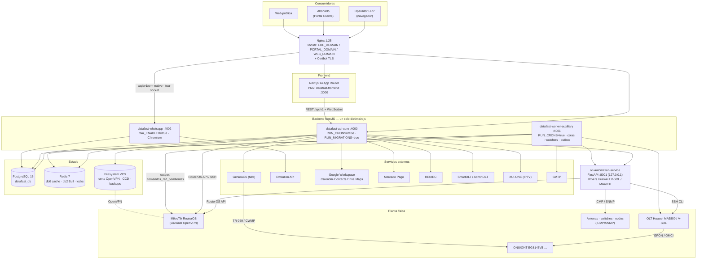
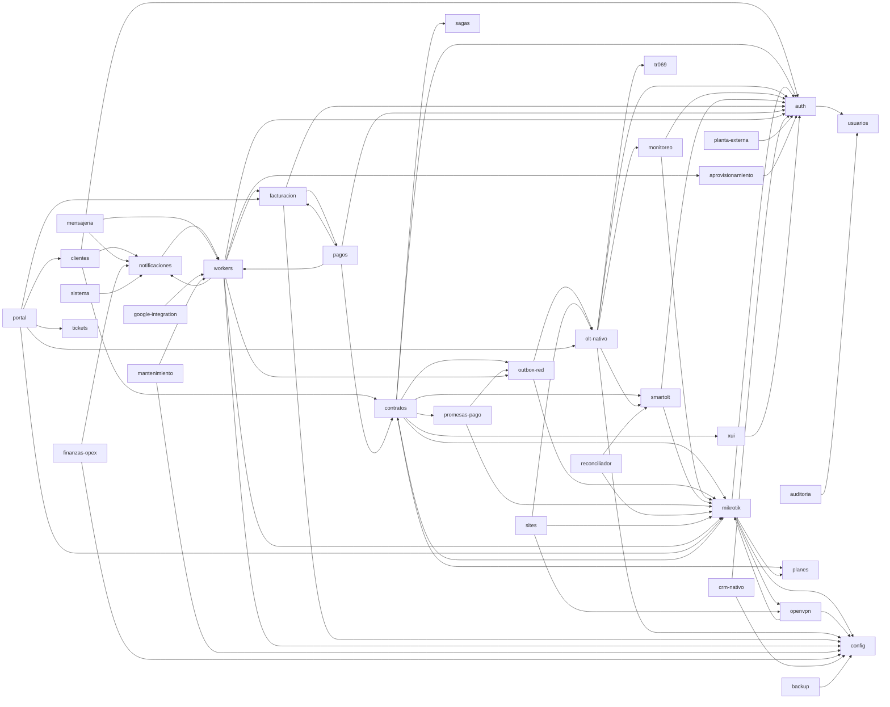
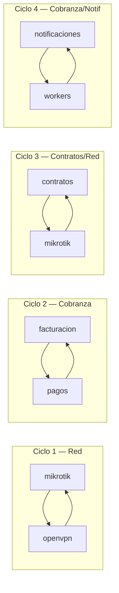

# Capítulos 1–4 — Arquitectura, Módulos, Estructura y Dependencias

---

# CAPÍTULO 1 — Arquitectura General

## 1.1 Resumen ejecutivo

ErpDatafast es un **monolito modular NestJS** (un solo binario `dist/main.js`) desplegado como
**cinco procesos PM2 diferenciados únicamente por variables de entorno**, más un **microservicio
Python/FastAPI** dedicado exclusivamente al plano de hardware (OLT y MikroTik por SSH/API), y un
**frontend Next.js 14 App Router** separado. Todo comparte una única base PostgreSQL y un único
Redis.

No es una arquitectura de microservicios: es un monolito con **un solo servicio satélite**
(`olt-automation-service`) extraído por una razón técnica concreta —las librerías de scraping
CLI de OLT (`netmiko`/`paramiko`) son del ecosistema Python— y no por una separación de dominios.

La comunicación entre módulos es **mayoritariamente por inyección de dependencias directa**
(llamada de método en proceso). Existen tres mecanismos asíncronos: colas Bull sobre Redis,
`EventEmitter2` en memoria, y un **outbox transaccional en base de datos** (`comandos_red_pendientes`)
para las operaciones contra hardware de red.

## 1.2 Stack tecnológico

### Backend (`backend/`)

| Componente | Tecnología | Versión |
|---|---|---|
| Runtime | Node.js | 20 |
| Framework | NestJS | ^10.3.0 |
| Lenguaje | TypeScript | ^5.4.5 |
| Compilador | SWC (`@swc/core` ^1.15.40) + `nest build` | — |
| ORM | TypeORM | ^0.3.20 |
| Driver BD | `pg` | ^8.11.5 |
| Colas | Bull (`@nestjs/bull`) sobre Redis db=2 | ^4.12.2 |
| Cache | `cache-manager` + `cache-manager-ioredis-yet`, Redis db=0 | ^5.4.0 |
| Scheduler | `@nestjs/schedule` (cron in-process) | ^4.1.2 |
| Eventos | `@nestjs/event-emitter` (EventEmitter2, in-process) | ^2.0.4 |
| WebSockets | `@nestjs/platform-socket.io` + `socket.io` | ^4.7.5 |
| Auth | Passport JWT + local, `@nestjs/jwt`, bcryptjs | — |
| Validación | `class-validator`, `class-transformer`, `joi` (env), `zod` | — |
| Rate limiting | `@nestjs/throttler` + `express-rate-limit` | — |
| Seguridad HTTP | `helmet`, `compression`, `morgan` | — |
| Logging | `winston` + `nest-winston` | — |
| Docs API | `@nestjs/swagger` | ^7.3.0 |
| Health | `@nestjs/terminus` | ^10.2.3 |

### Librerías de dominio / integración (backend)

| Librería | Uso en el sistema |
|---|---|
| `node-routeros` ^1.3.6 | API nativa RouterOS — pool de conexiones MikroTik (`connection-pool.service.ts`) |
| `ssh2` ^1.15.0 | SSH hacia MikroTik (usado en `firewall.service.ts`) |
| `net-snmp` ^3.11.3 | Declarada; el polling SNMP real vive en el servicio Python |
| `whatsapp-web.js` 1.34.7 | CRM WhatsApp nativo (Chromium headless) — proceso PM2 aislado |
| `telegraf` ^4.16.3 | Telegram (declarada) |
| `twilio` ^5.0.4 | SMS/WhatsApp vía Twilio (declarada) |
| `nodemailer` ^6.9.13 | SMTP (`smtp.strategy.ts`) |
| `mercadopago` ^2.0.11 | Pasarela de pago (`mercadopago.service.ts`) |
| `googleapis` ^140.0.0 | Google Workspace: Calendar, Contacts, Drive, Maps/Geocoding |
| `pdfkit` ^0.15.0 | Generación de comprobantes PDF (`pdf.service.ts`) |
| `xlsx` ^0.18.5 | Exportaciones de reportes y clientes |
| `qrcode` ^1.5.4 | QR de vinculación WhatsApp / comprobantes |
| `sharp` ^0.33.3 | Procesado de imágenes (logo empresa, foto cliente) |
| `handlebars` ^4.7.8 | Plantillas de mensajes y documentos |
| `cidr-tools`, `ip-address` | Cálculo de subredes y pools IPv4 |
| `dayjs` ^1.11.10 | Fechas (TZ `America/Lima`) |

### Servicio de automatización de red (`olt-automation-service/`)

| Componente | Tecnología |
|---|---|
| Framework | FastAPI (Python) |
| Servidor | uvicorn, `--workers 1` (deliberado: el MA5800 tiene límite bajo de sesiones VTY) |
| Drivers | `app/drivers/huawei.py`, `app/drivers/vsol.py`, `base.py` |
| Transporte a OLT | SSH (paramiko/netmiko) — scraping CLI |
| Transporte a MikroTik | API RouterOS (`mikrotik_pool.py`, `mikrotik_ops.py`) |
| Monitoreo | ICMP (`icmplib`, requiere `NET_RAW`) + SNMP (`snmp_service.py`) |
| Autenticación | API key en middleware (`OLT_AUTOMATION_INTERNAL_KEY`) |
| Exposición | `127.0.0.1:8001` — nunca público |

### Frontend (`frontend/`)

| Componente | Tecnología |
|---|---|
| Framework | Next.js 14 — App Router |
| UI | React + Tailwind CSS |
| Estado global | Zustand (`auth.store`, `empresa.store`, `portal.store`, `theme-customizer.store`) |
| Mapas | MapLibre GL (`maplibre-gl`) sobre OpenStreetMap |
| Realtime | socket.io-client (`useOltSocket`, `useMonitoreo`) |
| Middleware | `frontend/src/middleware.ts` — protección de rutas |

### Infraestructura

| Componente | Tecnología |
|---|---|
| Base de datos | PostgreSQL 16 (alpine), TZ `America/Lima`, `max_connections=100` |
| Cache/colas | Redis 7 (alpine), `maxmemory 512mb`, `allkeys-lru`, AOF `everysec` |
| Reverse proxy | Nginx 1.25 con plantillas `envsubst` — 4 vhosts |
| TLS | Certbot (renovación cada 12 h vía webroot) |
| Orquestación | Docker Compose (definido) **y** PM2 (lo realmente usado en producción) |
| VPN | OpenVPN en el VPS + túneles a cada MikroTik (`vpndatafast`) |
| WhatsApp API | Evolution API v2.2.3 (contenedor, `127.0.0.1:8080`) |
| ACS TR-069 | GenieACS (externo al compose, consumido por NBI HTTP) |

### Bases de datos y almacenes de estado

| Almacén | Uso |
|---|---|
| PostgreSQL `datafast_db` | Toda la persistencia del ERP (≈120 tablas) |
| PostgreSQL `evolution` | Base propia de Evolution API (instancias WhatsApp) |
| Redis db=0 | Cache de aplicación (`CacheModule`, TTL 300 s) |
| Redis db=2 | Colas Bull |
| Redis db=6 | Cache de Evolution API |
| Redis (keys sueltas) | Locks distribuidos (`RedisLockService`) y circuit breakers |
| Volumen `app-logs` | Logs winston |
| Volumen `evolution-data` | Sesiones WhatsApp |
| Filesystem VPS | Certificados OpenVPN, CCDs, backups `pg_dump`, uploads (logo, foto cliente, media CRM) |

## 1.3 Diagrama general



## 1.4 Topología de procesos (lo que realmente corre)

`ecosystem.config.js` es la fuente de verdad declarada. Cinco procesos:

| Proceso | Puerto | `RUN_CRONS` | `RUN_MIGRATIONS` | `WA_ENABLED` | Memoria | Rol |
|---|---|---|---|---|---|---|
| `datafast-api-core` | 4000 | `false` | **`true`** | `false` | 1 G | Atiende al frontend. Único que migra. |
| `datafast-worker-auxiliary` | 4001 | **`true`** | `false` | `false` | 800 M | Crons, colas Bull, watchers, outbox de red. |
| `datafast-whatsapp` | 4002 | `false` | `false` | **`true`** | 600 M | Único con Chromium. Solo `/crm-nativo` y `/wa-socket`. |
| `olt-automation-service` | 8001 | — | — | — | 256 M | FastAPI, 1 worker, SSH a OLT. |
| `datafast-frontend` | 3000 | — | — | — | 512 M | Next.js. Entorno mínimo, sin secretos. |

**Hecho arquitectónico crítico:** los tres procesos Node cargan **el mismo `AppModule` completo**.
La diferenciación de rol es exclusivamente por env var leída dentro de cada servicio
(`RUN_CRONS`), no por composición de módulos. `ScheduleModule.forRoot()` se registra siempre;
cada servicio decide individualmente si añade su cron.

**Docker Compose vs PM2:** `docker-compose.yml` describe un despliegue completo (postgres, redis,
backend, frontend, nginx, certbot, olt-service, evolution). `ecosystem.config.js` describe un
despliegue PM2 con rutas `/opt/datafast/...`. Los comentarios del ecosystem y los scripts de
deploy (`deploy.mjs`, `be-deploy.mjs`, `vps.config.mjs`) indican que **producción corre PM2**, con
Docker usado para Postgres/Redis/Evolution. Ambos coexisten en el repo.

## 1.5 Portabilidad multi-VPS

Regla estructural documentada en `CLAUDE.md` y visible en el código: **ningún archivo del
repositorio contiene IPs, dominios o URLs de servidor hardcodeadas**. Las variables que cambian
entre instalaciones se leen de `process.env` mediante *lazy getters* (no constantes top-level,
porque se evaluarían antes de que `ConfigModule` lea el `.env`).

Variables de entorno dependientes del servidor detectadas en el código:

`APP_URL`, `FRONTEND_URL`, `PORTAL_DOMAIN`, `ERP_DOMAIN`, `WEB_DOMAIN`, `VPN_SERVER_IP`,
`VPN_SERVER_PORT`, `DATABASE_HOST`, `DATABASE_PORT`, `DB_HOST`, `DB_PORT`, `REDIS_HOST`,
`REDIS_PORT`, `OLT_AUTOMATION_SERVICE_URL`, `OLT_AUTOMATION_INTERNAL_KEY`, `GENIEACS_NBI_URL`,
`EVOLUTION_API_URL`, `EVOLUTION_API_KEY`, `SMARTOLT_URL`, `SMARTOLT_TOKEN`, `RENIEC_API_URL`,
`RENIEC_API_TOKEN`, `GOOGLE_MAPS_API_KEY`, `GOOGLE_TOKEN_ENCRYPTION_KEY`, `ENCRYPTION_KEY`,
`JWT_SECRET`, `PORTAL_JWT_SECRET`, `LICENSE_KEY`, `DB_POOL_MAX`, `DB_POOL_MIN`, `RUN_CRONS`,
`RUN_MIGRATIONS`, `WA_ENABLED`, `PORT`.

## 1.6 Reglas de construcción vigentes (arquitectura declarada)

El proyecto tiene cinco reglas de construcción escritas en `CLAUDE.md` que **están implementadas
en código**, no solo documentadas. Un arquitecto externo debe conocerlas porque condicionan
cualquier rediseño:

| Regla | Implementación observable |
|---|---|
| **Módulos degradables** — todo módulo que dependa de hardware/API externa implementa `OnModuleInit` + probe + `ModuleHealthService.registrar()`; nunca relanza la excepción del probe. | `common/services/module-health.service.ts`, `common/interfaces/degradable.interface.ts`, endpoint `GET /health/modules` |
| **Core Indestructible** — auth, usuarios, licencia, clientes, contratos, planes, facturación, pagos, finanzas-opex, reportes, zonas, plantillas, config, schema-guard, auditoría **nunca** son degradables: si fallan en init, el backend debe crashear. | Ausencia deliberada de `ModuleHealth` en esos módulos |
| **VIO (Verified Infrastructure Operations)** — `accepted ≠ materialized`. Toda mutación contra hardware se verifica con un comando de lectura independiente. | `provisioning.py`: `_undo_service_port_verificado`, `check_ont_wan_pppoe`, `check_ont_mgmt_ip`, loops de verificación en `rollback_gpon`/`suspend_onu`/`rehabilitate_onu` |
| **Máquina de estados declarativa** — las transiciones legales viven en un solo archivo, la idempotencia se deriva del estado destino. | `modules/olt-nativo/domain/ftth-maquina-estados.ts` (+ `.spec.ts`) |
| **Vocabulario de dominio, no de transporte** — los métodos invocables por un orquestador devuelven `ResultadoOperacion`, no excepciones HTTP. Clases: `aplicado`, `ya_en_destino`, `no_aplica`, `rechazado_definitivo`, `reintentable`, `indeterminado`. | `common/domain/resultado-operacion.ts` (+ `.spec.ts`) |
| **Wizards/modales anulan lo no confirmado** — saga con bitácora write-ahead, compensaciones idempotentes, heartbeat con techo absoluto, anulación asíncrona. | `operacion-wizard.service.ts`, `operacion-wizard-paso.service.ts`, `compensador-wizard.service.ts`, tablas `operacion_wizard` / `operacion_wizard_paso` |

---

# CAPÍTULO 2 — Inventario Completo de Módulos

## 2.1 Tabla maestra (44 módulos backend)

Métricas medidas: `ctrl` = controladores, `svc` = archivos `*.service.ts`, `ent` = entidades,
`LOC` = líneas de TypeScript del directorio. Criticidad y frecuencia son **valoración**.

| # | Módulo | ctrl | svc | ent | LOC | Criticidad | Complejidad |
|---|---|---|---|---|---|---|---|
| 1 | `olt-nativo` | 1 | 41 | 24 | 25.659 | **Máxima** | **Muy alta** |
| 2 | `mikrotik` | 2 | 15 | 1 | 8.801 | **Máxima** | Alta |
| 3 | `pagos` | 1 | 5 | 3 | 5.836 | **Máxima** | Alta |
| 4 | `facturacion` | 2 | 6 | 4 | 5.477 | **Máxima** | Alta |
| 5 | `planta-externa` | 1 | 4 | 9 | 4.671 | Media | Alta |
| 6 | `portal` | 2 | 10 | 2 | 4.546 | Alta | Alta |
| 7 | `contratos` | 1 | 2 | 2 | 3.894 | **Máxima** | Alta |
| 8 | `workers` | 1 | 0 | 0 | 2.805 | **Máxima** | Alta |
| 9 | `clientes` | 1 | 2 | 2 | 2.705 | **Máxima** | Media |
| 10 | `smartolt` | 1 | 3 | 1 | 2.608 | Media | Media |
| 11 | `crm-nativo` | 1 | 3 | 2 | 2.484 | Baja | Media |
| 12 | `openvpn` | 2 | 2 | 3 | 2.473 | **Máxima** | Alta |
| 13 | `monitoreo` | 1 | 2 | 4 | 2.231 | Alta | Media |
| 14 | `google-integration` | 1 | 5 | 2 | 1.955 | Baja | Media |
| 15 | `notificaciones` | 0 | 2 | 1 | 1.865 | Alta | Media |
| 16 | `sistema` | 1 | 2 | 0 | 1.512 | Alta | Media |
| 17 | `auth` | 1 | 2 | 0 | 1.400 | **Máxima** | Media |
| 18 | `xui` | 1 | 4 | 2 | 1.404 | Baja | Media |
| 19 | `config` | 1 | 4 | 1 | 1.281 | Alta | Media |
| 20 | `promesas-pago` | 1 | 1 | 1 | 1.067 | Alta | Media |
| 21 | `outbox-red` | 1 | 1 | 0 | 1.060 | **Máxima** | Alta |
| 22 | `usuarios` | 1 | 1 | 4 | 921 | **Máxima** | Baja |
| 23 | `auditoria` | 1 | 1 | 1 | 792 | Alta | Media |
| 24 | `tickets` | 1 | 1 | 1 | 737 | Media | Baja |
| 25 | `licencia` | 1 | 1 | 1 | 700 | **Máxima** | Media |
| 26 | `mensajeria` | 1 | 2 | 0 | 628 | Media | Media |
| 27 | `plantillas` | 1 | 1 | 2 | 586 | Media | Baja |
| 28 | `backup` | 1 | 1 | 1 | 560 | Alta | Media |
| 29 | `finanzas-opex` | 1 | 1 | 1 | 548 | Media | Baja |
| 30 | `proyectos-inversion` | 1 | 1 | 1 | 497 | Baja | Baja |
| 31 | `reportes` | 1 | 1 | 0 | 419 | Media | Baja |
| 32 | `install` | 1 | 1 | 0 | 373 | Media | Baja |
| 33 | `aprovisionamiento` | 1 | 0 | 0 | 327 | Media | Baja |
| 34 | `tr069` | 1 | 1 | 1 | 318 | Alta | Baja |
| 35 | `sites` | 1 | 1 | 1 | 316 | Media | Baja |
| 36 | `planes` | 1 | 1 | 1 | 287 | **Máxima** | Baja |
| 37 | `reconciliador` | 0 | 1 | 0 | 280 | Alta | Media |
| 38 | `health` | 1 | 1 | 0 | 240 | Alta | Baja |
| 39 | `mantenimiento` | 0 | 1 | 0 | 202 | Media | Baja |
| 40 | `sagas` | 0 | 1 | 1 | 195 | Alta | Baja |
| 41 | `webhooks` | 1 | 1 | 0 | 151 | Media | Baja |
| 42 | `dashboard` | 1 | 1 | 0 | 126 | Media | Baja |
| 43 | `zonas` | 1 | 1 | 1 | 119 | Media | Baja |
| 44 | `schema-guard` | 0 | 0 | 0 | 33 | Alta | Baja |
| — | `migracion` | 0 | 0 | 0 | 0 | — | **Directorio vacío** |

**Total backend:** ~96.000 LOC TypeScript en `modules/`, más `common/`, `config/`, `database/`.

## 2.2 Ficha detallada por módulo

### Núcleo de negocio (Core Indestructible)

#### `auth`
- **Objetivo:** autenticación de operadores del ERP.
- **Responsabilidad:** login, refresh token, logout, cambio y reseteo de contraseña, exposición de permisos efectivos, auditoría de acceso.
- **Dependencias:** `usuarios`, `CacheModule` (Redis), `@nestjs/jwt`, Passport.
- **Servicios:** `auth.service.ts`, estrategias `jwt.strategy.ts`, `local`, guard `ws-jwt.guard.ts`.
- **Tablas:** `usuarios`, `roles`, `permisos`, `usuarios_roles`, `auditoria_logs`.
- **APIs propias:** 9 endpoints bajo `/auth`.
- **Frecuencia:** altísima (cada request pasa por `JwtAuthGuard` global).
- **Criticidad:** máxima. Core Indestructible.

#### `usuarios`
- **Objetivo:** gestión de personal, roles y permisos (RBAC).
- **Responsabilidad:** CRUD usuarios, CRUD roles, asignación y clonado de roles, catálogo de permisos, logs de personal.
- **Dependencias:** ninguna de módulo (hoja del grafo).
- **Tablas:** `usuarios`, `roles`, `permisos`, `usuarios_roles`, `auditoria_logs`.
- **APIs:** 4 controladores lógicos en un archivo: `/usuarios`, `/roles`, `/permisos`, `/personal/logs`.
- **Criticidad:** máxima.

#### `licencia`
- **Objetivo:** control de licenciamiento de la instalación.
- **Responsabilidad:** activación por machine-id, revalidación periódica, webhook de revocación, bloqueo global del sistema.
- **Implementación notable:** `LicenciaGuard` es el **primer `APP_GUARD` global** — se evalúa antes que JWT. Sin licencia válida, todo el ERP responde bloqueado.
- **Tablas:** `licencia_estado`.
- **Crons:** validación diaria 03:00, recarga cada 6 h.
- **Criticidad:** máxima (single point of failure por diseño).

#### `clientes`
- **Objetivo:** maestro de abonados (personas/empresas).
- **Responsabilidad:** CRUD, onboarding, consulta RENIEC, foto, bulk actions, exportación, historial de estados, configuración de facturación por cliente, datos para el mapa.
- **Dependencias:** `auth`, `contratos`, `notificaciones`, `CacheModule`, `EventEmitter2`.
- **Servicios:** `clientes.service.ts`, `reniec.service.ts`.
- **Tablas:** `clientes`, `clientes_historial_estados`, `contratos` (lectura), `configuracion_facturacion`.
- **Eventos emitidos:** `cliente.created`.
- **APIs:** 17 endpoints.
- **Criticidad:** máxima.

#### `contratos`
- **Objetivo:** contrato de servicio — la unidad operativa central del ERP.
- **Responsabilidad:** CRUD de contratos, gestión de segmentos IPv4 (pools, next-ip, disponibilidad, validación CIDR contra router), activación, cambio de estado, prórroga, disparo de aprovisionamiento ONU, ping batch.
- **Dependencias (las más amplias del sistema):** `auth`, `mikrotik`, `outbox-red`, `planes`, `promesas-pago`, `sagas`, `smartolt`, `xui`, `EventEmitter2`.
- **Tablas:** `contratos`, `segmentos_ipv4`, `contratos_historial`, `ips_asignadas`.
- **APIs:** 25 endpoints.
- **Criticidad:** máxima. Es el nodo de mayor acoplamiento saliente del grafo.

#### `planes`
- **Objetivo:** catálogo de planes de servicio (velocidad, precio).
- **Dependencias:** ninguna. Usa `CacheModule`.
- **Tablas:** `planes`.
- **Criticidad:** máxima (Core), complejidad mínima.

#### `facturacion`
- **Objetivo:** emisión y ciclo de vida de comprobantes.
- **Responsabilidad:** creación de facturas, generación mensual masiva, notas de crédito, anulación, marcado de vencidas, PDF, configuración de comprobantes/bancos/formas de pago, política de facturación (ciclo de cobro por cliente), deuda por contrato, aplicador de factura.
- **Dependencias:** `auth`, `config`, `pagos`.
- **Servicios clave:** `facturacion.service.ts`, `politica-facturacion.service.ts` (**fórmula única del ciclo de cobro**), `deuda-por-contrato.service.ts`, `aplicador-factura.service.ts`, `pdf.service.ts`, `comprobantes-config.service.ts`, `facturacion.worker.ts`.
- **Tablas:** `facturas`, `cargos_pendientes`, `comprobantes_config`, `configuracion_facturacion`, `bancos_isp`, `formas_pago_isp`.
- **Colas:** `facturacion` (jobs `marcar-vencidas`, `generar-mensual`).
- **APIs:** 30 endpoints (2 controladores).
- **Criticidad:** máxima.

#### `pagos`
- **Objetivo:** cobranza — registro del dinero.
- **Responsabilidad:** registro de pagos, canales y cuentas receptoras, arqueo de caja, extorno, adelantos y devolución de saldo, conciliación, verificación, comprobante adjunto, integración Mercado Pago (preferencia + webhook), deuda por cliente.
- **Dependencias:** `auth`, `contratos`, `facturacion`, `workers`.
- **Servicios:** `pagos.service.ts`, `canal-pago.service.ts`, `arqueo-caja.service.ts`, `adelantos.service.ts`, `mercadopago.service.ts`.
- **Tablas:** `pagos`, `pago_aplicaciones`, `pago_extorno`, `canal_pago`, `cuentas_bancarias`, `cierre_caja`.
- **Crons:** reconciliación de pagos no aplicados cada 10 min.
- **Colas:** `cobranza`.
- **APIs:** 32 endpoints.
- **Estado de diseño:** Etapa I de la arquitectura de cobranza cerrada el 06/08/2026 (tres ejes, un solo escritor del saldo, extorno, arqueo). Etapa II (pasarelas adicionales) **deliberadamente pendiente**.
- **Criticidad:** máxima.

#### `finanzas-opex`
- **Objetivo:** egresos e ingresos operativos (OPEX).
- **Dependencias:** `config`, `notificaciones`.
- **Tablas:** `egresos_ingresos`.
- **Scheduler propio:** `finanzas-opex.scheduler.ts` (alertas de gasto recurrente vía evento).

#### `proyectos-inversion`
- **Objetivo:** CAPEX — proyectos de inversión y sus ratios.
- **Tablas:** `proyectos_inversion`. Sin dependencias.

#### `promesas-pago`
- **Objetivo:** prórrogas / promesas de pago del abonado.
- **Dependencias:** `mikrotik`, `outbox-red`.
- **Tablas:** `promesas_pago`.
- **Crons:** procesar vencidas (cada minuto), reintentar pendientes (cada 5 min).
- **Criticidad:** alta — al vencer una promesa dispara un corte real de servicio.

#### `reportes`
- **Objetivo:** reportes agregados (resumen, cobranza, clientes, red) y exportación XLSX.
- **Dependencias:** ninguna declarada. **Accede a la BD con SQL crudo** (17 llamadas `.query()`).

#### `dashboard`
- **Objetivo:** un único endpoint `GET /dashboard/stats`.
- **Implementación:** 126 LOC, 6 consultas SQL crudas.

#### `zonas`, `sites`
- **Objetivo:** geografía operativa. `zonas` = agrupación comercial; `sites` = nodos/emplazamientos físicos.
- `sites` depende de `mikrotik`, `olt-nativo`, `openvpn` (un site agrupa el equipamiento de un nodo).

#### `config`
- **Objetivo:** configuración de empresa e infraestructura de dominios/SSL.
- **Responsabilidad:** datos de la empresa, logo, resumen de facturación, gestión de dominios y provisión de certificados SSL por rol (ERP/portal/web).
- **Tablas:** `empresas`.
- **Criticidad:** alta — `empresas` es la raíz multi-tenant.

#### `plantillas`
- **Objetivo:** plantillas de mensajes y plantillas de abonado.
- **Tablas:** `plantillas_mensajes`, `plantillas_abonados`.

#### `auditoria`
- **Objetivo:** trazabilidad, versionado de entidades, undo/redo y papelera.
- **Implementación notable:** `AuditInterceptor` global captura mutaciones; `entity_versions` guarda versiones restaurables. Endpoints `POST /auditoria/undo`, `/redo`, `/papelera/restaurar`, `/version/:id/restaurar`.
- **Tablas:** `entity_versions`, `auditoria_logs`.
- **Cron:** purga por retención, 03:00 diario.

#### `schema-guard`
- **Objetivo:** verificación de integridad del esquema al arrancar. 33 LOC, sin controlador.
- **Criticidad:** alta — Core Indestructible.

### Red y hardware

#### `olt-nativo` — el módulo más grande del sistema
- **Objetivo:** control nativo de OLTs GPON (Huawei MA5800, V-SOL) y del ciclo de vida completo de las ONUs, incluido TR-069.
- **Responsabilidad (por bloques funcionales):**
  1. **Inventario y descubrimiento** — OLTs, boards, puertos PON, ONUs, catálogo de modelos, `discover-onus`, adopción de huérfanas.
  2. **Baselines y perfiles** — line profiles, service profiles, traffic tables, VLANs, baseline estándar, plan y aplicación, compliance, snapshot de infraestructura.
  3. **Pools de recursos** — `service-port-pool`, `mgmt-port-pool`, `mgmt-ip-pool`, `onu-id-pool`, con reconciliación y liberación.
  4. **Provisión FTTH** — `provision-ftth.service.ts`: registro GPON, inyección WAN PPPoE, bootstrap TR-069, desaprovisión, cambio de velocidad, rollback.
  5. **TR-069 / ZTP** — carril de gestión bajo demanda (activar/desactivar), config por contrato, preset de ONU, WiFi/PPPoE/acceso-web/reboot/factory-reset vía GenieACS, staleness, drift.
  6. **Wizard transaccional** — `operacion-wizard.service.ts` + `operacion-wizard-paso.service.ts` + `compensador-wizard.service.ts`: saga con bitácora write-ahead, heartbeat, confirmación y cierre.
  7. **Locking** — `ftth-operacion-lock.service.ts` (tabla `ftth_operacion_lock`, TTL corto, 409), `olt-atomic-lock.service.ts`, `olt-idempotency.service.ts`, `circuit-breaker.service.ts`.
  8. **Salud y firmware** — health de boards/POM/PON, dashboard de señal, actualización de firmware con job asíncrono e historial.
  9. **Multi-proveedor** — `olt-provider-registry.service.ts` + `olt-operation-router.service.ts` enrutan entre driver nativo, SmartOLT y AdminOLT.
- **Dependencias:** `auth`, `config`, `monitoreo`, `smartolt`, `tr069`.
- **Consumidores:** `outbox-red`, `portal`, `sites`, `contratos` (indirecto vía outbox).
- **Entidades:** 24. **Tablas propias:** `olt_dispositivos`, `olt_boards`, `olt_vlans`, `olt_line_profiles`, `olt_service_profiles`, `olt_traffic_tables`, `olt_baselines`, `olt_alertas`, `olt_health_snapshots`, `olt_sync_jobs`, `olt_operacion_log`, `olt_proveedor_config`, `olt_onu_inventario`, `olt_onu_preset`, `olt_service_port_pool`, `olt_mgmt_ip_pool`, `olt_onu_id_pool`, `ftth_onu_registro`, `ftth_rollback_log`, `ftth_operacion_lock`, `contrato_onu_config`, `cpe_provisioning_attempt`, `cpe_web_credential`, `metricas_onu_optical`, `historial_firmware`, `operacion_wizard`, `operacion_wizard_paso`.
- **APIs:** ~150 endpoints en un único controlador de 1.845 líneas.
- **Crons:** 5 archivos, 11 tareas.
- **WebSocket:** `olt.gateway.ts` (progreso de sync).
- **Criticidad:** máxima. **Complejidad: la más alta del sistema.**

#### `mikrotik`
- **Objetivo:** control de routers RouterOS (PPPoE, colas, firewall, DHCP, ARP, wireless, address-lists).
- **Responsabilidad:** CRUD de routers, test de conexión, reparación, estado, sincronización de subredes, interfaces, tráfico, sesiones, morosos, queues, DHCP, provisión/suspensión/reactivación de abonado, amarre IP-MAC, cambio de velocidad, configuración de firewall, ping, drift, circuit breaker.
- **Dependencias:** `auth`, `config`, `contratos`, `openvpn`, `planes`.
- **Servicios:** `connection-pool.service.ts` (pool RouterOS con doble patch `!empty` Channel+Receiver), `pppoe`, `queue`, `firewall`, `arp`, `interface`, `wireless`, `subnet-route`, `mikrotik-user`, `address-list-reconciliador`, `services/velocidad/`.
- **Workers:** `velocidad.worker.ts` (cola `mikrotik-velocidad`), `reconciliacion.worker.ts`.
- **Tablas:** `routers`, `ips_asignadas`, `drift_detectado`, `reconciliation_log`.
- **Cron:** reconciliación de address-lists 04:40 diario.
- **Criticidad:** máxima.

#### `openvpn`
- **Objetivo:** túneles VPN hacia cada MikroTik — **el canal por el que el ERP alcanza la planta**.
- **Responsabilidad:** configuración del servidor, generación y revocación de certificados, CCD con `ifconfig-push`, script de cliente MikroTik, validación de túnel, reconciliación de estado, limpieza de huérfanos, alertas.
- **Directriz de dominio crítica:** las IPs VPN son **permanentes**; se bloquean en el CCD al primer handshake (`validarTunel`) y solo se liberan al eliminar el router (`removeRouter` → revoca certs) o al cancelar el wizard sin completar el paso 3 (`fireRevoke`). Cron `limpiarWizardsAbandonados` (30 min, corte 2 h) como red de seguridad.
- **Directriz `iroute`:** el `iroute` del CCD declara **propiedad** de una subred, no alcanzabilidad. Nunca ampliarlo para "llegar" a la red de otro router.
- **Tablas:** `openvpn_config`, `vpn_clientes`, `vpn_alertas`.
- **APIs:** 30 endpoints (2 controladores). Incluye endpoints no autenticados por JWT usados por el propio servidor OpenVPN (`verify-auth`, `verificar-sesion-cn`, `disconnect-notify`, `revoke-by-token`, `certs/:token/:filename`).
- **Criticidad:** máxima — si cae, el ERP pierde acceso a todos los MikroTik.

#### `outbox-red`
- **Objetivo:** patrón outbox transaccional para comandos contra la red.
- **Responsabilidad:** persistir en `comandos_red_pendientes` la intención de mutar hardware dentro de la misma transacción del negocio, y drenarla después con reintentos.
- **Implementación notable:** reclamo atómico `EN_PROCESO` + dueño + TTL en una sola sentencia, con barrido de claims expirados. Corrige el defecto de que `SELECT FOR UPDATE SKIP LOCKED` solo protegía la selección, no la ejecución (dos instancias PM2 tomaban el mismo comando).
- **Clasificador de reintentabilidad:** solo `400` y `404` son rechazos definitivos; `409`/`408`/`429` son reintentables.
- **Dependencias:** `mikrotik`, `olt-nativo`.
- **Crons:** barrido cada 5 min, barrido de claims expirados cada 5 min (desfasado 30 s).
- **Criticidad:** máxima.

#### `smartolt`
- **Objetivo:** integración con la plataforma SaaS SmartOLT (y AdminOLT) como proveedor alternativo de operaciones OLT.
- **Responsabilidad:** CRUD OLTs remotas, sincronización, estadísticas, ONUs sin aprovisionar, provisión, aprovisionamiento FTTH completo, señal, reinicio, eliminación de provisión, asociación a contrato, perfiles.
- **Tablas:** `olts`, `onus`.
- **Criticidad:** media — el camino nativo (`olt-nativo`) es el principal; SmartOLT es legado/migración.

#### `tr069`
- **Objetivo:** modelo de dispositivo TR-069 y estado del ACS.
- **Tablas:** `tr069_device`.
- **Tamaño:** 318 LOC, 1 endpoint (`GET /tr069/status`). La lógica TR-069 real vive en `olt-nativo`.

#### `monitoreo`
- **Objetivo:** monitoreo activo de dispositivos de red (antenas, switches, nodos) por ICMP/SNMP.
- **Responsabilidad:** CRUD de dispositivos, mediciones, alertas, umbrales, ping bajo demanda, reparación y reset de circuit breaker, vista en tiempo real.
- **Dependencias:** `auth`, `mikrotik`.
- **Servicios:** `monitoreo-worker.service.ts` (**cron cada minuto**), gateway WebSocket.
- **Tablas:** `dispositivos_monitoreo`, `metricas_monitoreo`, `alertas_sistema`, `umbrales_alerta`, `nodos`, `nodos_mediciones`, vista `v_estado_dispositivos`.
- **Criticidad:** alta.

#### `planta-externa`
- **Objetivo:** GPON físico — mufas, fusiones, splitters, NAPs, puertos, segmentos de fibra, acometidas, traza y mapa.
- **Estado:** Fase 1 en producción. Fases 2 y 3 en pausa por decisión de diseño del usuario.
- **Entidades:** 9 (`pe_mufa`, `pe_fusion`, `pe_splitter`, `pe_splitter_salida`, `pe_nap`, `pe_nap_puerto`, `pe_fibra_segmento`, `pe_fibra_hilo`, `pe_acometida`).
- **Implementación notable:** CTE compartido `PUNTOS_SERVICIO` — definición única de dónde está un abonado, creada tras el incidente del mapa (2026-08-05) en que el dato vivía en dos sitios (`clientes.latitud` vs `contratos.latitud_instalacion`).
- **Reserva de puertos con heartbeat:** `POST /puertos/:id/reservar` + `/heartbeat` + `/liberar`.

#### `reconciliador`
- **Objetivo:** reconciliación periódica entre el estado en BD y el estado real de la red.
- **Crons:** `reconciliar()` cada 15 min, `reconciliarFtthOnu()` cada 30 min.
- **Dependencias:** `mikrotik`, `smartolt`.
- **Observación medida:** `reconciliar()` itera **sin cap ni lock** (pendiente conocido).

#### `sagas`
- **Objetivo:** bitácora de sagas para operaciones distribuidas.
- **Tablas:** `saga_log`. Sin controlador — es infraestructura consumida por `contratos`.

#### `aprovisionamiento`
- **Objetivo:** notificación de aprovisionamiento (`POST /aprovisionamiento/notificar/:contratoId`). 327 LOC, sin servicio propio: emite eventos.

### Comunicación y CRM

#### `notificaciones`
- **Objetivo:** motor de notificaciones dirigido por eventos.
- **Implementación:** `notification-event.listener.ts` escucha 15 eventos de dominio y encola jobs `notif-envio` en la cola `notificaciones` con prioridad por tipo.
- **Estrategias de envío:** `datafast-native.strategy.ts` (WhatsApp propio), `datafast-mensajeria-masiva.strategy.ts`, `smtp.strategy.ts`, `whatsapp.service.ts`, orquestadas por `gateway-mensajeria.service.ts`.
- **Tablas:** `notificaciones_logs`, `notificaciones`.
- **Sin controlador propio** — se administra desde `sistema` (`/admin/sistema/notif-logs`, `/gateway-config`).
- **Observación medida:** **no existe proveedor de SMS** en el gateway.

#### `mensajeria`
- **Objetivo:** campañas masivas con goteo.
- **Implementación:** cola `campanas` separada de `notificaciones` para no bloquear alertas críticas; delay de goteo `index*12s + jitter 0-4s`, concurrencia 1.
- **Crons:** reconciliador de notificaciones pendientes (15 min), limpieza de huérfanos EN_PROCESO (10 min).

#### `crm-nativo`
- **Objetivo:** bandeja de WhatsApp dentro del ERP (chats, mensajes, media, envío).
- **Implementación:** `whatsapp-web.js` + Chromium, **aislado en el proceso PM2 `datafast-whatsapp`** para que un descontrol de memoria no arrastre la API ni el outbox.
- **Tablas:** `crm_chats`, `crm_mensajes`.
- **WebSocket:** `crm-nativo.gateway.ts` (`/wa-socket`).

#### `webhooks`
- **Objetivo:** recepción de webhooks. Hoy solo `POST /webhooks/whatsapp`.

### Cliente final y servicios adicionales

#### `portal`
- **Objetivo:** portal del abonado (app web propia del cliente final).
- **Responsabilidad:** autenticación propia e independiente del ERP (`PORTAL_JWT_SECRET`, cookies propias, aislamiento multi-tenant), facturas, estado y control de ONU (WiFi por banda, dispositivos conectados), consumo, tickets, catálogo y solicitud de cambio de plan, datos del router.
- **Dependencias:** `clientes`, `facturacion`, `mikrotik`, `olt-nativo`, `tickets`.
- **Servicios:** 10, incluidos `portal-auth.service.ts` + `portal-auth.guard.ts`, `portal-tenant.service.ts`, `portal-onu.service.ts`, `consumo-colector.service.ts`.
- **Cron:** recolección de consumo cada 15 min.
- **Tablas:** `portal_config`, `portal_banner`, `portal_solicitud_plan`, `consumo_datos`, `consumo_snapshot`.
- **Criticidad:** alta — es superficie pública expuesta.

#### `tickets`
- **Objetivo:** soporte y órdenes de trabajo.
- **Tablas:** `tickets`, `tickets_comentarios`, `ordenes_trabajo`.

#### `xui`
- **Objetivo:** IPTV vía XUI.ONE.
- **Responsabilidad:** servidor, bouquets, líneas, estado de canales, sincronización.
- **Servicios:** incluye `xui-monitor.service.ts` con **cron cada 30 segundos** (el más frecuente del sistema).
- **Tablas:** `xui_servidores`, `xui_lines`.
- **Patrón:** módulo degradable.

#### `google-integration`
- **Objetivo:** Google Workspace — Calendar, Contacts, Drive, Maps/Geocoding.
- **Implementación:** OAuth con callback, tokens cifrados (`GOOGLE_TOKEN_ENCRYPTION_KEY`), cola `google-sync` con 5 tipos de job, listener de 5 eventos de dominio.
- **Tablas:** `google_accounts`, `google_sync_logs`, `google_client_contacts`.

### Plataforma y operación

#### `workers`
- **Objetivo:** motor de cobranza y facturación automática. **Sin servicios propios** — dos workers (`cobranza.worker.ts`, `facturacion.worker.ts`) y un controlador de administración.
- **Dependencias:** `aprovisionamiento`, `auth`, `config`, `facturacion`, `mikrotik`, `notificaciones`, `outbox-red`.
- **Responsabilidad del worker de cobranza:** detectar morosos, suspender contrato, reactivar contrato, evaluar y vencer prórroga, procesar pago.
- **APIs:** `/admin/workers/status`, `/jobs`, `/facturacion/trigger`, `/cobranza/trigger`, `/clean`, `/retry-failed`.
- **Criticidad:** máxima — es quien corta y reactiva el servicio de clientes reales.

#### `mantenimiento`
- **Objetivo:** pausa/reanudación coordinada de las 5 colas.
- **Sin controlador** — expuesto vía `sistema`.

#### `sistema`
- **Objetivo:** centro de operaciones.
- **Responsabilidad:** watchers, eventos del sistema, info de versión, update transaccional (`pg_dump` vía docker), reinicio, crontab, logs de notificaciones con preview y reenvío, configuración del gateway de mensajería.
- **Tablas:** `eventos_sistema`.
- **Origen:** Centro de Operaciones desplegado en 4 fases el 2026-07-15.

#### `backup`
- **Objetivo:** backups de base de datos.
- **Tablas:** `backups`. Config + listado + creación + descarga + borrado.

#### `health`
- **Objetivo:** `GET /health`, `/health/live`, `/health/ready`, `/status`, `/health/modules`.
- **`/health/modules`** es la superficie del patrón degradable: expone el estado `ok|degraded` de cada módulo con su razón.

#### `install`
- **Objetivo:** instalador web (`/install/status`, `/db-config`, `/test-db`, `/activate`).
- **Frontend asociado:** `frontend/src/app/installl/page.tsx`.

#### `migracion`
- **Estado medido: directorio completamente vacío (0 archivos).** El plan de migración desde MikroWISP existe como documento, no como código.

---

# CAPÍTULO 3 — Estructura Física del Proyecto

## 3.1 Raíz del repositorio

```
erpdatafast-isp/
├── backend/                     # API NestJS (monolito modular)
├── frontend/                    # Next.js 14 App Router
├── olt-automation-service/      # Microservicio Python/FastAPI (hardware)
├── installer/                   # Instalador de la plataforma
├── nginx/                       # nginx.conf + plantillas de vhost (envsubst)
├── scripts/                     # Scripts auxiliares de operación
├── docs/                        # Documentación de arquitectura y planes
├── logs/                        # (runtime)
├── docker-compose.yml           # Despliegue completo declarado
├── docker-compose.dev.yml       # Variante de desarrollo
├── ecosystem.config.js          # PM2 — FUENTE DE VERDAD de producción (5 procesos)
├── Makefile
├── VERSION
├── CLAUDE.md                    # Reglas de construcción vigentes (arquitectura declarada)
├── PENDIENTES.md                # Registro vivo de trabajo abierto
├── ACCESOS.local.md             # Credenciales — SOLO local, nunca a GitHub ni VPS
├── README.md
├── install.sh / deploy.sh
└── *.mjs                        # ~25 scripts Node de deploy, monitoreo y diagnóstico
```

### Scripts de raíz (herramienta de operación, no producto)

| Script | Propósito |
|---|---|
| `deploy.mjs`, `deploy-quick.mjs`, `deploy-lib.mjs`, `deploy.sh` | Despliegue a VPS |
| `be-deploy.mjs`, `deploy_backend_olt.mjs`, `deploy_frontend.mjs`, `deploy_red_vpn.py` | Despliegue por componente |
| `fe-build.mjs`, `rebuild-fe.mjs`, `be-typecheck.mjs`, `typecheck.mjs` | Build y verificación |
| `migrate.mjs`, `migrate-direct.mjs`, `run_migration.mjs` | Migraciones |
| `check-health.mjs`, `check-route.mjs`, `check-sidebar.mjs`, `check-vps.mjs`, `check-wa.mjs` | Diagnóstico |
| `_mon.mjs`, `_monitor*.mjs`, `_rstmon.mjs`, `_vio.mjs`, `_vpsrun.mjs`, `_pe_runsql.mjs`, `_subir-nginx.mjs` | Utilidades ad-hoc de sesión |
| `phase10-deploy.mjs`, `fix-backend.mjs`, `vps.config.mjs` | Despliegue y configuración |

**Observación:** 25 scripts `.mjs` en la raíz, varios con prefijo `_` (ad-hoc). No hay
directorio `scripts/` que los agrupe pese a existir uno.

## 3.2 Backend

```
backend/src/
├── main.ts                      # Bootstrap: helmet, compression, CORS, Swagger, pipes
├── app.module.ts                # Composición raíz: 44 módulos + 4 guards + 4 interceptors + 1 filter
│
├── common/                      # Transversal — sin dependencia de módulos de negocio
│   ├── constants/               # service-types.ts
│   ├── decorators/              # @CurrentUser, @Public, @Roles
│   ├── domain/                  # resultado-operacion.ts (+ spec) — vocabulario de dominio
│   ├── dto/                     # response.dto.ts
│   ├── entities/                # base.entity.ts
│   ├── filters/                 # http-exception.filter.ts (AllExceptionsFilter global)
│   ├── guards/                  # jwt-auth.guard.ts, roles.guard.ts
│   ├── interceptors/            # audit, logging, timeout(30s), transform  — TODOS globales
│   ├── interfaces/              # degradable.interface.ts
│   ├── observabilidad/          # errores-proceso.ts
│   ├── redis/                   # redis-lock.service.ts, redis.module.ts (global)
│   ├── services/                # circuit-breaker.registry, module-health, queue-pause,
│   │                            # watcher-heartbeat
│   ├── utils/                   # encryption, ip, pagination, pg-result, telefono
│   ├── module-health.module.ts        (global)
│   └── watcher-heartbeat.module.ts    (global)
│
├── config/                      # appConfig, databaseConfig, redisConfig, jwtConfig,
│   │                            # loggerConfig, tr069-acs.config
│   ├── datasource.ts            # DataSource core (migraciones core)
│   ├── datasource.auxiliary.ts  # DataSource auxiliar
│   └── datasource.install.ts    # DataSource de instalación (todas las migraciones)
│
├── database/
│   ├── migrations/core/         # migraciones del núcleo (corren al arrancar api-core)
│   ├── migrations/auxiliary/    # migraciones auxiliares (runner propio)
│   ├── seeds/                   # run-seeds.ts
│   └── run-auxiliary-migrations.ts
│                                # 215 archivos .ts en total
│
└── modules/                     # 44 módulos de negocio (§ Cap. 2)
```

**Convención por módulo** (no uniformemente aplicada):
```
modules/<nombre>/
├── <nombre>.module.ts
├── <nombre>.controller.ts
├── <nombre>.service.ts
├── dto/
├── entities/
├── services/          # solo en módulos grandes
├── cron/              # solo olt-nativo
├── domain/            # solo olt-nativo (máquina de estados)
├── listeners/         # notificaciones, google-integration
├── processors/        # google-integration
└── *.spec.ts          # tests colocados junto al código
```

**Desviaciones medidas de la convención:**
- `finanzas-opex`, `proyectos-inversion`, `backup`, `config`, `zonas` colocan la entidad en la raíz del módulo (`egreso-ingreso.entity.ts`), no en `entities/`.
- `facturacion` y `pagos` colocan sus servicios en la raíz del módulo, no en `services/`.
- `workers` no tiene ningún `*.service.ts`.
- `smartolt/entities/onu.entity.ts` mapea la tabla `olts` (nombre de archivo y tabla no coinciden).
- `migracion/` está vacío.

## 3.3 Frontend

```
frontend/src/
├── middleware.ts                # Protección de rutas a nivel edge
├── app/
│   ├── page.tsx                 # Raíz
│   ├── installl/                # Instalador (nótese el typo en el nombre de ruta)
│   ├── (auth)/                  # login, forgot-password, reset-password
│   ├── (dashboard)/             # 68 páginas — ERP administrativo
│   │   ├── dashboard, clientes, abonados, contratos, facturacion, pagos, caja
│   │   ├── finanzas/ (registro, gastos, proyectos, ajustes-cobranza, adelanto-prorroga)
│   │   ├── red/ (routers, olt, mapa, vpn, sites, cajas-nap, planta-externa,
│   │   │         redes-ipv4, drift)
│   │   ├── monitoreo/ (+ alertas, configuracion, [id])
│   │   ├── mensajeria/ (whatsapp, campanas, plantillas, enviados)
│   │   ├── tickets/ (nuevos, contestados, cerrados)
│   │   ├── servicios/, inventario, iptv, lealtad/, tecnicos, reportes
│   │   └── configuracion/       # 22 páginas de configuración
│   └── portal/                  # Portal del abonado (login + 9 páginas privadas)
├── components/                  # 23 directorios; atoms/molecules/organisms + por dominio
├── hooks/                       # useDebounce, useInactivityLogout, useMonitoreo,
│                                # useOltSocket, useProcedimientoWizard
├── lib/                         # api.ts + api/, constants, contexts, utils,
│                                # senal-ftth.ts, coordenadas, paises-timezone, parseApiError
├── store/                       # Zustand: auth, empresa, portal, theme-customizer
├── data/ · mock-data/           # Datos estáticos y mocks
├── styles/
└── types/
```

**Observación medida:** el frontend mezcla tres convenciones de organización de componentes
simultáneamente — atomic design (`atoms`/`molecules`/`organisms`), por dominio (`clientes`,
`red`, `olt`, `pagos`…) y por función (`ui`, `shared`, `layout`).

**Observación medida:** existe `mock-data/` en el árbol de producción.

## 3.4 Servicio Python

```
olt-automation-service/
├── app/
│   ├── main.py                  # FastAPI: lifespan, api_key_middleware, 25+ endpoints
│   ├── config.py
│   ├── drivers/
│   │   ├── base.py              # Contrato de driver
│   │   ├── huawei.py            # MA5800 — CLI scraping
│   │   └── vsol.py
│   ├── routers/
│   │   ├── mikrotik.py          # /api/v1/mikrotik — 9 endpoints
│   │   └── monitoring.py        # /api/v1/monitoring — 4 endpoints
│   ├── schemas/                 # Pydantic: olt, mikrotik, monitoring
│   └── services/
│       ├── provisioning.py      # 4.792 LOC — el archivo más grande del repositorio
│       ├── mikrotik_ops.py      # 218 LOC
│       ├── mikrotik_pool.py     # 118 LOC
│       ├── monitoring.py        # 160 LOC (ICMP)
│       ├── connection_pool.py   # 96 LOC (sesiones SSH a OLT)
│       ├── snmp_service.py      # 105 LOC
│       └── snmp_mapping.py      # 31 LOC
└── Dockerfile
```

## 3.5 Directorios que el prompt de auditoría sugería y NO existen

Para evitar suposiciones del arquitecto que lea esto: **no existen** `/apps`, `/packages`,
`/shared`, `/libs`, `/jobs`, `/api` ni monorepo con workspaces. No hay Nx, Turborepo ni pnpm
workspaces. `backend`, `frontend` y `olt-automation-service` son tres proyectos independientes
con sus propios `package.json` / `requirements`, conviviendo en un repositorio.

**No hay código compartido entre backend y frontend.** Los tipos se duplican
(`backend/src/**/dto` vs `frontend/src/types`).

---

# CAPÍTULO 4 — Diagrama de Dependencias

## 4.1 Grafo medido (declaraciones `imports` de cada `*.module.ts`)

| Módulo | Depende de |
|---|---|
| `aprovisionamiento` | auth |
| `auditoria` | usuarios |
| `auth` | usuarios |
| `backup` | config |
| `clientes` | auth, contratos, notificaciones |
| `contratos` | auth, mikrotik, outbox-red, planes, promesas-pago, sagas, smartolt, xui |
| `crm-nativo` | auth, config |
| `facturacion` | auth, config, pagos |
| `finanzas-opex` | config, notificaciones |
| `google-integration` | workers |
| `mantenimiento` | config, workers |
| `mensajeria` | notificaciones, workers |
| `mikrotik` | auth, config, contratos, openvpn, planes |
| `monitoreo` | auth, mikrotik |
| `notificaciones` | workers |
| `olt-nativo` | auth, config, monitoreo, smartolt, tr069 |
| `openvpn` | config, mikrotik |
| `outbox-red` | mikrotik, olt-nativo |
| `pagos` | auth, contratos, facturacion, workers |
| `planta-externa` | auth |
| `portal` | clientes, facturacion, mikrotik, olt-nativo, tickets |
| `promesas-pago` | mikrotik, outbox-red |
| `reconciliador` | mikrotik, smartolt |
| `sistema` | notificaciones |
| `sites` | mikrotik, olt-nativo, openvpn |
| `smartolt` | auth, mikrotik |
| `workers` | aprovisionamiento, auth, config, facturacion, mikrotik, notificaciones, outbox-red |
| `xui` | auth |
| **Hojas (sin dependencias):** | config, dashboard, health, install, licencia, planes, plantillas, proyectos-inversion, reportes, sagas, schema-guard, tickets, tr069, usuarios, webhooks, zonas |

## 4.2 Diagrama



## 4.3 Dependencias circulares detectadas

**Se detectan 4 ciclos reales en el grafo de módulos.** NestJS los tolera porque se resuelven
con `forwardRef()` o porque el `imports` es unidireccional en tiempo de compilación aunque la
llamada sea bidireccional; pero son ciclos de dominio, no accidentes.



| # | Ciclo | Naturaleza |
|---|---|---|
| 1 | `mikrotik` ↔ `openvpn` | El router necesita el túnel para ser alcanzable; el túnel se define contra un router registrado. |
| 2 | `facturacion` ↔ `pagos` | La factura necesita saber lo pagado; el pago necesita aplicar contra facturas. |
| 3 | `contratos` ↔ `mikrotik` | El contrato provisiona en el router; el router valida CIDR y sesiones contra contratos. |
| 4 | `notificaciones` ↔ `workers` | `notificaciones` necesita la cola declarada en `workers.constants`; `workers` notifica al cortar/reactivar. |

**Ciclo indirecto adicional (3 saltos):**
`contratos → outbox-red → mikrotik → contratos`
y
`contratos → mikrotik → openvpn → mikrotik`.

**Nota:** `workers.constants.ts` es importado por 6 módulos solo para leer los nombres de colas
y tipos de payload. Esto convierte a `workers` en dependencia de módulos que no ejecutan
ningún worker (`notificaciones`, `google-integration`, `mantenimiento`, `mensajeria`, `pagos`).

## 4.4 Nodos por grado

| Módulo | Grado saliente (depende de) | Grado entrante (es usado por) |
|---|---|---|
| `contratos` | **8** | 3 (clientes, mikrotik, pagos) |
| `workers` | 7 | 5 (google-integration, mantenimiento, mensajeria, notificaciones, pagos) |
| `mikrotik` | 5 | **8** (contratos, monitoreo, openvpn, outbox-red, portal, promesas-pago, reconciliador, sites, smartolt, workers) |
| `olt-nativo` | 5 | 3 (outbox-red, portal, sites) |
| `portal` | 5 | 0 |
| `auth` | 1 | **11** |
| `config` | 0 | **8** |
| `usuarios` | 0 | 2 |

**Hubs medidos:** `auth` y `config` son los nodos más consumidos (dependencias transversales
legítimas). `mikrotik` es el hub de dominio con 8 consumidores. `contratos` es el nodo con más
salidas: modificarlo impacta a 8 módulos aguas abajo.
