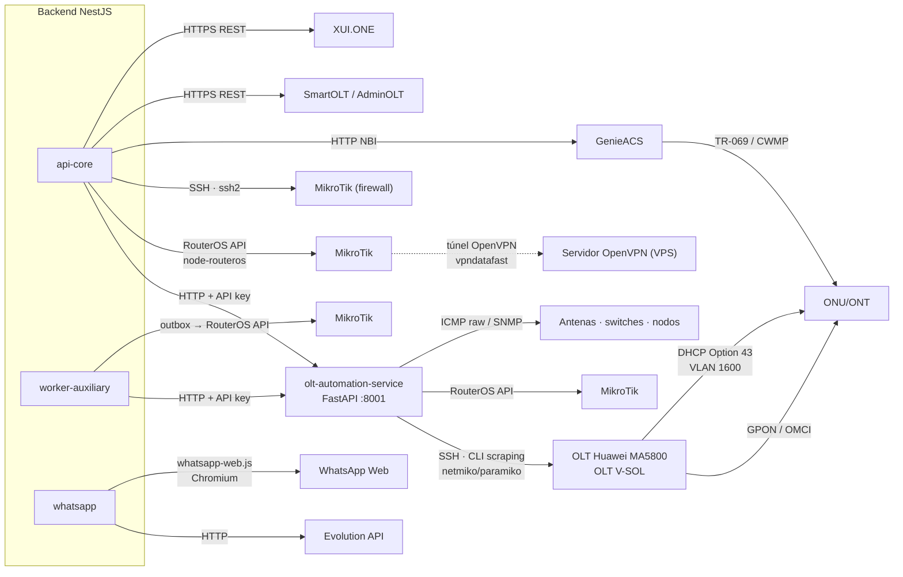
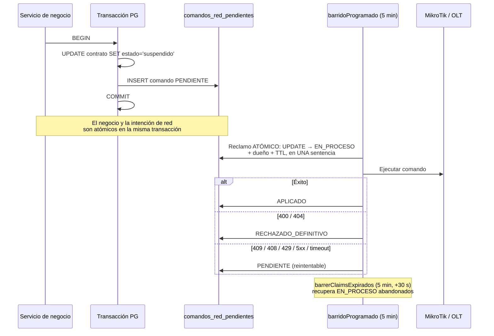
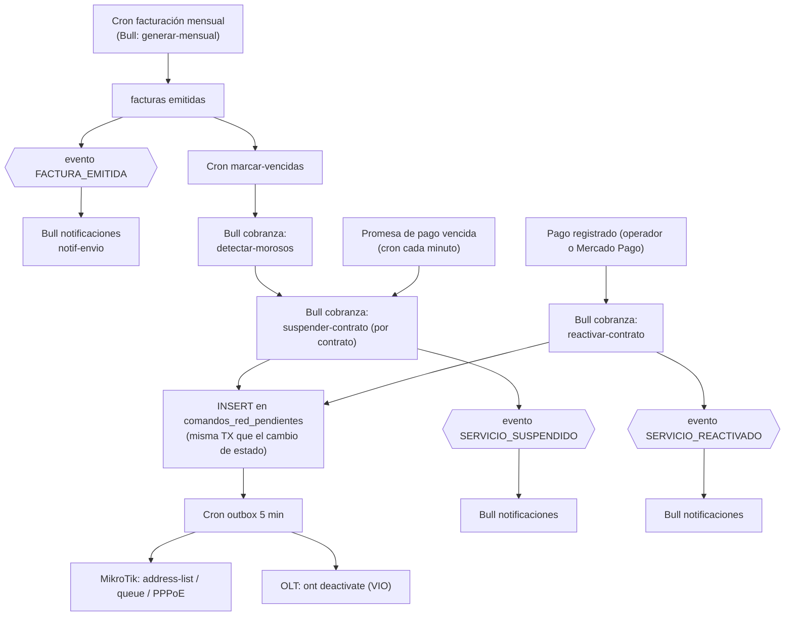
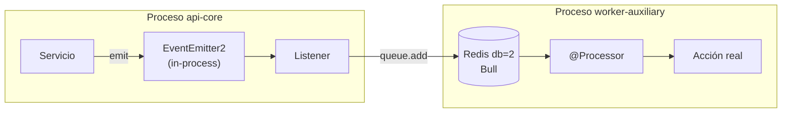

# Capítulos 8–12 — Hardware, Servicios Compartidos, Procesos, Eventos e Integraciones

---

# CAPÍTULO 8 — Comunicación con Equipos

## 8.1 Mapa de transportes



## 8.2 OLT Huawei MA5800 / V-SOL

| Aspecto | Detalle medido |
|---|---|
| **Quién consulta** | Únicamente `olt-automation-service` (Python). El backend NestJS **nunca abre una sesión SSH a una OLT**. |
| **Protocolo** | SSH — scraping de CLI (no TL1, no NETCONF, no SNMP para configuración) |
| **Driver** | `app/drivers/huawei.py`, `app/drivers/vsol.py`, contrato en `base.py` |
| **Lógica** | `app/services/provisioning.py` — **4.792 LOC, el archivo más grande del repositorio** |
| **Pool de sesiones** | `app/services/connection_pool.py` (96 LOC) |
| **Concurrencia** | **uvicorn con `--workers 1` deliberado** — el MA5800 tiene un límite bajo de sesiones VTY concurrentes. Cada worker abriría sus propias sesiones SSH. |
| **`--reload` prohibido** | Comentado explícitamente en `ecosystem.config.js`: WatchFiles reiniciaba uvicorn al tocar cualquier archivo, y un `git reset --hard` de deploy lo disparó en medio de una Fase 2 WAN → ONT huérfano (2026-07-21). |

### Qué información se obtiene

| Operación | Comando/lectura | Dónde se almacena | Quién la reconsulta |
|---|---|---|---|
| Inventario de ONUs | `display ont info` (autofind + registradas) | `olt_onu_inventario` | `olt-inventario-refresh.service.ts` por evento `ftth.inventario.reobservar`; sync 6 h |
| Potencia óptica | `display ont optical-info` | `metricas_onu_optical` | Dashboard de señal, modal ONU |
| Topología de tarjetas | `display board` | `olt_boards` | Wizard, health |
| Perfiles | `display ont-lineprofile/srvprofile`, traffic-table | `olt_line_profiles`, `olt_service_profiles`, `olt_traffic_tables` | Compliance, baseline |
| VLANs | `display vlan` | `olt_vlans` | Baseline, sincronización |
| Versión de ONT | `display ont version` | `olt_onu_inventario` | Catálogo de modelos |
| Salud (POM, PON, boards) | varios `display` | `olt_health_snapshots` | `olt-health-poller.cron.ts` |
| IDs ocupados en PON | `/ftth/ont-ids` | `olt_onu_id_pool` | Reconciliación de pool |

### Operaciones mutantes y su verificación VIO

| Operación | Escritura | Verificación independiente (VIO) | Timeout |
|---|---|---|---|
| Registro GPON | `ont add` (descripción `DATAFAST_CNT-xxxx`) | `poll-online` + `verify-onu` | — |
| Inyección WAN PPPoE | comando WAN | `check_ont_wan_pppoe` | **90 s** (era 30 s; causó el ONT huérfano del 21/07 16:55) |
| Carril de gestión TR-069 | `ont ipconfig … dhcp vlan 1600` + `ont tr069-server-config` | `check_ont_mgmt_ip` + convergencia ACS | — |
| Rollback GPON | `ont delete` | loop de verificación | **150 s** (era 30 s) |
| Undo service-port | `undo service-port` | `_undo_service_port_verificado` | — |
| Suspensión / rehabilitación | `ont deactivate` / `activate` | loop de verificación | 30 s → causó latencia de 287 s en REACTIVAR; corregido |

**Hallazgo VIO fundacional (incidente 2026-07-17, CNT-2026-000004):** una ONU Huawei EG8145V5
aceptó sin error el comando OMCI del carril de gestión TR-069 —la OLT lo mostraba
configurado— pero el firmware nunca activó el IP-host (0 tramas Ethernet, confirmado con
sniffer en cold-boot físico). El ERP reportó "carril aplicado" durante días con la gestión
remota muerta, porque solo verificaba que el CLI no devolviera error. De ahí la regla
`accepted ≠ materialized`.

### Hallazgos de firmware documentados (R018)

- `dba-profile delete profile-name` (no `undo`).
- Eco pegado = problema de sintaxis, no de transporte.
- **Hay que drenar el autosave antes de enviar comandos**; un reintento CLI tras autosave produce `% Unknown command` y genera falsos negativos (corregido con `confirmarConvergencia` antes del rollback, commit `ae07e733`).
- **`ont reset` NO reinicia una EG8145V5** — probado con captura de tráfico (0 paquetes a la OLT). SmartOLT usa TR-069 al CPE. Un power-cycle físico sí gatilla boot-inform; `ont reset` no.

## 8.3 MikroTik RouterOS

**Dos caminos independientes hacia el mismo hardware:**

| Camino | Implementación | Uso |
|---|---|---|
| **NestJS directo** | `node-routeros` vía `mikrotik/services/connection-pool.service.ts` | Operaciones interactivas del operador (`/mikrotik/*`) |
| **NestJS por SSH** | `ssh2` en `mikrotik/services/firewall.service.ts` | Configuración de firewall |
| **Python** | `mikrotik_pool.py` + `mikrotik_ops.py` vía `/api/v1/mikrotik/*` | Operaciones invocadas desde el servicio de automatización |

| Aspecto | Detalle |
|---|---|
| **Alcanzabilidad** | Exclusivamente a través del túnel OpenVPN `vpndatafast`. Sin VPN no hay gestión. |
| **Servicios NestJS** | `pppoe`, `queue`, `firewall`, `arp`, `interface`, `wireless`, `subnet-route`, `mikrotik-user`, `address-list-reconciliador`, `services/velocidad/` |
| **Fix conocido** | Doble patch `!empty` (Channel + Receiver) en `connection-pool.service.ts` — resolvió un timeout de 30 s → 988 ms |
| **Circuit breaker** | Por router: `GET /mikrotik/routers/:id/circuit-breaker`, `POST /circuit-breaker/reset` |
| **Drift** | `GET /mikrotik/drift`, `GET /mikrotik/address-lists/sobrantes`, tabla `drift_detectado` |

### Qué información se obtiene y con qué frecuencia

| Dato | Endpoint | Frecuencia | Almacenamiento |
|---|---|---|---|
| Estado del router | `GET /routers/:id/estado` | Bajo demanda + monitoreo | `routers`, `alertas_sistema` |
| Interfaces | `GET /routers/:id/interfaces` | Bajo demanda | No persistido |
| Tráfico | `GET /routers/:id/trafico` | Bajo demanda (vista en vivo) | No persistido |
| Sesiones PPPoE activas | `GET /routers/:id/sesiones` | Bajo demanda | No persistido |
| Queues | `GET /routers/:id/queues` | Bajo demanda + `discrepancias` | Comparado con `contratos.plan` |
| DHCP leases | `GET /routers/:id/dhcp` | Bajo demanda | No persistido |
| Address-list de morosos | `GET /routers/:id/morosos` | Bajo demanda + cron 04:40 | `drift_detectado` |
| Consumo por contrato | colector del portal | **Cada 15 min** | `consumo_datos`, `consumo_snapshot` |

### Operaciones mutantes

Provisión de abonado, suspensión, reactivación, amarre IP-MAC, cambio de velocidad de queue,
configuración de firewall, sincronización de subredes. **Todas las mutaciones disparadas por el
negocio (corte/reactivación) pasan por el outbox** `comandos_red_pendientes`; las disparadas
por el operador desde `/red/routers` son síncronas.

## 8.4 ONU / ONT y TR-069 (GenieACS)

| Aspecto | Detalle |
|---|---|
| **Quién consulta** | `olt-nativo` vía NBI HTTP de GenieACS (`GENIEACS_NBI_URL`) |
| **Camino de datos** | ONU → CWMP/TR-069 → GenieACS → NBI → backend |
| **Carril de gestión** | VLAN 1600, IP por DHCP, ACS URL entregada por **DHCP Option 43** desde el MikroTik |
| **Estado** | Gestión TR-069 resuelta end-to-end el 2026-07-19: carril DHCP + `ont tr069-server-config` + preset GenieACS `PeriodicInform=300` + provision `erp-connreq-creds`. Validado con power-cycle físico. |
| **Modelo bajo demanda** | El carril NO se inyecta con la provisión (`INYECTAR_CARRIL_AUTOMATICO` off). Se activa/desactiva desde "Ver ONU". Máquina de estados `ftth_carril_estado`, barrido TTL 3 días. |
| **Operaciones** | info, refresh, reboot, factory-reset, WiFi (por banda), PPPoE, acceso web |
| **Almacenamiento** | `tr069_device`, `contrato_onu_config`, `cpe_provisioning_attempt`, `cpe_web_credential` |
| **Watchers** | `tr069-cpe-drift-watcher.cron.ts`: staleness (`12,42 * * * *`), drift (`5-59/20`), barrido TTL (04:20), des-endurecimiento de auth residual (03:40) |

### Objetivo abierto documentado

**Lograr la ACS URL por OMCI.** Hoy solo converge Option 43, lo que ata el diseño a Huawei + un
DHCP por VLAN. Confirmado con ONU de fábrica que el ME137 **no** escribe la URL en la EG8145V5.
El DHCP del MikroTik **no es retirable**. Lección registrada: probar bootstrap sobre un equipo
que ya tiene la config buscada da falso positivo.

### Incidente de deadlock de autenticación (resuelto)

La muerte de gestión TR-069 tras un factory-reset no era de IP ni de Option 43: el device
conservaba el tag `AuthEnforced` mientras la ONU reseteada informaba sin credenciales →
GenieACS rechazaba el Inform (HMAC no coincidía) → deadlock. Probado con `tcpdump`.
Fix aplicado y validado (commit `99d9ad62`): gracia de bootstrap — `factoryReset` y
`reconcilePendingReinjection` quitan el tag; `enforceDeviceAuth` re-endurece al re-provisionar.

## 8.5 OpenVPN

| Aspecto | Detalle |
|---|---|
| **Rol** | Único canal de alcanzabilidad hacia los MikroTik de campo |
| **Quién administra** | Módulo `openvpn` (backend), sobre el filesystem del VPS |
| **Artefactos** | Certificados por router, CCD con `ifconfig-push` e `iroute`, script de cliente MikroTik |
| **Ciclo de vida de IP** | **Permanente.** `validarTunel` escribe el CCD en el primer handshake (bloqueo inmediato). Solo se libera al eliminar el router (`removeRouter` → revoca certs → borra CCD → mata el túnel) o al cancelar el wizard sin completar el paso 3 (`fireRevoke`). |
| **Red de seguridad** | Cron `limpiarWizardsAbandonados` cada 30 min, corte a 2 h |
| **Semántica de `iroute`** | Declara **propiedad** de una subred (sale de `subnets_locales`), no alcanzabilidad. A nivel OSPF todo se alcanza; a nivel ERP el modelo es de propiedad. Dos routers reclamando la misma red no falla ruidosamente: da la respuesta equivocada con naturalidad. |
| **Callbacks del servidor** | El propio OpenVPN llama al backend: `verify-auth`, `verificar-sesion-cn`, `disconnect-notify` |
| **Regla de script** | Un script VPN por wizard, **nunca regenerable**; la edición solo permite visualizar el script original |
| **Incidente cerrado** | Dar de baja un router dejaba la interfaz `vpndatafast` viva en el MikroTik reintentando cada 15 s indefinidamente ("router zombi"). Resuelto. Las rutas `10.0.0.0/8` del VPS **no** son huérfanas: son del `mikrotik.conf`. |

## 8.6 Monitoreo de dispositivos (ICMP / SNMP)

| Aspecto | Detalle |
|---|---|
| **Quién consulta** | `monitoreo-worker.service.ts` (NestJS, **cron cada minuto**) → `olt-automation-service` `/api/v1/monitoring/*` |
| **Protocolos** | ICMP raw (`icmplib`, contenedor con `cap_add: NET_RAW`), SNMP (`snmp_service.py`, `snmp_mapping.py`) |
| **Objetivos** | Antenas, switches, nodos, routers — tabla `dispositivos_monitoreo` |
| **Almacenamiento** | `metricas_monitoreo` (alta escritura), `alertas_sistema`, `nodos_mediciones` |
| **Salida** | Vista `v_estado_dispositivos`, WebSocket `monitoreo.gateway.ts`, eventos `ROUTER_CAIDO` / `ROUTER_CONECTADO` |
| **Umbrales** | Tabla `umbrales_alerta`, configurables por endpoint |
| **`net-snmp` en Node** | La dependencia está declarada en `backend/package.json`, pero el polling SNMP real vive en Python. |

## 8.7 SmartOLT / AdminOLT

| Aspecto | Detalle |
|---|---|
| **Protocolo** | HTTPS REST (`SMARTOLT_URL`, `SMARTOLT_TOKEN`) |
| **Rol** | Proveedor alternativo de operaciones OLT, enrutado por `olt-provider-registry.service.ts` + `olt-operation-router.service.ts` |
| **Configuración** | `olt_proveedor_config`, con circuit breaker (`POST /proveedores/:configId/reset-circuit`) |
| **Estado** | Camino legado. El nodo real (NODO MALVINAS, 205 ONUs) está en migración a `olt-nativo`; paso 1 (reconciliar pools) completado. |

## 8.8 XUI.ONE (IPTV)

| Aspecto | Detalle |
|---|---|
| **Protocolo** | HTTP REST |
| **Módulo** | `xui` — degradable por construcción |
| **Datos** | Bouquets, líneas, estado de canales — `xui_servidores`, `xui_lines` |
| **Frecuencia** | `xui-monitor.service.ts` — **cron cada 30 segundos** (el más frecuente del sistema) |

## 8.9 Equipos y protocolos NO integrados

Para evitar suposiciones: el prompt de auditoría mencionaba equipos que **no existen en este
sistema**.

| Elemento | Estado real |
|---|---|
| **Astra** | No integrado. Sin referencias en el código. |
| **UPS** | No integrado. Sin lectura de estado de UPS. |
| **Telnet** | No usado. Todo el acceso a OLT es SSH. |
| **TL1** | No usado. |
| **SOAP** | No usado. TR-069/CWMP es SOAP, pero lo habla GenieACS, no el ERP. |
| **Switches gestionados** | Solo como objetivo genérico de `dispositivos_monitoreo` (ICMP/SNMP). Sin driver de configuración. |
| **NETCONF / RESTCONF** | No usado. |

---

# CAPÍTULO 9 — Servicios Compartidos

## 9.1 Servicios globales (registrados en `AppModule`, inyectables sin importar)

| Servicio | Archivo | Función | Consumidores |
|---|---|---|---|
| `ModuleHealthService` | `common/services/module-health.service.ts` | Registro de estado `ok`/`degraded` por módulo con razón. Base del patrón degradable. | Todos los módulos degradables + `GET /health/modules` |
| `WatcherHeartbeatService` | `common/services/watcher-heartbeat.service.ts` | Latido de los procesos de fondo | Crons y watchers; `GET /admin/sistema/watchers` |
| `RedisLockService` | `common/redis/redis-lock.service.ts` | Locks distribuidos y circuit breakers sobre Redis | **Solo `workers/cobranza.worker.ts`** (medido) |
| `CircuitBreakerRegistry` | `common/services/circuit-breaker.registry.ts` | Registro central de breakers | `mikrotik`, `olt-nativo` (proveedores), `monitoreo` |
| `QueuePauseService` | `common/services/queue-pause.service.ts` | Pausa/reanudación de las 4 colas principales | `mantenimiento`, `sistema` |
| `CacheModule` (global) | `@nestjs/cache-manager` + Redis db=0 | Cache de aplicación, TTL 300 s | 15 archivos (ver Cap. 14) |
| `EventEmitterModule` (global) | `@nestjs/event-emitter` | Bus de eventos in-process, `maxListeners: 30` | 25 listeners |
| `ConfigModule` (global) | `@nestjs/config` con validación Joi | Configuración | Todos |

## 9.2 Piezas transversales aplicadas globalmente

| Pieza | Tipo | Efecto |
|---|---|---|
| `LicenciaGuard` | `APP_GUARD` #1 | Bloquea **todo** el ERP sin licencia válida |
| `JwtAuthGuard` | `APP_GUARD` #2 | Autenticación en cada request salvo `@Public()` |
| `RolesGuard` | `APP_GUARD` #3 | Autorización por rol / `@RequirePermission` |
| `ThrottlerGuard` | `APP_GUARD` #4 | Rate limiting 10/s · 100/min · 1000/h |
| `LoggingInterceptor` | `APP_INTERCEPTOR` | Log de request/response (winston) |
| `TimeoutInterceptor(30 s)` | `APP_INTERCEPTOR` | **Corta toda request a 30 s** |
| `AuditInterceptor` | `APP_INTERCEPTOR` | Escribe `auditoria_logs` + `entity_versions`; respeta `skipAudit` |
| `TransformInterceptor` | `APP_INTERCEPTOR` | Envoltura uniforme de respuesta |
| `AllExceptionsFilter` | `APP_FILTER` | Normalización de errores |

**Interacción crítica medida:** `TimeoutInterceptor(30000)` es global. Operaciones contra
hardware con timeouts internos de 90 s (inyección WAN) y 150 s (rollback GPON) **exceden el
timeout HTTP global**. El diseño lo resuelve haciendo esas operaciones asíncronas (outbox +
watcher), no ampliando el timeout.

## 9.3 Utilidades compartidas

| Utilidad | Archivo | Uso |
|---|---|---|
| `encryption.util.ts` | `common/utils/` | Cifrado de credenciales (`ENCRYPTION_KEY`) — routers, OLTs, proveedores, tokens Google |
| `ip.util.ts` | `common/utils/` | Cálculo de subredes, siguiente IP, validación CIDR |
| `pagination.util.ts` | `common/utils/` | Paginación uniforme |
| `pg-result.util.ts` | `common/utils/` | Normalización de resultados de SQL crudo |
| `telefono.util.ts` | `common/utils/` | Normalización de teléfonos (envío de mensajería) |
| `resultado-operacion.ts` | `common/domain/` | **Vocabulario de dominio** — 6 clases de resultado, `traducirAHttp` en el borde |
| `service-types.ts` | `common/constants/` | Tipos de servicio |
| `base.entity.ts` | `common/entities/` | Entidad base |
| `@CurrentUser`, `@Public`, `@Roles` | `common/decorators/` | Decoradores de contexto y acceso |

## 9.4 Servicios de dominio reutilizados entre módulos

| Servicio | Módulo propietario | Reutilizado por |
|---|---|---|
| `MikrotikService` + pool de conexiones | `mikrotik` | contratos, monitoreo, openvpn, portal, promesas-pago, reconciliador, sites, smartolt, workers |
| `OutboxRedService` | `outbox-red` | contratos, promesas-pago, workers |
| `PoliticaFacturacionService` | `facturacion` | **Fórmula única del ciclo de cobro** (emisión/vencimiento/corte). Antes eran 3 fórmulas y el corte caía antes del vencimiento (incidente 05/08). |
| `GatewayMensajeriaService` | `notificaciones` | mensajeria, sistema, finanzas-opex, workers |
| `ConfigService` de empresa | `config` | 8 módulos |
| `AuthService` / estrategias | `auth` | 11 módulos |
| `FtthOperacionLockService` | `olt-nativo` | Toda operación FTTH mutante |
| `OltProviderRegistry` + `OltOperationRouter` | `olt-nativo` | Enrutamiento nativo/SmartOLT/AdminOLT |
| CTE `PUNTOS_SERVICIO` | `planta-externa` | mapa de clientes, planta externa |

## 9.5 Servicios compartidos que el prompt asumía y NO existen como tales

| Asumido | Realidad medida |
|---|---|
| Servicio de archivos | No hay abstracción. Cada módulo usa `multer` + filesystem directamente (`clientes/:id/foto`, `config/empresa/logo`, `pagos/:id/comprobante`, media CRM). |
| Servicio de logs unificado | Hay winston configurado globalmente, pero **cada módulo loguea a su manera**; no hay contrato de log estructurado. |
| Servicio de configuración de negocio | La configuración vive repartida: `empresas`, `configuracion_facturacion`, `portal_config`, `olt_onu_preset`, `openvpn_config`, `olt_proveedor_config`. No hay un servicio de settings único. |
| Servicio de permisos como librería | `RolesGuard` + `@RequirePermission` existen, pero **la aplicación del decorador es parcial** (§5.1). |

---

# CAPÍTULO 10 — Procesos Programados

## 10.1 Regla de ejecución

Todos los crons están declarados con `@Cron` de `@nestjs/schedule` **dentro del mismo binario**.
`ScheduleModule.forRoot()` se registra en los tres procesos Node, pero **cada servicio comprueba
`RUN_CRONS` antes de añadir su tarea**. En producción solo `datafast-worker-auxiliary` tiene
`RUN_CRONS=true`.

**No hay cron del sistema operativo (`crontab`) ejecutando lógica de negocio.** El endpoint
`GET/PATCH /admin/sistema/crontab` administra el crontab del VPS para tareas de plataforma
(backups, certbot), no para el ERP.

## 10.2 Inventario completo (29 tareas)

| # | Expresión | Nombre / método | Módulo | Objetivo | Dependencias |
|---|---|---|---|---|---|
| 1 | `*/30 * * * * *` (**30 s**) | `xui-monitor` `tick()` | `xui` | Estado de canales IPTV | XUI.ONE |
| 2 | `* * * * *` (**1 min**) | `procesarVencidas()` | `promesas-pago` | Vencer promesas → dispara corte | outbox-red, mikrotik |
| 3 | `EVERY_MINUTE` | `runCycle()` | `monitoreo` | Ping/SNMP a todos los dispositivos | olt-automation-service, BD |
| 4 | `*/2 * * * *` | `watchPendingReinjection()` | `olt-nativo` | Reinyección TR-069 pendiente | GenieACS, OLT |
| 5 | `2-59/3 * * * *` | `procesarAnulaciones()` | `olt-nativo` | **Anulación asíncrona de wizards** | OLT, saga |
| 6 | `4-59/5 * * * *` | `liberarBloqueados()` | `olt-nativo` | Liberar locks FTTH expirados | `ftth_operacion_lock` |
| 7 | `0 */5 * * * *` | `barridoProgramado()` | `outbox-red` | **Drenar `comandos_red_pendientes`** | mikrotik, olt-nativo |
| 8 | `30 */5 * * * *` | `barrerClaimsExpirados()` | `outbox-red` | Recuperar claims huérfanos | BD |
| 9 | `0 */5 * * * *` | `reintentarPendientes()` | `promesas-pago` | Reintento de promesas | outbox-red |
| 10 | `5-59/10 * * * *` | `reintentarRollbacks()` | `olt-nativo` | **Watcher `fallido_rollback`** (invariante de atomicidad) | OLT |
| 11 | `*/10 * * * *` | `verificarWan()` | `olt-nativo` | VIO de WAN inyectada | OLT |
| 12 | `*/10 * * * *` | `notif-orphan-cleanup` | `mensajeria` | Limpiar notificaciones EN_PROCESO huérfanas | BD |
| 13 | `0 */10 * * * *` | `reconciliarPagosNoAplicados()` | `pagos` | **Pagos sin aplicar a factura** | facturacion |
| 14 | `3-59/15 * * * *` | `recolectar()` | `portal` | Consumo de datos por contrato | mikrotik |
| 15 | `*/15 * * * *` | `notif-reconciler` | `mensajeria` | Reconciliar notificaciones pendientes | gateway |
| 16 | `0 */15 * * * *` | `reconciliar()` | `reconciliador` | Estado BD ↔ MikroTik. **Sin cap ni lock** | mikrotik |
| 17 | `5-59/20 * * * *` | `verificarDrift()` | `olt-nativo` | Drift de CPE TR-069 | GenieACS |
| 18 | `12,42 * * * *` | `verificarStaleness()` | `olt-nativo` | Sesiones TR-069 rancias | GenieACS |
| 19 | `*/30 * * * *` | `limpiarIdsHuerfanos()` | `olt-nativo` | Pool de ONU-ID | OLT |
| 20 | `0 */30 * * * *` | `reconciliarFtthOnu()` | `reconciliador` | Estado BD ↔ OLT | smartolt, olt |
| 21 | `7-59/30 * * * *` | `adoptarHuerfanas()` | `olt-nativo` | **Watcher CREATE del invariante**: reconstruye `ftth_onu_registro` desde inventario+pool+lectura viva | OLT |
| 22 | (30 min, doc.) | `limpiarWizardsAbandonados` | `openvpn` | Revoca certs de wizards abandonados (corte 2 h) | filesystem VPS |
| 23 | `0 */6 * * *` | `recargaPeriodica()` | `licencia` | Recarga de licencia | Servidor de licencias |
| 24 | `50 */6 * * *` | `syncPeriodico()` | `olt-nativo` | Sincronización de inventario OLT | OLT (SSH) |
| 25 | `EVERY_DAY_AT_3AM` | `validacionDiaria()` | `licencia` | Validación diaria | Servidor de licencias |
| 26 | `EVERY_DAY_AT_3AM` | `purgar()` | `auditoria` | Retención de auditoría | BD |
| 27 | `30 3 * * *` (Lima) | `reconciliarDiario()` (ZTP) | `olt-nativo` | **Reconcile de config de ONU. Reescribe SSID/clave/web de las ONUs en drift.** | GenieACS, OLT |
| 28 | `40 3 * * *` (Lima) | `desendurecerAuthResidual()` | `olt-nativo` | Quita `AuthEnforced` residual | GenieACS |
| 29 | `20 4 * * *` (Lima) | `barrerTtl()` | `olt-nativo` | TTL del carril TR-069 (3 días) | GenieACS, OLT |
| 30 | `40 4 * * *` | `reconciliarDiario()` | `mikrotik` | Address-lists de morosos | MikroTik |

### Ventana de madrugada — concentración medida

```
03:00  licencia.validacionDiaria      +  auditoria.purgar
03:30  ZtpReconcileCron.reconciliarDiario     ← reescribe config de ONUs en drift
03:40  tr069.desendurecerAuthResidual
04:20  tr069.barrerTtl
04:40  mikrotik.address-list-reconciliador
```

**Pendiente registrado:** revisar el reconciliador nocturno — qué corre exactamente a las
03:30/03:40/04:20 y por qué urge, dado que `reconcile()` itera sin cap ni lock y el carril
automático multiplicó su carga potencial.

## 10.3 Colas Bull (6 colas, Redis db=2)

| Cola | Constante | Jobs | Processor | Concurrencia |
|---|---|---|---|---|
| `cobranza` | `QUEUES.COBRANZA` | `detectar-morosos`, `suspender-contrato`, `reactivar-contrato`, `evaluar-prorroga`, `vencer-prorroga`, `procesar-pago` | `workers/cobranza.worker.ts` | Por defecto |
| `facturacion` | `QUEUES.FACTURACION` | `marcar-vencidas`, `generar-mensual`, `generar-facturas-empresa`, `generar-factura-contrato` | `facturacion/facturacion.worker.ts` | Por defecto |
| `notificaciones` | `QUEUES.NOTIFICACIONES` | `notif-envio` (+ tipos de aviso) | `mensajeria/mensajeria.worker.ts` | **5** |
| `campanas` | `QUEUES.CAMPANAS` | `campana-masiva` | `mensajeria/campanas.worker.ts` | **1** (goteo) |
| `mikrotik-jobs` | `QUEUES.MIKROTIK` | `mk-suspender`, `mk-reactivar`, `mk-sync-velocidades` | (declarada; el trabajo real va por outbox) | — |
| `google-sync` | `QUEUES.GOOGLE_SYNC` | `google-sync-contact`, `-contacts-bulk`, `google-calendar-event`, `google-drive-backup`, `google-geocode-address` | `google-integration/processors/google-sync.processor.ts` | Por defecto |
| `mikrotik-velocidad` | `VELOCIDAD_QUEUE` | `sincronizar-router`, `cambiar-velocidad` | `mikrotik/velocidad.worker.ts` | Por defecto |

### Política de reintentos

**Global (`app.module.ts`):** `attempts: 3`, backoff exponencial base 5 s,
`removeOnComplete: 100`, `removeOnFail: 500`.

**Por tipo (`workers.constants.ts` → `JOB_OPTIONS`):**

| Perfil | Prioridad | Intentos | Backoff |
|---|---|---|---|
| `ALERTA` | 1 | 3 | exponencial 15 s |
| `SUSPENSION` | 2 | 2 | fijo 60 s |
| `AVISO_PAGO` | 3 | 2 | fijo 60 s |
| `CONFIRMACION_PAGO` | 4 | 2 | fijo 60 s |
| `GASTO_RECURRENTE` | 5 | 2 | fijo 60 s |
| `NOTIFICACION` | 10 | 2 | fijo 60 s |
| `CRITICO` (aprovisionamiento) | — | 3 | exponencial 30 s |
| `MIKROTIK` | — | 3 | exponencial 10 s |
| `MASIVO` (facturación) | — | **1** | — |

**Goteo de campañas:** `calcularDelayGoteo(i) = i*12.000 ms + random(0..4.000)` — ~5 mensajes por
minuto máximo, con jitter.

## 10.4 El outbox de red — el tercer mecanismo asíncrono

No es cola Bull ni cron: es una **tabla PostgreSQL** (`comandos_red_pendientes`) drenada por dos
crons.



**Por qué el reclamo es atómico:** el diseño anterior comentaba que `SELECT FOR UPDATE SKIP
LOCKED` garantizaba que "dos instancias PM2 nunca toman el mismo registro". Era **falso** — la
transacción se cerraba antes de ejecutar contra el hardware, así que la exclusión protegía la
selección pero no la ejecución. Nadie lo verificó; lo verificó producción. De ahí la regla
"VIO hacia adentro": un comentario que garantiza concurrencia lleva un test que lo ejercite, o
se borra.

**Clasificador de reintentabilidad:** solo `400` y `404` son definitivos. Un criterio amplio
tipo `status < 500` es incorrecto — `409`/`408`/`429` significan "vuelve luego". Un `409` de
lock leído como veredicto definitivo descartó trabajo; un no-op idempotente leído como fallo
produjo **1.788 reintentos contra el MA5800 en 4 días**.

## 10.5 Cadena completa de cobranza (síncrono vs asíncrono)



**Medición documentada:** el "bucle" de la ONU al reactivar no era un bucle — eran dos latencias
encadenadas: outbox sin drenado inmediato + timeout de 30 s en `rehabilitate`. REACTIVAR pasó de
**287 s a 8 s**. El segundo defecto solo se hizo visible tras corregir el primero.

---

# CAPÍTULO 11 — Eventos

## 11.1 Mecanismo

`EventEmitter2` vía `@nestjs/event-emitter`, configurado con `wildcard: false`, `delimiter: '.'`,
`maxListeners: 30`, `ignoreErrors: false`.

**Característica arquitectónica determinante: el bus es IN-PROCESS.** No hay RabbitMQ, Kafka,
NATS ni Redis Pub/Sub para eventos de dominio. Un evento emitido en `datafast-api-core`
**no llega** a `datafast-worker-auxiliary`.

Los listeners no ejecutan trabajo directamente: **encolan en Bull**, que sí cruza procesos vía
Redis. Ese es el puente entre el bus in-process y el worker.



## 11.2 Catálogo de eventos

### Emitidos por `clientes`, `contratos`, `pagos`, `facturacion`, `mikrotik`, `monitoreo`

| Evento | Emisor | Listeners |
|---|---|---|
| `cliente.created` | `clientes` | `google-events.listener` → sincroniza contacto Google |
| `instalacion.completed` | `contratos`/`aprovisionamiento` | `google-events.listener` → evento de calendario |
| `pago.registered` | `pagos` | `google-events.listener` |
| `visita.scheduled` | `tickets`/`contratos` | `google-events.listener` |
| `contrato.suspended` | `workers`/`contratos` | `google-events.listener` |
| `ftth.inventario.reobservar` | `olt-nativo` | `olt-inventario-refresh.service` |
| `GATEWAY_EVENTS.PROVIDER_ACTIVATED` | `notificaciones` | `mensajeria/gateway-monitor.service` |
| `OLT_SYNC_PROGRESS` / `OLT_SYNC_COMPLETED` / `OLT_SYNC_ERROR` | `olt-sync.service` | `olt.gateway` → **retransmite a WebSocket** |

### `NOTIFICATION_EVENTS` — 15 eventos escuchados por `notification-event.listener.ts`

| Evento | Emisor típico | Acción |
|---|---|---|
| `FACTURA_EMITIDA` | `facturacion` | Encola `notif-envio` prioridad 2 |
| `PAGO_RECIBIDO` | `pagos` | Prioridad 2 |
| `SERVICIO_SUSPENDIDO` | `workers` | Prioridad 2 |
| `SERVICIO_REACTIVADO` | `workers` | Prioridad 10 |
| `BIENVENIDA` | `clientes` | Prioridad 10 |
| `PAGO_VENCE_HOY` | `workers` | Prioridad 3 |
| `PAGO_VENCIDO` | `workers` | Prioridad 3 |
| `PRORROGA_CONCEDIDA` | `promesas-pago` | Prioridad 10 |
| `ALERTA_EGRESO` | `finanzas-opex` | **Prioridad 1** |
| `EMISOR_CAIDO` / `EMISOR_CONECTADO` | `mensajeria` | Prioridad 1 |
| `ROUTER_CAIDO` / `ROUTER_CONECTADO` | `monitoreo` | **Prioridad 1** |
| `FTTH_ACTIVADO` | `olt-nativo` | Prioridad 10 |
| `IPTV_LINE_CREADA` | `xui` | Prioridad 10 |
| `OUTBOX_RED_AGOTADO` | `outbox-red` | **Alerta al operador: un comando de red agotó sus reintentos** |

## 11.3 WebSockets (3 gateways)

| Gateway | Namespace/uso | Emite | Consumidor frontend |
|---|---|---|---|
| `olt.gateway.ts` | Progreso de sincronización OLT | Retransmisión de `OLT_SYNC_*` | `useOltSocket.ts` — `red/olt` |
| `monitoreo.gateway.ts` | Estado en vivo de dispositivos | Mediciones y alertas | `useMonitoreo.ts` — `monitoreo` |
| `crm-nativo.gateway.ts` | `/wa-socket` | Mensajes WhatsApp entrantes, QR de vinculación | `mensajeria/whatsapp` |

**Autenticación WS:** `auth/guards/ws-jwt.guard.ts`.

## 11.4 Webhooks entrantes

| Endpoint | Origen | Verificación |
|---|---|---|
| `POST /pagos/webhooks/mercadopago` | Mercado Pago | Firma del proveedor |
| `POST /webhooks/whatsapp` | Evolution API / Meta | Según configuración del gateway |
| `POST /admin/licencia/webhook/revocar` | Servidor de licencias | Clave de licencia |
| `POST /openvpn/mikrotik-clients/verify-auth` · `verificar-sesion-cn` · `disconnect-notify` | Servidor OpenVPN local | Token / CN |

## 11.5 Mensajería inter-servicio — declaración explícita

**NO existe** broker de mensajes en este sistema:

| Tecnología | Estado |
|---|---|
| RabbitMQ | No usado, no declarado |
| Kafka | No usado, no declarado |
| NATS / MQTT | No usado |
| Redis Pub/Sub para eventos de dominio | No usado (Redis se usa para Bull, cache y locks) |
| gRPC | No usado |
| Event Sourcing | No implementado. `entity_versions` y `saga_log` son bitácoras, no un event store. |

**Los tres mecanismos asíncronos reales son:** (1) colas Bull sobre Redis, (2) `EventEmitter2`
in-process, (3) el outbox en PostgreSQL. La comunicación entre el backend y el servicio Python
es **HTTP síncrono**.

---

# CAPÍTULO 12 — Integraciones Externas

## 12.1 Inventario

| # | Integración | Método | Módulo | Credencial | Frecuencia | Degradable |
|---|---|---|---|---|---|---|
| 1 | **RENIEC** | HTTPS REST | `clientes` (`reniec.service.ts`) | `RENIEC_API_URL`, `RENIEC_API_TOKEN` | Bajo demanda (alta de cliente). **Cacheada** | Sí |
| 2 | **Mercado Pago** | REST + webhook | `pagos` (`mercadopago.service.ts`) | Credenciales del canal en BD (cifradas) | Bajo demanda + webhook | Sí |
| 3 | **Google Calendar** | OAuth2 + REST | `google-integration` | OAuth por empresa, token cifrado (`GOOGLE_TOKEN_ENCRYPTION_KEY`) | Por evento (cola) | Sí |
| 4 | **Google Contacts** | OAuth2 + REST | `google-integration` | ídem | Por evento + bulk | Sí |
| 5 | **Google Drive** | OAuth2 + REST | `google-integration` | ídem | Backup encolado | Sí |
| 6 | **Google Maps / Geocoding** | REST | `google-integration` | `GOOGLE_MAPS_API_KEY` | Encolado (`google-geocode-address`) | Sí |
| 7 | **OpenStreetMap** | Tiles vía MapLibre | Frontend | Ninguna | Render del mapa | — |
| 8 | **Evolution API (WhatsApp)** | HTTP + webhook | `notificaciones`, `webhooks` | `EVOLUTION_API_URL`, `EVOLUTION_API_KEY` | Por notificación | Sí |
| 9 | **WhatsApp Web (nativo)** | `whatsapp-web.js` + Chromium | `crm-nativo` | Sesión QR persistida | Permanente (proceso dedicado) | Sí |
| 10 | **SMTP** | SMTP | `notificaciones` (`smtp.strategy.ts`) | Config en BD | Por notificación | Sí |
| 11 | **GenieACS** | HTTP NBI | `olt-nativo` | `GENIEACS_NBI_URL` + creds de provision | Continua (crons TR-069) | Sí |
| 12 | **SmartOLT / AdminOLT** | HTTPS REST | `smartolt`, `olt-nativo` | `SMARTOLT_URL`, `SMARTOLT_TOKEN`, `olt_proveedor_config` | Bajo demanda + sync | Sí (circuit breaker) |
| 13 | **XUI.ONE (IPTV)** | HTTP REST | `xui` | `xui_servidores` (cifrado) | **30 s** | Sí |
| 14 | **Servidor de licencias** | HTTPS + webhook | `licencia` | `LICENSE_KEY` + machine-id | Diaria + cada 6 h + webhook | **NO — bloquea todo el ERP** |
| 15 | **Let's Encrypt / Certbot** | ACME | `config` + contenedor certbot | Webroot | Cada 12 h | — |
| 16 | **Telegram** (`telegraf`) | Bot API | — | — | **Dependencia declarada, sin uso detectado** | — |
| 17 | **Twilio** | REST | — | — | **Dependencia declarada, sin proveedor registrado en el gateway** | — |

## 12.2 Integraciones que el prompt asumía y NO existen

| Asumido | Estado real |
|---|---|
| **SUNAT / facturación electrónica** | **No implementada.** Existe la página `configuracion/facturacion-electronica` en el frontend y el módulo `facturacion` genera PDF con `pdfkit`, pero **no hay cliente de SUNAT, ni OSE, ni firma XML, ni envío de CDR** en el backend. |
| **SMS** | **No existe proveedor de SMS** en `gateway-mensajeria.service.ts`. Las estrategias registradas son WhatsApp nativo, mensajería masiva y SMTP. |
| **Niubiz / Culqi / Webpay / Stripe** | No implementadas. Documentadas como pendientes de la Etapa II de cobranza. |
| **Telegram** | Librería instalada, sin integración. |

## 12.3 Gestión de credenciales

| Ubicación | Contenido | Protección |
|---|---|---|
| `backend/.env.production` | Secretos de infraestructura: `DB_PASSWORD`, `JWT_SECRET`, `PORTAL_JWT_SECRET`, `ENCRYPTION_KEY`, `REDIS_PASSWORD`, `LICENSE_KEY`, tokens de API | Filesystem del VPS, fuera del repo |
| Base de datos | Credenciales de routers, OLTs, proveedores, servidores XUI, tokens Google | Cifradas con `encryption.util.ts` (`ENCRYPTION_KEY`) |
| `ACCESOS.local.md` | Todas las credenciales del entorno | **Solo local — nunca a GitHub ni al VPS** |
| Frontend | **Ningún secreto.** El proceso PM2 declara entorno mínimo a propósito. | — |

**Incidente de configuración registrado:** hasta 2026-07-22 el proceso del frontend arrastraba
todos los secretos del backend (`DB_PASSWORD`, `ENCRYPTION_KEY`, `JWT_SECRET`,
`REDIS_PASSWORD`…) por haberse lanzado desde una shell con el `.env` del backend cargado. El
frontend es el proceso expuesto y no necesita ninguno: en runtime solo usa `NODE_ENV`, y sus
`NEXT_PUBLIC_*` se hornean en build.

**Dependencia de credenciales duplicadas:** las credenciales de connection-request de GenieACS
están **hardcodeadas en la configuración de GenieACS** y deben coincidir con el `.env` de cada
VPS (provision `erp-connreq-creds`). Es un acoplamiento fuera del repositorio.
