# Capítulos 13–19 — Seguridad, Cache, Rendimiento, Infraestructura, Flujos, UML e Inventario de Código

---

# CAPÍTULO 13 — Seguridad

## 13.1 Cadena de defensa

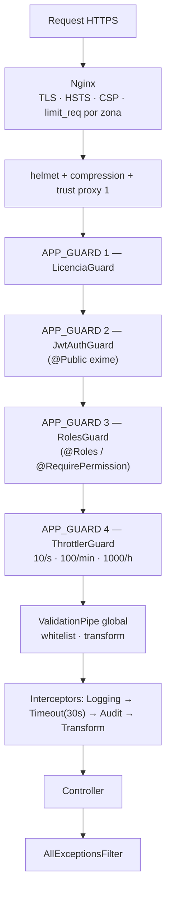

## 13.2 Autenticación

### ERP (operadores)

| Aspecto | Implementación |
|---|---|
| Esquema | JWT Bearer (`@nestjs/jwt` + Passport) |
| Estrategias | `jwt.strategy.ts`, `local` (login), `ws-jwt.guard.ts` (WebSocket) |
| Refresh | `POST /auth/refresh` — par access/refresh |
| Almacén de sesión | **Redis vía `CacheModule`** (`auth.service.ts` y `jwt.strategy.ts` inyectan `CACHE_MANAGER`) |
| Hash de contraseñas | `bcryptjs` |
| Recuperación | `forgot-password` / `reset-password` por correo |
| Logout de inactividad | `frontend/src/hooks/useInactivityLogout.ts` (lado cliente) |
| Secreto | `JWT_SECRET` (`.env.production`) |

### Portal del abonado — **sistema de autenticación completamente independiente**

| Aspecto | Implementación |
|---|---|
| Guard propio | `portal/portal-auth.guard.ts` |
| Servicio propio | `portal/portal-auth.service.ts` |
| Secreto propio | `PORTAL_JWT_SECRET` (distinto del ERP) |
| Transporte | **Cookies** (`portal-cookies.spec.ts`) |
| Aislamiento multi-tenant | `portal-tenant.service.ts` + `portal-auth.aislamiento.spec.ts` |
| Sesión | `POST /portal/auth/login` · `/refresh` · `/logout` |

Un token del portal **no** sirve en el ERP y viceversa. Es la separación de privilegios más
fuerte del sistema, y está testada explícitamente.

### Máquinas

| Consumidor | Mecanismo |
|---|---|
| `olt-automation-service` | API key en middleware (`OLT_AUTOMATION_INTERNAL_KEY`), escucha solo en `127.0.0.1` |
| Servidor OpenVPN → backend | Endpoints dedicados con token/CN |
| MikroTik → descarga de cert | **Token de un solo uso en la URL** (`/certs/:token/:filename`) |
| Mercado Pago, Evolution, licencias | Webhooks con verificación de firma/clave (`rawBody: true` habilitado en `main.ts` precisamente para poder verificarlas) |

## 13.3 Autorización

| Nivel | Mecanismo | Cobertura medida |
|---|---|---|
| Licencia | `LicenciaGuard` global | 100 % del sistema |
| Autenticación | `JwtAuthGuard` global + `@Public()` | 100 % salvo exenciones explícitas |
| Rol | `RolesGuard` + `@Roles()` | Global |
| **Permiso fino** | `@RequirePermission('recurso:accion')` | **Parcial** — declarado en `contratos` (25/25), `planes` (5/5), `zonas` (4/4), `promesas-pago` (4/4). El resto de módulos no lo declara. |
| Multi-tenant | `empresa_id` en índices únicos y en el filtro de consultas | Estructural en BD; **aplicación por servicio, no por un guard central** |

**Modelo RBAC:** `usuarios` ─N:M─ `roles` ─N:M─ `permisos`. Roles clonables
(`POST /roles/:id/clonar`) y permisos editables por rol (`PATCH /roles/:id/permisos`).

## 13.4 Auditoría

| Componente | Función |
|---|---|
| `AuditInterceptor` (global) | Captura mutaciones HTTP y las escribe en `auditoria_logs` |
| `entity_versions` | Versiones restaurables de entidades → `POST /auditoria/version/:id/restaurar` |
| Undo / Redo | `POST /auditoria/undo`, `/redo` |
| Papelera | `GET /auditoria/papelera`, `POST /papelera/restaurar`, `DELETE /papelera/eliminar` |
| `@SetMetadata('skipAudit', true)` | Exclusión de lecturas de alto volumen (solo aplicado sistemáticamente en `contratos`) |
| Retención | Cron 03:00 diario (`auditoria-retencion.cron.ts`) + `fn_cleanup_old_data` |
| Bitácoras de dominio | `olt_operacion_log`, `ftth_rollback_log`, `saga_log`, `operacion_wizard_paso`, `eventos_sistema`, `google_sync_logs`, `notificaciones_logs`, `reconciliation_log` |
| Log de accesos | `GET /auth/audit`, `GET /personal/logs` |

## 13.5 Endurecimiento en Nginx

| Medida | Detalle medido |
|---|---|
| TLS | 443 con `http2`; redirección 80→443 (`00-redirect.conf.template`) |
| HSTS | `max-age=63072000; includeSubDomains; preload` en el vhost del ERP |
| CSP | `Content-Security-Policy` declarada en el vhost del ERP |
| Rate limit por zona | `auth` (login burst 3, refresh burst 5, mikrotik/test-connection burst 5), `api` (burst 40), `webhooks` (burst 5), `general` (burst 20) |
| Bloqueo de archivos | `location ~ /\.` y `location ~ \.(env|log|sql|bak|sh)$` → denegado |
| Segregación de proceso | `/api/v1/crm-nativo/` y `/api/wa-socket/` → `whatsapp_api` (:4002); el resto → `backend_api` (:4000) |
| Portal acotado | El vhost del portal solo enruta `^/api/(auth\|portal\|facturas\|pagos\|tickets\|consumo)` — **el resto de la API no es alcanzable desde el dominio del portal** |
| Cache de estáticos | `/_next/static/` inmutable 1 año; `/uploads/` 7 días |
| No-cache | Rutas de autenticación con `no-store, no-cache, must-revalidate` |

## 13.6 Otras medidas

| Medida | Detalle |
|---|---|
| Cifrado de credenciales en BD | `encryption.util.ts` con `ENCRYPTION_KEY` — routers, OLTs, proveedores, XUI, tokens Google (`GOOGLE_TOKEN_ENCRYPTION_KEY` aparte) |
| Swagger | **Deshabilitado en producción** (`if (env !== 'production')`) |
| Estáticos | `useStaticAssets` con `dotfiles: 'deny'`, solo GET, sin listado de directorios |
| Media CRM | No servida como estático: endpoint privado `/crm-nativo/media/:filename` con JWT |
| Validación | `whitelist: true` elimina campos no declarados en el DTO |
| Red Docker | `datafast-internal` con `internal: true` — sin salida externa; solo Nginx está en `datafast-public` |
| Exposición de puertos | Postgres, Redis, backend, frontend y el servicio Python usan `expose`, no `ports`. Evolution API se publica solo en `127.0.0.1:8080` |
| Aislamiento de proceso | Chromium confinado a `datafast-whatsapp` |
| Frontend sin secretos | Entorno PM2 mínimo (`NODE_ENV`, `PORT`, `TZ`) |

## 13.7 Observaciones de seguridad (sin propuesta de corrección)

1. `forbidNonWhitelisted: false` — los campos extra no provocan error, solo se descartan.
2. `@RequirePermission` está aplicado en 4 de 44 módulos; el resto depende solo del rol.
3. El aislamiento multi-tenant se aplica consulta por consulta, no por un guard o interceptor central.
4. `LicenciaGuard` es el primer guard global: un fallo del servidor de licencias bloquea el ERP completo, incluido `auth`.
5. `helmet` activa CSP **solo si `env === 'production'`**.
6. La cabecera `Permissions-Policy` fue causa de un incidente real: declaraba `geolocation=()` (lista vacía, que prohíbe la ubicación al propio sitio) y el GPS del móvil respondía "permiso denegado" sin llegar a preguntar.

---

# CAPÍTULO 14 — Cache

## 14.1 Infraestructura

| Capa | Detalle |
|---|---|
| Motor | Redis 7, `maxmemory 512 MB`, política `allkeys-lru`, AOF `everysec` |
| Cliente | `cache-manager` v5 + `cache-manager-ioredis-yet` |
| Base | **db=0** |
| TTL por defecto | **300 000 ms (5 minutos)**, global |
| Registro | `CacheModule.registerAsync({ isGlobal: true })` |
| Colas (separado) | **db=2** |
| Evolution API (separado) | **db=6** |

## 14.2 Consumidores medidos de `CACHE_MANAGER`

| Archivo | Qué cachea |
|---|---|
| `auth/auth.service.ts` | Sesión / estado de token |
| `auth/strategies/jwt.strategy.ts` | Validación de token |
| `auth/guards/ws-jwt.guard.ts` | Token de WebSocket |
| `clientes/reniec.service.ts` | **Respuestas de RENIEC** (evita reconsultar el mismo DNI) |
| `clientes/clientes.module.ts` | Registro del módulo |
| `planes/planes.service.ts` | Catálogo de planes (lectura muy frecuente, escritura casi nula) |
| `portal/portal-auth.service.ts` | Sesión del abonado |
| `portal/portal-onu.service.ts` | **Estado de ONU** — evita golpear el hardware en cada refresco del portal |
| `mensajeria/campanas.service.ts` | Estado/cuota de campaña |
| `notificaciones/services/gateway-mensajeria.service.ts` | Configuración y estado del gateway |
| `sistema/sistema.service.ts` | Info del sistema |
| `backup/backup.service.ts` | Estado de backup |
| `workers/cobranza.worker.ts` | Estado del ciclo |
| `workers/facturacion.worker.ts` | Estado del ciclo |

**14 puntos de uso sobre 44 módulos.**

## 14.3 Invalidación

**No existe una estrategia de invalidación explícita.** La consistencia se obtiene por
**expiración TTL de 5 minutos**, no por invalidación dirigida en la escritura. No se detectaron
llamadas sistemáticas a `cacheManager.del()` tras una mutación.

Consecuencia observable: tras editar un plan o un dato de configuración cacheado, la lectura
puede devolver el valor anterior hasta 5 minutos.

## 14.4 Qué NO está cacheado (siempre llega a la base o al hardware)

| Consulta | Naturaleza |
|---|---|
| Listados de clientes, contratos, facturas, pagos | BD en cada request |
| `GET /clientes/mapa` | CTE completo en cada carga del mapa |
| `GET /dashboard/stats` | 6 queries en cada carga |
| `GET /reportes/*` | Agregados en cada consulta |
| `GET /olt-nativo/:oltId/onus` (`clasificarOnus`) | **SSH en vivo contra la OLT** |
| `GET /mikrotik/routers/:id/trafico`, `/sesiones`, `/interfaces`, `/dhcp` | RouterOS en vivo |
| `GET /monitoreo/tiempo-real` | Vista `v_estado_dispositivos` en cada request |
| Endpoints TR-069 | GenieACS en vivo |

## 14.5 Otras formas de cache presentes

| Forma | Ubicación |
|---|---|
| **Pool de conexiones como cache de sesión** | `mikrotik/services/connection-pool.service.ts`, `olt-nativo/services/olt-conn.service.ts`, `olt-automation-service/app/services/connection_pool.py`, `mikrotik_pool.py` — evitan reabrir SSH/API por operación |
| **Snapshot en BD como cache de hardware** | `olt_onu_inventario`, `olt_health_snapshots`, `metricas_onu_optical`, `consumo_snapshot`, `infrastructure-snapshot.service.ts` |
| **Cache HTTP en Nginx** | `/_next/static/` (1 año, inmutable), `/uploads/` (7 días) |
| **Circuit breaker como cache negativa** | `circuit-breaker.registry.ts`, `olt-nativo/services/circuit-breaker.service.ts` — evita reintentar contra un equipo caído |
| **Idempotencia como cache de resultado** | `olt-idempotency.service.ts` |

---

# CAPÍTULO 15 — Rendimiento

> Este capítulo documenta cuellos de botella **observados y registrados**, no una campaña de
> profiling. No hay APM ni métricas de latencia instrumentadas en el sistema.

## 15.1 Restricción física dominante

El **MA5800 tiene un límite bajo de sesiones VTY concurrentes**. Esa sola restricción explica
buena parte del diseño:

- `olt-automation-service` corre con **1 worker uvicorn**.
- `connection_pool.py` reutiliza sesiones SSH.
- La VIO "una sola pasada ordenada, sin reintentos agresivos" al deshacer.
- El lock `ftth_operacion_lock` (409 si hay algo en curso) que prohíbe operaciones concurrentes sobre el mismo contrato/ONU.

**Consecuencia arquitectónica:** todas las operaciones OLT del sistema **están serializadas por
un único proceso Python de un solo worker**. Es el cuello de botella estructural del plano de red.

## 15.2 Incidentes de rendimiento medidos y su causa raíz

| Síntoma observado | Causa raíz | Resultado |
|---|---|---|
| REACTIVAR tardaba **287 s** | Dos latencias encadenadas: outbox sin drenado inmediato (esperaba al cron de 5 min) + timeout de 30 s en `rehabilitate`. El segundo defecto solo se hizo visible tras corregir el primero. | **287 s → 8 s** |
| Timeout de 30 s en RouterOS | Bug `!empty` en `node-routeros` | Doble patch (Channel + Receiver) → **30 s → 988 ms** |
| **1.788 reintentos contra el MA5800 en 4 días** | Un no-op idempotente clasificado como fallo por el outbox + baja imposible desde `suspendido` | Máquina de estados declarativa + clasificador `400/404` únicamente |
| ONT huérfano (21/07 16:55) | `inject-wan-pppoe` con timeout de 30 s sobre una operación que tarda más | Timeout a 90 s; `rollback-gpon` a 150 s |
| Falso negativo del carril TR-069 | Reintento CLI tras autosave → `% Unknown command` con el carril ya materializado | `confirmarConvergencia` antes del rollback (`ae07e733`) + backoff progresivo (`c726a70c`) |
| VPS con **87 MB libres** | Chromium alojado en el proceso del worker (derivaba el host de `RUN_CRONS`) | Proceso `datafast-whatsapp` aislado, `WA_ENABLED=false` en los demás |
| Build fallando en el VPS | Heap por defecto de Node (~987 MB) insuficiente | `NODE_OPTIONS='--max-old-space-size=2048'` |
| Doble ejecución de comandos de red | `FOR UPDATE SKIP LOCKED` protegía la selección, no la ejecución | Reclamo atómico `EN_PROCESO` + dueño + TTL |
| Interfaz `vpndatafast` reintentando **cada 15 s indefinidamente** | Baja de router sin limpiar el cliente en el MikroTik | Router zombi — resuelto |
| Lectura óptica de 60 s | Netmiko | Migración a paramiko → **60 s → 4 s** |
| `reportes/clientes` devolvía **400 siempre** y nunca funcionó | `timestamptz` vs `text` | Corregido; core barrido en producción |

## 15.3 Cuellos de botella estructurales vigentes

| # | Cuello | Evidencia |
|---|---|---|
| 1 | **`TimeoutInterceptor(30 s)` global** | Operaciones de hardware legítimas duran 90–150 s. La única salida es hacerlas asíncronas. |
| 2 | **1 worker uvicorn para toda la planta OLT** | `ecosystem.config.js` — decisión deliberada por el límite VTY |
| 3 | **Cron de monitoreo cada minuto** | Ping + escritura en `metricas_monitoreo` para todos los dispositivos. La tabla de mayor tasa de escritura del sistema. |
| 4 | **`reconciliar()` itera sin cap ni lock** | `reconciliador.service.ts` — pendiente registrado |
| 5 | **Cron XUI cada 30 s** | El más frecuente; contra un servicio externo |
| 6 | **Latencia mínima del outbox = 5 min** | El barrido programado es cada 5 min; sin drenado inmediato la acción de red se retrasa |
| 7 | **Concentración de crons en la madrugada** | 03:00, 03:30, 03:40, 04:20, 04:40 — cinco barridos pesados en 100 minutos |
| 8 | **Pool de 15 conexiones por proceso, `max_connections=100`** | 3 procesos Node × 15 = 45, más migraciones, Evolution y herramientas |
| 9 | **Exportaciones XLSX en memoria** | `reportes/clientes/exportar`, `cobranza/exportar` sin streaming |
| 10 | **Sin paginación en el mapa** | `GET /clientes/mapa` devuelve todo el parque |

## 15.4 Bloqueos, esperas y concurrencia

| Mecanismo | Implementación | Alcance |
|---|---|---|
| Lock de operación FTTH | `ftth_operacion_lock` (tabla, TTL corto, 409) | Una operación; **no** toda la sesión del wizard (bloquearía el contrato a los watchers) |
| Lock atómico OLT | `olt-atomic-lock.service.ts` | Operaciones sobre la OLT |
| Lock distribuido Redis | `RedisLockService` | **Solo `cobranza.worker.ts`** |
| Reclamo de outbox | `UPDATE … EN_PROCESO` atómico + dueño + TTL | Comandos de red entre procesos PM2 |
| Heartbeat de wizard | `operacion_wizard` + `POST /wizard/:id/heartbeat` | **Suprime el barrido, nunca autoriza; con techo absoluto** |
| Reserva de puerto NAP | `POST /puertos/:id/reservar` + `/heartbeat` + `/liberar` | Planta externa |
| Circuit breaker | Por router, por OLT, por proveedor | Evita martillar equipos caídos |
| Idempotencia | `olt-idempotency.service.ts` + máquina de estados (`ya_en_destino`) | Operaciones repetidas |

**Deadlocks:** no se detectaron deadlocks de PostgreSQL registrados. El único "deadlock"
documentado es de protocolo, no de base: el del tag `AuthEnforced` en GenieACS (§ Cap. 8).

Existe consulta de diagnóstico sobre `pg_locks` y `pg_stat_activity` en el código de `sistema`.

## 15.5 Consultas y trabajo repetido

| Repetición | Detalle |
|---|---|
| Cálculo de deuda | 4 caminos (§ Cap. 7.2.1) |
| Resúmenes agregados | 3 superficies solapadas (dashboard, reportes, resúmenes por módulo) |
| Estado de ONU | 2 caminos con costes incompatibles (justificado por escrito) |
| Estado de contrato "activo" | Predicado reconstruido en 6 sitios |
| Reconciliación | `reconciliador` (15/30 min) + `ztp-reconcile` (03:30 y cada 2 min) + `ftth-wan-watcher` (10 min) + `address-list-reconciliador` (04:40) + `olt-sync` (6 h) consultan estados solapados del mismo parque |
| Lectura de OLT | `syncPeriodico` (6 h), `olt-health-poller`, `adoptarHuerfanas` (30 min), `verificarWan` (10 min), `limpiarIdsHuerfanos` (30 min) y cada `GET /:oltId/onus` del operador abren sesiones contra la misma OLT |

---

# CAPÍTULO 16 — Infraestructura

## 16.1 VPS

| Aspecto | Valor |
|---|---|
| Memoria | ~1,9 GB (deducido de los comentarios de `ecosystem.config.js`) |
| Ruta de despliegue | `/opt/datafast/{backend,frontend,olt-automation-service,logs}` |
| Gestor de procesos | PM2 (5 apps) |
| Zona horaria | `America/Lima` en todos los procesos y en PostgreSQL |
| Multi-instalación | Sí — varios VPS con IPs y dominios distintos; ningún literal en el repo |
| Build en el VPS | Requiere `NODE_OPTIONS='--max-old-space-size=2048'` |

**Presupuesto de memoria declarado en PM2:**
`api-core` 1 G + `worker` 800 M + `whatsapp` 600 M + `frontend` 512 M + `olt-service` 256 M
= **3,17 GB de límites sobre ~1,9 GB de RAM**. Los límites son de reinicio, no reservas.

## 16.2 Docker Compose

| Servicio | Imagen | Red | Límites | Exposición |
|---|---|---|---|---|
| `postgres` | `postgres:16-alpine` | internal | 1 G | `expose 5432` |
| `redis` | `redis:7-alpine` | internal | 768 M | `expose 6379` |
| `backend` | build local, target `production` | internal | 1 CPU / 1 G | `expose 4000` |
| `frontend` | build local, target `runner` | internal | 0.5 CPU / 512 M | `expose 3000` |
| `nginx` | `nginx:1.25-alpine` | internal + **public** | — | **`ports 80:80, 443:443`** |
| `certbot` | `certbot/certbot` | — | — | — |
| `olt-automation-service` | build local | internal | 256 M | `expose 8001`, `cap_add: NET_RAW` |
| `evolution-api` | `atendai/evolution-api:v2.2.3` | internal | 512 M | **`127.0.0.1:8080:8080`** |
| `watchtower` | — | — | — | **Comentado (deshabilitado)** |

**Redes:** `datafast-internal` con `internal: true` (sin acceso externo) y `datafast-public`
(solo Nginx). Todos los healthchecks: intervalo 30 s, timeout 10 s, 3 reintentos.

**Dependencias de arranque:** `backend` espera `postgres` y `redis` sanos; `frontend` espera
`backend` sano; `nginx` espera ambos.

## 16.3 Nginx

Cuatro plantillas procesadas con `envsubst` por el entrypoint oficial. `conf.d` **no se monta**
porque el contenedor debe poder escribir en él. `NGINX_ENVSUBST_FILTER` acota la sustitución a
`ERP_DOMAIN|APP_DOMAIN|PORTAL_DOMAIN|WEB_DOMAIN` para no tocar las variables propias de nginx
(`$host`, `$scheme`, `$request_uri`).

| Plantilla | Rol | Nota |
|---|---|---|
| `00-redirect.conf.template` | 80 → 443 | |
| `10-app.conf.template` | ERP administrativo (`ERP_DOMAIN`) | |
| `10-app.dev.conf.template` | Variante de desarrollo | Incluye `/_next/webpack-hmr` |
| `20-portal.conf.template` | Portal del abonado (`PORTAL_DOMAIN`) | API acotada por regex |
| `30-web.conf.template` | Web pública (`WEB_DOMAIN`) | |

**Ningún dominio es obligatorio.** `ERP_DOMAIN` cae en `APP_DOMAIN` si no está definido —
renombrar una variable sin periodo de gracia rompería toda instalación existente en su próxima
actualización. Sin `WEB_DOMAIN`, el vhost queda con un `server_name` inalcanzable (`web.invalid`)
en vez de desaparecer: nginx no admite plantillas condicionales, y un vhost que nadie resuelve es
inofensivo. Una instalación puede servirse por IP a secas, en una LAN, o con los tres nombres.

### Enrutamiento medido (vhost del ERP)

```
/api/v1/auth/login          → backend_api   (limit_req auth, burst 3, no-store)
/api/v1/auth/refresh        → backend_api   (limit_req auth, burst 5)
/api/v1/mikrotik/test-connection → backend_api (limit_req auth, burst 5)
/api/webhooks/              → backend_api   (limit_req webhooks, burst 5)
/api/v1/crm-nativo/         → whatsapp_api  (:4002)
/api/wa-socket/             → whatsapp_api  (:4002, upgrade WS)
/api/                       → backend_api   (limit_req api, burst 40)
/socket.io/                 → backend_api   (upgrade WS)
/api/docs                   → (bloqueado/condicional)
/uploads/                   → backend_api   (cache 7d)
/_next/static/              → frontend_app  (cache 1 año inmutable)
/health                     → backend_api/health
/                           → frontend_app  (limit_req general, burst 20)
~ /\.  y  ~ \.(env|log|sql|bak|sh)$  → denegado
```

## 16.4 Red y VPN

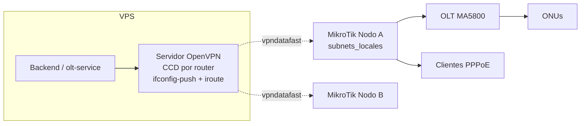

- Rango VPN interno `10.0.0.0/8`; las rutas del VPS proceden de `mikrotik.conf`.
- **La IP VPN de un router es permanente** — bloqueada en el CCD al primer handshake.
- El `iroute` del CCD declara **propiedad** de la subred (sale de `subnets_locales`), no alcanzabilidad.
- A nivel OSPF todo se alcanza; a nivel ERP el modelo es de propiedad. Dos routers reclamando la misma red no falla ruidosamente: responde con naturalidad la atribución equivocada.

## 16.5 Backups

| Aspecto | Detalle |
|---|---|
| Módulo | `backup` — `GET/PATCH /admin/backup/config`, `GET/POST/DELETE /admin/backup[/:id]` |
| Tabla | `backups` |
| Mecanismo | `pg_dump` ejecutado vía docker (usado también por el update transaccional de `sistema`) |
| Destino adicional | Google Drive (`google-drive-backup` en la cola `google-sync`) |
| Volúmenes persistentes | `postgres-data`, `redis-data`, `app-logs`, `certbot-conf`, `certbot-www`, `evolution-data` |

## 16.6 Despliegue y actualización

| Vía | Detalle |
|---|---|
| Scripts | `deploy.mjs`, `deploy-quick.mjs`, `be-deploy.mjs`, `deploy_frontend.mjs`, `deploy_backend_olt.mjs`, `deploy_red_vpn.py` |
| Configuración | `vps.config.mjs` |
| Update desde el ERP | `POST /admin/sistema/update` — update transaccional con `pg_dump` previo, `GET /update-log` |
| Reinicio | `POST /admin/sistema/restart` |
| Instalación nueva | `install.sh`, `installer/`, módulo `install` + `frontend/src/app/installl` |
| Versionado de esquema | `VERSION` + `typeorm_migrations` + `schema-guard` |
| Observación post-update | 48 h (Centro de Operaciones, fase 4, 2026-07-15) |
| Regla de arranque | Cualquier cambio de arranque se hace en `ecosystem.config.js` y se despliega; **nunca con `pm2 start` manual** |

## 16.7 Observabilidad

| Componente | Estado |
|---|---|
| Logs | winston → `/opt/datafast/logs/*.log` (uno por proceso) + volumen `app-logs` |
| Captura de errores de proceso | `common/observabilidad/errores-proceso.ts` (instalado en `main.ts`) |
| Health | `/health`, `/health/live`, `/health/ready`, `/status`, `/health/modules` |
| Estado de módulos degradados | `GET /health/modules` con razón |
| Watchers | `GET /admin/sistema/watchers` (heartbeat) |
| Eventos del sistema | `eventos_sistema` + `GET /admin/sistema/eventos` |
| Colas | `GET /admin/workers/status`, `/jobs` |
| Outbox | `GET /outbox-red/status` |
| **APM / trazas / métricas** | **No existe.** Sin Prometheus, sin OpenTelemetry, sin Grafana. |
| Scripts de diagnóstico | `check-health.mjs`, `check-vps.mjs`, `check-route.mjs`, `check-wa.mjs`, `_monitor*.mjs`, `_vio.mjs` |

---

# CAPÍTULO 17 — Flujo Completo de Información

## 17.1 Alta de cliente con contrato FTTH — de extremo a extremo

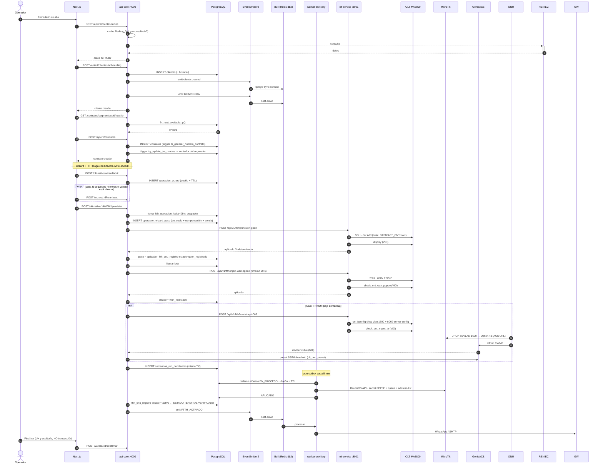

**Frontera transaccional:** es el **estado terminal verificado** (`ftth_onu_registro.estado =
activo`), **no** el clic del operador. Todo lo anterior (`pendiente`, `gpon_registrado`,
`wan_inyectado`, `fallido_*`) es trabajo en vuelo y se anula al cerrar. Lo confirmado jamás se
anula por un cierre: para deshacerlo existe la desaprovisión formal, que pide confirmación y
queda auditada.

El clic no puede ser la frontera por dos razones: (1) es inalcanzable justo en los peores casos
—crash del navegador, caída de sesión, corte de luz— que son los que motivan la regla; (2)
convertiría la regla en fábrica de cortes de servicio (provisión correcta → cliente navegando →
crash → el ERP desaprovisiona a un cliente en producción).

## 17.2 Cierre del wizard sin confirmar — anulación asíncrona

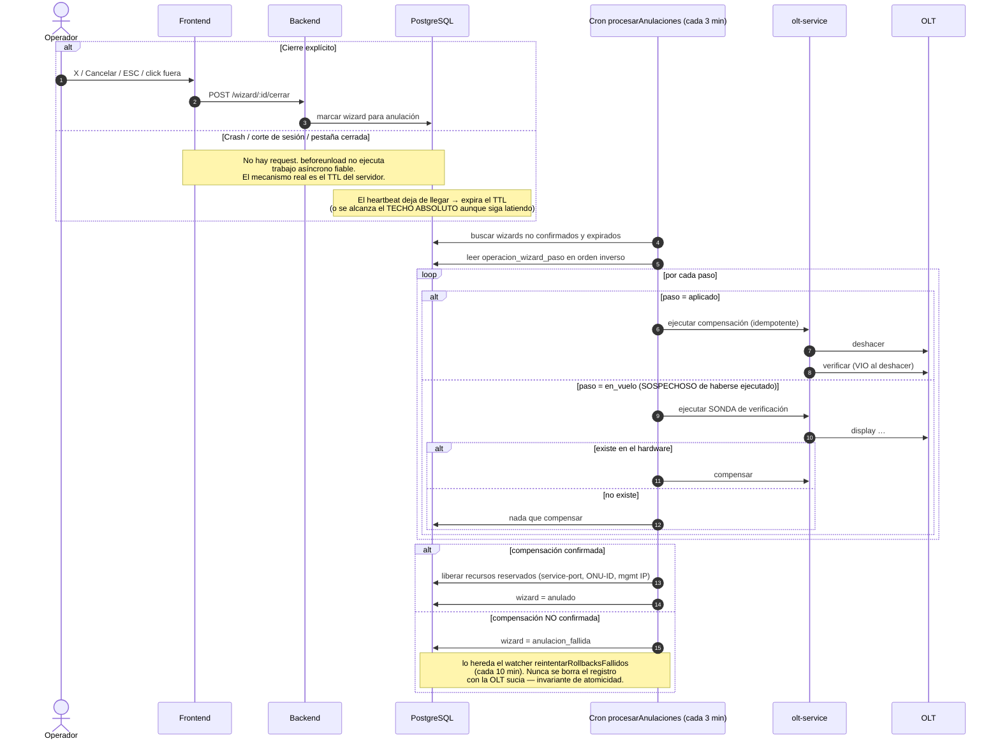

**Nunca se interrumpe una operación de hardware a mitad.** Anular no es abortar: si hay una
operación en vuelo contra la OLT, se **espera** a que termine de forma atómica y recién entonces
se revierte por completo. Por eso la anulación es asíncrona: no es la respuesta al request de
cierre, es un trabajo del servidor.

## 17.3 Ciclo de cobranza — de la factura al corte y de vuelta

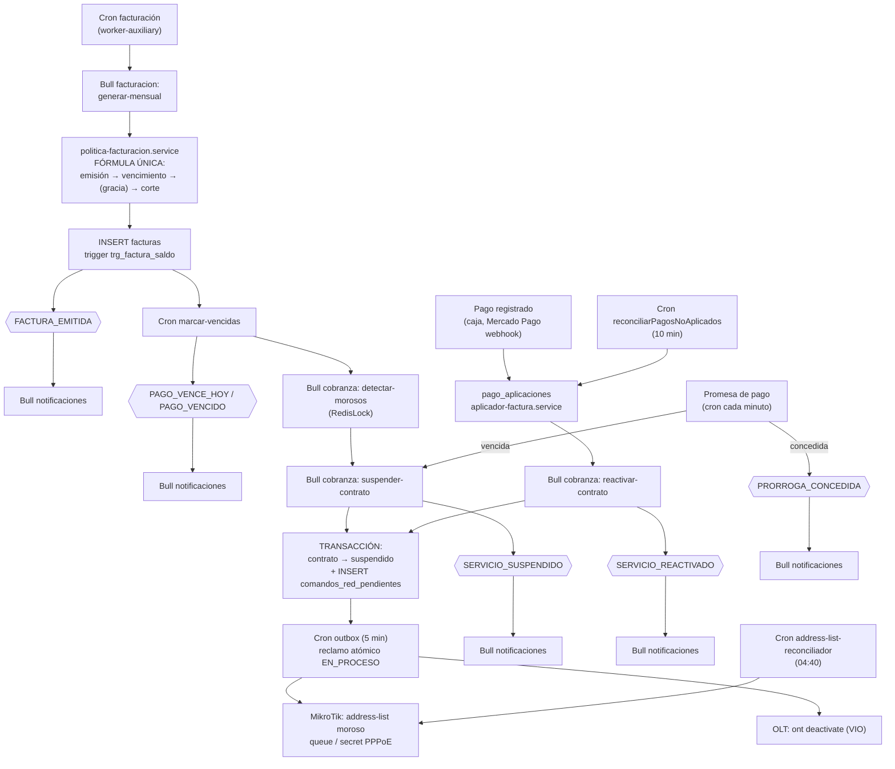

**Regla de negocio central:** el ciclo de cobro tiene **una sola fórmula**, en
`politica-facturacion.service.ts`. La gracia es la **distancia vencimiento→corte**, no se suma al
vencimiento. Antes existían tres fórmulas y el corte llegaba a caer antes del vencimiento
(incidente 05/08, cliente James Pena).

## 17.4 Flujo del portal del abonado

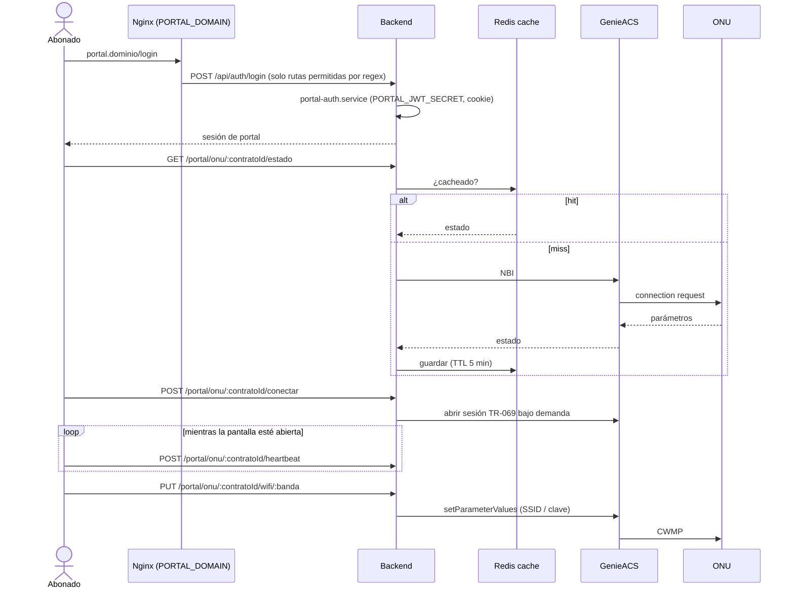

## 17.5 Flujo de notificación

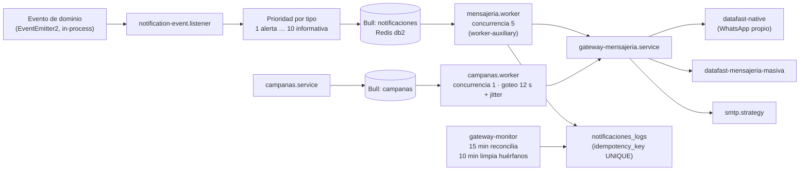

---

# CAPÍTULO 18 — Diagramas UML y C4

## 18.1 C4 Nivel 1 — Contexto

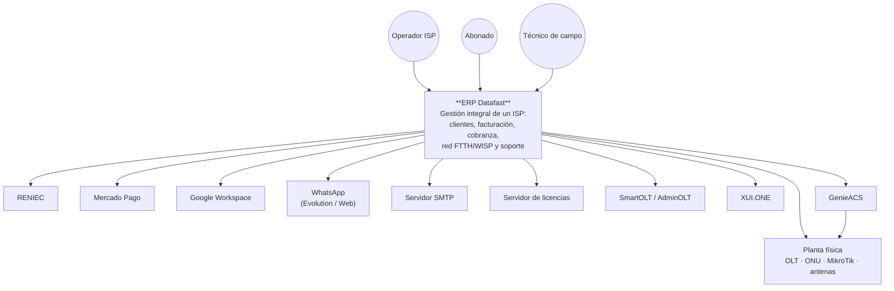

## 18.2 C4 Nivel 2 — Contenedores

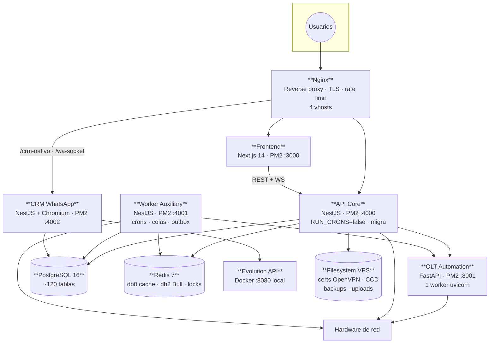

## 18.3 C4 Nivel 3 — Componentes del contenedor `API Core` (vista por dominios)

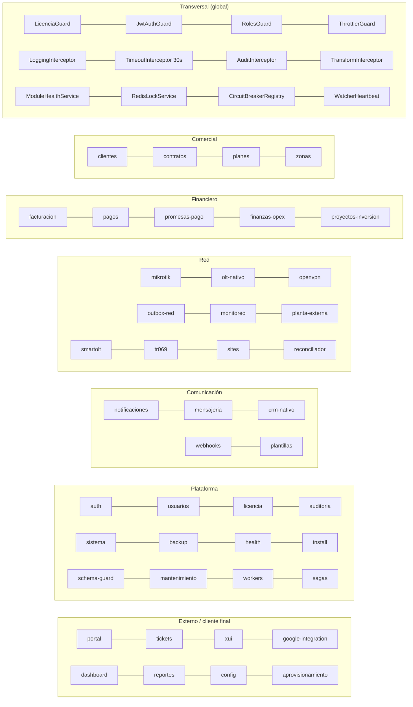

## 18.4 Diagrama de despliegue

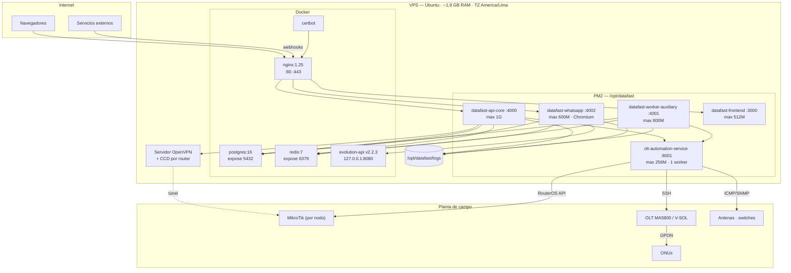

## 18.5 Diagrama de paquetes

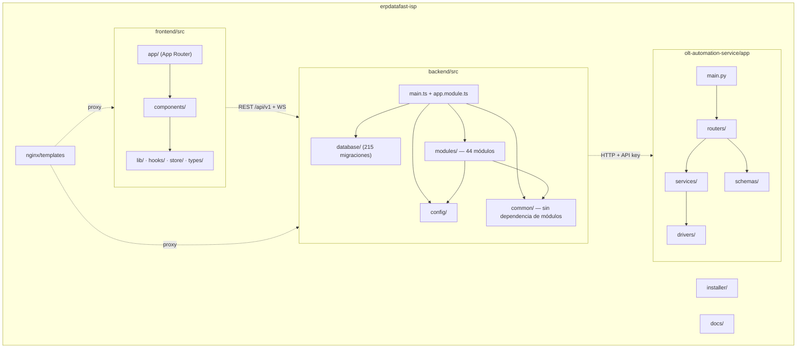

**Nota:** las flechas punteadas son acoplamientos en runtime. **No hay paquete compartido entre
los tres proyectos** — los tipos se duplican entre `backend/**/dto` y `frontend/src/types`.

## 18.6 Diagrama de clases — dominio FTTH (el núcleo de complejidad)

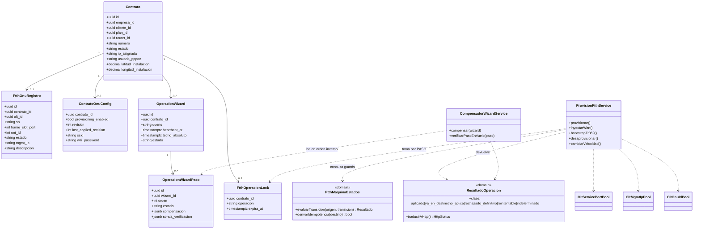

## 18.7 Diagrama de comunicación — quién habla con quién y por qué medio

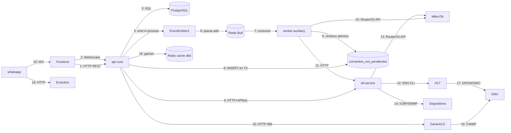

| # | Medio | Síncrono | Cruza proceso |
|---|---|---|---|
| 1, 4, 11, 15, 19 | HTTP | Sí | Sí |
| 2, 20 | WebSocket | Sí (streaming) | Sí |
| 3, 9, 18 | SQL / Redis | Sí | — |
| 5 | EventEmitter2 | Sí | **No — in-process** |
| 6, 7 | Bull sobre Redis | **No** | **Sí** |
| 8, 9 | Outbox en PostgreSQL | **No** | **Sí** |
| 12, 13, 14 | SSH / RouterOS / ICMP | Sí | Sí |
| 16, 17 | CWMP / GPON | **No** (el CPE informa) | — |

## 18.8 Diagrama de secuencia — outbox y su contrato de reintento

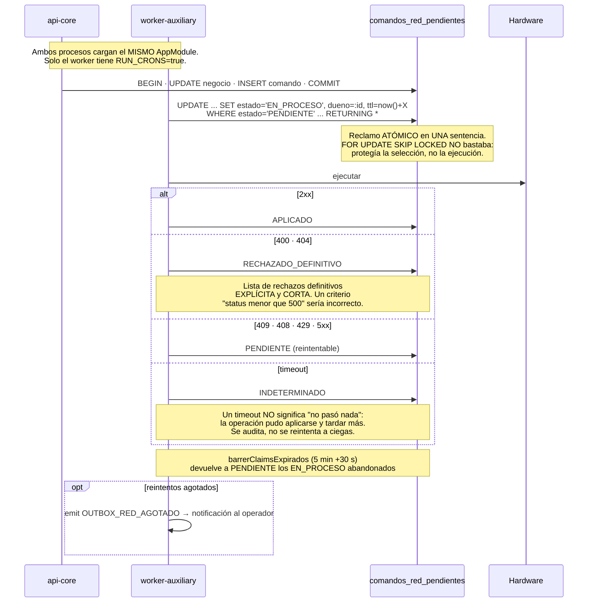

## 18.9 Máquina de estados FTTH (declarativa)

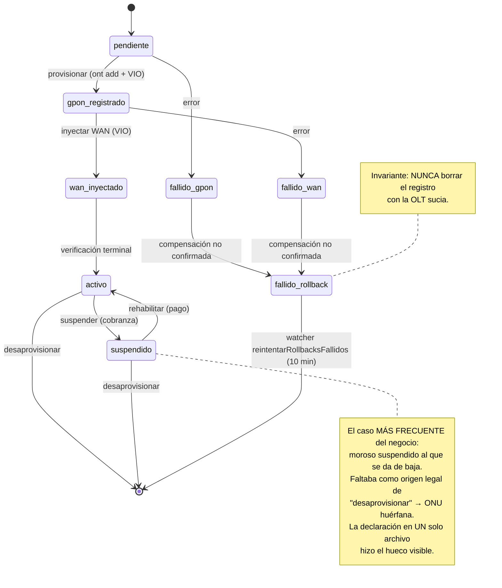

**Idempotencia derivada:** si el recurso ya está en el estado destino, la operación devuelve
`ya_en_destino` (ÉXITO). Un método nuevo no puede olvidarse de ser idempotente porque no es él
quien lo implementa.

---

# CAPÍTULO 19 — Inventario de Código

## 19.1 Recuento global

| Artefacto | Cantidad |
|---|---|
| Módulos NestJS | 44 (+1 vacío) |
| Controladores | 46 |
| Endpoints HTTP | ~560 |
| Servicios (`*.service.ts`) | ~160 |
| Entidades TypeORM | 81 |
| Migraciones | 215 archivos |
| Crons | 29 tareas |
| Colas Bull | 6 |
| Processors | 6 |
| Listeners de eventos | 25 |
| WebSocket gateways | 3 |
| Guards globales | 4 |
| Interceptors globales | 4 (+`ClassSerializerInterceptor`) |
| Filtros globales | 1 |
| Tests `*.spec.ts` | ~30 |
| LOC TypeScript (backend `modules/`) | ~96.000 |
| LOC Python (`services/`) | 5.520 |
| Páginas Next.js | 92 |

## 19.2 Controladores (46)

`aprovisionamiento`, `auditoria`, `auth`, `backup`, `clientes`, `config`, `contratos`,
`crm-nativo`, `dashboard`, `facturacion` ×2 (`facturacion`, `comprobantes-config`),
`finanzas-opex`, `google-integration`, `health`, `install`, `licencia`, `mensajeria/campanas`,
`mikrotik` ×2 (`mikrotik`, `velocidad`), `monitoreo`, `olt-nativo`, `openvpn` ×2 (`openvpn`,
`vpn-cliente`), `outbox-red`, `pagos`, `planes`, `planta-externa`, `plantillas`, `portal` ×2
(`portal`, `portal-config`), `promesas-pago`, `proyectos-inversion`, `reportes`, `sistema`,
`sites`, `smartolt`, `tickets`, `tr069`, `usuarios` (4 `@Controller` en un archivo),
`webhooks/whatsapp-webhook`, `workers`, `xui`, `zonas`.

## 19.3 Servicios por dominio

### `olt-nativo` (41 archivos `*.service.ts` / spec)

Conexión y ejecución: `olt-conn.service`, `olt-operation-router.service`,
`olt-provider-registry.service`, `circuit-breaker.service`, `olt-idempotency.service`,
`olt-atomic-lock.service`, `ftth-operacion-lock.service`.
Configuración: `olt-baseline.service`, `olt-baseline-plan.service`, `olt-compliance.service`,
`olt-lineprofile.service`, `olt-srvprofile.service`, `olt-traffic-table.service`,
`olt-vlan.service`, `infrastructure-snapshot.service`.
Pools: `olt-service-port-pool.service`, `olt-mgmt-ip-pool.service`, `olt-onu-id-pool.service`.
Provisión y saga: `provision-ftth.service`, `operacion-wizard.service`,
`operacion-wizard-paso.service`, `compensador-wizard.service`.
Observación: `olt-sync.service`, `olt-inventario-refresh.service`, `olt-health-monitor.service`,
`olt-health-dashboard.service`, `olt-alert-engine.service`, `tr069-staleness.service`.
Subdirectorio `cpe-provisioning/` (esqueleto de aprovisionamiento multicanal:
OMCI(1) → TR-069(2) → Option 43(aux) → HTTP(excepcional)).
Dominio: `domain/ftth-maquina-estados.ts`.
Crons: `ftth-recovery`, `ftth-wan-watcher`, `olt-health-poller`, `tr069-cpe-drift-watcher`,
`ztp-reconcile`.

### `mikrotik` (15)

`mikrotik.service`, `connection-pool.service`, `pppoe.service`, `queue.service`,
`firewall.service`, `arp.service`, `interface.service`, `wireless.service`,
`subnet-route.service`, `mikrotik-user.service`, `address-list-reconciliador.service`,
`services/velocidad/`, `velocidad.worker`, `reconciliacion.worker`.

### `portal` (10)

`portal-auth.service` + `portal-auth.guard`, `portal-tenant.service`, `portal-cliente.service`,
`portal-facturacion.service`, `portal-onu.service`, `portal-consumo.service`,
`portal-planes.service`, `portal-soporte.service`, `portal-config.service`,
`consumo-colector.service` + cron.

### `facturacion` (6) y `pagos` (5)

`facturacion.service`, `politica-facturacion.service`, `deuda-por-contrato.service`,
`aplicador-factura.service`, `pdf.service`, `comprobantes-config.service`, `facturacion.worker`.
`pagos.service`, `canal-pago.service`, `arqueo-caja.service`, `adelantos.service`,
`mercadopago.service`.

### `notificaciones` (2 + 4 estrategias)

`gateway-mensajeria.service`, `whatsapp.service`, y estrategias `datafast-native`,
`datafast-mensajeria-masiva`, `smtp`.

## 19.4 Guards, interceptors, pipes, filtros

| Tipo | Nombre | Alcance |
|---|---|---|
| Guard | `LicenciaGuard` | Global (#1) |
| Guard | `JwtAuthGuard` | Global (#2) |
| Guard | `RolesGuard` | Global (#3) |
| Guard | `ThrottlerGuard` | Global (#4) |
| Guard | `WsJwtGuard` | WebSockets |
| Guard | `PortalAuthGuard` | Módulo `portal` |
| Interceptor | `LoggingInterceptor` | Global |
| Interceptor | `TimeoutInterceptor(30 s)` | Global |
| Interceptor | `AuditInterceptor` | Global |
| Interceptor | `TransformInterceptor` | Global |
| Interceptor | `ClassSerializerInterceptor` | Global (`main.ts`) |
| Pipe | `ValidationPipe` (whitelist, transform, implicit conversion) | Global |
| Filtro | `AllExceptionsFilter` | Global |
| Decoradores | `@CurrentUser`, `@Public`, `@Roles`, `@RequirePermission` | Por endpoint |
| Middleware | `helmet`, `compression`, `morgan`, `trust proxy 1` | Global (`main.ts`) |
| Middleware (Python) | `api_key_middleware` | Global en FastAPI |

## 19.5 DTOs, interfaces y adaptadores

| Artefacto | Ubicación |
|---|---|
| DTOs | `modules/*/dto/` — validados con `class-validator` |
| DTO común | `common/dto/response.dto.ts` |
| Interfaces | `common/interfaces/degradable.interface.ts` |
| Dominio | `common/domain/resultado-operacion.ts`, `olt-nativo/domain/ftth-maquina-estados.ts` |
| Schemas Python | `olt-automation-service/app/schemas/{olt,mikrotik,monitoring}.py` (Pydantic) |
| **Adaptadores de hardware (Python)** | `olt-automation-service/app/drivers/{base,huawei,vsol}.py` |
| **Puerto + adaptadores OLT (TS)** | `olt-nativo/interfaces/olt-provider.interface.ts` (`IOltProvider`) con 3 implementaciones: `providers/{nativo-ssh,smartolt,adminolt}.provider.ts`, enrutadas por `olt-provider-registry.service.ts` + `olt-operation-router.service.ts` |
| **Puerto de cobro** | `pagos/adaptadores/adaptador-cobro.interface.ts` — contrato fijado sin implementaciones, **deliberadamente** (ver `pagos/adaptadores/README.md`) |
| Puerto de aprovisionamiento | `aprovisionamiento/interfaces/provisionamiento-provider.interface.ts` + `providers/mock-provisionamiento.provider.ts` |
| Driver ACS | `olt-nativo/ztp/genieacs.driver.ts` + `registry.ts` + `resolver.ts` + `device-profiles/` + `parameter-maps/` |
| Estrategias de mensajería | `notificaciones/services/*.strategy.ts` |
| **Repositorios propios** | Existen en **6 módulos**: `clientes`, `contratos`, `facturacion`, `pagos`, `smartolt`, `tickets` (`*/repositories/*.repository.ts`, 1.614 LOC). Los **38 módulos restantes** acceden a `Repository<T>` y `DataSource.query()` directamente desde el servicio. |

## 19.6 Tests

~30 archivos `*.spec.ts`, colocados junto al código. Los más significativos —y lo son porque
**nombran el incidente que los motivó**, según la regla explícita del proyecto:

| Test | Qué protege |
|---|---|
| `outbox-red.claim.spec.ts` | Reclamo atómico: dos instancias PM2 no toman el mismo comando |
| `ftth-maquina-estados.spec.ts` | Transiciones legales e idempotencia derivada |
| `resultado-operacion.spec.ts` | Clasificación de resultados y traducción a HTTP |
| `frontera-dinero.spec.ts` | Un solo escritor del saldo |
| `extorno.spec.ts` | Reversión de pago |
| `politica-facturacion.service.spec.ts` | Fórmula única del ciclo de cobro |
| `estados-sql-validos.spec.ts` | Los estados usados en SQL existen |
| `deuda-por-contrato.service.spec.ts` | Cálculo de deuda |
| `pagos.reconciliacion.spec.ts` | Pagos no aplicados |
| `portal-auth.aislamiento.spec.ts` | Un token de portal no accede a otro tenant |
| `portal-cookies.spec.ts` | Manejo de cookies del portal |
| `router-zombi.spec.ts` | Baja de router limpia el cliente VPN |
| `subnet-route.remove.spec.ts` | Retiro de ruta |
| `olt-ownership-guard.spec.ts` | Propiedad de recursos OLT |
| `olt-perfiles-idempotencia.spec.ts` | Perfiles idempotentes |
| `provision-ftth.autoconfig.spec.ts`, `provision-ftth.barrido-carril.spec.ts` | Auto-config y barrido del carril |
| `descripcion-consolidada.spec.ts` | Descripción del `ont` en la OLT |
| `tr069-staleness.service.spec.ts` | Sesiones rancias |

**[CORREGIDO 2026-08-06]** Medición real: **65 suites · 593 tests**, todas en verde en 70 s, ejecutadas por CI en cada push y PR junto con typecheck, instalación desde cero y `sql:check`. La cifra "~30" y las deudas "la suite no compila" y "el barrido SQL no está en CI" eran **falsas**: se propagaron desde una memoria del 2026-07-28 sin ejecutar el comando. **La brecha real de cobertura es el frontend (2 tests).**

## 19.7 Frontend

| Artefacto | Cantidad / detalle |
|---|---|
| Páginas | 92 (`page.tsx`) — 3 auth, 68 dashboard, 10 portal, install, raíz |
| Grupos de rutas | `(auth)`, `(dashboard)`, `portal/(privado)` |
| Directorios de componentes | 23 — mezcla de atomic design, dominio y función |
| Stores Zustand | 4 |
| Hooks | 5 |
| Cliente API | `lib/api.ts` + `lib/api/` |
| Middleware | `middleware.ts` (protección de rutas en edge) |
| Utilidades de dominio | `senal-ftth.ts`, `coordenadas.ts`, `paises-timezone.ts`, `parseApiError.ts` |
| Tests | `como-llegar.test.ts`, `coordenadas.test.ts` (**solo 2 en todo el frontend**) |
| Directorios no productivos | `mock-data/` presente en el árbol |
