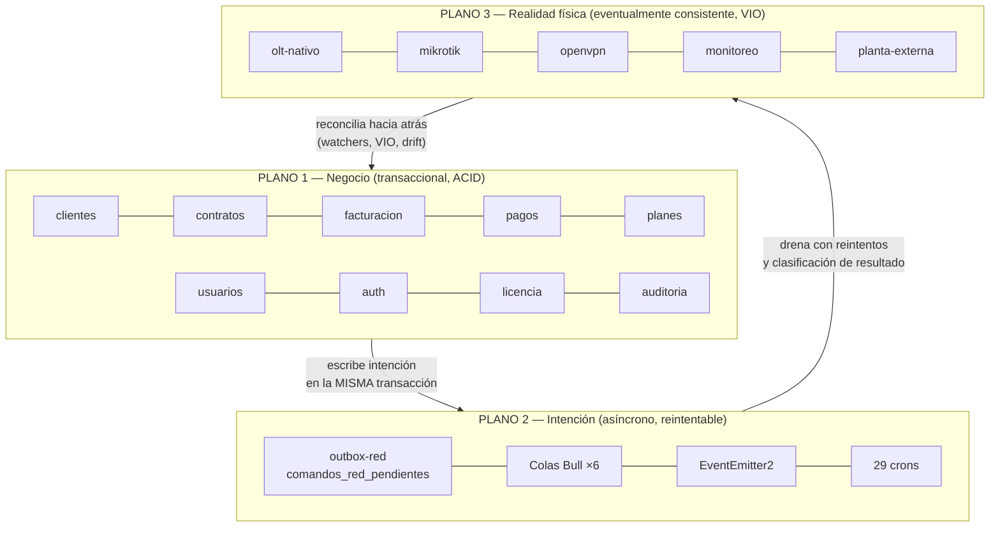
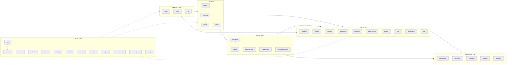
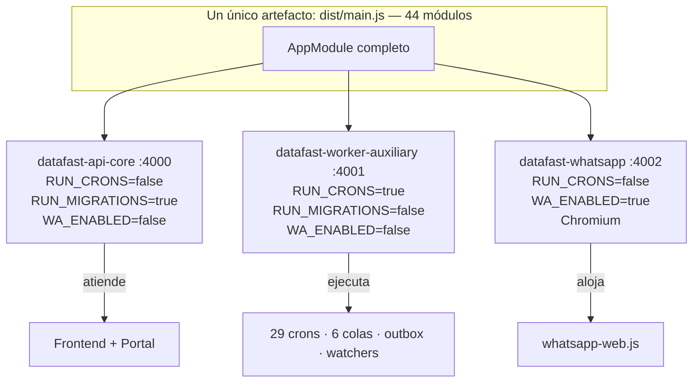

# Capítulos 1–2 — Arquitectura General y Arquitectura del Backend

---

# CAPÍTULO 1 — Arquitectura General

## 1.1 Qué es realmente el ERP Datafast

No es un monolito tradicional ni una arquitectura de microservicios. Es un patrón concreto y
poco común que conviene nombrar con precisión, porque casi todas las decisiones futuras dependen
de entenderlo bien:

> **Monolito modular de despliegue segmentado por rol, con un satélite de protocolo y un plano
> de red gobernado por outbox transaccional.**

Descompuesto:

| Componente del enunciado | Qué significa aquí |
|---|---|
| **Monolito modular** | Un solo `dist/main.js`, 44 módulos NestJS con fronteras declaradas por `@Module` |
| **Despliegue segmentado por rol** | El **mismo binario** corre como 3 procesos PM2 distintos, diferenciados solo por variables de entorno (`RUN_CRONS`, `RUN_MIGRATIONS`, `WA_ENABLED`) |
| **Satélite de protocolo** | `olt-automation-service` (FastAPI) existe por una razón de **ecosistema de librerías** (netmiko/paramiko son Python), no por separación de dominio |
| **Outbox transaccional** | Las mutaciones de red no se ejecutan en línea: se persisten en `comandos_red_pendientes` dentro de la transacción del negocio y las drena un cron |

## 1.2 Los tres planos del sistema

La organización lógica real del ERP no sigue las carpetas. Sigue **tres planos con garantías
distintas**, y esa es la lectura que un arquitecto necesita:

| Plano | Garantía | Verdad | Fallo típico |
|---|---|---|---|
| **1 — Negocio** | ACID en PostgreSQL | La BD **es** la verdad | Violación de invariante contable |
| **2 — Intención** | Entrega eventual con reintentos acotados | La verdad es "esto debe pasar" | Comando agotado / claim huérfano |
| **3 — Realidad física** | Consistencia eventual verificada (VIO) | **El hardware es la verdad; la BD es una creencia** | Discordancia físico↔lógico (ONU huérfana) |

**La regla que ordena todo el sistema:** el plano 1 nunca llama al plano 3 directamente en una
operación de negocio. Escribe en el plano 2. Cuando esa regla se salta —y se salta en las
operaciones interactivas del operador— aparecen los problemas de latencia y timeout
documentados.

## 1.3 Organización lógica por dominios

Los 44 módulos se agrupan en 6 dominios funcionales reales:

## 1.4 Los cuatro mecanismos de comunicación y cuándo se usa cada uno

Esta es la tabla que más falta hace al equipo: **hoy la elección del mecanismo no está
normada**, y de ahí sale buena parte de los problemas.

| # | Mecanismo | Implementación | Cruza proceso | Sobrevive reinicio | Uso actual real |
|---|---|---|---|---|---|
| 1 | **Llamada directa** (DI) | Inyección NestJS | No | — | La mayoría de interacciones entre módulos |
| 2 | **EventEmitter2** | `@nestjs/event-emitter` | **No — in-process** | **No** | 25 listeners, casi todos solo para encolar |
| 3 | **Colas Bull** | Redis db=2 | Sí | Sí | 6 colas: cobranza, facturación, notificaciones, campañas, google-sync, velocidad |
| 4 | **Outbox** | Tabla PostgreSQL | Sí | **Sí, transaccionalmente** | Toda mutación de red disparada por el negocio |
| 5 | **HTTP** | axios | Sí | No | Backend → `olt-automation-service`, GenieACS, terceros |

**Hecho crítico poco evidente:** el bus de eventos es in-process. Un evento emitido en
`datafast-api-core` **no llega** a `datafast-worker-auxiliary`. Funciona porque los listeners no
hacen trabajo: encolan en Bull, que sí cruza procesos vía Redis. **El bus de eventos es, en la
práctica, un adaptador hacia las colas.** Si algún día un listener hiciera trabajo real, fallaría
silenciosamente según el proceso en que se emitiera el evento.

## 1.5 Segmentación de procesos — el mapa de responsabilidad

| Proceso | Responsabilidad exclusiva | Si muere… |
|---|---|---|
| `api-core` | Atender peticiones; ejecutar migraciones al arrancar | El ERP deja de responder, pero la cobranza y el outbox siguen |
| `worker-auxiliary` | **Todo lo automático** | El ERP responde normalmente mientras la red deja de aplicarse, nadie se corta, nadie se reactiva y ningún watcher repara nada — **sin ninguna señal en la interfaz** |
| `whatsapp` | Chromium | Se pierde la bandeja de WhatsApp; nada más |
| `olt-automation-service` | Todo el acceso a OLT | Ninguna operación FTTH funciona |
| `frontend` | Render | Nadie entra |

**El aislamiento es correcto y deliberado** (Chromium fuera del worker tras dejar el VPS con 87 MB
libres; migraciones en un solo proceso tras la colisión del 21/07). La debilidad no está en la
segmentación sino en que **la diferenciación es por variable de entorno leída dentro de cada
servicio**: un servicio nuevo que olvide comprobar `RUN_CRONS` ejecutará su cron en los tres
procesos a la vez.

## 1.6 Estilo arquitectónico por dominio (no es uniforme, y no debería serlo)

| Dominio | Estilo real | ¿Adecuado? |
|---|---|---|
| Comercial / Financiero | Transaction Script sobre TypeORM + repositorio parcial | Sí — dominio CRUD-intensivo con invariantes contables |
| Red / OSS | **Ports & Adapters + máquina de estados + saga + outbox** | Sí — es el estilo correcto para consistencia eventual contra hardware |
| Comunicación | Event-driven + Strategy | Sí |
| Cliente final (portal) | Fachada sobre otros dominios, con auth propia | Sí |
| Plataforma | Aspectos transversales (guards/interceptors globales) | Sí |

**Conclusión del capítulo:** la heterogeneidad de estilos **no es un defecto**: cada dominio usa
el estilo que su naturaleza exige. El defecto es que **la elección no está escrita en ninguna
parte**, así que un módulo nuevo elige por imitación del vecino más cercano en el árbol de
carpetas, no por naturaleza del problema.

---

# CAPÍTULO 2 — Arquitectura del Backend

## 2.1 Composición

| Capa | Elementos | Estado |
|---|---|---|
| Entrada HTTP | 46 controladores, ~560 endpoints, prefijo `/api/v1` | Uniforme |
| Aspectos transversales | 4 guards + 5 interceptors + 1 pipe + 1 filtro, **todos globales** | Uniforme y correcto |
| Servicios de aplicación | ~160 `*.service.ts` | Heterogéneo en tamaño |
| **Repositorios** | 6 módulos (1.614 LOC) | **Parcial — 14 % de cobertura** |
| **Puertos y adaptadores** | 4 puertos, 5 adaptadores | **Parcial, pero en los sitios correctos** |
| **Dominio explícito** | 2 máquinas de estados, `ResultadoOperacion`, catálogo de capacidades, presupuesto óptico | **Parcial — solo en red** |
| Entidades | 81 TypeORM sobre ~120 tablas | **Parcial — 39 tablas sin entidad** |
| Persistencia directa | 445 llamadas `.query()` | Muy extendido |
| Procesos automáticos | 29 crons, 6 colas, 6 processors, 25 listeners | Concentrados en un proceso |

## 2.2 Los componentes más críticos

Criticidad = (impacto de su fallo) × (irreversibilidad del daño). **Valoración.**

| # | Componente | Por qué es crítico | Daño si falla mal |
|---|---|---|---|
| 1 | `outbox-red.service.ts` | Es la única frontera transaccional entre el negocio y el hardware | Un comando duplicado corta a un cliente pagado; uno perdido deja a un moroso navegando |
| 2 | `provision-ftth.service.ts` | Escribe en el plano físico | ONU huérfana: existe en la OLT y no en el ERP (o al revés) |
| 3 | `politica-facturacion.service.ts` | **Fórmula única** del ciclo de cobro | Corte antes del vencimiento a todo el parque (ya ocurrió: 05/08) |
| 4 | `aplicador-factura.service.ts` | Único escritor del saldo | Dinero aplicado a facturas anuladas (ya ocurrió en la copia de `adelantos`) |
| 5 | `cobranza.worker.ts` | Decide quién se queda sin servicio | Corte masivo indebido |
| 6 | `LicenciaGuard` | Primer guard global | Bloquea el ERP completo, incluido `auth` |
| 7 | `connection-pool.service.ts` (MikroTik) | Único acceso a routers desde NestJS | Pérdida de gestión de toda la planta WISP |
| 8 | `openvpn` (CCD + certs) | Único canal hacia los MikroTik | Sin VPN no hay red gestionable |
| 9 | `olt-operation-router.service.ts` + `IOltProvider` | Enruta y clasifica todo lo que va a la OLT | Clasificación errónea → 1.788 reintentos (ya ocurrió) |
| 10 | `ftth-maquina-estados.ts` | Define qué transiciones son legales | Un origen faltante deja ONUs huérfanas (ya ocurrió con `suspendido`) |

## 2.3 Componentes que concentran demasiadas responsabilidades

| Componente | Métrica | Responsabilidades mezcladas |
|---|---|---|
| **`olt-nativo` (módulo)** | 25.659 LOC · 41 servicios · 24 entidades · 11 crons | Inventario · configuración declarativa · 3 pools de recursos · provisión FTTH · TR-069/ZTP · saga de wizard · locking/idempotencia · salud/firmware · multi-proveedor |
| **`olt-nativo.controller.ts`** | 1.845 LOC · ~150 endpoints | 17 grupos funcionales distintos en un archivo |
| **`provisioning.py`** | 4.792 LOC | Todos los modelos de OLT × todas las operaciones × verificación × rollback |
| **`ClienteDetalle.tsx`** (frontend) | 3.776 LOC | Ficha, contratos, facturación, pagos, ONU, router, historial, tickets |
| **`contratos.service.ts`** | 3.894 LOC (módulo) · 8 dependencias | Contrato + pool IPv4 + activación + prórroga + disparo de aprovisionamiento |
| **`pagos.service.ts`** | 5.836 LOC (módulo) | Registro + canales + conciliación + Mercado Pago + arqueo + adelantos + extorno |
| **`sistema`** | 13 endpoints | Watchers + eventos + update + reinicio + crontab + logs de notificación + gateway |

**Matiz importante sobre `olt-nativo`:** su tamaño es en parte **irreductible** — el dominio FTTH
es genuinamente el más complejo del negocio. Pero contiene al menos **cinco subdominios
separables con fronteras ya visibles en el propio árbol** (`capability/`, `compliance/`,
`domain/`, `ztp/`, `providers/`). El módulo ya se está dividiendo solo; lo que falta es
formalizarlo.

## 2.4 Componentes con mayor riesgo de mantenimiento

Riesgo = probabilidad de que un cambio rompa algo no relacionado. **Valoración.**

| Riesgo | Componente | Causa medible |
|---|---|---|
| **Muy alto** | `olt-nativo.controller.ts` | 150 endpoints en un archivo: cualquier merge lo toca |
| **Muy alto** | Las 39 tablas sin entidad | Un cambio de esquema no rompe la compilación — incluye outbox, lock FTTH y saga |
| **Alto** | `provisioning.py` | Sin tipado fuerte, sin tests, 4.792 LOC, toca hardware real |
| **Alto** | `contratos` | 8 dependencias salientes; es el nodo del que más cosas cuelgan |
| **Alto** | Los 4 ciclos de dependencia | Un cambio de firma puede requerir tocar ambos lados a la vez |
| **Alto** | `workers.constants.ts` | Importado por 6 módulos solo por constantes: acopla módulos que no ejecutan workers |
| **Medio-alto** | Los 29 crons en un proceso | Un cron nuevo compite con la cobranza y el outbox |
| **Medio-alto** | Las 445 llamadas `.query()` | El SQL crudo no se refactoriza con el compilador |
| **Medio** | `ClienteDetalle.tsx` | 3.776 LOC: el archivo que todo el equipo toca |
| **Medio** | Triggers de negocio en PostgreSQL | 3 reglas financieras/de red fuera del alcance de los tests |

## 2.5 Análisis por tipo de componente

### 2.5.1 Controladores

**Fortaleza:** convención uniforme, versionado URI, validación por DTO, respuesta normalizada.

**Debilidades medidas:**
- Distribución desbalanceada: 1 controlador con 150 endpoints, 8 con menos de 5.
- `@RequirePermission` aplicado en **4 de 44 módulos** (`contratos`, `planes`, `zonas`, `promesas-pago`). Los demás dependen solo de rol.
- `@SetMetadata('skipAudit', true)` aplicado sistemáticamente solo en `contratos`: el resto audita lecturas de alto volumen.
- El aislamiento multi-tenant depende de que cada handler pase `empresaId` — no hay guard que lo garantice.

### 2.5.2 Servicios

**Fortaleza:** los servicios del plano de red devuelven `ResultadoOperacion` (vocabulario de
dominio), no excepciones HTTP. Es una decisión avanzada y correcta.

**Debilidades:**
- Cobertura del vocabulario limitada al plano de red; el plano financiero sigue lanzando excepciones HTTP a consumidores que a veces son máquinas.
- Servicios con acceso directo a `DataSource` conviviendo con servicios que usan repositorio, **dentro del mismo módulo**.
- No hay separación explícita entre servicio de aplicación (orquesta) y servicio de dominio (decide).

### 2.5.3 Repositorios

Existen en 6 módulos. Ver Cap. 0.1. **La forma ya está decidida y es correcta**; el problema es
la cobertura (14 %) y que su existencia no impide que el mismo módulo consulte por fuera.

### 2.5.4 Entidades

- 81 entidades para ~120 tablas → **39 tablas sin tipar**, entre ellas las más críticas del plano de intención (`comandos_red_pendientes`, `ftth_operacion_lock`, `operacion_wizard`, `operacion_wizard_paso`) y del financiero (`pago_extorno`, `cierre_caja`, `cuentas_bancarias`).
- Convención de ubicación inconsistente (`entities/` vs raíz del módulo).
- `smartolt/entities/onu.entity.ts` mapea la tabla `olts`.
- Riesgo conocido y documentado: columnas `string | null` sin `type:` explícito crashean el backend en frío bajo SWC.

### 2.5.5 Cron jobs

29 tareas, todas en `worker-auxiliary`. Análisis en Cap. 10 (riesgos). Puntos estructurales:

- La protección es `RUN_CRONS` comprobado **dentro de cada servicio** — es una convención, no un mecanismo.
- Cinco barridos pesados en 100 minutos de madrugada (03:00 → 04:40).
- Frecuencias que van de **30 segundos** (XUI) a diaria, sin criterio declarado.
- Ningún cron declara su presupuesto de tiempo ni su cap de trabajo. `reconciliar()` itera sin límite ni lock.

### 2.5.6 Workers y colas

**Fortaleza notable:** matriz de prioridades y política de reintentos por tipo de job
(`JOB_OPTIONS`), con goteo y jitter para campañas y concurrencia 1 para no saturar el gateway.
Esto es diseño operativo maduro.

**Debilidad:** `workers.constants.ts` mezcla tres cosas —nombres de cola, tipos de payload y
política de reintentos— y por eso lo importan 6 módulos, creando acoplamiento donde solo hacía
falta una constante.

### 2.5.7 Eventos

- 15 eventos de notificación + 8 de dominio + 3 de WebSocket.
- **El bus es in-process** (§1.4): es funcionalmente un adaptador hacia Bull.
- No hay catálogo versionado de eventos ni contrato de payload; el payload se define en el emisor.

### 2.5.8 Guards, interceptors y middleware

Los mejor resueltos del sistema: 4 guards globales en orden correcto, 5 interceptors, filtro
único. **Observación estructural:** `TimeoutInterceptor(30 s)` es global y las operaciones de
hardware legítimas duran 90–150 s. El sistema lo resuelve haciéndolas asíncronas, que es
correcto — pero significa que **cualquier operación síncrona nueva contra hardware nace rota**, y
nada lo impide en tiempo de compilación.

### 2.5.9 Configuración

**Fortaleza destacable:** la regla de portabilidad multi-VPS está implementada, no solo escrita —
sin IPs ni dominios en el repositorio, lazy getters para constantes de módulo, `.env.example`
como contrato, `ecosystem.config.js` sin secretos. Es de las prácticas más maduras del proyecto.

**Debilidad:** la configuración *de negocio* está dispersa en 6 tablas sin servicio unificado
(`empresas`, `configuracion_facturacion`, `portal_config`, `olt_onu_preset`, `openvpn_config`,
`olt_proveedor_config`), y hay campos que se guardan y no se usan (`mora`, `reconexión`,
`esquemaImpuesto`, `impuesto1`, `avisoPantalla`).
