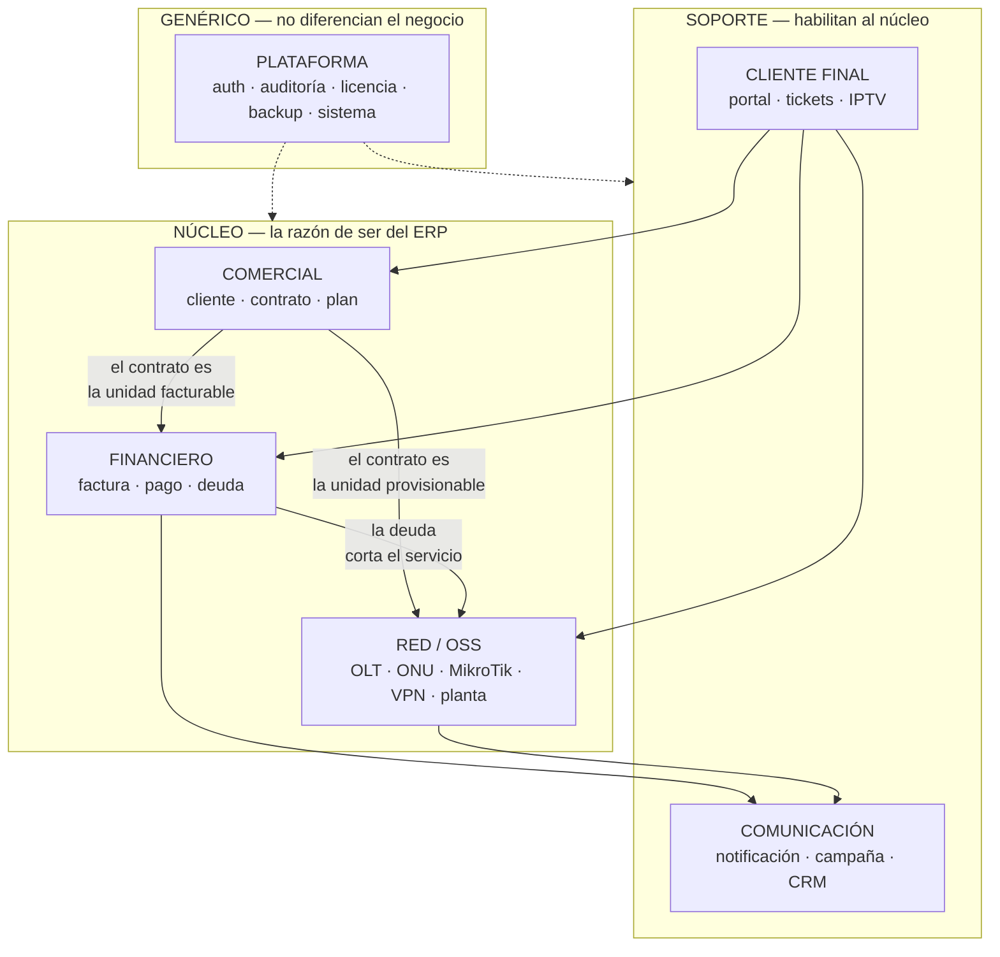
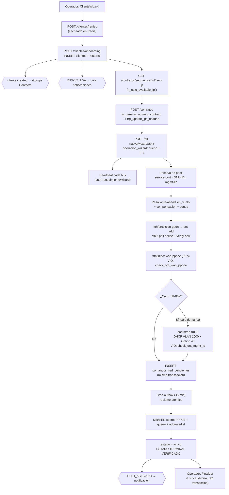
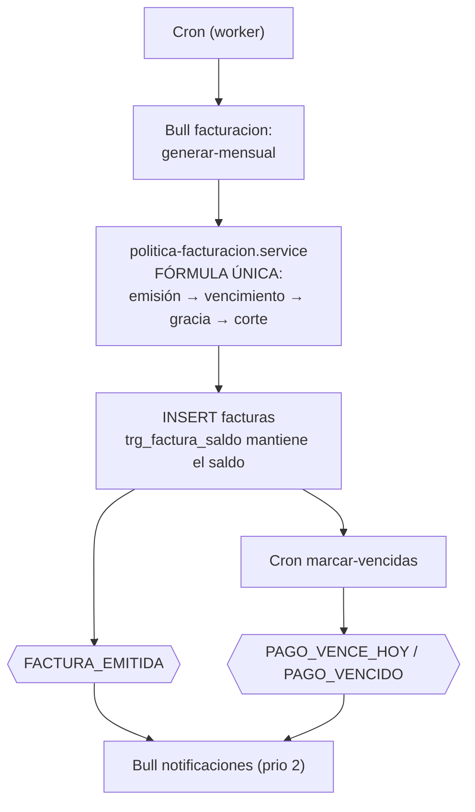
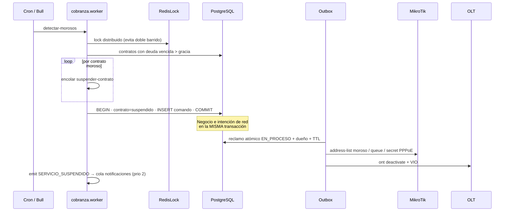
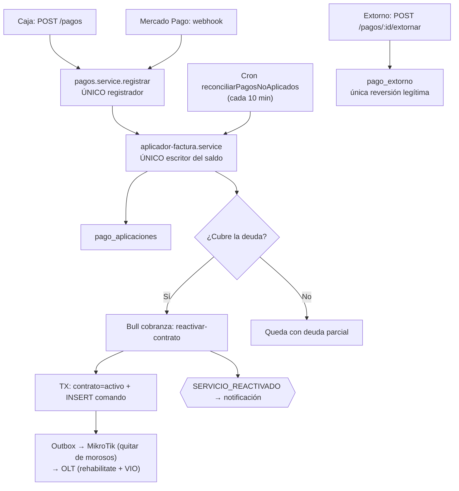
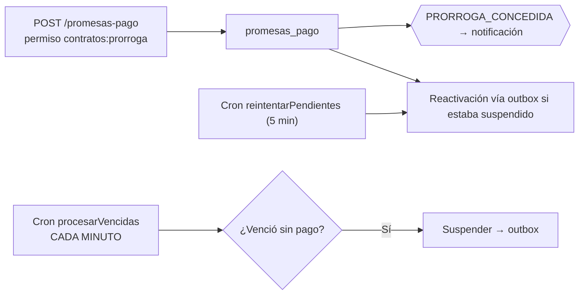
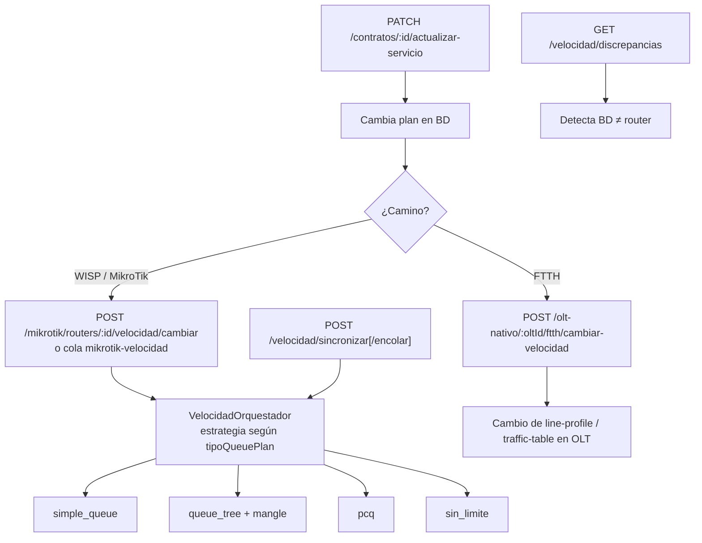
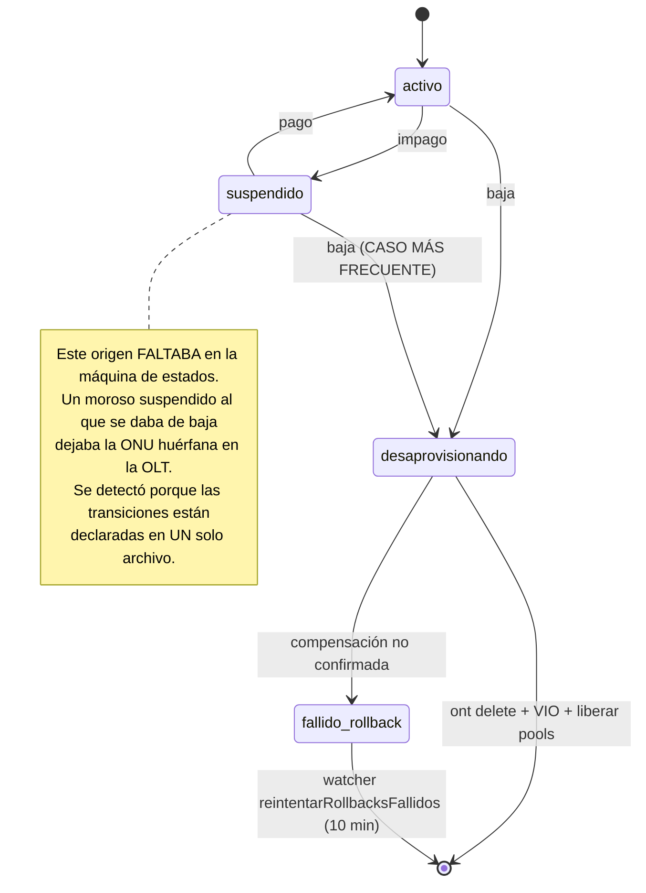
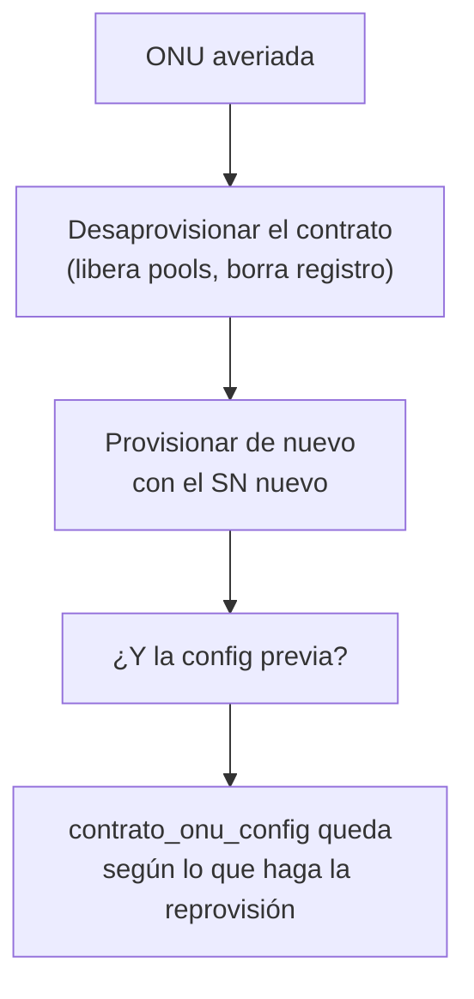

# Capítulos 5–7 — Modelo de Negocio, Integraciones y Flujos

---

# CAPÍTULO 5 — Modelo de Negocio

> Se documentan los dominios **existentes**. No se proponen dominios nuevos.

## 5.1 Mapa de dominios

## 5.2 El objeto central: el contrato

**`contrato` es la unidad operativa del ERP.** No lo es el cliente. Un cliente sin contrato no
factura, no consume red y no aparece en el mapa. Todo el sistema pivota sobre él:

| Dominio | Qué le cuelga al contrato |
|---|---|
| Comercial | cliente, plan, zona, coordenadas de instalación |
| Financiero | facturas, cargos pendientes, promesas de pago, deuda |
| Red | IP asignada, usuario PPPoE, router, `ftth_onu_registro`, `contrato_onu_config`, acometida, puerto NAP |
| Cliente final | sesión de portal, tickets, consumo, línea IPTV |
| Coordinación | `ftth_operacion_lock`, `operacion_wizard`, comandos de red pendientes |

Esto explica —y en buena medida **justifica**— que `contratos` sea el módulo con más
dependencias salientes del sistema (8). No es acoplamiento accidental: es el reflejo de que el
contrato es el agregado raíz del negocio.

## 5.3 Ficha de cada dominio

### 5.3.1 COMERCIAL

| Aspecto | Detalle |
|---|---|
| **Responsabilidad** | Quién es el abonado, qué servicio contrató, dónde está instalado |
| **Módulos** | `clientes`, `contratos`, `planes`, `zonas`, `sites` |
| **Entidades raíz** | `cliente`, `contrato`, `plan` |
| **Depende de** | `auth`, `mikrotik` (validación de CIDR y pools), `outbox-red`, `promesas-pago`, `sagas`, `smartolt`, `xui` |
| **Es consumido por** | Financiero, Red, Cliente final, Comunicación |
| **Invariantes** | Un contrato pertenece a una empresa · numeración correlativa por empresa · una ONU por contrato (`uq_contratos_empresa_onu`) · la IP asignada sale de un segmento con contador mantenido por trigger |
| **Criticidad** | **Máxima** — Core Indestructible |

### 5.3.2 FINANCIERO

| Aspecto | Detalle |
|---|---|
| **Responsabilidad** | Cuánto debe el abonado, cuánto pagó, en qué estado está su cuenta |
| **Módulos** | `facturacion`, `pagos`, `promesas-pago`, `finanzas-opex`, `proyectos-inversion` |
| **Entidades raíz** | `factura`, `pago` |
| **Depende de** | `contratos`, `config`, `auth`, `workers` |
| **Invariantes protegidos por test** | **Un solo escritor del saldo** (`frontera-dinero.spec.ts`) · el extorno es la única reversión (`extorno.spec.ts`) · **una sola fórmula del ciclo de cobro** (`politica-facturacion.service.spec.ts`) |
| **Frontera declarada** | `pagos/adaptadores/README.md` fija el contrato de cobro y **prohíbe** implementar pasarelas hasta pasar una puerta de estabilidad de 30 días |
| **Criticidad** | **Máxima** |

**Nota de madurez:** este dominio es el que tiene la relación más sana entre reglas e
implementación. Cada invariante tiene un test que **nombra el incidente que lo motivó**, y hay un
README que explica por escrito por qué un trabajo pendiente está pendiente a propósito.

### 5.3.3 RED / OSS

| Aspecto | Detalle |
|---|---|
| **Responsabilidad** | Que el servicio contratado exista físicamente y esté en el estado que el negocio dice |
| **Módulos** | `olt-nativo`, `mikrotik`, `openvpn`, `outbox-red`, `monitoreo`, `planta-externa`, `smartolt`, `tr069`, `reconciliador`, `sites` |
| **Subdominios de `olt-nativo`** | inventario · configuración declarativa (baselines/perfiles/VLANs) · pools de recursos · provisión FTTH · ZTP/TR-069 · saga de wizard · locking · salud/firmware · multi-proveedor |
| **Entidades raíz** | `olt_dispositivo`, `ftth_onu_registro`, `router`, `vpn_cliente`, `pe_nap` |
| **Invariante fundacional** | **Nunca un `ont` en la OLT sin `ftth_onu_registro`, ni al revés.** Sostenido por dos watchers: DELETE (`reintentarRollbacksFallidos`, estado `fallido_rollback`) y CREATE (`adoptarOnusHuerfanas`) |
| **Regla de verdad** | **El hardware es la verdad; la BD es una creencia que se verifica (VIO)** |
| **Criticidad** | **Máxima** — y máxima complejidad |

### 5.3.4 COMUNICACIÓN

| Aspecto | Detalle |
|---|---|
| **Responsabilidad** | Que el abonado y el operador se enteren de lo que ocurre |
| **Módulos** | `notificaciones`, `mensajeria`, `crm-nativo`, `plantillas`, `webhooks` |
| **Arquitectura** | Event-driven: 15 eventos → listener → cola Bull con prioridad → estrategia de envío |
| **Estrategias** | WhatsApp nativo, mensajería masiva, SMTP. **No hay SMS.** |
| **Garantía** | Idempotencia por índice UNIQUE en `notificaciones_logs` |
| **Criticidad** | Alta (avisos de corte y alertas de red van por aquí) |

### 5.3.5 CLIENTE FINAL

| Aspecto | Detalle |
|---|---|
| **Responsabilidad** | Autoservicio del abonado |
| **Módulos** | `portal`, `tickets`, `xui` |
| **Arquitectura** | Fachada sobre Comercial/Financiero/Red con **autenticación completamente independiente** (`PORTAL_JWT_SECRET`, cookies, `portal-tenant.service`) |
| **Superficie** | Pública, con vhost propio y API acotada por regex en Nginx |
| **Criticidad** | Alta — es superficie expuesta que alcanza hardware (WiFi por TR-069) |

### 5.3.6 PLATAFORMA

| Aspecto | Detalle |
|---|---|
| **Módulos** | `auth`, `usuarios`, `licencia`, `auditoria`, `sistema`, `backup`, `health`, `install`, `workers`, `sagas`, `mantenimiento`, `schema-guard`, `config` |
| **Naturaleza** | Genérico — no diferencia el negocio, pero su fallo lo detiene |
| **Particularidad** | `licencia` es el **único guard que puede apagar el ERP entero**, por diseño |

## 5.4 Relaciones entre dominios — reglas de dirección

| Relación | Dirección | Naturaleza | Estado |
|---|---|---|---|
| Comercial → Financiero | Unidireccional conceptual | El contrato genera facturas | **Hay ciclo real**: `pagos → contratos` |
| Comercial → Red | Unidireccional conceptual | El contrato se provisiona | **Hay ciclo real**: `mikrotik → contratos` |
| Financiero → Red | Vía outbox | La deuda corta el servicio | **Correcta** — pasa por el plano de intención |
| Red → Comercial | Reconciliación | El hardware corrige la creencia | Correcta (watchers) |
| Cliente final → todos | Lectura + acciones acotadas | Fachada | Correcta |
| Plataforma → todos | Transversal | Aspectos | Correcta |

**Las dos relaciones que se salieron de su dirección** (`pagos→contratos`, `mikrotik→contratos`)
son el origen de dos de los cuatro ciclos del sistema y se analizan en el Cap. 8.

---

# CAPÍTULO 6 — Integraciones

## 6.1 Inventario con nivel de acoplamiento

Acoplamiento: **Bajo** = sustituible sin tocar dominio · **Medio** = hay abstracción parcial ·
**Alto** = el proveedor está incrustado en la lógica de negocio.

| # | Integración | Propósito | Método | Acoplamiento | Degradable | Riesgo principal |
|---|---|---|---|---|---|---|
| 1 | **GenieACS** | Gestión remota de CPE (WiFi, PPPoE, reboot, factory-reset) | HTTP NBI | **Medio** — hay `genieacs.driver.ts` + registry + resolver, pero el driver es único y no hay segundo ACS | Sí | Credenciales de connreq **duplicadas fuera del repo** (provision `erp-connreq-creds` debe coincidir con el `.env` de cada VPS) |
| 2 | **MikroTik RouterOS** | Provisión PPPoE, colas, firewall, address-lists | API nativa + SSH | **Alto** — 3 caminos independientes (NestJS `node-routeros`, NestJS `ssh2`, Python `mikrotik_pool`) | Parcial | Tres pools distintos contra el mismo equipo; ninguna abstracción común |
| 3 | **OLT (Huawei/V-SOL)** | Provisión GPON, verificación, rollback | SSH CLI vía servicio Python | **Bajo** — `IOltProvider` + drivers Python | Sí | Serializado por 1 worker uvicorn |
| 4 | **SmartOLT / AdminOLT** | Proveedor OLT alternativo | HTTPS REST | **Bajo** — implementa `IOltProvider` | Sí (circuit breaker) | Camino legado en migración |
| 5 | **OpenVPN** | Canal hacia toda la planta MikroTik | Filesystem + callbacks HTTP | **Alto** — el ERP escribe CCD y certs directamente en el VPS | No | **Punto único de falla del plano de red** |
| 6 | **Mercado Pago** | Cobro en línea | REST + webhook | **Alto** — `mercadopago.service.ts` no usa el `adaptador-cobro.interface.ts` que ya existe | Sí | Es el único que cobra dinero real y no pasa por la abstracción |
| 7 | **RENIEC** | Validación de identidad en el alta | HTTPS REST | **Bajo** | Sí | Cacheado; sin proveedor alternativo |
| 8 | **Google Workspace** (Calendar, Contacts, Drive, Maps) | Sincronización y geocoding | OAuth2 + REST, vía cola | **Bajo** — todo pasa por `google-sync` | Sí | Tokens cifrados con clave propia |
| 9 | **Evolution API** | WhatsApp transaccional | HTTP + webhook | **Medio** | Sí | Base de datos propia en el mismo PostgreSQL |
| 10 | **WhatsApp Web** (`whatsapp-web.js`) | Bandeja CRM | Chromium headless | **Alto** — proceso PM2 dedicado | Sí | No es API oficial; el aislamiento del proceso es la mitigación |
| 11 | **SMTP** | Correo | SMTP | **Bajo** — es una `strategy` | Sí | — |
| 12 | **XUI.ONE** | IPTV | HTTP REST | **Bajo** | Sí | Cron cada 30 s contra servicio externo |
| 13 | **Servidor de licencias** | Habilitación del ERP | HTTPS + webhook | **Máximo** — `LicenciaGuard` es el primer guard global | **No, por diseño** | Su caída bloquea el ERP completo |
| 14 | **Let's Encrypt / Certbot** | TLS | ACME | Bajo | — | — |
| 15 | **OpenStreetMap** | Tiles del mapa | Frontend | Bajo | — | — |

## 6.2 Integraciones declaradas y no implementadas

| Elemento | Estado | Consecuencia |
|---|---|---|
| **SUNAT / Facturación electrónica** | Página en el frontend, **cero backend** | Un usuario puede creer que existe |
| **SMS** | Sin proveedor en el gateway | Los avisos de corte dependen de WhatsApp |
| **Niubiz / Culqi / Webpay / Stripe** | Contrato definido, adaptadores **deliberadamente ausentes** | Correcto — hay puerta de estabilidad documentada |
| **Telegram** (`telegraf`) | Dependencia instalada, sin uso | Superficie de dependencia sin valor |
| **Twilio** | Dependencia instalada, sin uso | Ídem |
| **`net-snmp`** (Node) | Declarada; el SNMP real está en Python | Ídem |

## 6.3 Riesgos transversales de integración

| # | Riesgo | Evidencia |
|---|---|---|
| 1 | **Acoplamiento del proveedor que cobra dinero** | `mercadopago.service.ts` no implementa `adaptador-cobro.interface.ts`. La abstracción existe y el único proveedor real no la usa: no está probada contra la realidad |
| 2 | **Tres caminos hacia MikroTik** | Un cambio de credenciales o de política de reintento hay que hacerlo tres veces |
| 3 | **Configuración externa al repositorio** | Credenciales de GenieACS viven en la provision del ACS y en el `.env`. No hay verificación de coincidencia |
| 4 | **Ningún contrato de integración versionado** | No hay OpenAPI/JSON-Schema de las respuestas externas; un cambio del proveedor se descubre en producción |
| 5 | **Dependencias instaladas sin uso** | `telegraf`, `twilio`, `net-snmp` amplían superficie de seguridad y peso de build sin aportar |
| 6 | **Licencia como punto único de falla total** | Deliberado, pero sin modo degradado ni periodo de gracia documentado |

## 6.4 Fortaleza de integración destacable

El patrón degradable está **implementado, no solo escrito**: `OnModuleInit` + probe ligero +
`ModuleHealthService.registrar('<nombre>', 'degraded', '<razón>')` + `assertNotDegraded()`, con
la regla explícita de **nunca relanzar la excepción del probe**. Y tiene su complemento correcto:
la lista del **Core Indestructible** —módulos que *deben* crashear el backend si fallan al
iniciar, para proteger al proceso anterior en PM2—. La distinción entre "puede degradarse" y
"debe morir" está tomada conscientemente, módulo por módulo. Es una decisión de arquitectura de
resiliencia poco habitual y bien ejecutada.

---

# CAPÍTULO 7 — Flujos del Negocio

## 7.1 Alta de abonado con provisión FTTH

**Puntos de diseño clave:**
- La **frontera transaccional es `estado = activo`**, no el clic de "Finalizar".
- Si el wizard se cierra o el navegador muere antes, el cron `procesarAnulaciones` (cada 3 min) compensa en orden inverso leyendo `operacion_wizard_paso`.
- Un paso `en_vuelo` es **sospechoso de haberse ejecutado**: se resuelve con su sonda de verificación contra el hardware antes de decidir si hay algo que compensar.

**Latencia real de extremo a extremo:** la parte OLT es síncrona (segundos a minutos); la parte
MikroTik espera al barrido del outbox — **hasta 5 minutos**.

## 7.2 Facturación mensual

**Regla central:** el ciclo de cobro tiene **una sola fórmula**. La gracia es la **distancia
vencimiento→corte**; no se suma al vencimiento. Antes había tres fórmulas y el corte llegó a caer
antes del vencimiento (incidente 05/08).

**Política de reintento:** perfil `MASIVO` — **1 intento, sin reintento**. Un fallo de generación
masiva se registra y no se reintenta solo.

## 7.3 Cobranza y suspensión por deuda

**Clasificación del resultado (crítica):** solo **400 y 404** son rechazos definitivos.
409/408/429/5xx son reintentables. Un **timeout** es `indeterminado` — se audita, **no se
reintenta a ciegas**, porque la operación pudo aplicarse.

## 7.4 Registro de pago y reconexión

**Latencia medida y corregida:** REACTIVAR tardaba **287 s** por dos latencias encadenadas
(outbox sin drenado inmediato + timeout de 30 s en `rehabilitate`). Tras corregir ambas: **8 s**.
El segundo defecto solo se hizo visible al arreglar el primero.

## 7.5 Prórroga / promesa de pago

Es el cron más frecuente del plano financiero (cada minuto) porque materializa un corte real.

## 7.6 Cambio de plan / cambio de velocidad

**Fortaleza:** `VelocidadOrquestador` selecciona la estrategia de limitación según el plan
(`simple_queue` / `queue_tree` / `pcq` / `sin_limite`) y el tipo de cliente
(`residencial` / `empresarial` / `dedicado`), con soporte de burst. Es un buen ejemplo de patrón
Strategy aplicado a un dominio de red.

**Debilidad:** el cambio de plan **no es una operación única**. Son dos operaciones
independientes (BD y red) que pueden divergir; la divergencia se detecta después con
`/velocidad/discrepancias`. No pasa por outbox.

## 7.7 Baja de servicio (desaprovisionamiento)

Endpoints: `POST /olt-nativo/ftth/desaprovisionar-contrato/:contratoId`,
`POST /olt-nativo/:oltId/ftth/desaprovisionar`, `DELETE /contratos/:id`.

**Invariante:** nunca se borra `ftth_onu_registro` con la OLT sucia. Si la compensación no se
confirma, el registro queda en `fallido_rollback` y lo hereda el watcher.

## 7.8 Cambio de ONU / cambio de equipo — **FLUJO NO IMPLEMENTADO**

Búsqueda exhaustiva en el backend: **no existe** ningún endpoint, servicio, transición de estado
ni saga para sustituir la ONU de un contrato manteniendo el contrato.

**Cómo se hace hoy** (deducido de las piezas disponibles):

**Riesgos concretos de este vacío:**

| # | Riesgo | Detalle |
|---|---|---|
| 1 | **Corte de servicio innecesario** | Baja + alta implica pasar por `[*]`, con toda la reserva de pools liberada y vuelta a pedir |
| 2 | **Pérdida de la configuración del abonado** | SSID y clave WiFi del cliente viven en `contrato_onu_config`; una reprovisión los reescribe con el preset |
| 3 | **Ventana de huérfano** | Entre el `ont delete` y el `ont add` el contrato existe sin registro FTTH — el mismo estado que causó el incidente del 21/07 |
| 4 | **Sin trazabilidad de sustitución** | Ningún registro dice "esta ONU sustituyó a aquella"; el histórico de equipos del abonado se pierde |
| 5 | **`uq_contratos_empresa_onu`** | El índice único fuerza a soltar la ONU vieja antes de asociar la nueva: no hay solape posible |

**Es la brecha funcional más significativa detectada**, porque el reemplazo de ONU es una
operación **rutinaria** en un ISP (avería, upgrade de modelo, cambio de tecnología), y el sistema
no la modela: la improvisa componiendo dos operaciones destructivas.

## 7.9 Comparativa: qué flujos pasan por el plano de intención

| Flujo | ¿Pasa por outbox? | ¿Máquina de estados? | ¿Saga con compensación? | ¿VIO? |
|---|---|---|---|---|
| Alta FTTH | Sí (parte MikroTik) | **Sí** | **Sí** | **Sí** |
| Suspensión por deuda | **Sí** | Sí | No | Sí |
| Reactivación por pago | **Sí** | Sí | No | Sí |
| Baja / desaprovisión | Parcial | **Sí** | Sí | **Sí** |
| Prórroga | Sí | No | No | Sí |
| **Cambio de velocidad** | **No** | **No** | **No** | Parcial (`/discrepancias`) |
| **Alta WISP (solo MikroTik)** | Parcial | **No** | **No** | **No** |
| **Cambio de ONU** | — | — | — | **No existe el flujo** |
| Operaciones del operador en `/red/routers` | **No — síncronas** | No | No | No |

**Lectura del cuadro:** las garantías fuertes del sistema (outbox + máquina de estados + saga +
VIO) están concentradas en **FTTH**. El plano WISP/MikroTik —que es donde vive buena parte del
parque— opera con garantías notablemente menores, y las operaciones interactivas del operador no
tienen ninguna.
