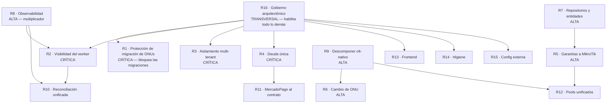

# Capítulo 13 — Recomendaciones Estratégicas para la Consolidación Arquitectónica de Datafast ERP

---

## 13.0 Tesis del capítulo

El diagnóstico completo de la Etapa II se resume en una frase:

> **Datafast ERP no carece de arquitectura. Carece de cobertura uniforme de una arquitectura que
> ya inventó, ya probó en producción y ya demostró correcta.**

Cada patrón valioso del sistema —VIO, outbox transaccional, máquina de estados declarativa, saga
con bitácora write-ahead, `ResultadoOperacion`, puertos y adaptadores, patrón degradable— nació
**reactivamente**, resolviendo un incidente concreto, y se aplicó **solo donde dolió**. Ninguno se
declaró obligatorio. Por eso un módulo nuevo no los hereda: los hereda quien se acuerda.

En consecuencia, **la mayoría de las recomendaciones de este capítulo no introducen nada nuevo**.
Extienden al resto del sistema lo que el propio equipo ya construyó bien en uno o dos sitios. Eso
las hace baratas, de bajo riesgo y culturalmente aceptables: no piden al equipo aprender una
arquitectura ajena, piden aplicar la propia con consistencia.

### Orden de prioridad

| Prioridad | Criterio | Recomendaciones |
|---|---|---|
| **CRÍTICA** | Puede causar daño irreversible a clientes o datos | R1 · R2 · R3 · R4 |
| **ALTA** | Compromete la evolución del sistema a 12 meses | R5 · R6 · R7 · R8 · R9 |
| **MEDIA** | Mejora sostenida de mantenibilidad | R10 · R11 · R12 · R13 |
| **BAJA** | Higiene y consistencia | R14 · R15 |
| **TRANSVERSAL** | Gobierno arquitectónico permanente | R16 |

---

# PRIORIDAD CRÍTICA

## R1 — Convertir la protección contra reescritura masiva de ONUs en una regla explícita

**1. Problema identificado**
`ZtpReconcileCron.reconciliarDiario` (03:30 `America/Lima`) reescribe SSID, clave WiFi y
credenciales de acceso web de toda ONU con `contrato_onu_config.provisioning_enabled = true` y
`last_applied_revision IS NULL`. Hoy no explota **solo porque `adoptarOnusHuerfanas` no crea
`contrato_onu_config`** — un efecto lateral de cómo está escrita esa función, no una regla.
(Riesgo R-01; `CLAUDE.md` §Migraciones de ONUs.)

**2. Análisis técnico**
La garantía actual es **estructural pero implícita**, que es la peor combinación: funciona, y
nadie sabe que depende de ella. Cualquier desarrollador que "complete" el registro creando la
config para ONUs adoptadas —una acción que parece correcta y ordenada— detona la mina sin señal
previa. El daño es masivo (todo el parque migrado), simultáneo (un solo cron), nocturno (nadie lo
ve ocurrir) e irreversible en la práctica: nadie tiene la clave WiFi que el cliente puso hace
tres años. Hay **dos migraciones planificadas** (SmartOLT 205 ONUs, MikroWISP), es decir, la
probabilidad no es teórica: es una fecha.

**3. Recomendación arquitectónica**
Elevar la garantía de efecto lateral a **invariante codificado y verificado**:
- Un origen explícito por cada fila de `contrato_onu_config` (`origen: 'erp' | 'adoptada' | 'migrada'`), y que el reconcile **solo actúe sobre `erp`**.
- Un test que ejercite el invariante y **nombre el incidente potencial**, según la regla F-12 del propio proyecto.
- Un *pre-flight* obligatorio en cualquier migración que ejecute la consulta de conteo de drift y **falle en seco** si el resultado supera un umbral.

**4. Justificación técnica**
Es la aplicación directa de una regla que el ERP **ya tiene escrita** y ya aplicó a otro caso:
*"una afirmación sobre el propio sistema es una afirmación sin verificar hasta que un test la
demuestra"* (VIO hacia adentro, F-13). El precedente es exacto: el comentario del outbox
garantizaba una propiedad de concurrencia que era falsa y nadie lo verificó — lo verificó
producción. Aquí la propiedad es "el reconcile no toca ONUs preexistentes", y hoy tampoco la
verifica nadie.

**5. Beneficios esperados**
- *Corto plazo:* desbloquea las migraciones pendientes con seguridad demostrable en vez de confiada.
- *Mediano:* el reconcile pasa de ser un proceso temido a uno auditable.
- *Largo:* el ERP puede absorber parques ajenos —que es el modelo de crecimiento del negocio— sin que cada migración sea un acto de fe.

**6. Prioridad:** **CRÍTICA**

**7. Impacto sobre el sistema**

| Capa | Impacto |
|---|---|
| Backend | Bajo — `ztp.service.ts`, `contrato-onu-config.service.ts`, `adoptarOnusHuerfanas` |
| Base de datos | Bajo — una columna + migración |
| Frontend | Nulo |
| Infraestructura | Nulo |
| Operación | **Alto y positivo** — desbloquea migraciones |

**8. Lineamientos para el equipo**
- Una ONU que el ERP **no aprovisionó** se **observa y se respeta**; jamás se reconfigura.
- Ningún proceso automático modifica configuración de un CPE en producción sin que un campo explícito lo autorice.
- Toda migración ejecuta el pre-flight de drift **antes** y adjunta su resultado al registro de la migración.

---

## R2 — Hacer visible y redundante el plano de intención (`worker-auxiliary`)

**1. Problema identificado**
Los 29 crons, las 6 colas, el outbox de red y los 9 watchers de invariante corren en **un solo
proceso PM2**. Si muere, el ERP sigue respondiendo con total normalidad mientras nadie se corta,
nadie se reactiva, ningún comando de red se aplica y ningún watcher repara nada — **sin ninguna
señal en la interfaz**. (Riesgo R-02.)

**2. Análisis técnico**
Es el fallo más peligroso posible en un sistema de este tipo: **silencioso y con apariencia de
normalidad**. El operador ve el ERP funcionando y concluye que todo está bien; el cliente que
pagó sigue cortado; el moroso sigue navegando; la ONU huérfana sigue huérfana. Y cuanto más
tiempo pasa, mayor es el volumen de trabajo acumulado que se aplicará de golpe al reiniciar.

Existen ya las piezas para detectarlo —`WatcherHeartbeatService`, `GET /admin/sistema/watchers`,
`GET /outbox-red/status`— pero **son consultables, no vigilantes**: hay que ir a mirarlas. Nadie
mira lo que parece que funciona.

**3. Recomendación arquitectónica**
Tres medidas, en orden de coste creciente:
- **Alarma de latido**: si `api-core` no ve latido reciente de los watchers, lo muestra como alerta persistente en la interfaz. El proceso que **sí** responde es quien debe denunciar al que no.
- **Presupuesto y cap por cron**: cada tarea declara su límite de trabajo por ejecución y su tiempo máximo; el que lo excede lo registra en vez de correr indefinidamente (resuelve además R-10).
- **Segregación por criticidad**: separar el plano de dinero/red (outbox, cobranza, watchers de invariante) del plano accesorio (Google sync, campañas, XUI) en dos procesos, de modo que una tarea accesoria no pueda tumbar el drenado de la red.

**4. Justificación técnica**
La segmentación por rol **ya es el patrón del sistema** y ya se aplicó tres veces por causa real
(Chromium, migraciones, secretos del frontend). Esta recomendación no propone un mecanismo nuevo:
propone aplicar el mismo criterio una cuarta vez, con la misma justificación —"si se descontrola
muere solo, sin arrastrar lo crítico"— que ya está escrita en `ecosystem.config.js`.

**5. Beneficios esperados**
- *Corto plazo:* deja de ser posible que el ERP esté roto sin que nadie lo sepa.
- *Mediano:* los crons dejan de competir entre sí en la ventana de madrugada.
- *Largo:* base para escalar el plano automático horizontalmente sin tocar el plano de negocio.

**6. Prioridad:** **CRÍTICA**

**7. Impacto sobre el sistema**

| Capa | Impacto |
|---|---|
| Backend | Medio — cada `@Cron` declara presupuesto |
| Frontend | Bajo — un indicador de salud persistente |
| Base de datos | Nulo |
| Infraestructura | Medio — un proceso PM2 más (atención a R-19: memoria) |
| Operación | **Alto y positivo** |

**8. Lineamientos para el equipo**
- Todo proceso de fondo **late**. Un watcher sin latido no existe para el sistema.
- Todo cron declara **cap de trabajo y tiempo máximo**. Ninguno itera sin límite.
- Un fallo silencioso es peor que uno ruidoso: ante la duda, **hacer ruido**.

---

## R3 — Garantizar el aislamiento multi-tenant por mecanismo, no por convención

**1. Problema identificado**
El filtrado por `empresa_id` depende de que **cada una de las 445 consultas crudas** lo incluya.
Los índices UNIQUE por empresa impiden que los datos **colisionen**, pero nada impide que se
**lean entre sí**. No hay Row-Level Security ni guard central. (Riesgo R-03.)

**2. Análisis técnico**
Es un fallo de la peor categoría: **una omisión no produce error, produce datos de otra empresa**.
No hay excepción, no hay log, no hay síntoma. El sistema responde con normalidad y con
información ajena. La probabilidad crece linealmente con el número de consultas, de tenants y de
desarrolladores — y las tres magnitudes crecen.

Además, el ERP ya demostró conocer este modo de fallo en otro dominio: la directriz del `iroute`
dice literalmente que *"dos routers reclamando la misma red no falla ruidosamente, da la respuesta
equivocada con naturalidad"*. Es exactamente el mismo patrón de error, aplicado a datos en lugar
de a rutas.

**3. Recomendación arquitectónica**
Defensa en dos capas, ninguna de las cuales requiere reescribir consultas:
- **Row-Level Security en PostgreSQL** sobre las tablas con `empresa_id`, con la empresa activa fijada por sesión de conexión. Convierte la omisión de "fuga silenciosa" en "cero filas".
- **Un test de barrido** que detecte consultas crudas sobre tablas con `empresa_id` que no filtren por él, integrado en el CI existente, junto al `sql:check` que ya corre allí.

**4. Justificación técnica**
RLS mueve la garantía del lugar donde se puede olvidar (445 consultas) al lugar donde solo se
declara una vez (la tabla). Es el mismo razonamiento que llevó al equipo a poner tres invariantes
en triggers: *el invariante no debe depender de la disciplina del llamador*. La consistencia con
esa decisión previa es total.

**5. Beneficios esperados**
- *Corto plazo:* elimina la clase entera de fallo, incluidas las consultas que hoy ya la tengan sin que nadie lo sepa.
- *Mediano:* permite crecer en número de tenants sin auditoría manual.
- *Largo:* condición necesaria para operar como plataforma multi-empresa con garantías contractuales de aislamiento.

**6. Prioridad:** **CRÍTICA**

**7. Impacto sobre el sistema**

| Capa | Impacto |
|---|---|
| Base de datos | **Alto** — políticas RLS + migración |
| Backend | Medio — fijar la empresa activa por sesión de conexión |
| Frontend | Nulo |
| Infraestructura | Bajo |
| Operación | Requiere validación cuidadosa: RLS mal configurado devuelve cero filas |

**8. Lineamientos para el equipo**
- Toda tabla nueva con datos de negocio nace con `empresa_id` **y** con su política de aislamiento.
- Ninguna consulta asume el filtrado; el filtrado es del motor.
- El aislamiento se **prueba**, no se supone.

---

## R4 — Una sola definición del cálculo de deuda

**1. Problema identificado**
La deuda de un contrato se calcula en **cuatro lugares**: `fn_calcular_deuda_contrato`
(PostgreSQL), `deuda-por-contrato.service.ts`, `pagos.service.ts` (`/cliente-deuda`) y
`cobranza.worker.ts` (`detectar-morosos`). Divergen potencialmente en el tratamiento de cargos
pendientes, notas de crédito, adelantos y promesas de pago vigentes. Ningún test verifica que
coincidan. (Riesgo R-04.)

**2. Análisis técnico**
Es el mismo defecto que **ya causó un incidente real en este sistema**: había cuatro copias del
`UPDATE` que aplicaba dinero, y la de `adelantos` había perdido el guard de estado y aplicaba
saldo a favor contra facturas **anuladas**. La corrección fue un único aplicador protegido por
`frontera-dinero.spec.ts`.

La deuda es más peligrosa que la aplicación, porque **decide cortes de servicio**. Cuatro
definiciones significan que el ERP puede cortar a quien no debe y no cortar a quien sí, y
responder distinto según por dónde se le pregunte —la ficha del cliente, el reporte de cobranza y
el worker que corta pueden discrepar el mismo día sobre el mismo abonado.

**3. Recomendación arquitectónica**
Una sola definición de "cuánto debe un contrato", en el punto común, con los cuatro consumidores
pasando por ella. La elección entre función de BD y servicio de dominio debe decidirse una vez y
documentarse, con un criterio claro: **si algún escritor no pasa por la aplicación, la definición
va en la base; si todos pasan, va en el dominio y se testea**.

**4. Justificación técnica**
Es la regla del propio proyecto —*"corregir en el punto común, no en cada sitio donde se
manifiesta"*, de la que salió el CTE `PUNTOS_SERVICIO`— aplicada al dominio donde el coste del
error es dinero y servicio. El equipo ya ejecutó esta consolidación dos veces con éxito
(ubicación del abonado, aplicación de dinero); esta es la tercera y la más valiosa.

**5. Beneficios esperados**
- *Corto plazo:* el ERP responde una sola cosa cuando se le pregunta cuánto debe alguien.
- *Mediano:* cambiar la política de deuda (incluir/excluir promesas, adelantos, notas de crédito) pasa a ser un cambio de una línea con un test que lo respalda.
- *Largo:* condición previa para cualquier integración de cobranza automática — un adaptador de pasarela no puede apoyarse en cuatro verdades.

**6. Prioridad:** **CRÍTICA**

**7. Impacto sobre el sistema**

| Capa | Impacto |
|---|---|
| Backend | **Alto** — toca facturación, pagos y cobranza |
| Base de datos | Medio — decidir el destino de `fn_calcular_deuda_contrato` |
| Frontend | Bajo |
| Operación | **Alto y positivo** |

**8. Lineamientos para el equipo**
- Antes de escribir una consulta, **buscar si ya existe**. Un `grep` por el concepto de negocio cuesta un minuto.
- Si existe y sirve, usarlo; si no encaja, **extenderlo**, nunca clonarlo.
- Si la duplicación es inevitable, **escribir en el código por qué**, y qué hay que cambiar en los dos sitios si cambia la regla.

---

# PRIORIDAD ALTA

## R5 — Extender las garantías del plano FTTH al plano MikroTik/WISP

**1. Problema identificado**
Outbox + máquina de estados + saga + VIO están implementados en FTTH. El plano MikroTik tiene
outbox **parcial** (solo lo disparado por el negocio), **sin** máquina de estados, **sin** saga y
con verificación solo como detección posterior (`/velocidad/discrepancias`). Las operaciones
interactivas del operador en `/red/routers` son **síncronas y sin ninguna garantía**.
(Riesgos R-08, R-17; Cap. 7.9.)

**2. Análisis técnico**
Los incidentes que FTTH **ya no puede tener** —huérfanos, dobles ejecuciones, timeouts leídos como
fallo, transiciones ilegales— MikroTik **sí puede tenerlos**, y el parque WISP no es marginal.
Además hay **tres caminos independientes** hacia el mismo hardware (`node-routeros`, `ssh2`,
`mikrotik_pool.py`), cada uno con su política de conexión, reintentos y credenciales.

El caso del cambio de plan lo ilustra: son **dos operaciones independientes** (BD y router) que
pueden divergir, y la divergencia se descubre después con un endpoint de discrepancias. En FTTH
esa misma operación pasa por lock, write-ahead, VIO y clasificación de resultado.

**3. Recomendación arquitectónica**
- Un **puerto único hacia MikroTik** (`IRouterProvider`), copiando literalmente las tres reglas de `IOltProvider`: no propagar excepciones, medir latencia, **no tocar la BD desde el adaptador**.
- Una **máquina de estados declarativa** para el servicio WISP, hermana de la de FTTH.
- Que **toda** mutación de MikroTik —incluidas las del operador— pase por el outbox, con la operación interactiva devolviendo "encolado" en vez de bloquear 30 s.

**4. Justificación técnica**
No hay que diseñar nada: el patrón existe, está probado en el dominio más hostil (SSH a un
MA5800 con sesiones VTY limitadas) y tiene sus reglas escritas en el propio contrato. Replicarlo
a un dominio **más benigno** (API RouterOS sobre VPN) es de riesgo bajo. Y ya hay precedente de
replicación voluntaria: la máquina de estados de `planta-externa`.

**5. Beneficios esperados**
- *Corto plazo:* desaparece la clase de fallo de "la BD dice una velocidad y el router otra".
- *Mediano:* un solo punto de política de conexión y reintento hacia MikroTik.
- *Largo:* el plano de red completo con garantías homogéneas, prerrequisito para automatizar más operaciones sin multiplicar el riesgo.

**6. Prioridad:** **ALTA**

**7. Impacto sobre el sistema**

| Capa | Impacto |
|---|---|
| Backend | **Alto** — `mikrotik` (10 consumidores) |
| Frontend | Medio — operaciones que devuelven "encolado" en vez de resultado inmediato |
| Base de datos | Bajo — una máquina de estados y su columna |
| Operación | Medio — cambia la percepción de inmediatez del operador |

**8. Lineamientos para el equipo**
- Toda mutación contra hardware externo pasa por el outbox. **Sin excepciones por comodidad de UI.**
- Todo adaptador de protocolo cumple las tres reglas de `IOltProvider`.
- Ninguna operación de hardware se ejecuta dentro del ciclo de vida de un request HTTP.

---

## R6 — Modelar el cambio de ONU como operación de primera clase

**1. Problema identificado**
No existe endpoint, servicio, transición ni saga para sustituir la ONU de un contrato. Hoy se
improvisa como **baja + alta**. (Riesgo R-09; Cap. 7.8.)

**2. Análisis técnico**
El reemplazo de ONU es una operación **rutinaria** en un ISP: avería, upgrade de modelo, cambio
de tecnología. Componerla con dos operaciones destructivas produce cinco daños concretos:
corte de servicio innecesario; **pérdida de la configuración del abonado** (su SSID y su clave
viven en `contrato_onu_config` y la reprovisión los reescribe con el preset); una ventana en la
que el contrato existe sin registro FTTH —exactamente el estado que causó el incidente del
21/07—; ausencia total de trazabilidad de qué equipo sustituyó a cuál; y la imposibilidad de
solape por `uq_contratos_empresa_onu`.

La ausencia es especialmente llamativa porque el sistema **tiene todas las piezas**: máquina de
estados, saga con compensación, pools con reserva, VIO. Falta la transición, no la capacidad.

**3. Recomendación arquitectónica**
Declarar `sustituir_onu` como transición de primera clase en `ftth-maquina-estados.ts`, con su
saga propia: reservar recursos de la ONU nueva **antes** de liberar los de la vieja, migrar
`contrato_onu_config` conservando SSID y clave del abonado, y registrar la sustitución en el
histórico del contrato.

**4. Justificación técnica**
La máquina de estados declarativa existe precisamente para que **falte un caso sea visible**. Ya
cumplió esa función una vez: reveló que `desaprovisionar` no aceptaba `suspendido`, el caso más
frecuente del negocio. Esta recomendación es la misma lección aplicada a una transición que
directamente no está declarada.

**5. Beneficios esperados**
- *Corto plazo:* el técnico cambia una ONU averiada sin perder la configuración del cliente ni provocar un corte largo.
- *Mediano:* trazabilidad del equipamiento por abonado.
- *Largo:* base para renovación planificada de parque (upgrade masivo de modelo).

**6. Prioridad:** **ALTA**

**7. Impacto sobre el sistema**

| Capa | Impacto |
|---|---|
| Backend | Medio — `olt-nativo` (transición + saga) |
| Frontend | Medio — flujo nuevo en el modal de ONU |
| Base de datos | Bajo — histórico de sustitución |
| Operación | **Alto y positivo** |

**8. Lineamientos para el equipo**
- Toda operación **rutinaria** del negocio se modela explícitamente. Componerla con operaciones destructivas no es modelarla.
- En una sustitución, se **reserva antes de liberar**. Nunca al revés.
- La configuración que puso el abonado es **suya**: se migra, no se regenera.

---

## R7 — Completar la capa de repositorio y tipar las tablas críticas

**1. Problema identificado**
La capa de repositorio existe en **6 de 44 módulos** (14 %). Hay **39 tablas sin entidad
TypeORM**, entre ellas `comandos_red_pendientes`, `ftth_operacion_lock`, `operacion_wizard`,
`operacion_wizard_paso`, `pago_extorno`, `cierre_caja` y `cuentas_bancarias`. Un `ALTER` sobre
ellas **no rompe la compilación**. (Riesgos R-05, y ver Corrección 0.1.)

**2. Análisis técnico**
La ironía estructural del sistema: **las tablas que sostienen las garantías más fuertes son las
que menos protección de tipos tienen**. El outbox garantiza que ningún comando de red se pierda,
y su esquema no está tipado. La saga garantiza que ningún wizard deje basura, y su bitácora
tampoco. Un renombrado de columna en cualquiera de ellas compila perfectamente y rompe en
producción, en el plano automático, de madrugada — combinándose con R-02 para producir un fallo
silencioso.

**3. Recomendación arquitectónica**
Dos frentes, empezando por el más barato:
- **Tipar primero las tablas de coordinación y de dinero** — no las 39, sino las que sostienen invariantes. Es un subconjunto pequeño y de altísimo retorno.
- **Extender el patrón de repositorio** siguiendo la forma ya decidida en `ContratoRepository`, empezando por los módulos que ya lo tienen a medias (conviven repositorio y acceso directo en el mismo módulo).

**4. Justificación técnica**
No es adopción de un patrón nuevo: es **completar** uno que ya está en producción, en los módulos
correctos y con una forma probada. El coste de aprendizaje es cero y el criterio de diseño ya
está tomado.

**5. Beneficios esperados**
- *Corto plazo:* el compilador empieza a detectar cambios de esquema en las piezas críticas.
- *Mediano:* las consultas se pueden refactorizar con herramientas en lugar de a mano.
- *Largo:* condición previa para cualquier evolución del modelo de datos con seguridad.

**6. Prioridad:** **ALTA**

**7. Impacto sobre el sistema**

| Capa | Impacto |
|---|---|
| Backend | **Alto en extensión, bajo en riesgo** — es incremental por tabla |
| Base de datos | Nulo (no cambia el esquema) |
| Frontend | Nulo |
| Operación | Nulo durante el cambio, positivo después |

**8. Lineamientos para el equipo**
- **Toda tabla nueva nace con entidad TypeORM.** Sin excepciones.
- Columnas `string | null` llevan `type:` explícito — sin él, SWC crashea el backend en frío.
- Un módulo con repositorio **no consulta por fuera del repositorio**.

---

## R8 — Instrumentar el sistema (observabilidad mínima viable)

**1. Problema identificado**
No hay APM, ni trazas, ni métricas. `logging: false` en TypeORM. La propia Etapa I tuvo que
declarar **cinco preguntas que no puede responder**: frecuencia real de endpoints, latencias
p50/p95/p99, volúmenes por tabla, índices realmente usados (de 376 creados) y comportamiento bajo
carga. (Riesgo R-06.)

**2. Análisis técnico**
Sin instrumentación, toda decisión de rendimiento es una hipótesis y toda corrección es un acto
de fe. Los incidentes documentados lo demuestran: los 287 s de REACTIVAR se descubrieron por
observación manual, y el segundo defecto **solo se hizo visible al corregir el primero** — con
métricas habrían sido dos líneas en un gráfico.

Es además el **multiplicador de todos los demás riesgos**: sin medición no se sabe si el
reconciliador satura el MA5800, si los 376 índices sirven, si la cola del worker crece, ni si una
recomendación de este documento funcionó.

**3. Recomendación arquitectónica**
Mínimo viable, en orden de retorno decreciente:
- **Métricas del plano de intención**: profundidad de las 6 colas, edad del comando más antiguo del outbox, latido de cada watcher, duración de cada cron. Es el dato que evita el fallo silencioso de R-02.
- **`pg_stat_statements`** activado, para saber qué consulta duele de verdad en vez de deducirlo.
- **Latencia y contador por endpoint**, para que la próxima auditoría pueda responder lo que esta no pudo.

**4. Justificación técnica**
Alineado con la regla más profunda del proyecto —*"si el diagnóstico no se apoya en una medición,
es una hipótesis, y debe decirse así"*—. Hoy esa regla se cumple heroicamente, a base de
`tcpdump`, sniffers y scripts `_monitor*.mjs` puntuales. Instrumentar es convertir ese heroísmo
en infraestructura.

**5. Beneficios esperados**
- *Corto plazo:* se ve la cola del worker y la edad del outbox; el fallo silencioso deja de serlo.
- *Mediano:* las decisiones de índices y consultas se toman con datos.
- *Largo:* capacidad de planificación de capacidad al crecer el parque.

**6. Prioridad:** **ALTA**

**7. Impacto sobre el sistema**

| Capa | Impacto |
|---|---|
| Backend | Medio — instrumentación transversal |
| Infraestructura | **Alto** — un recolector más en un VPS con RAM justa (ver R-19) |
| Base de datos | Bajo |
| Operación | **Alto y positivo** |

**8. Lineamientos para el equipo**
- Todo proceso de fondo **expone su progreso**, no solo su resultado.
- Una afirmación de rendimiento sin medición se enuncia como hipótesis.
- Si una corrección no se puede verificar con un número, no está verificada.

---

## R9 — Descomponer `olt-nativo` por las fronteras que ya tiene

**1. Problema identificado**
25.659 LOC, 41 servicios, 24 entidades, 11 crons y un controlador de **1.845 líneas con ~150
endpoints**, cubriendo 8 subdominios. (Riesgo R-07.)

**2. Análisis técnico**
Parte del tamaño es **irreductible**: el dominio FTTH es genuinamente el más complejo del negocio
y no se simplifica dividiéndolo por gusto. Pero el módulo **ya se está dividiendo solo**: el
árbol contiene `capability/`, `compliance/`, `domain/`, `ztp/`, `providers/`, `interfaces/`,
`types/` y `cron/` — fronteras reales que el equipo trazó por necesidad. Lo que falta es
formalizarlas.

El controlador es el caso más claro y más barato: 150 endpoints en un archivo garantizan
conflictos de merge y hacen imposible leer la superficie del módulo.

**3. Recomendación arquitectónica**
Formalizar las fronteras existentes en submódulos NestJS —**sin cambiar rutas ni contratos**—
empezando por lo de menor riesgo:
1. Dividir el controlador por grupo funcional (mismas rutas, varios archivos).
2. Promover `ztp/`, `capability/` y `compliance/` a submódulos con su propio `@Module`.
3. Separar el subdominio de **pools de recursos**, que es genérico y reutilizable (ver R-12).

**4. Justificación técnica**
Es refactor estructural sin cambio de comportamiento: bajo riesgo, verificable con los tests
existentes, y respeta el principio de no reconstruir. Las fronteras no las inventa este
documento: las descubrió el equipo escribiendo el código.

**5. Beneficios esperados**
- *Corto plazo:* menos conflictos de merge; la superficie del módulo se puede leer.
- *Mediano:* los subdominios se pueden testear y evolucionar por separado.
- *Largo:* el módulo más crítico deja de ser el más intimidante para un desarrollador nuevo.

**6. Prioridad:** **ALTA**

**7. Impacto sobre el sistema**

| Capa | Impacto |
|---|---|
| Backend | **Alto en volumen, bajo en riesgo** — sin cambio de comportamiento |
| Frontend | **Nulo** — las rutas no cambian |
| Base de datos | Nulo |
| Operación | Nulo |

**8. Lineamientos para el equipo**
- Un controlador no supera un **umbral acordado de endpoints**; al superarlo, se divide por grupo funcional.
- Un subdirectorio con `domain/`, `providers/` o `interfaces/` propios **es un submódulo**; formalizarlo, no dejarlo implícito.

---

# PRIORIDAD MEDIA

## R10 — Unificar el patrón de reconciliación

**1. Problema identificado**
Cinco procesos (`reconciliador` 15/30 min, `ztp-reconcile` 03:30 y cada 2 min,
`ftth-wan-watcher` 10 min, `address-list-reconciliador` 04:40, `olt-sync` 6 h) verifican estados
solapados del mismo parque sin coordinación. `reconciliar()` itera **sin cap ni lock**.
(Riesgos R-10, R-16; Cap. 9.3.)

**2. Análisis técnico**
Cinco implementaciones de la misma idea —leer estado real, comparar, actuar, registrar— con
cinco criterios de cap, lock, reintento y registro. Todas compiten por el mismo recurso escaso:
las **sesiones VTY del MA5800**, que ya provocaron 1.788 reintentos en 4 días cuando un solo
proceso se descontroló.

**3. Recomendación arquitectónica**
Un **primitivo común de reconciliación** que aporte lo que hoy cada uno resuelve a su manera: cap
de trabajo, lock, presupuesto de tiempo, registro uniforme y respeto de una cuota global de
sesiones contra cada equipo.

**4. Justificación técnica**
El sistema ya extrajo un primitivo genérico de un caso concreto y lo hizo bien:
`capability.engine.ts` generaliza el patrón de `ztp/capability.engine.ts` con una nota explícita
de que el original **no se toca** porque es un contrato congelado. Ese es exactamente el modelo a
seguir aquí.

**5. Beneficios esperados**
- *Corto:* ningún reconciliador puede saturar un equipo.
- *Mediano:* un reconciliador nuevo hereda cap, lock y registro sin escribirlos.
- *Largo:* la ventana de madrugada se planifica en lugar de acumularse.

**6. Prioridad:** **MEDIA**

**7. Impacto:** Backend medio · BD bajo · Frontend nulo · Operación positivo.

**8. Lineamientos**
- Ningún proceso de fondo itera sin cap.
- Todo acceso a un equipo con recurso escaso respeta una **cuota global**, no una por proceso.

---

## R11 — Migrar Mercado Pago al contrato de cobro que ya existe

**1. Problema identificado**
`pagos/adaptadores/adaptador-cobro.interface.ts` define el contrato de cobro, y
`mercadopago.service.ts` —**el único proveedor que cobra dinero real**— no lo implementa.

**2. Análisis técnico**
Una abstracción que ningún caso real ejercita **no está validada**. Si la primera integración
nueva descubre que el contrato no absorbe a Mercado Pago, la corrección llegará con tres
proveedores encima. El propio README lo dice: *"si la abstracción no lo absorbe, la abstracción
está mal y se corrige con un proveedor, no con tres"*.

**3. Recomendación arquitectónica**
Migrar Mercado Pago al contrato **antes** que ningún proveedor nuevo, respetando la puerta de
estabilidad de 30 días que ya está documentada.

**4. Justificación técnica**
Es literalmente el paso 3 del plan que el equipo ya escribió. Esta recomendación no propone nada:
**confirma que el plan existente es correcto** y recomienda no saltárselo.

**5. Beneficios esperados**
- *Corto:* el contrato queda validado contra la realidad.
- *Mediano:* añadir Niubiz/Culqi/Izipay pasa a ser un adaptador, no un servicio.
- *Largo:* la cobranza automática crece sin multiplicar caminos hacia el dinero.

**6. Prioridad:** **MEDIA** (sube a **ALTA** en el momento en que se decida integrar cualquier pasarela)

**7. Impacto:** Backend medio · BD bajo · Operación **crítico durante la migración** (toca dinero real).

**8. Lineamientos**
- **No se integra una segunda pasarela antes de que la primera pase por el contrato.**
- Un timeout cobrando es `indeterminado`: ni se reintenta a ciegas (cobra dos veces) ni se reporta fallo (deja dinero sin registro).

---

## R12 — Extraer el primitivo de pool de recursos

**1. Problema identificado**
Existen al menos **seis pools** con la misma mecánica y seis implementaciones:
`service-port`, `mgmt-ip`, `onu-id`, `mgmt-port`, puertos NAP e IPs de segmento. (Cap. 9.5.)

**2. Análisis técnico**
Todos hacen lo mismo: reservar, confirmar, liberar, reconciliar contra la realidad y barrer
reservas huérfanas por TTL. Cada uno lo resuelve a su manera, y la reserva huérfana es una clase
de fallo ya vivida (cert VPN reservando una IP tras un `UPDATE` directo, 28/07).

**3. Recomendación arquitectónica**
Un primitivo `PoolDeRecursos<T>` con reserva con TTL, confirmación, liberación, reconciliación
contra la fuente real y barrido — dejando que cada pool aporte solo su fuente de verdad.

**4. Justificación técnica**
Mismo modelo que R10 y que `capability.engine`: extraer el primitivo sin tocar las
implementaciones congeladas, y migrar deliberadamente, nunca por arrastre.

**5. Beneficios esperados**
- *Corto:* comportamiento uniforme ante reservas huérfanas.
- *Mediano:* un pool nuevo (VLAN, puerto de switch, IP pública) se declara en lugar de programarse.
- *Largo:* menos superficie donde puede aparecer una fuga de recursos.

**6. Prioridad:** **MEDIA**

**7. Impacto:** Backend medio · BD bajo · Frontend nulo.

**8. Lineamientos**
- Toda reserva de recurso tiene **TTL y barrido**. Una reserva sin caducidad es una fuga con retraso.
- Todo pool se **reconcilia contra la realidad**, no contra su propio registro.

---

## R13 — Consolidar el frontend

**1. Problema identificado**
Tres convenciones de organización simultáneas (`molecules/` vacío, `organisms/` con 1 archivo);
**1,8 % de código reutilizable** sobre 57.435 LOC; componentes de hasta 3.776 LOC; tipos
duplicados respecto al backend pese a existir Swagger; sin librería de formularios; **2 tests**.
(Riesgo R-18.)

**2. Análisis técnico**
El frontend es el único plano del sistema **sin patrones arquitectónicos declarados**. Mientras
el backend tiene máquinas de estados, puertos y vocabulario de dominio, el frontend tiene
`ClienteDetalle.tsx` con 3.776 líneas. La duplicación de tipos y validaciones crea una clase de
divergencia estructural: **el frontend puede aceptar lo que el backend rechaza, y al revés**.

**3. Recomendación arquitectónica**
- **Una** convención de organización (la de dominio, que es la viva) y eliminar los directorios muertos.
- **Tipos generados desde el Swagger** que el backend ya expone, en lugar de escritos a mano dos veces.
- Umbral acordado de tamaño de componente y descomposición de los que lo superan, empezando por las fichas maestras y wizards.
- Capa de estado de servidor con cache, y librería única de formularios con esquema compartido.

**4. Justificación técnica**
El backend demostró que declarar el patrón funciona. El frontend tiene el mismo problema
(crecimiento por acumulación) y aún no aplicó la misma medicina.

**5. Beneficios esperados**
- *Corto:* un desarrollador nuevo sabe dónde poner un componente.
- *Mediano:* menos peticiones repetidas y menos divergencia de validación.
- *Largo:* la interfaz crece sin que cada pantalla nueva sea un archivo de mil líneas.

**6. Prioridad:** **MEDIA**

**7. Impacto:** Frontend **alto** · Backend bajo (exponer Swagger en build) · Operación nulo.

**8. Lineamientos**
- **Una** convención de organización.
- Los tipos de la API **se generan**, no se escriben.
- Un componente que supera el umbral se descompone antes de añadirle nada.

---

# PRIORIDAD BAJA

## R14 — Higiene de dependencias y artefactos muertos

**Problema:** `telegraf`, `twilio` y `net-snmp` instalados sin uso; cola `mikrotik-jobs`
declarada y no usada; `migracion/` y `molecules/` vacíos; `mock-data/` en el árbol de producción;
25 scripts `.mjs` en la raíz, varios ad-hoc con prefijo `_`; ruta `/installl` con typo.

**Análisis:** cada dependencia sin uso amplía superficie de seguridad y peso de build; cada
artefacto muerto hace dudar al siguiente lector sobre si está vivo.

**Recomendación:** retirar lo no usado; mover los scripts operativos a `scripts/`; documentar los
que se conservan.

**Justificación:** coherente con la regla del propio proyecto: *"una garantía que nadie sostiene
es peor que ninguna, porque el siguiente lector construye encima"* — aplicable igualmente al
código muerto.

**Beneficios:** build más ligero, menos superficie, menos ambigüedad.
**Prioridad:** **BAJA**. **Impacto:** transversal bajo.
**Lineamiento:** una dependencia sin consumidor **se retira**; si se conserva para el futuro, se
documenta por qué y hasta cuándo.

---

## R15 — Llevar la configuración externa al repositorio

**Problema:** credenciales de connreq de GenieACS duplicadas en la provision del ACS y en el
`.env`; CCD y certificados OpenVPN solo en el filesystem; crontab del VPS editable desde la UI y
fuera de control de versiones. (Riesgo R-20.)

**Análisis:** una instalación nueva **no es totalmente reproducible desde el repositorio**, lo que
contradice el excelente trabajo de portabilidad multi-VPS ya hecho (F-14). Y una divergencia
entre el ACS y el `.env` no la detecta nada: se manifiesta como TR-069 que no responde.

**Recomendación:** verificación de coincidencia al arrancar (probe del patrón degradable), e
inventario versionado de lo que vive fuera del repositorio, con su procedimiento de restauración.

**Beneficios:** instalación reproducible; una divergencia se detecta al arrancar y no en campo.
**Prioridad:** **BAJA** (sube a **ALTA** antes de instalar un VPS nuevo).
**Lineamiento:** todo lo que deba coincidir entre dos sistemas **se verifica automáticamente**;
si no se puede verificar, se documenta como riesgo aceptado.

---

# TRANSVERSAL

## R16 — Establecer el gobierno arquitectónico permanente

**1. Problema identificado**
Todos los patrones valiosos del sistema **nacieron reactivamente** y **ninguno es obligatorio**.
`CLAUDE.md` los documenta con calidad excepcional, pero es un documento que se lee, no un
mecanismo que se aplica. Por eso la cobertura es desigual: FTTH tiene todas las garantías y
MikroTik casi ninguna; 6 módulos tienen repositorio y 38 no; 4 módulos declaran permisos finos y
40 no.

**2. Análisis técnico**
Este es el **problema raíz del que se derivan casi todos los demás de este documento**. Las
recomendaciones R1–R15 corrigen síntomas de una misma causa: **no hay ningún punto del proceso de
desarrollo donde se compruebe que una decisión arquitectónica se respetó**. La calidad depende
hoy de que quien escribe el código conozca las reglas y se acuerde de aplicarlas — lo cual
funciona con un equipo pequeño y con memoria, y deja de funcionar exactamente cuando el sistema
crece, que es el objetivo declarado.

Sin esto, en dos años habrá un segundo documento de consolidación describiendo los mismos
problemas en módulos distintos.

**3. Recomendación arquitectónica**
Tres mecanismos, ninguno burocrático:

- **Decisiones arquitectónicas registradas (ADR).** Cada decisión estructural se registra con contexto, alternativas y consecuencias. El proyecto **ya escribe esto**, disperso en comentarios excelentes (`ecosystem.config.js`, `IOltProvider`, `pagos/adaptadores/README.md`); falta darle un lugar y un formato.
- **Checklist de módulo nuevo**, verificado en revisión: ¿degradable o Core Indestructible? ¿repositorio? ¿entidad para toda tabla? ¿`ResultadoOperacion` si lo invoca un orquestador? ¿máquina de estados si tiene ciclo de vida? ¿outbox si muta hardware? ¿cap y lock si es un cron? ¿`@RequirePermission`? ¿filtra por `empresa_id`?
- **Verificaciones automáticas en CI**: typecheck, la suite completa, instalación desde cero y `sql:check` **ya corren y bloquean el merge desde 2026-07-28**. Lo que falta añadir es la detección de consultas sin `empresa_id` y, en general, una comprobación por política.

**4. Justificación técnica**
El propio proyecto ya demostró que **el mecanismo vence a la disciplina**: el índice UNIQUE
parcial resolvió los routers duplicados que la revisión manual no evitaba; el test
`frontera-dinero.spec.ts` impide la cuarta copia del `UPDATE` que la convención no impidió; el
trigger mantiene el saldo aunque el escritor sea un script manual. La regla escrita en
`CLAUDE.md` —*"el invariante que solo vive en la doc no es invariante"*— aplica al propio
`CLAUDE.md`.

**5. Beneficios esperados**
- *Corto plazo:* un módulo nuevo nace con las garantías puestas en lugar de adquirirlas tras su primer incidente.
- *Mediano:* la cobertura desigual deja de crecer; la brecha entre FTTH y el resto se cierra por construcción.
- *Largo:* **el ERP puede crecer sin aumentar su complejidad**, que es literalmente el objetivo declarado de esta etapa.

**6. Prioridad:** **TRANSVERSAL — condiciona el éxito de todas las demás**

**7. Impacto sobre el sistema**

| Capa | Impacto |
|---|---|
| Backend / Frontend / BD | Nulo inmediato, **decisivo acumulado** |
| Infraestructura | Bajo — CI |
| Operación | **Alto y positivo** |

**8. Lineamientos para el equipo — el decálogo permanente**

1. **Reutilizar antes de construir.** Buscar si el dato ya se obtiene en otro sitio. Si existe y sirve, usarlo; si no encaja, extenderlo; si hay que duplicar, escribir en el código por qué.
2. **Causa raíz antes que parche.** Reproducir y observar, no deducir. Explicar cómo llegó el sistema a ese estado. Preguntar dónde más ocurre. Corregir en el punto común. Dejar constancia de la causa, no del arreglo.
3. **`accepted ≠ materialized`.** Toda mutación contra hardware se verifica con una lectura independiente. Sin confirmación no se reporta éxito: se reporta "aceptado, sin confirmar".
4. **Vocabulario de dominio, no de transporte.** Lo invocable por un orquestador devuelve `ResultadoOperacion`. Un timeout es `indeterminado`. Solo 400 y 404 son definitivos. Ante la duda, reintentable.
5. **Estados declarados en un solo sitio.** La idempotencia se deriva del destino, no se implementa en cada método.
6. **Lo no confirmado se anula.** La frontera es el estado terminal verificado, nunca el clic. La compensación se registra antes de ejecutar. Nunca se interrumpe el hardware a mitad.
7. **Módulo degradable o Core Indestructible.** Decidirlo el día que se crea el archivo, no después.
8. **Ninguna IP, dominio ni secreto en el repositorio.** Variables de entorno, lazy getters, `.env.example` como contrato.
9. **Un comentario que garantiza concurrencia lleva un test, o se borra.** Un log describe lo que ocurrió, nunca lo que el código pretendía hacer. Un test nombra el incidente que lo motivó.
10. **Toda tabla nace con entidad, con `empresa_id` y con su aislamiento. Todo cron nace con cap, lock y latido. Toda mutación de hardware nace en el outbox.**

---

## 13.17 Secuencia recomendada

Sin plazos —el equipo conoce su capacidad—, pero con **dependencias entre recomendaciones**, que
sí son objetivas:

**Tres observaciones sobre la secuencia:**

1. **R16 va primero** aunque no arregle nada por sí solo: sin él, cada recomendación aplicada se
   degrada con el tiempo igual que se degradaron las anteriores.
2. **R8 (observabilidad) es un multiplicador**, no una mejora aislada: sin medición no se puede
   verificar que R2, R5 o R10 funcionaron.
3. **R1 bloquea las migraciones**: mientras no esté, cada migración de parque es una apuesta con
   el servicio de clientes reales.

---

## 13.18 Cierre

Datafast ERP llega a esta etapa con algo que la mayoría de los sistemas de su categoría no
tienen: **una arquitectura de resiliencia diseñada a partir de incidentes reales, correctamente
diagnosticados y documentados con honestidad**. VIO, el outbox con reclamo atómico, la saga con
bitácora write-ahead, el vocabulario de dominio y la puerta de estabilidad de las pasarelas de
pago no son prácticas de manual: son conocimiento ganado en producción, y varias de ellas están
mejor resueltas aquí que en productos comerciales del sector.

El problema no es lo que falta por inventar. Es que **lo ya inventado no es obligatorio**, y por
eso convive un plano FTTH con garantías de nivel industrial junto a un plano WISP casi sin ellas,
seis módulos con repositorio junto a treinta y ocho sin él, y una cultura de tests quirúrgicos
junto a un frontend con dos tests para 57.435 LOC.

Consolidar esta arquitectura no significa reconstruirla. Significa **tomar las decisiones que ya
se demostraron correctas y convertirlas en la forma por defecto de construir**. Ese es el trabajo
de la Etapa III, y este documento es su punto de partida.
