# Capítulos 5–7 — APIs Internas, Base de Datos y Consultas SQL

---

# CAPÍTULO 5 — APIs Internas

## 5.1 Convenciones globales

- **Prefijo global:** `/api/v1` (configurado en `main.ts`).
- **Documentación:** Swagger expuesto por `@nestjs/swagger`.
- **Guards globales, en este orden:** `LicenciaGuard` → `JwtAuthGuard` → `RolesGuard` → `ThrottlerGuard`.
- **Interceptors globales:** `LoggingInterceptor` → `TimeoutInterceptor(30 s)` → `AuditInterceptor` → `TransformInterceptor`.
- **Filtro global:** `AllExceptionsFilter`.
- **Rate limiting:** 10 req/s, 100 req/min, 1000 req/h.
- **Autorización fina:** decorador `@RequirePermission('recurso:accion')`. **No está aplicado uniformemente** — `contratos`, `planes`, `zonas` y `promesas-pago` lo usan; la mayoría de módulos no lo declara y depende solo de `RolesGuard`.
- **Exclusión de auditoría:** `@SetMetadata('skipAudit', true)` en lecturas de alto volumen (usado sistemáticamente solo en `contratos`).
- **Frecuencia:** **no instrumentada**. Las columnas "Frecuencia" de este capítulo son inferencias a partir del consumidor en el frontend, no mediciones.

## 5.2 Resumen por controlador

| Controlador | Prefijo | Endpoints | Consumidor principal |
|---|---|---|---|
| `olt-nativo.controller.ts` | `/olt-nativo` | **~150** | `red/olt`, `red/drift`, modal ONU, wizard FTTH |
| `pagos.controller.ts` | `/pagos` | 32 | `pagos`, `caja`, `finanzas/registro` |
| `mikrotik.controller.ts` | `/mikrotik` | 28 | `red/routers` |
| `openvpn.controller.ts` + `vpn-cliente.controller.ts` | `/openvpn` | 30 | `red/vpn`, **servidor OpenVPN (máquina)** |
| `facturacion.controller.ts` | `/facturacion` | 14 | `facturacion` |
| `comprobantes-config.controller.ts` | `/facturacion-config` | 16 | `configuracion/facturacion-config` |
| `contratos.controller.ts` | `/contratos` | 25 | `contratos`, `red/redes-ipv4` |
| `portal.controller.ts` | `/portal` | 20 | **Portal del abonado (público)** |
| `portal-config.controller.ts` | `/config/portal` | 8 | `configuracion/portal-cliente` |
| `monitoreo.controller.ts` | `/monitoreo` | 18 | `monitoreo` |
| `clientes.controller.ts` | `/clientes` | 17 | `clientes`, `abonados`, `red/mapa` |
| `planta-externa.controller.ts` | `/planta-externa` | 18 | `red/planta-externa`, `red/cajas-nap`, `red/mapa` |
| `smartolt.controller.ts` | `/smartolt` | 18 | `configuracion/integraciones/smartolt` |
| `google-integration.controller.ts` | `/google` | 16 | `configuracion/integraciones/google` |
| `sistema.controller.ts` | `/admin/sistema` | 13 | `configuracion/sistema`, `crontab`, `servidor` |
| `usuarios.controller.ts` | `/usuarios`,`/roles`,`/permisos`,`/personal/logs` | 15 | `configuracion/personal` |
| `tickets.controller.ts` | `/tickets` | 11 | `tickets/*` |
| `auditoria.controller.ts` | `/auditoria` | 10 | `configuracion/log` |
| `auth.controller.ts` | `/auth` | 9 | `(auth)/*`, todo el frontend |
| `config.controller.ts` | `/config` | 9 | `configuracion/empresa`, `servidor` |
| `plantillas.controller.ts` | `/plantillas` | 9 | `configuracion/plantillas` |
| `finanzas-opex.controller.ts` | `/finanzas/opex` | 8 | `finanzas/gastos` |
| `xui.controller.ts` | `/xui` | 8 | `iptv` |
| `velocidad.controller.ts` | `/mikrotik/routers/:id/velocidad` | 6 | `red/routers` |
| `backup.controller.ts` | `/admin/backup` | 7 | `configuracion/backup` |
| `crm-nativo.controller.ts` | `/crm-nativo` | 8 | `mensajeria/whatsapp` (**proceso `datafast-whatsapp`**) |
| `proyectos-inversion.controller.ts` | `/proyectos-inversion` | 6 | `finanzas/proyectos` |
| `reportes.controller.ts` | `/reportes` | 6 | `reportes` |
| `workers.controller.ts` | `/admin/workers` | 6 | `configuracion/sistema` |
| `sites.controller.ts` | `/sites` | 5 | `red/sites` |
| `planes.controller.ts` | `/planes` | 5 | `servicios/internet` |
| `health.controller.ts` | `/` | 5 | Docker healthcheck, `check-health.mjs` |
| `licencia.controller.ts` | `/admin/licencia` | 5 | `configuracion/licencia` + **servidor de licencias (webhook)** |
| `mensajeria/campanas.controller.ts` | `/mensajeria` | 4 | `mensajeria/campanas` |
| `promesas-pago.controller.ts` | `/promesas-pago` | 4 | `finanzas/adelanto-prorroga` |
| `install.controller.ts` | `/install` | 4 | `installl` |
| `zonas.controller.ts` | `/zonas` | 4 | `configuracion/ubicaciones` |
| `aprovisionamiento.controller.ts` | `/aprovisionamiento` | 1 | interno |
| `dashboard.controller.ts` | `/dashboard` | 1 | `dashboard` |
| `outbox-red.controller.ts` | `/outbox-red` | 1 | `configuracion/sistema` |
| `tr069.controller.ts` | `/tr069` | 1 | `red/olt` |
| `webhooks/whatsapp-webhook.controller.ts` | `/webhooks/whatsapp` | 1 | **Evolution API / Meta (externo)** |

**Total: 46 controladores, ~560 endpoints HTTP.**

## 5.3 Inventario detallado — dominios críticos

### `/auth` — propietario: `auth`

| Método | Ruta | Devuelve | Frecuencia (inferida) |
|---|---|---|---|
| POST | `/auth/login` | `{accessToken, refreshToken, usuario}` | Alta |
| POST | `/auth/refresh` | Nuevo par de tokens | Muy alta (cada expiración) |
| POST | `/auth/logout` | Confirmación; invalida en cache | Media |
| GET | `/auth/me` | Usuario actual + empresa | Muy alta (bootstrap del frontend) |
| PATCH | `/auth/change-password` | Confirmación | Baja |
| GET | `/auth/permissions` | Permisos efectivos del usuario | Alta |
| GET | `/auth/audit` | Log de accesos | Baja |
| POST | `/auth/forgot-password` | Envía correo | Baja |
| POST | `/auth/reset-password` | Confirmación | Baja |

### `/clientes` — propietario: `clientes`

| Método | Ruta | Nota |
|---|---|---|
| POST | `/clientes/onboarding` | Alta guiada cliente+contrato |
| POST · GET | `/clientes` | CRUD base, paginado |
| POST | `/clientes/bulk-action` | Acciones masivas |
| GET | `/clientes/resumen` | Agregado |
| GET | `/clientes/mapa` | **Consumido por `red/mapa`; usa el CTE `PUNTOS_SERVICIO`** |
| GET | `/clientes/exportar` | XLSX |
| POST | `/clientes/reniec` | **Llamada externa a RENIEC** |
| GET·PATCH·DELETE | `/clientes/:id` | Ficha |
| PATCH | `/clientes/:id/estado` | Cambio de estado |
| GET·PUT | `/clientes/:id/facturacion-config` | Config de ciclo de cobro por cliente |
| GET | `/clientes/:id/contratos` · `/historial` | Relaciones |
| POST | `/clientes/:id/foto` | Upload (multer + sharp) |

### `/contratos` — propietario: `contratos`

Los 25 endpoints declaran `@RequirePermission` explícitamente. Bloques:

- **Contrato:** `POST /`, `GET /`, `GET /resumen`, `GET /:id`, `GET /:id/historial`, `PUT /:id`, `DELETE /:id`, `PATCH /:id/estado`, `/activar`, `/actualizar-servicio`, `/prorroga`.
- **Segmentos IPv4 (propiedad de `contratos`, no de `mikrotik`):** `GET·POST /segmentos`, `GET·PUT·DELETE /segmentos/:segId`, `GET /segmentos/:segId/next-ip`, `/disponibilidad`, `GET /segmentos/check-cidr-en-router`.
- **Red:** `GET /routers/:routerId/antenas-ap`, `POST /ping-batch`.
- **Aprovisionamiento:** `POST /:id/aprovisionar-onu` → dispara la cadena FTTH.

### `/pagos` — propietario: `pagos`

| Bloque | Endpoints |
|---|---|
| Registro | `POST /`, `GET /`, `GET /:id`, `PATCH /:id`, `DELETE /:id`, `POST /:id/comprobante` |
| Estado | `PATCH /:id/verificar`, `PATCH /:id/conciliar`, `POST /:id/extornar` |
| Consulta | `/resumen`, `/pendientes`, `/factura/:id`, `/contrato/:id`, `/cliente/:id`, `/cliente-deuda/:clienteId` |
| Catálogo | `GET·POST·PATCH·DELETE /canales`, `GET·POST·PATCH /cuentas`, `GET /formas` |
| Caja | `GET /arqueo`, `POST /arqueo/cerrar`, `GET /arqueo/historial` |
| Adelantos | `GET /adelantos`, `/adelantos/saldo/:clienteId`, `POST /adelantos/:id/devolver` |
| **Mercado Pago** | `POST /mercadopago/preferencia`, `POST /webhooks/mercadopago` (**entrada externa**) |

### `/olt-nativo` — propietario: `olt-nativo`

Único controlador de 1.845 líneas con ~150 endpoints. Agrupación funcional:

| Grupo | Rutas representativas |
|---|---|
| Catálogo OLT | `GET /`, `/todas`, `/:oltId`, `POST /`, `PUT/PATCH/DELETE /:oltId`, `/validar-ip` |
| Wizard de alta OLT | `POST /wizard/detect-version`, `/wizard/topology`, `/wizard/commit`, `/:oltId/wizard/inicializar` |
| Baselines y compliance | `GET·POST /baselines`, `/baselines/estandar`, `/:oltId/baseline/plan`, `/aplicar`, `/:oltId/compliance`, `/:oltId/infrastructure-snapshot` |
| Perfiles | `/:oltId/srvprofiles`, `/lineprofiles`, `/profiles`, `/line-profiles`, `/service-profiles` |
| VLANs | `GET·POST·PATCH·DELETE /:oltId/vlans[...]`, `/vlans/con-cli`, `/vlans/pull-desde-olt`, `/vlans/sincronizar` |
| Traffic tables | `GET·POST·PATCH·DELETE /:oltId/traffic-tables[...]`, `/sincronizar` |
| Pools | `/:oltId/service-port-pool`, `/mgmt-port-pool`, `/mgmt-ip-pool`, `/onu-id-pool` (+ `configurar`, `reconciliar`, `libres`, `detalle`, `retirar`) |
| ONUs | `/onus-inventario`, `/:oltId/onus`, `/discover-onus`, `/:oltId/verify-onu`, `/:oltId/inventario`, `/catalogo-modelos` |
| Provisión FTTH | `POST /:oltId/ftth/provision`, `/bootstrap-tr069`, `/reinject-wan`, `/desaprovisionar`, `/cambiar-velocidad`, `/ftth/desaprovisionar-contrato/:contratoId`, `/ftth/actualizar-wan/:contratoId`, `/ftth/cancelar/:contratoId`, `GET /ftth/estado/:contratoId` |
| ZTP | `POST /ztp/provision/:contratoId`, `/ztp/reconcile`, `GET·PUT /ztp/config/:contratoId`, `/generate-wifi`, `/provisioning` |
| TR-069 por SN | `GET /onu/:sn/tr069`, `POST /refresh`, `/reboot`, `/factory-reset`, `PUT /wifi`, `/pppoe`, `/acceso-web` |
| Carril TR-069 por contrato | `POST /onu/:contratoId/tr069/activar`, `/desactivar`, `/uso`, `GET /onu/:contratoId/olt-estado`, `GET /carril/stats` |
| **Wizard transaccional** | `POST /wizard/abrir`, `/wizard/:id/heartbeat`, `/wizard/:id/confirmar`, `/wizard/:id/cerrar` |
| Salud y firmware | `/:oltId/metrics`, `/health/boards`, `/health/pom`, `/health/pon-ports`, `/board-topology`, `/ont-version`, `/firmware/iniciar`, `/firmware/job/:id`, `/firmware/historial` |
| Sync y drift | `POST /:oltId/sync`, `GET /sync/status`, `GET /:oltId/drift`, `POST /drift/reaplicar/:contratoId`, `/drift/resincronizar-estado/:contratoId`, `GET /:oltId/ftth/reconciliar` |
| Proveedores | `/proveedores/resumen`, `/por-tipo`, `/:configId/test`, `/reset-circuit`, `/smartolt/:configId/lookup`, `/integraciones/smartolt`, `/integraciones/adminolt` |
| Señal / eventos | `GET /:oltId/ftth/signal-dashboard`, `/:oltId/eventos`, `/:oltId/ftth-registros` |
| Conexión | `POST /test-conexion-directa`, `/:oltId/test-conexion`, `GET /automation/health` |

### `/portal` — propietario: `portal` (superficie pública, autenticación independiente)

| Método | Ruta | Nota |
|---|---|---|
| GET | `/portal/config` | Branding y banners, sin auth |
| POST | `/portal/auth/login`, `/refresh`, `/logout` | JWT propio (`PORTAL_JWT_SECRET`), cookies |
| GET | `/portal/me` | Datos del abonado |
| GET | `/portal/facturas/:contratoId` | |
| GET | `/portal/onu/:contratoId/estado` | **Lectura en vivo del hardware desde el portal** |
| POST | `/portal/onu/:contratoId/conectar`, `/heartbeat` | Sesión TR-069 bajo demanda con heartbeat |
| GET·PUT | `/portal/onu/:contratoId/wifi`, `PUT /wifi/:banda` | **Escritura TR-069 iniciada por el abonado** |
| GET | `/portal/onu/:contratoId/dispositivos` | |
| GET | `/portal/consumo/:contratoId` | Desde `consumo_snapshot` |
| GET·POST | `/portal/tickets`, `POST /tickets/:id/calificar` | |
| GET·POST | `/portal/planes/:contratoId`, `/solicitud` | |
| GET | `/portal/servicios/:contratoId`, `/router` | |

### Endpoints consumidos por máquinas, no por el frontend

| Endpoint | Consumidor | Naturaleza |
|---|---|---|
| `POST /openvpn/mikrotik-clients/verify-auth` | Servidor OpenVPN (`auth-user-pass-verify`) | Autenticación de túnel |
| `POST /openvpn/mikrotik-clients/verificar-sesion-cn` | Servidor OpenVPN | Validación de CN |
| `POST /openvpn/mikrotik-clients/disconnect-notify` | Servidor OpenVPN (`client-disconnect`) | Notificación de caída |
| `POST /openvpn/mikrotik-clients/revoke-by-token` | Wizard de registro (fire-and-forget al cerrar) | Revocación |
| `GET /openvpn/mikrotik-clients/certs/:token/:filename` | MikroTik (fetch del script/cert) | Descarga por token |
| `POST /pagos/webhooks/mercadopago` | Mercado Pago | Webhook de pago |
| `POST /webhooks/whatsapp` | Evolution API / Meta | Webhook de mensaje |
| `POST /admin/licencia/webhook/revocar` | Servidor de licencias | Revocación remota |
| `GET /health`, `/health/live`, `/health/ready` | Docker healthcheck, PM2, scripts | Liveness |

## 5.4 API del servicio Python (`olt-automation-service`)

Consumida **exclusivamente por el backend NestJS**, sobre `127.0.0.1:8001`, autenticada con
API key en middleware (`OLT_AUTOMATION_INTERNAL_KEY`). No expuesta a internet ni al frontend.

### Núcleo OLT — `app/main.py`

| Método | Ruta | Función |
|---|---|---|
| GET | `/api/v1/health` | Liveness |
| POST | `/api/v1/provision` | Provisión genérica de ONU |
| POST | `/api/v1/optical-metrics` | Lectura de potencia óptica (Rx/Tx) |
| POST | `/api/v1/discover-onus` | ONUs autofind |
| POST | `/api/v1/test-connection` | Prueba SSH contra la OLT |
| POST | `/api/v1/batch-status` | Estado en lote |
| POST | `/api/v1/deprovision` | Baja de ONU |
| POST | `/api/v1/verify-onu` | **Verificación VIO** |
| POST | `/api/v1/firmware-upgrade` + GET `/firmware-job/{job_id}` | Job asíncrono en el propio servicio Python |
| POST | `/api/v1/list-profiles` | Perfiles de la OLT |
| POST | `/api/v1/ont-reset` | Reset de ONT (**no reinicia EG8145V5**, ver Cap. 8) |
| POST | `/api/v1/board-topology` | Topología de tarjetas |
| POST | `/api/v1/ont-version` | Modelo/firmware de la ONT |
| POST | `/api/v1/diagnostic-display` | `display ...` arbitrario acotado |

### FTTH — la cadena de provisión

| Método | Ruta | Etapa |
|---|---|---|
| POST | `/api/v1/ftth/provision-gpon` | Fase 1: `ont add` |
| POST | `/api/v1/ftth/inject-wan-pppoe` | Fase 2: WAN PPPoE (timeout 90 s) |
| POST | `/api/v1/ftth/bootstrap-tr069` | Carril de gestión TR-069 |
| POST | `/api/v1/ftth/teardown-tr069` | Retiro del carril |
| POST | `/api/v1/ftth/rollback-gpon` | Compensación (timeout 150 s) |
| POST | `/api/v1/ftth/ont-ids` | IDs ocupados en el puerto PON |
| POST | `/api/v1/ftth/poll-online` | Espera a que la ONU aparezca online |
| POST | `/api/v1/ftth/check-wan` | **VIO**: ¿la WAN existe realmente? |
| POST | `/api/v1/ftth/check-mgmt-ip` | **VIO**: ¿el IP-host de gestión está activo? |
| POST | `/api/v1/service-port/undo` | **VIO**: undo verificado del service-port |
| POST | `/api/v1/ftth/suspend-onu` · `/rehabilitate-onu` | Corte y reactivación |

### MikroTik — `app/routers/mikrotik.py` (prefijo `/api/v1/mikrotik`)

9 endpoints (POST/PATCH/DELETE/GET) sobre el pool RouterOS: secretos PPPoE, colas, address-lists
y consulta de estado.

### Monitoreo — `app/routers/monitoring.py` (prefijo `/api/v1/monitoring`)

4 endpoints: ping ICMP (requiere `NET_RAW`), lote de pings, consultas SNMP.

---

# CAPÍTULO 6 — Base de Datos

## 6.1 Características generales

| Aspecto | Valor medido |
|---|---|
| Motor | PostgreSQL 16-alpine |
| Timezone | `America/Lima` (motor y aplicación) |
| `max_connections` | 100 |
| `shared_buffers` | 512 MB |
| `effective_cache_size` | 1536 MB |
| Pool por proceso Node | `max` 15 / `min` 2 (`api-core`, `worker`), 5/1 (`whatsapp`) |
| Timeouts de pool | idle 30 s, connection 5 s |
| Reintentos de conexión | 10 × 3 s |
| Estrategia de esquema | `synchronize: false` — **solo migraciones** |
| Migraciones | 215 archivos, dos juegos: `core/` y `auxiliary/` |
| Tabla de migraciones | `typeorm_migrations`, modo `each` (una transacción por migración) |
| Ejecución de migraciones | **Solo `datafast-api-core`** (`RUN_MIGRATIONS=true`); el worker las tiene deshabilitadas |
| Índices creados | **376** sentencias `CREATE INDEX` |
| Triggers | **27** |
| Funciones | **13** |
| Vistas | **4 vistas distintas** (12 sentencias `CREATE OR REPLACE VIEW`, con redefiniciones) |
| Entidades TypeORM | 81 |
| Tablas totales referenciadas | ~120 |
| Logging SQL | **desactivado** (`logging: false`) |

## 6.2 Modelo multi-tenant

Casi todas las tablas de negocio llevan `empresa_id` y sus índices únicos son **compuestos por
empresa**:

```
uq_usuarios_empresa_email        uq_clientes_empresa_documento
uq_roles_empresa_nombre          uq_planes_empresa_nombre
uq_contratos_empresa_numero      uq_contratos_empresa_onu
uq_segmentos_empresa_red_cidr    uq_routers_empresa_ip_gestion   (parcial: WHERE activo)
uq_onus_empresa_serial           uq_onus_olt_pon_id
uq_tickets_empresa_numero        uq_ordenes_empresa_numero
uq_plantillas_empresa_tipo_codigo
uq_vpn_clientes_nombre_cert      idx_vpn_clientes_vpn_usuario
idx_notif_logs_idempotency_key
```

Varios de estos índices son **parciales** (`WHERE deleted_at IS NULL`, `WHERE activo`), lo que
permite soft-delete sin colisionar. `uq_routers_empresa_ip_gestion WHERE activo` fue el fix
del incidente de OLTs/routers duplicados (Incremento 7, 2026-07-14).

## 6.3 Inventario de tablas por módulo propietario

> "Propietario" = módulo cuyo servicio escribe la tabla. "Lectores externos" = otros módulos que
> la consultan (medido por SQL crudo y por relaciones TypeORM).

### Núcleo comercial

| Tabla | Propietario | Relaciones | Lectura | Escritura |
|---|---|---|---|---|
| `empresas` | `config` | raíz multi-tenant de todo | Muy alta | Muy baja |
| `usuarios` | `usuarios` | → `empresas`, N:M `roles` | Muy alta (cada request) | Baja |
| `roles`, `permisos`, `usuarios_roles` | `usuarios` | N:M | Alta | Muy baja |
| `clientes` | `clientes` | → `empresas`, `zonas`; ← `contratos` | Muy alta | Media |
| `clientes_historial_estados` | `clientes` | → `clientes` | Baja | Media |
| `contratos` | `contratos` | → `clientes`, `planes`, `routers`, `segmentos_ipv4`, `zonas` | Muy alta | Alta |
| `contratos_historial` | `contratos` | → `contratos` | Baja | Media |
| `planes` | `planes` | ← `contratos` | Alta (cacheada) | Muy baja |
| `zonas` | `zonas` | ← `clientes`, `contratos` | Media | Muy baja |
| `sites` | `sites` | ← routers/OLTs | Baja | Muy baja |

### Facturación y cobranza

| Tabla | Propietario | Nota |
|---|---|---|
| `facturas` | `facturacion` | Trigger `trg_factura_saldo` → `fn_sync_factura_saldo`: **el saldo se mantiene en BD, no solo en aplicación** |
| `cargos_pendientes` | `facturacion` | Cargos aún no facturados |
| `configuracion_facturacion` | `facturacion` | Ciclo de cobro global y por cliente |
| `comprobantes_config` | `facturacion` | Series y correlativos |
| `bancos_isp`, `formas_pago_isp` | `facturacion` | Catálogos |
| `pagos` | `pagos` | Escritor único del dinero |
| `pago_aplicaciones` | `pagos` | Aplicación pago → factura (N:M) |
| `pago_extorno` | `pagos` | Reversión auditada |
| `canal_pago`, `cuentas_bancarias` | `pagos` | Catálogo de canales/cuentas receptoras |
| `cierre_caja` | `pagos` | Arqueo |
| `promesas_pago` | `promesas-pago` | Prórrogas |
| `egresos_ingresos` | `finanzas-opex` | OPEX |
| `proyectos_inversion` | `proyectos-inversion` | CAPEX |

**Función de negocio en BD:** `fn_calcular_deuda_contrato` — la deuda de un contrato se calcula
en PostgreSQL, y también existe `deuda-por-contrato.service.ts` en TypeScript. **Dos caminos al
mismo dato.**

### Red — MikroTik / IP

| Tabla | Propietario | Nota |
|---|---|---|
| `routers` | `mikrotik` | Trigger `set_updated_at_routers`; UNIQUE parcial por `(empresa_id, ip_gestion) WHERE activo` |
| `segmentos_ipv4` | **`contratos`** | Trigger `trg_update_ips_usadas` → `fn_update_ips_usadas`: **el contador de IPs usadas lo mantiene la BD** |
| `ips_asignadas` | `contratos`/`mikrotik` | Asignación IP↔contrato |
| `drift_detectado`, `reconciliation_log` | `mikrotik` | Divergencia BD↔router |
| `comandos_red_pendientes` | `outbox-red` | **Outbox transaccional. Sin entidad TypeORM — solo SQL crudo.** |
| `openvpn_config`, `vpn_clientes`, `vpn_alertas` | `openvpn` | Certs, CCD, alertas |

**Función `fn_next_available_ip`:** la asignación de la siguiente IP libre de un segmento se
resuelve en PostgreSQL.

### Red — OLT / FTTH / TR-069

| Tabla | Propietario | Nota |
|---|---|---|
| `olt_dispositivos` | `olt-nativo` | OLT registrada |
| `olt_boards` | `olt-nativo` | Tarjetas |
| `olt_vlans`, `olt_line_profiles`, `olt_service_profiles`, `olt_traffic_tables` | `olt-nativo` | Espejo del plano de configuración |
| `olt_baselines` | `olt-nativo` | Baseline versionado |
| `olt_health_snapshots`, `olt_alertas` | `olt-nativo` | Salud |
| `olt_sync_jobs` | `olt-nativo` | Jobs de sincronización |
| `olt_operacion_log` | `olt-nativo` | Bitácora de operaciones OLT |
| `olt_proveedor_config` | `olt-nativo` | Multi-proveedor (nativo/SmartOLT/AdminOLT) |
| `olt_onu_inventario` | `olt-nativo` | Inventario observado de ONUs |
| `olt_onu_preset` | `olt-nativo` | **Preset de auto-config (SSID/clave/web) por OLT** |
| `olt_service_port_pool`, `olt_mgmt_ip_pool`, `olt_onu_id_pool` | `olt-nativo` | Pools de recursos con reconciliación |
| `ftth_onu_registro` | `olt-nativo` | **Invariante de atomicidad: nunca un `ont` en la OLT sin registro aquí** |
| `ftth_rollback_log` | `olt-nativo` | Estado `fallido_rollback` + watcher |
| `ftth_operacion_lock` | `olt-nativo` | Lock de operación por contrato, TTL corto, 409 |
| `contrato_onu_config` | `olt-nativo` | **`provisioning_enabled` + `last_applied_revision` → drift del reconcile 03:30** |
| `cpe_provisioning_attempt`, `cpe_web_credential` | `olt-nativo` | Bootstrap CPE |
| `metricas_onu_optical` | `olt-nativo` | Potencia óptica histórica |
| `historial_firmware` | `olt-nativo` | Upgrades |
| `operacion_wizard`, `operacion_wizard_paso` | `olt-nativo` | **Saga: bitácora write-ahead de compensación** |
| `tr069_device` | `tr069` | Espejo de dispositivo GenieACS |
| `olts`, `onus` | `smartolt` | Camino SmartOLT (legado). `onus` con triggers de `updated_at` |

**Función `sn_onu_normalizado`:** normalización de números de serie de ONU en BD — existe porque
el formato de SN difiere entre OLT, GenieACS y SmartOLT.

### Planta externa GPON

`pe_mufa`, `pe_fusion`, `pe_splitter`, `pe_splitter_salida`, `pe_nap`, `pe_nap_puerto`,
`pe_fibra_segmento`, `pe_fibra_hilo`, `pe_acometida`.

**Trigger `trg_pe_contadores_nap` → `pe_recalcular_contadores_nap`:** los contadores de puertos
ocupados/libres de una NAP los mantiene la base, no la aplicación.

### Monitoreo

`dispositivos_monitoreo`, `metricas_monitoreo` (**alta frecuencia de escritura: cron cada
minuto**), `alertas_sistema`, `umbrales_alerta`, `nodos`, `nodos_mediciones`.
Vista `v_estado_dispositivos`.

### Comunicación

`notificaciones`, `notificaciones_logs` (con `idx_notif_logs_idempotency_key` UNIQUE y trigger
`trg_notif_logs_updated_at`), `plantillas_mensajes`, `plantillas_abonados`, `crm_chats`,
`crm_mensajes`.

### Portal y soporte

`portal_config`, `portal_banner`, `portal_solicitud_plan`, `consumo_datos`, `consumo_snapshot`,
`tickets`, `tickets_comentarios`, `ordenes_trabajo`.

### Plataforma

`auditoria_logs`, `entity_versions`, `eventos_sistema`, `backups`, `licencia_estado`,
`saga_log`, `google_accounts`, `google_sync_logs`, `google_client_contacts`,
`xui_servidores`, `xui_lines`, `typeorm_migrations`.

## 6.4 Objetos activos de base de datos

### Triggers (27) — clasificación

| Tipo | Cantidad | Efecto |
|---|---|---|
| `set_updated_at_*` / `trigger_set_updated_at` | 22 | Mantenimiento de `updated_at` |
| `trg_factura_saldo` → `fn_sync_factura_saldo` | 1 | **Lógica de negocio: sincroniza el saldo de la factura** |
| `trg_update_ips_usadas` → `fn_update_ips_usadas` | 1 | **Lógica de negocio: contador de IPs de un segmento** |
| `trg_pe_contadores_nap` → `pe_recalcular_contadores_nap` | 1 | **Lógica de negocio: ocupación de NAP** |
| `trg_ftth_onu_updated_at`, `trg_notif_logs_updated_at` | 2 | `updated_at` con función propia |

**Observación arquitectónica (sin propuesta):** tres reglas de negocio con impacto financiero y
de red viven en triggers de PostgreSQL, fuera del código de aplicación y fuera del alcance de
cualquier test de NestJS.

### Funciones (13)

| Función | Naturaleza |
|---|---|
| `fn_calcular_deuda_contrato` | **Negocio financiero** |
| `fn_next_available_ip` | **Negocio de red** — asignación de IP |
| `fn_generar_numero_contrato` | Correlativo |
| `fn_generar_numero_ticket` | Correlativo |
| `sn_onu_normalizado` | Normalización de SN de ONU |
| `recalc_tipo_servicio_cliente` | Derivación de tipo de servicio |
| `fn_sync_factura_saldo` | Negocio financiero (trigger) |
| `fn_update_ips_usadas` | Negocio de red (trigger) |
| `pe_recalcular_contadores_nap` | Negocio de planta (trigger) |
| `fn_cleanup_old_data` | Retención/purga |
| `trigger_set_updated_at`, `fn_notif_logs_set_updated_at`, `ftth_onu_set_updated_at` | Infraestructura |

### Vistas (4)

| Vista | Consumidor |
|---|---|
| `v_contratos_completos` | Listados de contratos con joins precalculados |
| `v_resumen_clientes` | `GET /clientes/resumen`, dashboard |
| `v_resumen_financiero` | `GET /reportes/resumen`, dashboard |
| `v_estado_dispositivos` | `GET /monitoreo/tiempo-real` |

## 6.5 Tablas sin entidad TypeORM (accedidas solo por SQL crudo)

Medidas por diferencia entre `@Entity(...)` y las tablas referenciadas en `.query()`:

`comandos_red_pendientes`, `ftth_operacion_lock`, `operacion_wizard`, `operacion_wizard_paso`,
`pago_extorno`, `cuentas_bancarias`, `bancos_isp`, `formas_pago_isp`, `cierre_caja`,
`consumo_datos`, `consumo_snapshot`, `contratos_historial`, `ips_asignadas`,
`drift_detectado`, `reconciliation_log`, `nodos`, `nodos_mediciones`, `ordenes_trabajo`,
`tickets_comentarios`, `portal_solicitud_plan`, `google_client_contacts`, `eventos_sistema`,
`notificaciones`, `usuarios_roles`, `alertas` (+ vistas `v_*`).

**Impacto arquitectónico:** ~25 tablas —incluyendo el outbox de red, el lock FTTH y la saga del
wizard, que son piezas críticas— **no tienen tipado ni relaciones declaradas**. Un cambio de
esquema en ellas no rompe la compilación.

## 6.6 Diagrama de relaciones (núcleo)

```mermaid
erDiagram
    empresas ||--o{ usuarios : ""
    empresas ||--o{ clientes : ""
    empresas ||--o{ planes : ""
    empresas ||--o{ routers : ""
    empresas ||--o{ olt_dispositivos : ""
    usuarios }o--o{ roles : usuarios_roles
    roles }o--o{ permisos : ""
    clientes ||--o{ contratos : ""
    clientes ||--o{ clientes_historial_estados : ""
    planes ||--o{ contratos : ""
    zonas ||--o{ clientes : ""
    segmentos_ipv4 ||--o{ ips_asignadas : ""
    routers ||--o{ contratos : ""
    routers ||--o{ segmentos_ipv4 : ""
    routers ||--|| vpn_clientes : "túnel"
    contratos ||--o{ facturas : ""
    contratos ||--o| ftth_onu_registro : ""
    contratos ||--o| contrato_onu_config : ""
    contratos ||--o{ promesas_pago : ""
    contratos ||--o{ pe_acometida : ""
    facturas ||--o{ pago_aplicaciones : ""
    pagos ||--o{ pago_aplicaciones : ""
    pagos ||--o{ pago_extorno : ""
    canal_pago ||--o{ pagos : ""
    olt_dispositivos ||--o{ olt_boards : ""
    olt_dispositivos ||--o{ olt_vlans : ""
    olt_dispositivos ||--o{ olt_onu_inventario : ""
    olt_dispositivos ||--o{ olt_service_port_pool : ""
    olt_dispositivos ||--o{ olt_mgmt_ip_pool : ""
    olt_dispositivos ||--o| olt_onu_preset : ""
    ftth_onu_registro ||--o{ ftth_rollback_log : ""
    ftth_onu_registro ||--o| tr069_device : "SN"
    operacion_wizard ||--o{ operacion_wizard_paso : "saga"
    pe_nap ||--o{ pe_nap_puerto : ""
    pe_mufa ||--o{ pe_fusion : ""
    pe_splitter ||--o{ pe_splitter_salida : ""
    dispositivos_monitoreo ||--o{ metricas_monitoreo : ""
    dispositivos_monitoreo ||--o{ alertas_sistema : ""
```



---

# CAPÍTULO 7 — Consultas SQL

## 7.1 Densidad de SQL crudo medida

**445 llamadas a `.query()`** en `backend/src/modules`. Distribución:

| Módulo | `.query()` | Módulo | `.query()` |
|---|---|---|---|
| `olt-nativo` | **43** | `notificaciones` | 19 |
| `facturacion` | **37** | `planta-externa` | 19 |
| `workers` | **31** | `auditoria` | 19 |
| `pagos` | **28** | `reportes` | 17 |
| `contratos` | 25 | `clientes` | 15 |
| `sistema` | 24 | `outbox-red` | 14 |
| `mikrotik` | 13 | `promesas-pago` | 14 |
| `smartolt` | 12 | `mantenimiento` | 10 |
| `crm-nativo`, `mensajeria`, `google-integration`, `portal`, `dashboard` | 6 c/u | `tickets` | 5 |
| `install`, `monitoreo` | 4 c/u | `backup`, `config`, `openvpn` | 3 c/u |
| `planes`, `reconciliador` | 2 c/u | resto | 1 c/u |

**Modelo de acceso a datos híbrido:** TypeORM Repository para CRUD simple + SQL crudo para todo
lo agregado, todo lo transaccional complejo y todo lo que toca tablas sin entidad. No hay capa
de repositorio propia: los servicios acceden directamente a `DataSource`/`Repository`.

## 7.2 Consultas duplicadas y reutilizables detectadas

> Detección por concepto de negocio, no por texto literal. Se documenta la duplicación, **no se
> propone corrección** (fuera del alcance de la Etapa I).

### 7.2.1 Deuda de un contrato / cliente — **3 caminos**

| Camino | Ubicación |
|---|---|
| Función PostgreSQL | `fn_calcular_deuda_contrato` |
| Servicio TypeScript | `facturacion/deuda-por-contrato.service.ts` |
| Endpoint de pagos | `GET /pagos/cliente-deuda/:clienteId` (SQL propio en `pagos.service.ts`) |
| Cuarto consumidor | `workers/cobranza.worker.ts` — `detectar-morosos` calcula deuda para decidir el corte |

Cuatro lugares calculan "cuánto debe". Divergen en si consideran `cargos_pendientes`, notas de
crédito, adelantos y promesas de pago vigentes.

### 7.2.2 Ubicación del abonado — **resuelta, con precedente documentado**

Existía en 4 consultas distintas (`clientes.latitud` vs `contratos.latitud_instalacion`) y
produjo el incidente del mapa (2026-08-05). Hoy hay **una definición**: el CTE
`PUNTOS_SERVICIO` en `planta-externa`. Es el único caso del sistema con la duplicación
consolidada explícitamente.

### 7.2.3 Estado de una ONU — **2 caminos con costes incompatibles**

| Camino | Coste | Uso |
|---|---|---|
| `clasificarOnus` (`GET /olt-nativo/:oltId/onus`) — lee la OLT por SSH, cruza `display ont info` con la causa de caída; devuelve `online / apagada / ruptura_fibra / desactivada / offline` | Alto (SSH en vivo) | Ficha de ONU, listado por OLT |
| `olt_onu_inventario` + `ftth_onu_registro` en BD | Bajo | Mapa, listados masivos, dashboard de señal |

Documentado en `CLAUDE.md` como duplicación **justificada**: "una consulta masiva no puede usar
el camino de una lectura en vivo contra hardware". La justificación está escrita; la divergencia
de criterio entre ambos caminos no está testada.

### 7.2.4 Estado de un contrato — múltiples definiciones de "activo"

`contratos.service.ts`, `workers/cobranza.worker.ts`, `reportes.service.ts`, `dashboard`,
`v_contratos_completos` y `portal-cliente.service.ts` construyen cada uno su propio predicado
de contrato vigente. Hay un spec dedicado (`facturacion/estados-sql-validos.spec.ts`) que
sugiere que la divergencia ya fue causa de fallo al menos una vez.

### 7.2.5 Resúmenes agregados — 3 superficies

`GET /dashboard/stats` (6 queries), `GET /reportes/resumen` y `GET /clientes/resumen` +
`GET /contratos/resumen` calculan métricas solapadas (clientes activos, facturación del mes,
morosidad) por caminos independientes, además de las vistas `v_resumen_clientes` y
`v_resumen_financiero`.

## 7.3 Consultas pesadas identificadas

| Consulta | Módulo | Por qué es pesada |
|---|---|---|
| `GET /clientes/mapa` | `clientes` | CTE `PUNTOS_SERVICIO` sobre todo el parque, sin paginación — devuelve todos los abonados con coordenadas |
| `GET /olt-nativo/:oltId/onus` (`clasificarOnus`) | `olt-nativo` | **No es SQL: es SSH en vivo contra la OLT.** Coste dominante del sistema |
| `GET /olt-nativo/:oltId/ftth/signal-dashboard` | `olt-nativo` | Agregación sobre `metricas_onu_optical` |
| `GET /reportes/cobranza` + `/exportar` | `reportes` | Join facturas × pagos × contratos × clientes sobre rango de fechas, sin límite en exportación |
| `GET /reportes/clientes/exportar` | `reportes` | Materializa todo el padrón a XLSX en memoria |
| `POST /facturacion/generar-mensual` | `facturacion` | Barrido de todo el parque contractual — encolado en Bull, no síncrono |
| `detectar-morosos` | `workers` | Barrido de todos los contratos con cálculo de deuda por cada uno |
| `reconciliar()` | `reconciliador` | **Itera sin cap ni lock** (pendiente conocido, ver `PENDIENTES.md`) |
| `ZtpReconcileCron.reconciliarDiario` 03:30 | `olt-nativo` | Itera ONUs en drift; ver advertencia de migraciones §7.6 |
| `monitoreo-worker` `runCycle()` | `monitoreo` | **Cada minuto**: ping a todos los dispositivos + escritura en `metricas_monitoreo` |

## 7.4 Patrones N+1 detectados

| Ubicación | Patrón |
|---|---|
| `workers/cobranza.worker.ts` — `detectar-morosos` | Por cada contrato moroso: consulta de deuda + consulta de router + encolado. Es N+1 por diseño del job, mitigado porque cada contrato genera su propio job. |
| `reconciliador.service.ts` — `reconciliar()` | Itera contratos y por cada uno consulta el router. Sin cap ni lock. |
| `reconciliador.service.ts` — `reconciliarFtthOnu()` | Ídem contra registros FTTH. |
| `olt-nativo` — reconciliación de pools | Por cada pool, consulta contra la OLT. |
| `portal-cliente.service.ts` | Por contrato: factura + ONU + router en llamadas separadas. |
| `contratos` — `POST /ping-batch` | Mitigación explícita del N+1 del listado: existe precisamente para no hacer un ping por fila. |
| `monitoreo-worker` | Ping secuencial por dispositivo (el servicio Python ofrece `batch ping`, usado parcialmente). |

**Mitigación existente de N+1 contra hardware:** el pool de conexiones
(`mikrotik/services/connection-pool.service.ts` y `olt-nativo/services/olt-conn.service.ts`,
`olt-automation-service/app/services/connection_pool.py`) evita reabrir sesión por operación,
pero **no agrupa** las operaciones.

## 7.5 Joins excesivos

| Consulta | Tablas unidas |
|---|---|
| `v_contratos_completos` | `contratos` × `clientes` × `planes` × `routers` × `segmentos_ipv4` × `zonas` |
| `GET /reportes/cobranza` | `facturas` × `pago_aplicaciones` × `pagos` × `contratos` × `clientes` × `planes` |
| CTE `PUNTOS_SERVICIO` (mapa) | `contratos` × `clientes` × `pe_acometida` × `pe_nap` × `ftth_onu_registro` × `routers` |
| `GET /olt-nativo/:oltId/ftth-registros` | `ftth_onu_registro` × `contrato_onu_config` × `contratos` × `clientes` × `olt_onu_inventario` |

## 7.6 Advertencia crítica de datos: migraciones de ONUs

Documentada en `CLAUDE.md` y verificable con una sola consulta. **Debe formar parte de cualquier
análisis de datos previo a un rediseño:**

Una ONU con `contrato_onu_config.provisioning_enabled = true` y `last_applied_revision IS NULL`
queda marcada como **drift**, y `ZtpReconcileCron.reconciliarDiario` (03:30) le **reescribe SSID,
clave WiFi y credenciales de acceso web** con el preset de la OLT.

Hoy el sistema está a salvo **por construcción, no por precaución**: hay 205 ONUs en la OLT y
solo las que el ERP aprovisionó tienen `contrato_onu_config`; `adoptarOnusHuerfanas` inserta
únicamente en `ftth_onu_registro` y no crea config, dejando a las adoptadas fuera del reconcile.

Consulta de verificación obligatoria antes de activar el reconcile sobre un parque migrado:

```sql
SELECT COUNT(*) FROM contrato_onu_config
WHERE provisioning_enabled
  AND (last_applied_revision IS NULL OR last_applied_revision < revision);
```

## 7.7 Herramientas de verificación SQL existentes

| Herramienta | Propósito |
|---|---|
| `backend/scripts/verificar-sql.mjs` (`npm run sql:check`) | Barrido de validez de SQL crudo |
| `facturacion/estados-sql-validos.spec.ts` | Test de que los estados usados en SQL existen |
| `npm run db:check` (`schema:log`) | Divergencia entidades ↔ esquema |
| `schema-guard` | Verificación de esquema al arrancar |

**Observación:** el barrido SQL a CI figura como deuda pendiente en `PENDIENTES.md`.
