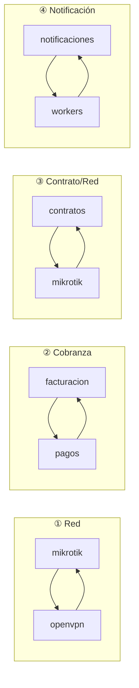

# Capítulos 8–11 — Dependencias, Reutilización, Riesgos y Fortalezas

---

# CAPÍTULO 8 — Dependencias

## 8.1 Mapa por grado

| Módulo | Sale a | Entra de | Lectura |
|---|---|---|---|
| `auth` | 1 | **11** | Hub transversal legítimo |
| `config` | 0 | **8** | Hub transversal legítimo |
| `mikrotik` | 5 | **10** | **Hub de dominio — el nodo más consumido del negocio** |
| `contratos` | **8** | 3 | **Nodo con más salidas — agregado raíz** |
| `workers` | 7 | 5 | Hub por constantes, no por servicio |
| `olt-nativo` | 5 | 3 | Subsistema profundo |
| `outbox-red` | 2 | 3 | Frontera correcta |
| `portal` | 5 | 0 | Fachada — hoja del grafo |
| `usuarios` | 0 | 2 | Hoja |

## 8.2 Los cuatro ciclos y su naturaleza

| # | Ciclo | Por qué existe | ¿Es esencial? | Diagnóstico |
|---|---|---|---|---|
| 1 | `mikrotik ↔ openvpn` | El router necesita túnel para ser alcanzable; el túnel se define contra un router registrado | **Sí, conceptualmente** | Real. Refleja que el router es simultáneamente objeto gestionado y extremo del canal de gestión |
| 2 | `facturacion ↔ pagos` | La factura necesita lo pagado; el pago aplica contra facturas | **Sí, conceptualmente** | Real. Es el ciclo natural de una cuenta corriente |
| 3 | `contratos ↔ mikrotik` | El contrato provisiona; el router valida CIDR y consulta sesiones | **No** | **Accidental.** `mikrotik` importa `contratos` para validar `check-cidr-en-router` y resolver sesiones a contratos — una dependencia de *lectura* que no requiere el módulo entero |
| 4 | `notificaciones ↔ workers` | `notificaciones` necesita el nombre de la cola; `workers` notifica al cortar | **No** | **Artificial.** Se debe a que `workers.constants.ts` mezcla constantes con política de reintentos |

**Ciclos indirectos adicionales:** `contratos → outbox-red → mikrotik → contratos` y
`contratos → mikrotik → openvpn → mikrotik`.

**Conclusión:** de 4 ciclos, **2 son esenciales del dominio y 2 son accidentales**. Los
esenciales no se eliminan: se gestionan. Los accidentales sí se pueden romper, y romperlos es
barato (constantes en un paquete propio; interfaz de lectura para la validación de CIDR).

## 8.3 Componentes de riesgo por posición en el grafo

| Componente | Riesgo | Motivo |
|---|---|---|
| `mikrotik` | **Muy alto** | 10 consumidores + 3 caminos de acceso al hardware. Un cambio de firma o de política de conexión impacta a todo el plano de red |
| `contratos` | **Alto** | 8 dependencias salientes; toda alta, baja o cambio pasa por aquí |
| `workers.constants.ts` | **Alto** | Un archivo de constantes acopla 6 módulos |
| `auth` / `config` | **Medio** | 11 y 8 consumidores, pero interfaz estable y de solo lectura |
| `olt-nativo` | **Medio** | Solo 3 consumidores externos, pero es un subsistema de 25.659 LOC |
| `outbox-red` | **Medio** | Pocos consumidores, pero es la frontera por la que pasa todo lo que muta la red |

## 8.4 Qué debería desacoplarse (diagnóstico, sin plan de ejecución)

Ordenado por relación beneficio/coste:

| # | Acoplamiento | Coste de romperlo | Beneficio |
|---|---|---|---|
| 1 | `workers.constants.ts` como dependencia de 6 módulos | **Bajo** — mover constantes a `common/` | Elimina 1 ciclo y 5 dependencias falsas |
| 2 | `mikrotik → contratos` | **Bajo-medio** — extraer una interfaz de consulta | Elimina 1 ciclo real del núcleo |
| 3 | Los 3 caminos hacia MikroTik | **Medio** — unificar tras un puerto (ya existe el precedente `IOltProvider`) | Un solo punto de política de conexión, reintento y credenciales |
| 4 | `olt-nativo` como módulo único | **Alto** — pero las fronteras ya existen en el árbol (`capability/`, `compliance/`, `domain/`, `ztp/`, `providers/`) | Hace mantenible el módulo más grande |
| 5 | `olt-nativo.controller.ts` (150 endpoints) | **Bajo** — dividir por grupo funcional sin tocar rutas | Reduce conflictos de merge y hace legible la superficie |

## 8.5 Dependencias hacia el exterior del repositorio

Acoplamientos que **no viven en el código** y por eso no aparecen en ningún grafo:

| Dependencia | Dónde vive | Riesgo |
|---|---|---|
| Credenciales connreq de GenieACS | Provision `erp-connreq-creds` en el ACS + `.env` del VPS | Deben coincidir; nada lo verifica |
| CCD y certificados OpenVPN | Filesystem del VPS | El ERP los escribe; no están versionados |
| `mikrotik.conf` (rutas `10.0.0.0/8`) | VPS | Se confundieron con rutas huérfanas |
| Crontab del sistema | VPS, editable desde `/admin/sistema/crontab` | Fuera del control de versiones |
| Chromium de Puppeteer | `~/.cache/puppeteer` | Instalación incompleta detectada en el entorno local |

---

# CAPÍTULO 9 — Reutilización

## 9.1 Servicios genuinamente reutilizados (activos compartidos)

| Servicio | Módulo | Consumidores | Calidad |
|---|---|---|---|
| `ModuleHealthService` | `common` | Todos los degradables | **Excelente** — base del patrón de resiliencia |
| `ResultadoOperacion` | `common/domain` | Plano de red | **Excelente** — vocabulario de dominio con test |
| `RedisLockService` | `common/redis` | **Solo `cobranza.worker`** | Buena pieza, **infrautilizada** |
| `CircuitBreakerRegistry` | `common` | mikrotik, olt-nativo, monitoreo | Muy buena |
| `WatcherHeartbeatService` | `common` | Crons y watchers | Muy buena |
| `QueuePauseService` | `common` | mantenimiento, sistema | Buena |
| `encryption.util` | `common/utils` | Routers, OLTs, proveedores, XUI, Google | Buena |
| `ip.util` | `common/utils` | Contratos, mikrotik | Buena |
| `pagination.util` | `common/utils` | Repositorios | Buena |
| `PoliticaFacturacionService` | `facturacion` | Todo el ciclo de cobro | **Excelente** — fórmula única |
| `AplicadorFacturaService` | `facturacion` | pagos, adelantos | **Excelente** — único escritor del saldo |
| `IOltProvider` + Router | `olt-nativo` | 3 proveedores | **Excelente** — puerto con reglas escritas |
| `MikrotikService` + pool | `mikrotik` | 10 módulos | Buena, pero con 2 caminos paralelos |
| `GatewayMensajeriaService` | `notificaciones` | 4 módulos | Buena |
| CTE `PUNTOS_SERVICIO` | `planta-externa` | Mapa, planta | **Ejemplo modélico** de consolidación tras incidente |
| `capability.engine` | `olt-nativo/capability` | ZTP y otros dominios | Muy buena — reglas puras, no muta la entrada |

## 9.2 Lógica duplicada

| # | Duplicación | Copias | Gravedad | Estado |
|---|---|---|---|---|
| 1 | **Cálculo de deuda** | 4 (`fn_calcular_deuda_contrato`, `deuda-por-contrato.service`, `pagos.service`, `cobranza.worker`) | **Crítica** — decide cortes de servicio y saldos | Sin unificar |
| 2 | **Predicado "contrato activo"** | ~6 | **Alta** | Sin unificar; hay spec que sugiere fallo previo |
| 3 | **Resúmenes agregados** | 3 superficies + 2 vistas | Media | Sin unificar |
| 4 | **Acceso a MikroTik** | 3 caminos | **Alta** | Sin unificar |
| 5 | **Aplicación de dinero a facturas** | Eran 4 copias del mismo `UPDATE` | — | **RESUELTA** — la de `adelantos` había perdido el guard y aplicaba saldo a facturas ANULADAS. Hoy bloqueada por `frontera-dinero.spec.ts` |
| 6 | **Ubicación del abonado** | Eran 4 consultas (`clientes.latitud` vs `contratos.latitud_instalacion`) | — | **RESUELTA** — CTE `PUNTOS_SERVICIO` |
| 7 | **Estado de ONU** | 2 caminos (SSH en vivo vs BD) | Baja | **JUSTIFICADA por escrito** — costes incompatibles. Falta test de no divergencia |
| 8 | **Tipos backend↔frontend** | 2 definiciones de cada DTO | Media | Sin unificar, pese a existir Swagger |
| 9 | **Validación de formularios** | Backend (`class-validator`) y frontend (a mano) | Media | Sin unificar |

**Observación importante:** las duplicaciones 5 y 6 **ya fueron resueltas por el equipo**, y en
ambos casos la resolución fue "una sola definición, en el punto común". El sistema **sabe cómo**
resolver este problema — lo ha hecho dos veces bien. Lo que falta es aplicarlo a las restantes.

## 9.3 Consultas y trabajo repetido

| Repetición | Detalle |
|---|---|
| **Reconciliación solapada** | 5 procesos (`reconciliador` 15/30 min, `ztp-reconcile` 03:30 + 2 min, `ftth-wan-watcher` 10 min, `address-list-reconciliador` 04:40, `olt-sync` 6 h) verifican estados solapados del mismo parque, sin coordinación entre sí |
| **Lecturas de OLT** | `syncPeriodico`, `olt-health-poller`, `adoptarHuerfanas`, `verificarWan`, `limpiarIdsHuerfanos` y cada `GET /:oltId/onus` del operador abren sesiones contra la **misma OLT de sesiones VTY limitadas** |
| **Sin cache de servidor en frontend** | Cada pantalla repite sus peticiones; no hay TanStack Query/SWR |
| **Sin invalidación de cache** | La consistencia se obtiene por TTL de 5 min, no por invalidación dirigida |

## 9.4 Componentes compartidos del frontend

| Categoría | LOC | % del frontend |
|---|---|---|
| `ui` + `shared` + `atoms` (reutilizable) | 1.016 | **1,8 %** |
| Componentes de dominio | ~56.400 | 98,2 % |

Ver Cap. 3 para el análisis.

## 9.5 Procesos repetitivos susceptibles de patrón común

Sin proponer implementación, se observan **cuatro familias** de proceso que hoy se escriben desde
cero cada vez:

1. **Watcher de reconciliación** — leer estado real, comparar con BD, actuar, registrar. 5 implementaciones distintas.
2. **Pool de recursos** — reservar, liberar, reconciliar, barrer huérfanos. 4 implementaciones (`service-port`, `mgmt-ip`, `onu-id`, `mgmt-port`) + puertos NAP + IPs.
3. **Operación mutante contra hardware** — lock, write-ahead, ejecutar, VIO, clasificar resultado, compensar. Bien resuelta en FTTH; ausente en MikroTik.
4. **Wizard con anulación** — abrir, heartbeat, pasos con compensación, confirmar/cerrar, barrido por TTL. Implementada dos veces (FTTH y VPN) con mecánicas distintas.

---

# CAPÍTULO 10 — Riesgos Arquitectónicos

Escala: **Probabilidad** (Baja/Media/Alta) × **Impacto** (Bajo/Medio/Alto/Crítico) →
**Criticidad** (Baja/Media/Alta/Crítica). Todas son **valoraciones** sustentadas en evidencia
medida o en incidentes registrados.

## R-01 · Reescritura masiva de configuración de ONUs en una migración

| Campo | Valor |
|---|---|
| **Causa** | `ZtpReconcileCron` (03:30) reescribe SSID, clave WiFi y credenciales web de toda ONU con `provisioning_enabled=true` y `last_applied_revision IS NULL`. La protección actual es un efecto lateral de que `adoptarOnusHuerfanas` no crea `contrato_onu_config` |
| **Impacto** | **Crítico** — todo el parque migrado sin internet en sus dispositivos a la mañana siguiente, sin que nadie lo pidiera |
| **Probabilidad** | **Alta** — hay dos migraciones planificadas (SmartOLT 205 ONUs, MikroWISP) |
| **Criticidad** | **CRÍTICA** |
| **Evidencia** | `CLAUDE.md` §Migraciones de ONUs; `ztp-reconcile.cron.ts` |

## R-02 · Punto único de falla: `worker-auxiliary`

| Campo | Valor |
|---|---|
| **Causa** | Los 29 crons, las 6 colas, el outbox y todos los watchers corren en un solo proceso PM2 |
| **Impacto** | **Crítico** — el ERP sigue respondiendo con normalidad mientras nadie se corta, nadie se reactiva, ningún comando de red se aplica y ningún watcher repara. **Sin señal visible en la interfaz** |
| **Probabilidad** | Media — límite de 800 MB, `max_restarts: 10` |
| **Criticidad** | **CRÍTICA** |
| **Evidencia** | `ecosystem.config.js`; ausencia de alerta por watcher caído en la UI |

## R-03 · Aislamiento multi-tenant por convención

| Campo | Valor |
|---|---|
| **Causa** | El filtrado por `empresa_id` depende de que cada una de las 445 consultas crudas lo incluya. No hay RLS ni guard central |
| **Impacto** | **Crítico** — fuga de datos entre empresas; una omisión **no produce error**, produce datos ajenos |
| **Probabilidad** | Media (Alta si crece el nº de tenants o de desarrolladores) |
| **Criticidad** | **CRÍTICA** |
| **Evidencia** | 445 `.query()`; índices UNIQUE por empresa existen, RLS no |

## R-04 · Cálculo de deuda en 4 lugares

| Campo | Valor |
|---|---|
| **Causa** | `fn_calcular_deuda_contrato`, `deuda-por-contrato.service`, `pagos.service`, `cobranza.worker` calculan lo mismo con criterios potencialmente distintos (cargos pendientes, notas de crédito, adelantos, promesas) |
| **Impacto** | **Crítico** — el ERP puede cortar a quien no debe, o no cortar a quien sí; y responder distinto según por dónde se le pregunte |
| **Probabilidad** | **Alta** — 4 copias divergen en la primera modificación de una sola |
| **Criticidad** | **CRÍTICA** |
| **Evidencia** | Cap. 9.2; precedente idéntico ya ocurrido con la aplicación de dinero |

## R-05 · 39 tablas sin entidad TypeORM

| Campo | Valor |
|---|---|
| **Causa** | Solo 81 de ~120 tablas tienen entidad. Las sin tipar incluyen `comandos_red_pendientes`, `ftth_operacion_lock`, `operacion_wizard(_paso)`, `pago_extorno`, `cierre_caja`, `cuentas_bancarias` |
| **Impacto** | **Alto** — un cambio de esquema en el outbox, el lock FTTH o la saga **no rompe la compilación**: rompe producción |
| **Probabilidad** | Media-Alta |
| **Criticidad** | **ALTA** |

## R-06 · Ausencia total de observabilidad

| Campo | Valor |
|---|---|
| **Causa** | Sin APM, sin trazas, sin métricas, `logging: false` en TypeORM, sin `pg_stat_statements` declarado |
| **Impacto** | **Alto** — no se puede saber qué endpoint se usa, qué consulta duele ni si una corrección funcionó. Los incidentes se descubren por el cliente |
| **Probabilidad** | **Alta** — ya está ocurriendo |
| **Criticidad** | **ALTA** |
| **Evidencia** | Etapa I declaró 5 preguntas que no puede responder por esta causa |

## R-07 · Concentración de responsabilidades en `olt-nativo`

| Campo | Valor |
|---|---|
| **Causa** | 25.659 LOC, 41 servicios, 24 entidades, 11 crons, 1 controlador de 150 endpoints, 8 subdominios |
| **Impacto** | Alto — cada cambio requiere entender el módulo entero; los merges chocan |
| **Probabilidad** | **Alta** — es el módulo que más crece |
| **Criticidad** | **ALTA** |
| **Atenuante** | Las fronteras internas **ya existen** en el árbol |

## R-08 · Garantías desiguales entre FTTH y WISP/MikroTik

| Campo | Valor |
|---|---|
| **Causa** | Outbox + máquina de estados + saga + VIO están en FTTH. El plano MikroTik tiene outbox parcial, sin máquina de estados, sin saga y con VIO solo como detección posterior (`/discrepancias`) |
| **Impacto** | **Alto** — los incidentes que FTTH ya no puede tener, MikroTik sí |
| **Probabilidad** | Media |
| **Criticidad** | **ALTA** |
| **Evidencia** | Cap. 7.9 |

## R-09 · Flujo de cambio de ONU inexistente

| Campo | Valor |
|---|---|
| **Causa** | No hay endpoint ni saga de sustitución. Se improvisa como baja + alta |
| **Impacto** | Alto — corte innecesario, pérdida de la configuración WiFi del cliente, ventana de huérfano, sin trazabilidad del equipo sustituido |
| **Probabilidad** | **Alta** — es una operación rutinaria en un ISP |
| **Criticidad** | **ALTA** |

## R-10 · `reconciliar()` sin cap ni lock

| Campo | Valor |
|---|---|
| **Causa** | `reconciliador.service.ts` itera cada 15 min sin límite de trabajo ni lock; el carril automático multiplicó su carga potencial |
| **Impacto** | Alto — puede solaparse consigo mismo y saturar las sesiones VTY del MA5800 |
| **Probabilidad** | Media-Alta |
| **Criticidad** | **ALTA** |
| **Evidencia** | `PENDIENTES.md`; precedente de 1.788 reintentos contra el MA5800 |

## R-11 · Serialización de todo el plano OLT en un worker uvicorn

| Campo | Valor |
|---|---|
| **Causa** | 1 worker por el límite bajo de sesiones VTY del MA5800 (**decisión correcta**) |
| **Impacto** | Alto — es el cuello de botella estructural; toda operación OLT hace cola |
| **Probabilidad** | **Alta** al crecer el parque o el nº de OLTs |
| **Criticidad** | **ALTA** |
| **Matiz** | El riesgo **no es la decisión**, es que no hay encolado explícito ni medición de la cola |

## R-12 · Series temporales sin particionado ni retención

| Campo | Valor |
|---|---|
| **Causa** | `metricas_monitoreo` escribe cada minuto × dispositivo; `consumo_datos` cada 15 min × contrato. Existe `fn_cleanup_old_data` sin política visible |
| **Impacto** | Medio-Alto — degradación progresiva de consultas y backups |
| **Probabilidad** | **Alta** — es acumulativo por definición |
| **Criticidad** | **ALTA** |

## R-13 · `TimeoutInterceptor(30 s)` global frente a hardware lento

| Campo | Valor |
|---|---|
| **Causa** | Timeout global de 30 s; operaciones legítimas de 90–150 s |
| **Impacto** | Medio-Alto — **toda operación síncrona nueva contra hardware nace rota** y nada lo impide en compilación |
| **Probabilidad** | Media |
| **Criticidad** | **MEDIA-ALTA** |

## R-14 · Licencia como punto único de falla total

| Campo | Valor |
|---|---|
| **Causa** | `LicenciaGuard` es el primer `APP_GUARD`; su fallo bloquea el ERP incluido `auth` |
| **Impacto** | **Crítico** cuando ocurre |
| **Probabilidad** | **Baja** — hay validación diaria + recarga cada 6 h |
| **Criticidad** | **MEDIA** |
| **Matiz** | Es **deliberado**. El riesgo es que no hay modo degradado ni periodo de gracia documentado |

## R-15 · Cobertura de tests

| Campo | Valor |
|---|---|
| **Causa** | ~30 specs para ~96.000 LOC de backend; **2 tests** para 57.435 LOC de frontend; la suite de facturación no compila; `sql:check` no está en CI |
| **Impacto** | Medio-Alto — las regresiones se descubren en producción |
| **Probabilidad** | **Alta** |
| **Criticidad** | **MEDIA-ALTA** |
| **Matiz importante** | Los tests que existen son **de altísima calidad**: cubren los invariantes que ya fallaron y nombran el incidente. El problema es cobertura, no criterio |

## R-16 · Concentración de crons en la madrugada

| Campo | Valor |
|---|---|
| **Causa** | 5 barridos pesados entre 03:00 y 04:40, sin coordinación ni presupuesto de tiempo |
| **Impacto** | Medio |
| **Probabilidad** | Media |
| **Criticidad** | **MEDIA** |

## R-17 · Tres caminos hacia MikroTik

| Campo | Valor |
|---|---|
| **Causa** | `node-routeros` (NestJS), `ssh2` (NestJS), `mikrotik_pool.py` (Python) |
| **Impacto** | Medio — política de conexión, reintentos y credenciales triplicadas |
| **Probabilidad** | Media |
| **Criticidad** | **MEDIA** |

## R-18 · Deriva del frontend

| Campo | Valor |
|---|---|
| **Causa** | 3 convenciones de organización; 1,8 % de código reutilizable; componentes de 3.776 LOC; tipos duplicados; sin librería de formularios |
| **Impacto** | Medio — velocidad de desarrollo y consistencia de UX |
| **Probabilidad** | **Alta** |
| **Criticidad** | **MEDIA** |

## R-19 · Presupuesto de memoria sobrecomprometido

| Campo | Valor |
|---|---|
| **Causa** | Límites PM2 suman 3,17 GB sobre ~1,9 GB de RAM |
| **Impacto** | Medio-Alto — ya hubo un episodio con 87 MB libres |
| **Probabilidad** | Media |
| **Criticidad** | **MEDIA** |

## R-20 · Configuración fuera del repositorio

| Campo | Valor |
|---|---|
| **Causa** | Credenciales de GenieACS duplicadas en el ACS, CCD/certs en filesystem, crontab del VPS editable desde la UI |
| **Impacto** | Medio — una instalación nueva no es totalmente reproducible desde el repo |
| **Probabilidad** | Media |
| **Criticidad** | **MEDIA** |

## 10.21 Matriz resumen

| Criticidad | Riesgos |
|---|---|
| **CRÍTICA** | R-01 migración de ONUs · R-02 SPOF del worker · R-03 multi-tenant · R-04 deuda ×4 |
| **ALTA** | R-05 tablas sin entidad · R-06 observabilidad · R-07 `olt-nativo` · R-08 FTTH vs WISP · R-09 cambio de ONU · R-10 reconciliador · R-11 serialización OLT · R-12 series temporales |
| **MEDIA-ALTA** | R-13 timeout global · R-15 tests |
| **MEDIA** | R-14 licencia · R-16 crons madrugada · R-17 caminos MikroTik · R-18 frontend · R-19 memoria · R-20 config externa |

---

# CAPÍTULO 11 — Fortalezas

> Este capítulo existe porque **no todo debe modificarse**. Lo que sigue debe preservarse
> explícitamente en cualquier consolidación futura. Varias de estas fortalezas son superiores a
> lo que se encuentra en ERPs comerciales del sector.

## F-01 · Verified Infrastructure Operations (VIO) — **preservar sin excepción**

`accepted ≠ materialized`. Toda mutación contra hardware se verifica con un comando de lectura
**independiente**. Nació de un incidente real y bien diagnosticado: una EG8145V5 aceptó el
comando OMCI sin error, la OLT lo mostraba configurado, y el firmware nunca activó el IP-host —
confirmado con sniffer en cold-boot físico. El ERP reportó "aplicado" durante días con la gestión
muerta.

**Por qué es excepcional:** la mayoría de sistemas del sector tratan "el CLI no dio error" como
éxito. Este distingue explícitamente *aceptado* de *materializado* y lo dice en el mensaje al
operador.

## F-02 · Vocabulario de dominio en vez de transporte — **preservar y extender**

`ResultadoOperacion` con 6 clases: `aplicado` · `ya_en_destino` · `no_aplica` ·
`rechazado_definitivo` · `reintentable` · `indeterminado`. El transporte traduce en el borde.

Tres decisiones dentro de esta pieza que merecen conservarse literalmente:

1. **`indeterminado` es obligatorio ante un timeout de hardware.** Un timeout no significa "no pasó nada".
2. **La lista de rechazos definitivos es explícita y corta: solo 400 y 404.** Un criterio `status < 500` es incorrecto.
3. **Ante la duda: reintentable**, porque reintentar es recuperable y descartar no.

## F-03 · Outbox transaccional con reclamo atómico — **preservar**

El negocio y la intención de red se escriben en la **misma transacción**. El reclamo es
`UPDATE → EN_PROCESO + dueño + TTL` en **una sola sentencia**, no `SELECT FOR UPDATE SKIP
LOCKED`, porque este último protegía la selección pero no la ejecución.

## F-04 · Máquina de estados declarativa — **preservar y replicar**

Las transiciones legales viven en **un solo archivo** y la **idempotencia se deriva del estado
destino** (`ya_en_destino` = ÉXITO): un método nuevo no puede olvidarse de ser idempotente porque
no es él quien lo implementa. Gracias a la declaración única se detectó que faltaba `suspendido`
como origen de `desaprovisionar` — el caso más frecuente del negocio.

**Ya replicada voluntariamente** en `planta-externa/domain/`.

## F-05 · Saga con bitácora write-ahead — **preservar**

Seis reglas, todas correctas y poco habituales juntas:
1. La compensación se registra **antes** de ejecutar.
2. Cada paso guarda **cómo deshacerlo y cómo verificar si llegó a aplicarse**.
3. Las compensaciones son **idempotentes** ("does not exist" al deshacer = hecho, no error).
4. **VIO también al deshacer**.
5. El heartbeat **suprime** el barrido, nunca lo autoriza, y tiene **techo absoluto**.
6. **Anular es asíncrono** — se espera a que el paso en vuelo termine; nunca se corta el hardware a mitad.

## F-06 · La frontera transaccional es el estado terminal verificado, no el clic

Razonamiento explícito y correcto: el clic es inalcanzable justo en los peores casos (crash,
corte de sesión, corte de luz) y usarlo convertiría la regla en fábrica de cortes de servicio.

## F-07 · Patrón degradable + Core Indestructible

Distinción consciente, módulo por módulo, entre "puede arrancar degradado" y "debe crashear el
backend para proteger al proceso anterior en PM2".

## F-08 · Invariante de atomicidad hardware↔ERP con dos watchers

Nunca un `ont` en la OLT sin `ftth_onu_registro`, ni al revés. Watcher DELETE
(`reintentarRollbacksFallidos`, estado `fallido_rollback`) y watcher CREATE
(`adoptarOnusHuerfanas`, que reconstruye desde inventario + pool + lectura viva con VIO).
La descripción del `ont` lleva `DATAFAST_CNT-xxxx` para poder atribuirlo.

## F-09 · Ports & Adapters con reglas escritas en el contrato

`IOltProvider` no solo declara métodos: prohíbe propagar excepciones, obliga a medir latencia y
**prohíbe que un adaptador toque la BD**. Es arquitectura hexagonal correcta en el dominio más
crítico.

## F-10 · Un solo escritor del dinero

`PagosService.registrar` es el único registrador; `AplicadorFacturaService` el único que aplica.
Protegido por `frontera-dinero.spec.ts` tras descubrir 4 copias del mismo `UPDATE`, una de ellas
sin guard de estado aplicando saldo a favor contra facturas **anuladas**.

## F-11 · Puerta de estabilidad documentada para las pasarelas de pago

El contrato de cobro se fijó **antes** que las implementaciones, deliberadamente: si se hubiera
dejado para después, la primera integración lo habría definido de facto. Y las implementaciones
están bloqueadas hasta cumplir criterios que **no dependen de escribir código** (30 días de
contabilidad limpia, un extorno real revisado a mano, un cierre mensual cuadrado).

**Es la decisión de gestión técnica más madura del repositorio**: distingue entre "sé cómo
hacerlo" y "es prudente hacerlo ahora".

## F-12 · Tests que nombran el incidente

Regla explícita: un test llamado "no debería fallar" se borra en la primera limpieza; uno que
dice *"409 de lock es reintentable, no un veredicto (incidente 28/07)"* sobrevive.

## F-13 · "VIO hacia adentro" — el software también afirma sin verificar

Regla derivada de descubrir que un comentario garantizaba una propiedad de concurrencia que era
**falsa**: todo comentario que garantice concurrencia, atomicidad o exclusión mutua lleva un test
que lo ejercite, **o se borra**. Y: *un log describe lo que ocurrió, nunca lo que el código
pretendía hacer.*

## F-14 · Portabilidad multi-VPS implementada

Sin IPs ni dominios en el repositorio; lazy getters; `.env.example` como contrato;
`ecosystem.config.js` sin secretos; vhosts por plantilla con caída elegante cuando falta un
dominio; retrocompatibilidad al renombrar variables (`ERP_DOMAIN` → `APP_DOMAIN`).

## F-15 · Aislamiento de procesos por causa real

Chromium en su propio proceso PM2 (tras dejar el VPS con 87 MB libres), migraciones en un solo
proceso (tras la colisión del 21/07), frontend con entorno mínimo (tras arrastrar todos los
secretos del backend). Cada aislamiento responde a un incidente concreto y está documentado en el
propio archivo de configuración.

## F-16 · Separación ERP ↔ Portal del abonado

Secreto JWT distinto, cookies propias, guard propio, servicio de tenant propio, vhost con API
acotada por regex, y **tests de aislamiento** (`portal-auth.aislamiento.spec.ts`).

## F-17 · Consolidación demostrada de duplicados

El CTE `PUNTOS_SERVICIO` y el escritor único del saldo prueban que el equipo **sabe resolver**
la duplicación cuando la detecta: una sola definición en el punto común, no un parche por sitio.

## F-18 · Cultura de causa raíz

Regla escrita y aplicada: reproducir y observar (no deducir), explicar cómo llegó el sistema a
ese estado, preguntar dónde más ocurre lo mismo, corregir en el punto común, y dejar constancia
**de la causa**, no del arreglo. Los tres fallos del mapa (2026-08-05) documentan explícitamente
el parche superficial que se rechazó en cada caso.

## 11.19 Síntesis

**El ERP Datafast tiene una arquitectura de resiliencia superior a su arquitectura de
organización.** El plano de red —lo más difícil— está resuelto con patrones que muchos sistemas
comerciales no tienen. Lo que falta no es criterio arquitectónico: es **cobertura, uniformidad y
obligatoriedad** de un criterio que ya existe y ya se demostró correcto.

Esa es exactamente la definición de un sistema listo para **consolidarse**, no para reescribirse.
