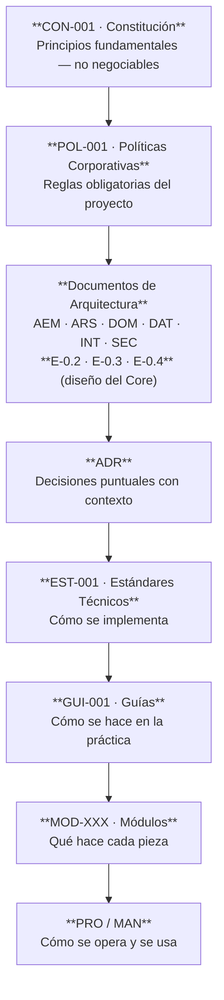
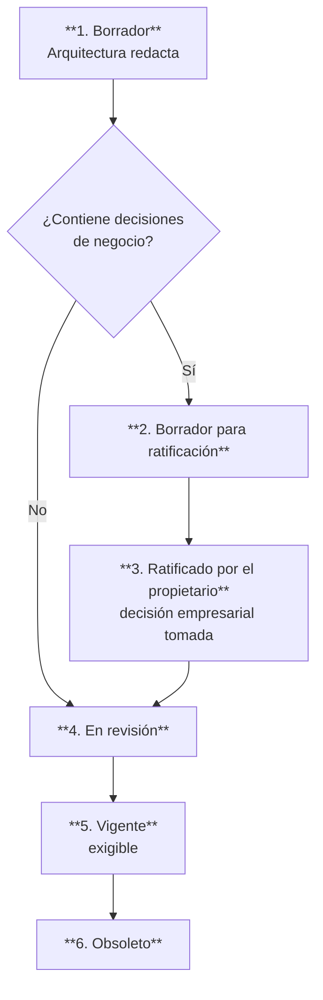

# Cuerpo Normativo y Documental — ERP Datafast

**Índice maestro** · Versión 1.1 · 2026-08-06 · Rama `main`, commit base `f8d52b00`

---

## 1. Propósito de este cuerpo documental

Hasta la fecha, el conocimiento arquitectónico del ERP Datafast vivía repartido entre
`CLAUDE.md`, comentarios de código de altísima calidad, tests que nombran incidentes y la
memoria del equipo. Ese conocimiento es **real y probado**, pero no es **consultable, citable ni
exigible**.

Este cuerpo documental convierte ese conocimiento en normativa: documentos con código, versión,
estado, alcance y jerarquía, de modo que una decisión pueda **citarse** y una desviación pueda
**detectarse**.

## 2. Catálogo de documentos

| Código | Documento | Estado | Archivo |
|---|---|---|---|
| **CON-001** | Constitución del ERP | **Vigente** — ratificada por Datafast 2026-08-06 | [CON-001-constitucion.md](CON-001-constitucion.md) |
| **AEM-001** | Arquitectura Empresarial | Vigente | [AEM-001-arquitectura-empresarial.md](AEM-001-arquitectura-empresarial.md) |
| **ARS-001** | Arquitectura de Software | Vigente | [ARS-001-arquitectura-software.md](ARS-001-arquitectura-software.md) |
| **DOM-001** | Modelo de Dominio | Vigente | [DOM-001-modelo-dominio.md](DOM-001-modelo-dominio.md) |
| **DAT-001** | Arquitectura de Datos | Vigente | [DAT-001-arquitectura-datos.md](DAT-001-arquitectura-datos.md) |
| **INT-001** | Arquitectura de Integraciones | Vigente | [INT-001-arquitectura-integraciones.md](INT-001-arquitectura-integraciones.md) |
| **SEC-001** | Arquitectura de Seguridad | Vigente | [SEC-001-arquitectura-seguridad.md](SEC-001-arquitectura-seguridad.md) |
| **POL-001** | Políticas Corporativas | Vigente | [POL-001-politicas-corporativas.md](POL-001-politicas-corporativas.md) |
| **ADR-001…029** | Registros de Decisiones Arquitectónicas | Vigente | [ADR-000-registro-decisiones.md](ADR-000-registro-decisiones.md) |
| **ADR-030** | Referencia externa por tipo de módulo | Vigente | [ADR-030-marco-referencia-tmforum.md](ADR-030-marco-referencia-tmforum.md) |
| **ADR-035** | Modelo de facturación: se adopta el del sector y se clasifica cada divergencia | **Propuesta** — §4.1 superseded por ADR-036 | [ADR-035-modelo-facturacion-tmforum.md](ADR-035-modelo-facturacion-tmforum.md) |
| **ADR-036** | Benchmark del Core: qué se adopta de TM Forum, qué se adapta y qué sigue sin fuente | **Aceptada** | [ADR-036-benchmark-del-core.md](ADR-036-benchmark-del-core.md) |
| **ADR-037** | Los estados de «no llegó a empezar»: `CANCELADO` en A §16 y `RECHAZADO` en C §5 | **Aceptada** — **modifica corpus congelado** | [ADR-037-estados-de-lo-que-no-empezo.md](ADR-037-estados-de-lo-que-no-empezo.md) |
| **ADR-038** | El contrato de una lectura, y el veredicto de un conjunto — cierra **R-6** | **Aceptada** | [ADR-038-contrato-de-lectura-y-veredicto-de-conjunto.md](ADR-038-contrato-de-lectura-y-veredicto-de-conjunto.md) |
| **E-0.2** | Modelo de Información del Core — Cliente, Contrato, Cuenta, Servicio Contratado | ✅ **Vigente** v2.4 | [E-0.2-modelo-informacion-core.md](E-0.2-modelo-informacion-core.md) |
| **E-0.3** | Contratos de Capacidad y Ejecución | ✅ **Vigente** v2.5 | [E-0.3-capacidades-y-ejecucion.md](E-0.3-capacidades-y-ejecucion.md) |
| **E-0.4** | Fronteras de los Dominios Técnicos | ✅ **Vigente** v2.3 | [E-0.4-fronteras-dominios-tecnicos.md](E-0.4-fronteras-dominios-tecnicos.md) |
| **F-0.0** | **Punto de entrada para implementar el Core** — se lee antes que nada | Vigente v1.0 | [F-0.0-punto-de-entrada.md](F-0.0-punto-de-entrada.md) |
| **F-0.1-A** | **Catálogo de comprobaciones** — los 49 invariantes con su mecanismo | Vigente v1.2 | [F-0.1-anexo-catalogo-comprobaciones.md](F-0.1-anexo-catalogo-comprobaciones.md) |
| **F-0.1** | Plan de Reestructuración del Core | ✅ **Ratificado por el propietario** v3.1 | [F-0.1-plan-de-reestructuracion.md](F-0.1-plan-de-reestructuracion.md) |
| **F-0.1-R1** | Registro de divergencias de producción durante la congelación (procedimiento de R-1) | Vigente v1.0 — **vivo, se actualiza por incidente** | [F-0.1-R1-divergencias.md](F-0.1-R1-divergencias.md) |
| **—** | Verificación transversal de E-0.2/3/4 contra el cuerpo normativo | Control de conformidad — hallazgo, no norma | [E-0.2-4-verificacion-transversal.md](E-0.2-4-verificacion-transversal.md) |
| **PLAN-001** | Plan de Trabajo | Vigente — **temporal** | [PLAN-001-plan-de-trabajo.md](PLAN-001-plan-de-trabajo.md) |
| **EST-001** | Estándares Técnicos | Vigente | [EST-001-estandares-tecnicos.md](EST-001-estandares-tecnicos.md) |
| **GUI-001** | Guías de Desarrollo | Vigente | [GUI-001-guias-desarrollo.md](GUI-001-guias-desarrollo.md) |
| **MOD-000** | Catálogo y plantilla de módulos | Vigente | [MOD-000-catalogo-modulos.md](MOD-000-catalogo-modulos.md) |
| **MOD-001** | Módulo Contratos | Vigente | [MOD-001-contratos.md](MOD-001-contratos.md) |
| **MOD-002** | Módulo Pagos | Vigente | [MOD-002-pagos.md](MOD-002-pagos.md) |
| **MOD-003** | Módulo OLT-Nativo / FTTH | Vigente | [MOD-003-olt-nativo.md](MOD-003-olt-nativo.md) |
| **PRO-001** | Procedimientos Operativos | Vigente | [PRO-001-procedimientos-operativos.md](PRO-001-procedimientos-operativos.md) |
| **MAN-001** | Manual del Operador | Vigente | [MAN-001-manual-operador.md](MAN-001-manual-operador.md) |
| **MAN-002** | Manual del Administrador | Vigente | [MAN-002-manual-administrador.md](MAN-002-manual-administrador.md) |
| **RDM-001** | Roadmap del Producto | Vigente | [RDM-001-roadmap.md](RDM-001-roadmap.md) |
| ~~**REC-001**~~ | ~~Evaluación de recomendaciones~~ | **⛔ Obsoleto** — **archivado** el 2026-08-16 | [../archivo/REC-001-evaluacion-recomendaciones.md](../archivo/REC-001-evaluacion-recomendaciones.md) |

**Documentos vivos:** los listados en §2 sin marca de obsoleto. **La cifra no se copia: se cuenta
sobre la tabla** (§7.4 — una cifra citada de otro documento es una cita, no una medición).
Congelados u obsoletos: REC-001 + los tres cuerpos de evidencia (§5).

**Serie E-0.x.** E-0.2, E-0.3 y E-0.4 son los documentos de **diseño del Core** y ocupan el **nivel
de Arquitectura** de la jerarquía (§4). Se apoyan en el corpus conceptual congelado A → E-0.1
(`pdf/DATAFAST ERP.pdf`), que **no forma parte de este cuerpo normativo**: es su insumo.

## 3. Alcance de esta primera emisión — qué se entrega completo y qué no

Se declara explícitamente para que nadie asuma cobertura donde no la hay.

| Documento | Estado de la entrega |
|---|---|
| CON-001 … RDM-001 (los singleton) | **Completos.** CON-001 **ratificada y Vigente** |
| **ADR** | **16 aceptados** (decisiones reales ya tomadas y documentadas en el código o en incidentes) · **ADR-029 y ADR-030 decididos el 2026-08-06** · **ADR-017…028 propuestos** con número reservado. Ninguno es una decisión inventada para llenar el registro. |
| **MOD-XXX** | **3 de 44 módulos.** Se entregan la plantilla, el catálogo completo de los 44 con su ficha resumida, y la especificación completa de los 3 módulos de mayor criticidad (`contratos`, `pagos`, `olt-nativo`). Los 41 restantes se redactan bajo demanda o cuando el módulo se toque. **Documentar 44 módulos de golpe produciría documentación que nadie ha verificado y que envejece antes de leerse.** |
| **MAN-XXX** | **2 manuales** (Operador y Administrador), construidos sobre las rutas y endpoints reales del sistema. **No incluyen capturas de pantalla ni recorridos pantalla-por-pantalla**, porque eso exige validación con el producto en ejecución y con usuarios reales; se marca como pendiente en RDM-001. |

## 4. Jerarquía normativa

En caso de contradicción entre documentos, prevalece el de mayor jerarquía:

**Regla de precedencia:** un ADR puede **matizar** un documento de arquitectura para un caso
concreto, pero **nunca puede contradecir** CON-001 ni POL-001. Si una decisión lo exige, primero
se modifica la política y se registra el cambio.

## 5. Relación con la documentación previa

> **Todo lo congelado vive desde el 2026-08-16 en [`docs/archivo/`](../archivo/LEEME.md)**, separado
> de lo vigente para que nadie lo lea como diseño. **No se borró**: se conserva por trazabilidad
> (§7, estado 6). Lo único eliminado fue `estructura.txt`, un árbol de ficheros de mayo.

Este cuerpo normativo **no reemplaza** los trabajos anteriores: los usa como fuente de evidencia.

| Documento previo | Rol |
|---|---|
| `docs/archivo/auditoria/` (Etapa I) | **⛔ CONGELADO 2026-08-06 · archivado 2026-08-16.** Evidencia fechada. Contenía 3 afirmaciones falsas |
| `docs/archivo/consolidacion/` (Etapa II) | **⛔ CONGELADO 2026-08-06 · archivado 2026-08-16.** Su contenido vivo migró a POL-001 Anexo B y RDM-001 |
| `docs/archivo/directrices/` | **⛔ CONGELADO 2026-08-06 · archivado 2026-08-16.** Duplicaba POL-001. **POL-001 es la única fuente normativa** |
| `CLAUDE.md` | Reglas operativas del repositorio. **Sigue vigente**; POL-001 lo formaliza sin sustituirlo. |
| `PENDIENTES.md` | Registro vivo de deuda. **Sigue vigente**; alimenta RDM-001. |

## 6. Estructura base de todo documento

Todos los documentos de este cuerpo siguen la misma estructura:

1. Portada
2. Control documental (código, versión, estado, autor, revisores, fecha)
3. Historial de cambios
4. Índice
5. Objetivo
6. Alcance
7. Definiciones y glosario
8. Contenido del documento *(estructura específica por tipo)*
9. Referencias
10. Anexos

## 7. Estados posibles de un documento

| # | Estado | Significado | Quién lo otorga |
|---|---|---|---|
| 1 | **Borrador** | Redactado, no revisado | Autor |
| 2 | **Borrador para ratificación** | Contiene definiciones que requieren decisión del propietario del negocio | Autor |
| 3 | **Ratificado por el propietario** | El propietario confirmó las definiciones de negocio. **Aún no es exigible técnicamente** | **Propietario del producto** |
| 4 | **En revisión** | En proceso de revisión formal | Arquitecto |
| 5 | **Vigente** | Aprobado y **exigible** | Arquitecto |
| 6 | **Obsoleto** | Reemplazado; se conserva por trazabilidad | Arquitecto |

### 7.1 Flujo de estados

**Por qué existe el estado 3:** separa dos aprobaciones de naturaleza y de responsable
distintos. Sin él, la ratificación empresarial y la aprobación técnica quedan indistinguibles en
el historial, y dentro de un año nadie sabrá si la visión del ERP la decidió el propietario o la
escribió el arquitecto.

**Regla:** un documento en estado 2 **no puede pasar a 4 ni a 5** sin pasar por 3.

### 7.2 Documentos que hoy requieren ratificación

| Documento | Qué requiere decisión | Estado actual |
|---|---|---|
| **CON-001** | Visión (§8.3), Misión (§8.4) y Valores (§8.5) | **Borrador para ratificación** |

El resto del cuerpo documental está **Vigente**: no contiene declaraciones de negocio que
requieran ratificación, solo hechos verificables y reglas técnicas.

### 7.3 Clasificación de desviaciones

Toda desviación entre lo que una norma exige y lo que el sistema hace se clasifica en un nivel.
El nivel determina la urgencia y quién debe autorizarla.

| Nivel | Nombre | Definición | Autoriza | Plazo de cierre |
|---|---|---|---|---|
| **A** | **Incumplimiento crítico** | La norma existe y su incumplimiento puede causar **daño irreversible**: pérdida de datos, fuga entre empresas, corte indebido de servicio o dinero mal registrado | **Propietario del producto** | Debe tener fecha comprometida |
| **B** | **Riesgo técnico** | La norma se incumple y degrada la mantenibilidad, la trazabilidad o la capacidad de detectar fallos. **No causa daño irreversible por sí sola** | Arquitecto | Debe tener condición de cierre |
| **C** | **Mejora futura** | La norma se cumple parcialmente por adopción incremental. El código nuevo ya la respeta | Arquitecto | Sin plazo; se cierra por avance natural |

**Regla:** toda desviación registrada declara su **nivel**, su **estado objetivo** (cómo debe
quedar) y **qué la cierra**. Una desviación sin estado objetivo no es gobernable: nadie sabe hacia
dónde va.

El registro consolidado está en **POL-001 Anexo B**.

## 7.4 Documentos que se GENERAN, no se escriben

*(PLAN-001 Fase 2.3)*

**Los inventarios se extraen del código en un minuto. Generados no mienten; escritos a mano
mienten en seis meses.** Ese es exactamente el fallo que ya ocurrió: la auditoría afirmó "~30
tests" y "la suite no compila" citando una memoria, cuando un comando devolvía 65 suites y 593
tests en verde.

| Contenido | Documento | Cómo se obtiene |
|---|---|---|
| Nº de módulos, LOC, servicios, entidades | AEM-001 §8.4 · MOD-000 §8.3 | `ls`/`find` sobre `backend/src/modules` |
| Endpoints por controlador | ARS-001 · MOD-XXX §8.6 | `grep` de `@Controller` y `@Get/@Post/…` |
| Tablas y entidades | DAT-001 §8.1 | `grep` de `@Entity` vs `information_schema` |
| Crons, colas, listeners | ARS-001 §8.6 · MOD-003 §8.8 | `grep` de `@Cron`, `@Processor`, `@OnEvent` |
| Nº de tests y suites | EST-001 §8.5.4 | `npx jest --runInBand --ci` |
| Índices, triggers, funciones, vistas | DAT-001 §8.4 | Dump de `information_schema` (**el CI ya lo produce**) |
| Grafo de dependencias entre módulos | AEM-001 §8.5 | `grep` de `imports` en cada `*.module.ts` |

**Regla:** antes de citar cualquiera de estas cifras en una decisión, **se regenera**. Una cifra
copiada de otro documento es una cita, no una medición (POL-001 PD-03, punto 1).

**Lo que sí se escribe a mano** y no envejece igual: principios, políticas, decisiones (ADR),
procedimientos, manuales y reglas de negocio. Cambian cuando alguien decide cambiarlas, no cuando
alguien toca el código.

## 8. Convención de versionado

`MAYOR.MENOR` — **MAYOR** cambia cuando se modifica una regla exigible; **MENOR** cuando se
amplía o precisa sin alterar obligaciones.

Todo cambio se registra en la sección 3 del documento afectado, indicando **qué cambió y por qué**
— nunca solo "actualización".
