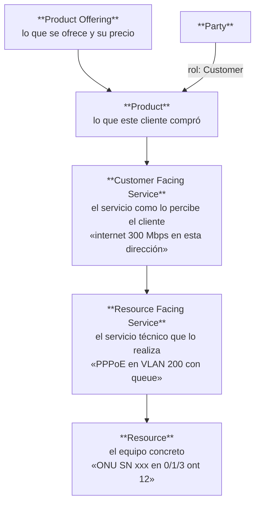

# ADR-030 — Marco de referencia del negocio ISP: TM Forum (SID / eTOM)

**Estado:** **Propuesta — presentada para decisión, sin recomendación de adopción total**
**Fecha:** 2026-08-06 · **Decide:** Propietario del producto
**Relacionado:** ADR-029 (marco normativo externo) · DOM-001 · AEM-001 · MOD-001 · RDM-001

> **Naturaleza de este documento.** Fue solicitado explícitamente como *"muéstrame primero"*: su
> objetivo es **enseñar qué implicaría** alinearse con TM Forum, con la comparación real contra el
> modelo actual y su coste, **no** conseguir la adopción. La decisión queda abierta en §4.

---

## 1. Problema

El ERP no tiene modelo de referencia del negocio. Cada módulo se diseñó desde cero, y no existe
criterio para decidir **qué se construye y qué se adopta**. La consecuencia medida: unos
**24.100 LOC** (facturación, pagos, tickets, auth, usuarios, auditoría, config…) reimplementan
problemas que la industria resolvió.

La pregunta a decidir: **¿adoptamos TM Forum como modelo de referencia del plano de negocio?**

---

## 2. Contexto

### 2.1 Advertencia sobre la fuente

Este documento describe TM Forum **a nivel conceptual**, que es donde está el valor para esta
decisión. **Los nombres y numeraciones concretas de las Open APIs deben verificarse contra el
catálogo vigente de TM Forum antes de citarlos en cualquier documento normativo.** No se han
consultado las especificaciones publicadas al redactar esto.

Lo que sí es sólido y es lo que importa aquí: **la estructura de capas de SID** y **la
organización de procesos de eTOM**.

### 2.2 Qué es TM Forum y qué partes aplican

| Marco | Qué define | ¿Aplica aquí? |
|---|---|---|
| **SID** — Information Framework | Modelo de información de un operador: qué es un Cliente, un Producto, un Servicio, un Recurso, y **cómo se relacionan entre sí** | **Sí — es lo relevante** |
| **eTOM** — Business Process Framework | Mapa de procesos del operador, organizado en Fulfillment / Assurance / Billing | **Sí, como contraste** |
| **TAM** — Application Framework | Qué aplicación cubre qué función | Parcialmente |
| **Open APIs** | Contratos REST estándar entre componentes OSS/BSS | **Probablemente no** — pensados para integrar productos de distintos fabricantes; este ERP es un monolito |

### 2.3 El concepto central de SID: tres capas, no una

SID separa lo que el cliente compra de lo que el sistema entrega y de lo que lo hace físicamente:

**La regla que se deriva:** una capa puede cambiar sin que cambien las de arriba. Cambiar el
**Resource** (una ONU averiada) no toca el **Service** ni el **Product**. Cambiar el **Product
Offering** (subir de 100 a 300 Mbps) no toca el **Resource**, solo su configuración.

### 2.4 Mapeo real contra el modelo de Datafast

| Concepto SID | En Datafast hoy | Estado |
|---|---|---|
| **Party** | No existe. `clientes` es directamente el cliente | Sin abstracción de rol |
| **Customer** | `clientes` | ✅ Equivalente |
| **Product Offering** | `planes` | ⚠️ Muy delgado: velocidad y precio. Sin catálogo, sin vigencias, sin versiones |
| **Product Specification** | No existe | — |
| **Product** (instancia) | Parte de `contratos` | ⚠️ **Fusionado** |
| **Customer Facing Service** | Parte de `contratos` | ⚠️ **Fusionado** |
| **Resource Facing Service** | Parte de `contratos` (`tipo_auth`, `usuario_pppoe`) + `ftth_onu_registro` | ⚠️ **Repartido** |
| **Resource** | **`contratos.onu_id`**, `ips_asignadas`, `routers`, `olt_dispositivos` | ⚠️ **La ONU es una columna del contrato** |
| **Customer Bill** | `facturas` | ✅ Equivalente |
| **Payment** | `pagos` | ✅ Equivalente |
| **Trouble Ticket** | `tickets` | ✅ Equivalente |
| **Service Order** | `operacion_wizard` + `comandos_red_pendientes` | ✅ **Sorprendentemente cerca**, sin saberlo |
| **Resource Inventory** | `olt_onu_inventario`, pools, `planta-externa` | ✅ Equivalente y **más rico de lo habitual** |

### 2.5 El hallazgo estructural

> **SID separa Product / Service / Resource en tres capas. Datafast las colapsa en `contratos`.**

Verificado en el código: la tabla `contratos` contiene simultáneamente

- lo comercial: `plan_id`, precios, ciclo de facturación, `descripcion_servicio`
- el servicio: `tipo_servicio`, `tipo_auth`
- **el recurso: `onu_id`** (con `uq_contratos_empresa_onu`), `ip_asignada`, `usuario_pppoe`, `router_id`
- la ubicación física: `latitud_instalacion`, `longitud_instalacion`

**No es un defecto de implementación: es una decisión de modelo**, tomada implícitamente. Y tiene
consecuencias medibles.

### 2.6 Los síntomas ya documentados que explica este colapso

Esto es lo que convierte la comparación en diagnóstico y no en teoría. **Dos de las tres brechas
funcionales del ERP son consecuencia directa del mismo colapso de capas:**

| Síntoma documentado | Qué dice el modelo actual | Qué diría SID |
|---|---|---|
| **Cambio de ONU no existe** (AEM-001 C-18, RDM-001 R6, MOD-003 CU-10). Se improvisa como baja + alta, con corte de servicio, pérdida de la clave WiFi del abonado y ventana de huérfano | La ONU **es** el contrato (`contratos.onu_id` con índice único). Cambiarla exige soltar el contrato | **Sustituir un Resource bajo el mismo Service es una operación normal.** El Service persiste; el Resource cambia |
| **Cambio de plan sin transaccionalidad** (MOD-001 RN-07: *"⚠️ verifica después, puede descuadrar"*) | El plan y el recurso viven en la misma fila, y se actualizan en **dos operaciones independientes** que pueden divergir | Cambiar el **Product Offering** no toca el Resource: solo reconfigura el RFS. Son capas distintas con ciclos distintos |
| Migrar un abonado de WISP a FTTH | No modelado | Mismo Customer, mismo CFS, distinto RFS y Resource |
| Varios servicios en la misma dirección | Varios `contratos` | Un Customer con varios Products |

**Esto no es una coincidencia favorable al estándar.** Es la comprobación de que el modelo de
referencia habría anticipado dos problemas que aquí se descubrieron por incidente. Es exactamente
el argumento de R-001: *el conocimiento externo existe y vale*.

### 2.7 Contraste con eTOM

| Bloque eTOM | Cobertura en Datafast |
|---|---|
| **Fulfillment** (venta → activación) | **Buena.** Wizard FTTH con saga, pools, VIO |
| **Assurance** (monitoreo → resolución) | **Muy buena.** Monitoreo, drift, reconciliación, watchers, VIO. **Por encima de lo habitual** |
| **Billing** (tarificación → cobro) | **Buena.** Con invariantes verificados por test |
| **Product & Offer Management** | **Débil.** `planes` es una tabla de velocidad y precio, sin catálogo ni versiones |
| **Party Management** | **Ausente** |
| **Supplier/Partner Management** | Ausente |

### 2.8 Lo que TM Forum NO aporta, y hay que decir

| Limitación | Consecuencia |
|---|---|
| Está diseñado para **operadores grandes** con múltiples sistemas de distintos fabricantes | Buena parte —Open APIs, TAM, gobernanza de catálogo— es desproporcionada para un monolito de un ISP regional |
| **SID es enorme.** Cientos de entidades | Adoptarlo entero es inviable y sería el error de PD-05 (solución mínima) |
| **No prescribe implementación** | No hay código que instalar. El beneficio es de diseño |
| **No cubre el plano de red físico** | Ahí ya conformáis con Broadband Forum (TR-069) e ITU-T (G.984, G.988) — **sin declararlo en ningún documento** |
| No sustituye a nada existente | No resuelve ninguna de las 3 desviaciones de nivel A abiertas |

### 2.9 El riesgo real de adoptarlo mal

Re-modelar `contratos` es tocar **el agregado raíz del sistema**, del que dependen 8 módulos y al
que cuelgan facturas, pagos, promesas, registro FTTH, config de ONU, acometidas y locks.

**Hacerlo entero contradiría CON-001 §8.11.3** — *la plataforma se consolida antes de crecer* —
con tres desviaciones críticas abiertas. Sería sustituir algo que funciona por algo más grande.

---

## 3. Alternativas

| # | Nivel | Qué implica | Coste | Riesgo |
|---|---|---|---|---|
| **A** | **No adoptar** | Statu quo. Seguir diseñando cada módulo desde cero | Cero | El problema que motivó este ADR sigue: sin criterio de construir-vs-adoptar |
| **B** | **Vocabulario** — mapear SID en DOM-001 como tabla de equivalencias, sin tocar código | **Muy bajo** (1 documento) | Ninguno. Da lenguaje común y permite diseñar módulos nuevos contra un modelo validado |
| **C** | **Separación selectiva de capas** — introducir la distinción Service ↔ Resource **solo donde ya duele**: desacoplar la ONU del contrato para habilitar el cambio de ONU y dar transaccionalidad al cambio de plan | **Medio-alto.** Toca `contratos`, `olt-nativo`, `mikrotik`, y exige migración de datos | Medio. Pero **resuelve dos brechas funcionales reales** (R6 y parte de R5) |
| **D** | **Adopción de SID como modelo** — re-modelar Party/Product/Service/Resource en todo el ERP | **Muy alto.** Re-modelado del agregado raíz | **Alto.** Contradice el principio de consolidar antes de crecer |

### Lo que cada alternativa responde a *"¿cada módulo desde 0?"*

| Alt. | Respuesta |
|---|---|
| A | Sí, seguirá siendo desde 0 |
| **B** | **No: hay un modelo contra el que diseñar.** Barato y suficiente para módulos nuevos |
| C | No, y además corrige dos flujos rotos |
| D | No, pero al precio de reconstruir lo que ya funciona |

---

## 4. Decisión

**PENDIENTE.** Este documento se emitió para mostrar, no para decidir.

### Lo que el arquitecto pondría sobre la mesa

**B ahora. C evaluado por separado y solo cuando toque R6. D descartado.**

Razonamiento:

1. **B cuesta un documento y desbloquea el criterio.** Con el mapeo de §2.4 en DOM-001, cualquier módulo nuevo tiene contra qué diseñarse, y la clasificación construir-vs-adoptar deja de ser opinión.
2. **C no debe decidirse aquí.** Es la solución técnica al problema de R6 (cambio de ONU), y su sitio natural es **ADR-022**, con su propia comparación de alternativas — puede que haya una forma más barata de habilitar la sustitución de ONU que separar capas.
3. **D contradice la Constitución.** No se re-modela el agregado raíz con tres desviaciones críticas abiertas.

### Lo que este ADR **sí** deja demostrado, se adopte o no

> El colapso Product/Service/Resource en `contratos` **no es una hipótesis**: explica dos brechas
> funcionales ya documentadas de forma independiente. Eso es cierto tanto si se adopta TM Forum
> como si no, y **debe quedar registrado en DOM-001** aunque se decida A.

---

## 5. Consecuencias

**Si se adopta B:**
- *Positivas:* lenguaje común validado; criterio de diseño para módulos nuevos; el mapeo revela huecos (Party, Product Offering) antes de que cuesten caro; DOM-001 gana fundamento externo.
- *Negativas:* riesgo de siglas decorativas si el mapeo no se usa al diseñar. Mitigación: que GUI-001 §8.1 (crear un módulo) lo exija como paso.

**Si se adopta C (fuera de este ADR):**
- Resuelve R6 y da transaccionalidad al cambio de plan; prepara la migración WISP↔FTTH.
- Coste alto y migración de datos sobre el agregado raíz.

**Si se adopta A:**
- Aceptable. Pero entonces §2.6 debe registrarse igualmente como deuda de modelo conocida.

**Condiciona:** ADR-022 (cambio de ONU) · RDM-001 R6 y R5 · DOM-001 · AEM-001 §8.2 · la política
de construir-vs-adoptar propuesta en REC-001 §8.5.

---

## 6. Estado

**Propuesta.** Presentado para lectura y decisión.

**Antes de citar TM Forum en cualquier documento normativo:** verificar nombres, versiones y
numeración de Open APIs contra el catálogo publicado. Este ADR usa los conceptos, no las
referencias formales.

---

## Anexo — Lo que ya conformáis y no está declarado

Independiente de esta decisión, y de coste casi nulo (ADR-029, recomendación 4):

| Estándar | Organismo | Dónde se usa |
|---|---|---|
| **TR-069 (CWMP)** | Broadband Forum | Todo el carril de gestión, GenieACS, `ztp/` |
| **G.984 / GPON** | ITU-T | OLT, ONU, service-ports, ONU-ID |
| **G.988 / OMCI** | ITU-T | Canal `omci_management_server` del bootstrap |
| **SNMP** | IETF | Monitoreo de dispositivos |
| **RADIUS / PPPoE** | IETF | Autenticación de abonados |

**El plano que construisteis vosotros es el que sí sigue estándares internacionales.** La
desalineación está en el plano genérico — justo al revés de lo que cabría esperar, y por una razón
comprensible: el hardware os obligaba, y el plano de negocio no.
