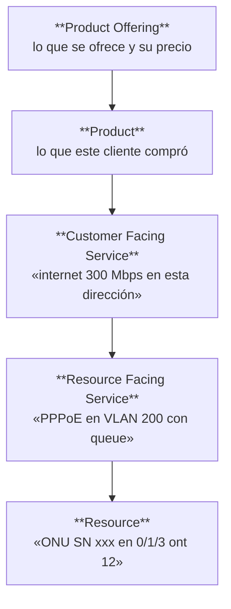

# ADR-030 — Referencia externa por tipo de módulo

**Estado:** **Aceptada** — 2026-08-06, Datafast (decisión D4, PLAN-001 §5)
**Decide:** Datafast · **Relacionado:** ADR-029 · POL-001 PD-11 · DOM-001 · AEM-001 · RDM-001

> **Cambio de encuadre respecto al borrador.** La primera versión preguntaba *"¿adoptamos TM
> Forum?"*. Respondía media pregunta: TM Forum cubre el plano de negocio ISP y **no aporta nada**
> a los ~24.100 LOC de commodity (facturación, pagos, auth, usuarios, auditoría), que son el mayor
> bloque hecho desde cero. La pregunta correcta era **cuál es la referencia por tipo de módulo**.

---

## 1. Problema

**¿Es necesario que cada módulo se haga desde cero?**

Medido sobre el código:

| Naturaleza | LOC backend | ¿Desde 0? |
|---|---|---|
| **Estratégico** (olt-nativo, mikrotik, openvpn, outbox-red, monitoreo, planta-externa…) | **~45.500** | **Sí.** Nadie vende esto |
| **Maduro** (facturacion, pagos, finanzas-opex, proyectos-inversion, tickets) | **~13.100** | **No** |
| **Transversal** (auth, usuarios, licencia, auditoria, config, sistema, workers…) | **~11.000** | **No** |
| Integración | ~9.200 | Puerto + adaptador |
| Soporte | ~17.000 | Según necesidad |

**Una cuarta parte del backend reimplementa problemas resueltos.** Pero sin referencia declarada,
el valor por defecto es siempre "desde cero".

---

## 2. Contexto

### 2.1 Advertencia sobre las fuentes

Este ADR usa los marcos **a nivel conceptual**, que es donde está el valor. **Nombres, versiones y
numeración concreta (p. ej. las Open APIs de TM Forum) deben verificarse contra el catálogo
publicado antes de citarlos en un documento normativo.** No se han consultado las
especificaciones al redactar esto.

### 2.2 El hallazgo que reordena la pregunta

> **El ERP ya conforma con estándares internacionales — precisamente en el plano que construyó
> desde cero.**

| Estándar | Organismo | Dónde se usa |
|---|---|---|
| **TR-069 (CWMP)** | Broadband Forum | Todo el carril de gestión, GenieACS, `ztp/` |
| **G.984 / GPON** | ITU-T | OLT, ONU, service-ports, ONU-ID |
| **G.988 / OMCI** | ITU-T | Canal `omci_management_server` |
| SNMP · RADIUS · PPPoE | IETF | Monitoreo y autenticación |

**Ninguno está declarado en ningún documento.** Y la desalineación está en el plano **genérico**,
no en el especializado — al revés de lo esperable, por una razón comprensible: **el hardware
obligaba a seguir la norma; el plano de negocio no.**

### 2.3 El caso TM Forum: qué aporta y qué no

**SID** (modelo de información) separa lo que el cliente compra de lo que el sistema entrega y de
lo que lo hace físicamente:

**En Datafast las tres capas están colapsadas en `contratos`.** Verificado: la tabla contiene a la
vez lo comercial (`plan_id`, precios, ciclo), el servicio (`tipo_servicio`, `tipo_auth`) y **el
recurso físico (`onu_id`, con índice único, más `ip_asignada`, `usuario_pppoe`, `router_id`)**.

#### Qué explica el colapso — y qué NO explica

**Afirmación honesta, rebajada respecto al borrador:**

| Síntoma | ¿Lo causa el colapso? |
|---|---|
| **Cambio de ONU no existe** | **No técnicamente.** `uq_contratos_empresa_onu` es `(empresa_id, onu_id) WHERE onu_id IS NOT NULL`: un `UPDATE` de A a B no colisiona. Lo que falta es que **nadie lo modeló** — transición, saga, migración de config. **Lo que el colapso sí explica es por qué no se echó en falta**: si la ONU es un atributo del contrato, sustituirla no parece una operación de primera clase |
| **Cambio de plan sin transaccionalidad** | **No.** Su problema es falta de outbox y saga. Con capas separadas seguiría haciendo falta el mecanismo transaccional |
| Migrar WISP↔FTTH · varios servicios en una dirección | **Sí.** No están modelados, y el colapso es la razón |

**Lo que queda demostrado:** el modelo de referencia habría hecho **visibles** dos operaciones que
aquí no se echaron en falta hasta la auditoría. Es un argumento de diseño, no de bug.

### 2.4 Lo que TM Forum no cubre

Diseñado para operadores grandes con sistemas de varios fabricantes. SID es enorme. Las Open APIs
son para integrar productos distintos — aquí hay un monolito. **Y no aporta nada al plano
financiero-contable ni al transversal**, que son 24.100 de los LOC en cuestión.

---

## 3. Alternativas

| # | Alternativa | Por qué se descarta |
|---|---|---|
| A | No adoptar referencia | Sigue el "desde cero" por defecto |
| B | Adoptar SID como modelo del ERP | Re-modelar el agregado raíz con 3 desviaciones críticas abiertas contradice CON-001 §8.11.3 |
| C | Adoptar TM Forum como marco único | Responde media pregunta: no cubre financiero ni transversal |
| **D** | **Una referencia por tipo de módulo** | **Elegida** |

---

## 4. Decisión

**Se adopta una referencia declarada por tipo de módulo.** No se adopta ningún marco entero.

| Tipo (POL-001 PD-11) | Referencia | Qué se adopta | Estado hoy |
|---|---|---|---|
| **Red / OSS** | **Broadband Forum (TR-069/TR-369) · ITU-T (G.984, G.988)** | Protocolos y modelo de gestión | **Ya conforme — solo falta declararlo** |
| **Negocio ISP** (producto, servicio, orden, inventario) | **TM Forum SID / eTOM** | **Modelo conceptual**: separación Product/Service/Resource, vocabulario, mapa de procesos FAB | Sin declarar |
| **Financiero / contable** | **Modelos contables estándar + normativa SUNAT** | Modelo de datos y reglas. **PD-12 aplica: el marco se define antes del diseño** | Sin declarar |
| **Soporte / tickets** | **ITIL** | Ciclo de vida de incidente y petición | Sin declarar |
| **Identidad / permisos** | **RBAC/ABAC · OWASP ASVS** | Modelo de autorización y verificación | Parcial |
| **Plataforma / operación** | **ITIL · ISO/IEC 27001 (selectivo)** | Procedimientos, no certificación | Parcial |

### 4.1 Las tres reglas que hacen operativa esta tabla

| # | Regla |
|---|---|
| 1 | **Consultar la referencia es obligatorio al diseñar un módulo Maduro** (POL-001 PD-11), y queda registrado en su ADR de benchmark |
| 2 | **Adoptar el modelo no es adoptar el código**, y **ningún invariante propio se elimina sin ADR** (PD-11, guards 1 y 2) |
| 3 | **Ningún documento declara conformidad con una norma hasta haber hecho su gap analysis.** Escribir *"conforme a ISO 25010"* sin comprobarlo es la misma afirmación sin verificar que este registro existe para impedir |

### 4.2 Lo que NO se adopta

- **SID como modelo de datos del ERP.** Solo su vocabulario y su separación de capas, como criterio de diseño.
- **Open APIs de TM Forum.** Pensadas para integrar productos de fabricantes distintos.
- **Certificación de ninguna norma** (ADR-029, D3).
- **Re-modelar `contratos`.** Si algún día se hace, va en su propio ADR con su propia justificación.

---

## 5. Consecuencias

**Positivas:** ningún módulo empieza sin referencia; el vocabulario deja de inventarse; los huecos
del modelo (Party, Product Offering como catálogo) quedan visibles antes de costar caro; se
declara la conformidad que ya existe, que es gratis.

**Negativas:** riesgo de que la tabla sea decorativa. **Mitigación:** PD-11 la hace obligatoria en
el ADR de benchmark, y GUI-001 §8.1 la incorpora al checklist de módulo nuevo.

**Condiciona:** ADR-022 (cambio de ONU) · H2-1 SUNAT (aplica PD-12: marco antes del diseño) ·
H2-4 inventario · DOM-001 (registrar el colapso de capas como deuda de modelo conocida).

---

## 6. Estado

**Aceptada — 2026-08-06.**

| Pendiente | Dónde |
|---|---|
| Registrar el colapso Product/Service/Resource como deuda de modelo conocida | DOM-001 |
| Declarar la conformidad ya existente con Broadband Forum e ITU-T | ARS-001 · INT-001 |
| Verificar nombres y versiones contra los catálogos oficiales antes de citarlos como norma | Antes de cualquier gap analysis |
