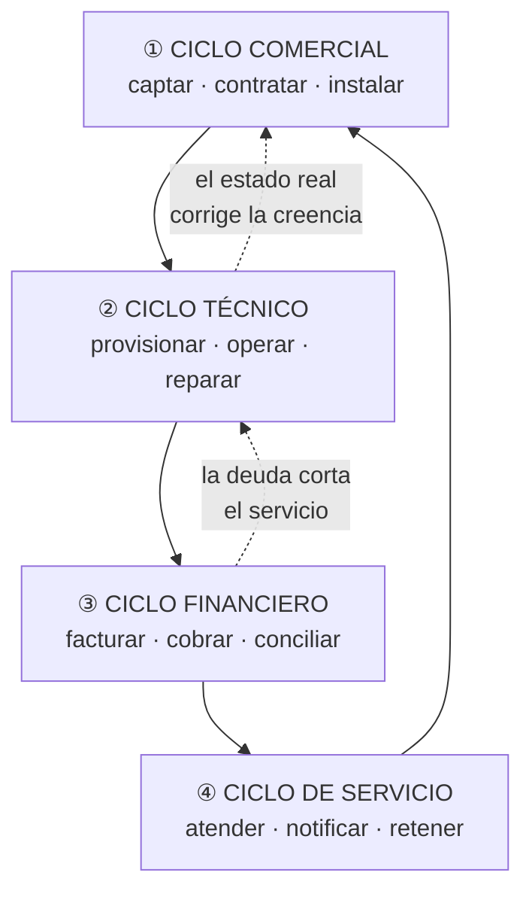
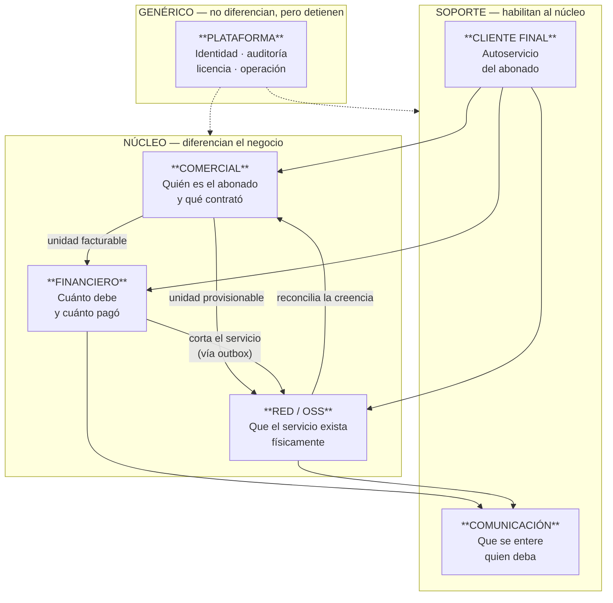
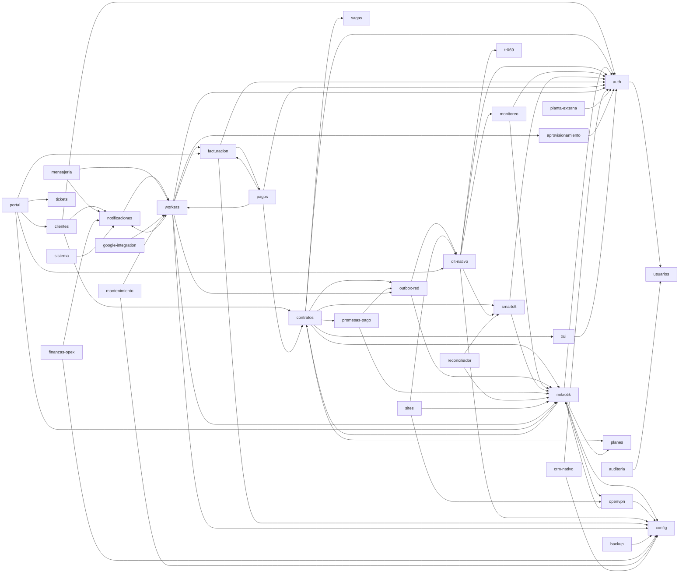
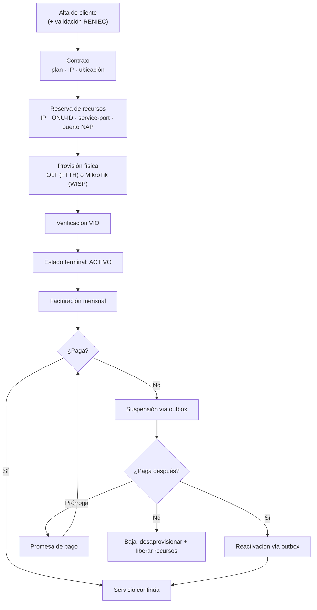

# AEM-001 — Arquitectura Empresarial

---

## 2. Control documental

| Campo | Valor |
|---|---|
| **Código** | AEM-001 |
| **Versión** | 1.0 |
| **Estado** | Vigente |
| **Autor** | Arquitectura |
| **Revisores** | Pendientes de asignar |
| **Fecha** | 2026-08-06 |
| **Documento superior** | CON-001, POL-001 |
| **Base** | Rama `main`, commit `f8d52b00` |

## 3. Historial de cambios

| Versión | Fecha | Cambio | Motivo |
|---|---|---|---|
| 1.0 | 2026-08-06 | Emisión inicial | Los dominios existían de hecho pero no estaban declarados; ningún documento decía qué componente es responsable de qué |

## 4. Índice

1. Objetivo · 2. Alcance · 3. Visión de Negocio · 4. Capacidades del Negocio · 5. Dominios ·
6. Módulos · 7. Relaciones entre módulos · 8. Flujos de negocio · 9. Dependencias ·
10. Reglas arquitectónicas

## 5. Objetivo

Declarar qué hace el ERP Datafast en términos de negocio, cómo se organiza ese negocio en
dominios y capacidades, y qué componente de software es responsable de cada uno — de modo que
pueda responderse **sin abrir el código** la pregunta "¿dónde vive esta regla?".

## 6. Alcance

Cubre los dominios de negocio **implementados** en el commit base. **No incluye** dominios
planificados ni funcionalidades ausentes, que se registran en §12 (Anexo B) y en RDM-001.

## 7. Definiciones y glosario

| Término | Definición |
|---|---|
| **Capacidad de negocio** | Algo que el ISP sabe hacer, independiente de cómo lo implemente |
| **Dominio** | Agrupación de capacidades con lenguaje y reglas propias |
| **Módulo** | Unidad de software (`@Module` de NestJS) que implementa parte de un dominio |
| **Agregado raíz** | Entidad que gobierna la consistencia de un grupo de datos |
| **Plano de intención** | Mecanismo que persiste "esto debe ocurrir" antes de ejecutarlo |
| **OSS** | *Operations Support System* — el plano de operación de red |
| **BSS** | *Business Support System* — el plano comercial y financiero |

---

# 8. Contenido

## 8.1 Visión de Negocio

ERP Datafast atiende a un **ISP regional** que opera dos tecnologías de acceso simultáneamente:

| Tecnología | Medio | Equipamiento | Estado en el ERP |
|---|---|---|---|
| **FTTH / GPON** | Fibra óptica | OLT Huawei MA5800, V-SOL · ONU/ONT · NAP, mufas, splitters | Garantías completas: outbox, máquina de estados, saga, VIO |
| **WISP** | Radioenlace | MikroTik RouterOS · antenas · nodos | Garantías parciales |

El negocio del ISP consiste en **cuatro ciclos que deben permanecer sincronizados**:

**La tesis del sistema:** los cuatro ciclos son fáciles por separado y difíciles juntos. Un ERP
administrativo resuelve ① ③ ④. Un sistema de gestión de red resuelve ②. **El valor de Datafast
está en las dos flechas punteadas**: que la deuda corte el servicio físico de verdad, y que el
estado físico corrija lo que el sistema cree.

## 8.2 Capacidades del Negocio

Mapa de capacidades por nivel. La columna **Estado** distingue capacidad implementada de
capacidad ausente.

### Nivel 1 — Capacidades estratégicas

| Capacidad | Estado | Módulos que la realizan |
|---|---|---|
| Gestionar la cartera de abonados | ✅ Completa | `clientes`, `contratos` |
| Monetizar el servicio | ✅ Completa | `facturacion`, `pagos` |
| Operar la planta de red | ✅ Completa | `olt-nativo`, `mikrotik`, `openvpn`, `planta-externa` |
| Sostener la relación con el abonado | ⚠️ Parcial | `notificaciones`, `crm-nativo`, `portal`, `tickets` |
| Gobernar la plataforma | ✅ Completa | `auth`, `usuarios`, `licencia`, `auditoria`, `sistema` |

### Nivel 2 — Capacidades operativas

| # | Capacidad | Estado | Responsable |
|---|---|---|---|
| C-01 | Registrar y validar la identidad del abonado | ✅ | `clientes` + RENIEC |
| C-02 | Contratar un servicio con plan, IP y ubicación | ✅ | `contratos` |
| C-03 | Asignar recursos de red (IP, ONU-ID, service-port, puerto NAP) | ✅ | `contratos`, `olt-nativo`, `planta-externa` |
| C-04 | Provisionar acceso FTTH | ✅ | `olt-nativo` + servicio Python |
| C-05 | Provisionar acceso WISP | ⚠️ Sin garantías equivalentes | `mikrotik` |
| C-06 | Gestionar remotamente el CPE del abonado | ✅ | `olt-nativo/ztp` + GenieACS |
| C-07 | Documentar la planta externa (fibra, mufas, NAPs) | ⚠️ Fase 1 de 3 | `planta-externa` |
| C-08 | Emitir comprobantes | ✅ | `facturacion` |
| C-09 | **Emitir comprobantes electrónicos ante SUNAT** | ❌ **No implementada** | — |
| C-10 | Registrar cobros | ✅ | `pagos` |
| C-11 | Cobrar en línea | ⚠️ Solo Mercado Pago | `pagos` |
| C-12 | Cerrar caja y arquear | ✅ | `pagos` |
| C-13 | Suspender por deuda | ✅ | `workers` + `outbox-red` |
| C-14 | Reactivar por pago | ✅ | `workers` + `outbox-red` |
| C-15 | Conceder prórroga | ✅ | `promesas-pago` |
| C-16 | Cambiar plan / velocidad | ⚠️ Sin transaccionalidad | `contratos`, `mikrotik`, `olt-nativo` |
| C-17 | Dar de baja el servicio | ✅ | `olt-nativo`, `contratos` |
| C-18 | **Sustituir la ONU de un abonado** | ❌ **No implementada** | — |
| C-19 | Monitorear la planta | ✅ | `monitoreo` + servicio Python |
| C-20 | Detectar y corregir divergencia BD↔red | ✅ | `reconciliador`, watchers |
| C-21 | Notificar al abonado | ⚠️ Sin canal SMS | `notificaciones`, `mensajeria` |
| C-22 | Atender conversaciones | ✅ | `crm-nativo` |
| C-23 | Gestionar soporte | ✅ | `tickets` |
| C-24 | Ofrecer autoservicio al abonado | ✅ | `portal` |
| C-25 | Vender IPTV | ✅ | `xui` |
| C-26 | Controlar gastos e inversiones | ✅ | `finanzas-opex`, `proyectos-inversion` |
| C-27 | **Controlar inventario y almacén** | ❌ **No implementada** | — |
| C-28 | Reportar y exportar | ✅ | `reportes`, `dashboard` |
| C-29 | Auditar y revertir cambios | ✅ | `auditoria` |
| C-30 | Respaldar y actualizar la plataforma | ✅ | `backup`, `sistema` |

**Resumen:** 24 capacidades completas · 5 parciales · **3 ausentes** (facturación electrónica,
sustitución de ONU, inventario).

## 8.3 Dominios

### Mapa de dominios

### Fichas de dominio

#### D1 · COMERCIAL

| Aspecto | Detalle |
|---|---|
| **Responsabilidad** | Quién es el abonado, qué contrató, dónde está instalado |
| **Agregado raíz** | `contrato` |
| **Módulos** | `clientes`, `contratos`, `planes`, `zonas`, `sites` |
| **Lenguaje propio** | cliente, contrato, plan, zona, segmento IPv4, acometida |
| **Invariantes** | Numeración correlativa por empresa · una ONU por contrato · la IP sale de un segmento con contador mantenido por la base |
| **Criticidad** | Máxima (Core Indestructible) |

#### D2 · FINANCIERO

| Aspecto | Detalle |
|---|---|
| **Responsabilidad** | Cuánto debe el abonado, cuánto pagó, estado de su cuenta |
| **Agregados raíz** | `factura`, `pago` |
| **Módulos** | `facturacion`, `pagos`, `promesas-pago`, `finanzas-opex`, `proyectos-inversion` |
| **Lenguaje propio** | factura, saldo, aplicación, extorno, adelanto, arqueo, promesa, ciclo de cobro |
| **Invariantes** | Un solo escritor del saldo · un solo registrador de pagos · el extorno es la única reversión · una sola fórmula del ciclo de cobro |
| **Frontera declarada** | Las pasarelas están bloqueadas por una puerta de estabilidad (POL-001 §5.3) |
| **Criticidad** | Máxima |

#### D3 · RED / OSS

| Aspecto | Detalle |
|---|---|
| **Responsabilidad** | Que el servicio contratado exista físicamente y en el estado que el negocio afirma |
| **Agregados raíz** | `olt_dispositivo`, `ftth_onu_registro`, `router`, `vpn_cliente`, `pe_nap` |
| **Módulos** | `olt-nativo`, `mikrotik`, `openvpn`, `outbox-red`, `monitoreo`, `planta-externa`, `smartolt`, `tr069`, `reconciliador`, `sites` |
| **Lenguaje propio** | ONU, ONT, SN, PON, service-port, ONU-ID, carril de gestión, drift, huérfana, VIO, materialización |
| **Invariante fundacional** | Nunca un `ont` en la OLT sin `ftth_onu_registro`, ni al revés |
| **Regla de verdad** | El hardware es la verdad; la BD es una creencia |
| **Criticidad** | Máxima · complejidad máxima |

#### D4 · COMUNICACIÓN

| Aspecto | Detalle |
|---|---|
| **Responsabilidad** | Que el abonado y el operador se enteren de lo que ocurre |
| **Módulos** | `notificaciones`, `mensajeria`, `crm-nativo`, `plantillas`, `webhooks` |
| **Arquitectura** | Dirigida por eventos: evento → listener → cola con prioridad → estrategia de envío |
| **Canales** | WhatsApp nativo · mensajería masiva · SMTP. **Sin SMS** |
| **Invariante** | Una notificación no se envía dos veces (índice UNIQUE de idempotencia) |
| **Criticidad** | Alta — los avisos de corte y las alertas de red van por aquí |

#### D5 · CLIENTE FINAL

| Aspecto | Detalle |
|---|---|
| **Responsabilidad** | Autoservicio del abonado |
| **Módulos** | `portal`, `tickets`, `xui` |
| **Arquitectura** | Fachada sobre Comercial/Financiero/Red, con identidad **completamente independiente** |
| **Invariante** | Un token de portal no accede a otro tenant (verificado por test) |
| **Criticidad** | Alta — superficie pública que alcanza hardware |

#### D6 · PLATAFORMA

| Aspecto | Detalle |
|---|---|
| **Responsabilidad** | Identidad, permisos, licencia, auditoría, respaldo, operación |
| **Módulos** | `auth`, `usuarios`, `licencia`, `auditoria`, `sistema`, `backup`, `health`, `install`, `workers`, `sagas`, `mantenimiento`, `schema-guard`, `config` |
| **Particularidad** | `licencia` es el único componente que puede apagar el ERP entero, **por diseño** |
| **Criticidad** | Máxima |

## 8.4 Módulos

44 módulos implementados. Ficha resumida; la ficha completa de cada uno está en MOD-XXX.

| Dominio | Módulo | Responsabilidad en una línea | LOC | Criticidad |
|---|---|---|---|---|
| Comercial | `clientes` | Maestro de abonados, onboarding, RENIEC | 2.705 | Máxima |
| Comercial | `contratos` | Contrato de servicio y pools IPv4 | 3.894 | Máxima |
| Comercial | `planes` | Catálogo de planes | 287 | Máxima |
| Comercial | `zonas` | Agrupación geográfica comercial | 119 | Media |
| Comercial | `sites` | Nodos y emplazamientos físicos | 316 | Media |
| Financiero | `facturacion` | Emisión, ciclo de cobro, PDF | 5.477 | Máxima |
| Financiero | `pagos` | Registro del dinero, caja, arqueo, extorno | 5.836 | Máxima |
| Financiero | `promesas-pago` | Prórrogas | 1.067 | Alta |
| Financiero | `finanzas-opex` | Gastos operativos | 548 | Media |
| Financiero | `proyectos-inversion` | CAPEX y ratios | 497 | Baja |
| Red | `olt-nativo` | Ciclo de vida FTTH completo | 25.659 | Máxima |
| Red | `mikrotik` | Provisión y control RouterOS | 8.801 | Máxima |
| Red | `openvpn` | Canal de gestión hacia la planta | 2.473 | Máxima |
| Red | `outbox-red` | Frontera transaccional negocio↔red | 1.060 | Máxima |
| Red | `monitoreo` | Vigilancia ICMP/SNMP | 2.231 | Alta |
| Red | `planta-externa` | Fibra, mufas, splitters, NAPs | 4.671 | Media |
| Red | `smartolt` | Proveedor OLT alternativo | 2.608 | Media |
| Red | `tr069` | Modelo de dispositivo ACS | 318 | Alta |
| Red | `reconciliador` | Reconciliación periódica BD↔red | 280 | Alta |
| Comunicación | `notificaciones` | Motor de notificación por eventos | 1.865 | Alta |
| Comunicación | `mensajeria` | Campañas masivas con goteo | 628 | Media |
| Comunicación | `crm-nativo` | Bandeja WhatsApp | 2.484 | Baja |
| Comunicación | `plantillas` | Plantillas de mensaje y abonado | 586 | Media |
| Comunicación | `webhooks` | Recepción de webhooks | 151 | Media |
| Cliente final | `portal` | Portal del abonado | 4.546 | Alta |
| Cliente final | `tickets` | Soporte y órdenes de trabajo | 737 | Media |
| Cliente final | `xui` | IPTV | 1.404 | Baja |
| Plataforma | `auth` | Autenticación de operadores | 1.400 | Máxima |
| Plataforma | `usuarios` | Usuarios, roles, permisos | 921 | Máxima |
| Plataforma | `licencia` | Licenciamiento y bloqueo global | 700 | Máxima |
| Plataforma | `auditoria` | Trazabilidad, versiones, undo/redo | 792 | Alta |
| Plataforma | `sistema` | Centro de operaciones | 1.512 | Alta |
| Plataforma | `backup` | Respaldos | 560 | Alta |
| Plataforma | `workers` | Motor de cobranza y facturación | 2.805 | Máxima |
| Plataforma | `config` | Configuración de empresa, dominios, SSL | 1.281 | Alta |
| Plataforma | `sagas` | Bitácora de sagas | 195 | Alta |
| Plataforma | `mantenimiento` | Pausa coordinada de colas | 202 | Media |
| Plataforma | `schema-guard` | Verificación de esquema al arrancar | 33 | Alta |
| Plataforma | `health` | Salud y estado de módulos | 240 | Alta |
| Plataforma | `install` | Instalador web | 373 | Media |
| Plataforma | `reportes` | Reportes y exportación | 419 | Media |
| Plataforma | `dashboard` | Métricas de inicio | 126 | Media |
| Plataforma | `google-integration` | Google Workspace | 1.955 | Baja |
| Plataforma | `aprovisionamiento` | Notificación de aprovisionamiento | 327 | Media |
| — | `migracion` | **Directorio vacío** | 0 | — |

## 8.5 Relaciones entre módulos

Grafo de dependencias declaradas (`imports` de cada `@Module`):

### Nodos por grado

| Módulo | Depende de | Es usado por | Lectura |
|---|---|---|---|
| `auth` | 1 | **11** | Hub transversal legítimo |
| `config` | 0 | 8 | Hub transversal legítimo |
| `mikrotik` | 5 | **10** | **Hub de dominio — máximo riesgo de cambio** |
| `contratos` | **8** | 3 | **Agregado raíz — máximo impacto aguas abajo** |
| `workers` | 7 | 5 | Hub por constantes, no por servicio |
| `portal` | 5 | 0 | Fachada, hoja del grafo |

## 8.6 Flujos de negocio

Los ocho flujos implementados, con su nivel de garantía. El detalle completo está en el capítulo
7 de `docs/archivo/consolidacion/`.

| # | Flujo | Outbox | Máq. estados | Saga | VIO | Garantía |
|---|---|---|---|---|---|---|
| F-01 | Alta de abonado + provisión FTTH | Parcial | ✅ | ✅ | ✅ | **Completa** |
| F-02 | Facturación mensual | — | — | — | — | Transaccional (BD) |
| F-03 | Suspensión por deuda | ✅ | ✅ | — | ✅ | **Alta** |
| F-04 | Registro de pago y reactivación | ✅ | ✅ | — | ✅ | **Alta** |
| F-05 | Prórroga / promesa de pago | ✅ | — | — | ✅ | Media |
| F-06 | Baja / desaprovisionamiento | Parcial | ✅ | ✅ | ✅ | **Completa** |
| F-07 | Cambio de plan / velocidad | ❌ | ❌ | ❌ | Parcial | **Baja** |
| F-08 | Alta WISP (solo MikroTik) | Parcial | ❌ | ❌ | ❌ | **Baja** |
| F-09 | **Cambio de ONU** | — | — | — | — | **No existe el flujo** |

### Flujo maestro: de la venta al servicio activo

## 8.7 Dependencias

### Ciclos de dependencia

| # | Ciclo | Naturaleza | Acción |
|---|---|---|---|
| 1 | `mikrotik ↔ openvpn` | **Esencial** — el router es objeto gestionado y extremo del canal | Se gestiona, no se elimina |
| 2 | `facturacion ↔ pagos` | **Esencial** — ciclo natural de cuenta corriente | Se gestiona, no se elimina |
| 3 | `contratos ↔ mikrotik` | **Accidental** — dependencia de lectura | Desacoplable con interfaz de consulta |
| 4 | `notificaciones ↔ workers` | **Artificial** — solo por constantes | Desacoplable moviendo constantes |

### Dependencias externas al repositorio

| Dependencia | Dónde vive | Riesgo |
|---|---|---|
| Credenciales de connreq de GenieACS | Provision del ACS + `.env` del VPS | Deben coincidir; nada lo verifica |
| CCD y certificados OpenVPN | Filesystem del VPS | El ERP los escribe; no versionados |
| `mikrotik.conf` (rutas 10.0.0.0/8) | VPS | Se confundieron con rutas huérfanas |
| Crontab del sistema | VPS, editable desde la UI | Fuera de control de versiones |

## 8.8 Reglas arquitectónicas del nivel empresarial

| # | Regla | Justificación |
|---|---|---|
| **RA-1** | El plano de negocio **nunca** llama al plano físico directamente en una operación de negocio: escribe su intención en el outbox | Sin ella, un fallo de red aborta una operación comercial ya cobrada |
| **RA-2** | Un dominio del núcleo **no depende** de un dominio de soporte | `contratos` no puede depender de `crm-nativo` |
| **RA-3** | El dominio Cliente Final es **fachada**: lee y ejecuta acciones acotadas, nunca define reglas propias de negocio | El portal no puede decidir cuánto debe alguien |
| **RA-4** | El agregado raíz del sistema es **`contrato`**. Toda operación de red o dinero se refiere a un contrato | Es lo que permite atribuir un recurso físico a un cobro |
| **RA-5** | Un módulo del Core Indestructible **nunca** implementa el patrón degradable | Un núcleo a medias es peor que un backend caído |
| **RA-6** | Todo módulo que dependa de hardware o de un tercero **nace degradable** | Un proveedor caído no puede impedir arrancar |
| **RA-7** | Una capacidad **ausente no se simula**: se declara ausente | Evita que el operador crea que existe (ej. facturación electrónica) |
| **RA-8** | Toda operación rutinaria del negocio se **modela explícitamente**; componerla con operaciones destructivas no es modelarla | Origen: el cambio de ONU se improvisa como baja + alta |

---

# 9. Referencias

- CON-001 — Constitución
- POL-001 — Políticas Corporativas
- ARS-001 — Arquitectura de Software
- DOM-001 — Modelo de Dominio
- `docs/archivo/auditoria/` capítulos 2 y 4 — inventario y dependencias medidas
- `docs/archivo/consolidacion/` capítulos 5, 7 y 8 — dominios, flujos y acoplamiento

---

# 10. Anexos

## Anexo A — Matriz capacidad × módulo (extracto de las críticas)

| Capacidad | Módulo primario | Módulos de apoyo |
|---|---|---|
| C-04 Provisionar FTTH | `olt-nativo` | servicio Python, `outbox-red`, `planta-externa` |
| C-13 Suspender por deuda | `workers` | `outbox-red`, `mikrotik`, `olt-nativo`, `notificaciones` |
| C-14 Reactivar por pago | `pagos` → `workers` | `outbox-red`, `mikrotik`, `olt-nativo` |
| C-20 Detectar divergencia | `reconciliador` | `olt-nativo` (watchers), `mikrotik` (drift) |

## Anexo B — Capacidades declaradas y no implementadas

| Capacidad | Evidencia de ausencia | Consecuencia |
|---|---|---|
| **Facturación electrónica / SUNAT** | Existe la página `configuracion/facturacion-electronica`; **no hay cliente SUNAT, ni OSE, ni firma XML, ni CDR** | Un operador puede creer que el ERP emite comprobantes electrónicos |
| **Sustitución de ONU** | Sin endpoint, servicio ni transición | Se improvisa como baja + alta: corte innecesario, pérdida de la clave WiFi del abonado, ventana de huérfano |
| **Inventario / almacén** | Existe la página `inventario`; no hay stock ni descuento de materiales | Sin control de materiales instalados |
| **Canal SMS** | Sin proveedor en el gateway | Los avisos de corte dependen exclusivamente de WhatsApp |
| **ChatBot** | No existe | `crm-nativo` es conversación humana |
| **Módulo GIS** | Existe la capacidad (coordenadas, mapa, geocoding), no el módulo | — |

## Anexo C — Dominios en pausa deliberada

| Elemento | Estado | Motivo declarado |
|---|---|---|
| Pasarelas de pago adicionales | Contrato definido, adaptadores ausentes | Puerta de estabilidad de 30 días (POL-001 §5.3) |
| Planta Externa fases 2 y 3 | En pausa | Decisión de diseño del propietario |
| Migración MikroWISP | No iniciada | Requiere diseño previo; condicionada por la advertencia de migración de ONUs |
