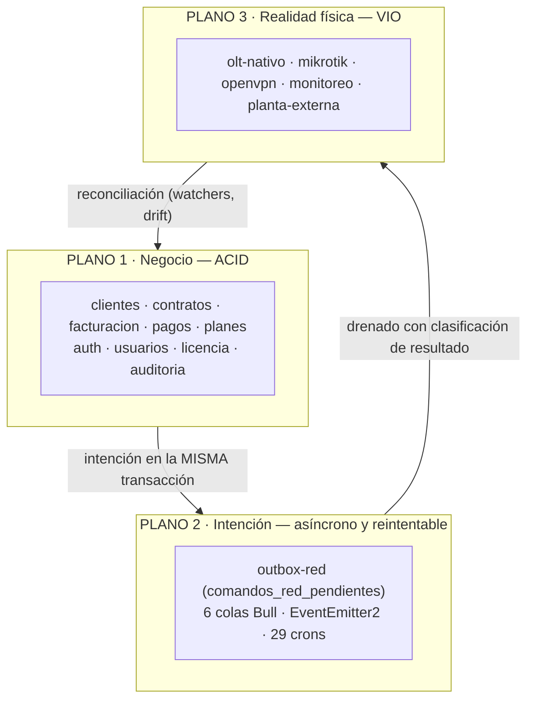
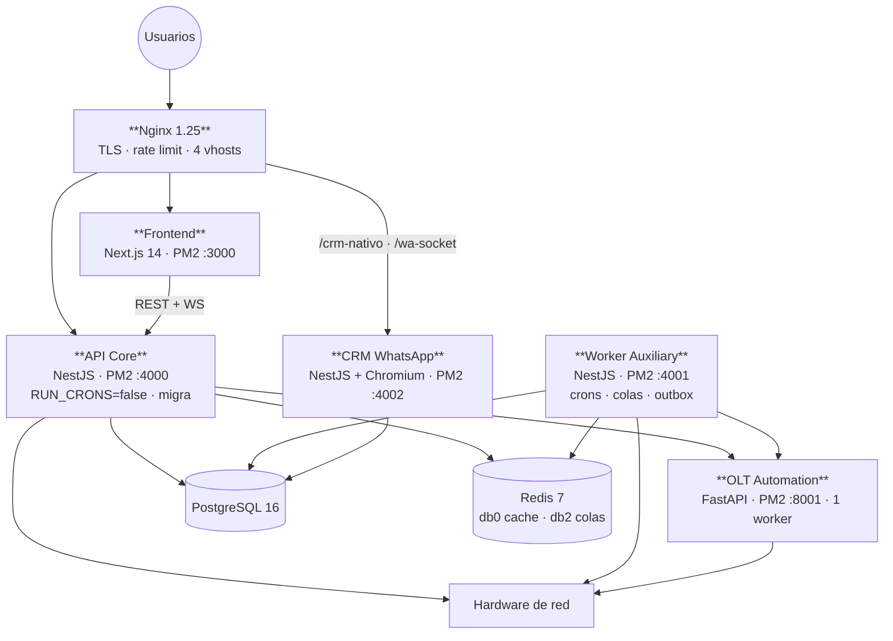
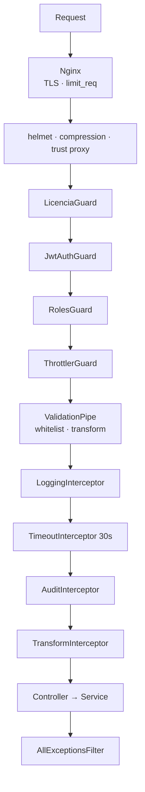
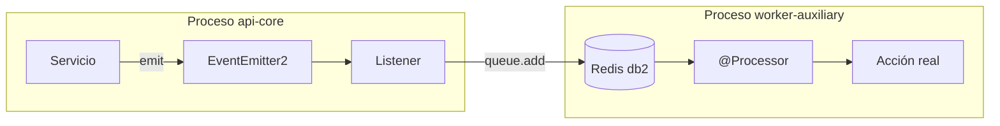
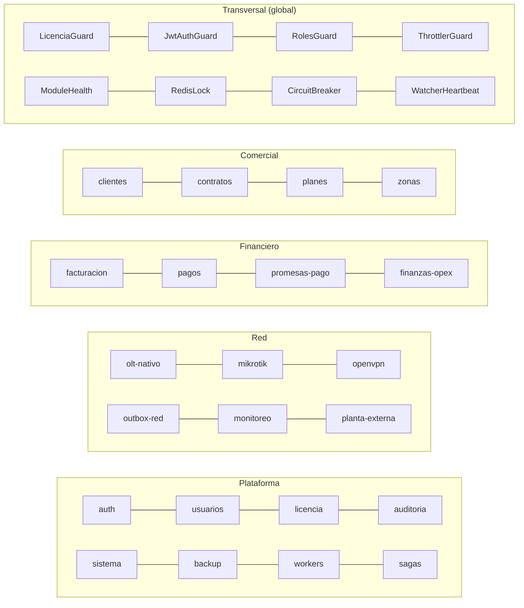

# ARS-001 — Arquitectura de Software

---

## 2. Control documental

| Campo | Valor |
|---|---|
| **Código** | ARS-001 · **Versión** 1.0 · **Estado** Vigente |
| **Autor** | Arquitectura · **Revisores** Pendientes de asignar |
| **Fecha** | 2026-08-06 · **Documento superior** CON-001, POL-001, AEM-001 |
| **Base** | Rama `main`, commit `f8d52b00` |

## 3. Historial de cambios

| Versión | Fecha | Cambio | Motivo |
|---|---|---|---|
| 1.0 | 2026-08-06 | Emisión inicial | La arquitectura técnica solo existía en el código y en comentarios |

## 4. Índice

1. Arquitectura General · 2. Frontend · 3. Backend · 4. Core · 5. Servicios Compartidos ·
6. Eventos · 7. Integraciones · 8. Persistencia · 9. Infraestructura · 10. Observabilidad ·
11. Escalabilidad · 12. Seguridad

## 5. Objetivo

Definir la arquitectura técnica del ERP Datafast: qué estilo sigue, cómo se compone, cómo se
comunican sus partes y qué garantías aporta cada capa.

## 6. Alcance

Backend NestJS, frontend Next.js, servicio Python de automatización de red, persistencia,
infraestructura y observabilidad. **No cubre** el modelo de negocio (AEM-001) ni el modelo de
datos detallado (DAT-001).

## 7. Definiciones y glosario

| Término | Definición |
|---|---|
| **Monolito modular** | Un artefacto desplegable con fronteras internas explícitas |
| **Despliegue segmentado por rol** | El mismo binario ejecutándose como varios procesos diferenciados por configuración |
| **Satélite de protocolo** | Servicio separado por incompatibilidad de ecosistema técnico, no por dominio |
| **Outbox** | Tabla donde se persiste la intención de una operación externa dentro de la transacción de negocio |
| **Puerto / Adaptador** | Interfaz que define un contrato y sus implementaciones concretas |
| **Degradado** | Módulo que arranca sin su recurso externo y lo declara |
| **VIO** | Verificación independiente de que una mutación se materializó |

---

# 8. Contenido

## 8.1 Arquitectura General

### 8.1.1 Estilo arquitectónico

> **Monolito modular de despliegue segmentado por rol, con satélite de protocolo y plano de red
> gobernado por outbox transaccional.**

| Componente del estilo | Implementación |
|---|---|
| Monolito modular | Un `dist/main.js`, 44 módulos NestJS |
| Segmentado por rol | 3 procesos PM2 del mismo binario, diferenciados por `RUN_CRONS`, `RUN_MIGRATIONS`, `WA_ENABLED` |
| Satélite de protocolo | `olt-automation-service` (FastAPI) — existe porque netmiko/paramiko son Python |
| Outbox | `comandos_red_pendientes` drenada por cron con reclamo atómico |

**Lo que NO es:** no es microservicios (hay un único servicio satélite, y por razón técnica),
no es serverless, no es event-sourced (`entity_versions` y `saga_log` son bitácoras, no un event
store), y no hay broker de mensajes.

### 8.1.2 Los tres planos



| Plano | Garantía | Fuente de verdad | Modo de fallo |
|---|---|---|---|
| Negocio | ACID | La base de datos | Violación de invariante |
| Intención | Entrega eventual con reintentos acotados | "Esto debe ocurrir" | Comando agotado, claim huérfano |
| Realidad física | Consistencia eventual verificada | **El hardware** | Discordancia físico↔lógico |

### 8.1.3 Vista de contenedores (C4 nivel 2)



### 8.1.4 Topología de procesos

| Proceso | Puerto | `RUN_CRONS` | `RUN_MIGRATIONS` | `WA_ENABLED` | Límite RAM |
|---|---|---|---|---|---|
| `datafast-api-core` | 4000 | false | **true** | false | 1 G |
| `datafast-worker-auxiliary` | 4001 | **true** | false | false | 800 M |
| `datafast-whatsapp` | 4002 | false | false | **true** | 600 M |
| `olt-automation-service` | 8001 | — | — | — | 256 M |
| `datafast-frontend` | 3000 | — | — | — | 512 M |

**Regla:** `ecosystem.config.js` es la fuente de verdad única del arranque. Prohibido
`pm2 start` manual (ver ADR-011).

## 8.2 Frontend

| Aspecto | Valor |
|---|---|
| Framework | Next.js 14 — App Router |
| UI | React + Tailwind CSS |
| Estado global | Zustand — 4 stores (`auth`, `empresa`, `portal`, `theme-customizer`) |
| Acceso a API | `lib/api/` — 27 clientes, uno por dominio del backend |
| Realtime | socket.io-client vía `useOltSocket`, `useMonitoreo` |
| Mapas | MapLibre GL sobre OpenStreetMap |
| Protección de rutas | `middleware.ts` en el edge |
| Páginas | 92 (3 auth · 68 dashboard · 10 portal · install · raíz) |

### Organización

```
src/
├── app/        (auth) · (dashboard) · portal/(privado) · installl
├── components/ por dominio (organización viva) + ui/shared/atoms (reutilizable)
├── hooks/      5 hooks propios
├── lib/api/    27 clientes de API
└── store/      4 stores Zustand
```

### Decisiones vigentes

| # | Decisión |
|---|---|
| 1 | El estado global **no cachea datos de servidor**: solo sesión, empresa y preferencias |
| 2 | La separación ERP↔Portal es **total**: distinto grupo de rutas, store, sesión y vhost |
| 3 | El frontend **no recibe ningún secreto**: sus `NEXT_PUBLIC_*` se hornean en build |
| 4 | El acceso a la API pasa **siempre** por `lib/api/`, nunca por `fetch` directo en un componente |

### Deuda estructural declarada

Tres convenciones de organización simultáneas (`molecules/` vacío); **1,8 %** del código es
reutilizable; componentes de hasta 3.776 LOC; tipos duplicados respecto al backend pese a existir
Swagger; sin librería de formularios ni cache de servidor; 2 tests. Ver RDM-001 § consolidación.

## 8.3 Backend

### 8.3.1 Composición

| Capa | Elementos | Cobertura |
|---|---|---|
| Entrada HTTP | 46 controladores · ~560 endpoints | Uniforme |
| Aspectos transversales | 4 guards + 5 interceptors + 1 pipe + 1 filtro, **globales** | Uniforme |
| Servicios de aplicación | ~160 | Heterogéneo en tamaño |
| **Repositorios** | 6 módulos · 1.614 LOC | **14 %** |
| **Puertos y adaptadores** | 4 puertos · 5 adaptadores TS + 3 drivers Python | Parcial, en los sitios correctos |
| **Dominio explícito** | 2 máquinas de estados · `ResultadoOperacion` · catálogos de capacidad | Solo en Red |
| Entidades | 81 sobre ~120 tablas | **39 tablas sin tipar** |
| SQL crudo | 445 llamadas `.query()` | Muy extendido |

### 8.3.2 Cadena de procesamiento de una petición



### 8.3.3 Estilo por dominio

| Dominio | Estilo | Adecuación |
|---|---|---|
| Comercial / Financiero | Transaction Script sobre TypeORM + repositorio parcial | Correcto — dominio CRUD con invariantes contables |
| **Red / OSS** | **Ports & Adapters + máquina de estados + saga + outbox** | Correcto — consistencia eventual contra hardware |
| Comunicación | Event-driven + Strategy | Correcto |
| Cliente final | Fachada con identidad propia | Correcto |
| Plataforma | Aspectos transversales | Correcto |

**La heterogeneidad es deliberada**: cada dominio usa el estilo que su naturaleza exige. Lo que
POL-001 exige es que la elección sea **consciente y declarada**, no por imitación del vecino.

### 8.3.4 Servicio de automatización de red (Python)

| Aspecto | Valor |
|---|---|
| Framework | FastAPI · uvicorn **`--workers 1`** |
| Exposición | `127.0.0.1:8001` — nunca público |
| Autenticación | API key en middleware |
| Drivers | `huawei.py`, `vsol.py` sobre `base.py` |
| Lógica | `provisioning.py` — 4.792 LOC |
| Transportes | SSH (CLI scraping) · RouterOS API · ICMP raw · SNMP |
| Endpoints | ~40 |

**Restricción arquitectónica dominante:** el MA5800 tiene un límite bajo de sesiones VTY
concurrentes. De ahí el worker único, el pool de sesiones y la prohibición de `--reload`
(ADR-008). **Toda operación OLT del sistema está serializada por este proceso.**

## 8.4 Core

Los componentes cuyo fallo detiene el negocio. **Ninguno implementa el patrón degradable.**

### 8.4.1 Core Indestructible

`auth` · `usuarios` · `licencia` · `clientes` · `contratos` · `planes` · `facturacion` ·
`pagos` · `finanzas-opex` · `reportes` · `zonas` · `plantillas` · `config` · `schema-guard` ·
`auditoria`

**Regla:** si alguno falla en `onModuleInit`, el backend **debe crashear**, para que PM2 mantenga
vivo el proceso anterior.

### 8.4.2 Componentes críticos por impacto

| # | Componente | Daño si falla mal |
|---|---|---|
| 1 | `outbox-red.service.ts` | Comando duplicado corta a un cliente pagado; perdido deja navegando a un moroso |
| 2 | `provision-ftth.service.ts` | ONU huérfana |
| 3 | `politica-facturacion.service.ts` | Corte antes del vencimiento a todo el parque |
| 4 | `aplicador-factura.service.ts` | Dinero aplicado a facturas anuladas |
| 5 | `cobranza.worker.ts` | Corte masivo indebido |
| 6 | `LicenciaGuard` | Bloqueo total del ERP |
| 7 | `connection-pool.service.ts` | Pérdida de gestión de la planta WISP |
| 8 | `openvpn` (CCD + certs) | Sin canal hacia ningún MikroTik |
| 9 | `olt-operation-router.service.ts` | Clasificación errónea → martilleo del MA5800 |
| 10 | `ftth-maquina-estados.ts` | Transición faltante → ONU huérfana |

## 8.5 Servicios Compartidos

### 8.5.1 Globales (inyectables sin importar)

| Servicio | Función | Consumidores |
|---|---|---|
| `ModuleHealthService` | Estado `ok`/`degraded` por módulo | Todos los degradables |
| `WatcherHeartbeatService` | Latido de procesos de fondo | Crons y watchers |
| `RedisLockService` | Locks distribuidos | **Solo `cobranza.worker`** |
| `CircuitBreakerRegistry` | Breakers por equipo/proveedor | `mikrotik`, `olt-nativo`, `monitoreo` |
| `QueuePauseService` | Pausa coordinada de colas | `mantenimiento`, `sistema` |
| `CacheModule` | Cache Redis db=0, TTL 300 s | 14 puntos |
| `EventEmitterModule` | Bus in-process | 25 listeners |

### 8.5.2 Vocabulario de dominio

`common/domain/resultado-operacion.ts` — 6 clases: `aplicado` · `ya_en_destino` · `no_aplica` ·
`rechazado_definitivo` · `reintentable` · `indeterminado`. Ver ADR-003.

### 8.5.3 Utilidades

`encryption` · `ip` · `pagination` · `pg-result` · `telefono` · `errores-proceso` ·
`base.entity` · `response.dto` · decoradores `@CurrentUser` `@Public` `@Roles`

### 8.5.4 Aspectos globales

| Tipo | Componentes |
|---|---|
| Guards | `LicenciaGuard` → `JwtAuthGuard` → `RolesGuard` → `ThrottlerGuard` |
| Interceptors | `Logging` → `Timeout(30 s)` → `Audit` → `Transform` (+ `ClassSerializer`) |
| Pipe | `ValidationPipe` (whitelist, transform, conversión implícita) |
| Filtro | `AllExceptionsFilter` |

**Interacción crítica:** `TimeoutInterceptor(30 s)` es global y las operaciones legítimas de
hardware duran 90–150 s. **Toda operación síncrona nueva contra hardware nace rota.** La solución
arquitectónica es hacerlas asíncronas (outbox), no ampliar el timeout.

## 8.6 Eventos

### 8.6.1 Mecanismo y su límite

`EventEmitter2` con `wildcard: false`, `maxListeners: 30`, `ignoreErrors: false`.

> **El bus es IN-PROCESS.** Un evento emitido en `api-core` **no llega** a `worker-auxiliary`.

Funciona porque los listeners **no hacen trabajo: encolan en Bull**, que sí cruza procesos vía
Redis. En la práctica, **el bus de eventos es un adaptador hacia las colas**.



### 8.6.2 Catálogo

| Categoría | Cantidad | Ejemplos |
|---|---|---|
| Notificación | 16 | `FACTURA_EMITIDA`, `SERVICIO_SUSPENDIDO`, `ROUTER_CAIDO`, `OUTBOX_RED_AGOTADO` |
| Dominio | 7 | `cliente.created`, `contrato.suspended`, `ftth.inventario.reobservar` |
| WebSocket | 3 | `OLT_SYNC_PROGRESS` / `_COMPLETED` / `_ERROR` |

### 8.6.3 Colas Bull (Redis db=2)

| Cola | Concurrencia | Jobs |
|---|---|---|
| `cobranza` | por defecto | detectar-morosos · suspender · reactivar · prórroga · procesar-pago |
| `facturacion` | por defecto | generar-mensual · marcar-vencidas |
| `notificaciones` | **5** | notif-envio |
| `campanas` | **1** (goteo 12 s + jitter) | campana-masiva |
| `google-sync` | por defecto | contacts · calendar · drive · geocode |
| `mikrotik-velocidad` | por defecto | sincronizar-router · cambiar-velocidad |

Política global: 3 intentos, backoff exponencial 5 s. Perfiles por tipo en `JOB_OPTIONS`
(prioridad 1 = alertas … 10 = informativas).

### 8.6.4 WebSockets

`olt.gateway` (progreso de sync) · `monitoreo.gateway` (estado en vivo) · `crm-nativo.gateway`
(`/wa-socket`). Autenticación por `WsJwtGuard`.

## 8.7 Integraciones

Resumen; el detalle está en INT-001.

| Integración | Transporte | Puerto/abstracción | Degradable |
|---|---|---|---|
| OLT Huawei/V-SOL | SSH CLI vía Python | `IOltProvider` + drivers | Sí |
| SmartOLT / AdminOLT | HTTPS REST | `IOltProvider` | Sí |
| MikroTik | RouterOS API · SSH · Python | **Ninguna común (3 caminos)** | Parcial |
| GenieACS | HTTP NBI | `ztp/genieacs.driver.ts` | Sí |
| OpenVPN | Filesystem + callbacks | Ninguna | **No** |
| Mercado Pago | REST + webhook | **Existe puerto, no lo usa** | Sí |
| RENIEC | HTTPS REST | Servicio + cache | Sí |
| Google Workspace | OAuth2 + cola | `google-sync` | Sí |
| Evolution API / WhatsApp Web | HTTP / Chromium | Strategy | Sí |
| SMTP | SMTP | Strategy | Sí |
| XUI.ONE | HTTP REST | Servicio degradable | Sí |
| Servidor de licencias | HTTPS + webhook | Guard global | **No, por diseño** |

## 8.8 Persistencia

| Aspecto | Valor |
|---|---|
| Motor | PostgreSQL 16, TZ `America/Lima` |
| ORM | TypeORM 0.3, `synchronize: false` |
| Migraciones | 215 archivos, dos juegos (`core`, `auxiliary`), modo `each` |
| Ejecutor | **Solo `api-core`** (ADR-010) |
| Pool | 15/2 por proceso · `max_connections=100` |
| Cache | Redis db=0, TTL 300 s |
| Colas | Redis db=2 |
| Objetos activos | 376 índices · 27 triggers · 13 funciones · 4 vistas |

### Modelo de acceso híbrido

| Camino | Uso | Cobertura |
|---|---|---|
| Repositorio propio | CRUD de dominio con `empresaId` y soft-delete | 6 módulos |
| `Repository<T>` de TypeORM | CRUD simple | Generalizado |
| `DataSource.query()` | Agregados, transaccional complejo, tablas sin entidad | 445 llamadas |

Detalle completo en DAT-001.

## 8.9 Infraestructura

| Componente | Detalle |
|---|---|
| VPS | ~1,9 GB RAM · `/opt/datafast` · TZ `America/Lima` |
| Gestor de procesos | PM2 — 5 apps |
| Contenedores | PostgreSQL, Redis, Nginx, Certbot, Evolution API |
| Reverse proxy | Nginx 1.25, plantillas `envsubst`, 4 vhosts |
| TLS | Certbot, renovación cada 12 h |
| VPN | OpenVPN + túnel `vpndatafast` por MikroTik |
| Redes Docker | `datafast-internal` (`internal: true`) + `datafast-public` (solo Nginx) |

**Presupuesto de memoria:** los límites PM2 suman 3,17 GB sobre ~1,9 GB de RAM. Son límites de
reinicio, no reservas — pero no hay margen si varios procesos se acercan a la vez.

### Portabilidad

Ningún archivo del repositorio contiene IPs, dominios ni secretos. Ningún dominio es obligatorio:
el ERP puede servirse por IP, en LAN o con tres dominios (ADR-012).

## 8.10 Observabilidad

### Estado actual

| Componente | Situación |
|---|---|
| Logs | winston → `/opt/datafast/logs/*.log` por proceso |
| Captura de errores de proceso | `common/observabilidad/errores-proceso.ts` |
| Salud | `/health`, `/health/live`, `/health/ready`, `/status`, `/health/modules` |
| Estado de módulos | `GET /health/modules` con razón de degradación |
| Watchers | `GET /admin/sistema/watchers` (heartbeat) |
| Colas | `GET /admin/workers/status`, `/jobs` |
| Outbox | `GET /outbox-red/status` |
| **APM / trazas / métricas** | **No existe** |
| Logging SQL | **Desactivado** |

### Consecuencia declarada

El sistema **no puede responder hoy**: frecuencia real de endpoints, latencias p50/p95/p99,
volúmenes por tabla, cuáles de los 376 índices se usan, ni comportamiento bajo carga.

Los endpoints de salud son **consultables, no vigilantes**: hay que ir a mirarlos. Ver
RDM-001 (R8) y ADR-016.

## 8.11 Escalabilidad

### Límites conocidos, por orden de proximidad

| # | Límite | Naturaleza | Techo |
|---|---|---|---|
| 1 | **Sesiones VTY del MA5800** | **Físico, no negociable** | 1 worker uvicorn serializa todo el plano OLT |
| 2 | `worker-auxiliary` como proceso único | Arquitectónico | Todos los crons, colas, outbox y watchers en un proceso |
| 3 | `max_connections=100` | Configuración | 3 procesos × 15 + migraciones + Evolution |
| 4 | RAM del VPS (~1,9 GB) | Físico | Límites PM2 sobrecomprometidos |
| 5 | Series temporales sin particionado | Datos | `metricas_monitoreo` crece cada minuto × dispositivo |
| 6 | Consultas sin paginación | Código | `GET /clientes/mapa`, exportaciones en memoria |
| 7 | Latencia mínima del outbox = 5 min | Configuración | Barrido programado |

### Ejes de escalado disponibles

| Eje | Viabilidad |
|---|---|
| **Vertical** (más RAM/CPU al VPS) | Inmediata, resuelve 3 y 4 |
| **Segregar el worker** por criticidad | Media, resuelve 2 |
| **Particionar series temporales** | Media, resuelve 5 |
| **Más workers uvicorn** | **No** — chocaría con el límite 1 |
| **Más instancias de `api-core`** | Posible: el outbox ya tiene reclamo atómico multi-instancia (ADR-002) |

## 8.12 Seguridad

Resumen; el detalle está en SEC-001.

| Capa | Mecanismo |
|---|---|
| Perímetro | Nginx: TLS, HSTS, CSP, `limit_req` por zona, bloqueo de `.env`/`.log`/`.sql` |
| Proceso | helmet, compression, `trust proxy 1`, rawBody para firmar webhooks |
| Identidad ERP | JWT + Passport, sesión en Redis, bcryptjs |
| Identidad Portal | **Sistema independiente**: `PORTAL_JWT_SECRET`, cookies, guard y tenant propios |
| Autorización | 4 guards globales; `@RequirePermission` en 4 de 44 módulos |
| Multi-tenant | `empresa_id` en índices; **el filtrado en lectura es por convención** |
| Cifrado | `encryption.util` con `ENCRYPTION_KEY` para credenciales en BD |
| Aislamiento de red | Docker `internal: true`; el servicio Python solo en `127.0.0.1` |
| Secretos | `.env.production` en el VPS; **el frontend no recibe ninguno** |
| Auditoría | `AuditInterceptor` global + `entity_versions` + undo/redo + papelera |

---

# 9. Referencias

CON-001 · POL-001 · AEM-001 · DOM-001 · DAT-001 · INT-001 · SEC-001 · ADR-001…016 ·
`docs/archivo/auditoria/` capítulos 1, 9, 14, 15, 16, 18 · `ecosystem.config.js` · `docker-compose.yml`

---

# 10. Anexos

## Anexo A — Vista de componentes por dominio



## Anexo B — Matriz de mecanismos de comunicación

| Mecanismo | Cruza proceso | Sobrevive reinicio | Transaccional | Uso |
|---|---|---|---|---|
| Inyección de dependencias | No | — | — | Mayoría de interacciones |
| EventEmitter2 | **No** | **No** | No | 25 listeners (encolan) |
| Colas Bull | Sí | Sí | No | 6 colas |
| **Outbox** | **Sí** | **Sí** | **Sí** | Toda mutación de red del negocio |
| HTTP | Sí | No | No | Python, GenieACS, terceros |
| WebSocket | Sí | No | — | 3 gateways |

## Anexo C — Deuda arquitectónica declarada

| # | Deuda | Documento que la trata |
|---|---|---|
| 1 | 39 tablas sin entidad TypeORM | DAT-001, RDM-001 (R7) |
| 2 | Repositorio en 14 % de los módulos | RDM-001 (R7) |
| 3 | Sin observabilidad | RDM-001 (R8), ADR-016 |
| 4 | Garantías desiguales FTTH vs MikroTik | RDM-001 (R5) |
| 5 | `olt-nativo` con 8 subdominios | RDM-001 (R9) |
| 6 | Aislamiento multi-tenant por convención | SEC-001, RDM-001 (R3) |
| 7 | Frontend sin patrones declarados | RDM-001 (R13) |
| 8 | 4 ciclos de dependencia (2 accidentales) | AEM-001 §8.7 |
