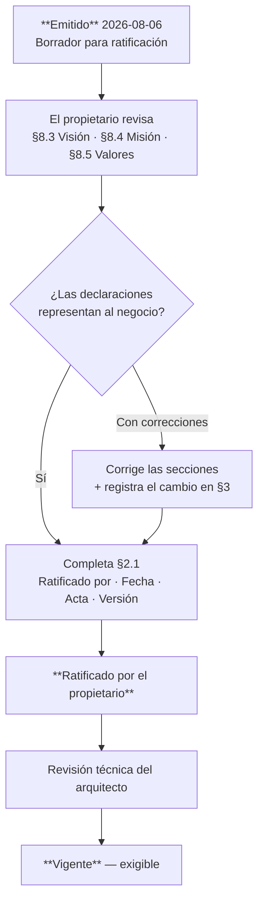

# CON-001 — Constitución del ERP Datafast

---

## 2. Control documental

| Campo | Valor |
|---|---|
| **Código** | CON-001 |
| **Versión** | 1.0 |
| **Estado** | **Vigente** — ratificado por Datafast el 2026-08-06 (§2.1) |
| **Autor** | Arquitectura — compilado desde la evidencia del repositorio y del historial de incidentes |
| **Propietario del producto** | **Datafast** (decisión D1, 2026-08-06) |
| **Fecha de emisión** | 2026-08-06 |
| **Jerarquía** | **Máxima.** Ningún documento puede contradecirla |
| **Base** | Rama `main`, commit `f8d52b00` |

### 2.1 Registro de ratificación

Este bloque se completa **únicamente** cuando el propietario del producto ratifica las secciones
§8.3 (Visión), §8.4 (Misión) y §8.5 (Valores). Hasta entonces, el documento **no puede pasar a
estado Vigente** (índice maestro §7.1).

| Campo | Valor |
|---|---|
| **Ratificado por** | **Datafast**, propietario del producto |
| **Fecha de ratificación** | **2026-08-06** |
| **Acta / referencia** | Decisión **D2** registrada en PLAN-001 §5 — sesión de 2026-08-06 |
| **Versión ratificada** | **1.0** |
| **Secciones ratificadas** | §8.3 Visión · §8.4 Misión · §8.5 Valores |
| **Modificaciones introducidas al ratificar** | Ninguna. Las tres secciones se ratifican tal como fueron redactadas |

**Regla de trazabilidad:** la ratificación se aplica a **una versión concreta**. Si el documento
cambia sus secciones de negocio después de ratificado, la ratificación **caduca** y debe repetirse.
Los cambios que solo afectan a secciones técnicas (§8.6–§8.12) no la invalidan.

## 3. Historial de cambios

| Versión | Fecha | Cambio | Motivo |
|---|---|---|---|
| 1.0 | 2026-08-06 | Emisión inicial | El ERP operaba sin constitución. Los principios existían y se aplicaban, pero no eran citables ni exigibles |
| 1.0-R | 2026-08-06 | **Ratificada.** Visión, misión y valores confirmados sin cambios por Datafast. Propietario del producto asignado | Decisiones D1 y D2 (PLAN-001 §5). El documento pasa de propuesta derivada de evidencia a norma exigible |

## 4. Índice

1. Identidad del ERP
2. Propósito
3. Visión
4. Misión
5. Valores
6. Principios Fundamentales
7. Principios de Ingeniería
8. Principios Arquitectónicos
9. Gobierno del ERP
10. Jerarquía Normativa
11. Gestión del Cambio
12. Vigencia

## 5. Objetivo

Establecer la identidad, el propósito y los principios no negociables del ERP Datafast, de modo
que toda decisión técnica futura pueda contrastarse contra un criterio escrito en lugar de contra
la memoria de quien estuvo presente cuando se tomó la decisión anterior.

## 6. Alcance

Aplica a **todo** el sistema: backend, frontend, servicio de automatización de red, base de
datos, infraestructura, procedimientos operativos y a cualquier módulo o integración futura.

Aplica a **todas** las personas y agentes que modifiquen el sistema.

**No aplica a** decisiones comerciales, de precios ni de estrategia de mercado.

### 6.1 Nota sobre las secciones 3, 4 y 5 del contenido

**Visión, Misión y Valores son declaraciones del propietario del negocio, no del arquitecto.** Lo
que §8.3, §8.4 y §8.5 presentan fue redactado como **propuesta derivada de la evidencia**: de cómo
el sistema está construido, qué prioriza cuando hay conflicto y qué decisiones ha tomado
consistentemente durante su historia.

**Datafast las ratificó sin modificaciones el 2026-08-06** (§2.1). Si alguna de las tres cambia,
la ratificación **caduca** y debe repetirse.

## 7. Definiciones y glosario

| Término | Definición |
|---|---|
| **ERP Datafast** | Sistema de gestión integral para proveedores de servicios de internet (ISP) FTTH y WISP |
| **Plano físico** | La red real: OLT, ONU, MikroTik, fibra, antenas |
| **Plano lógico** | La representación de esa red en la base de datos del ERP |
| **Discordancia físico↔lógico** | Situación en que el plano lógico afirma algo que el plano físico no cumple |
| **VIO** | *Verified Infrastructure Operations* — toda mutación de hardware se verifica con una lectura independiente |
| **Invariante** | Propiedad que nunca puede ser falsa, sostenida por un mecanismo y no por la disciplina |
| **Core Indestructible** | Conjunto de módulos que deben hacer crashear el backend si fallan al iniciar |
| **Abonado** | Cliente final del ISP |
| **Operador** | Usuario del ERP (personal del ISP) |

---

# 8. Contenido

## 8.1 Identidad del ERP

**ERP Datafast es un sistema de gestión y operación para proveedores de servicios de internet.**

No es un ERP genérico con un módulo de telecomunicaciones añadido. Es un sistema cuya razón de
ser es **mantener alineados dos mundos que tienden a divergir**: el mundo administrativo (quién es
el cliente, qué contrató, cuánto debe) y el mundo físico (qué ONU está registrada en qué puerto
PON, con qué IP, en qué estado).

Esa alineación es el producto. Todo lo demás —la facturación, el CRM, los reportes— existe en
muchos sistemas. Lo que distingue a Datafast es que **cuando el ERP dice que un abonado está
activo, la ONU lo está**, y cuando no puede garantizarlo, lo dice.

### Naturaleza técnica

| Atributo | Valor |
|---|---|
| Tipo de sistema | Monolito modular de despliegue segmentado por rol, con satélite de protocolo |
| Dominios | Comercial · Financiero · Red/OSS · Comunicación · Cliente final · Plataforma |
| Modelo de despliegue | Instalación por VPS, multi-empresa, portable entre servidores |
| Escala de diseño | Un ISP regional: miles de abonados, decenas de nodos, varias OLTs |
| Restricción física dominante | El hardware de red tiene límites duros de concurrencia (sesiones VTY) que el software debe respetar |

## 8.2 Propósito

> **Que el estado que el ERP afirma sobre un servicio sea el estado real de ese servicio, y que
> cuando no pueda garantizarlo, lo declare en lugar de suponerlo.**

De este propósito se derivan tres obligaciones permanentes:

| # | Obligación | Consecuencia práctica |
|---|---|---|
| 1 | **No afirmar sin verificar** | Toda operación contra hardware se confirma con lectura independiente |
| 2 | **No perder trabajo ni duplicarlo** | La intención de mutar la red es transaccional y se drena con reintentos clasificados |
| 3 | **No dejar residuos** | Un procedimiento interrumpido se anula por completo; nada queda a medias en el plano físico |

## 8.3 Visión

*Ratificada por Datafast el 2026-08-06 sin modificaciones (§2.1).*

> **Ser la plataforma de operación sobre la que un ISP pueda crecer de cientos a miles de
> abonados sin que la complejidad de operarlo crezca al mismo ritmo.**

La visión no es "tener más módulos". Es que **añadir el módulo número cincuenta cueste lo mismo
que costó el número cinco**, porque las garantías estructurales las aporta la plataforma y no
cada módulo por su cuenta.

## 8.4 Misión

*Ratificada por Datafast el 2026-08-06 sin modificaciones (§2.1).*

> **Dar al ISP control verificable sobre su planta y su cartera: que cada operación comercial
> tenga su contraparte física garantizada, que cada peso cobrado tenga un único registro
> auditable, y que ninguna falla ocurra en silencio.**

## 8.5 Valores

*Ratificada por Datafast el 2026-08-06 sin modificaciones (§2.1).*

Estos cinco valores no son aspiraciones: son **descripciones de decisiones que el sistema ya ha
tomado repetidamente**, incluso cuando la alternativa era más cómoda.

### V1 · Honestidad sobre el estado

El sistema prefiere decir "aceptado, sin confirmar" antes que "hecho".

**Evidencia:** la clase `indeterminado` existe específicamente para no mentir ante un timeout,
aunque reportar éxito o fallo habría sido más simple de programar y más cómodo de mostrar.

### V2 · La causa por encima del síntoma

**Evidencia:** en el incidente del mapa (2026-08-05) había tres parches superficiales disponibles
—un `UPDATE`, quitar unas capas, cambiar un texto— y los tres se rechazaron por escrito,
documentando **por qué** cada uno habría fallado después.

### V3 · Prudencia con el dinero y con el servicio del cliente

**Evidencia:** las pasarelas de pago están bloqueadas por una puerta de estabilidad de 30 días
cuyos criterios **no dependen de escribir código**. El equipo sabe cómo integrarlas y ha decidido
no hacerlo todavía.

### V4 · Memoria de los errores

**Evidencia:** los tests nombran el incidente que los motivó, por regla explícita: *"un test
llamado 'no debería fallar' se borra en la primera limpieza; uno que dice '409 de lock es
reintentable, no un veredicto (incidente 28/07)' sobrevive."*

### V5 · Respeto por lo que ya funciona

**Evidencia:** la directriz de que una ONU en producción **se adopta, nunca se reconfigura** —
aunque reconfigurarla dejaría el parque más uniforme y sería más fácil de programar.

## 8.6 Principios Fundamentales

Los cinco principios de los que se derivan todos los demás. **No son negociables.**

### PF-1 · El hardware es la verdad; la base de datos es una creencia

En un ERP administrativo la base de datos **es** la realidad. Aquí no: la realidad son la OLT, la
ONU y el router. La base de datos es una **afirmación** sobre ellos que puede estar equivocada sin
que nada falle visiblemente.

### PF-2 · Aceptar no es aplicar

Toda operación contra hardware tiene dos estados —**aceptada** y **materializada**— y el segundo
**nunca** se deduce del primero.

*Origen: CNT-2026-000004. Una ONU aceptó sin error un comando que su firmware nunca ejecutó, y el
ERP reportó éxito durante días con la gestión remota muerta.*

### PF-3 · Un invariante sin mecanismo no es un invariante

Si una propiedad depende de que alguien se acuerde de respetarla, no está garantizada: está
esperando. Se codifica en un índice, un trigger, un test o un guard — o se declara explícitamente
como riesgo aceptado.

### PF-4 · El silencio es el peor modo de fallo

Un sistema que falla ruidosamente se arregla. Uno que falla en silencio se descubre cuando el
daño ya está hecho, y hasta entonces todos actúan sobre una premisa falsa.

*Origen: 11 horas ejecutando código viejo mientras el script de despliegue imprimía "Backend
recargado".*

### PF-5 · Lo no confirmado se anula; lo confirmado no se toca

Un procedimiento interrumpido revierte todo lo que hizo. Un procedimiento completado y verificado
**jamás** se deshace por un cierre, una desconexión ni un crash: para deshacerlo existe una
operación formal, explícita y auditada.

## 8.7 Principios de Ingeniería

### PI-1 · Causa raíz antes que parche

No se da por corregido un fallo hasta poder explicar **cómo llegó el sistema a ese estado**. Si la
explicación es "no sé por qué pasaba, pero ya no pasa", el defecto no está corregido: está oculto.

### PI-2 · El diagnóstico se mide, no se deduce

Una afirmación sobre el comportamiento del sistema que no se apoya en una medición —una consulta,
una cabecera, un valor leído en ejecución, una captura de tráfico— es una **hipótesis**, y se
enuncia como tal.

### PI-3 · Se corrige en el punto común

Un defecto de criterio suele estar repetido. Se corrige donde converge, no en cada lugar donde se
manifiesta.

### PI-4 · Reutilizar antes de construir

Dos caminos hacia el mismo dato son dos verdades que empiezan idénticas y divergen en la primera
modificación. Antes de escribir una consulta, se busca si ya existe.

**Matiz obligatorio:** reutilizar no significa ignorar el patrón de acceso. Un servicio válido
para una consulta puntual puede ser inviable en bucle.

### PI-5 · La solución mínima que resuelve el problema

Sin abstracciones, helpers, tipos ni validaciones que nadie pidió. Tres líneas repetidas son
preferibles a una abstracción prematura — hasta que la tercera repetición demuestre el patrón.

### PI-6 · Evaluación pesimista obligatoria

Antes de cualquier solución que toque red o dinero se evalúa el peor escenario: caída a mitad de
la operación, ejecución concurrente, desfase de estado y entrada no sanitizada.

### PI-7 · No se declara hecho sin evidencia

Compilar, ejecutar los tests o verificar contra el sistema real. "Listo" sin evidencia no es una
afirmación: es una expectativa.

### PI-8 · La documentación registra la causa, no el arreglo

El commit y el comentario explican **qué estaba mal y por qué no se veía**. Eso es lo que evita
que se reintroduzca.

## 8.8 Principios Arquitectónicos

### PA-1 · Tres planos con garantías distintas

| Plano | Garantía | Verdad |
|---|---|---|
| **Negocio** | ACID en PostgreSQL | La base de datos es la verdad |
| **Intención** | Entrega eventual con reintentos clasificados | La verdad es "esto debe ocurrir" |
| **Realidad física** | Consistencia eventual verificada (VIO) | El hardware es la verdad |

**El plano de negocio nunca llama al plano físico directamente en una operación de negocio.**
Escribe su intención, y otro la ejecuta.

### PA-2 · Vocabulario de dominio, no de transporte

Lo que consume una máquina no se comunica con códigos HTTP. Se comunica con clases de resultado
de dominio, y el transporte traduce en el borde.

### PA-3 · Los estados legales se declaran en un solo lugar

Un criterio disperso no es auditable. Uno declarativo se revisa de un vistazo, y por eso permite
**notar lo que falta**.

### PA-4 · La idempotencia se deriva, no se implementa

Si el recurso ya está en el estado destino, la operación es un éxito. Un método nuevo no puede
olvidarse de ser idempotente si no es él quien lo implementa.

### PA-5 · Degradable o indestructible, decidido al nacer

Todo módulo declara, el día que se crea, si puede arrancar degradado o si su fallo debe hacer
crashear el backend. No hay una tercera opción, y no se decide después.

### PA-6 · El ERP inyecta su configuración canónica y respeta lo preexistente

En los equipos que provisiona impone su configuración. En los que encuentra funcionando, observa
y respeta. **Nunca reutiliza un recurso ajeno sin verificar que está libre.**

### PA-7 · Ninguna instalación es un caso especial

Ningún archivo del repositorio contiene IPs, dominios ni secretos. Una instalación puede servirse
por IP, en una LAN o con tres dominios, y las tres son el caso normal.

### PA-8 · La configuración de arranque se declara en un solo archivo versionado

Lo que corre en producción debe coincidir con lo que dice el repositorio. Si no coincide, la
instalación no es reproducible.

## 8.9 Gobierno del ERP

### 8.9.1 Roles

| Rol | Responsabilidad |
|---|---|
| **Propietario del producto** | Ratifica CON-001. Decide prioridades del roadmap y las puertas de negocio |
| **Arquitecto** | Custodia este cuerpo normativo. Aprueba ADR. Revisa desviaciones |
| **Desarrollador** | Aplica POL-001, EST-001 y GUI-001. Propone ADR cuando una decisión los excede |
| **Operador de plataforma** | Ejecuta PRO-001. Reporta incidentes con evidencia |

### 8.9.2 Cuándo se exige un ADR

Se registra un ADR **antes** de implementar, cuando la decisión:

- introduce o retira una dependencia externa;
- cambia una garantía de consistencia, concurrencia o atomicidad;
- afecta al dinero, al aislamiento entre empresas o al plano físico de red;
- contradice, matiza o crea una excepción a una política vigente;
- elige entre dos alternativas cuyo coste de reversión es alto.

### 8.9.3 Revisión periódica

| Documento | Frecuencia mínima de revisión |
|---|---|
| CON-001 | Anual, o ante un cambio de modelo de negocio |
| POL-001, EST-001 | Semestral, o tras un incidente que revele un vacío |
| Documentos de arquitectura | Tras cada cambio estructural |
| ADR | No se revisan: se **supersede** con un ADR nuevo |
| MOD-XXX | Cuando el módulo se modifique |
| PRO-001 | Tras cada incidente operativo |

### 8.9.4 Tratamiento de las desviaciones

Una desviación detectada **no se corrige en silencio**. Se registra —en el ADR correspondiente o
en `PENDIENTES.md`— indicando qué política se incumple, por qué se incumple y qué la resolvería.

> Una excepción documentada es gobernable. Una excepción silenciosa es deuda invisible, y el
> siguiente lector construirá encima de ella creyendo que la regla se cumple.

## 8.10 Jerarquía Normativa

```
CON-001 (Constitución)
   └── POL-001 (Políticas Corporativas)
          └── AEM · ARS · DOM · DAT · INT · SEC (Arquitectura)
                 └── ADR (Decisiones)
                        └── EST-001 (Estándares)
                               └── GUI-001 (Guías)
                                      └── MOD-XXX (Módulos)
                                             └── PRO / MAN (Operación y uso)
```

**Reglas:**

1. Un documento **no puede contradecir** a ninguno superior.
2. Un ADR **puede matizar** un documento de arquitectura para un caso concreto; **no puede contradecir** CON-001 ni POL-001.
3. Si una decisión exige contradecir una política, **primero se modifica la política** con su registro de cambio. No se implementa antes.
4. Ante silencio de la norma, prevalece el principio fundamental aplicable (§8.6).

## 8.11 Gestión del Cambio

### 8.11.1 Modificación de esta Constitución

Requiere: propuesta escrita con motivo, revisión del arquitecto, **ratificación del propietario
del producto** y registro en el historial de cambios indicando qué principio cambió y por qué.

**Un principio fundamental (§8.6) no se modifica: se sustituye.** Y su sustitución exige
documentar qué evidencia demostró que el anterior era incorrecto.

### 8.11.2 Cambios que exigen ADR previo

Los listados en §8.9.2.

### 8.11.3 Principio de evolución

> **La plataforma se consolida antes de crecer.**

Cuando exista tensión entre añadir una funcionalidad y cerrar una brecha estructural conocida,
**prevalece cerrar la brecha** — salvo decisión explícita y registrada del propietario del
producto, con su motivo.

Este principio nace del diagnóstico de la Etapa II: el ERP creció incorporando módulos durante
años, y cada módulo nuevo heredó las garantías que su autor recordaba aplicar. El resultado no es
un sistema mal construido: es un sistema **desigualmente** construido, con un plano FTTH de
garantías industriales junto a un plano WISP con muchas menos.

## 8.12 Vigencia

| Aspecto | Valor |
|---|---|
| **Entrada en vigor** | Al completarse el registro de ratificación (§2.1) y pasar el documento a estado **Vigente** |
| **Vigencia** | Indefinida hasta emisión de una versión superior |
| **Ámbito** | Todo el sistema y todas las personas o agentes que lo modifiquen |
| **Documentos derivados** | Deben alinearse en un plazo acordado tras cada cambio mayor |
| **Caducidad de la ratificación** | Automática si cambian §8.3, §8.4 o §8.5 |

### 8.12.1 Secuencia hasta la entrada en vigor



**Mientras el documento no esté Vigente**, sus principios técnicos (§8.6 a §8.11) se aplican de
hecho —son la descripción de cómo ya funciona el sistema— pero **no son citables como norma
exigible**. Lo exigible hoy es POL-001.

---

# 9. Referencias

| Referencia | Contenido aportado |
|---|---|
| `docs/archivo/auditoria/` (Etapa I) | Estado real medido del sistema |
| `docs/archivo/consolidacion/` (Etapa II) | Análisis, riesgos y fortalezas |
| `docs/archivo/directrices/directrices-politicas-filosofia.md` | Compilación de reglas desde fuentes primarias |
| `CLAUDE.md` | Reglas de construcción vigentes del repositorio |
| `PENDIENTES.md` | Registro vivo de deuda técnica |
| `pagos/adaptadores/README.md` | Política de la frontera del dinero |
| `ecosystem.config.js` | Políticas de arranque y aislamiento |
| `docs/informe-cnt-2026-000004-omci-tr069-write-gap.md` | Incidente fundacional de VIO |

---

# 10. Anexos

## Anexo A — Carta Magna

Los diez enunciados que resumen esta Constitución:

> **I.** El hardware es la verdad; la base de datos es una creencia que se verifica.
>
> **II.** Aceptar no es aplicar. Sin lectura independiente que lo confirme, se reporta "aceptado, sin confirmar" — nunca "hecho".
>
> **III.** Un timeout no significa que no pasó nada. Es indeterminado: ni se reintenta a ciegas ni se reporta como fallo.
>
> **IV.** Reintentar es recuperable; descartar no. Ante la duda, reintentable.
>
> **V.** Lo no confirmado se anula por completo; lo confirmado jamás se anula por un cierre.
>
> **VI.** Nunca se interrumpe una operación de hardware a mitad. Anular no es abortar.
>
> **VII.** El invariante que solo vive en la documentación no es un invariante.
>
> **VIII.** Un log describe lo que ocurrió, nunca lo que el código pretendía hacer.
>
> **IX.** Se busca la causa, no el síntoma; y se corrige en el punto común.
>
> **X.** El ERP inyecta su configuración canónica en los equipos que provisiona, y respeta como intocable lo que encontró funcionando.

## Anexo B — Trazabilidad principio → incidente

| Principio | Incidente que lo originó |
|---|---|
| PF-1, PF-2 | CNT-2026-000004 (2026-07-17) — la ONU aceptó y no materializó |
| PF-3 | 2026-07-28 — el comentario del outbox garantizaba una exclusión mutua falsa |
| PF-4 | 2026-08-06 — 11 h ejecutando código viejo con el deploy reportando éxito |
| PF-5 | 2026-07-21 — wizard cerrado a medias dejó una ONU huérfana |
| PI-1, PI-2, PI-3 | 2026-08-05 — los tres fallos del mapa de red |
| PA-1, PA-2 | 2026-07-28 — 1.788 reintentos contra el MA5800 por clasificación errónea |
| PA-3, PA-4 | 2026-07-28 — baja imposible desde `suspendido` |
| PA-5 | Regla preventiva; sin incidente asociado |
| PA-6 | 2026-07-15 — directriz de implementación desde cero |
| PA-7, PA-8 | 2026-07-22 — el frontend arrastraba todos los secretos del backend |

## Anexo C — Qué NO decide esta Constitución

Para evitar interpretaciones extensivas:

- No decide qué funcionalidades se construyen (eso es RDM-001).
- No decide tecnologías concretas (eso es ARS-001 y los ADR).
- No define estándares de código (eso es EST-001).
- No sustituye a `CLAUDE.md` como guía operativa del repositorio.
