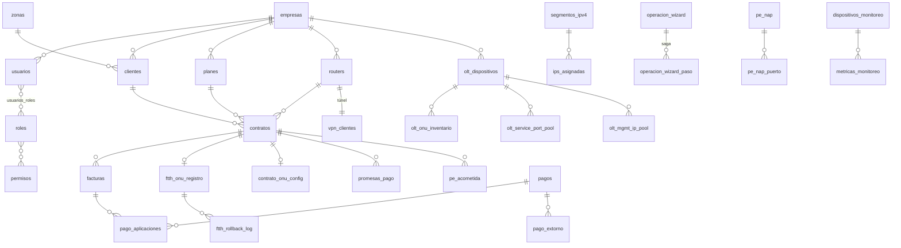

# DAT-001 — Arquitectura de Datos

---

## 2. Control documental

| Campo | Valor |
|---|---|
| **Código** | DAT-001 · **Versión** 1.0 · **Estado** Vigente |
| **Autor** | Arquitectura · **Revisores** Pendientes de asignar |
| **Fecha** | 2026-08-06 · **Documento superior** CON-001, POL-001, ARS-001 |

## 3. Historial de cambios

| Versión | Fecha | Cambio | Motivo |
|---|---|---|---|
| 1.0 | 2026-08-06 | Emisión inicial | No existía diccionario ni declaración de propiedad del dato; había reglas de negocio en triggers que nadie había documentado |

## 4. Índice

1. Modelo de Datos · 2. Propiedad de los Datos · 3. Fuente de Verdad · 4. Integridad ·
5. Versionado · 6. Retención · 7. Auditoría

## 5. Objetivo

Declarar el modelo de datos, quién es dueño de cada tabla, dónde vive la verdad de cada dato, qué
garantiza la integridad y qué política rige el versionado, la retención y la auditoría.

## 6. Alcance

PostgreSQL 16 (`datafast_db`), Redis y el almacenamiento en filesystem. **No cubre** la base
propia de Evolution API salvo por su coexistencia.

## 7. Definiciones y glosario

| Término | Definición |
|---|---|
| **Fuente de verdad** | El lugar cuyo valor prevalece cuando dos sitios discrepan |
| **Tabla maestra** | Baja escritura, alta lectura, define catálogos |
| **Tabla transaccional** | Alta escritura, registra hechos del negocio |
| **Tabla de coordinación** | Sostiene el plano de intención (outbox, locks, saga, pools) |
| **Serie temporal** | Crece de forma monótona con el tiempo |
| **Soft-delete** | Borrado lógico con `deleted_at` |
| **Drift** | Divergencia entre configuración deseada y observada |

---

# 8. Contenido

## 8.1 Modelo de Datos

### 8.1.1 Perfil

| Aspecto | Valor |
|---|---|
| Motor | PostgreSQL 16-alpine · TZ `America/Lima` |
| Tablas | ~120 |
| Entidades TypeORM | 81 → **39 tablas sin tipar** |
| Migraciones | 215 (`core/` + `auxiliary/`), modo `each` |
| Índices | **376** |
| Triggers · Funciones · Vistas | 27 · 13 · 4 |
| Estrategia de esquema | `synchronize: false` — **solo migraciones** |
| Ejecutor de migraciones | **Solo `datafast-api-core`** |
| Pool | 15/2 por proceso · `max_connections=100` |
| Logging SQL | **Desactivado** |

### 8.1.2 Clasificación de tablas

| Clase | Tablas | Características |
|---|---|---|
| **Maestras** | `empresas` `usuarios` `roles` `permisos` `planes` `zonas` `sites` `routers` `olt_dispositivos` `olt_boards` `canal_pago` `cuentas_bancarias` `bancos_isp` `formas_pago_isp` `comprobantes_config` `plantillas_*` `umbrales_alerta` `olt_onu_preset` `olt_baselines` `xui_servidores` `portal_config` | Cacheables, cambian poco |
| **Transaccionales** | `facturas` `pagos` `pago_aplicaciones` `pago_extorno` `cargos_pendientes` `egresos_ingresos` `promesas_pago` `cierre_caja` `tickets` `ordenes_trabajo` `crm_mensajes` `notificaciones_logs` | Alta escritura, nunca se borran |
| **Estado de infraestructura** | `ftth_onu_registro` `contrato_onu_config` `olt_onu_inventario` `tr069_device` `ips_asignadas` `segmentos_ipv4` `vpn_clientes` `pe_*` (9) | **Espejo del mundo físico** |
| **Coordinación** | `comandos_red_pendientes` `ftth_operacion_lock` `operacion_wizard` `operacion_wizard_paso` `saga_log` `olt_service_port_pool` `olt_mgmt_ip_pool` `olt_onu_id_pool` | **Sostienen las garantías del sistema** |
| **Series temporales** | `metricas_monitoreo` `nodos_mediciones` `metricas_onu_optical` `olt_health_snapshots` `consumo_datos` `consumo_snapshot` | **Crecimiento sin techo declarado** |
| **Auditoría** | `auditoria_logs` `entity_versions` `eventos_sistema` `olt_operacion_log` `ftth_rollback_log` `reconciliation_log` `google_sync_logs` `contratos_historial` `clientes_historial_estados` | Retención con política |

### 8.1.3 Modelo relacional del núcleo



### 8.1.4 Modelo multi-tenant

Discriminador por columna `empresa_id`, con índices únicos **compuestos y parciales**:

```
uq_usuarios_empresa_email        uq_clientes_empresa_documento
uq_contratos_empresa_numero      uq_contratos_empresa_onu
uq_planes_empresa_nombre         uq_roles_empresa_nombre
uq_segmentos_empresa_red_cidr    uq_routers_empresa_ip_gestion (WHERE activo)
uq_onus_empresa_serial           uq_onus_olt_pon_id
uq_tickets_empresa_numero        uq_ordenes_empresa_numero
uq_plantillas_empresa_tipo_codigo  uq_vpn_clientes_nombre_cert
```

Los índices parciales (`WHERE deleted_at IS NULL`, `WHERE activo`) permiten soft-delete y
reactivación sin colisión. `uq_routers_empresa_ip_gestion WHERE activo` fue la corrección
definitiva del incidente de equipos duplicados.

> ⚠️ **Los índices garantizan que los datos no colisionen. NO garantizan que no se lean entre
> sí.** El aislamiento en lectura depende de que cada consulta incluya `empresa_id` — y hay 445
> consultas crudas. Ver SEC-001 §8.3.4.

## 8.2 Propiedad de los Datos

**Regla:** cada tabla tiene **un módulo dueño**, que es el único autorizado a escribirla. Los
demás la leen a través del dueño.

| Tabla | Dueño (escribe) | Lectores |
|---|---|---|
| `clientes`, `clientes_historial_estados` | `clientes` | contratos, portal, reportes, mapa |
| `contratos`, `contratos_historial` | `contratos` | facturación, red, portal, reportes |
| `segmentos_ipv4`, `ips_asignadas` | **`contratos`** | mikrotik (validación) |
| `planes` | `planes` | contratos, facturación, portal |
| `facturas`, `cargos_pendientes` | `facturacion` | pagos, portal, reportes |
| **saldo de `facturas`** | **`AplicadorFacturaService` + trigger** | Nadie más |
| `pagos`, `pago_aplicaciones`, `pago_extorno` | `pagos` | facturación, reportes |
| `canal_pago`, `cuentas_bancarias`, `cierre_caja` | `pagos` | reportes |
| `promesas_pago` | `promesas-pago` | cobranza |
| `routers`, `drift_detectado`, `reconciliation_log` | `mikrotik` | contratos, monitoreo, portal, sites |
| `openvpn_config`, `vpn_clientes`, `vpn_alertas` | `openvpn` | mikrotik, sites |
| `olt_*` (18 tablas) | `olt-nativo` | portal, sites, outbox |
| `ftth_onu_registro`, `ftth_rollback_log`, `ftth_operacion_lock` | `olt-nativo` | contratos (lectura), portal |
| `contrato_onu_config`, `cpe_*` | `olt-nativo/ztp` | portal |
| `operacion_wizard`, `operacion_wizard_paso` | `olt-nativo` | — |
| **`comandos_red_pendientes`** | **`outbox-red`** (escritura de intención por los módulos de negocio en su misma transacción) | — |
| `pe_*` (9 tablas) | `planta-externa` | mapa, contratos |
| `dispositivos_monitoreo`, `metricas_monitoreo`, `alertas_sistema`, `umbrales_alerta` | `monitoreo` | dashboard |
| `notificaciones`, `notificaciones_logs` | `notificaciones` | sistema |
| `crm_chats`, `crm_mensajes` | `crm-nativo` | — |
| `portal_*`, `consumo_*` | `portal` | — |
| `tickets`, `tickets_comentarios`, `ordenes_trabajo` | `tickets` | portal |
| `usuarios`, `roles`, `permisos`, `usuarios_roles` | `usuarios` | auth |
| `empresas` | `config` | Todos (lectura) |
| `auditoria_logs`, `entity_versions` | `auditoria` (vía interceptor) | — |
| `eventos_sistema`, `backups` | `sistema`, `backup` | — |
| `olts`, `onus` | `smartolt` (legado) | olt-nativo |

### Excepción declarada

`comandos_red_pendientes` **se escribe desde los módulos de negocio** (para que la intención esté
en la misma transacción que el cambio comercial) pero **solo la lee y actualiza `outbox-red`**.
Es la única tabla con escritura compartida, y es deliberado: el patrón outbox lo exige.

## 8.3 Fuente de Verdad

**La regla que define el sistema:**

| Tipo de dato | Fuente de verdad | La BD es… |
|---|---|---|
| Comercial y financiero | **PostgreSQL** | La verdad |
| Identidad y permisos | **PostgreSQL** | La verdad |
| **Estado físico de la red** | **El hardware (OLT, ONU, router)** | **Una creencia que se verifica** |
| Configuración de CPE | El CPE (leído por TR-069) | Una creencia |
| Estado del túnel VPN | El servidor OpenVPN | Una creencia |

### Fuentes únicas declaradas

Datos que **tienen una sola definición** y así deben permanecer:

| Dato | Fuente única | Origen de la consolidación |
|---|---|---|
| Ubicación del abonado | **CTE `PUNTOS_SERVICIO`** | El dato vivía en `clientes.latitud` y `contratos.latitud_instalacion`; el mapa leía el equivocado (incidente 05/08) |
| Saldo de una factura | `AplicadorFacturaService` + trigger | Había 4 copias del `UPDATE`; una aplicaba contra facturas **anuladas** |
| Ciclo de cobro | `PoliticaFacturacionService` | Había 3 fórmulas; el corte caía antes del vencimiento |
| Configuración canónica de OLT | `olt-baseline-standard.ts` | Directriz de implementación desde cero |
| Nombres de cola y política de reintento | `workers.constants.ts` | — |
| Estados legales FTTH | `ftth-maquina-estados.ts` | Estaban dispersos en 13 sitios |

### Fuente múltiple pendiente de consolidar

| Dato | Caminos | Consecuencia |
|---|---|---|
| **Deuda de un contrato** | 4 (`fn_calcular_deuda_contrato`, `deuda-por-contrato.service`, `pagos.service`, `cobranza.worker`) | **Decide cortes de servicio.** Pueden divergir en cargos pendientes, notas de crédito, adelantos y promesas |
| Predicado "contrato activo" | ~6 | Reportes discrepantes |
| Resúmenes agregados | 3 + 2 vistas | Cifras distintas según la pantalla |
| Estado de ONU | 2 (SSH en vivo vs BD) | **Justificado por escrito** — costes incompatibles |

## 8.4 Integridad

### 8.4.1 Integridad referencial

Claves foráneas con `CASCADE` donde el hijo carece de sentido sin el padre (`contratos_historial`,
`consumo_datos`). Soft-delete con índices parciales en el resto.

### 8.4.2 Lógica de negocio residente en la base

| Objeto | Regla que garantiza | Justificación de estar en BD |
|---|---|---|
| `trg_factura_saldo` → `fn_sync_factura_saldo` | Saldo de la factura | Se cumple aunque el escritor sea un script manual |
| `trg_update_ips_usadas` → `fn_update_ips_usadas` | Contador de IPs de un segmento | Ídem |
| `trg_pe_contadores_nap` → `pe_recalcular_contadores_nap` | Ocupación de una NAP | Ídem |
| `fn_next_available_ip` | Asignación de IP libre | Evita race condition |
| `fn_generar_numero_contrato` / `_ticket` | Correlativos | **Nunca `MAX()+1`** — evita race condition |
| `sn_onu_normalizado` | Normalización de SN entre OLT/GenieACS/SmartOLT | Invariante de formato |
| `fn_calcular_deuda_contrato` | Deuda | ⚠️ Uno de los 4 caminos |
| `recalc_tipo_servicio_cliente` | Tipo de servicio derivado | — |
| `fn_cleanup_old_data` | Retención | — |

**Precedente que sostiene esta decisión:** el 28/07 un `UPDATE` directo se saltó las cascadas de
aplicación y dejó un cert VPN huérfano reservando una IP. La lección registrada fue que *"el
invariante que solo vive en la doc no es invariante"*. Un trigger es la forma más fuerte de que
un invariante no dependa de la disciplina del llamador.

**Coste aceptado:** estas reglas **no son visibles desde el código de aplicación** y no aparecen
en ningún test de NestJS. Se documentan aquí precisamente por eso.

### 8.4.3 Integridad del plano físico

| Invariante | Mecanismo |
|---|---|
| Nunca un `ont` sin registro, ni al revés | Watchers `reintentarRollbacksFallidos` + `adoptarOnusHuerfanas` |
| Nunca dos ONUs con la misma IP de gestión | El pool no retira IPs ocupadas |
| Un hilo se fusiona una sola vez por extremo | Restricción en BD |
| Una operación FTTH por contrato | `ftth_operacion_lock` con TTL |
| Un comando de red se ejecuta una sola vez | Reclamo atómico + dueño + TTL |

### 8.4.4 Vistas

| Vista | Consumo |
|---|---|
| `v_contratos_completos` | Listados con joins precalculados |
| `v_resumen_clientes` | Resúmenes y dashboard |
| `v_resumen_financiero` | Reportes y dashboard |
| `v_estado_dispositivos` | Monitoreo en tiempo real |

**Advertencia:** las vistas conviven con consultas de aplicación que calculan lo mismo. Existir no
las convierte en fuente única.

## 8.5 Versionado

### 8.5.1 Versionado del esquema

| Regla | Enunciado |
|---|---|
| V-1 | El esquema **solo** cambia por migración versionada. `synchronize: false` sin excepciones |
| V-2 | Migraciones transaccionales (`each`) — una migración a medias no queda a medias |
| V-3 | **Un solo proceso migra** (`api-core`). El worker tiene `RUN_MIGRATIONS=false` |
| V-4 | Instalación nueva → `migration:run:all`. Deploy incremental → juego `core` |
| V-5 | `schema-guard` verifica el esquema al arrancar |
| V-6 | Una migración **nunca** se edita después de desplegada: se corrige con otra |

### 8.5.2 Versionado de datos

| Mecanismo | Alcance |
|---|---|
| `entity_versions` | Versiones restaurables de entidades auditadas → undo/redo y papelera |
| `contratos_historial`, `clientes_historial_estados` | Historial de estado por entidad |
| `olt_baselines` | **Versionado inmutable**: crear con nombre existente genera `version = max+1`. **Nunca se edita una versión publicada** |
| `contrato_onu_config.revision` / `last_applied_revision` | Detección de drift de configuración de CPE |
| `VERSION` + `typeorm_migrations` | Versión de la plataforma y del esquema |

## 8.6 Retención

### 8.6.1 Políticas vigentes

| Dato | Política | Mecanismo |
|---|---|---|
| `auditoria_logs` | Purga por retención | Cron diario 03:00 |
| Datos antiguos genéricos | `fn_cleanup_old_data` | Función de BD |
| Jobs completados en Bull | `removeOnComplete: 100` | Configuración |
| Jobs fallidos en Bull | `removeOnFail: 500` | Configuración |
| Cache de aplicación | TTL 300 s | Redis |
| Archivos temporales de firmware | Borrado tras 1800 s | Servicio Python |

### 8.6.2 Datos SIN política de retención declarada

| Tabla | Ritmo de crecimiento | Riesgo |
|---|---|---|
| **`metricas_monitoreo`** | **Cada minuto × nº de dispositivos** | La de mayor tasa del sistema |
| `nodos_mediciones` | Ídem | — |
| `consumo_datos` / `consumo_snapshot` | Cada 15 min × nº de contratos | — |
| `metricas_onu_optical` | Por lectura óptica | — |
| `olt_health_snapshots` | Por poll de salud | — |
| `crm_mensajes` | Por mensaje de WhatsApp | — |
| `notificaciones_logs` | Por notificación | — |
| `olt_operacion_log` | Por operación de OLT | — |

**No existe particionado por tiempo ni archivado histórico en ninguna tabla.** Es el riesgo de
escalabilidad de datos más próximo (RDM-001, riesgo R-12).

### 8.6.3 Respaldo

| Aspecto | Detalle |
|---|---|
| Mecanismo | `pg_dump` ejecutado vía docker |
| Gestión | Módulo `backup` + tabla `backups` |
| Destino adicional | Google Drive (cola `google-sync`) |
| Uso adicional | El update transaccional de `sistema` hace `pg_dump` previo |
| Volúmenes persistentes | `postgres-data`, `redis-data`, `app-logs`, `certbot-conf`, `evolution-data` |

Procedimientos en PRO-001.

## 8.7 Auditoría

### 8.7.1 Mecanismos

| Mecanismo | Alcance |
|---|---|
| `AuditInterceptor` (global) | Captura mutaciones HTTP → `auditoria_logs` |
| `entity_versions` | Versiones restaurables |
| Undo / Redo | `POST /auditoria/undo`, `/redo` |
| Papelera | Listar, restaurar y eliminar definitivamente |
| `@SetMetadata('skipAudit', true)` | Exclusión de lecturas de alto volumen — **aplicado sistemáticamente solo en `contratos`** |
| Retención | Cron diario 03:00 |

### 8.7.2 Bitácoras de dominio

| Bitácora | Qué registra |
|---|---|
| `olt_operacion_log` | Operaciones contra OLT |
| `ftth_rollback_log` | Rollbacks y su estado |
| `saga_log` | Sagas de operaciones distribuidas |
| `operacion_wizard_paso` | **Bitácora write-ahead de compensación** |
| `reconciliation_log` | Reconciliaciones BD↔red |
| `eventos_sistema` | Eventos de plataforma (updates, reinicios) |
| `google_sync_logs` | Sincronizaciones con Google |
| `notificaciones_logs` | Envíos, con clave de idempotencia |
| `auditoria_logs` | Accesos y mutaciones |

### 8.7.3 Trazabilidad de una operación de red

Una operación FTTH deja rastro en **cinco** lugares, y esa redundancia es deliberada:

```
contratos_historial      → qué cambió en el negocio
operacion_wizard(_paso)  → qué pasos se ejecutaron y cómo deshacerlos
comandos_red_pendientes  → qué se pidió a la red y en qué estado quedó
olt_operacion_log        → qué se ejecutó contra la OLT
ftth_rollback_log        → qué se intentó deshacer
```

---

# 9. Referencias

CON-001 · POL-001 · ARS-001 · DOM-001 · SEC-001 · PRO-001 ·
`docs/archivo/auditoria/` capítulos 6 y 7 · `docs/archivo/consolidacion/` capítulo 4

---

# 10. Anexos

## Anexo A — Tablas SIN entidad TypeORM (39)

**Riesgo:** un `ALTER` sobre ellas **no rompe la compilación**.

`comandos_red_pendientes` · `ftth_operacion_lock` · `operacion_wizard` ·
`operacion_wizard_paso` · `pago_extorno` · `cierre_caja` · `cuentas_bancarias` · `bancos_isp` ·
`formas_pago_isp` · `consumo_datos` · `consumo_snapshot` · `contratos_historial` ·
`ips_asignadas` · `drift_detectado` · `reconciliation_log` · `nodos` · `nodos_mediciones` ·
`ordenes_trabajo` · `tickets_comentarios` · `portal_solicitud_plan` · `google_client_contacts` ·
`eventos_sistema` · `notificaciones` · `usuarios_roles` (+ vistas)

**Las cuatro primeras sostienen las garantías más fuertes del sistema y son las menos protegidas
por tipos.** Prioridad de corrección: RDM-001 (R7).

## Anexo B — El riesgo de datos más grave

**Mecanismo:** una ONU con `contrato_onu_config.provisioning_enabled = true` y
`last_applied_revision IS NULL` figura como drift, y el pipeline ZTP le **reescribe SSID, clave
WiFi y credenciales de acceso web**.

**La ventana son dos minutos, no una noche.** Son **dos** los barridos, y el peligroso no es el
nocturno:

| Barrido | Frecuencia | Filtro |
|---|---|---|
| `ztp.reconcile()` | 03:30 `America/Lima` | `provisioning_enabled AND (rev NULL OR rev < revision)` |
| **`ztp.reconcilePendingReinjection()`** | **cada 2 min** | `provisioning_enabled AND rev IS NULL` |

Una ONU recién migrada tiene exactamente `last_applied_revision IS NULL`: la captura el watcher de
dos minutos.

**Protección vigente (2026-08-06):** columna `contrato_onu_config.origen`
(`erp` | `adoptada` | `migrada`), con guard en el **filtro** de los dos barridos y en la ruta
manual (`provisionContract`). Sobrescribir la config de una ONU ajena exige
`sobrescribirConfigAjena: true`. Cubierto por 4 tests que nombran el riesgo.

**Verificación obligatoria antes y después de cualquier migración:**
`GET /olt-nativo/ztp/preflight-migracion` — devuelve `seguro: false`, no un aviso.

```sql
SELECT origen,
       COUNT(*) FILTER (
         WHERE provisioning_enabled
           AND (last_applied_revision IS NULL OR last_applied_revision < revision)
       ) AS en_barrido
FROM   contrato_onu_config
WHERE  deleted_at IS NULL
GROUP BY origen;
```

**`en_barrido` debe ser 0 para todo origen distinto de `erp`.**

**Historia:** hasta 2026-08-06 el sistema estaba protegido **por construcción, no por precaución**
— la garantía era un efecto lateral de tres decisiones independientes, ninguna de las cuales
expresaba la regla. Ver ADR-014.

## Anexo C — Convenciones de nombres

| Prefijo | Dominio | Ejemplo |
|---|---|---|
| `pe_` | Planta externa | `pe_nap_puerto` |
| `olt_` | OLT nativo | `olt_service_port_pool` |
| `ftth_` | Ciclo de vida FTTH | `ftth_onu_registro` |
| `cpe_` | Equipo del abonado | `cpe_web_credential` |
| `xui_` | IPTV | `xui_lines` |
| `portal_` | Portal del abonado | `portal_config` |
| `crm_` | CRM WhatsApp | `crm_mensajes` |
| `v_` | Vista | `v_contratos_completos` |
| `fn_` | Función | `fn_next_available_ip` |
| `trg_` | Trigger | `trg_factura_saldo` |
| `uq_` | Índice único | `uq_contratos_empresa_onu` |
| Sin prefijo | Núcleo comercial y financiero | `clientes`, `facturas` |

**Excepciones que conviene conocer:** `olts` y `onus` (camino SmartOLT legado) conviven con
`olt_dispositivos` y `olt_onu_inventario` (camino nativo) — **son dos modelos del mismo objeto
físico**.
