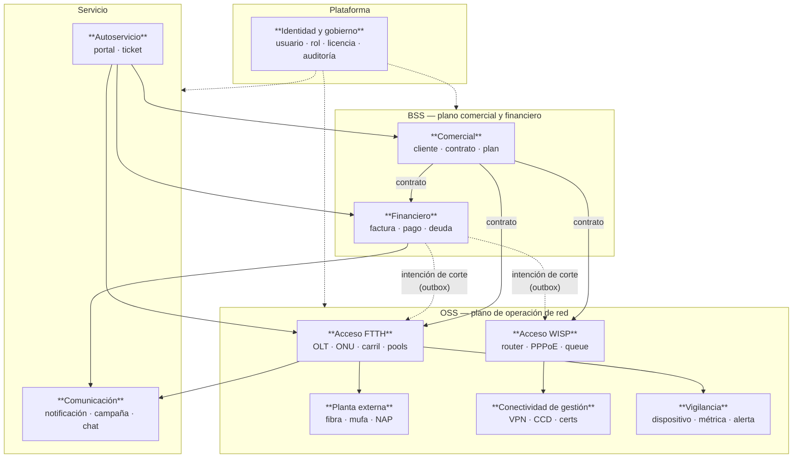
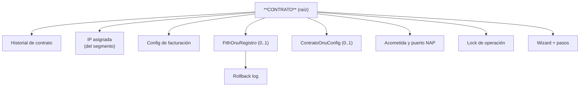
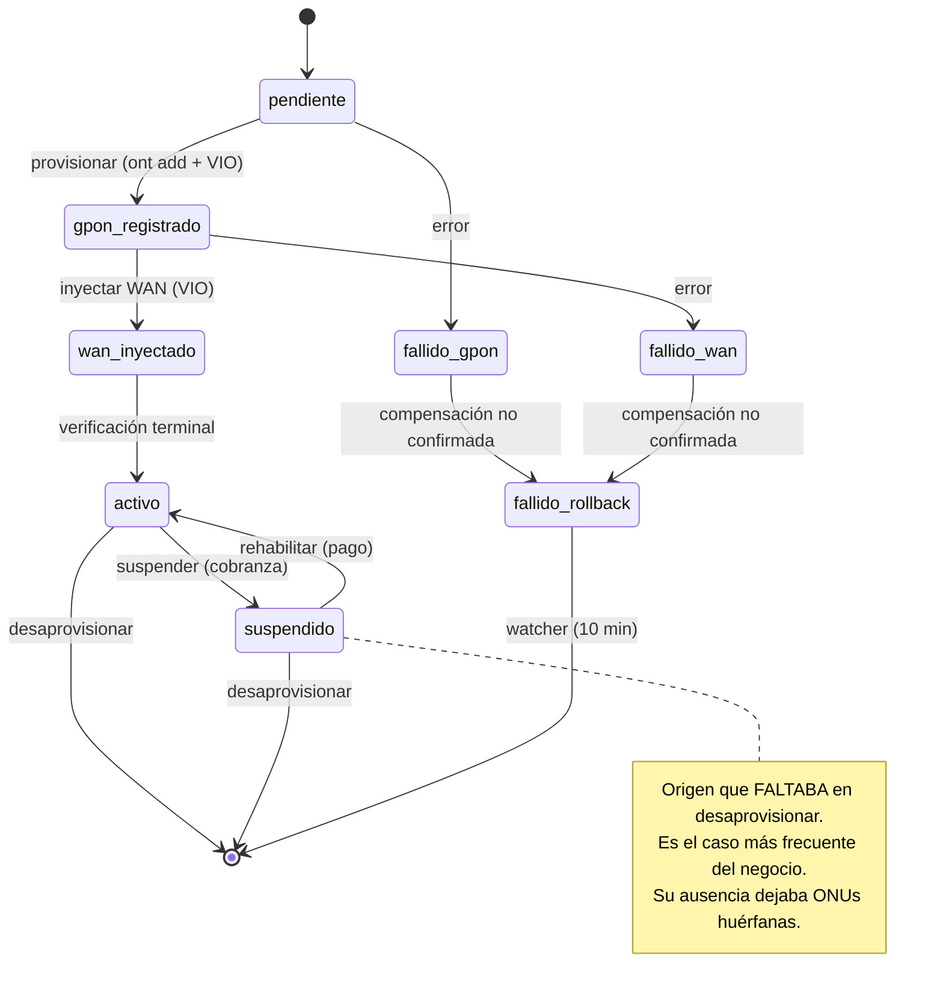

# DOM-001 — Modelo de Dominio

---

## 2. Control documental

| Campo | Valor |
|---|---|
| **Código** | DOM-001 · **Versión** 1.0 · **Estado** Vigente |
| **Autor** | Arquitectura · **Revisores** Pendientes de asignar |
| **Fecha** | 2026-08-06 · **Documento superior** CON-001, POL-001, AEM-001 |

## 3. Historial de cambios

| Versión | Fecha | Cambio | Motivo |
|---|---|---|---|
| 1.0 | 2026-08-06 | Emisión inicial | El lenguaje del negocio existía en el código pero nunca se había escrito; términos como "materializado", "carril" o "huérfana" no estaban definidos en ningún sitio |

## 4. Índice

1. Lenguaje Ubicuo · 2. Contextos Delimitados · 3. Entidades · 4. Objetos de Valor ·
5. Agregados · 6. Servicios de Dominio · 7. Eventos de Dominio · 8. Reglas de Negocio

## 5. Objetivo

Fijar el lenguaje del negocio y el modelo conceptual del ERP Datafast, de modo que un mismo
término signifique lo mismo en una conversación, en un ticket, en el código y en la base de datos.

## 6. Alcance

Los seis dominios implementados. **No incluye** conceptos de dominios ausentes (facturación
electrónica, inventario).

## 7. Definiciones y glosario

Ver §8.1 — este documento **es** el glosario del sistema.

---

# 8. Contenido

## 8.1 Lenguaje Ubicuo

Términos con significado preciso en ERP Datafast. **La columna "No confundir con" es la más
importante**: recoge las confusiones que ya han causado errores.

### Dominio Comercial

| Término | Definición | No confundir con |
|---|---|---|
| **Cliente / Abonado** | Persona o empresa titular del servicio | **Usuario** (que es personal del ISP) |
| **Contrato** | Unidad operativa del ERP: un servicio en una ubicación con un plan | El documento legal firmado |
| **Plan** | Catálogo de velocidad, precio y estrategia de limitación | La tarifa aplicada a una factura concreta |
| **Zona** | Agrupación comercial/geográfica de abonados | **Site** (emplazamiento físico de equipos) |
| **Site** | Nodo físico donde vive equipamiento (router, OLT) | **Zona** |
| **Segmento IPv4** | Bloque CIDR del que se asignan IPs a contratos | El pool de IPs de gestión de ONUs |
| **Prórroga / Promesa de pago** | Compromiso de pago que difiere el corte | Condonación de la deuda |

### Dominio Financiero

| Término | Definición | No confundir con |
|---|---|---|
| **Factura** | Comprobante emitido con un saldo propio | **Cargo pendiente** (aún no facturado) |
| **Saldo** | Lo que resta por cobrar de una factura | Deuda del contrato (suma de saldos + cargos) |
| **Aplicación** | Vínculo entre un pago y una factura | El pago en sí |
| **Extorno** | **Única** reversión legítima de un pago, auditada | Anulación de factura · eliminación de pago |
| **Adelanto / Saldo a favor** | Dinero del cliente sin factura que lo consuma | Nota de crédito |
| **Arqueo / Cierre de caja** | Cuadre de lo recaudado en un turno | Reporte de cobranza |
| **Ciclo de cobro** | Emisión → vencimiento → gracia → corte, **por cliente** | Mes calendario |
| **Gracia** | **Distancia entre vencimiento y corte** | Días añadidos al vencimiento ⚠️ |
| **Canal de pago** | Medio por el que entra el dinero | Cuenta receptora donde queda depositado |

> ⚠️ **La confusión de "gracia" causó un incidente real (05/08):** interpretarla como días
> sumados al vencimiento hacía que el corte cayera **antes** del vencimiento.

### Dominio Red / OSS

| Término | Definición | No confundir con |
|---|---|---|
| **OLT** | Equipo de central que termina las fibras (Huawei MA5800, V-SOL) | ONU |
| **ONU / ONT** | Equipo en casa del abonado | CPE genérico |
| **SN** | Número de serie de la ONU. **Su formato difiere entre OLT, GenieACS y SmartOLT** | MAC |
| **PON** | Puerto óptico de la OLT (`frame/slot/port`) | Board |
| **ONU-ID** | Identificador de la ONU **dentro de un puerto PON** (1–128) | SN — el ONU-ID solo es único por puerto |
| **Service-port** | Identificador del servicio en la OLT (rango ERP: 2000–3999) | ONU-ID |
| **Carril de gestión** | VLAN 1600 + IP + ACS URL que permite gestionar la ONU por TR-069 | La WAN de servicio del abonado |
| **ONU huérfana** | Existe en la OLT pero no en el ERP (o al revés) | ONU offline |
| **Drift** | Divergencia entre la config deseada y la observada | Fallo |
| **Materializado** | El cambio existe en el plano operativo, **verificado con lectura independiente** | **Aceptado** ⚠️ |
| **Aceptado** | El comando no devolvió error. **No implica materialización** | Materializado ⚠️ |
| **Baseline** | Configuración canónica exigida a una OLT, versionada e inmutable | Configuración actual de la OLT |
| **Rogue** | ONU que emite fuera de su ventana y degrada el PON | ONU offline |
| **NAP** | Caja de distribución con puertos para abonados | Mufa (caja de empalme) |
| **Mufa** | Caja de empalme donde se fusionan hilos | NAP |
| **Acometida** | Tramo de fibra desde la NAP hasta el domicilio | Segmento troncal |
| **CCD** | Archivo por cliente en OpenVPN que fija su IP (`ifconfig-push`) e `iroute` | Certificado |
| **`iroute`** | Declaración de **propiedad** de una subred por un router | Ruta de alcanzabilidad ⚠️ |

> ⚠️ **`iroute`:** a nivel OSPF todo se alcanza; a nivel ERP el modelo es de **propiedad**. Dos
> routers reclamando la misma red no falla ruidosamente: **da la respuesta equivocada con
> naturalidad**.

### Vocabulario transversal de operación

| Término | Definición |
|---|---|
| **VIO** | *Verified Infrastructure Operations* — verificar la materialización con lectura independiente |
| **Outbox** | Tabla donde se persiste la intención de mutar la red, en la transacción del negocio |
| **Saga** | Secuencia de pasos con compensación registrada antes de ejecutar |
| **Compensación** | Cómo deshacer un paso |
| **Sonda de verificación** | Cómo comprobar si un paso llegó a aplicarse |
| **`en_vuelo`** | Paso registrado y no confirmado: **sospechoso de haberse ejecutado** |
| **Estado terminal verificado** | Frontera de confirmación de un procedimiento (en FTTH: `activo`) |
| **Degradado** | Módulo que arrancó sin su recurso externo y lo declara |
| **Core Indestructible** | Módulos cuyo fallo al iniciar debe crashear el backend |
| **Reclamo atómico** | Tomar un trabajo de la cola marcándolo en una sola sentencia SQL |
| **Watcher** | Proceso periódico que restaura un invariante |
| **Puerta de estabilidad** | Criterios de negocio que deben cumplirse antes de continuar |

## 8.2 Contextos Delimitados

### Traducción entre contextos

Los puntos donde un mismo concepto cambia de nombre o de forma. **Cada uno es un lugar donde
puede perderse significado**:

| Origen | Destino | Traducción | Riesgo |
|---|---|---|---|
| Financiero → FTTH | "deuda vencida" → `ont deactivate` | Vía outbox | Si se pierde, el moroso sigue navegando |
| Comercial → FTTH | `contrato` → `ftth_onu_registro` | 1:1, invariante de atomicidad | Huérfana |
| FTTH → GenieACS | SN de la OLT → SN del ACS | **Formato distinto** (`sn_onu_normalizado`) | Dispositivo no encontrado |
| Comercial → WISP | `contrato` → secret PPPoE + queue + address-list | 1:N | Divergencia BD↔router |
| Planta → FTTH | `pe_nap_puerto` → acometida del contrato | Reserva con heartbeat | Puerto bloqueado |
| Red → Comunicación | Evento de red → notificación | Prioridad por tipo | Alerta perdida |

## 8.3 Entidades

Entidades con identidad propia y ciclo de vida. (81 entidades TypeORM; se listan las de dominio.)

### Comercial

| Entidad | Identidad | Ciclo de vida |
|---|---|---|
| `Cliente` | `id` + `(empresa_id, documento)` | prospecto → activo → suspendido → baja |
| `Contrato` | `id` + `(empresa_id, numero)` | borrador → activo → suspendido → baja |
| `Plan` | `id` + `(empresa_id, nombre)` | activo / inactivo |
| `SegmentoIpv4` | `id` + `(empresa_id, red_cidr)` | con contador de IPs usadas mantenido por trigger |
| `Zona`, `Site` | `id` | — |

### Financiero

| Entidad | Identidad | Ciclo de vida |
|---|---|---|
| `Factura` | `id` + serie/correlativo | emitida → vencida → pagada / anulada |
| `Pago` | `id` | registrado → verificado → conciliado / extornado |
| `PagoAplicacion` | `id` | Vincula pago ↔ factura |
| `PromesaPago` | `id` | vigente → cumplida / vencida / cancelada |
| `CargoPendiente` | `id` | pendiente → facturado |

### Red

| Entidad | Identidad | Ciclo de vida |
|---|---|---|
| `OltDispositivo` | `id` + `(empresa_id, ip_gestion) WHERE activo` | — |
| `FtthOnuRegistro` | `id` + `contrato_id` | pendiente → gpon_registrado → wan_inyectado → activo → suspendido → baja · `fallido_*` |
| `ContratoOnuConfig` | `contrato_id` | Con `revision` / `last_applied_revision` para drift |
| `Router` | `id` + `(empresa_id, ip_gestion) WHERE activo` | — |
| `VpnCliente` | `id` + `nombre_cert` | emitido → conectado → revocado |
| `OperacionWizard` | `id` | abierto → confirmado / anulado / anulacion_fallida |
| `PeNap`, `PeMufa`, `PeSplitter`, `PeFibraSegmento`… | `id` | Con máquina de estados propia |

### Plataforma

`Usuario` · `Rol` · `Permiso` · `Empresa` · `LicenciaEstado` · `AuditoriaLog` · `EntityVersion`

## 8.4 Objetos de Valor

Sin identidad propia; se definen por su valor y son inmutables.

| Objeto de valor | Composición | Dónde vive |
|---|---|---|
| **`ResultadoOperacion`** | clase + mensaje + detalle | `common/domain/` |
| **Ubicación de instalación** | latitud + longitud | `contratos` (fuente única vía CTE `PUNTOS_SERVICIO`) |
| **Coordenada GPON** | frame + slot + port + onu_id | `ftth_onu_registro` |
| **Credenciales de proveedor** | ip/puerto/usuario/clave o baseUrl/apiKey | En memoria durante la operación; **nunca se persisten ni se loguean** |
| **Ciclo de cobro** | día de emisión + vencimiento + gracia | `configuracion_facturacion` |
| **Especificación de velocidad** | download + upload + burst + estrategia de queue | Derivado del plan |
| **Rango de pool** | inicio + fin | Service-port, mgmt-IP, ONU-ID |
| **Presupuesto óptico** | atenuación acumulada por tramo | `planta-externa/domain/presupuesto-optico.ts` |
| **Lectura óptica** | rx_power + tx_power + timestamp | `metricas_onu_optical` |
| **Transición de estado** | origen[] + destino + significado | Máquinas de estados |

## 8.5 Agregados

### Agregado raíz principal: `Contrato`

**Reglas de consistencia del agregado:**

| # | Regla |
|---|---|
| 1 | La numeración es correlativa por empresa (`fn_generar_numero_contrato`) |
| 2 | Un contrato tiene **como máximo una ONU** (`uq_contratos_empresa_onu`) |
| 3 | La IP proviene de un segmento cuyo contador mantiene la base (`trg_update_ips_usadas`) |
| 4 | **Nunca existe `ont` en la OLT sin `ftth_onu_registro`, ni al revés** |
| 5 | Solo una operación FTTH en curso por contrato (`ftth_operacion_lock`) |
| 6 | Las transiciones de estado FTTH pasan por la máquina declarativa |

### Agregado `Factura`

Raíz `Factura` → aplicaciones de pago. **El saldo es propiedad exclusiva del agregado** y solo lo
escribe `AplicadorFacturaService` (más el trigger que lo sostiene en la base).

### Agregado `Pago`

Raíz `Pago` → aplicaciones + extorno + comprobante. **Un solo registrador**
(`PagosService.registrar`).

### Agregado `OltDispositivo`

Raíz `OltDispositivo` → boards, VLANs, perfiles, traffic tables, baseline asignado, los tres
pools, inventario de ONUs, preset.

**Regla:** una OLT admite **un solo proveedor**, fijado al registrarla.

### Agregado `OperacionWizard`

Raíz `OperacionWizard` → pasos con compensación y sonda. **Los pasos se registran antes de
ejecutarse** (write-ahead) y se compensan en orden LIFO.

## 8.6 Servicios de Dominio

Servicios que expresan reglas que no pertenecen a una sola entidad.

| Servicio | Regla que encapsula | Ubicación |
|---|---|---|
| `PoliticaFacturacionService` | **Fórmula única** del ciclo de cobro por cliente | `facturacion/` |
| `AplicadorFacturaService` | **Único escritor** del saldo | `facturacion/` |
| `DeudaPorContratoService` | Cálculo de deuda (**uno de cuatro caminos — ver §8.8 R-9**) | `facturacion/` |
| `FtthMaquinaEstados` | Transiciones legales e idempotencia derivada | `olt-nativo/domain/` |
| `PlantaExternaMaquinaEstados` | Transiciones de elementos de planta | `planta-externa/domain/` |
| `PresupuestoOptico` | Atenuación acumulada de un trayecto | `planta-externa/domain/` |
| `ResultadoOperacion` | Clasificación de resultados y su traducción al transporte | `common/domain/` |
| `OltComplianceRules` | Qué hace conforme a una OLT respecto de su baseline | `olt-nativo/compliance/` |
| `CapabilityEngine` | Filtrado de configuración según lo que soporta el dispositivo | `olt-nativo/capability/` |
| `VelocidadOrquestador` | Estrategia de limitación según plan y tipo de cliente | `mikrotik/services/velocidad/` |
| `CompensadorWizard` | Los 4 invariantes de la anulación (LIFO, parada, idempotencia, VIO) | `olt-nativo/services/` |
| `OltOperationRouter` | A qué proveedor va cada operación y cómo se clasifica | `olt-nativo/services/` |

## 8.7 Eventos de Dominio

### Eventos que expresan un hecho del negocio

| Evento | Significado | Emisor | Consecuencia |
|---|---|---|---|
| `cliente.created` | Un abonado entró en la cartera | `clientes` | Contacto en Google · bienvenida |
| `instalacion.completed` | El servicio quedó instalado | `contratos` | Evento de calendario |
| `contrato.suspended` | Un servicio se cortó | `workers` | Notificación · calendario |
| `pago.registered` | Entró dinero | `pagos` | Sincronización |
| `FTTH_ACTIVADO` | Una ONU alcanzó estado terminal verificado | `olt-nativo` | Notificación al abonado |
| `SERVICIO_SUSPENDIDO` / `_REACTIVADO` | Cambio de estado del servicio | `workers` | Notificación |
| `FACTURA_EMITIDA` | Se emitió comprobante | `facturacion` | Notificación |
| `PAGO_VENCE_HOY` / `PAGO_VENCIDO` | Hito del ciclo de cobro | `workers` | Aviso |
| `PRORROGA_CONCEDIDA` | Se difirió el corte | `promesas-pago` | Notificación |
| `ROUTER_CAIDO` / `_CONECTADO` | Cambio de estado de un equipo | `monitoreo` | **Alerta prioridad 1** |
| `EMISOR_CAIDO` / `_CONECTADO` | El canal de mensajería cambió de estado | `mensajeria` | Alerta prioridad 1 |
| `OUTBOX_RED_AGOTADO` | **Un comando de red agotó sus reintentos** | `outbox-red` | **Alerta al operador** |
| `ALERTA_EGRESO` | Gasto recurrente que requiere atención | `finanzas-opex` | Alerta prioridad 1 |
| `IPTV_LINE_CREADA` | Se creó una línea IPTV | `xui` | Notificación |
| `ftth.inventario.reobservar` | El inventario de ONUs quedó desactualizado | `olt-nativo` | Refresco |

### Restricción técnica de los eventos

> **El bus es in-process.** Un evento emitido en `api-core` **no llega** a `worker-auxiliary`.
> Los listeners no ejecutan trabajo: **encolan en Bull**, que sí cruza procesos.

**Consecuencia normativa:** un listener **nunca** debe ejecutar lógica de negocio directamente.
Si lo hiciera, su ejecución dependería del proceso donde se emitió el evento.

## 8.8 Reglas de Negocio

Reglas del dominio, con su mecanismo de garantía. **La última columna distingue lo garantizado de
lo confiado.**

### Comercial

| # | Regla | Garantía |
|---|---|---|
| R-1 | Un contrato pertenece a una empresa y su número es correlativo por empresa | Función + índice |
| R-2 | Un contrato tiene como máximo una ONU | Índice UNIQUE |
| R-3 | La IP de un contrato sale de un segmento, y el contador de usadas lo mantiene la base | Trigger |
| R-4 | Un cliente puede tener varios contratos | Modelo |
| R-5 | Dar de baja un cliente no borra su historial ni sus contratos anteriores | Servicio |

### Financiero

| # | Regla | Garantía |
|---|---|---|
| R-6 | **Un solo servicio registra pagos** | Test `frontera-dinero.spec.ts` |
| R-7 | **Un solo servicio aplica dinero a facturas** | Test |
| R-8 | **El extorno es la única reversión legítima de un pago** | Test `extorno.spec.ts` |
| R-9 | La deuda de un contrato se calcula **una sola vez** | ⚠️ **Incumplida: 4 implementaciones** |
| R-10 | El ciclo de cobro tiene una sola fórmula; **la gracia es la distancia vencimiento→corte** | Test |
| R-11 | No se aplica saldo a favor contra facturas anuladas | Test (guard de estado) |
| R-12 | Los correlativos **no** se generan con `MAX()+1` | Función de BD |
| R-13 | **Un timeout cobrando es `indeterminado`**: ni reintentar a ciegas ni reportar fallo | Test |

### Red — FTTH

| # | Regla | Garantía |
|---|---|---|
| R-14 | **Nunca un `ont` en la OLT sin `ftth_onu_registro`, ni al revés** | 2 watchers |
| R-15 | Las transiciones ilegales se rechazan; las repetidas son `ya_en_destino` (éxito) | Máquina + test |
| R-16 | Una operación mutante no se reporta aplicada sin verificación independiente | VIO |
| R-17 | Solo una operación FTTH en curso por contrato | `ftth_operacion_lock` (409) |
| R-18 | Un procedimiento no confirmado se anula por completo, en orden LIFO, parando al primer fallo no confirmado | `CompensadorWizard` |
| R-19 | Una ONU que el ERP no aprovisionó **se adopta, nunca se reconfigura** | ⚠️ **Solo por efecto lateral** |
| R-20 | Nunca se retira del pool una IP de gestión ocupada | ⚠️ Solo por código |
| R-21 | Una OLT admite un solo proveedor | Índice + guard |
| R-22 | Nunca se edita una versión publicada de un baseline | ⚠️ Solo por código |
| R-23 | No se crean VLANs sin consumidor | ⚠️ Solo por código |

### Red — WISP y conectividad

| # | Regla | Garantía |
|---|---|---|
| R-24 | **Las IPs VPN son permanentes**; solo se liberan al eliminar el router o cancelar el wizard | CCD + cron |
| R-25 | El `iroute` declara **propiedad**, no alcanzabilidad | ⚠️ Solo por directriz |
| R-26 | Un script VPN por wizard, **nunca regenerable** | Servicio |
| R-27 | Si el servicio Python no responde: OLT OFFLINE, **no tocar ONUs**, congelar estados | ⚠️ Solo por código |
| R-28 | El monitoreo **no modifica** estados de ONUs | ⚠️ Solo por código |

### Planta externa

| # | Regla | Garantía |
|---|---|---|
| R-29 | **Un hilo se fusiona una sola vez por extremo** | Restricción en BD |
| R-30 | Un puerto NAP reservado se libera por TTL si no se confirma | Heartbeat + barrido |

### Transversales

| # | Regla | Garantía |
|---|---|---|
| R-31 | Una notificación no se envía dos veces | Índice UNIQUE de idempotencia |
| R-32 | Un token de portal no accede a otro tenant | Test de aislamiento |
| R-33 | **Los datos de una empresa no son visibles para otra** | ⚠️ **Solo por convención (445 consultas)** |
| R-34 | Solo 400 y 404 son rechazos definitivos | Test |

> **Cinco reglas de este catálogo (R-9, R-19, R-25, R-33 y las marcadas "solo por código") no
> tienen mecanismo propio.** R-9 y R-33 son las de mayor consecuencia: cálculo de deuda divergente
> y fuga entre empresas. Ambas están priorizadas como críticas en RDM-001.

---

# 9. Referencias

CON-001 · AEM-001 · ARS-001 · DAT-001 · MOD-001/002/003 ·
`docs/directrices/` (invariantes y su verificación) · `docs/auditoria/` capítulo 6

---

# 10. Anexos

## Anexo A — Máquina de estados FTTH

## Anexo B — Términos que significan cosas distintas según el contexto

| Término | En Comercial | En Red |
|---|---|---|
| **Activo** | El contrato factura | La ONU está registrada, con WAN y verificada |
| **Suspendido** | No factura o está en mora | `ont deactivate` aplicado en la OLT |
| **Baja** | El contrato terminó | La ONU se borró de la OLT y se liberaron los pools |
| **Estado** | Situación comercial | Situación física verificada |

**Consecuencia:** un contrato puede estar comercialmente activo y su ONU no estarlo. Esa
diferencia **es** el problema que el ERP existe para resolver; nombrarlas igual sería el primer
paso para volver a confundirlas.

## Anexo C — Conceptos del dominio ISP que el ERP NO modela

| Concepto | Estado |
|---|---|
| Comprobante electrónico (CPE SUNAT, CDR, XML firmado) | No modelado |
| Material y stock de instalación | No modelado |
| Sustitución de equipo del abonado | **No modelado** — se improvisa como baja + alta |
| Ancho de banda contratado al carrier (upstream) | No modelado |
| SLA y penalizaciones | No modelado |
| Portabilidad entre tecnologías (WISP ↔ FTTH) | No modelado como transición |
