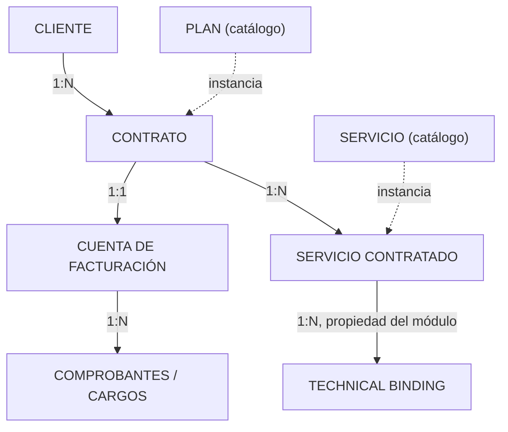
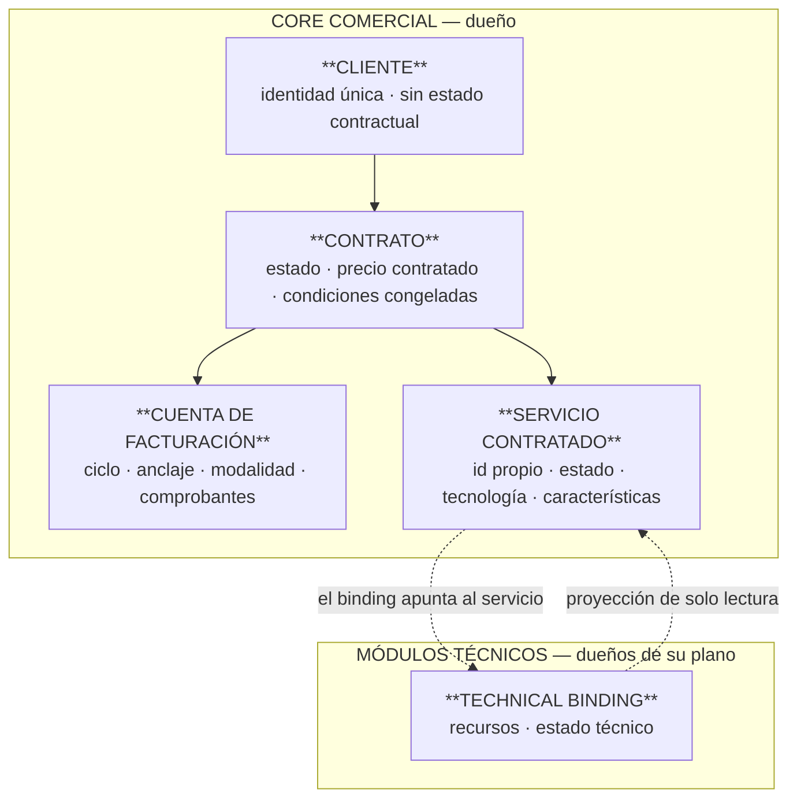

# E-0.2 — Modelo de Información del Core

## 1. Portada

**Proyecto:** ERP Datafast · **Código:** E-0.2 · **Versión:** 2.5
**Título:** Modelo de Información del Core — Cliente, Contrato, Cuenta, Servicio Contratado

---

## 2. Control documental

| Campo | Valor |
|---|---|
| **Estado** | ✅ **VIGENTE** — 2026-08-15. Ratificado por el propietario (§17) y revisado técnicamente (§18). **Exigible**, con el alcance de validación de §14 |
| **Naturaleza** | Directriz arquitectónica normativa — primer documento de **diseño** del Core |
| **Lugar en la jerarquía** (CON-001 §8.10) | **Nivel de Arquitectura**, junto a AEM · ARS · DOM · DAT · INT · SEC. Subordinado a CON-001 y POL-001; por encima de EST-001, GUI-001 y MOD-XXX |
| **Dependencias congeladas** | A · B · C · D-0.1 · D-0.2 · D-0.3 · E-0.1 |
| **Benchmark que lo respalda** | **ADR-036**, con insumo en [core-benchmark.md](../estudio/core-benchmark.md) |
| **Autor** | Arquitectura |
| **Ratifica** | Propietario del producto (D-1, D-2, D-12) |
| **Fecha de emisión** | 2026-08-14 |

---

## 3. Historial de cambios

| Versión | Fecha | Qué cambió y por qué |
|---|---|---|
| **2.5** | **2026-08-18** | **D-1 gana §7: qué crea un segundo Contrato.** La ficha fijaba la cardinalidad Cuenta↔Contrato y no decía **cuándo se ejerce** — pregunta que la Ola 4 abrió y que hoy no podía tener respuesta: la configuración de facturación vive en `clientes.facturacion_config`, así que dos Contratos de un abonado compartirían facturación y nada los distinguiría. Criterio, con TMF666 como fuente consultada (*«the account… includes a description of the bill structure»*): **un segundo Contrato existe cuando la estructura de facturación debe diferir** — no por una segunda dirección, ni por un servicio más. Nuevo invariante **E02-14**: esa configuración pertenece a la Cuenta, no al Cliente. **Granula, no centraliza:** de una configuración por abonado se pasa a una por Contrato |
| **2.4** | **2026-08-15** | **Revisión técnica del arquitecto → VIGENTE** (§18). Tres incoherencias detectadas y corregidas: **E02-12 contradecía a D-12**; **faltaban invariantes** para `CANCELADO` y `RECHAZADO` (PF-3: un invariante sin mecanismo no es un invariante); y **D-2 invadía el catálogo sin declararlo** — ahora justificado como precisión de B §41/§45/§54 en **D-2 §4.1**, con la excepción recogida en §6 |
| **2.3** | **2026-08-15** | **Ratificación.** D-1, D-2 y D-12 ratificadas por el propietario (§17). **`CANCELADO` incorporado a la máquina de estados del Contrato** por **ADR-037**, que modifica A §16 por revisión arquitectónica explícita. El documento pasa a **Ratificado por el propietario** |
| **2.2** | **2026-08-15** | **Comparativa dirigida de D-2 y D-12**, pedida por el propietario antes de ratificarlas. **Las dos cambian.** (a) **D-2 se reescribe**: la obligatoriedad **no vive en la instancia sino en el Plan**, y **no es un booleano sino una cardinalidad** (TMF620 v5.0.0). `requerido` pasa a **derivarse** de `mínimo ≥ 1`, y la terna resuelve de paso **B §54** («perfiles incluidos = 2»), que con el booleano habría necesitado un campo inventado. De `Extendido` a **`Adoptado`**. (b) **D-12 se precisa**: el sector **sí** guarda saldo agregado, pero como **lista de saldos tipados con periodo de validez** (TMF666 `AccountBalance`) — la forma de una proyección, no de una autoridad. Y se separa el **saldo del comprobante** (existe, derivado, mecanismo del pago parcial) del **agregado** (no existe), porque la redacción anterior podía leerse como que prohibía ambos. De `Adoptado` a **`Adaptado`**. (c) §14 pasa a **ocho de trece** con fuente |
| **2.1** | **2026-08-15** | Ratificaciones del propietario: **D-1 confirmada** con su consecuencia —corte por contrato— y **D-26 cerrada** en E-0.3. Sin cambios de contenido |
| 1.0 | 2026-08-14 | Emisión inicial. Doce fichas, D-1…D-12 |
| **2.0** | **2026-08-14** | **Reemisión tras la verificación transversal y ADR-036.** (a) Se **retira la taxonomía propia** de divergencias y se adopta la de **PD-13** — hallazgo F-5: existían ya dos taxonomías y se inventó una tercera. (b) Se añade la **tabla de correspondencias** con TM Forum que **PD-13 condición 4** exigía — F-8. (c) **D-1 se reclasifica**: no era divergencia, es **Adoptado** — el estándar admite ambas cardinalidades (ADR-036 §4.1). (d) **D-3 incorpora el análisis frente al recorte de R-036** — F-9. (e) **D-5 se reclasifica**: su mitad comercial es conforme, no aportación propia — ADR-036 §4.4. (f) Se declara el tratamiento de `empresa_id` — F-10. (g) Se añade el **estado de validación por ficha**: qué tiene fuente y qué no. (h) Forma completa según 00-INDICE §6 y versionado §8 — F-6 |

---

## 4. Índice

5. Objetivo · 6. Alcance · 7. Glosario · 8. Método · 9. Correspondencias · 10. Notas de
interpretación · 11. Fichas · 12. Modelo consolidado · 13. Invariantes · 14. Estado de validación ·
15. Lo que no define · 16. Referencias

---

## 5. Objetivo

Definir **qué es cada pieza del Core comercial**: identidad, atributos, cardinalidad, estados y
reglas de derivación.

Las etapas A a E-0.1 congelaron fronteras, ownership y gobierno —quién manda sobre qué—. Ninguna
define de **qué**. El corpus nombra entidades —Servicio Contratado, Cuenta de Facturación, Technical
Binding— sin darles identidad. Sin eso el diseño no es implementable.

### 5.1 Premisa

> **El ERP construido no es referencia de este diseño.** Es el inventario de lo que habrá que
> migrar. Ninguna ficha se justifica por «así está hecho hoy»; cuando el código actual aparece, es
> como consecuencia a corregir, nunca como argumento.

---

## 6. Alcance

**Dentro:** Cliente · Contrato · Cuenta de Facturación · Servicio Contratado · la referencia al
Technical Binding · identidad y correlación · derivación de estados · condiciones económicas
congeladas.

**Fuera:** catálogo de Planes y Servicios (congelado en B) · capacidades y su firma (E-0.3) ·
Fulfillment (E-0.3) · dominios técnicos y direccionamiento (E-0.4) · esquema físico, nombres de
tabla y migración.

> **Única excepción, declarada:** **D-2 §4.1** pone la cardinalidad en la composición Plan ↔ Servicio.
> Es **precisión de B §41/§45/§54**, no modificación del catálogo, y allí se justifica una por una.

---

## 7. Glosario

| Término | Significado en este documento |
|---|---|
| **Servicio Contratado** | Prestación concreta que un Contrato incluye, con identidad y estado propios. Equivale al servicio *de cara al cliente* del estándar |
| **Technical Binding** | Materialización de un Servicio Contratado en un dominio técnico. Equivale al servicio *de cara al recurso*. **Su dueño es el módulo** |
| **Cuenta de Facturación** | Unidad económica del Contrato: ciclo, anclaje, modalidad y comprobantes |
| **Estado terminal verificado** | Estado destino confirmado por lectura independiente. Frontera de confirmación de todo procedimiento |
| **Conjetura razonada** | Decisión coherente con modelos maduros **pero sin fuente consultada**. No es conformidad |

---

## 8. Método

Cada decisión es una **ficha** con seis apartados. Sin ficha completa no entra al diseño.

| Paso | Qué exige |
|---|---|
| **1. Enunciado** | Una frase. Qué se decide |
| **2. Contraste** | Fuente consultada, o declaración explícita de que no la hay |
| **3. Clasificación** | Taxonomía **PD-13** (§8.1) |
| **4. Verificación contra congelados** | Qué puntos de A/B/C/D/E toca, y si los **confirma, precisa o contradice** |
| **5. Consecuencias** | Qué queda prohibido, y qué cambia en la operación |
| **6. Reapertura** | Qué haría falta para reabrirla |

### 8.1 Taxonomía — se usa la que ya existe

**La versión 1.0 inventó una tercera taxonomía cuando ya había dos vigentes.** Corregido:

| Eje | Valores | De dónde sale |
|---|---|---|
| **Relación con el modelo del sector** | `Adoptado` · `Adaptado` · `Extendido` | **PD-13** |
| **Gravedad de una desviación** | Nivel `A` · `B` · `C` | **00-INDICE §7.3** |

`Adoptado` = se toma la estructura del estándar. `Adaptado` = misma estructura, regla propia, con el
motivo escrito. `Extendido` = el sector no lo contempla; se construye y **se declara extensión
propia, sin disfrazarla de estándar**.

### 8.2 Regla de fuentes

**Ninguna conformidad se declara sin comparar** (ADR-030 §4.1 regla 3). Cada ficha dice si su
contraste es **fuente consultada** —con la especificación y versión— o **conjetura razonada**. El
recuento está en §14.

---

## 9. Correspondencias con el modelo del sector

*(PD-13 condición 4 · detalle y citas textuales en ADR-036 §4.2)*

| Concepto Datafast | Entidad del estándar | Fuente | PD-13 |
|---|---|---|---|
| Cliente | `Party` / `Customer` | TMF632 / TMF629 — **no consultada** | Adaptado |
| **Contrato** | `Product` | TMF637 v4.0.0 | **Adoptado** |
| **Cuenta de Facturación** | `BillingAccount` | TMF666 v5.0.0 | **Adoptado** |
| **Servicio Contratado** | `Service` *customer facing* | TMF638 v4.0.0 | **Adoptado** |
| **Technical Binding** | `Service` *resource facing* | TMF638 v4.0.0 | **Adaptado** — nombre propio y dueño declarado |
| Recursos del dominio | `Resource` | TMF639 v4.0.0 | Adoptado |
| Características comerciales | `serviceCharacteristic` | TMF638 v4.0.0 | Adoptado |

```
Estándar: Product ──► Service (CFS) ──► Service (RFS) ──► Resource
Datafast: Contrato ─► Servicio Contratado ─► Technical Binding ─► recursos del dominio
```

**El Technical Binding no es un nivel de más: es el RFS con otro nombre.** Se conserva el nombre
propio porque expresa lo que el estándar no dice —que su dueño es el módulo técnico, no el Core— y
porque «servicio de cara al recurso» no se entiende en una sala de operaciones.

---

## 10. Notas de interpretación entre documentos congelados

Ninguno se modifica: se **precisa** el anterior con el posterior, y queda constancia.

| Tensión | Lectura adoptada |
|---|---|
| **A §72** atribuye al Servicio Contratado «credenciales» y «recursos asociados»; **D-0.3 §9/§16** y **E-0.1 §15** los dan al módulo técnico | A §72 es anterior al modelo de ownership. Se lee como **relación, no propiedad**: el Servicio se relaciona con esos recursos vía Binding. **El Core no almacena recursos técnicos** |
| **C §10** titula «Servicio = unidad técnica»; **E-0.1 §9** lo sitúa en el Core comercial | C §10 habla de que cada servicio tiene su propio fulfillment, no de propiedad. El Servicio Contratado es **comercial** |

**Regla general:** el documento posterior precisa al anterior y la precisión se escribe. Ante una
**contradicción real**, la ficha se detiene y se abre revisión arquitectónica (E-0.1 §36).

---

## 11. Fichas de decisión

### D-1 — La Cuenta de Facturación es 1:1 con el Contrato

**1.** Cada Contrato tiene exactamente una Cuenta de Facturación. Un abonado con tres contratos
recibe **tres comprobantes**. La consolidación queda prohibida por diseño.

**2. Contraste — fuente consultada.** TMF637 v4.0.0: `Product.billingAccount` es **referencia a un
objeto único**. TMF666 v5.0.0: `BillingAccount` **no tiene campo** que apunte al producto, y **nada
limita** cuántas cuentas tiene un titular. → *El estándar fija «un producto, una cuenta» y calla
sobre cuántos productos comparten cuenta.*

**3. Clasificación: Adoptado.** Se toma la estructura tal cual. **La v1.0 la clasificó como
«divergencia restrictiva» y era incorrecto**: no hay divergencia, porque el estándar admite las dos
cardinalidades (ADR-036 §4.1).

**4. Congelados.** **Confirma** A §13, A §14, A+B-I09, C-I19. **Precisa** A §13: la Cuenta es
**entidad con identidad propia**, no sinónimo del Contrato — tiene atributos que el Contrato no
tiene y puede sobrevivir a la baja mientras queden saldos. **Supersede ADR-035 §4.1** solo en la
cardinalidad; el resto de ADR-035 se conserva.

**5. Consecuencias.**
- **El corte es por contrato.** Un abonado puede tener el Contrato A cortado y el B navegando
  (C §46, A §23).
- No existe «deuda del cliente» como dato: es suma derivada, solo para presentación.
- Un pago se imputa a **una** cuenta; el pago «para todo» se descompone al registrarlo.
- **Se pierde**, declarado: la agrupación de contratos en un comprobante.
- **No se pierde:** «boleta en casa y factura en el negocio, mismo titular» queda cubierto — son
  contratos distintos, luego cuentas distintas.

**6. Reapertura.** ADR propio y revisión de A §13. Disparador realista: exigencia regulatoria o
demanda comercial sostenida.

**7. Qué crea un segundo Contrato** *(precisión de v2.5, 2026-08-18 — la ficha fijaba la
cardinalidad y no decía cuándo se ejerce)*.

> **Existe un segundo Contrato cuando la estructura de facturación debe ser distinta:** otro día de
> pago o ciclo, otro tipo de comprobante, otro pagador, otra moneda, prepago frente a pospago.

**Contraste — fuente consultada.** TMF666, `BillingAccount.schema.json`: *«A party account used for
billing purposes. **It includes a description of the bill structure (frequency, presentation media,
format and so on)**. It is a specialization of entity PartyAccount.»* Y `ratingType`: *«whether the
account follows a specific payment option such as prepaid or postpaid»*. **La Cuenta ES la
estructura de facturación**; si esa estructura debe diferir, hacen falta dos cuentas — y por §1, dos
Contratos.

**NO crean un segundo Contrato:** una segunda dirección de instalación · una segunda tecnología ·
un servicio adicional. Dos domicilios de un mismo abonado que se pagan en la misma factura son **un
Contrato con dos Servicios Contratados**.

**Se ordena, no se deriva.** Abrir un Contrato es un acto comercial explícito del operador, nunca
consecuencia de un alta técnica — coherente con **D-5**. El comportamiento por defecto al añadir un
servicio es **unirlo al Contrato existente**.

**Consecuencia estructural, y es la razón de que esto no tuviera respuesta antes:** hoy la
configuración de facturación vive en `clientes.facturacion_config` —`diaPago`, `diasAntesEmision`,
`diasGracia`, con `origen: 'cliente' | 'heredada'`—, de modo que dos Contratos de un mismo abonado
compartirían obligatoriamente su facturación y **nada los distinguiría**. Esa configuración pertenece
a la **Cuenta**, y bajarla es trabajo de la Ola 4 (**E02-14**).

> **Esto no centraliza configuración, la granula.** Hoy un abonado tiene **una** configuración de
> facturación; después tendrá **una por Contrato**. La directriz de que la configuración por abonado
> es deliberada se cumple mejor, no peor.

---

### D-2 — La obligatoriedad de un servicio vive en el Plan, y se expresa como cardinalidad

*(Reescrita en v2.2 tras consultar TMF620 — la v2.0 la situaba en el Servicio Contratado y usaba un
booleano propio. **Ambas cosas eran incorrectas.**)*

**1.** La composición **Plan ↔ Servicio** declara, por cada servicio incluido, una terna:
**cantidad por defecto · mínimo · máximo**.

- **`requerido` NO es un campo: se deriva** de `mínimo ≥ 1`.
- Al contratar, la composición **se copia** al Servicio Contratado, como toda condición congelada
  (D-8, D-10, A §26).
- **Hoy todo plan nace con `mínimo = 1`** y sin interfaz para cambiarlo.

**2. Contraste — fuente consultada.** TMF620 v5.0.0:

> **`BundledProductOffering`:** *«Represents a containment of a product offering within another
> product offering, including specification of cardinality (e.g. **is the bundled offering
> mandatory**, how many times can it be instantiated in the parent product, etc.).»*
>
> **`BundledProductOfferingOption`:** *«A set of numbers that specifies the lower and upper limits for
> a ProductOffering that can be procured as part of the related BundledProductOffering. **Values can
> range from 0 to unbounded**»* — `numberRelOfferDefault`, `numberRelOfferLowerLimit`,
> `numberRelOfferUpperLimit`.

**Qué corrige respecto de la v2.0:**

| | v2.0 | Ahora |
|---|---|---|
| **Dónde vive** | Instancia (Servicio Contratado) | **Oferta (Plan)** — que un servicio sea bloqueante es característica de lo que se vende, igual para todos sus abonados |
| **Forma** | Booleano propio | **Terna de cardinalidad del estándar** |

**Y resuelve un requisito que no tenía sitio:** *«el Plan puede definir perfiles incluidos = 2»*
(B §54) es exactamente `cantidad por defecto = 2`. Con el booleano, «2 perfiles» habría necesitado un
campo inventado aparte.

**3. Clasificación: Adoptado.** *(La v2.0 era `Extendido` por creer que no había referencia.)*

**4. Congelados.** **Confirma** C §21, **B §54**, A+B-I05, A+B-I07 y **A+B-I22** (el wizard deriva su
configuración de los servicios seleccionados). **Respeta** C-010, C §27 y **PI-5**: no se construye
motor de opcionalidad; la terna es dato del catálogo, no lógica.

**4.1 Esta ficha toca el catálogo, y hay que decirlo** *(hallazgo de la revisión técnica,
2026-08-15)*. La terna vive en la **composición Plan ↔ Servicio**, que es territorio de **B** —y §6
de este documento declara el catálogo fuera de alcance—. **No es contradicción y no requiere ADR**,
por tres razones verificables:

| B dice | Y por tanto |
|---|---|
| **B §41** — *«PLAN N ↔ N SERVICIOS»* | La relación existe; la terna es **atributo de esa relación**, no una entidad nueva |
| **B §45** — *«El Plan puede establecer valores comerciales»* | Poner valores por servicio en el Plan es lo que B ya prevé |
| **B §54** — *«El Plan puede definir perfiles incluidos = 2»* | **Ese es exactamente `cantidad por defecto = 2`.** La terna no añade una capacidad: le da forma a una que B ya exigía y que no tenía dónde vivir |

**Se declara como precisión de B, no como modificación.** Si alguien leyera esto como cambio del
catálogo, el camino sería el de ADR-037: revisión explícita. No hizo falta, y queda escrito por qué.

**5. Consecuencias.**
- **Hoy: si cualquier servicio del plan falla, el contrato no se activa.** Internet operativo con
  IPTV caído deja el contrato en pendiente y el fulfillment en PARCIAL (C §20). El técnico no cierra
  el trabajo y la fecha de activación se corre.
- El día que vendas un servicio no bloqueante, se pone `mínimo = 0` **en el plan**. La regla de
  activación (D-5) no cambia: ya lee la terna.
- El histórico es reconstruible: un contrato de 2026 sabrá decir si aquel servicio caído era
  bloqueante, porque la condición se copió al contratar.

**6. Reapertura.** Se abre la interfaz del catálogo, no el modelo.

---

### D-3 — El Servicio Contratado es una entidad de primera clase

**1.** Tiene **identidad, estado y ciclo de vida propios**. No es un atributo del Contrato.

**2. Contraste — fuente consultada.** TMF637 v4.0.0: *«A product offering procured by a customer…
A product is realized as one or more service(s) and / or resource(s).»* TMF638 v4.0.0: `Service` es
clase base con `category` = *«customer facing or resource facing»*.

**3. Clasificación: Adoptado.**

**4. Congelados.** **Confirma** A §15, A+B-I16, C §10, C-I07, C-I08, E-0.1 §9. **Precisa** lo que
ninguno decía: que la distinción exige **identificador propio**.

**4.1 Frente al recorte de R-036** *(hallazgo F-9, obligatorio dejarlo escrito)*. PD-13 registra que
al evaluar R-036 se recortaron dos de tres niveles: *«`Subscription → Service → Service Instance`
son tres nombres para una cosa cuando no hay composición de producto»*. D-3 introduce un nivel
intermedio, y **debe explicar por qué esta vez sí**:

| R-036 | D-3 |
|---|---|
| Tres nombres de **una misma** entidad | **Dos entidades que el estándar separa** (`Product` ≠ `Service`) |
| *«cuando no hay composición de producto»* | B §40 y C §20 establecen lo contrario: un Plan compone varios Servicios |
| Sin caso inexpresable | **Caso inexpresable:** fulfillment PARCIAL (Internet ✓ / IPTV ✓ / Streaming ✗) no tiene sujeto sin él — PD-13 condición 2 |

**Por qué es la decisión central.** Sin identidad del Servicio Contratado: el Binding vuelve a
colgarse del Contrato —el colapso que D-0.3 §48 registra como defecto—; C §20 y C-I09 son
inexpresables; y cambiar la tecnología de un servicio obligaría a tocar una entidad comercial por un
motivo técnico.

**5. Consecuencias.** Un Contrato **no** tiene tecnología, ni ONU, ni IP, ni credenciales. Dar de
baja un servicio de un contrato multiservicio es operación de primera clase.

**6. Reapertura.** Ninguna previsible: sería volver al colapso de capas.

---

### D-4 — El Technical Binding es 1:N por dominio, y su referencia vive en el módulo

**1.** Un Servicio Contratado puede tener **varios** Bindings, uno por dominio técnico. **La
referencia la almacena el módulo dueño**, no el Core. Ejemplo: Internet por fibra = binding con
Acceso FTTH + Network + Planta.

**2. Contraste — fuente consultada.** TMF638 v4.0.0: `supportingService` y `supportingResource` son
**arrays**; *«only Service of type RFS can be associated with Resources»*.

**3. Clasificación: Adaptado.** Estructura del estándar (CFS→RFS→Resource); nombre propio y **dueño
declarado**, que el estándar no fija.

**4. Congelados.** **Confirma** D-0.3 §7, §8, D03-05, E-0.1 §17. **Precisa D-0.3 §8**, que dibuja
`Service → technicalBindingId` en el lado del Core: ese dibujo supone 1:1. Con 1:N, guardar la
referencia en el Core lo obligaría a mantener datos ajenos, contra D03-06 y D03-08. **La flecha se
invierte: el binding apunta al servicio.** El Core pregunta, y a lo sumo conserva una proyección de
solo lectura (D-0.3 §30), que no le otorga autoridad.

**5. Consecuencias.** El Core nunca hace `JOIN` contra tablas técnicas. Un servicio sin binding es
legítimo (streaming, cable — C §18, C §19). Cambiar de tecnología es sustituir bindings.

**6. Reapertura.** Más de un binding del mismo dominio se amplía dentro del módulo.

---

### D-5 — La activación se deriva desde abajo; la suspensión y la baja se ordenan desde arriba

**1.**

```
ACTIVACIÓN   (evidencia)   Servicios ──► Contrato ──► (presentación) Cliente
SUSPENSIÓN   (decisión)    Contrato  ──► Servicios ──► Bindings
BAJA         (decisión)    Contrato  ──► Servicios ──► Bindings ──► liberación
```

| Transición del Contrato | Condición |
|---|---|
| → `ACTIVO` | **Todos** los servicios requeridos en `activo`. Ningún estado técnico participa |
| permanece `PENDIENTE_ACTIVACION` | Al menos un requerido no está `activo` |
| → `SUSPENDIDO` | Decisión comercial. Ordena la suspensión de sus servicios |
| → `BAJA_DEFINITIVA` | Decisión humana explícita (C, D-10). Ordena baja y liberación |
| → `CANCELADO` | **Solo desde `PENDIENTE_ACTIVACION`** (ADR-037). El contrato nunca llegó a activo y la contratación se deja sin efecto. Terminal |

> **`CANCELADO` ≠ `BAJA_DEFINITIVA`.** El primero es un contrato que **nunca prestó servicio**; el
> segundo, uno que lo prestó y se retiró. Cancelar un contrato que estuvo activo está **prohibido**:
> para eso existe la baja. La distinción no es cosmética — un cancelado **no es rotación de
> abonados**, y contarlo como baja infla el churn con clientes que nunca lo fueron.

El Cliente **no tiene estado**: se responde con filtros derivados (A §24).

**2. Contraste — fuente consultada, parcial.** TMF637 v4.0.0 tiene `suspended` en
`ProductStatusType`; TMF638 v4.0.0 **no** lo tiene en `ServiceStateType`. → *En el estándar la
suspensión pertenece al plano comercial, no al del servicio.* La **derivación de la activación**
desde los servicios requeridos **no** se verificó.

**3. Clasificación: Adoptado** en que la suspensión es comercial · **Extendido** en el mecanismo de
derivación. *(La v1.0 declaró «aportación propia» el conjunto: era una pretensión de más —
ADR-036 §4.4.)*

**3.1 Adaptación declarada.** `ServiceStateType` incluye `feasibilityChecked`, `designed` y
`reserved` — fases previas que nuestro `pendiente_activacion` **colapsa en una**. Es simplificación
deliberada, y por PD-13 queda escrita.

**4. Congelados.** **Confirma** A §23, A §24, C §21, C-I06, C-I15, D-0.2 §17, E-0.1 §28. **Precisa**
C §21 nombrando al evaluador, y añade la dirección contraria, que C no trataba.

**5. Consecuencias.** **No existe columna de estado en Cliente.** Un servicio caído no suspende el
contrato: produce divergencia reportada. La reactivación es simétrica.

**6. Reapertura.** Solo contradiciendo C-I15: exige revisión arquitectónica.

---

### D-6 — Identidad y correlación

**1.** Cada entidad del Core tiene identificador propio, opaco y estable. El Core **no almacena
identificadores de proveedor** como autoridad.

| Identificador | Dueño | Qué identifica |
|---|---|---|
| `cliente_id` | Core | La identidad comercial |
| `contrato_id` | Core | El acuerdo. **Un solo significado en todo el sistema** |
| `cuenta_id` | Core | La unidad económica del contrato |
| `servicio_contratado_id` | Core | **Sujeto de toda operación técnica** |
| `binding_id` | Módulo | La materialización en un dominio |
| `operacion_id` | Quien la origina | La intención, inmutable entre reintentos |
| `onu_id`, `device_id`, `service_port`… | Proveedor | **Nunca en el Core** |

**2. Contraste — conjetura razonada.** Coherente con la separación identificador de negocio ↔
identificador de recurso del estándar; **no verificada en el esquema**.

**3. Clasificación: Adoptado** por posición.

**4. Congelados.** **Confirma** D-0.3 §16, §21-§24, D03-11, D03-12, D03-13. **Corrige** el defecto
de D-0.3 §48: `contrato_id` con semánticas distintas.

**5. Consecuencias.** Toda operación técnica se dirige a un `servicio_contratado_id`. El payload se
basta a sí mismo (D-0.3 §21). Ninguna columna del Core guarda identificadores de fabricante.

**6. Reapertura.** Ninguna.

---

### D-7 — Cardinalidades del Core

**1.**



| Relación | Cardinalidad |
|---|---|
| Cliente → Contrato | 1:N, incluido 0 (A §22) |
| Contrato → Cuenta | 1:1 (D-1) |
| Contrato → Servicio Contratado | 1:N, mínimo 1 |
| Contrato → Plan | N:1 **por referencia** (A §11, A+B-I04) |
| Servicio Contratado → Servicio de catálogo | N:1 por referencia |
| Servicio Contratado → Binding | 1:N, incluido 0 |

**2. Contraste — fuente consultada.** TMF637 v4.0.0: *«realized as one or more service(s)»*.

**3. Clasificación: Adoptado.**

**4. Congelados.** **Confirma** A §8, §11, §12, §13, B §41, B §63, A+B-I01…I06, C-I08.

**5. Consecuencias.** Modificar el catálogo nunca altera un contrato vivo (A+B-I26): la referencia
es al Plan, las condiciones están congeladas en el Contrato (D-8).

**6. Reapertura.** La única discutible era Contrato→Cuenta, cerrada en D-1.

---

### D-8 — Las condiciones económicas se congelan en el Contrato y en el cargo

**1.** El Contrato conserva el precio contratado y las condiciones aplicables al contratar. Cada
cargo conserva la **base de cálculo**. Mínimo: precio contratado · modalidad · anclaje del ciclo ·
base de prorrateo · política de redondeo.

**2. Contraste — conjetura razonada.** Coherente con la exigencia contable de reconstruir un
documento sin depender de los maestros actuales. **Sin fuente consultada.**

**3. Clasificación: Adoptado.**

**4. Congelados.** **Confirma** A §25, §26 (regla A-002), §33, §61, A+B-I08, A+B-I26, D-07 y
**PD-14**, cuya fórmula se reproduce sin cambios.

**5. Consecuencias.** El prorrateo se redondea **una sola vez, al final** (A §32). Una factura de
2026 se reconstruye en 2028. Un ciclo completo no se prorratea (A §34), y esa condición queda
registrada en el cargo.

**6. Reapertura.** Ninguna: es requisito contable.

---

### D-9 — La tecnología es atributo del Servicio Contratado, nunca del Plan

**1.** Fibra, radio u otra tecnología de acceso es atributo del **Servicio Contratado**.

**2. Contraste — conjetura razonada.** El estándar sitúa la tecnología en la capa de realización;
**no verificado en el esquema**.

**3. Clasificación: Adoptado.**

**4. Congelados.** **Confirma** B §56, C §14, C-I10, C-I11, A+B-I18, A+B-I20.

**5. Consecuencias.** Un mismo Plan se entrega por fibra o por radio sin duplicar catálogo. Cambiar
la tecnología es cambiar bindings (D-4).

**6. Reapertura.** Ninguna.

---

### D-10 — Las características comerciales se instancian en el Servicio Contratado

**1.** Velocidad de bajada y subida, número de perfiles y demás valores del Plan se **copian** al
Servicio Contratado al contratar. No se leen del Plan en ejecución.

**2. Contraste — fuente consultada.** TMF638 v4.0.0: `serviceCharacteristic` es array que
*«characterize this service»* — las características viven en la instancia de servicio.

**3. Clasificación: Adoptado.**

**4. Congelados.** **Confirma** B §45, B §47, A+B-I21, A+B-I26, C §11. **Precisa** B §45, que
describía los valores sin decir dónde viven una vez contratados.

**5. Consecuencias.** Subir la velocidad del Plan **no** cambia lo que reciben los abonados vivos.
La orden al módulo lleva la velocidad en el payload, no un `plan_id` que el módulo tendría que
resolver (D-0.3 §21).

**6. Reapertura.** Ninguna.

---

### D-11 — El Cliente es un rol, y hoy solo existe uno

**1.** Identidad comercial única con documento único. **No** se separa todavía la persona (`Party`)
del rol.

**2. Contraste — conjetura razonada.** El estándar separa `Party` del rol `Customer`; **TMF632 y
TMF629 no se consultaron**.

**3. Clasificación: Adaptado**, con criterio de extensión escrito: el día que la misma persona
necesite un segundo rol —técnico, proveedor, referido— se extrae `Party` y Cliente pasa a ser un rol
sobre ella. El modelo actual no lo impide: la identidad ya es única por documento.

**4. Congelados.** **Confirma** A §6, §7 (regla A-001), §9, §69, §70, E-0.1 §7. **Respeta** C-010 y
B §86.

**5. Consecuencias.** Buscar por documento devuelve **un** cliente con sus N contratos. Contratar de
nuevo reutiliza el cliente existente (A §67, §68).

**6. Reapertura.** La aparición de un segundo rol. El camino está escrito.

---

### D-12 — El saldo del comprobante es derivado; el agregado no existe

*(Precisada en v2.2 tras consultar TMF666 y ERPNext. La v2.0 decía «la deuda no existe como
atributo», redacción que se prestaba a prohibir también el saldo del comprobante — y eso habría sido
un error.)*

**1.** Dos niveles, con reglas distintas:

| Nivel | Regla |
|---|---|
| **Por comprobante** | El saldo **existe y es derivado**: calculado, **nunca escrito a mano**. Es el mecanismo por el que un pago parcial se refleja |
| **Agregado** (contrato, cuenta, cliente) | **No existe como dato.** Se calcula al consultar |

La mora tampoco es un estado: se deriva de comprobantes vencidos más las condiciones de cobranza.

**2. Contraste — fuente consultada.** TMF666 v5.0.0:

> **`Account.accountBalance`:** *«List of balances for the account, for example regular postpaid
> balance, deposit balance, write-off balance.»*
>
> **`AccountBalance`:** *«Balances linked to the account»*, con **`balanceType`** —*«deposit balance,
> disputed balance, loyalty balance, receivable balance...»*— y **`validFor`**.

ERPNext: el saldo pendiente vive **en la factura** y lo reduce el asiento de pago —*«The payment
reduces the invoice's outstanding amount»*—.

**El hallazgo que cambia la ficha:** el sector **sí** guarda saldo agregado, pero **nunca como un
número suelto**: es una **lista de saldos tipados, cada uno con su periodo de validez**. Esa es la
forma de una **proyección**, no de una autoridad. La v2.0 ya permitía una proyección declarada; lo
que le faltaba era **la forma**, y el estándar se la da.

**3. Clasificación: Adaptado** — se adopta la estructura (saldos tipados con validez) y se restringe
la regla: **hoy no se materializa ninguno**.

**4. Congelados.** **Confirma** A §35, §36, §37, D-01 de A §76 y **ADR-019**. **Precisa** que lo que
el incidente **A-4** condenó no fue el residual del documento, sino el **agregado**
`contratos.deuda_total`, mantenido a mano por cuatro caminos distintos.

**5. Consecuencias.**
- **Nadie ajusta una deuda escribiendo una cifra.** Para cambiar lo que alguien debe se **emite un
  documento** —nota de crédito, ajuste—, auditado y con motivo. Esa rigidez es el mecanismo.
- Si algún día el rendimiento exige materializar un agregado, se adopta la forma de `AccountBalance`:
  **tipado y con periodo de validez**, declarado proyección. **Un total desnudo queda prohibido.**
- Con D-1, la deuda se calcula por cuenta. «Lo que debe Juan Pérez» es una suma de presentación, no
  un dato que exista.
- La reactivación mira la deuda **vencida relevante** para la suspensión, no toda la futura (A §37).

**6. Reapertura.** Ninguna. Un dato con dos escritores es el defecto que este cuerpo documental
existe para impedir.

---

### D-13bis — `empresa_id` no forma parte del modelo del Core

*(Ficha añadida en v2.0 — hallazgo F-10. Numerada `bis` para no alterar la numeración continua
D-1…D-39 usada por E-0.3 y E-0.4.)*

**1.** Las entidades del Core **no llevan discriminante de empresa** en su definición conceptual.

**2. Contraste — conjetura razonada.** El estándar no modela el operador dentro de sus propias
entidades: el operador **es** el sistema.

**3. Clasificación: Adoptado.**

**4. Congelados.** **Confirma ADR-031**: el ERP es mono-empresa por diseño, una instalación una
empresa. **Y PD-13 lo respalda por escrito**: *«mono-empresa es la forma del producto»*, no el
estado de una instalación.

**5. Consecuencias.**
- **PS-04** (*«toda consulta filtra por `empresa_id`»*) **sigue vigente mientras la columna exista**
  en el esquema actual. Este documento no la deroga: declara que el **modelo objetivo** no la
  contempla.
- Retirar la columna es trabajo de migración, con su propio ADR. **Prohibido** retirarla por
  interpretación de esta ficha.

**6. Reapertura.** Si el producto pasara a alojar varias empresas por instalación — lo que
contradiría ADR-031 y exigiría revisarlo primero.

---

## 12. Modelo consolidado



**Lo que el Core NO contiene, en ningún caso:** ONU · service-port · PON · VLAN · IP · queue ·
credenciales de proveedor · identificadores de fabricante · estado técnico como autoridad.

---

## 13. Invariantes E-0.2

| # | Invariante |
|---|---|
| **E02-01** | Un Contrato tiene exactamente una Cuenta de Facturación |
| **E02-02** | Ningún comprobante mezcla cargos de dos contratos |
| **E02-03** | El Servicio Contratado tiene identidad propia y es el sujeto de toda operación técnica |
| **E02-04** | Un Servicio Contratado puede tener 0..N Technical Bindings, uno por dominio |
| **E02-05** | La referencia entre binding y servicio la almacena el módulo, nunca el Core |
| **E02-06** | El Contrato se activa solo si **todos** sus servicios requeridos están activos. «Requerido» **se deriva** de la cardinalidad del Plan (`mínimo ≥ 1`), no es un campo de la instancia |
| **E02-07** | La suspensión y la baja se ordenan desde el Contrato; nunca las provoca un estado técnico |
| **E02-08** | El Cliente no tiene estado contractual almacenado |
| **E02-09** | `contrato_id` tiene un único significado en todo el sistema |
| **E02-10** | El Core no almacena identificadores ni recursos de proveedor como autoridad |
| **E02-11** | Las condiciones económicas y las características comerciales se congelan al contratar |
| **E02-12** | El saldo del **comprobante** existe y es **calculado**, nunca escrito a mano. El saldo **agregado** —contrato, cuenta, cliente— **no existe como dato**. La mora tampoco es un estado |
| **E02-13** | `CANCELADO` solo procede desde `PENDIENTE_ACTIVACION`. Un contrato que estuvo activo **no se cancela**: se da de baja (ADR-037) |
| **E02-14** | La estructura de facturación —día de pago, ciclo, gracia, tipo de comprobante, pagador— vive en la **Cuenta**, nunca en el Cliente. Un Cliente con dos Contratos tiene dos configuraciones independientes (D-1 §7) |

---

## 14. Estado de validación por ficha

**Regla:** este documento **no pasa a Vigente en bloque**. Pasa por fichas, a medida que cada una
tenga fuente (ADR-036 §4.5).

| Ficha | Contraste | Fuente |
|---|---|---|
| **D-1** | **Fuente consultada** | TMF637 v4.0.0 · TMF666 v5.0.0 |
| **D-3** | **Fuente consultada** | TMF637 v4.0.0 · TMF638 v4.0.0 |
| **D-4** | **Fuente consultada** | TMF638 v4.0.0 |
| **D-5** | **Fuente consultada** (parcial) | TMF637 · TMF638. La derivación, no verificada |
| **D-7** | **Fuente consultada** | TMF637 v4.0.0 |
| **D-10** | **Fuente consultada** | TMF638 v4.0.0 |
| **D-2** | **Fuente consultada** | TMF620 v5.0.0 — cardinalidad del bundle |
| **D-12** | **Fuente consultada** | TMF666 v5.0.0 (`AccountBalance`) · ERPNext |
| D-6 · D-8 · D-9 · D-11 · D-13bis | Conjetura razonada | — |

**Ocho de trece con fuente.** D-8 tiene además evidencia propia (PD-14), que es respaldo real pero no
benchmark.

**Nota:** D-2 y D-12 se consultaron **a petición del propietario**, que no quiso ratificarlas sin
comparativa. **Las dos cambiaron** — D-2 de sitio y de forma, D-12 en su alcance. Es el mejor
argumento a favor de la regla PD-11 que hay en todo este trabajo.

---

## 15. Lo que E-0.2 NO define

Nombres de tabla, columnas y esquema físico · firma de las capacidades y forma del resultado
(**E-0.3**) · Fulfillment (**E-0.3**) · autenticación entre fronteras (**E-0.3**) · dominio de
direccionamiento (**E-0.4**) · fronteras de los dominios técnicos (**E-0.4**) · plan de migración.

---

## 16. Referencias

**Corpus congelado:** A · B · C · D-0.1 · D-0.2 · D-0.3 · E-0.1
**Normativa propia:** CON-001 §8.6, §8.8, §8.10 · POL-001 PD-11, PD-13, PD-14, PA-12 ·
00-INDICE §6, §7.3, §8
**Decisiones:** ADR-030 · ADR-031 · ADR-032 · ADR-034 · **ADR-035** (superseded en §4.1) ·
**ADR-036**
**Evidencia:** [core-benchmark.md](../estudio/core-benchmark.md) ·
[verificación transversal](E-0.2-4-verificacion-transversal.md)
**Especificaciones consultadas:** TMF637 v4.0.0 · TMF638 v4.0.0 · TMF666 v5.0.0 (URLs en el estudio
§1)

---

## 17. Registro de ratificación

**Ratificado por el propietario del producto el 2026-08-15.**

| Ficha | Qué se ratificó | Nota |
|---|---|---|
| **D-1** | Un contrato, una cuenta, un comprobante. **Corte por contrato**: el A cortado, el B navegando | Decidido por el propietario y **confirmado contra fuente** (ADR-036 §4.1): el estándar admitía ambas cardinalidades, luego era decisión de negocio |
| **D-2** | La obligatoriedad vive en el **Plan** y se expresa como **cardinalidad**; `requerido` se deriva de `mínimo ≥ 1` | **Ratificada tras comparativa exigida por el propietario**, que cambió la ficha de sitio y de forma |
| **D-12** | Saldo del comprobante derivado; **agregado no existe**. Ajustar deuda exige emitir documento | **Ratificada tras comparativa**, que precisó su alcance en dos niveles |

**Y una decisión sobre corpus congelado**, en **ADR-037**: A §16 incorpora `CANCELADO` para el
contrato que nunca llegó a activarse. Reflejado en **D-5**.

---

## 18. Revisión técnica

**Realizada el 2026-08-15. Resultado: VIGENTE.**

No es un sello: se buscaron incoherencias introducidas por los cambios del mismo día, y **aparecieron
tres**. Las tres están corregidas en esta versión.

| # | Hallazgo | Corrección |
|---|---|---|
| **1** | **E02-12 contradecía a D-12.** Decía *«no existen como atributo mantenido»*, y D-12 acababa de establecer que el saldo del **comprobante** sí existe —calculado—. Un invariante que contradice su propia ficha es peor que no tenerlo | Reescrito en dos niveles: comprobante calculado, agregado inexistente |
| **2** | **Faltaban invariantes para las decisiones del día.** `CANCELADO` y `RECHAZADO` se añadieron a las máquinas de estados sin invariante que los protegiera — y **PF-3** dice que *un invariante sin mecanismo no es un invariante* | Añadidos **E02-13** y **E03-17** |
| **3** | **D-2 invadía el catálogo sin declararlo.** La terna vive en la composición Plan ↔ Servicio, y §6 declara el catálogo fuera de alcance. Sin justificarlo, sería exactamente la «vía de los hechos» que ADR-037 prohibió el mismo día | **D-2 §4.1**: se declara **precisión** de B §41/§45/§54, una por una, y §6 recoge la excepción |

**Comprobaciones adicionales, sin hallazgo:** ninguna referencia al desaparecido campo
`requerido_para_activacion` sobrevive en el corpus; la taxonomía propia retirada solo aparece en
notas históricas que explican el cambio; las trece fichas tienen los seis apartados del protocolo.

**A partir de aquí el documento no se modifica para acomodar la implementación: la implementación se
adapta a él.** Lo que puede cambiar es su **alcance de validación** (§14), a medida que se consulten
las fuentes pendientes.
