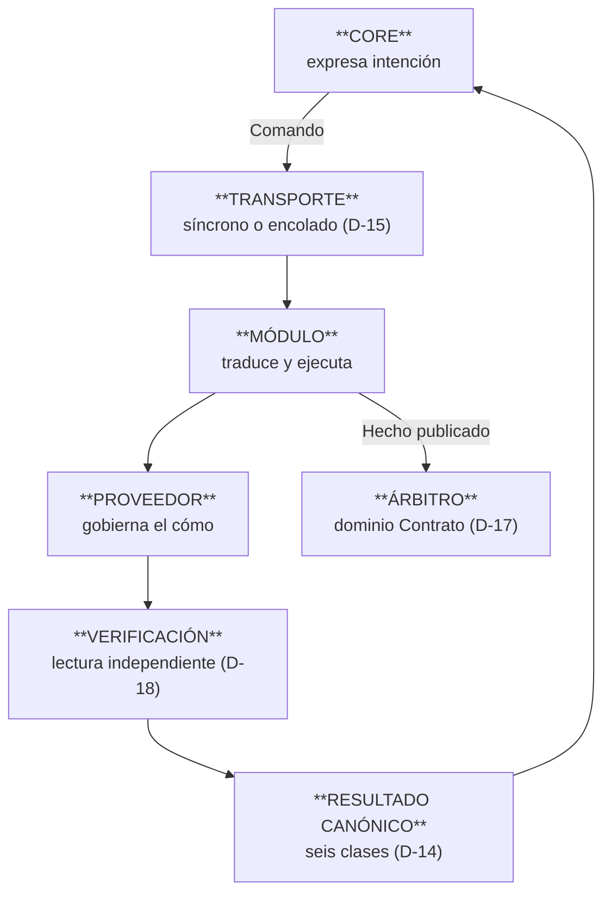

# E-0.3 — Contratos de Capacidad y Ejecución

## 1. Portada

**Proyecto:** ERP Datafast · **Código:** E-0.3 · **Versión:** 2.5
**Título:** Contratos de Capacidad y Ejecución — qué pide el Core, qué le responden, quién decide

---

## 2. Control documental

| Campo | Valor |
|---|---|
| **Estado** | ✅ **VIGENTE** — 2026-08-15. Ratificado por el propietario (§15) y revisado técnicamente junto a E-0.2 §18. **Exigible**, con el alcance de validación de §12 |
| **Naturaleza** | Directriz arquitectónica normativa — segundo documento de **diseño** |
| **Lugar en la jerarquía** (CON-001 §8.10) | **Nivel de Arquitectura**. Subordinado a CON-001 y POL-001 |
| **Dependencias congeladas** | A · B · C · D-0.1 · D-0.2 · D-0.3 · E-0.1 · **E-0.2** |
| **Benchmark que lo respalda** | **ADR-036**, con insumo en [core-benchmark.md](../estudio/core-benchmark.md) |
| **Fecha de emisión** | 2026-08-15 |

---

## 3. Historial de cambios

| Versión | Fecha | Qué cambió y por qué |
|---|---|---|
| **2.5** | **2026-08-18** | **R-6 resuelto — [ADR-038](ADR-038-contrato-de-lectura-y-veredicto-de-conjunto.md).** El hueco que la Ola 1 destapó con cuatro casos reales eran **dos** contratos sin definir, no uno. (a) **D-14 gana §7**: el veredicto de un conjunto es el **peor de sus partes**, con orden de dominancia declarado, y `aplicado` puede llevar **`evidencia`** — la lectura que E03-05 ya obliga a hacer, tipada y con instante, nunca un saco genérico ni recursos de proveedor. (b) **D-15 gana el contrato de la consulta** (`valor` · `observado_en` · `fuente`, con `no_disponible` / `no_existe`): una lectura **nunca** devuelve `indeterminado`. (c) **§6 de D-14 queda respondida en negativo:** no hace falta una séptima clase — `partial` es del agregado, y así lo dice TM Forum, cosa que D-16 ya había adoptado sin sacar la consecuencia. Tres invariantes nuevos (E03-21/22/23). Corrección nacida de las fuentes: la frescura de una observación se expresa como **magnitud**, no como etiqueta (RFC 9111 `Age`, K8s `observedGeneration`) |
| **2.4** | **2026-08-16** | **Acoplamiento de módulos de terceros** — nueva ficha **D-26bis** y tres invariantes (E03-18/19/20). Cierra el hueco de **D-0.2 §26**, que admitía versiones distintas «siempre que sean compatibles» **sin definir compatible**: ahora compatible es `smooth`, según la clasificación del kit de conformidad de TM Forum. Añade la conformidad por comparación contra definición de referencia, y la validación de lo que llega de un módulo — con el matiz declarado de que esa última regla es **inferencia** sobre ASVS 2.2.1/2.2.2, no cita |
| **2.3** | **2026-08-15** | **Revisión técnica del arquitecto → VIGENTE.** Realizada junto a E-0.2 §18. Hallazgo aplicado aquí: **faltaba invariante para `RECHAZADO`** — se añade **E03-17**, que fija que `RECHAZADO` significa «no se intentó» y no es reintentable, frente a `ERROR`, que sí lo es |
| **2.2** | **2026-08-15** | **Ratificación y cierre de la desviación.** (a) **D-26 ratificada** por el propietario: la suspensión por mora afecta solo al contrato moroso. (b) **`RECHAZADO` incorporado a los estados del proceso** por **ADR-037**, cerrando la desviación nivel C de §3.1 por revisión arquitectónica explícita. El documento pasa a **Ratificado por el propietario** |
| **2.1** | **2026-08-15** | **Cierre de fuentes de E-0.3** (cuarta ronda del estudio). (a) **D-13 gana fuente y cambia de forma**: TMF640 v3.0.0 expresa la intención como **estado deseado del recurso**, no como catálogo de verbos. Se añade **§1.1 — cada capacidad nombra un estado destino**, que resuelve una tensión interna que nadie había notado: el documento era imperativo al pedir (D-13) y declarativo al comprobar (D-19). Reclasificada de `Extendido` a **`Adaptado`**. (b) **D-16 y D-17 ganan el `Monitor`** de TMF640: la ejecución asíncrona es entidad consultable con eventos propios. (c) **D-18 gana segunda fuente**. (d) **D-24 pasa a fuente consultada** con OWASP ASVS 5.0 V12.3.3-12.3.5, que **exige más** de lo que la ficha pedía; se declara además que *«la red interna no es autorización»* es **inferencia propia**, no cita (H-14). (e) §12 explica por qué las fichas que siguen sin fuente **no la tienen por naturaleza**: son patrones de ingeniería, no modelos de negocio |
| **2.0** | **2026-08-15** | **Reemisión tras la verificación transversal y ADR-036.** (a) Taxonomía **PD-13** en lugar de la propia — F-5. (b) **D-16 pasa de conjetura a fuente consultada**: TMF641 v3.0.0 confirma `partial` y la dependencia entre tareas con cita textual. (c) **Nuevo hallazgo H-7b**: a **C §5** le falta `rechazado`; se registra como desviación nivel C y se abre revisión. (d) **D-19 incorpora las cuatro dimensiones de estado del recurso** (H-8, TMF639 v4.0.0). (e) Se añade el **estado de validación por ficha**. (f) Forma completa según 00-INDICE §6 y §8 — F-6 |
| 1.0 | 2026-08-14 | Emisión inicial. Catorce fichas, D-13…D-26 |

---

## 4. Índice

5. Objetivo · 6. Alcance · 7. Glosario · 8. Método · 9. La forma de toda interacción ·
10. Fichas · 11. Invariantes · 12. Estado de validación · 13. Lo que no define · 14. Referencias ·
15. Condición de ratificación

---

## 5. Objetivo

E-0.2 definió **qué es** cada pieza del Core. E-0.3 define **cómo se le habla al resto del sistema**:
qué puede pedir el Core, qué le responden, qué ocurre cuando la respuesta no llega, y quién decide
que un contrato está activo.

El corpus congelado nombra estas piezas sin modelarlas: D-0.3 §18 lista seis intenciones sin decir
qué devuelven; C §25-§26 describe tareas y dependencias sin persistirlas; C §21 fija la regla de
activación sin nombrar a quién le toca evaluarla; y D-0.2 §25 delegó la autenticación entre
fronteras a D-0.3, que no la trató. **E-0.3 cierra los cuatro.**

**Premisa:** la de E-0.2 §5.1 — el ERP construido es inventario de migración, no argumento de
diseño.

---

## 6. Alcance

**Dentro:** catálogo de capacidades · resultado canónico · criterio síncrono/encolado · Fulfillment
(proceso, tarea, dependencia) · árbitro de la activación · verificación de materialización ·
reconciliación · reintentos y agotamiento · anulación de procedimientos no confirmados ·
concurrencia · confianza entre fronteras · trazabilidad.

**Fuera:** qué capacidad implementa cada dominio (**E-0.4**) · transporte concreto, colas,
endpoints, formato de payload · plan de migración.

---

## 7. Glosario

| Término | Significado |
|---|---|
| **Capacidad** | Intención que el Core puede expresar a un dominio. Solo existen las del catálogo (D-13) |
| **Resultado canónico** | Una de las seis clases de D-14. Nunca un código de transporte |
| **Materializado** | Confirmado por lectura independiente. Distinto de *aceptado* (D-18) |
| **Fulfillment** | Proceso persistido que materializa un Servicio Contratado mediante tareas |
| **Divergencia (drift)** | Diferencia entre estado deseado y estado observado (D-19) |

---

## 8. Método

Protocolo de fichas de **E-0.2 §8**, con la taxonomía **PD-13** (`Adoptado` · `Adaptado` ·
`Extendido`) y los niveles `A/B/C` de 00-INDICE §7.3 para desviaciones. Cada ficha declara si su
contraste es **fuente consultada** o **conjetura razonada**; el recuento está en §12.

**Numeración continua:** E-0.2 cerró en D-12. Este documento va de **D-13** a **D-26**.

---

## 9. La forma de toda interacción



1. El Core dice **qué**; el módulo decide **cómo** (D-0.3 §12, §39).
2. El módulo **informa**; el Core **decide** (E-0.1 §28).
3. Ningún resultado se expresa en vocabulario de transporte (**PA-02**).

---

## 10. Fichas de decisión

### D-13 — El Core expresa intenciones de un catálogo cerrado

**1.** El Core solo pide lo que figure en el catálogo. Toda capacidad tiene como sujeto un
`servicio_contratado_id`.

| Capacidad | Naturaleza |
|---|---|
| `PROVISIONAR_ACCESO` · `SUSPENDER_ACCESO` · `REACTIVAR_ACCESO` · `ACTUALIZAR_CONFIGURACION` · `DESAPROVISIONAR_ACCESO` · `RECONCILIAR_ESTADO` | Comando encolado |
| `RESERVAR_RECURSO` · `LIBERAR_RECURSO` | Comando encolado *(detalle en E-0.4)* |
| `CONSULTAR_ESTADO_TECNICO` | Consulta síncrona |
| `NOTIFICAR` | Comando encolado *(Notification ≠ Messaging, E-0.1 §20)* |

**1.1 Cada capacidad nombra un estado destino, no un procedimiento** *(v2.1 — hallazgo H-12)*.

> `SUSPENDER_ACCESO` significa **«lleva este servicio al estado suspendido»**, no «ejecuta el
> procedimiento de suspensión».

Sin esta regla, E-0.3 sería **imperativo al pedir** (D-13) y **declarativo al comprobar** (D-19,
estado deseado frente a observado), que son dos modelos distintos conviviendo sin costura. Con ella,
`ya_en_destino` (D-14) deja de ser un caso especial que hay que acordarse de contemplar y pasa a ser
**consecuencia del modelo** — que es justo lo que **PA-04** exige: *la idempotencia se deriva, no se
implementa*.

**2. Contraste — fuente consultada.** TMF640 v3.0.0: *«Service Activation and Configuration API goal
is to provide the ability to activate and configure Services»*, y sus operaciones son **CRUD sobre el
recurso servicio** —`POST /service` (activar), `PATCH /service/{id}` (configurar), `DELETE
/service/{id}` (desaprovisionar)— con la intención expresada en `state`, `isServiceEnabled`,
`hasStarted` y `startMode`.

> **El estándar no tiene catálogo de verbos: expresa la intención como estado deseado del recurso.**
> Nuestro catálogo es una capa imperativa encima, y por eso necesita §1.1.

**3. Clasificación: Adaptado** — misma finalidad, forma imperativa declarada, con todo verbo obligado
a nombrar su estado destino. *(La v2.0 la clasificaba `Extendido` por creer que no había referencia;
la hay, y difiere en la forma, no en el propósito.)*

**4. Congelados.** **Confirma** D-0.3 §18, D-0.2 §4, C-001 de C §52, E-0.1 §14-§15, **PA-03** y
**PA-04**. **Precisa** D-0.3 §18 fijando el sujeto —que E-0.2 D-6 obliga a que sea el Servicio
Contratado— y añadiendo la regla de §1.1, que D-0.3 no contemplaba.

**5. Consecuencias.** Añadir una capacidad es decisión de arquitectura, no un método nuevo. Un
módulo que necesite ser invocado fuera del catálogo no se invoca: se amplía el catálogo o se
rediseña la operación.

**6. Reapertura.** El catálogo crece por ADR.

---

### D-14 — Toda capacidad responde con un resultado canónico de seis clases

**1.**

| Clase | Significa | Qué hace quien la recibe |
|---|---|---|
| `aplicado` | Ejecutado **y verificado** (D-18) | Continuar |
| `ya_en_destino` | El destino ya estaba alcanzado | **Éxito.** Continuar |
| `no_aplica` | Nada que hacer para este servicio | Éxito vacío |
| `rechazado_definitivo` | Reintentar da lo mismo | Detener y escalar |
| `reintentable` | Fallo recuperable | Reintentar con backoff |
| `indeterminado` | **No se sabe si se aplicó** | Verificar antes de actuar |

**Regla:** la lista de rechazos definitivos es explícita y corta. Ante la duda, `reintentable`.

**2. Contraste — conjetura razonada.** Los principios —distinguir «no ocurrió» de «no sé si
ocurrió», y permanente de transitorio— son de modelos de idempotencia **no citados**. La
enumeración cerrada es propia.

**3. Clasificación: Extendido.** *(Respaldo propio: **PA-02** y **PA-06** la exigen; coincidir con
la propia constitución es respaldo, no benchmark.)*

**4. Congelados.** **Confirma** D-0.3 §23, §26, D03-11, D03-14, D03-15, C-I14. **Precisa** D-0.3
§18: sin forma de respuesta, §23 y §26 no son verificables.

**5. Consecuencias.** Un no-op idempotente nunca se reejecuta como fallo. Un lock ocupado nunca es
veredicto. `indeterminado` **obliga** a reconciliar y a informar «aceptado, sin confirmar».

**6. Reapertura.** Una séptima clase exige ADR y demostrar que ninguna de las seis la cubre.
**Respondida en negativo por [ADR-038](ADR-038-contrato-de-lectura-y-veredicto-de-conjunto.md)
(2026-08-18): no hace falta.** Los cuatro casos que la Ola 1 encontró fuera de las seis clases eran
dos contratos distintos —la consulta (D-15) y la evidencia de verificación—, más el éxito parcial,
que pertenece al agregado (D-16) y no a la capacidad.

**7. Dos precisiones de ADR-038.**

**7.1 El veredicto de un conjunto es el peor de sus partes.** Cuando un llamador abre una operación
en N partes, el agregado se **deriva**, no se inventa:

```
indeterminado  >  reintentable  >  rechazado_definitivo  >  aplicado / ya_en_destino
```

El orden lo pone **lo que no se puede perder**: `indeterminado` domina porque reintentar a ciegas es
la acción peligrosa; `reintentable` va antes que `rechazado_definitivo` porque descartar trabajo que
podía salir bien es irreversible. Una capacidad que puede aplicarse parcialmente **debe enumerar qué
aplicó** — sin esa lista no hay reanudación ni compensación (E03-07).

**7.2 `aplicado` puede llevar `evidencia`.** E03-05 ya obliga a sostener `aplicado` en una lectura
independiente; esa lectura produce un estado observado que hoy se descarta. `evidencia` es **eso y
solo eso**: tipada por capacidad, con su instante, y **nunca** un canal genérico ni un vehículo para
identificadores de proveedor (E02-10 · E04-10). Un payload que no procede de verificar no es
evidencia: es un dato de conveniencia, y para esos la respuesta sigue siendo no.

---

### D-15 — Encolado por defecto; síncrono solo para consultas

**1.** Todo comando que modifique el plano técnico viaja **encolado y persistido**. Solo las
consultas son síncronas.

> *Si «esto tiene que ocurrir aunque el destino esté caído» es cierto, no es una llamada ni un
> evento: es trabajo persistido.*

**2. Contraste — conjetura razonada**, con **norma propia directa**: **PA-19** enuncia el criterio
palabra por palabra, y **PA-07** exige el outbox para toda mutación de hardware.

**3. Clasificación: Adoptado** respecto de la norma propia.

**4. Congelados.** **Confirma** D-0.3 §20, D-0.2 §20, D-0.2 §14, D03-19. **Precisa D-0.3 §19**, que
presenta Command/Query/**Event** como alternativas del mismo rango: un evento no sobrevive a la
caída de un proceso, luego lo que §20 describe **no es un evento**. Los tres patrones se conservan,
con su garantía declarada:

| Patrón | Cuándo | Garantía |
|---|---|---|
| **Consulta** | Lectura | Ninguna: se repregunta |
| **Evento** | Reacción en el mismo proceso que **puede perderse sin consecuencia** | Ninguna. El oyente no ejecuta lógica: encola (**PA-16**) |
| **Comando encolado** | Debe ocurrir aunque el destino esté caído | Durabilidad, reclamo atómico, TTL, reintento |

**5. Consecuencias.** El transporte **no gobierna dominios** (D03-19). El comando es autosuficiente
(D-0.3 §21). Una intención registrada sobrevive al reinicio y al despliegue.

**6. Reapertura.** Ninguna. El transporte concreto puede cambiar sin tocar la ficha.

**7. Contrato del resultado de una consulta**
([ADR-038](ADR-038-contrato-de-lectura-y-veredicto-de-conjunto.md), 2026-08-18). La ficha separaba
consultas de mutaciones y declaraba su garantía —**«ninguna: se repregunta»**— pero no decía qué
forma tiene lo que devuelven. Una consulta responde con:

| Campo | Qué transporta |
|---|---|
| `valor` | El dato, **tipado por capacidad** |
| `observado_en` | **Cuándo** se observó. Magnitud, no etiqueta |
| `fuente` | De dónde salió: plano técnico, almacén propio, cálculo del Core |

Y **dos** desenlaces de fallo, no seis:

| Clase | Significa | Qué hace quien la recibe |
|---|---|---|
| `no_disponible` | La fuente no responde o está degradada | **Se repregunta cuando haga falta.** No es `reintentable`: nadie reintenta una lectura por su cuenta |
| `no_existe` | El sujeto consultado no existe | Definitivo |

**Una consulta NUNCA devuelve `indeterminado`.** Esa clase existe porque una mutación **pudo haberse
aplicado**; una lectura que falla no aplicó nada. Admitirla aquí vaciaría de significado la única
clase que obliga a un humano a ir a mirar. *(Inferencia propia declarada en ADR-038 §6: se deduce de
esta misma ficha y de D-14, ninguna fuente externa lo enuncia.)*

**Por qué un instante y no una etiqueta:** la única pregunta que un llamador necesita responder es
*¿es bastante fresco para lo que voy a hacer?* Pintar la señal de una ONU tolera un minuto; decidir
un corte, no. Una categoría no responde eso. Es la forma que usan RFC 9111 (`Age`) y Kubernetes
(`observedGeneration`), y en este ERP tiene nombre propio: la BD dice `activo` y la OLT dice `rogue`.

---

### D-16 — El Fulfillment es una entidad persistente con tareas y dependencias

**1.** La materialización de un Servicio Contratado es un **proceso persistido** de **tareas** con
**dependencias declaradas**. No es un procedimiento en código: es estado consultable.

**Estados del proceso** (C §5, ampliado por **ADR-037**): `PENDIENTE` · `EN_PROCESO` · `PARCIAL` ·
`BLOQUEADO` · `ERROR` · **`RECHAZADO`** · `COMPLETADO` · `CANCELADO`.

> **`RECHAZADO` ≠ `ERROR` ≠ `CANCELADO`.** `ERROR` significa **se intentó y falló**. `RECHAZADO`
> significa **no se intentó**: sin cobertura, sin recursos, datos inválidos. `CANCELADO` es decisión
> de quien pidió; `RECHAZADO` es veredicto de quien iba a ejecutar. `RECHAZADO` es terminal y **no
> reintentable** — se corresponde con `rechazado_definitivo` de D-14.
**Estados de la tarea:** `pendiente` · `en_vuelo` · `aplicada` · `fallida` · `agotada` ·
`compensada`.

**Cada tarea guarda tres cosas:** cómo ejecutarla · **cómo deshacerla** · **cómo verificar si llegó
a aplicarse**.

**2. Contraste — fuente consultada.** TMF641 v3.0.0 y TMF640 v3.0.0:

| Lo que la ficha declara | Cita textual |
|---|---|
| El proceso admite estado **PARCIAL** | `partial` es valor de `ServiceOrderStateType` (TMF641) |
| Las tareas declaran **dependencias** | `relationshipType`: *«dependency if the order item needs to be not started until another order item is complete»* (TMF641) |
| La ejecución asíncrona es **entidad consultable** | TMF640 expone `/monitor` —`listMonitor`, `retrieveMonitor`— con `monitorCreateNotification`, `monitorStateChangeNotification` y `monitorDeleteNotification` |

**El estándar tiene nombre para lo que aquí llamamos proceso de fulfillment: `Monitor`.** No se
adopta el nombre —«monitor» en una sala de operaciones significa otra cosa— pero sí se adopta el
hecho: **la ejecución asíncrona se persiste, se consulta y publica sus cambios de estado**, en lugar
de vivir dentro de una llamada.

**Eco no verificado:** el esquema tiene `startMode`, que apunta a la distinción entre tarea manual y
automática de C §25. **Sus valores no se consultaron.**

**3. Clasificación: Adoptado** en estructura · **Adaptado** en la enumeración (§2.1).

**3.1 Adaptación declarada, y una desviación** *(hallazgo H-7b)*. El estándar define **nueve**
estados; C §5 define **siete**. El mapeo es limpio salvo en dos:

| TMF641 | C §5 |
|---|---|
| `pending` · `inProgress` · `partial` · `held` · `failed` · `completed` · `cancelled` | `PENDIENTE` · `EN_PROCESO` · `PARCIAL` · `BLOQUEADO` · `ERROR` · `COMPLETADO` · `CANCELADO` |
| `acknowledged` | — *(no se echa en falta: es el acuse entre sistemas distintos, y aquí el proceso lo crea el propio Core)* |
| **`rejected`** | **— falta** |

**`rejected`** es la orden que **no llega a ejecutarse porque se rechaza de entrada** —sin cobertura,
recursos no disponibles, datos inválidos—. Hoy solo cabría como `ERROR`, que significa otra cosa:
que se intentó y falló.

| | |
|---|---|
| **Nivel de desviación** | **C** — mejora futura: degrada la trazabilidad, no causa daño |
| **Estado** | ✅ **CERRADA** — **ADR-037**, ratificada por el propietario el 2026-08-15. `RECHAZADO` incorporado a C §5 por revisión arquitectónica explícita, no por la vía de los hechos |

> **Era el mismo patrón que el hueco de `cancelled` en A §16**, cerrado en el mismo ADR. Que
> apareciera dos veces sugería criterio y no descuido: **se modelaron los caminos que avanzan y no
> los que no arrancan.**

**4. Congelados.** **Confirma** C §25, §26, C-I16, C-I17, C-007. **Respeta** C §27 y C-010: no se
construye BPM ni motor de reglas. **Precisa** C §25-26: sin persistir el proceso, «reanudable» es
una palabra sin mecanismo.

**5. Consecuencias.** Orden **write-ahead**: la tarea se registra `en_vuelo` **antes** de tocar el
hardware. Una tarea `en_vuelo` pasado su TTL es **sospechosa de haberse ejecutado** y se verifica.
El estado `PARCIAL` es legítimo y visible (C §20). Un fallo no borra el proceso: lo deja
diagnosticable.

**6. Reapertura.** Si hiciera falta un orquestador, este modelo es su punto de partida (C §61).

---

### D-17 — El árbitro de la activación es el dominio Contrato

**1.** Quien evalúa C §21 es el **dominio Contrato**, al recibir el hecho de que un Servicio alcanzó
estado terminal verificado. La evaluación es **idempotente**.

**2. Contraste — conjetura razonada.** En los modelos de order management el completado lo decide el
gestor de la orden, no el ejecutor; **no verificado en el esquema**.

**3. Clasificación: Adoptado** por posición.

**4. Congelados.** **Confirma** C §21, C-I06, C-I15, D-0.2 §22, E-0.1 §28, **E02-06**. **Precisa**
C §21 nombrando al evaluador: una regla sin dueño no se ejecuta.

**5. Consecuencias.** Ningún módulo escribe estado comercial. No existe botón «activar» que salte
comprobaciones (C §24); existe «reintentar la tarea que falta». La activación puede ocurrir minutos
después del último clic: el clic no es la frontera transaccional.

**6. Reapertura.** Ninguna sin contradecir C-I15.

---

### D-18 — Aceptado no es aplicado: toda mutación se verifica con lectura independiente

**1.**

| Estado | Qué demuestra |
|---|---|
| **Aceptado** | El comando no devolvió error |
| **Materializado** | Una **lectura independiente** confirma el cambio en el plano operativo |

Solo `materializado` autoriza `aplicado`. Si no se confirma en tiempo acotado, el resultado dice
«aceptado, sin confirmar» y **no se reporta éxito**.

**2. Contraste — fuente consultada (parcial).** TMF638 v4.0.0, `isServiceEnabled`: *«If FALSE and
hasStarted is FALSE, this particular Service has NOT been enabled for use — if FALSE and hasStarted
is TRUE then the service has failed»* → el estándar distingue **«no se habilitó»** de **«se intentó
y falló»** con dos banderas. Coincidencia independiente con **PF-2**.

**3. Clasificación: Adoptado.**

**4. Congelados.** **Confirma** D-0.2 §21, D-0.3 §27, D03-16, C-I06 y **PF-2**, **PA-03**,
**PA-04**. **Extiende** el principio a las afirmaciones del software sobre sí mismo: una garantía de
concurrencia escrita en un comentario lleva test o se borra (**PC-03**).

**5. Consecuencias.** La verificación es acotada, no un bloqueo indefinido. Una compensación tampoco
se da por hecha sin verificar: si no se confirma, el procedimiento pasa a `anulacion_fallida`. El
operador ve tres resultados, no dos: aplicado · aceptado sin confirmar · rechazado.

**6. Reapertura.** Ninguna.

---

### D-19 — La reconciliación es continua, y el estado del recurso tiene cuatro dimensiones

**1.** Cada dominio compara periódicamente **estado deseado** y **estado observado**, y reporta la
divergencia. Reconciliar **no** concede autoridad sobre otro dominio.

**1.1 Dimensiones del estado del recurso** *(añadido en v2.0 — hallazgo H-8)*. Un recurso no tiene
un estado: tiene varios, y confundirlos impide diagnosticar.

| Dimensión | Pregunta | Ejemplo |
|---|---|---|
| **Administrativa** | ¿está permitido que preste servicio? | ONU suspendida por mora |
| **Operativa** | ¿está funcionando? | ONU apagada, fibra cortada |
| **De uso** | ¿está ocupado? | Puerto NAP asignado, IP reservada |

Sin esta separación, «ONU suspendida» y «ONU apagada» acaban en el mismo campo, y **un barrido no
puede distinguir un corte deliberado de una avería**.

**2. Contraste — fuente consultada.** TMF639 v4.0.0: `Resource` declara `resourceStatus`,
`administrativeState`, `operationalState` y `usageState` como propiedades **separadas**. **Los
valores concretos de cada enumeración no constan en los ficheros leídos**: se adopta la separación,
no los valores.

**3. Clasificación: Adoptado** en la separación · **pendiente** en los valores.

**4. Congelados.** **Confirma** D-0.3 §27, §28, §29, D-0.2 §21, E-0.1 §22, E-0.1 §28. **Precisa**
D-0.2 §17, que declara tres dimensiones —comercial, operación, salud— correctas en su plano: dentro
del plano del recurso hay tres más.

**5. Consecuencias.** Una ONU apagada produce divergencia reportada, **no** un contrato suspendido
(D-5, C-I15). Un recurso configurado sin registro que lo explique es divergencia de primera clase.
La reconciliación tiene coste: se acota su frecuencia y concurrencia por dominio (D-39).

**6. Reapertura.** Los valores de cada dimensión se fijan al consultarlos.

---

### D-20 — Reintentos acotados, y el agotamiento es un estado terminal

**1.** Los reintentos son intentos de **una misma operación**, bajo el mismo identificador. Se
garantiza `intentos ≤ máximo`. Agotado, la operación queda **`agotada`**: exige intervención humana
y **no vuelve a entrar en ciclo**.

**2. Contraste — conjetura razonada.** Identidad estable entre intentos y escalado a intervención
manual son propios de los modelos de idempotencia y de order management; **no citados**.

**3. Clasificación: Adoptado** por posición.

**4. Congelados.** **Confirma** D-0.3 §24, D03-13, D-0.3 §25 —cuya invariante consta **incumplida**
en el sistema actual— y C §36.

**5. Consecuencias.** Desaparece la posibilidad de martillear al equipamiento durante días.
`agotada` es visible en la consola: alguien tiene que mirarla, y el sistema lo dice. Un reintento
nunca duplica recursos: lo garantiza `ya_en_destino`.

**6. Reapertura.** Ninguna.

---

### D-21 — Un procedimiento no confirmado se anula por completo

**1.** Todo procedimiento que reserve recursos o toque infraestructura y **no alcance su estado
terminal verificado** se anula íntegramente. La frontera es **el estado terminal verificado, no el
clic**.

| # | Regla |
|---|---|
| 1 | La compensación se registra **antes** de ejecutar el paso (write-ahead) |
| 2 | Cada paso guarda cómo deshacerse **y** cómo verificar si llegó a aplicarse |
| 3 | Las compensaciones son **idempotentes**: «no existe» al deshacer es éxito |
| 4 | **Nunca se interrumpe una operación de hardware a mitad.** Anular es asíncrono |
| 5 | La autoridad es el servidor: el TTL expirado, no un aviso del navegador |
| 6 | El latido **suprime** el barrido, nunca lo autoriza, y tiene **techo absoluto** |
| 7 | VIO también al deshacer: compensación no confirmada ⇒ `anulacion_fallida` |

**2. Contraste — conjetura razonada.** Reglas 1-3 son el patrón saga; 4, 5 y 6 son propias, nacidas
de que el plano físico no admite transacciones y de que una pestaña olvidada no puede bloquear un
recurso para siempre. **Sin fuente consultada**; **PF-5** y **PA-08** las enuncian como norma
propia.

**3. Clasificación: Adoptado** en el patrón · **Extendido** en las reglas 4, 5 y 6.

**4. Congelados.** **Confirma** C §37, §38, C-I18, C-007, **PF-5**. **Precisa** por qué la frontera
no puede ser el clic: es inalcanzable justo en los casos que motivan la regla —crash, caída de
sesión, corte de luz— y, como frontera, convertiría la regla en fábrica de cortes a clientes ya
activos.

**5. Consecuencias.** Lo verificado **jamás** se anula por un cierre: para deshacerlo existe la baja
formal, confirmada y auditada. Anular es revertir el hardware **y** liberar los recursos, sin borrar
nunca el registro lógico dejando el plano físico sucio. Toda reserva nace con dueño y caducidad.

**6. Reapertura.** Ninguna.

---

### D-22 — Una sola operación en vuelo por sujeto

**1.** Sobre un mismo `servicio_contratado_id` no puede haber dos operaciones mutantes simultáneas.
El segundo recibe **`reintentable`**, nunca rechazo definitivo. El bloqueo se toma **por operación**,
no por sesión de wizard.

**2. Contraste — conjetura razonada.** Serialización por componente y exclusión entre reconciliador
y ejecutor son propias de los modelos de order management; **no citados**.

**3. Clasificación: Adoptado** por posición.

**4. Congelados.** **Confirma** C §34, D03-11, y el criterio ya congelado de que una desaprovisión y
una provisión simultáneas sobre el mismo sujeto producen recurso huérfano.

**5. Consecuencias.** Leer el lock como veredicto definitivo descarta trabajo válido: es
`reintentable`, y D-14 lo hace explícito. El bloqueo tiene TTL corto y dueño identificado.

**6. Reapertura.** Ninguna.

---

### D-23 — Toda operación que cruza una frontera es trazable

**1.** Cada ejecución registra **qué** intención · **quién** la originó · **cuándo** · sobre **qué
servicio y contrato** · qué **binding y recursos** tocó · el **resultado canónico** · el **error** ·
y el **identificador de correlación**.

**Dos reglas de redacción:** un registro describe **lo que ocurrió**, nunca lo que el código
pretendía hacer (**PA-04**); y una garantía de concurrencia afirmada en un comentario **lleva test o
se borra** (**PC-03**).

**2. Contraste — conjetura razonada.** Trazabilidad extremo a extremo de la orden es exigencia común
de los modelos de order management y de auditoría contable; **no citados**.

**3. Clasificación: Adoptado** por posición.

**4. Congelados.** **Confirma** C-005 (C §56), D-06 de A §80, D-0.1 §13, E-0.1 §6, **PS-09**.

**5. Consecuencias.** Un incidente se reconstruye sin entrar a la base a mano. Una operación sin
correlación no es diagnosticable, luego no es aceptable.

**6. Reapertura.** Ninguna.

---

### D-24 — Confianza entre fronteras: principio ahora, mecanismo con condición de cierre

**1.** Toda frontera entre dominios exige **identidad del llamante, autorización por capacidad y
trazabilidad**, con independencia de si hoy cruza un proceso.

| Situación | Exigencia |
|---|---|
| Mismo proceso | Identidad y capacidad invocada quedan registradas. Sin credencial que gestionar |
| Cruza proceso o máquina | Canal cifrado · identidad de servicio verificable · credenciales rotables · autorización por capacidad, no por «ser interno» |

**Condición de cierre:** el mecanismo —clave de servicio, token firmado o certificados mutuos— se
decide **antes de que la primera frontera cruce un proceso**.

**2. Contraste — fuente consultada.** OWASP **ASVS 5.0**, V12 — Secure Communication:

> **12.3.3:** *«Verify that TLS or another appropriate transport encryption mechanism used for all
> connectivity between internal, HTTP-based services within the application, and does not fall back
> to insecure or unencrypted communications.»*
>
> **12.3.4:** *«…Where internally generated or self-signed certificates are used, the consuming
> service must be configured to only trust specific internal CAs and specific self-signed
> certificates.»*
>
> **12.3.5:** *«Verify that services communicating internally within a system (intra-service
> communications) use strong authentication to ensure that each endpoint is verified… using
> public-key infrastructure and mechanisms that are resistant to replay attacks.»*

**La fuente exige más de lo que esta ficha pedía.** No basta con «canal cifrado e identidad
verificable»: **autenticación fuerte con verificación de cada extremo, resistencia a repetición y
confianza acotada a CAs concretas**. La exigencia de §1 se eleva a ese nivel.

> **Matiz declarado.** Esta ficha afirma que *«la pertenencia a la red interna no es autorización»*.
> **ASVS no lo dice con esas palabras**: exige a lo interno los mismos controles que a lo externo, de
> donde se sigue. **Es inferencia propia a partir de la fuente**, no cita (H-14).

**3. Clasificación: Adoptado** en el principio · **diferido** en el mecanismo, ahora con el listón
que fija ASVS 12.3.5.

**4. Congelados.** **Cierra el cabo huérfano**: D-0.2 §25 delegó esta decisión a D-0.3, que no la
recogió. **Confirma** D-0.2 §25, §29 y **PS-05**, **PS-07**.

**5. Consecuencias.** Ninguna capacidad se autoriza por venir «de dentro». Un módulo extraído a otra
máquina estrena mecanismo, no modelo.

**6. Reapertura.** La propia condición de cierre.

---

### D-25 — La caída de un dominio técnico no degrada el Core

**1.** La indisponibilidad de un dominio o proveedor degrada **solo** las capacidades que dependen de
él. Las operaciones pendientes **esperan**, no se pierden.

| Dimensión | Valores | Dueño |
|---|---|---|
| Comercial | pendiente · activo · suspendido · baja | Core |
| Operación | pendiente · en proceso · completada · fallida · agotada | Fulfillment |
| Salud del módulo | sano · degradado · no disponible | Módulo |

**2. Contraste — conjetura razonada.** Patrones de aislamiento de fallos; **no citados**. **PA-01**,
**PA-05** y **PA-18** los enuncian como norma propia.

**3. Clasificación: Adoptado** respecto de la norma propia.

**4. Congelados.** **Confirma** D-0.1 §14, D-0.2 §19, §20, §28, D-0.2 §17-§18.

**5. Consecuencias.** Un dominio que depende de hardware o de terceros **nace degradable**
(**PA-01**). Lo que solo depende de la base de datos **no es degradable** (**PA-02**, **PA-18**):
facturación, cobranza y pagos entran aquí. Una operación encolada contra un módulo caído se reclama
cuando vuelve.

**6. Reapertura.** Ninguna.

---

### D-26 — El alcance de la suspensión por cobranza es el Contrato *(pendiente de ratificación)*

**1.** El sujeto de la suspensión por mora es el **Contrato moroso**, no el Cliente.

**2. Contraste — conjetura razonada.** Los modelos permiten ambas políticas; **no hay respuesta
única en el estándar**. Es política comercial.

**3. Clasificación: Extendido** — decisión de negocio sin referencia vinculante.

**4. Congelados.** **Confirma** C §46, A §23, A §24 y **E-0.2 D-1**, que hace derivar la deuda de la
cuenta del contrato. Una política a nivel de Cliente **no contradiría** el corpus, pero exigiría una
regla que agregue las cuentas del abonado antes de decidir.

**5. Consecuencias.** `SUSPENDER_ACCESO` toma como sujeto los servicios del contrato moroso. Si
mañana se adopta política por Cliente, cambia **quién decide y sobre qué conjunto**, no la
capacidad: **el diseño no habría que rehacerlo**.

**6. Reapertura.** Decisión del propietario, sin coste estructural.

---

### D-26bis — Acoplamiento de módulos: versionado, conformidad y confianza

*(Ficha añadida en v2.4. Numerada `bis` para no alterar la numeración global. **Es lo que convierte
al Core en «listo para acoplarse» en vez de «acoplado a los nuestros».**)*

**1. Enunciado.** El Core publica su catálogo de capacidades como **definición de referencia**, y todo
módulo —nativo o de terceros— se acopla bajo tres reglas:

| # | Regla |
|---|---|
| **a. Versionado** | Todo cambio del catálogo se clasifica en **una de tres**: `breaking` (rompe a quien consume) · `smooth` (retrocompatible) · `informational`. **Un `breaking` exige versión nueva y convivencia con la anterior**; un `smooth` no |
| **b. Conformidad** | Un módulo **se declara conforme comparándose contra la definición de referencia publicada**, no por afirmarlo. Sin esa comparación, no se acopla |
| **c. Confianza** | Lo que llega de un módulo **se valida como entrada externa**, sea nativo o ajeno. Autenticar quién envía (D-24) **no sustituye** a validar qué envía |

**2. Contraste — fuente consultada.**

> **Kit de conformidad de TM Forum:** *«Test the conformance of your swagger definition against the
> official swagger, defined by the official standards body.»* La conformidad se establece
> **comparando contra una definición de referencia**, y las desviaciones se clasifican como
> **breaking changes (non-compliant)**, **smooth changes (backward compatible)** e **informational
> changes**.
>
> **OWASP ASVS 5.0 · 2.2.1:** *«Verify that input is validated to enforce business or functional
> expectations for that input»* — aplicable a fuentes que incluyen *«external APIs»*. **2.2.2** exige
> aplicarlo en *«a trusted service layer»*.

> **Matiz declarado.** ASVS **no dice** «trata como no confiable lo que venga de un servicio
> propio». Se buscó expresamente en **V4 — API and Web Service** y ese requisito **no existe**. La
> regla (c) **se sigue** de 2.2.1 + 2.2.2, pero es **inferencia propia, no cita**. Es la tercera vez
> que aparece este patrón —D-32 y D-24— y por eso queda escrito.

**3. Clasificación: Adoptado** en (a) y (b) — la clasificación de cambios y la definición de
referencia se toman tal cual · **Adaptado** en (c), que apoya una regla propia sobre un requisito
más general.

**4. Congelados.** **Cierra el hueco de D-0.2 §26**, que admitía versiones distintas entre Core y
módulo *«siempre que sean compatibles»* **sin definir compatible**. Ahora está definido: compatible
es `smooth`. **Confirma** D-0.2 §11, D-0.3 §19, E-0.1 §24 (una integración no adquiere ownership por
sincronizar) y **PS-06** (validación de entrada).

**5. Consecuencias.**
- **El catálogo deja de poder cambiar en silencio.** Ampliarlo con una capacidad nueva es `smooth`;
  cambiar el significado de una clase de resultado es `breaking` y obliga a convivencia.
- **Un módulo de terceros no se acopla porque diga que cumple.** Se compara contra la referencia, y
  la comparación es reproducible por ambas partes.
- **El Core valida lo que recibe aunque venga de un módulo propio.** Un módulo mal escrito es un
  módulo mal escrito, sea de quien sea.
- **Habilita la topología distribuida** que ADR-032 §4.2 deja abierta: Core, base de datos y módulos
  en máquinas distintas exigen las tres reglas, no solo la de identidad (D-24).

**6. Reapertura.** Si un tercero exigiera un mecanismo de conformidad distinto —el suyo—, se evalúa
como proveedor: la regla es que exista comparación contra referencia, no cuál herramienta la hace.

---

## 11. Invariantes E-0.3

| # | Invariante |
|---|---|
| **E03-01** | El Core solo invoca capacidades del catálogo, y siempre sobre un Servicio Contratado |
| **E03-02** | Toda capacidad responde con una de las seis clases canónicas |
| **E03-03** | Ningún resultado se expresa en vocabulario de transporte |
| **E03-04** | Todo comando mutante viaja encolado y persistido |
| **E03-05** | `aplicado` exige verificación por lectura independiente |
| **E03-06** | `indeterminado` obliga a reconciliar; nunca a reintentar a ciegas |
| **E03-07** | El fulfillment se persiste con tareas y dependencias, y es reanudable |
| **E03-08** | La compensación se registra antes de ejecutar el paso |
| **E03-09** | Nunca se interrumpe una operación de hardware a mitad |
| **E03-10** | Solo el dominio Contrato decide la activación |
| **E03-11** | Ningún módulo escribe estado comercial |
| **E03-12** | `intentos ≤ máximo`, y el agotamiento es terminal |
| **E03-13** | Una sola operación mutante en vuelo por sujeto; el segundo obtiene `reintentable` |
| **E03-14** | Toda operación que cruza una frontera es trazable y correlacionable |
| **E03-15** | La caída de un dominio técnico degrada solo sus capacidades |
| **E03-16** | El estado de un recurso se expresa en dimensiones separadas: administrativa, operativa y de uso |
| **E03-17** | `RECHAZADO` significa **no se intentó** y es terminal y no reintentable; `ERROR` significa **se intentó y falló** y admite reintento (ADR-037) |
| **E03-18** | Todo cambio del catálogo se clasifica `breaking` · `smooth` · `informational`. Un `breaking` exige versión nueva y convivencia |
| **E03-19** | Ningún módulo se acopla sin haberse comparado contra la definición de referencia publicada |
| **E03-20** | Lo que llega de un módulo se valida como entrada externa, sea nativo o de terceros |
| **E03-21** | Toda capacidad de **consulta** responde con `valor` + `observado_en` + `fuente`, o con `no_disponible` / `no_existe`. **Nunca con `indeterminado`** (ADR-038) |
| **E03-22** | El veredicto de un **conjunto** es el peor de sus partes: `indeterminado` > `reintentable` > `rechazado_definitivo` > éxito. Una capacidad que puede aplicarse parcialmente enumera qué aplicó (ADR-038) |
| **E03-23** | `evidencia` solo transporta el resultado de la verificación que E03-05 exige, tipado por capacidad. Nunca datos genéricos ni recursos de proveedor (ADR-038, E02-10) |

---

## 12. Estado de validación por ficha

| Ficha | Contraste | Fuente |
|---|---|---|
| **D-13** | **Fuente consultada** | TMF640 v3.0.0 — operaciones y modelo declarativo (H-12) |
| **D-16** | **Fuente consultada** | TMF641 v3.0.0 (`partial`, `dependency`) · TMF640 v3.0.0 (`Monitor`) |
| **D-17** | **Fuente consultada** (parcial) | TMF640 v3.0.0 — notificaciones de cambio de estado |
| **D-18** | **Fuente consultada** | TMF638 v4.0.0 y TMF640 v3.0.0 — `isServiceEnabled` · `hasStarted` |
| **D-19** | **Fuente consultada** (parcial) | TMF639 v4.0.0 — dimensiones sí, valores no |
| **D-24** | **Fuente consultada** | OWASP ASVS 5.0 V12.3.3 · 12.3.4 · 12.3.5 |
| **D-14** | **Fuente consultada** (parcial) desde v2.5 | TMF640 sostiene el modelo declarativo del que `ya_en_destino` se deriva · **Kubernetes** `status.conditions` para la evidencia tipada y fechada, y para el `Unknown` equivalente a `indeterminado` (ADR-038). La **enumeración cerrada de seis clases sigue siendo propia**, y el **orden de dominancia de §7.1 es inferencia** |
| **D-15** | **Fuente consultada** (parcial) desde v2.5 | **RFC 9111** §5.1 (`Age`) y **Kubernetes** `observedGeneration` para la frescura como magnitud. **Que una consulta nunca devuelva `indeterminado` es inferencia propia** (ADR-038 §6) |
| D-20 · D-21 · D-22 · D-23 · D-25 · D-26 | Conjetura razonada | — |

**Ocho de catorce con fuente**, frente a seis en la v2.4 y tres en la v2.0.

**Lo que queda sin fuente ya no es casual:** D-20, D-21, D-22 y D-25 son **patrones de
ingeniería** —durabilidad de la intención, reintentos acotados, compensación, exclusión mutua,
degradación—, no modelos de negocio, y por eso **no aparecen en las APIs del sector**. Su respaldo es
norma propia: **PA-01, PA-07, PA-16, PA-18, PA-19, PF-5, PC-03**. Es respaldo real —nacido de
incidentes propios— **pero no es un benchmark**, y así se declara (ADR-036 §4.5).

---

## 13. Lo que E-0.3 NO define

Qué capacidad implementa cada dominio (**E-0.4**) · transporte concreto, colas, endpoints, formato
de payload · mecanismo de autenticación entre procesos (diferido con condición, D-24) · valores de
reintento y backoff por dominio (**E-0.4 D-39**) · plan de migración.

---

## 14. Referencias

**Corpus congelado:** A · B · C · D-0.1 · D-0.2 · D-0.3 · E-0.1 · **E-0.2**
**Normativa propia:** CON-001 PF-2, PF-4, PF-5, PA-02, PA-03, PA-04 · POL-001 PA-01, PA-02, PA-04,
PA-07, PA-08, PA-16, PA-18, PA-19, PS-05, PS-07, PS-09, PC-03 · 00-INDICE §6, §7.3, §8
**Decisiones:** ADR-002 · ADR-030 · ADR-032 · **ADR-036**
**Evidencia:** [core-benchmark.md](../estudio/core-benchmark.md) ·
[verificación transversal](E-0.2-4-verificacion-transversal.md)
**Especificaciones consultadas:** TMF638 v4.0.0 · TMF639 v4.0.0 · **TMF640 v3.0.0** · TMF641 v3.0.0
y v4.0.0 · **OWASP ASVS 5.0 V12**
**Sin fuente por naturaleza** (§12): los patrones de ejecución resiliente —durabilidad, reintentos,
compensación, exclusión mutua, degradación— no aparecen en las APIs del sector

---

## 15. Registro de ratificación

**Ratificado por el propietario del producto el 2026-08-15.**

| Ficha | Qué se ratificó |
|---|---|
| **D-26** | La suspensión por mora afecta **solo al contrato moroso**: el A queda suspendido y el B sigue navegando. Coherente con C §46 y con E-0.2 D-1 |

**Y una decisión sobre corpus congelado**, en **ADR-037**: C §5 incorpora `RECHAZADO` para la orden
que no llega a ejecutarse. Reflejado en **D-16**. **La desviación de nivel C queda cerrada.**

**Siguiente paso:** revisión técnica del arquitecto → **Vigente**, ficha a ficha según §12.
