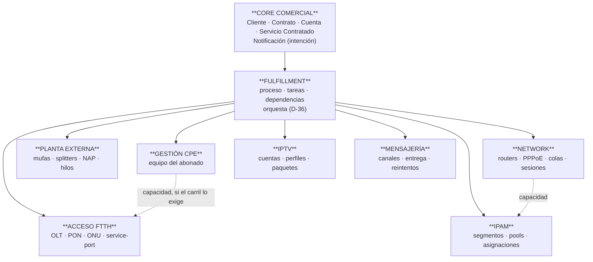

# E-0.4 — Fronteras de los Dominios Técnicos

## 1. Portada

**Proyecto:** ERP Datafast · **Código:** E-0.4 · **Versión:** 2.3
**Título:** Fronteras de los Dominios Técnicos — quién posee qué, y dónde termina cada uno

---

## 2. Control documental

| Campo | Valor |
|---|---|
| **Estado** | ✅ **VIGENTE** — 2026-08-15. Sin decisiones de negocio que ratificar; revisado técnicamente junto a E-0.2 §18. **Exigible**, con el alcance de validación de §14 — que es el más limitado de los tres |
| **Naturaleza** | Directriz arquitectónica normativa — tercer y último documento de **diseño** |
| **Lugar en la jerarquía** (CON-001 §8.10) | **Nivel de Arquitectura**. Subordinado a CON-001 y POL-001 |
| **Dependencias congeladas** | A · B · C · D-0.1 · D-0.2 · D-0.3 · E-0.1 · **E-0.2** · **E-0.3** |
| **Benchmark que lo respalda** | **ADR-036**, con insumo en [core-benchmark.md](../estudio/core-benchmark.md) |
| **Fecha de emisión** | 2026-08-15 |

---

## 3. Historial de cambios

| Versión | Fecha | Qué cambió y por qué |
|---|---|---|
| **2.3** | **2026-08-16** | **La VPN entra como dominio propio** — nueva ficha **D-39bis** e invariante **E04-13**. Cierra un hueco de **E-0.1 §6**, que enumera los dominios técnicos y no la incluía pese a que D-0.1 §2 la nombra. Confirma ADR-032 §2.1, que ya la clasifica como degradable. Clasificada `Extendido`: se declara por el criterio propio de D-27, **sin fuente del sector consultada** |
| **2.2** | **2026-08-15** | **Revisión técnica del arquitecto → VIGENTE.** Realizada junto a E-0.2 §18. **Sin hallazgos propios**: las tres incoherencias detectadas afectaban a E-0.2 y E-0.3. Se confirma que §14 es el **alcance de validación más limitado de los tres**, y que su techo es **de acceso a las normas**, no de trabajo pendiente |
| **2.1** | **2026-08-15** | **Cierre de fuentes de E-0.4** (tercera ronda del estudio). (a) **D-32 pasa a fuente consultada y se corrige su argumento**: la v2.0 afirmaba que el estándar separa el servidor de gestión del nodo de acceso, y **la especificación no dice eso** — es agnóstica a la topología. La decisión no cambia; su fundamento sí, y ahora es más fuerte (H-9). Reclasificada de `Adoptado` a **`Adaptado`**. (b) **D-29 queda respaldada solo por el título de sus normas**: el cuerpo de ITU-T G.988 y G.984.1 no es accesible (H-10). (c) **D-31**: se buscó un modelo abierto de planta pasiva y **no existe consultable**; queda `Extendido` con la búsqueda registrada (H-11). (d) §14 declara **qué no se pudo consultar y por qué** — el documento no puede validarse más sin acceso de pago a ITU-T |
| **2.0** | **2026-08-15** | **Reemisión tras la verificación transversal y ADR-036.** (a) Taxonomía **PD-13** — F-5. (b) **D-38 pasa a fuente consultada** (TMF639 v4.0.0) e incorpora las **cuatro dimensiones de estado del recurso** — H-8. (c) **D-31 gana respaldo parcial**: `place` es propiedad del recurso. (d) Se declara que **IPAM y Gestión CPE están sin clasificar en ADR-034 §4** y que este documento **no** los clasifica — F-7. (e) **Estado de validación por ficha**. (f) Forma completa según 00-INDICE §6 y §8 — F-6 |
| 1.0 | 2026-08-14 | Emisión inicial. Trece fichas, D-27…D-39 |

---

## 4. Índice

5. Objetivo · 6. Alcance · 7. Glosario · 8. Método · 9. El criterio · 10. Los dominios ·
11. Reglas transversales · 12. Mapa consolidado · 13. Invariantes · 14. Estado de validación ·
15. Lo que no define · 16. Cierre del diseño · 17. Referencias

---

## 5. Objetivo

E-0.2 definió las piezas del Core. E-0.3 definió cómo se le habla al resto. **E-0.4 define quién
está al otro lado**: qué dominios existen, qué posee cada uno, qué capacidad implementa y dónde
termina su frontera con el vecino.

El corpus enumera dominios (E-0.1 §6, D-0.3 §3) y deja tres cosas sin resolver:

1. El **dominio de direccionamiento** queda abierto a propósito (E-0.1 §35).
2. **TR-069 aparece en dos sitios**: dentro de OLT (E-0.1 §6.3) y como dominio propio (D-0.3 §3).
3. **Las fronteras entre vecinos no están trazadas.** Que Planta gobierne «NAP y fibra» y OLT
   gobierne «PON» no dice de quién es el hilo que sale del puerto PON.

> Una frontera que no está trazada la traza el primero que necesita cruzarla, y siempre a su favor.

**Premisa:** la de E-0.2 §5.1.

---

## 6. Alcance

**Dentro:** criterio de existencia de un dominio · los seis dominios técnicos y sus fronteras ·
matriz de capacidades · composición entre dominios · proveedores y su sustitución · inventario frente
a binding · límites de ejecución.

**Fuera:** esquema físico y nombres de tabla · protocolo de transporte · implementación de cada
adaptador · **clasificación 🔴/🟠/🟢 de los dominios nuevos, que pertenece a ADR-034** · plan de
migración.

---

## 7. Glosario

| Término | Significado |
|---|---|
| **Dominio** | Unidad de gobierno que cumple las tres condiciones de D-27 |
| **Proveedor** | Implementación intercambiable de una capacidad dentro de un dominio. **Nunca asciende a dominio** |
| **Capacidad transversal** | Outbox, auditoría, observabilidad, identidad. **No adquiere ownership** (E-0.1 §6.7) |
| **Medio pasivo** | Fibra, splitter, mufa, NAP: infraestructura sin electrónica |

---

## 8. Método

Protocolo de fichas de **E-0.2 §8**, taxonomía **PD-13**, niveles `A/B/C` para desviaciones, y
declaración de **fuente consultada** o **conjetura razonada** por ficha (§14).

**Numeración continua:** E-0.3 cerró en D-26. Este documento va de **D-27** a **D-39**.

---

## 9. El criterio, antes que la lista

### D-27 — Qué convierte algo en dominio

**1.** Algo es **dominio** cuando cumple las tres condiciones. Si falla alguna, es **proveedor** o
**capacidad transversal**, y no adquiere gobierno.

| # | Condición |
|---|---|
| 1 | **Posee información con ciclo de vida propio**, que existe aunque no haya ningún servicio contratado apuntándola |
| 2 | **Tiene reglas propias** que nadie más puede evaluar correctamente |
| 3 | **Puede sustituirse su implementación** sin redefinir a los demás |

**2. Contraste — conjetura razonada.** Coherente con la separación gestión de recurso ↔ gestión de
servicio del estándar; el criterio de tres condiciones **es propio**.

**3. Clasificación: Extendido.**

**4. Congelados.** **Confirma** E-0.1 §4, §16, I-02, I-03, E-0.1 §6.7. **Precisa** E-0.1 §6, que
enumera dominios sin dar el criterio por el que algo entra a esa lista.

**5. Consecuencias.** Un proveedor nunca asciende a dominio. Un worker, el transporte o el
reconciliador no son dominios: ejecutan (E-0.1 §21, §22, §26). Un canal presenta (E-0.1 §23).

**6. Reapertura.** Cambiar el criterio exige revisión arquitectónica.

---

## 10. Los dominios técnicos

### D-28 — Direccionamiento (IPAM) es dominio propio

**1.** Segmentos, pools, asignaciones y reservas de direcciones constituyen un **dominio propio**,
separado de Network. **Quien asigna una dirección no es quien la configura en un equipo.**

**2. Contraste — conjetura razonada.** Los modelos de gestión de direccionamiento tratan el IPAM
como función independiente; **no consultados**. Aplicación directa de D-27: los segmentos existen
antes que cualquier contrato (1), el solapamiento solo lo evalúa el IPAM (2), y la fuente de
direcciones puede cambiar sin redefinir Network (3).

**3. Clasificación: Adoptado** por posición.

**4. Congelados.** **Cierra la excepción declarada en E-0.1 §35**, que dejaba abierto el ownership de
`ips_asignadas` y `segmentos_ipv4` y exigía que perteneciera «a un dominio técnico claramente
delimitado». **Confirma** E-0.1 §19. **Descarta** dejarlo dentro de Network: sería el Módulo-Dios que
D-0.3 §40 prohíbe.

**4.1 Clasificado.** **🟠 referencia** en **ADR-034 §4** (enmienda 2026-08-15): hay modelo maduro de
gestión de direccionamiento y desviarse solo nos cuesta a nosotros. Cierra el hallazgo **F-7** para
esta ficha.

**5. Consecuencias.** Network **consume** IPAM por capacidad; no lee sus tablas. Una IP reservada y
no configurada es estado legítimo, con dueño y caducidad (E-0.3 D-21). El histórico de asignación
pertenece al IPAM.

**6. Reapertura.** Ninguna prevista.

---

### D-29 — Acceso FTTH: el equipo activo y sus objetos lógicos

**1.**

| Posee | No posee |
|---|---|
| OLT, chasis, tarjetas, **puerto PON** | La fibra que sale del puerto → **Planta** |
| ONU como elemento de red: serie, ONU-ID, estado GPON, potencias ópticas | La configuración interna del CPE → **Gestión CPE** |
| Service-port, VLAN técnica, perfiles, ancho de banda en el acceso | La dirección IP → **IPAM**; el PPPoE de lado servidor → **Network** |
| Inventario de ONU, incluidas las no asociadas a servicio | La ubicación de la caja → **Planta** |

**2. Contraste — fuente consultada solo en su título.** ITU-T **G.988**, en vigor:
*«ONU management and control interface (OMCI) specification»* → la gestión de la ONU es **interfaz
normalizada propia**, luego la ONU es elemento de red gestionado y no un accesorio del contrato.
ITU-T **G.984.1**, en vigor: *«Gigabit-capable **passive** optical networks (GPON): General
characteristics»* → la norma nombra **pasiva** la red de distribución, que es la línea exacta de
E04-04.

> **Límite declarado:** el **cuerpo** de ambas Recomendaciones **no es accesible** (H-10). Lo que
> respalda esta ficha es el **título y el estado** de las normas, no su texto. El reparto concreto
> de objetos —service-port, perfiles, ONU-ID— **sigue sin fuente**.

**3. Clasificación: Adoptado** por posición, con el límite anterior.

**4. Congelados.** **Confirma** E-0.1 §6.3, §15, D-0.3 §9, D-0.3 §34. **Precisa** la frontera con
Planta, que E-0.1 §15 y §18 dejaban sin trazar.

**5. Consecuencias.** Ningún identificador de este bloque aparece en el Core (**E02-10**). El
inventario de ONU existe con independencia del servicio (D-38). La descripción con que la ONU se
registra en el equipo debe permitir reconstruir a qué contrato pertenece.

**6. Reapertura.** Otra tecnología de acceso activo es un **proveedor** dentro del dominio.

---

### D-30 — Network: el borde de servicio

**1.** Gobierna routers de borde y objetos de sesión y tráfico: servidor PPPoE y credenciales de lado
servidor, colas, firewall, listas de direcciones, sesiones y estado técnico de sesión.
**No posee:** la IP (→ IPAM) · el acceso GPON (→ Acceso FTTH) · el medio físico (→ Planta) · la
configuración del CPE (→ Gestión CPE).

**2. Contraste — conjetura razonada.** Separación servicio de cara al recurso ↔ recurso que lo
porta; **no verificada en el esquema**.

**3. Clasificación: Adoptado** por posición.

**4. Congelados.** **Confirma** E-0.1 §6.2, §14, D-0.3 §35, D-0.2 §9.

**5. Consecuencias.** La velocidad llega como intención (E-0.2 D-10); Network decide si se
materializa en cola, en política o en ambas (A+B-I21). Una sesión caída es observación, no decisión.

**6. Reapertura.** Un fabricante nuevo es un proveedor.

---

### D-31 — Planta Externa: el medio pasivo y su topología

**1.** Gobierna lo pasivo y su topología: nodos, mufas, fusiones, splitters, cajas NAP, puertos NAP,
hilos, acometidas, reservas físicas y georreferencia.

> **La frontera con Acceso FTTH, en una frase:** *el equipo activo y sus objetos lógicos son Acceso
> FTTH; el medio pasivo y su topología son Planta.* El puerto PON es del nodo; el hilo que sale de
> él, el splitter y la caja son de Planta.

**2. Contraste — fuente consultada (parcial) + búsqueda infructuosa registrada.** TMF639 v4.0.0:
`place` es propiedad del `Resource` (`RelatedPlaceRefOrValue`) → la ubicación acompaña al recurso
físico. ITU-T G.984.1 nombra **pasiva** la red de distribución (D-29).

**Para la topología conectada —mufa, fusión, splitter, hilo, acometida— se buscó un modelo de
información citable y no se encontró ninguno consultable en abierto** (H-11): solo documentación de
fabricante y material divulgativo.

**3. Clasificación: Adoptado** en la ubicación · **Extendido** en la topología pasiva.

> Es exactamente lo que PD-13 manda cuando el sector no lo contempla o no puede consultarse: *«se
> construye y se declara extensión propia — no se disfraza de estándar»*. **Y queda escrito que se
> buscó**: una ficha `Extendido` por haber mirado no es lo mismo que una `Extendido` por no haber
> mirado, aunque se escriban igual.

**4. Congelados.** **Confirma** E-0.1 §6.4, §18, D-0.3 §36. **Precisa** la frontera con D-29.

**5. Consecuencias.** La ocupación de un puerto NAP es recurso reservable, con dueño y caducidad.
**La georreferencia del punto de servicio vive donde vive la planta, con una sola definición** — dos
consultas que la calculen por caminos distintos divergen en la primera modificación (**PI-4**).
Planta puede crecer sin ningún contrato asociado.

**6. Reapertura.** Al consultar un modelo de planta exterior, se revisa la parte Extendida.

---

### D-32 — Gestión de CPE (TR-069/ACS) es dominio propio

**1.** La gestión remota del equipo del abonado —parámetros, WiFi, credenciales, reinicio,
restauración de fábrica, plantillas, estado de sesión de gestión— es **dominio propio**, distinto de
Acceso FTTH.

**2. Contraste — fuente consultada, con corrección de un argumento propio.** Broadband Forum USP
(TR-369): *«A Controller is an Endpoint that manipulates Service Elements through one or more
Agents»* · *«An Agent is an Endpoint that exposes Service Elements to one or more Controllers»* ·
*«Simple migration from the CPE WAN Management Protocol (CWMP) — commonly known by its document
number, "TR-069" — through use of the same data model and data modeling tools»*.

> **Corrección declarada.** La v2.0 de esta ficha afirmaba que *«el estándar define el servidor de
> gestión como elemento independiente del nodo de acceso»*. **La especificación no dice eso**: define
> los roles de forma **funcional y agnóstica a la topología**, sin imponer dónde vive el controlador
> (H-9).
>
> **El argumento correcto es el inverso, y es más fuerte:** el estándar trata la gestión del CPE como
> una **función**, no como un accesorio del nodo de acceso, y contempla el mismo modelo de datos
> viniendo de CWMP. **Meterla dentro del dominio FTTH sería una restricción nuestra** —no del
> estándar— y se rompe el día que haya un abonado por radio.

Aplicación de D-27: los equipos se gestionan aunque el acceso sea de otra tecnología (1), sus reglas
son del protocolo de gestión y no del GPON (2), y el servidor es sustituible sin tocar el nodo (3).

**3. Clasificación: Adaptado** — se adopta la separación Controller/Agent como funciones y se
**añade** una regla propia, el dominio separado, que el estándar permite pero no exige.

**4. Congelados.** **Resuelve la duplicidad del corpus**: E-0.1 §6.3 lista TR-069 dentro de Acceso
FTTH y D-0.3 §3 como dominio propio. Se adopta D-0.3 §3, con esta justificación: si vive dentro de
Acceso FTTH, un abonado por radio no tiene gestión remota sin duplicar el módulo, y sustituir el
servidor obligaría a tocar el dominio de la OLT. **Confirma** D-0.3 §3 y §9.

**4.1 Clasificado, con un matiz que importa.** **🟠 referencia** en **ADR-034 §4** (enmienda
2026-08-15) — pero solo **el modelo del dominio**: qué posee, qué expone y cómo se sustituye el
servidor de gestión. **El protocolo en sí es 🔴 por interoperabilidad**: el CPE al otro lado tiene
que aceptar lo que emitimos, y ADR-030 §2.2 ya registra que el ERP conforma con TR-069. Confundir
ambos planos sería declarar libre lo que no lo es.

**5. Consecuencias.** Una misma intención —«aplica esta configuración al equipo del abonado»— puede
materializarse por carriles distintos según el modelo. **La capacidad es única; el carril lo elige el
dominio** (D-0.3 §12). Cuando el carril atraviesa el nodo, este dominio **consume la capacidad** de
Acceso FTTH (D-36). **E-0.3 D-18 es aquí especialmente exigible**: un equipo puede aceptar la orden y
no ejecutarla — es el origen de **PF-2**.

**6. Reapertura.** Otro protocolo de gestión es un proveedor.

---

### D-33 — Notificación es intención del Core; Mensajería es dominio de entrega

**1.**

| | Qué es | Dueño |
|---|---|---|
| **Notificación** | La intención empresarial: a quién, qué y por qué motivo de negocio | **Core** |
| **Mensajería** | La entrega: canal, proveedor, reintento, acuse, error | **Dominio técnico** |

**2. Contraste — conjetura razonada.** Separación política de comunicación ↔ transporte; **no
consultada**.

**3. Clasificación: Adoptado** por posición.

**4. Congelados.** **Confirma** E-0.1 §20, §6.5, D-0.3 §37.

**5. Consecuencias.** El Core no conoce la API de ningún canal: emite `NOTIFICAR` con motivo y
destinatario. Que un mensaje no se entregue **no** cambia ningún estado comercial. La preferencia de
canal del abonado es dato comercial.

**6. Reapertura.** Ninguna.

---

### D-34 — IPTV / Streaming

**1.** Gobierna la plataforma de vídeo: cuentas, líneas, perfiles, paquetes y credenciales del
proveedor. El Core solo conoce que el Servicio Contratado incluye la prestación y cuántos perfiles
ampara.

**2. Contraste — conjetura razonada.** La suscripción a la plataforma como servicio de cara al
recurso con credenciales propias; **no verificada**.

**3. Clasificación: Adoptado** por posición.

**4. Congelados.** **Confirma** B §54, §55, A+B-I19, E-0.1 §6.6, D-0.3 §38.

**5. Consecuencias.** Un cambio de plataforma es un proveedor nuevo dentro del dominio; el catálogo
comercial no se entera.

**6. Reapertura.** Ninguna.

---

### D-39bis — Conectividad de Gestión (VPN) es dominio propio

*(Ficha añadida en v2.3. Numerada `bis` para no alterar la numeración global.)*

**1. Enunciado.** El túnel por el que el ERP alcanza a los equipos gestionados —certificados, IPs de
gestión, ficheros de configuración por cliente, sesiones— constituye un **dominio propio,
degradable**, distinto de Network.

**No posee:** el router (→ Network) · la configuración del servicio del abonado (→ Network) · el
direccionamiento del servicio (→ IPAM). **La IP del túnel no es la IP del abonado**, y confundirlas
es el origen del error.

**2. Contraste — conjetura razonada.** Los modelos de gestión separan el plano de gestión del plano
de servicio; **no se consultó fuente para esta ficha**. Lo que sí es verificable es la aplicación de
**D-27**:

| Condición | La VPN la cumple porque… |
|---|---|
| **1 · Información con ciclo propio** | Certificados, IPs y túneles existen aunque no haya ningún contrato |
| **2 · Reglas que nadie más evalúa** | **La IP de un cert es permanente** y solo se libera al eliminar el router o al cancelar el registro. Network no sabe eso |
| **3 · Implementación sustituible** | Cambiar de tecnología de túnel no redefine a nadie |

**3. Clasificación: Extendido** — el dominio se declara por criterio propio (D-27), sin modelo del
sector consultado que lo respalde.

**4. Congelados.** **Cierra un hueco de E-0.1 §6**, que enumera dominios técnicos y **no incluye la
VPN**, pese a que D-0.1 §2 la nombra entre los módulos con gobierno propio. **Confirma ADR-032 §2.1**,
que ya clasifica `openvpn` como **degradable**, y **PA-18**, que da el criterio: *depende de algo que
no controlamos*.

**5. Consecuencias.**
- **La permanencia de la IP es regla del dominio, no del que la consume.** Reasignar la IP de un cert
  activo deja al router sin túnel — y el ERP sin gestión sobre él.
- La liberación tiene **exactamente dos causas**: eliminación del router y cancelación del registro
  sin completar. Cualquier otra vía es un defecto.
- **Un ERP recién instalado no reasigna estas IPs: las adopta.** Sin esa regla, una instalación limpia
  deja sin gestión a todos los routers registrados.
- Network **consume** la conectividad; no la gobierna.

**6. Reapertura.** Si el túnel dejara de ser necesario —gestión por otra vía—, el dominio se retira
entero, no se reparte.

---

## 11. Reglas transversales

### D-35 — Matriz de capacidades por dominio

**1.** Ninguna capacidad existe sin dominio implementador, y ningún dominio implementa capacidades
fuera de su columna.

| Capacidad | Acceso FTTH | Network | IPAM | Planta | Gestión CPE | IPTV | Mensajería |
|---|:--:|:--:|:--:|:--:|:--:|:--:|:--:|
| `PROVISIONAR_ACCESO` | ● | ● | | | ● | ● | |
| `SUSPENDER_ACCESO` | ● | ● | | | | ● | |
| `REACTIVAR_ACCESO` | ● | ● | | | | ● | |
| `ACTUALIZAR_CONFIGURACION` | ● | ● | | | ● | ● | |
| `DESAPROVISIONAR_ACCESO` | ● | ● | | | ● | ● | |
| `RESERVAR_RECURSO` / `LIBERAR_RECURSO` | ● | | ● | ● | | | |
| `CONSULTAR_ESTADO_TECNICO` | ● | ● | ● | ● | ● | ● | ● |
| `RECONCILIAR_ESTADO` | ● | ● | ● | ● | ● | ● | |
| `NOTIFICAR` | | | | | | | ● |

**2. Contraste — conjetura razonada.** Mapeo proceso ↔ dominio funcional; **eTOM no consultado**.

**3. Clasificación: Extendido** — la matriz es propia.

**4. Congelados.** **Confirma** E-0.3 D-13 y D-0.3 §18.

**5. Consecuencias.** Una celda vacía es una **prohibición**, no un olvido: si Planta necesitara
suspender algo, la frontera está mal trazada.

**6. Reapertura.** Ampliar la matriz exige ADR.

---

### D-36 — El fulfillment orquesta; los dominios se hablan por capacidad

**1.** Un Servicio que necesita varios dominios se materializa con **un proceso de fulfillment que
orquesta** (E-0.3 D-16). Ningún dominio orquesta a los demás.

Un dominio **sí puede consumir la capacidad de otro** cuando su materialización lo exige, con **las
mismas reglas que aplican al Core**: catálogo, resultado canónico, trazabilidad y prohibición de
acceso directo.

**2. Contraste — conjetura razonada.** La orquestación en el proceso de orden y no en los ejecutores
es propia de los modelos de order management; **no citados en este punto**.

**3. Clasificación: Adoptado** por posición.

**4. Congelados.** **Confirma** D-0.3 §40, D03-20, E-0.1 §26, D-0.3 §41. **Precisa** un caso que el
corpus no trataba: **qué ocurre cuando un dominio necesita a otro**. Prohibirlo obligaría al Core a
hacer de intermediario técnico —el Core-Dios de D-0.2 §4—; permitirlo sin reglas produce
dependencias opacas.

**5. Consecuencias.** El orden de las tareas vive en el proceso de fulfillment, donde se lee, no
repartido por los módulos. Una llamada entre dominios se registra igual que una del Core (E-0.3
D-23). Un dominio que acumule llamadas a muchos otros es señal de frontera mal trazada.

**6. Reapertura.** Ninguna.

---

### D-37 — Proveedores: sustituibles, con estado de migración explícito

**1.** Cada dominio declara sus proveedores y, cuando corresponda, **actual**, **deseado** y **estado
de migración**. Cambiar de proveedor es una **operación**, no un valor de configuración. Los
conceptos propios de cada proveedor se traducen al modelo canónico dentro del dominio y **no salen de
él**.

**2. Contraste — conjetura razonada.** Separación capacidad ↔ implementación para permitir
multi-proveedor; **no verificada en el esquema**.

**3. Clasificación: Adoptado** por posición.

**4. Congelados.** **Confirma** D-0.3 §14-§17, D03-04, D03-18, E-0.1 §16 y **PA-09** (contrato
obligatorio de todo adaptador).

**5. Consecuencias.** Ningún identificador de proveedor sube al Core (**E02-10**). Sustituir un
proveedor no obliga a redefinir el dominio (I-13). Una migración a medias es estado representable.

**6. Reapertura.** Ninguna.

---

### D-38 — Inventario y binding son cosas distintas

**1.** Un recurso puede existir sin servicio. El **inventario** de un dominio —ONUs detectadas,
puertos NAP libres, direcciones sin asignar, equipos en almacén— es información propia del dominio y
**no** presupone binding, servicio ni cliente.

**1.1 El estado del recurso tiene dimensiones separadas** *(v2.0 — H-8, coordinado con E-0.3 D-19)*:
**administrativa** (¿está permitido que preste servicio?), **operativa** (¿funciona?) y **de uso**
(¿está ocupado?). Un puerto NAP **asignado** y una ONU **apagada** son estados de dimensiones
distintas, y meterlos en el mismo campo impide diagnosticar.

**2. Contraste — fuente consultada.** TMF639 v4.0.0: `Resource` es *«an abstract entity that
describes the common set of attributes shared by all concrete resources (e.g. TPE, EQUIPMENT) **in
the inventory**»* → el recurso vive en inventario con independencia del servicio. Declara además
`resourceStatus`, `administrativeState`, `operationalState` y `usageState` como propiedades
**separadas**. **Los valores de cada enumeración no constan** en los ficheros leídos.

**3. Clasificación: Adoptado** en la separación inventario/servicio y en las dimensiones ·
**pendiente** en los valores.

**4. Congelados.** **Confirma** E-0.1 §17 y C-I12, que exige rastrear todo recurso **asignado** —
«asignado», no «existente».

**5. Consecuencias.** Un recurso configurado en el plano físico **sin** registro que lo explique no
es inventario: es divergencia, y se reporta (E-0.3 D-19). La adopción de recursos preexistentes es
operación deliberada y auditada: **se observa y se respeta lo que ya funciona**, y nunca se le
sobrescribe la configuración por incorporarlo (**PA-06** de CON-001, **PA-10** de POL-001). El
inventario permite planificar capacidad sin inventar entidades comerciales (C-006).

**6. Reapertura.** Los valores de cada dimensión, al consultarlos.

---

### D-39 — Cada dominio declara sus límites de ejecución

**1.** Cada dominio declara y hace cumplir **concurrencia máxima**, **tiempo de espera por
operación**, **número máximo de intentos** y **frecuencia de reconciliación**. La invariante
`intentos ≤ máximo` (E-0.3 D-20) es común; los valores son de cada dominio.

**2. Contraste — conjetura razonada.** Patrones de aislamiento de fallos: el límite vive junto al
recurso escaso, no en el llamante. **No citados.**

**3. Clasificación: Adoptado** por posición.

**4. Congelados.** **Confirma** D-0.2 §29 y D-0.3 §50, que dejan fuera los valores concretos, y les
da un lugar declarado. Confirma E-0.3 D-20 y D-22, y **PA-15** (todo cron declara cap, lock y
latido).

**5. Consecuencias.** Un equipo con pocas sesiones concurrentes no se satura por un barrido ingenuo.
Un tiempo de espera corto contra una operación legítimamente lenta produce `indeterminado` y trabajo
de reconciliación evitable. El límite es exigible: quien lo excede recibe `reintentable`.

**6. Reapertura.** Los valores se ajustan por medición, sin tocar el diseño.

---

## 12. Mapa consolidado



**Frontera en una línea, por si algún día se discute:**

| Duda | Dueño |
|---|---|
| El puerto PON del chasis | Acceso FTTH |
| El hilo que sale de ese puerto, el splitter y la caja | Planta Externa |
| La ONU como elemento de red (serie, ONU-ID, óptica) | Acceso FTTH |
| La configuración interna de ese mismo equipo (WiFi, claves) | Gestión CPE |
| La dirección IP | IPAM |
| El sitio donde esa IP queda configurada | Network |
| El motivo de negocio de un aviso | Core |
| El canal por el que sale | Mensajería |

---

## 13. Invariantes E-0.4

| # | Invariante |
|---|---|
| **E04-01** | Algo es dominio solo si cumple las tres condiciones de D-27 |
| **E04-02** | Un proveedor nunca asciende a dominio |
| **E04-03** | El direccionamiento es dominio propio; Network lo consume, no lo posee |
| **E04-04** | El equipo activo y sus objetos lógicos son Acceso FTTH; el medio pasivo es Planta |
| **E04-05** | La gestión del CPE es dominio propio, independiente de la tecnología de acceso |
| **E04-06** | La notificación es del Core; la entrega es de Mensajería |
| **E04-07** | Ninguna capacidad existe sin dominio implementador declarado |
| **E04-08** | Ningún dominio orquesta a otro: orquesta el fulfillment |
| **E04-09** | Un dominio puede consumir capacidades de otro, con las mismas reglas que el Core |
| **E04-10** | Los conceptos propios de un proveedor no salen de su dominio |
| **E04-11** | Inventario ≠ binding ≠ servicio |
| **E04-12** | Cada dominio declara y hace cumplir sus límites de ejecución |
| **E04-13** | La IP de gestión de un certificado es **permanente**; solo se libera al eliminar el router o al cancelar el registro sin completar. Una instalación nueva **adopta**, no reasigna |

---

## 14. Estado de validación por ficha

| Ficha | Contraste | Fuente |
|---|---|---|
| **D-38** | **Fuente consultada** | TMF639 v4.0.0 — inventario y dimensiones de estado |
| **D-32** | **Fuente consultada** | Broadband Forum USP (TR-369) — `Controller` / `Agent`, y corrección H-9 |
| **D-31** | **Fuente consultada** (parcial) | TMF639 v4.0.0 (`place`) · G.984.1 (título). Topología pasiva: **buscada, no encontrada** |
| **D-29** | **Solo título de norma** | ITU-T G.988 y G.984.1 — cuerpo no accesible |
| D-27 · D-28 · D-30 · D-33 · D-34 · D-35 · D-36 · D-37 · D-39 · **D-39bis** | Conjetura razonada | — |

**Cuatro de trece con fuente**, frente a dos en la v2.0. Y el cierre de la búsqueda, que vale tanto
como un hallazgo:

| Fuente buscada | Resultado |
|---|---|
| **TR-069 (CWMP)**, cuerpo | **403** en el sitio del organismo. **Sustituida por TR-369/USP**, que sí es pública y cubre lo necesario |
| **ITU-T G.988 y G.984.1**, cuerpo | **No accesible.** Solo metadatos. D-29 se queda con el título de su norma |
| **Modelo de planta exterior** | **Buscado y no encontrado en abierto.** D-31 queda `Extendido` **por haber mirado** |

**Este documento no puede validarse más sin acceso de pago a ITU-T.** Lo que queda sin fuente ya no
es descuido: es un límite declarado, con su causa escrita.

---

## 15. Lo que E-0.4 NO define

Esquema físico, endpoints, formato de payload · implementación de cada adaptador · valores numéricos
de D-39, que se fijan por medición · **la clasificación 🔴/🟠/🟢 de IPAM y Gestión CPE, que pertenece
a ADR-034 §4** · plan de migración.

---

## 16. Cierre del diseño

Con E-0.4 quedan cerrados los doce cabos que el corpus arrastraba:

| Cabo | Cerrado en |
|---|---|
| Servicio Contratado sin identidad | E-0.2 D-3 |
| Cardinalidad del Technical Binding | E-0.2 D-4 |
| Unidad económica (cuenta 1:1) | E-0.2 D-1 · ADR-036 §4.1 |
| Derivación de estados | E-0.2 D-5 |
| Identificadores y correlación | E-0.2 D-6 |
| Servicios requeridos vs opcionales | E-0.2 D-2 |
| Tratamiento de `empresa_id` | E-0.2 D-13bis |
| Capacidades sin firma | E-0.3 D-13/D-14/D-15 |
| Fulfillment sin modelo | E-0.3 D-16 |
| Árbitro de la activación | E-0.3 D-17 |
| Autenticación entre fronteras | E-0.3 D-24, con condición de cierre |
| **Dominio de direccionamiento** (E-0.1 §35) | **E-0.4 D-28** |
| **TR-069: dominio o parte de OLT** (E-0.1 §6.3 / D-0.3 §3) | **E-0.4 D-32** |

**Y quedan abiertos, declarados:** el hueco de `cancelled` en **A §16** (ADR-036 §4.3), el de
`rejected` en **C §5** (E-0.3 D-16 §3.1), la clasificación de IPAM y Gestión CPE en **ADR-034 §4**, y
las fuentes sin consultar de §14.

```
A ── B ── C ── D-0.1 ── D-0.2 ── D-0.3 ── E-0.1   fronteras, ownership y gobierno   CONGELADO
                                            │
                                          E-0.2   modelo de información del Core
                                          E-0.3   capacidades y ejecución
                                          E-0.4   fronteras de los dominios técnicos
                                            │
                                            └──►  plan de migración (documento aparte)
```

---

## 17. Referencias

**Corpus congelado:** A · B · C · D-0.1 · D-0.2 · D-0.3 · E-0.1 · **E-0.2** · **E-0.3**
**Normativa propia:** CON-001 PA-06 · POL-001 PA-06, PA-09, PA-10, PA-15, PD-11 · 00-INDICE §6,
§7.3, §8
**Decisiones:** ADR-030 · ADR-031 · ADR-032 · **ADR-034** (enmienda pendiente) · **ADR-036**
**Evidencia:** [core-benchmark.md](../estudio/core-benchmark.md) ·
[verificación transversal](E-0.2-4-verificacion-transversal.md)
**Especificaciones consultadas:** TMF639 v4.0.0 · Broadband Forum USP (TR-369) · ITU-T G.988 y
G.984.1 **(solo metadatos)**
**No accesibles:** cuerpo de ITU-T G.988 y G.984.1 · TR-069 (403 en el sitio del organismo)
**Buscado y no encontrado en abierto:** modelo de información de planta exterior
