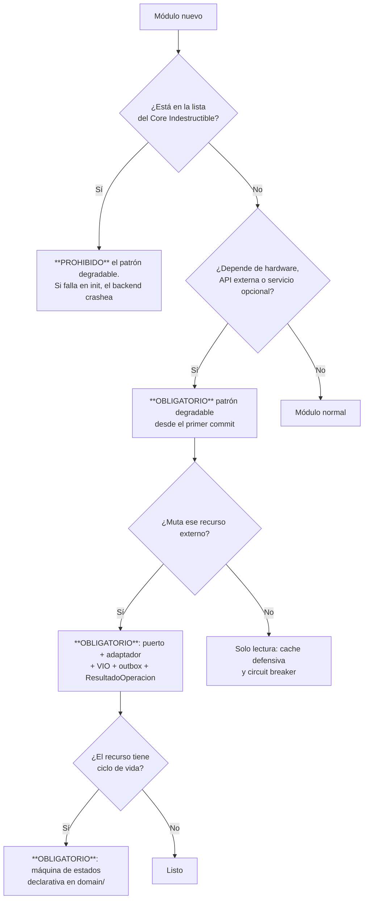

# GUI-001 — Guías de Desarrollo

---

## 2. Control documental

| Campo | Valor |
|---|---|
| **Código** | GUI-001 · **Versión** 1.0 · **Estado** Vigente |
| **Autor** | Arquitectura · **Revisores** Pendientes de asignar |
| **Fecha** | 2026-08-06 · **Documento superior** CON-001, POL-001, EST-001 |
| **Carácter** | Manual práctico. Ante contradicción, prevalece POL-001 |

## 3. Historial de cambios

| Versión | Fecha | Cambio | Motivo |
|---|---|---|---|
| 1.0 | 2026-08-06 | Emisión inicial | Un desarrollador nuevo no tenía forma de saber qué garantías debía poner en un módulo, y las heredaba solo si las recordaba |

## 4. Índice

1. Cómo crear un módulo · 2. Cómo crear un servicio · 3. Cómo crear un endpoint ·
4. Cómo crear un evento · 5. Cómo hacer pruebas · 6. Cómo documentar

## 5. Objetivo

Manual práctico para desarrollar sobre ERP Datafast aplicando las políticas sin tener que
deducirlas.

## 6. Alcance

Backend NestJS principalmente; frontend y base de datos donde corresponda.

## 7. Definiciones y glosario

Ver DOM-001 §8.1 (lenguaje ubicuo) y EST-001 §7.

---

# 8. Contenido

# 8.1 Cómo crear un módulo

## Paso 0 · Las cinco preguntas antes de escribir la primera línea

**Ninguna de estas decisiones se puede tomar después sin coste.**

| # | Pregunta | Consecuencia |
|---|---|---|
| 1 | **¿Degradable o Core Indestructible?** | Determina qué pasa si su dependencia está caída |
| 2 | **¿Toca hardware o un tercero?** | Si sí: necesita puerto, adaptador, VIO y outbox |
| 3 | **¿Tiene un recurso con ciclo de vida?** | Si sí: necesita máquina de estados declarativa |
| 4 | **¿Lo invocará un orquestador (cron, outbox, cola)?** | Si sí: devuelve `ResultadoOperacion`, no excepciones HTTP |
| 5 | **¿A qué dominio pertenece y de quién puede depender?** | Un módulo del núcleo no depende de uno de soporte |

### Árbol de decisión



## Paso 1 · Estructura

```bash
modules/<nombre>/
├── <nombre>.module.ts
├── <nombre>.controller.ts
├── <nombre>.service.ts
├── dto/
├── entities/
├── repositories/          # si es módulo de negocio
├── interfaces/            # si define un puerto
├── providers/             # adaptadores
├── domain/                # máquina de estados
└── <nombre>.service.spec.ts
```

## Paso 2 · Si es degradable

```typescript
@Injectable()
export class MiServicio implements OnModuleInit {
  private readonly logger = new Logger(MiServicio.name);
  private degradado = false;

  constructor(private readonly moduleHealth: ModuleHealthService) {}

  async onModuleInit(): Promise<void> {
    try {
      await this.probeLigero();               // ping, which, check de env var…
      this.moduleHealth.registrar('mi-modulo', 'ok');
    } catch (e) {
      this.degradado = true;
      this.moduleHealth.registrar('mi-modulo', 'degraded', e.message);
      // NUNCA relanzar: crashearía el backend
    }
  }

  private assertNotDegraded(): void {
    if (this.degradado) {
      throw new ServiceUnavailableException('mi-modulo está degradado');
    }
  }
}
```

## Paso 3 · Registrar el módulo

Añadirlo a `app.module.ts` respetando el orden de dominios y **declarando solo las dependencias
que realmente usa**.

## Paso 4 · Checklist de módulo nuevo

- [ ] ¿Degradable o Core Indestructible, decidido y aplicado?
- [ ] ¿Sus tablas tienen entidad TypeORM, con `type:` explícito en `string | null`?
- [ ] ¿Sus tablas llevan `empresa_id` con índice único compuesto?
- [ ] ¿Tiene repositorio si es módulo de negocio?
- [ ] ¿Sus endpoints declaran DTO y `@RequirePermission`?
- [ ] ¿Todas sus consultas filtran por `empresa_id`?
- [ ] ¿Si toca hardware, pasa por puerto + outbox + VIO?
- [ ] ¿Si tiene ciclo de vida, declara su máquina de estados?
- [ ] ¿Sus crons declaran cap, presupuesto y latido?
- [ ] ¿Sus invariantes críticos tienen test que nombra el incidente?
- [ ] ¿Sus variables de entorno están en `.env.example`?
- [ ] ¿No introduce ninguna IP, dominio ni secreto?

# 8.2 Cómo crear un servicio

## 8.2.1 Elegir el tipo

| Tipo | Cuándo | Devuelve |
|---|---|---|
| **De aplicación** | Orquesta un caso de uso | DTO o `ResultadoOperacion` |
| **De dominio** | Encapsula una regla de negocio pura | Valor de dominio |
| **De infraestructura** | Habla con un recurso externo | Resultado estructurado |
| **Adaptador** | Implementa un puerto | **Nunca lanza excepciones** |

## 8.2.2 Si lo invocará un orquestador

```typescript
async suspenderServicio(contratoId: string): Promise<ResultadoOperacion> {
  const transicion = evaluarTransicion(estadoActual, 'suspender');

  if (transicion.yaEnDestino) {
    return ResultadoOperacion.yaEnDestino('El servicio ya estaba suspendido');
  }
  if (!transicion.legal) {
    return ResultadoOperacion.rechazadoDefinitivo(transicion.motivo);
  }

  try {
    const r = await this.provider.suspender(payload);   // el adaptador no lanza
    if (!r.exitoso) return ResultadoOperacion.reintentable(r.mensaje);

    const verificado = await this.provider.verificarSuspension(payload);  // VIO
    return verificado
      ? ResultadoOperacion.aplicado('Suspensión confirmada')
      : ResultadoOperacion.indeterminado('Aceptado, sin confirmar');
  } catch (e) {
    if (esTimeout(e)) {
      return ResultadoOperacion.indeterminado('Timeout: la operación pudo aplicarse');
    }
    return ResultadoOperacion.reintentable(e.message);
  }
}
```

**Los tres errores que este patrón evita:**

| Error | Por qué es un error |
|---|---|
| Devolver `false` ante `ya_en_destino` | Genera reintentos infinitos — pasó: **1.788 contra el MA5800 en 4 días** |
| Reportar `fallido` ante un timeout | La operación pudo aplicarse; el ERP quedaría creyendo algo falso |
| Lanzar `ConflictException` a un orquestador | Un 409 de lock leído como veredicto **descarta trabajo bueno** |

## 8.2.3 Si muta hardware

**Nunca lo ejecutes en el request.** Escribe la intención:

```typescript
await this.dataSource.transaction(async (manager) => {
  await manager.update(Contrato, { id }, { estado: 'suspendido' });
  await this.outbox.encolar(manager, {          // MISMA transacción
    tipo: 'MK_SUSPENDER',
    contratoId: id,
    payload: { routerId, ipAsignada, usuarioPppoe },
  });
});
```

# 8.3 Cómo crear un endpoint

## 8.3.1 Plantilla

```typescript
@Post(':id/activar')
@RequirePermission('contratos:edit')
@ApiOperation({ summary: 'Activa un contrato y dispara su aprovisionamiento' })
async activar(
  @Param('id', ParseUUIDPipe) id: string,
  @CurrentUser() usuario: UsuarioActual,
  @Body() dto: ActivarContratoDto,
) {
  const r = await this.servicio.activar(id, usuario.empresaId, dto);
  return traducirAHttp(r);     // el transporte traduce en el BORDE
}
```

## 8.3.2 Reglas que se olvidan

| # | Regla |
|---|---|
| 1 | **Las rutas estáticas van ANTES que las paramétricas.** `/contratos/segmentos` antes que `/contratos/:id`, o caerá en el segundo |
| 2 | `empresaId` sale de `@CurrentUser()`, **nunca del body ni del query** |
| 3 | Toda ruta pública se marca `@Public()` explícitamente |
| 4 | Las lecturas de alto volumen marcan `skipAudit` |
| 5 | Nada que tarde más de 30 s: el `TimeoutInterceptor` global lo corta |
| 6 | Un endpoint que dispara hardware devuelve "encolado", no el resultado final |

## 8.3.3 Checklist

- [ ] ¿DTO con `class-validator`?
- [ ] ¿`@RequirePermission`?
- [ ] ¿Filtra por `empresaId` del usuario?
- [ ] ¿Ruta estática declarada antes que la paramétrica?
- [ ] ¿Documentado con Swagger?
- [ ] ¿Traduce `ResultadoOperacion` en el borde?
- [ ] ¿Cliente añadido en `frontend/src/lib/api/`?

# 8.4 Cómo crear un evento

## 8.4.1 Cuándo usar un evento y cuándo no

| Situación | Mecanismo |
|---|---|
| Notificar un hecho a interesados desconocidos | **Evento** |
| Ejecutar trabajo asíncrono | **Cola Bull** (no evento) |
| Mutar hardware | **Outbox** (no evento, no cola) |
| Necesitas el resultado | **Llamada directa** |

> ⚠️ **El bus es in-process.** Un evento emitido en `api-core` **no llega** a
> `worker-auxiliary`. Por eso **un listener encola; no ejecuta**.

## 8.4.2 Emitir

```typescript
// 1. Declarar la constante en events/
export const NOTIFICATION_EVENTS = {
  FTTH_ACTIVADO: 'ftth.activado',
} as const;

// 2. Emitir con payload tipado
this.events.emit(NOTIFICATION_EVENTS.FTTH_ACTIVADO, {
  contratoId, clienteId, empresaId, sn,
});
```

## 8.4.3 Escuchar

```typescript
@OnEvent(NOTIFICATION_EVENTS.FTTH_ACTIVADO, { async: true })
async alActivarFtth(payload: PayloadFtthActivado): Promise<void> {
  await this.queue.add(JOBS.NOTIF_ENVIO, payload, JOB_OPTIONS.NOTIFICACION);
  // encola — NO ejecuta el envío aquí
}
```

## 8.4.4 Checklist

- [ ] ¿La constante está declarada, no el string suelto?
- [ ] ¿El payload lleva `empresaId`?
- [ ] ¿El listener **solo encola**?
- [ ] ¿El job tiene su perfil de `JOB_OPTIONS` (prioridad y reintentos)?
- [ ] ¿La acción es idempotente? (el job puede reintentarse)

# 8.5 Cómo hacer pruebas

## 8.5.1 Qué se prueba obligatoriamente

| Categoría | Ejemplo |
|---|---|
| **Dinero** | Un solo escritor del saldo; el extorno es la única reversión |
| **Aislamiento** | Un token de portal no accede a otro tenant |
| **Concurrencia** | Dos instancias no toman el mismo comando |
| **Plano físico** | Las transiciones ilegales se rechazan; las repetidas son éxito |
| **Clasificación** | Un 409 es reintentable; un timeout es `indeterminado` |

## 8.5.2 El nombre del test

```typescript
// ✅ Sobrevive a una limpieza porque explica por qué existe
it('409 de lock es reintentable, no un veredicto (incidente 28/07)', ...)
it('desaprovisionar acepta origen suspendido (ONU huérfana 28/07)', ...)
it('no aplica saldo a favor contra facturas ANULADAS', ...)

// ❌ Se borra en la primera limpieza
it('debería funcionar', ...)
it('test de suspensión', ...)
```

## 8.5.3 Estructura

```typescript
describe('OutboxRedService — reclamo atómico', () => {
  it('dos instancias PM2 no toman el mismo comando (doble ejecución 28/07)', async () => {
    // Arrange: dos servicios simulando dos procesos
    // Act: ambos reclaman a la vez
    // Assert: exactamente uno obtiene el comando
  });
});
```

## 8.5.4 Reglas

| # | Regla |
|---|---|
| 1 | Sin red, sin hardware, sin base real: se mockean las dependencias |
| 2 | Un test que falla **no se ajusta**: se investiga qué garantía se rompió |
| 3 | Si escribes un comentario que garantiza concurrencia, **escribe el test o borra el comentario** |
| 4 | Antes de commitear: `npm run typecheck` y `npm test` |

# 8.6 Cómo documentar

## 8.6.1 Los cuatro sitios y qué va en cada uno

| Sitio | Contenido | Ejemplo |
|---|---|---|
| **Comentario en el código** | **Por qué** se tomó una decisión y qué incidente la motivó | *"1 worker a propósito: el MA5800 tiene un límite bajo de VTY concurrentes"* |
| **Mensaje de commit** | Qué estaba mal y **por qué no se veía** | *"faltaba poder crear cuentas receptoras — el catálogo quedaba a medias"* |
| **`PENDIENTES.md`** | Qué falta, **por qué importa**, cómo se comprueba | — |
| **ADR** | Decisión estructural con alternativas descartadas | ADR-008 |

## 8.6.2 Cómo se escribe un buen comentario

```typescript
// ✅ Explica la razón y el incidente
// NUNCA `--reload` en producción: WatchFiles reinicia uvicorn al tocar cualquier
// archivo y un `git reset --hard` de deploy lo dispara en medio de una operación
// contra la OLT. Causó el timeout que abortó una Fase 2 WAN y dejó un ONT
// huérfano (2026-07-21).

// ❌ Traduce el código
// Inicia el servidor con un worker
```

## 8.6.3 La regla del comentario que garantiza

Si escribes *"esto es idempotente"*, *"dos procesos nunca…"* o *"esto no puede ocurrir"*:

**o escribes el test que lo demuestra, o borras el comentario.**

> Una garantía que nadie sostiene es **peor** que ninguna, porque el siguiente lector construye
> encima.

## 8.6.4 Cuándo escribir un ADR

Antes de implementar, si la decisión: introduce o retira una dependencia externa · cambia una
garantía de consistencia o concurrencia · afecta al dinero, al aislamiento entre empresas o al
plano físico · contradice una política vigente · elige entre alternativas cuya reversión es cara.

## 8.6.5 Registrar deuda

Formato obligatorio en `PENDIENTES.md`: **qué falta** · **por qué importa** (la consecuencia real,
no la tarea) · **cómo se comprueba**.

> Una entrada sin consecuencia acaba siendo ignorada.

---

# 9. Referencias

CON-001 · POL-001 · EST-001 · ARS-001 · DOM-001 · ADR-000 · `CLAUDE.md`

---

# 10. Anexos

## Anexo A — Recetario de tareas frecuentes

| Tarea | Pasos |
|---|---|
| **Añadir una tabla** | Migración con `up`/`down` → entidad con `type:` explícito → `empresa_id` + índice único → repositorio si es de negocio → `npm run migration:run` |
| **Añadir una variable de entorno** | Añadir a `.env.example` con comentario → leer con lazy getter → **nunca** literal en código |
| **Añadir una integración externa** | Puerto en `interfaces/` → adaptador en `providers/` (no lanza, mide latencia, no toca BD) → patrón degradable → circuit breaker |
| **Añadir un cron** | Comprobar `RUN_CRONS` → declarar cap y presupuesto → emitir latido → **nunca relanzar** |
| **Añadir una cola** | Declarar en `QUEUES` → perfil en `JOB_OPTIONS` → processor idempotente |
| **Añadir un permiso** | Alta en `permisos` → `@RequirePermission` en los endpoints → asignar al rol |
| **Añadir una pantalla** | Cliente en `lib/api/` → componente por dominio → ruta en `app/(dashboard)/` |

## Anexo B — Errores que ya se cometieron (no repetirlos)

| Error | Consecuencia real |
|---|---|
| Reportar éxito porque el CLI no dio error | El ERP dijo "carril aplicado" con la gestión muerta **durante días** |
| Escribir el paso de la saga **después** de ejecutarlo | Si el proceso muere en medio, **el huérfano renace** |
| Clasificar un no-op idempotente como fallo | **1.788 reintentos** contra el MA5800 en 4 días |
| Leer un 409 de lock como veredicto definitivo | Se **descartó trabajo bueno** |
| Copiar el `UPDATE` que aplica dinero | Una copia perdió el guard y aplicó saldo contra facturas **ANULADAS** |
| Tener tres fórmulas del ciclo de cobro | El corte caía **antes** del vencimiento |
| Leer el dato de ubicación del sitio equivocado | Ningún abonado aparecía en el mapa |
| Un script de despliegue que afirma éxito sin comprobarlo | **11 horas** ejecutando código viejo |
| Lanzar el frontend desde una shell con el `.env` del backend | El proceso expuesto arrastraba **todos los secretos** |
| Alojar Chromium en el proceso del worker | VPS con **87 MB libres** |
| Probar un bootstrap sobre un equipo que ya tenía la config | **Falso positivo**; hubo que revertir la certificación |

## Anexo C — Dónde mirar cuando algo no funciona

| Síntoma | Primer sitio a mirar |
|---|---|
| El backend no arranca en frío | Columna `string \| null` sin `type:` (SWC) |
| Una variable de entorno vale `undefined` | Constante de módulo en vez de lazy getter |
| Un endpoint nuevo devuelve 400 "uuid expected" | Ruta paramétrica declarada antes que la estática, **o el proceso no se recargó** |
| Una operación de red no se aplica | `GET /outbox-red/status` y el latido de los watchers |
| TR-069 no responde | Sesión rancia, tag `AuthEnforced` residual, o divergencia de credenciales con GenieACS |
| Un comando a la OLT da `% Unknown command` | Autosave sin drenar — **falso negativo** |
| El build falla en el VPS | Heap de Node insuficiente |
| El build del frontend falla en el VPS y no en local | `eslint-disable-line` con regla específica |
