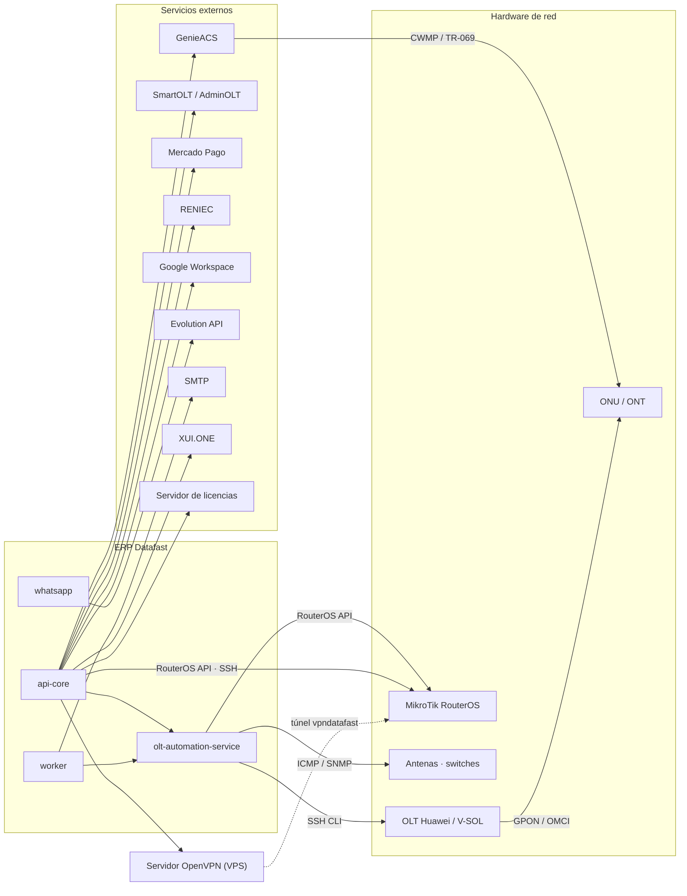
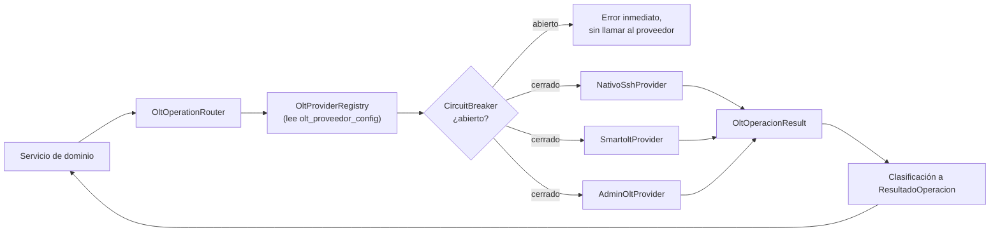

# INT-001 — Arquitectura de Integraciones

---

## 2. Control documental

| Campo | Valor |
|---|---|
| **Código** | INT-001 · **Versión** 1.0 · **Estado** Vigente |
| **Autor** | Arquitectura · **Revisores** Pendientes de asignar |
| **Fecha** | 2026-08-06 · **Documento superior** CON-001, POL-001, ARS-001 |

## 3. Historial de cambios

| Versión | Fecha | Cambio | Motivo |
|---|---|---|---|
| 1.0 | 2026-08-06 | Emisión inicial | Las integraciones existían sin inventario ni nivel de acoplamiento declarado; había dependencias fuera del repositorio que nadie había registrado |

## 4. Índice

1. Integraciones existentes · 2. Adaptadores · 3. APIs · 4. Eventos · 5. Contratos ·
6. Estrategias de resiliencia

## 5. Objetivo

Declarar con qué sistemas externos se integra el ERP, cómo lo hace, qué nivel de acoplamiento
tiene con cada uno y qué estrategias de resiliencia protegen esas fronteras.

## 6. Alcance

Integraciones activas en el commit base, más las declaradas y no implementadas (§8.1.3). Cubre
también la frontera interna backend ↔ servicio Python.

## 7. Definiciones y glosario

| Término | Definición |
|---|---|
| **Puerto** | Interfaz que declara el contrato de una integración |
| **Adaptador** | Implementación de un puerto para un proveedor concreto |
| **Acoplamiento** | Cuánto código de negocio habría que tocar para sustituir el proveedor |
| **Degradable** | El módulo arranca aunque el proveedor no responda |
| **Circuit breaker** | Corte temporal de llamadas a un proveedor que falla |
| **VIO** | Verificación independiente de materialización |
| **NBI** | *NorthBound Interface* — API de administración de GenieACS |

---

# 8. Contenido

## 8.1 Integraciones existentes

### 8.1.1 Mapa

### 8.1.2 Inventario

| # | Integración | Propósito | Método | Acoplamiento | Degradable | Riesgo principal |
|---|---|---|---|---|---|---|
| 1 | **OLT Huawei / V-SOL** | Provisión GPON, verificación, rollback | SSH CLI vía servicio Python | **Bajo** | Sí | Serializado por 1 worker uvicorn |
| 2 | **MikroTik RouterOS** | PPPoE, colas, firewall, address-lists, DHCP | API nativa + SSH + Python | **Alto** | Parcial | **3 caminos independientes, sin abstracción común** |
| 3 | **GenieACS** | Gestión remota del CPE | HTTP NBI | **Medio** | Sí | Credenciales duplicadas fuera del repositorio |
| 4 | **SmartOLT / AdminOLT** | Proveedor OLT alternativo | HTTPS REST | **Bajo** | Sí (breaker) | Camino legado en migración |
| 5 | **OpenVPN** | Canal hacia toda la planta MikroTik | Filesystem + callbacks HTTP | **Alto** | **No** | **Punto único de falla del plano de red** |
| 6 | **Mercado Pago** | Cobro en línea | REST + webhook | **Alto** | Sí | **Existe puerto de cobro y no lo usa** |
| 7 | **RENIEC** | Validación de identidad en el alta | HTTPS REST | Bajo | Sí | Sin proveedor alternativo |
| 8 | **Google Calendar** | Agenda de instalaciones y visitas | OAuth2 + REST, vía cola | Bajo | Sí | — |
| 9 | **Google Contacts** | Sincronización de contactos | OAuth2 + REST, vía cola | Bajo | Sí | — |
| 10 | **Google Drive** | Destino de respaldos | OAuth2 + REST, vía cola | Bajo | Sí | — |
| 11 | **Google Maps / Geocoding** | Geocodificación de direcciones | REST, vía cola | Bajo | Sí | — |
| 12 | **Evolution API** | WhatsApp transaccional | HTTP + webhook | Medio | Sí | Base propia en el mismo PostgreSQL |
| 13 | **WhatsApp Web** | Bandeja CRM | `whatsapp-web.js` + Chromium | **Alto** | Sí | No es API oficial; mitigado por aislamiento de proceso |
| 14 | **SMTP** | Correo | SMTP | Bajo | Sí | — |
| 15 | **XUI.ONE** | IPTV | HTTP REST | Bajo | Sí | Cron cada 30 s contra servicio externo |
| 16 | **Servidor de licencias** | Habilitación del ERP | HTTPS + webhook | **Máximo** | **No, por diseño** | Su caída bloquea el ERP completo |
| 17 | **Let's Encrypt** | Certificados TLS | ACME | Bajo | — | — |
| 18 | **OpenStreetMap** | Tiles del mapa | Frontend | Bajo | — | — |

### 8.1.3 Integraciones declaradas y NO implementadas

| Elemento | Estado real | Consecuencia |
|---|---|---|
| **SUNAT / Facturación electrónica** | Página en el frontend, **cero backend** | Un operador puede creer que existe |
| **SMS** | Sin proveedor en el gateway | Los avisos de corte dependen solo de WhatsApp |
| **Niubiz / Culqi / Izipay / Stripe** | **Contrato definido, adaptadores deliberadamente ausentes** | Correcto — puerta de estabilidad documentada |
| **Telegram** (`telegraf`) | Dependencia instalada, sin uso | Superficie sin valor |
| **Twilio** | Dependencia instalada, sin uso | Ídem |
| **`net-snmp`** (Node) | Declarada; el SNMP real está en Python | Ídem |

## 8.2 Adaptadores

### 8.2.1 Puertos declarados

| Puerto | Ubicación | Adaptadores | Estado |
|---|---|---|---|
| **`IOltProvider`** | `olt-nativo/interfaces/olt-provider.interface.ts` | `nativo-ssh` · `smartolt` · `adminolt` | **Activo — 3 implementaciones** |
| **Adaptador de cobro** | `pagos/adaptadores/adaptador-cobro.interface.ts` | **Ninguno — deliberado** | Contrato fijado, implementación bloqueada |
| Provisionamiento | `aprovisionamiento/interfaces/` | `mock-provisionamiento` | Esqueleto |
| Driver ACS | `olt-nativo/ztp/` | `genieacs.driver.ts` + registry + resolver | Activo, driver único |
| Drivers OLT (Python) | `olt-automation-service/app/drivers/` | `huawei` · `vsol` sobre `base` | Activo |
| Estrategias de mensajería | `notificaciones/services/*.strategy.ts` | native · masiva · smtp | Activo |
| Estrategias de queue | `mikrotik/services/velocidad/` | simple_queue · queue_tree · pcq · sin_limite | Activo |

### 8.2.2 Contrato obligatorio de todo adaptador de protocolo

Extraído de `IOltProvider` — **es el estándar del sistema y aplica a cualquier adaptador nuevo**:

| # | Regla |
|---|---|
| 1 | **Nunca propagar una excepción al llamador.** Todo error se captura y se retorna como resultado estructurado (`exitoso`, `mensaje`, `latenciaMs`) |
| 2 | **Medir latencia** incluyendo el tiempo de conexión SSH/HTTP |
| 3 | **No modificar el estado de la base de datos desde dentro del adaptador.** Los adaptadores son **puros de protocolo**; el estado lo actualizan el Router y el CircuitBreaker |
| 4 | Las credenciales descifradas **viven solo en memoria** durante la operación y **nunca se loguean** |

### 8.2.3 Enrutamiento multi-proveedor

**Regla de negocio:** una OLT admite **un solo proveedor**, fijado al registrarla.

### 8.2.4 Adaptador ausente por decisión: el cobro

El contrato existe y **ninguna implementación lo usa todavía, deliberadamente**:

> *"El contrato se fijó en la Etapa I a propósito. Si se hubiera dejado para la Etapa II, la
> primera integración lo habría definido de facto y las demás se habrían acomodado a las
> peculiaridades de ese proveedor."*

**Puerta de estabilidad** (POL-001 §5.3): 30 días de invariante de contabilidad limpio en
producción, un extorno real revisado a mano y un cierre de caja mensual cuadrado. Dos de los tres
criterios **no dependen de escribir código**.

**Orden obligatorio antes del primer adaptador:**
1. Comprobar la puerta.
2. Construir el motor de cobro (`cobro_intento` + conciliador) — *"un adaptador sin la máquina de estados del cobro en vuelo no tiene dónde reportar un `indeterminado`"*.
3. **Migrar Mercado Pago al contrato antes que ningún proveedor nuevo** — *"si la abstracción no lo absorbe, la abstracción está mal y se corrige con un proveedor, no con tres"*.

## 8.3 APIs

### 8.3.1 APIs expuestas por el ERP

| Superficie | Prefijo | Endpoints | Autenticación | Consumidor |
|---|---|---|---|---|
| **API del ERP** | `/api/v1/*` | ~520 | JWT operador + licencia + rol | Frontend |
| **API del Portal** | `/api/v1/portal/*` | 28 | **JWT propio + cookies** | Portal del abonado |
| **Webhooks entrantes** | `/api/v1/webhooks/*`, `/pagos/webhooks/*` | 4 | Firma / clave del proveedor | Mercado Pago, Evolution, licencias |
| **Callbacks de OpenVPN** | `/api/v1/openvpn/mikrotik-clients/*` | 5 | Token / CN | Servidor OpenVPN local |
| **Health** | `/health*`, `/status` | 5 | Público | Docker, PM2, scripts |

### 8.3.2 API interna del servicio Python

| Aspecto | Valor |
|---|---|
| Base | `http://127.0.0.1:8001` — **nunca expuesta a internet** |
| Autenticación | API key en middleware (`OLT_AUTOMATION_INTERNAL_KEY`) |
| Consumidor | **Exclusivamente** el backend NestJS |
| Endpoints | ~40 |

**Grupos:**

| Grupo | Prefijo | Contenido |
|---|---|---|
| Núcleo OLT | `/api/v1/` | provision · optical-metrics · discover-onus · test-connection · batch-status · deprovision · verify-onu · firmware-upgrade · list-profiles · ont-reset · board-topology · ont-version · diagnostic-display |
| FTTH | `/api/v1/ftth/` | provision-gpon · inject-wan-pppoe · bootstrap-tr069 · teardown-tr069 · rollback-gpon · ont-ids · poll-online · **check-wan** · **check-mgmt-ip** · suspend-onu · rehabilitate-onu |
| Service-port | `/api/v1/service-port/` | **undo (verificado)** |
| MikroTik | `/api/v1/mikrotik/` | 9 endpoints sobre el pool RouterOS |
| Monitoreo | `/api/v1/monitoring/` | ping ICMP · lote · SNMP |

Los endpoints en negrita son **sondas VIO**: existen para verificar materialización, no para
mutar.

### 8.3.3 Contratos de consumo hacia el exterior

| Proveedor | Contrato | Versionado |
|---|---|---|
| GenieACS | NBI HTTP + presets + provisions | **No versionado** — depende de la config del ACS |
| SmartOLT / AdminOLT | REST propietaria | No versionado |
| Mercado Pago | SDK oficial `mercadopago@2` | Versionado por el SDK |
| Google | SDK oficial `googleapis@140` | Versionado por el SDK |
| Evolution API | REST v2.2.3 | Fijado por versión de imagen |
| RENIEC | REST propietaria | No versionado |
| XUI.ONE | REST propietaria | No versionado |

> **Riesgo declarado:** no existe OpenAPI ni JSON-Schema de las respuestas externas. **Un cambio
> del proveedor se descubre en producción.**

## 8.4 Eventos

### 8.4.1 Eventos entrantes (webhooks)

| Endpoint | Origen | Verificación | Efecto |
|---|---|---|---|
| `POST /pagos/webhooks/mercadopago` | Mercado Pago | Firma del proveedor (`rawBody` habilitado) | Registro de pago → aplicación → posible reactivación |
| `POST /webhooks/whatsapp` | Evolution API / Meta | Según configuración del gateway | Mensaje entrante al CRM |
| `POST /admin/licencia/webhook/revocar` | Servidor de licencias | Clave de licencia | **Bloqueo del ERP** |
| `POST /openvpn/.../verify-auth` | Servidor OpenVPN | Token | Autorización del túnel |
| `POST /openvpn/.../verificar-sesion-cn` | Servidor OpenVPN | CN | Validación de sesión |
| `POST /openvpn/.../disconnect-notify` | Servidor OpenVPN | Token | Registro de caída de túnel |

### 8.4.2 Eventos salientes

El ERP **no publica eventos hacia el exterior**. No hay webhooks de salida ni suscriptores
externos. Toda la integración saliente es **llamada síncrona o encolada**.

### 8.4.3 Eventos internos que disparan integración

| Evento | Integración disparada |
|---|---|
| `cliente.created` | Google Contacts (cola) |
| `instalacion.completed` | Google Calendar (cola) |
| `visita.scheduled` | Google Calendar (cola) |
| `pago.registered` | Google (cola) |
| `contrato.suspended` | Google (cola) |
| `FACTURA_EMITIDA`, `SERVICIO_*`, `PAGO_*` | WhatsApp / SMTP (cola `notificaciones`) |
| `ftth.inventario.reobservar` | Lectura de OLT vía Python |

## 8.5 Contratos

### 8.5.1 Contrato de resultado (interno, obligatorio)

Todo método invocable por un orquestador devuelve `ResultadoOperacion`:

| Clase | Semántica | Acción del orquestador |
|---|---|---|
| `aplicado` | Ejecutado y verificado | Marcar hecho |
| `ya_en_destino` | Ya estaba así | **Marcar hecho (es éxito)** |
| `no_aplica` | No corresponde a este recurso | Descartar |
| `rechazado_definitivo` | Nunca funcionará | **No reintentar** |
| `reintentable` | Vuelve luego | Reintentar con backoff |
| `indeterminado` | No se sabe si se aplicó | **Auditar, no reintentar a ciegas** |

**Las cuatro reglas del clasificador:**
1. `indeterminado` es **obligatorio** ante un timeout contra hardware.
2. La lista de definitivos es **explícita y corta: solo 400 y 404**.
3. Ante la duda: **reintentable** (reintentar es recuperable, descartar no).
4. **Nunca inferir reintentabilidad de un código HTTP.**

### 8.5.2 Contrato de idempotencia

| Integración | Mecanismo |
|---|---|
| Comandos de red | Máquina de estados → `ya_en_destino` |
| Notificaciones | Índice UNIQUE `idx_notif_logs_idempotency_key` |
| Compensaciones de saga | "Does not exist" al deshacer = **éxito** |
| Operaciones OLT | `olt-idempotency.service.ts` |

### 8.5.3 Contrato de verificación (VIO)

Toda mutación contra hardware debe declarar **su sonda de verificación**. Sin sonda, un paso
`en_vuelo` no es resoluble y la operación no puede compensarse con seguridad.

## 8.6 Estrategias de resiliencia

### 8.6.1 Catálogo

| Estrategia | Implementación | Aplicada a |
|---|---|---|
| **Patrón degradable** | `OnModuleInit` + probe + `ModuleHealthService` | Todo módulo con dependencia externa |
| **Circuit breaker** | `CircuitBreakerRegistry` + por proveedor | MikroTik, OLT, proveedores externos |
| **Outbox transaccional** | `comandos_red_pendientes` + reclamo atómico | Toda mutación de red del negocio |
| **Reintentos clasificados** | `ResultadoOperacion` + `JOB_OPTIONS` | Colas y outbox |
| **Backoff** | Exponencial (5–30 s) o fijo (60 s) según perfil | Colas |
| **Timeouts realistas** | 90 s WAN · 150 s rollback | Operaciones OLT |
| **Pool de conexiones** | RouterOS y SSH | MikroTik, OLT |
| **Serialización deliberada** | 1 worker uvicorn | OLT (límite VTY) |
| **Cache defensiva** | Redis TTL 300 s | RENIEC, estado de ONU en el portal |
| **Congelación de estado** | Si el servicio Python no responde: OLT OFFLINE, **no tocar ONUs** | Monitoreo |
| **Watchers de invariante** | 9 procesos periódicos | Huérfanas, rollbacks, locks, claims, pools |
| **Saga con compensación** | Bitácora write-ahead + sonda | Wizard FTTH |
| **Goteo con jitter** | `i × 12 s + random(0–4 s)` | Campañas masivas |

### 8.6.2 Estrategia por integración

| Integración | Degradable | Breaker | Cola | Outbox | VIO | Cache |
|---|---|---|---|---|---|---|
| OLT | ✅ | ✅ | — | ✅ | ✅ | Snapshot en BD |
| MikroTik | Parcial | ✅ | ✅ | ✅ | Parcial | — |
| GenieACS | ✅ | — | — | — | ✅ | ✅ (portal) |
| SmartOLT | ✅ | ✅ | — | — | ✅ | — |
| OpenVPN | ❌ | — | — | — | — | — |
| Mercado Pago | ✅ | — | ✅ | — | — | — |
| RENIEC | ✅ | — | — | — | — | ✅ |
| Google | ✅ | — | ✅ | — | — | — |
| WhatsApp | ✅ | — | ✅ | — | — | ✅ (estado gateway) |
| SMTP | ✅ | — | ✅ | — | — | — |
| XUI | ✅ | — | — | — | — | — |
| Licencias | ❌ **por diseño** | — | — | — | — | ✅ |

### 8.6.3 La regla que gobierna toda integración con hardware

> **Un timeout no significa "no pasó nada".** La operación pudo aplicarse y solo tardar más que
> el límite del cliente. Reintentar a ciegas la ejecuta dos veces; reportar fallo deja el sistema
> creyendo algo falso. **Las dos opciones que parecen simples son las dos incorrectas.**

---

# 9. Referencias

CON-001 · POL-001 · ARS-001 · SEC-001 · ADR-003, ADR-004, ADR-006, ADR-008, ADR-013 ·
`docs/auditoria/` capítulos 8 y 12 · `pagos/adaptadores/README.md`

---

# 10. Anexos

## Anexo A — Variables de entorno por integración

| Integración | Variables |
|---|---|
| Servicio Python | `OLT_AUTOMATION_SERVICE_URL`, `OLT_AUTOMATION_INTERNAL_KEY` |
| GenieACS | `GENIEACS_NBI_URL` (+ credenciales de connreq **en el propio ACS**) |
| SmartOLT | `SMARTOLT_URL`, `SMARTOLT_TOKEN` |
| RENIEC | `RENIEC_API_URL`, `RENIEC_API_TOKEN` |
| Google | `GOOGLE_MAPS_API_KEY`, `GOOGLE_TOKEN_ENCRYPTION_KEY` (+ OAuth por empresa en BD) |
| Evolution | `EVOLUTION_API_URL`, `EVOLUTION_API_KEY` |
| OpenVPN | `VPN_SERVER_IP`, `VPN_SERVER_PORT` |
| Licencia | `LICENSE_KEY` |
| Cifrado de credenciales en BD | `ENCRYPTION_KEY` |

Todas se documentan en `.env.example` como contrato de instalación.

## Anexo B — Dependencias fuera del repositorio

| Dependencia | Dónde vive | Verificación |
|---|---|---|
| Credenciales de connreq de GenieACS | Provision `erp-connreq-creds` en el ACS **y** `.env` del VPS | **Ninguna** |
| CCD y certificados OpenVPN | Filesystem del VPS | Cron de limpieza |
| `mikrotik.conf` (rutas 10.0.0.0/8) | VPS | Ninguna |
| Crontab del sistema | VPS, editable desde la UI | Ninguna |

**Consecuencia:** una instalación nueva **no es totalmente reproducible desde el repositorio**,
pese al excelente trabajo de portabilidad multi-VPS. Ver RDM-001 (R15).

## Anexo C — Hallazgos de campo por integración

| Integración | Hallazgo | Consecuencia |
|---|---|---|
| ONU EG8145V5 | **`ont reset` NO la reinicia** (probado con captura: 0 paquetes a la OLT). SmartOLT usa TR-069 al CPE | Un power-cycle físico sí gatilla boot-inform |
| ONU EG8145V5 | El ME137 (OMCI) **no escribe** la ACS URL en este firmware; Option 43 sí converge | `dhcp_bootstrap` es CERTIFIED, `omci` EXPERIMENTAL — **decisión por modelo, nunca global** |
| ONU EG8145V5 | El panel web **se autobloquea tras 3 logins fallidos** y solo escucha en la LAN del cliente | El canal `cpe_local` es excepcional |
| GenieACS | El tag `AuthEnforced` con una ONU reseteada informando sin credenciales produce **deadlock** de Inform | Gracia de bootstrap: se quita el tag y se re-endurece al re-provisionar |
| OLT firmware R018 | `dba-profile delete profile-name` (no `undo`); eco pegado = sintaxis, no transporte; **hay que drenar el autosave antes de enviar comandos** | Un reintento tras autosave da `% Unknown command` y produce falso negativo |
| RouterOS | Bug `!empty` en `node-routeros` | Doble patch (Channel + Receiver): timeout **30 s → 988 ms** |
| Lectura óptica | Netmiko era muy lento | Migración a paramiko: **60 s → 4 s** |
