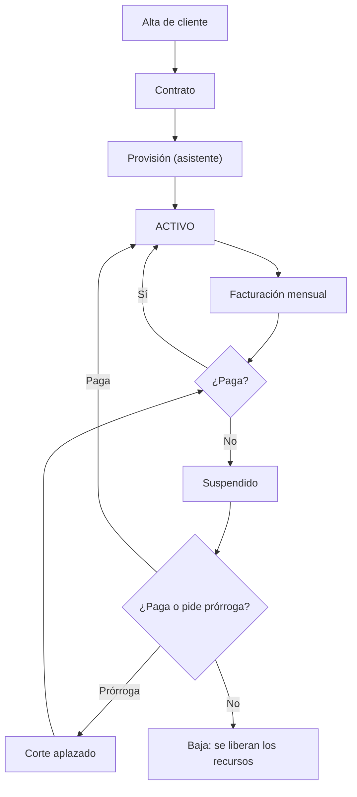

# MAN-001 — Manual del Operador

---

## 2. Control documental

| Campo | Valor |
|---|---|
| **Código** | MAN-001 · **Versión** 1.0 · **Estado** Vigente |
| **Autor** | Arquitectura · **Revisores** Pendientes de asignar |
| **Fecha** | 2026-08-06 · **Audiencia** Personal del ISP que usa el ERP a diario |
| **Base** | Rutas y endpoints reales del commit `f8d52b00` |

## 3. Historial de cambios

| Versión | Fecha | Cambio | Motivo |
|---|---|---|---|
| 1.0 | 2026-08-06 | Emisión inicial | No existía documentación de uso; el conocimiento operativo vivía en la memoria del equipo |

## 4. Índice

1. Antes de empezar · 2. Mapa de la aplicación · 3. Gestión de abonados · 4. Contratos ·
5. Provisión del servicio · 6. Facturación · 7. Caja y cobranza · 8. Prórrogas ·
9. Red y ONUs · 10. Soporte · 11. Mensajería · 12. Qué hacer cuando algo va mal

## 5. Objetivo

Enseñar a operar el ERP Datafast en las tareas diarias, explicando **no solo qué botón pulsar,
sino qué ocurre por debajo** — porque en un ISP las acciones del ERP mueven hardware real.

## 6. Alcance

**Cubre:** las operaciones diarias del personal comercial, de caja, técnico y de soporte.

**No cubre:** administración de la plataforma (MAN-002), operación del VPS (PRO-001) ni
desarrollo (GUI-001).

### 6.1 Nota sobre el formato

Este manual **no incluye capturas de pantalla ni recorridos pantalla por pantalla**. Describe las
secciones reales de la aplicación, qué hace cada acción y qué consecuencias tiene. Las capturas
requieren validación con el producto en ejecución y con usuarios reales; están registradas como
pendiente en RDM-001.

## 7. Definiciones y glosario

| Término | Qué significa para ti |
|---|---|
| **Abonado / Cliente** | La persona o empresa que contrata el servicio |
| **Contrato** | Un servicio concreto, en una dirección concreta, con un plan. **Un cliente puede tener varios** |
| **ONU** | El equipo de fibra que está en casa del abonado |
| **OLT** | El equipo de la central al que llegan las fibras |
| **PPPoE** | El usuario y contraseña con los que el router del abonado se conecta |
| **Provisionar** | Dar de alta el servicio en el equipo físico |
| **Suspender** | Cortar el servicio por deuda (se puede revertir) |
| **Desaprovisionar / Baja** | Retirar el servicio del equipo (**libera los recursos**) |
| **Prórroga** | Aplazar el corte a un abonado que promete pagar |
| **Extorno** | Revertir un pago mal registrado. **Es la única forma correcta** |
| **Aceptado, sin confirmar** | El equipo recibió la orden pero el sistema **no ha podido comprobar** que se aplicó |

---

# 8. Contenido

## 8.1 Antes de empezar

### 8.1.1 Cuatro cosas que debes entender

| # | Concepto | Por qué te importa |
|---|---|---|
| 1 | **El ERP mueve hardware real** | Cuando suspendes un contrato, un equipo en la central deja de dar servicio a una persona |
| 2 | **Algunas acciones no son inmediatas** | Las órdenes a la red se encolan y pueden tardar **hasta 5 minutos** |
| 3 | **"Aceptado, sin confirmar" no es un error** | Significa que la orden salió pero el sistema aún no pudo verificarla. **No la repitas: consulta primero** |
| 4 | **Cerrar un asistente a medias deshace lo hecho** | Es intencionado: evita dejar equipos configurados a medias. Lo ya **confirmado** no se deshace |

### 8.1.2 Acceso

Entra con tu usuario y contraseña. Si olvidaste la contraseña, usa «¿Olvidaste tu contraseña?».

**La sesión se cierra sola por inactividad.** Es intencionado.

### 8.1.3 Lo que puedes hacer depende de tu rol

Si una opción no aparece o te dice que no tienes permiso, tu rol no la incluye. Pídelo al
administrador; no intentes rodearlo.

## 8.2 Mapa de la aplicación

| Sección | Para qué |
|---|---|
| **Dashboard** | Resumen del día |
| **Clientes** | Alta y ficha de abonados · Instalaciones |
| **Abonados** | Vista operativa del parque |
| **Contratos** | Servicios contratados |
| **Facturación** | Comprobantes |
| **Pagos / Caja** | Registro de cobros, arqueo y cierre |
| **Finanzas** | Registro, gastos, proyectos, prórrogas, ajustes de cobranza |
| **Red** | Routers · OLT · Mapa · VPN · Sites · Cajas NAP · Planta externa · Redes IPv4 · Drift |
| **Monitoreo** | Estado de equipos y alertas |
| **Tickets** | Soporte (nuevos, contestados, cerrados) |
| **Mensajería** | WhatsApp, campañas, plantillas, enviados |
| **Servicios** | Planes de internet y servicios personalizados |
| **IPTV** | Líneas de televisión |
| **Reportes** | Cobranza, clientes, red |
| **Técnicos** | Personal de campo |
| **Configuración** | Ajustes (ver MAN-002) |

## 8.3 Gestión de abonados

### 8.3.1 Dar de alta un cliente

**Dónde:** Clientes → Nuevo (asistente).

| Paso | Qué haces | Qué ocurre |
|---|---|---|
| 1 | Introduces el documento | El sistema consulta **RENIEC** y rellena los datos |
| 2 | Completas contacto y dirección | — |
| 3 | Marcas la ubicación en el mapa | **Esta coordenada es la que se usa en el mapa de red.** Ponla bien |
| 4 | Guardas | Se crea el cliente, se registra en el historial y **se envía el mensaje de bienvenida** |

> **Si RENIEC no responde**, puedes continuar rellenando a mano: el sistema no se bloquea. Pero
> verifica los datos, porque nadie los validó.

### 8.3.2 Ficha del cliente

Reúne datos, contratos, facturación, pagos, ONU/router, historial y tickets.

**Acciones disponibles:** editar · cambiar estado · subir foto · configurar su ciclo de
facturación · ver historial · dar de baja.

### 8.3.3 Configurar el ciclo de cobro de un cliente

**Dónde:** ficha del cliente → configuración de facturación.

Define: día de emisión, vencimiento y **días de gracia**.

> ⚠️ **Los días de gracia son la distancia entre el vencimiento y el corte, NO días añadidos al
> vencimiento.** Si el vencimiento es el día 5 y la gracia son 3 días, se corta el día 8.

## 8.4 Contratos

### 8.4.1 Crear un contrato

**Dónde:** Contratos → Nuevo.

| Necesitas | Nota |
|---|---|
| Cliente | Debe existir |
| Plan | Del catálogo |
| Router o nodo | Según la tecnología |
| Segmento IPv4 | El sistema propone la **siguiente IP libre** |
| Ubicación de instalación | Puede heredarse del cliente |

Al guardar se genera el **número de contrato** (correlativo) y la IP queda reservada.

> **Un cliente puede tener varios contratos.** Uno por cada servicio en cada dirección.

### 8.4.2 Estados de un contrato

| Estado | Significado |
|---|---|
| **Borrador** | Creado, sin servicio |
| **Activo** | Con servicio funcionando |
| **Suspendido** | Cortado por deuda. **Se recupera pagando** |
| **Baja** | Terminado. **Los recursos se liberaron** |

### 8.4.3 Cambiar el plan

**Dónde:** contrato → Actualizar servicio.

> ⚠️ **Verifica después.** El cambio de plan actualiza el sistema y el equipo en **dos pasos
> separados**, y pueden quedar distintos. Comprueba en Red → Routers → Velocidad → Discrepancias
> que no quedó descuadrado. Si aparece, usa «Sincronizar».

### 8.4.4 Dar de baja

Retira el servicio del equipo y **libera los recursos** (IP, puerto, identificadores).

**Antes de dar de baja:** confirma que el abonado no volverá pronto. Si vuelve, hay que
provisionar de nuevo desde cero.

## 8.5 Provisión del servicio

### 8.5.1 Provisión FTTH (fibra) — el asistente

**Dónde:** ficha del cliente o contrato → Provisionar ONU.

| Fase | Qué ocurre | Qué ves |
|---|---|---|
| 1 | Se reservan recursos en la OLT | Progreso |
| 2 | Se registra la ONU (`ont add`) | «Registrado en GPON» |
| 3 | **Se verifica en el equipo** que quedó registrada | Confirmación |
| 4 | Se inyecta la conexión de internet (WAN PPPoE) | Puede tardar hasta **90 segundos** |
| 5 | **Se verifica** que la conexión existe | Confirmación |
| 6 | (Opcional) Se activa la gestión remota | «Carril activo» |
| 7 | Se configura el router del abonado | — |
| 8 | El servicio queda **ACTIVO** | ✅ |

### 8.5.2 Las tres reglas del asistente

| # | Regla |
|---|---|
| 1 | **Si cierras el asistente antes de que el servicio quede ACTIVO, todo lo hecho se deshace.** Es intencionado: evita dejar la ONU registrada en la central sin registro en el sistema |
| 2 | **Si el servicio ya llegó a ACTIVO, cerrar no deshace nada.** Para quitarlo hay que dar de baja explícitamente |
| 3 | **Si algo falla a mitad, cierra y empieza de nuevo.** El sistema limpia solo. **No intentes arreglarlo a mano en la OLT** |

> ⚠️ **No cierres el navegador mientras una fase está en curso.** El sistema esperará a que el
> equipo termine antes de deshacer nada — nunca corta una operación por la mitad — pero la
> limpieza puede tardar unos minutos.

### 8.5.3 Si aparece «aceptado, sin confirmar»

Significa: **la orden salió, pero el sistema no pudo comprobar que se aplicó.** Puede que sí se
haya aplicado.

| Qué hacer | Qué NO hacer |
|---|---|
| Espera unos minutos y consulta el estado en Red → OLT → Ver ONU | ❌ Repetir la operación inmediatamente |
| Si persiste, avisa al responsable técnico | ❌ Configurar el equipo a mano por otro camino |

### 8.5.4 Provisión WISP (radioenlace)

**Dónde:** Red → Routers → el router → Provisionar.

Crea el usuario PPPoE, la limitación de velocidad y las reglas correspondientes.

> ⚠️ **La provisión WISP tiene menos comprobaciones automáticas que la FTTH.** Verifica siempre
> que el abonado navega antes de cerrar la orden.

## 8.6 Facturación

### 8.6.1 Emisión

**Automática:** el sistema emite mensualmente según el ciclo de cada cliente.
**Manual:** Facturación → Nueva. **Masiva:** Facturación → Generar mensual.

> La generación masiva **no se reintenta sola** si falla. Revisa el resultado.

### 8.6.2 Acciones sobre una factura

| Acción | Cuándo |
|---|---|
| Ver / descargar PDF | Siempre |
| Editar | Antes de que tenga pagos aplicados |
| **Nota de crédito** | Para corregir una factura emitida |
| **Anular** | Factura emitida por error |
| Marcar vencidas | Se hace solo; el botón es para forzarlo |

> ⚠️ **Anular una factura no devuelve dinero.** Si hubo un pago, hay que **extornarlo** (§8.7.4).

## 8.7 Caja y cobranza

### 8.7.1 Registrar un pago

**Dónde:** Pagos → Nuevo, o Caja.

| Paso | Qué haces |
|---|---|
| 1 | Buscas al cliente y ves su deuda |
| 2 | Eliges canal de pago y cuenta receptora |
| 3 | Introduces el importe |
| 4 | Adjuntas el comprobante si aplica |
| 5 | Guardas |

**Qué ocurre después:** el pago se aplica a las facturas pendientes; si cubre la deuda y el
servicio estaba suspendido, **se encola la reactivación**.

> ⏱️ **La reactivación no es instantánea.** La orden va a la red y puede tardar unos minutos.
> Avisa al abonado. No registres el pago dos veces.

### 8.7.2 Si el importe supera la deuda

El sobrante queda como **saldo a favor (adelanto)** y se aplicará automáticamente a la siguiente
factura. Puedes consultarlo en Finanzas → Adelanto/Prórroga.

### 8.7.3 Verificar y conciliar

| Estado | Significado |
|---|---|
| **Registrado** | El pago está en el sistema |
| **Verificado** | Un supervisor comprobó el comprobante |
| **Conciliado** | Se confirmó el ingreso en la cuenta |

### 8.7.4 Extornar un pago

**Único procedimiento correcto para revertir un pago.**

| Cuándo | Cómo |
|---|---|
| Pago registrado por error, importe equivocado, cliente equivocado, pago devuelto | Pagos → el pago → Extornar, indicando el motivo |

> ⚠️ **Nunca elimines un pago aplicado para "corregirlo".** El extorno revierte las aplicaciones
> y deja constancia. Eliminar deja la contabilidad descuadrada sin rastro de por qué.

### 8.7.5 Arqueo y cierre de caja

**Dónde:** Caja → Arqueo.

Muestra lo recaudado por canal en el turno. Cuadra el efectivo antes de cerrar. Al cerrar, el
turno queda registrado y no se modifica.

### 8.7.6 Cobro en línea

Si está configurado, el abonado paga desde el portal por Mercado Pago. El pago entra
automáticamente.

> Si un abonado dice que pagó y no aparece: espera unos minutos, revisa Pagos → Pendientes y
> avisa al administrador. **No registres un segundo pago manual** sin confirmar.

## 8.8 Prórrogas

**Dónde:** Finanzas → Adelanto/Prórroga, o desde el contrato.
**Requiere permiso específico** (`contratos:prorroga`).

| Qué haces | Qué ocurre |
|---|---|
| Concedes una prórroga con fecha límite | El corte se aplaza; si el servicio estaba cortado, se reactiva |
| Llega la fecha sin pago | **El sistema suspende automáticamente** (revisa cada minuto) |
| Cancelas la prórroga | El contrato vuelve a su curso normal |

## 8.9 Red y ONUs

### 8.9.1 Ver el estado de una ONU

**Dónde:** Red → OLT → la OLT → ONUs, o desde la ficha del cliente.

| Estado | Significado | Acción típica |
|---|---|---|
| **Online** | Funcionando | — |
| **Apagada** | Sin energía en el domicilio | Contactar al abonado |
| **Ruptura de fibra** | Fibra cortada o desconectada | Orden de trabajo a campo |
| **Desactivada** | Suspendida por el sistema (deuda) | Verificar la deuda |
| **Offline** | Sin comunicación, causa desconocida | Diagnóstico |

> ⚠️ Esta consulta **habla con la central en vivo** y tarda unos segundos. **No la refresques
> repetidamente**: la central admite pocas consultas simultáneas y puedes afectar a otras
> operaciones.

### 8.9.2 Señal óptica

| Valor | Interpretación |
|---|---|
| Mejor que -27 dBm | Correcta |
| Entre -27 y -30 dBm | **Degradada** — fibra sucia o doblada |
| Peor que -30 dBm | **Crítica** — corte inminente |

### 8.9.3 Gestión remota del equipo del abonado (TR-069)

**Dónde:** Ver ONU → gestión en vivo. **Requiere el carril activo.**

Puedes: ver información · cambiar el WiFi (nombre y clave, por banda) · cambiar credenciales
PPPoE · cambiar el acceso web · reiniciar · restaurar de fábrica.

> ⚠️ **Restaurar de fábrica borra toda la configuración del abonado**, incluida su clave de WiFi.
> Avísale antes. El equipo tarda un par de minutos en volver.

### 8.9.4 Routers

**Dónde:** Red → Routers.

Ver estado, interfaces, tráfico, sesiones activas, colas, DHCP, morosos; hacer ping; provisionar,
suspender y reactivar abonados; cambiar velocidades.

> Si un router aparece caído, revisa primero **Red → VPN**: sin el túnel, el ERP no lo ve aunque
> esté funcionando.

### 8.9.5 Mapa de red

**Dónde:** Red → Mapa. Muestra abonados, NAPs y elementos de planta.

Si un abonado no aparece, casi siempre es porque **su contrato no tiene coordenadas de
instalación**.

### 8.9.6 Drift (descuadres)

**Dónde:** Red → Drift.

Lista donde el sistema y los equipos **no coinciden**. Revísalo periódicamente: cada entrada es un
abonado que puede estar cortado sin deberlo, o navegando sin pagar.

## 8.10 Soporte

### 8.10.1 Tickets

**Dónde:** Tickets → Nuevos / Contestados / Cerrados.

Crear, asignar a un técnico, comentar, cerrar, calificar.

### 8.10.2 Qué mirar antes de enviar a un técnico

| # | Comprobación | Dónde |
|---|---|---|
| 1 | ¿Tiene deuda? ¿Está suspendido? | Ficha del cliente |
| 2 | ¿La ONU está online? | Ver ONU |
| 3 | ¿Cómo está la señal óptica? | Ver ONU |
| 4 | ¿El router del nodo está bien? | Red → Routers |
| 5 | ¿Hay alertas activas? | Monitoreo → Alertas |

Con eso distingues: **corte por deuda** (no es avería), **equipo apagado** (llamada), **ruptura de
fibra** (cuadrilla) y **problema del nodo** (afecta a varios).

## 8.11 Mensajería

| Sección | Uso |
|---|---|
| **WhatsApp** | Conversación directa con abonados |
| **Campañas** | Envíos masivos |
| **Plantillas** | Mensajes reutilizables |
| **Enviados** | Historial y reenvío |

> Las campañas **se envían con goteo** (unos pocos mensajes por minuto). Es intencionado: evita
> el bloqueo del número. Un envío grande tarda horas.

## 8.12 Qué hacer cuando algo va mal

| Síntoma | Causa probable | Qué hacer |
|---|---|---|
| «Ya existe una operación en curso» | Otra persona opera sobre el mismo contrato | Espera unos minutos y reintenta |
| La suspensión o reactivación no se aplica | La orden está encolada | Espera hasta 5 min; si sigue, avisa |
| «Aceptado, sin confirmar» | No se pudo verificar | **Consulta el estado; no repitas** |
| Una ONU no aparece tras provisionar | Puede estar en curso | Revisa el estado FTTH del contrato |
| Un abonado pagó y sigue cortado | La reactivación está en cola | Espera; verifica que el pago se aplicó |
| El mapa no muestra a un abonado | Contrato sin coordenadas | Edita el contrato |
| Un router aparece caído | El túnel VPN puede estar caído | Revisa Red → VPN |
| No llegan mensajes a los abonados | Canal de mensajería caído | Avisa al administrador |
| Una pantalla da error inesperado | Puede ser un problema de la plataforma | Reporta **con la hora exacta y qué hacías** |

### Tres cosas que nunca debes hacer

| # | Nunca |
|---|---|
| 1 | **Configurar un equipo a mano** para "arreglar" lo que el ERP no aplicó. El sistema perderá el control de ese equipo |
| 2 | **Eliminar un pago aplicado.** Usa el extorno |
| 3 | **Repetir una operación** que devolvió «aceptado, sin confirmar» sin consultar antes |

---

# 9. Referencias

MAN-002 (Manual del Administrador) · MOD-001 · MOD-002 · MOD-003 · DOM-001 (glosario completo)

---

# 10. Anexos

## Anexo A — Ciclo de vida del servicio

## Anexo B — Cuánto tarda cada cosa

| Acción | Tiempo esperable |
|---|---|
| Alta de cliente y contrato | Inmediato |
| Consulta RENIEC | Segundos |
| Registro de la ONU | Segundos |
| Inyección de internet (WAN) | Hasta 90 segundos |
| Activar la gestión remota | 1–3 minutos |
| **Suspensión o reactivación en la red** | **Hasta 5 minutos** |
| Reiniciar una ONU por gestión remota | 1–2 minutos |
| Restaurar de fábrica una ONU | ~2 minutos |
| Consultar el estado de una ONU en vivo | Segundos |
| Campaña masiva | Horas (goteo) |

## Anexo C — Preguntas frecuentes

**¿Por qué el corte no es inmediato?**
Las órdenes a los equipos se encolan para no perderse si un equipo no responde. Se reintentan
solas hasta aplicarse.

**¿Puedo cancelar una provisión a medias?**
Sí: cierra el asistente. El sistema deshace lo hecho automáticamente.

**Cerré el navegador durante una provisión. ¿Qué pasó?**
El sistema lo detecta y deshace lo no confirmado. Si el servicio llegó a ACTIVO, **se queda**.

**¿Por qué no puedo cambiar el WiFi de una ONU?**
Necesita la gestión remota activa. Actívala desde Ver ONU.

**Un cliente pagó dos veces. ¿Qué hago?**
Extorna uno de los dos pagos, o déjalo como saldo a favor.

**¿Por qué la lista de ONUs tarda?**
Consulta la central en vivo. Es lento a propósito: da el estado real, no el que el sistema cree.

**¿Puedo dar de baja y volver a dar de alta el mismo día?**
Puedes, pero la baja libera los recursos y el alta los pide de nuevo. **No es la forma de cambiar
una ONU averiada** — consulta con el responsable técnico: hoy esa operación no está automatizada.
