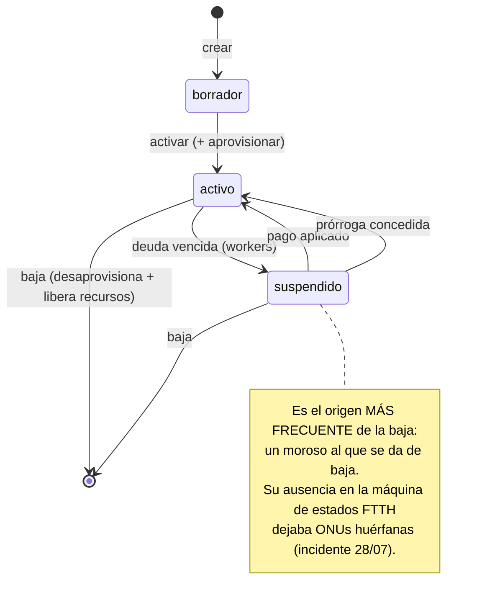

# MOD-001 — Módulo Contratos

---

## 2. Control documental

| Campo | Valor |
|---|---|
| **Código** | MOD-001 · **Versión** 1.0 · **Estado** Vigente |
| **Autor** | Arquitectura · **Revisores** Pendientes de asignar |
| **Fecha** | 2026-08-06 · **Dominio** Comercial · **Criticidad** Máxima (Core Indestructible) |

## 3. Historial de cambios

| Versión | Fecha | Cambio | Motivo |
|---|---|---|---|
| 1.0 | 2026-08-06 | Emisión inicial | Es el agregado raíz del sistema y no estaba documentado |

## 4. Índice

5. Objetivo · 6. Alcance · 7. Glosario · 8.1 Objetivo · 8.2 Alcance funcional · 8.3 Actores ·
8.4 Casos de uso · 8.5 Reglas de negocio · 8.6 APIs · 8.7 Modelo de datos · 8.8 Eventos ·
8.9 Integraciones · 8.10 Pruebas

## 5. Objetivo

Gestionar el contrato de servicio: la unidad operativa que vincula a un abonado con un plan, una
ubicación y unos recursos de red.

## 6. Alcance

**Cubre:** ciclo de vida del contrato, gestión de segmentos IPv4 y asignación de IPs, activación,
cambio de estado, prórroga, disparo del aprovisionamiento y comprobación de alcanzabilidad.

**No cubre:** la provisión física en sí (MOD-003, `mikrotik`), la facturación (`facturacion`) ni
los datos del abonado (`clientes`).

**Capacidades de negocio (AEM-001):** C-02 (contratar), C-03 (asignar recursos), parcialmente
C-16 (cambio de plan) y C-17 (baja).

## 7. Definiciones y glosario

| Término | Definición |
|---|---|
| **Contrato** | Un servicio, en una ubicación, con un plan. **Unidad operativa del ERP** |
| **Segmento IPv4** | Bloque CIDR del que se asignan IPs a contratos |
| **Prórroga** | Aplazamiento del corte concedido al abonado |
| **Ping batch** | Comprobación masiva de alcanzabilidad, para evitar N+1 en el listado |

---

# 8. Contenido

## 8.1 Objetivo

`contratos` es el **agregado raíz** del ERP. Todo lo que el sistema hace —facturar, cortar,
provisionar, atender— se refiere a un contrato. Esto explica y justifica que sea el módulo con más
dependencias salientes (8).

## 8.2 Alcance funcional

| Bloque | Funcionalidad |
|---|---|
| **Contrato** | Crear · listar · ver · editar · eliminar · historial · resumen |
| **Estado** | Activar · cambiar estado · conceder prórroga |
| **Servicio** | Actualizar servicio (plan/velocidad) |
| **Red — segmentos** | CRUD de segmentos IPv4 · siguiente IP libre · disponibilidad · validar CIDR contra el router |
| **Red — consulta** | Antenas/AP de un router · ping batch |
| **Aprovisionamiento** | Disparar la provisión de ONU |

## 8.3 Actores

| Actor | Uso |
|---|---|
| **Operador comercial** | Alta, edición, consulta de contratos |
| **Operador técnico** | Segmentos IPv4, asignación de IP, ping batch |
| **Supervisor** | Prórrogas (permiso `contratos:prorroga`) |
| **`workers` (cron)** | Cambia el estado al suspender y reactivar |
| **`pagos`** | Consulta contratos al aplicar dinero |
| **`portal`** | Lee los contratos del abonado |
| **`mikrotik`** | Consulta contratos para validar CIDR y resolver sesiones |
| **`facturacion`** | Lee contratos para emitir |

## 8.4 Casos de uso

| # | Caso | Actor | Precondición | Flujo | Postcondición |
|---|---|---|---|---|---|
| CU-01 | Crear contrato | Operador | Cliente existente, plan activo, segmento con IP libre | Valida → `fn_generar_numero_contrato` → asigna IP → `trg_update_ips_usadas` actualiza el contador | Contrato en estado inicial con IP reservada |
| CU-02 | Activar contrato | Operador | Contrato creado y recursos asignados | Cambia estado → dispara aprovisionamiento | Contrato activo; provisión en curso |
| CU-03 | Aprovisionar ONU | Operador | Contrato FTTH con ONU asignada | Delega en MOD-003 | Registro FTTH creado |
| CU-04 | Cambiar estado | Operador / `workers` | Transición legal | Actualiza estado + escribe historial + **intención en el outbox** | Estado nuevo; red pendiente de aplicar |
| CU-05 | Conceder prórroga | Supervisor | Contrato con deuda; permiso `contratos:prorroga` | Delega en `promesas-pago` | Corte aplazado |
| CU-06 | Actualizar servicio | Operador | Contrato activo | Cambia plan → dispara cambio de velocidad | ⚠️ **BD y red pueden divergir** (§8.5 RN-07) |
| CU-07 | Obtener siguiente IP | Operador / sistema | Segmento con disponibilidad | `fn_next_available_ip()` | IP libre devuelta |
| CU-08 | Validar CIDR contra router | Operador | Router registrado y alcanzable | Consulta el router en vivo | Confirma si el CIDR ya existe |
| CU-09 | Ping batch | Operador | Listado de contratos | Comprobación masiva | Estado de alcanzabilidad por contrato |
| CU-10 | Eliminar contrato | Operador | Permiso `contratos:delete` | Desaprovisiona → libera recursos → soft-delete | Contrato dado de baja; recursos liberados |

## 8.5 Reglas de negocio

| # | Regla | Mecanismo | Verificado por |
|---|---|---|---|
| RN-01 | El número de contrato es correlativo **por empresa** | `fn_generar_numero_contrato` + `uq_contratos_empresa_numero` | Índice |
| RN-02 | Un contrato tiene **como máximo una ONU** | `uq_contratos_empresa_onu` | Índice |
| RN-03 | La IP sale de un segmento y el contador de usadas lo mantiene la base | `trg_update_ips_usadas` | Trigger |
| RN-04 | La siguiente IP libre se calcula sin race condition | `fn_next_available_ip` | Función |
| RN-05 | Un cliente puede tener varios contratos | Modelo | — |
| RN-06 | Todo cambio de estado que afecte a la red escribe su intención en el outbox **en la misma transacción** | `outbox-red` | `outbox-red.claim.spec.ts` |
| RN-07 | El cambio de plan actualiza BD y red | ⚠️ **Dos operaciones independientes, sin outbox ni transaccionalidad** | **No verificado** |
| RN-08 | Dar de baja libera todos los recursos (IP, ONU-ID, service-port, puerto NAP) | Delegado en MOD-003 y pools | Watchers |
| RN-09 | Todos los endpoints declaran permiso explícito | `@RequirePermission` en **25 de 25** | Revisión |
| RN-10 | Las lecturas de alto volumen no se auditan | `skipAudit` | Revisión |

> **RN-07 es la brecha del módulo.** El cambio de plan no es atómico: la BD puede decir una
> velocidad y el router otra. La divergencia se detecta **después**, con
> `GET /mikrotik/routers/:id/velocidad/discrepancias`. Ver RDM-001 (R5).

## 8.6 APIs

**Prefijo:** `/api/v1/contratos` · **Los 25 endpoints declaran `@RequirePermission`.**

### Contrato

| Método | Ruta | Permiso | Devuelve |
|---|---|---|---|
| POST | `/` | `contratos:create` | Contrato creado |
| GET | `/` | `contratos:view` | Listado paginado |
| GET | `/resumen` | `contratos:view` | Agregados |
| GET | `/:id` | `contratos:view` | Ficha |
| GET | `/:id/historial` | `contratos:view` | Historial de estados |
| PUT | `/:id` | `contratos:edit` | Contrato actualizado |
| PATCH | `/:id/estado` | `contratos:edit` | Estado nuevo |
| PATCH | `/:id/activar` | `contratos:edit` | Contrato activo |
| PATCH | `/:id/actualizar-servicio` | `contratos:edit` | Servicio actualizado |
| PATCH | `/:id/prorroga` | **`contratos:prorroga`** | Prórroga concedida |
| DELETE | `/:id` | `contratos:delete` | 204 |
| GET | `/cliente/:clienteId` | `contratos:view` | Contratos del cliente |

### Segmentos IPv4 — **propiedad de este módulo, no de `mikrotik`**

| Método | Ruta | Devuelve |
|---|---|---|
| GET · POST | `/segmentos` | Listado · creado |
| GET · PUT · DELETE | `/segmentos/:segId` | Ficha · actualizado · 204 |
| GET | `/segmentos/:segId/next-ip` | Siguiente IP libre |
| GET | `/segmentos/:segId/disponibilidad` | IPs libres/usadas |
| GET | `/segmentos/check-cidr-en-router` | **Consulta el router en vivo** |

### Red y aprovisionamiento

| Método | Ruta | Nota |
|---|---|---|
| GET | `/routers/:routerId/antenas-ap` | Consulta al router |
| POST | `/ping-batch` | **Mitigación explícita de N+1** en el listado |
| POST | `/:id/aprovisionar-onu` | Dispara la cadena FTTH |

**Consumidor principal:** `frontend/src/lib/api/contratos.ts` → páginas `contratos`,
`contratos/[id]`, `contratos/nuevo`, `red/redes-ipv4`.

## 8.7 Modelo de datos

| Tabla | Entidad | Propiedad |
|---|---|---|
| `contratos` | ✅ `Contrato` | Propia |
| `segmentos_ipv4` | ✅ `SegmentoIpv4` (en `red.entity.ts`) | Propia |
| `ips_asignadas` | ⚠️ **Sin entidad** | Propia |
| `contratos_historial` | ⚠️ **Sin entidad** | Propia |

### Relaciones

```
contratos ─N:1─ clientes · planes · routers · zonas · segmentos_ipv4
contratos ─1:0..1─ ftth_onu_registro · contrato_onu_config (olt-nativo)
contratos ─1:N─ facturas · promesas_pago · pe_acometida · contratos_historial
```

### Invariantes en base de datos

| Objeto | Efecto |
|---|---|
| `uq_contratos_empresa_numero` | Correlativo único por empresa |
| `uq_contratos_empresa_onu` | Una ONU por contrato |
| `fn_generar_numero_contrato` | Genera el correlativo sin race condition |
| `fn_next_available_ip` | Siguiente IP libre |
| `trg_update_ips_usadas` | Mantiene el contador del segmento |
| `set_updated_at_contratos`, `set_updated_at_segmentos` | `updated_at` |

### Repositorio

`contratos/repositories/contrato.repository.ts` (333 LOC) — inyecta `DataSource`, obtiene los
`Repository<T>` en el constructor, expone métodos con `empresaId` obligatorio y respeta el
soft-delete.

## 8.8 Eventos

### Emitidos

| Evento | Cuándo |
|---|---|
| `instalacion.completed` | El servicio queda instalado |
| `contrato.suspended` | El contrato se suspende |
| `visita.scheduled` | Se agenda una visita |

### Escuchados

Ninguno directamente. Recibe órdenes por llamada desde `workers` y `pagos`.

## 8.9 Integraciones

| Con | Para qué | Transporte | Resiliencia |
|---|---|---|---|
| `outbox-red` | Escribir la intención de mutar la red | Tabla, misma transacción | Reintentos clasificados |
| `mikrotik` | Validar CIDR, consultar antenas, ping batch | Llamada directa (síncrona) | ⚠️ Sin outbox |
| `olt-nativo` | Disparar la provisión de ONU | Llamada directa | Saga con compensación |
| `planes` | Datos del plan | Llamada directa (cacheado) | — |
| `promesas-pago` | Conceder prórroga | Llamada directa | — |
| `sagas` | Registrar operaciones distribuidas | Llamada directa | — |
| `smartolt`, `xui` | Aprovisionamiento alternativo e IPTV | Llamada directa | Degradables |

## 8.10 Pruebas

### Cubierto

| Test | Invariante |
|---|---|
| `contratos.service.spec.ts` | Orquestación del alta contra MikroTik, SmartOLT, IPTV y outbox |
| `estados-sql-validos.spec.ts` (en `facturacion`) | Los estados usados en SQL existen |

### **No cubierto** — brechas declaradas

| # | Invariante sin test |
|---|---|
| 1 | **RN-07**: consistencia BD↔router tras un cambio de plan |
| 2 | La liberación completa de recursos al dar de baja |
| 3 | Que `fn_next_available_ip` no entregue una IP ya asignada bajo concurrencia |
| 4 | Que todas las consultas del módulo filtren por `empresa_id` |

---

# 9. Referencias

AEM-001 · DOM-001 · DAT-001 · MOD-002 · MOD-003 · POL-001 · ADR-002 · ADR-005

---

# 10. Anexos

## Anexo A — Ciclo de vida del contrato



## Anexo B — Por qué este módulo tiene 8 dependencias

No es acoplamiento accidental: es el reflejo de que **el contrato es el agregado raíz**. Al
contrato le cuelgan el cliente, el plan, la IP, el router, la ONU, la acometida, las facturas, las
promesas, la línea IPTV y las operaciones en curso.

**Sin embargo, dos de esas dependencias son revisables:**

| Dependencia | Naturaleza |
|---|---|
| `mikrotik` | **Ciclo real**: `mikrotik` también importa `contratos`. La parte de `contratos → mikrotik` es de lectura (validar CIDR, resolver sesiones) y podría cubrirse con una interfaz de consulta |
| `xui` | El contrato dispara IPTV; podría ser un evento en lugar de una llamada |

## Anexo C — Impacto de modificar este módulo

| Cambio | Impacto |
|---|---|
| Firma de `Contrato` | `facturacion`, `pagos`, `portal`, `olt-nativo`, `mikrotik`, `reportes` |
| Estados del contrato | `workers` (cobranza), `portal`, `reportes`, y la máquina de estados FTTH |
| Asignación de IP | `mikrotik` (provisión), `olt-nativo` (WAN) |
| Endpoints | `frontend/src/lib/api/contratos.ts` y 4 páginas |
