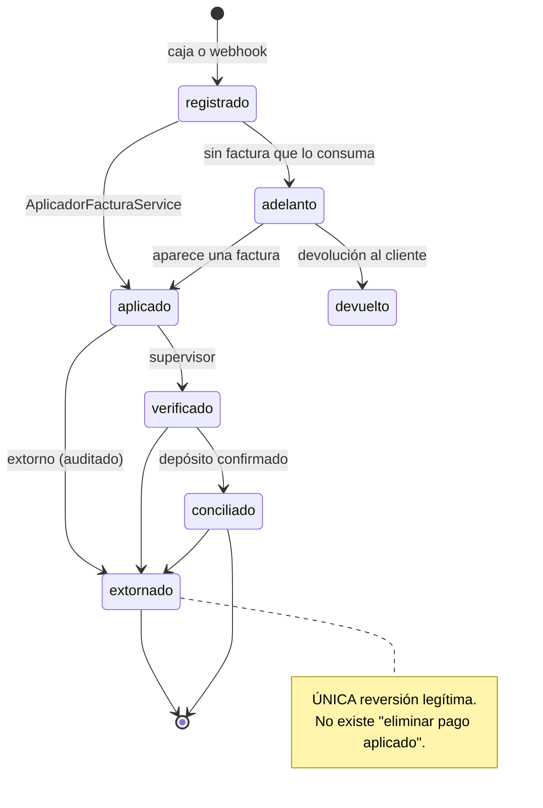

# MOD-002 — Módulo Pagos

---

## 2. Control documental

| Campo | Valor |
|---|---|
| **Código** | MOD-002 · **Versión** 1.0 · **Estado** Vigente |
| **Autor** | Arquitectura · **Revisores** Pendientes de asignar |
| **Fecha** | 2026-08-06 · **Dominio** Financiero · **Criticidad** Máxima (Core Indestructible) |

## 3. Historial de cambios

| Versión | Fecha | Cambio | Motivo |
|---|---|---|---|
| 1.0 | 2026-08-06 | Emisión inicial | Es la frontera del dinero; sus invariantes estaban en tests y en un README, no en documentación normativa |

## 4. Índice

5. Objetivo · 6. Alcance · 7. Glosario · 8.1 Objetivo · 8.2 Alcance funcional · 8.3 Actores ·
8.4 Casos de uso · 8.5 Reglas de negocio · 8.6 APIs · 8.7 Modelo de datos · 8.8 Eventos ·
8.9 Integraciones · 8.10 Pruebas

## 5. Objetivo

Registrar el dinero que entra, aplicarlo a lo que se debe y dejar constancia auditable de ambas
cosas.

## 6. Alcance

**Cubre:** registro de pagos, canales y cuentas receptoras, aplicación a facturas, verificación y
conciliación, extorno, adelantos y devolución de saldo, arqueo y cierre de caja, cobro en línea
por Mercado Pago, consulta de deuda por cliente.

**No cubre:** la emisión de comprobantes (`facturacion`), el corte y la reactivación del servicio
(`workers` + `outbox-red`), ni las prórrogas (`promesas-pago`).

**Capacidades de negocio (AEM-001):** C-10 (registrar cobros), C-11 (cobrar en línea, parcial),
C-12 (cerrar caja y arquear).

## 7. Definiciones y glosario

| Término | Definición |
|---|---|
| **Pago** | Registro de dinero recibido |
| **Aplicación** | Vínculo entre un pago y una factura concreta |
| **Extorno** | **Única** reversión legítima de un pago, auditada |
| **Adelanto / saldo a favor** | Dinero del cliente sin factura que lo consuma |
| **Canal de pago** | Medio por el que entra el dinero |
| **Cuenta receptora** | Dónde queda depositado |
| **Arqueo** | Cuadre de lo recaudado en un turno |
| **`indeterminado`** | Resultado de un cobro cuyo desenlace se desconoce |

---

# 8. Contenido

## 8.1 Objetivo

`pagos` es **la frontera del dinero**. Todo lo que entra pasa por aquí, y esa exclusividad es un
invariante verificado por test, no una convención.

## 8.2 Alcance funcional

| Bloque | Funcionalidad |
|---|---|
| **Registro** | Crear · listar · ver · editar · eliminar · adjuntar comprobante |
| **Estado** | Verificar · conciliar · **extornar** |
| **Aplicación** | Aplicar a facturas (vía `AplicadorFacturaService` de `facturacion`) |
| **Consulta** | Resumen · pendientes · por factura / contrato / cliente · **deuda por cliente** |
| **Catálogo** | Canales de pago · cuentas receptoras · formas de pago |
| **Caja** | Arqueo actual · cerrar caja · historial de cierres |
| **Adelantos** | Listar · saldo por cliente · devolver |
| **Cobro en línea** | Crear preferencia de Mercado Pago · recibir su webhook |
| **Reconciliación** | Cron cada 10 min: pagos registrados sin aplicar |

## 8.3 Actores

| Actor | Uso |
|---|---|
| **Cajero** | Registro de pagos, adjuntar comprobante, arqueo |
| **Supervisor de caja** | Verificar, conciliar, **extornar**, cerrar caja |
| **Administrador** | Canales, cuentas receptoras, formas de pago |
| **Abonado** (indirecto) | Paga por Mercado Pago desde el portal |
| **Mercado Pago** (máquina) | Envía el webhook de pago |
| **Cron de reconciliación** | Aplica pagos que quedaron sin aplicar |
| **`workers`** | Lee el resultado para decidir la reactivación |

## 8.4 Casos de uso

| # | Caso | Actor | Precondición | Flujo | Postcondición |
|---|---|---|---|---|---|
| CU-01 | Registrar pago en caja | Cajero | Cliente con deuda; canal y cuenta activos | `PagosService.registrar` → `AplicadorFacturaService` aplica → `pago_aplicaciones` | Pago registrado y aplicado; saldo actualizado |
| CU-02 | Cobrar en línea | Abonado | Contrato con deuda | Crea preferencia → el abonado paga → **webhook** → registra y aplica | Pago aplicado; posible reactivación |
| CU-03 | Verificar pago | Supervisor | Pago registrado | Marca verificado | Pago verificado |
| CU-04 | Conciliar pago | Supervisor | Pago verificado y depósito confirmado | Marca conciliado | Pago conciliado |
| CU-05 | **Extornar pago** | Supervisor | Pago aplicado; motivo | Crea `pago_extorno` → revierte aplicaciones | Pago revertido, **auditado** |
| CU-06 | Registrar adelanto | Cajero | Pago sin factura que lo consuma | Queda como saldo a favor | Saldo disponible |
| CU-07 | Devolver adelanto | Supervisor | Saldo a favor disponible | Registra devolución | Saldo reducido |
| CU-08 | Arquear caja | Cajero | Turno con movimientos | Calcula recaudado por canal | Arqueo mostrado |
| CU-09 | Cerrar caja | Supervisor | Arqueo cuadrado | `cierre_caja` | Turno cerrado |
| CU-10 | Consultar deuda del cliente | Operador | Cliente existente | Calcula deuda | ⚠️ **Uno de los 4 caminos** (§8.5 RN-09) |
| CU-11 | Reconciliar no aplicados | Cron | — | Busca pagos sin aplicar y los aplica | Sin pagos huérfanos |
| CU-12 | Gestionar cuentas receptoras | Administrador | — | CRUD | Catálogo completo |

## 8.5 Reglas de negocio

| # | Regla | Mecanismo | Verificado por |
|---|---|---|---|
| RN-01 | **`PagosService.registrar` es el único registrador de pagos** | Diseño | `frontera-dinero.spec.ts` |
| RN-02 | **`AplicadorFacturaService` es el único que aplica dinero a facturas** | Diseño | `frontera-dinero.spec.ts` |
| RN-03 | **No se aplica saldo a favor contra facturas ANULADAS** | Guard de estado | `frontera-dinero.spec.ts` |
| RN-04 | **El extorno es la única reversión legítima de un pago** | `pago_extorno` | `extorno.spec.ts` |
| RN-05 | Todo pago aplicado deja rastro en `pago_aplicaciones` | Modelo | — |
| RN-06 | El saldo de la factura lo mantiene el aplicador **y** el trigger `trg_factura_saldo` | Trigger | Base de datos |
| RN-07 | Un pago sin aplicar se reconcilia automáticamente | Cron cada 10 min | `pagos.reconciliacion.spec.ts` |
| RN-08 | **Un timeout cobrando es `indeterminado`**: ni se reintenta a ciegas ni se reporta fallo | `ResultadoOperacion` | `contrato-adaptador.spec.ts` |
| RN-09 | La deuda de un cliente se calcula **una sola vez** | ⚠️ **Incumplida: 4 implementaciones** | **No verificado** |
| RN-10 | El arqueo cuadra lo recaudado por canal antes de cerrar | Servicio | — |
| RN-11 | Un canal o cuenta con movimientos no se elimina: se desactiva | Servicio | — |

### La regla que se olvida siempre

> **Un timeout cobrando NO significa "no pasó nada".** Al cliente pudo cobrársele y la respuesta
> perderse. Reintentar a ciegas **le cobra dos veces**; reportar fallo **deja dinero existiendo sin
> registro**. Las dos opciones que parecen simples son las dos incorrectas: se reporta
> `indeterminado` y lo resuelve el conciliador consultando al proveedor.

### Las tres cosas que ya salieron mal aquí

| Error | Qué pasó | Qué lo bloquea hoy |
|---|---|---|
| Un segundo servicio que registra pagos | Nace sin el reconciliador ni los guards | `frontera-dinero.spec.ts` |
| Aplicar dinero fuera del aplicador | Había **4 copias** del mismo `UPDATE`; la de `adelantos` había perdido el guard y **aplicaba saldo a favor contra facturas ANULADAS** | `frontera-dinero.spec.ts` |
| Inferir reintentabilidad de un código HTTP | Un 409 de lock se leyó como veredicto y se descartó trabajo bueno | `contrato-adaptador.spec.ts`, `resultado-operacion.spec.ts` |

## 8.6 APIs

**Prefijo:** `/api/v1/pagos` · 32 endpoints.

### Registro y estado

| Método | Ruta | Nota |
|---|---|---|
| POST · GET | `/` | Registrar · listar |
| GET · PATCH · DELETE | `/:id` | Ficha · editar · eliminar |
| POST | `/:id/comprobante` | Adjuntar imagen |
| PATCH | `/:id/verificar` · `/:id/conciliar` | Cambio de estado |
| POST | `/:id/extornar` | **Única reversión legítima** |

### Consulta

| Método | Ruta |
|---|---|
| GET | `/resumen` · `/pendientes` |
| GET | `/factura/:facturaId` · `/contrato/:contratoId` · `/cliente/:clienteId` |
| GET | `/cliente-deuda/:clienteId` ⚠️ |

### Catálogo

| Método | Ruta |
|---|---|
| GET · POST · PATCH · DELETE | `/canales[/:id]` |
| GET · POST · PATCH | `/cuentas[/:id]` |
| GET | `/formas` |

### Caja

| Método | Ruta |
|---|---|
| GET | `/arqueo` · `/arqueo/historial` |
| POST | `/arqueo/cerrar` |

### Adelantos

| Método | Ruta |
|---|---|
| GET | `/adelantos` · `/adelantos/saldo/:clienteId` |
| POST | `/adelantos/:id/devolver` |

### Cobro en línea

| Método | Ruta | Autenticación |
|---|---|---|
| POST | `/mercadopago/preferencia` | JWT |
| POST | `/webhooks/mercadopago` | **`@Public` + firma del proveedor** |

**Consumidores:** `frontend/src/lib/api/` → páginas `pagos`, `pagos/nuevo`, `pagos/pendientes`,
`caja`, `finanzas/registro`, `finanzas/adelanto-prorroga`; y el portal del abonado.

## 8.7 Modelo de datos

| Tabla | Entidad | Nota |
|---|---|---|
| `pagos` | ✅ `Pago` | Propia |
| `pago_aplicaciones` | ✅ `PagoAplicacion` | Propia |
| `canal_pago` | ✅ `CanalPago` | Propia |
| `pago_extorno` | ⚠️ **Sin entidad** | Propia |
| `cuentas_bancarias` | ⚠️ **Sin entidad** | Propia |
| `cierre_caja` | ⚠️ **Sin entidad** | Propia |
| `bancos_isp`, `formas_pago_isp` | ⚠️ Sin entidad | Compartidas con `facturacion` |

> **Tres de las tablas del dinero no tienen entidad TypeORM.** Un `ALTER` sobre `pago_extorno`,
> `cierre_caja` o `cuentas_bancarias` **no rompe la compilación**. Prioridad de corrección:
> RDM-001 (R7).

### Relaciones

```
pagos ─N:1─ clientes · canal_pago · cuentas_bancarias
pagos ─1:N─ pago_aplicaciones ─N:1─ facturas
pagos ─1:N─ pago_extorno
cierre_caja ─N:1─ usuarios (quien cierra)
```

### Repositorio

`pagos/repositories/pago.repository.ts` (358 LOC).

## 8.8 Eventos

### Emitidos

| Evento | Cuándo |
|---|---|
| `pago.registered` | Se registra un pago |
| `PAGO_RECIBIDO` | Notificación al abonado (prioridad 2) |

### Consecuencia indirecta

Un pago que cubre la deuda provoca que `workers` encole `reactivar-contrato`, que escribe en el
outbox y termina en MikroTik y en la OLT.

## 8.9 Integraciones

| Con | Para qué | Transporte | Resiliencia |
|---|---|---|---|
| `facturacion` | Aplicar dinero a facturas | Llamada directa a `AplicadorFacturaService` | Único escritor |
| `contratos` | Resolver el contrato del pago | Llamada directa | — |
| `workers` | Encolar la reactivación | Cola `cobranza` | Reintentos |
| **Mercado Pago** | Cobro en línea | REST + webhook | ⚠️ **Acoplamiento alto: no usa el puerto de cobro** |
| `notificaciones` | Confirmar el pago al abonado | Evento → cola | Idempotencia por índice |

### El puerto de cobro

Existe `pagos/adaptadores/adaptador-cobro.interface.ts` **sin ninguna implementación,
deliberadamente**. Mercado Pago —el único que cobra dinero real— **no lo usa**.

**Puerta de estabilidad** (ADR-013): 30 días de invariante de contabilidad limpio, un extorno real
revisado a mano y un cierre de caja mensual cuadrado. **PROHIBIDO** integrar otra pasarela antes.

**Orden obligatorio:** comprobar la puerta → construir el motor (`cobro_intento` + conciliador) →
**migrar Mercado Pago al contrato antes que ningún proveedor nuevo**.

## 8.10 Pruebas

### Cubierto — **el módulo mejor protegido del sistema**

| Test | Invariante |
|---|---|
| `frontera-dinero.spec.ts` | Un solo registrador · un solo aplicador · no aplicar contra facturas anuladas |
| `extorno.spec.ts` | El extorno es la única reversión |
| `pagos.reconciliacion.spec.ts` | Los pagos sin aplicar se reconcilian |
| `pagos.service.spec.ts` | Comportamiento del servicio |
| `canal-pago.service.spec.ts` | Catálogo de canales |
| `contrato-adaptador.spec.ts` | No inferir reintentabilidad de un código HTTP |

### **No cubierto**

| # | Invariante sin test |
|---|---|
| 1 | **RN-09**: que los 4 caminos de cálculo de deuda coincidan |
| 2 | Que el arqueo cuadre con la suma de pagos del turno |
| 3 | Que un webhook de Mercado Pago duplicado no registre el pago dos veces |
| 4 | Que todas las consultas filtren por `empresa_id` |

---

# 9. Referencias

AEM-001 · DOM-001 · DAT-001 · INT-001 · MOD-001 · POL-001 §8.5 · ADR-003 · ADR-004 · **ADR-013** ·
`pagos/adaptadores/README.md`

---

# 10. Anexos

## Anexo A — Ciclo de vida de un pago



## Anexo B — El problema de la deuda calculada en 4 sitios

| Camino | Ubicación |
|---|---|
| 1 | `fn_calcular_deuda_contrato` (PostgreSQL) |
| 2 | `facturacion/deuda-por-contrato.service.ts` |
| 3 | `GET /pagos/cliente-deuda/:clienteId` (SQL propio en este módulo) |
| 4 | `workers/cobranza.worker.ts` — `detectar-morosos` |

**Divergen potencialmente** en el tratamiento de cargos pendientes, notas de crédito, adelantos y
promesas de pago vigentes.

**Por qué es crítico:** el camino 4 **decide cortes de servicio**. El ERP puede cortar a quien no
debe y no cortar a quien sí, y responder distinto según por dónde se le pregunte — la ficha del
cliente, el reporte de cobranza y el worker que corta pueden discrepar el mismo día sobre el mismo
abonado.

**Precedente idéntico ya ocurrido en este mismo módulo:** había 4 copias del `UPDATE` que aplica
dinero, y una había perdido el guard. Se resolvió con un aplicador único protegido por test. Ver
RDM-001 (R4).

## Anexo C — Impacto de modificar este módulo

| Cambio | Impacto |
|---|---|
| Firma de `Pago` | `facturacion`, `reportes`, `portal`, frontend de caja |
| Lógica de aplicación | **Toda la cobranza** — es la frontera del dinero |
| Cálculo de deuda | `workers` (cortes), `portal`, `reportes` |
| Webhook de Mercado Pago | Cobro en línea del portal |
| Catálogo de canales/cuentas | `finanzas/registro`, `caja`, `facturacion` |
