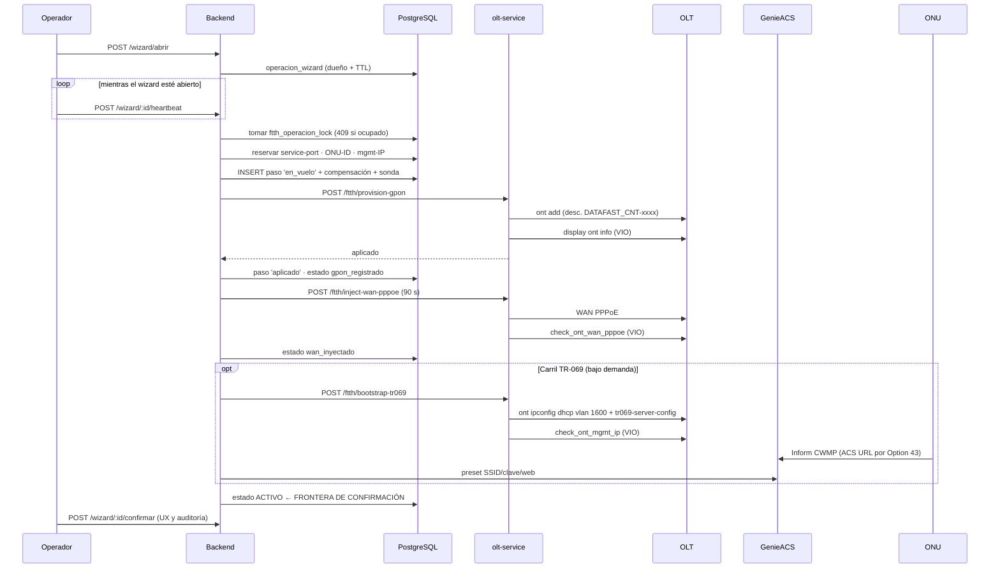
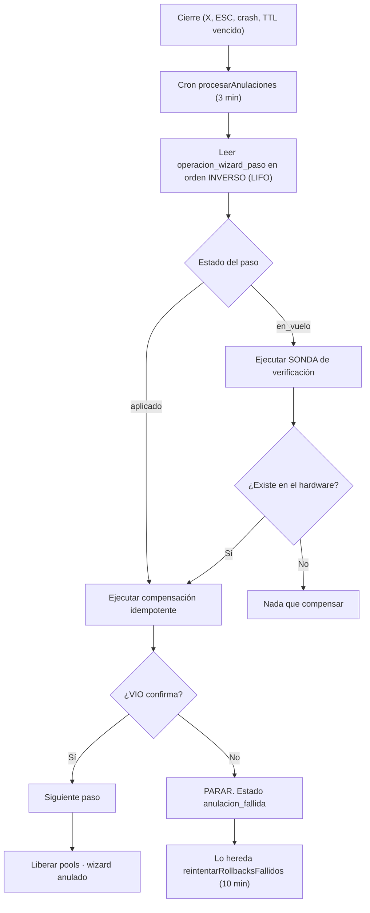

# MOD-003 — Módulo OLT-Nativo / FTTH

---

## 2. Control documental

| Campo | Valor |
|---|---|
| **Código** | MOD-003 · **Versión** 1.0 · **Estado** Vigente |
| **Autor** | Arquitectura · **Revisores** Pendientes de asignar |
| **Fecha** | 2026-08-06 · **Dominio** Red / OSS · **Criticidad** Máxima · **Complejidad** Máxima |

## 3. Historial de cambios

| Versión | Fecha | Cambio | Motivo |
|---|---|---|---|
| 1.0 | 2026-08-06 | Emisión inicial | Es el módulo más grande y complejo del sistema (25.659 LOC) y no tenía documentación funcional |

## 4. Índice

5. Objetivo · 6. Alcance · 7. Glosario · 8.1 Objetivo · 8.2 Alcance funcional (8 subdominios) ·
8.3 Actores · 8.4 Casos de uso · 8.5 Reglas de negocio · 8.6 APIs · 8.7 Modelo de datos ·
8.8 Eventos · 8.9 Integraciones · 8.10 Pruebas

## 5. Objetivo

Gobernar el ciclo de vida completo del acceso FTTH: la OLT, sus perfiles, sus pools de recursos,
la ONU del abonado y su gestión remota por TR-069 — garantizando que **el estado que el ERP afirma
coincide con el estado físico verificado**.

## 6. Alcance

**Cubre:** inventario y descubrimiento, configuración declarativa (baselines, perfiles, VLANs,
traffic tables), tres pools de recursos, provisión y baja FTTH, carril TR-069/ZTP, saga de wizard,
locking e idempotencia, salud y firmware, y enrutamiento multi-proveedor.

**No cubre:** MikroTik (`mikrotik`), planta externa (`planta-externa`), monitoreo genérico
(`monitoreo`) ni el contrato comercial (MOD-001).

**Capacidades (AEM-001):** C-04 (provisionar FTTH), C-06 (gestionar CPE), C-17 (baja),
C-20 (detectar divergencia). **No realiza C-18 (sustituir ONU): no existe.**

## 7. Definiciones y glosario

Ver DOM-001 §8.1 «Dominio Red / OSS». Términos propios de este módulo: **service-port** ·
**ONU-ID** · **carril de gestión** · **baseline** · **drift** · **materializado** · **huérfana** ·
**`en_vuelo`** · **sonda de verificación**.

---

# 8. Contenido

## 8.1 Objetivo

Este módulo existe para resolver el problema central del ERP: **el plano físico y el plano lógico
tienden a divergir, y nadie lo nota hasta que un cliente llama**.

Su tamaño (25.659 LOC · 41 servicios · 24 entidades · 11 crons) es en parte irreductible: el
dominio FTTH es genuinamente el más complejo del negocio. Pero contiene **ocho subdominios
separables cuyas fronteras ya son visibles en el propio árbol de carpetas**.

## 8.2 Alcance funcional — los ocho subdominios

| # | Subdominio | Carpeta | Responsabilidad |
|---|---|---|---|
| 1 | **Inventario y descubrimiento** | `services/` | OLTs, boards, puertos PON, ONUs, `discover-onus`, adopción de huérfanas |
| 2 | **Configuración declarativa** | `capability/`, `compliance/`, `services/` | Baselines versionados, line/service profiles, traffic tables, VLANs, compliance, snapshot |
| 3 | **Pools de recursos** | `services/` | `service-port`, `mgmt-ip`, `onu-id`, `mgmt-port` con reserva, reconciliación y barrido |
| 4 | **Provisión FTTH** | `services/provision-ftth.service.ts` | Registro GPON, WAN PPPoE, bootstrap TR-069, baja, cambio de velocidad, rollback |
| 5 | **ZTP / TR-069** | `ztp/` (2.579 LOC) | Driver GenieACS, registry, resolver, perfiles de dispositivo, mapas de parámetros, auth CWMP, preset de ONU |
| 6 | **Saga de wizard** | `services/operacion-wizard*.ts`, `compensador-wizard.service.ts` | Bitácora write-ahead, heartbeat, compensación |
| 7 | **Locking e idempotencia** | `services/` | `ftth-operacion-lock`, `olt-atomic-lock`, `olt-idempotency`, `circuit-breaker` |
| 8 | **Salud y firmware** | `services/`, `cron/` | Boards, POM, PON, dashboard de señal, actualización de firmware con historial |
| — | **Multi-proveedor** | `interfaces/`, `providers/` | `IOltProvider` + 3 adaptadores + router + registry |

## 8.3 Actores

| Actor | Uso |
|---|---|
| **Técnico de provisión** | Wizard FTTH: alta de servicio en la OLT |
| **Operador de red** | Inventario, señal, VLANs, perfiles, salud, firmware |
| **Administrador de red** | Baselines, pools, proveedores, presets de ONU |
| **Soporte** | Ver ONU, reiniciar, cambiar WiFi por TR-069 |
| **`outbox-red`** | Ejecuta suspensión y rehabilitación |
| **`contratos`** | Dispara la provisión |
| **`portal`** | El abonado consulta y cambia su WiFi |
| **11 crons** | Reconciliación, watchers de invariante, barridos |
| **`olt-automation-service`** | Ejecuta contra el hardware |

## 8.4 Casos de uso

### Provisión y baja

| # | Caso | Precondición | Flujo | Postcondición |
|---|---|---|---|---|
| CU-01 | Abrir wizard de provisión | Contrato sin ONU; sin operación en curso | `POST /wizard/abrir` → dueño + TTL | Wizard abierto; heartbeat activo |
| CU-02 | Provisión GPON | Wizard abierto; pools con disponibilidad | Lock → reserva → **paso `en_vuelo`** → `ont add` → **VIO** → `aplicado` | `gpon_registrado` |
| CU-03 | Inyectar WAN PPPoE | `gpon_registrado` | Comando WAN (timeout **90 s**) → `check_ont_wan_pppoe` | `wan_inyectado` |
| CU-04 | Activar carril TR-069 | ONU con WAN | `ont ipconfig dhcp vlan 1600` + `tr069-server-config` → `check_ont_mgmt_ip` → convergencia en GenieACS | Carril activo; ONU gestionable |
| CU-05 | Confirmar activación | ONU verificada | Estado terminal | **`activo`** — frontera de confirmación |
| CU-06 | Cerrar wizard sin confirmar | Wizard no terminal | Compensación LIFO con sonda y VIO | Recursos liberados; OLT limpia |
| CU-07 | Desaprovisionar | `activo` **o `suspendido`** | `ont delete` → VIO → libera pools | Contrato sin ONU |
| CU-08 | Suspender / rehabilitar | Orden del outbox | `ont deactivate` / `activate` → VIO | Estado aplicado y verificado |
| CU-09 | Cambiar velocidad | ONU activa | Cambio de line-profile / traffic-table | ⚠️ Sin outbox ni saga |
| CU-10 | **Sustituir ONU** | — | ❌ **No existe** | Se improvisa como baja + alta |

### Gestión remota (TR-069)

| # | Caso | Precondición |
|---|---|---|
| CU-11 | Ver detalle en vivo de la ONU | Carril activo y sesión ACS fresca |
| CU-12 | Cambiar WiFi (SSID/clave, por banda) | Carril activo |
| CU-13 | Cambiar PPPoE / acceso web | Carril activo |
| CU-14 | Reiniciar / factory-reset | Carril activo |
| CU-15 | Activar / desactivar el carril | Toggle en «Ver ONU»; desactivar **conserva** IP y ACS URL |

### Configuración e inventario

| # | Caso |
|---|---|
| CU-16 | Registrar una OLT (wizard: detectar versión → topología → commit) |
| CU-17 | Definir y aplicar un baseline (plan → aplicar → compliance) |
| CU-18 | Gestionar VLANs, line/service profiles y traffic tables (con o sin CLI) |
| CU-19 | Configurar y reconciliar los pools |
| CU-20 | Sincronizar inventario de ONUs |
| CU-21 | Adoptar ONUs huérfanas |
| CU-22 | Ver salud (boards, POM, puertos PON) y dashboard de señal |
| CU-23 | Actualizar firmware (job asíncrono con historial) |
| CU-24 | Ver y resolver drift |

## 8.5 Reglas de negocio

### Invariantes fundacionales

| # | Regla | Mecanismo | Verificado |
|---|---|---|---|
| RN-01 | **Nunca un `ont` en la OLT sin `ftth_onu_registro`, ni al revés** | Watcher DELETE (`reintentarRollbacksFallidos`) + watcher CREATE (`adoptarOnusHuerfanas`) | Producción |
| RN-02 | **Aceptar ≠ aplicar**: toda mutación se verifica con lectura independiente | VIO | Producción |
| RN-03 | Las transiciones ilegales se rechazan; las repetidas son `ya_en_destino` (**éxito**) | `ftth-maquina-estados.ts` | `ftth-maquina-estados.spec.ts` |
| RN-04 | **Solo una operación FTTH en curso por contrato** | `ftth_operacion_lock` (TTL corto, 409) | Producción |
| RN-05 | Un procedimiento no confirmado se anula por completo | Saga con bitácora write-ahead | Producción |
| RN-06 | La frontera de confirmación es **`activo`**, no el clic | Diseño | ADR-007 |

### Invariantes del compensador

| # | Regla | Justificación |
|---|---|---|
| RN-07 | **Orden LIFO** | El paso de hardware se registra después del registro y los pools; al invertir se limpia la OLT **antes** de soltarlos |
| RN-08 | **Parada al primer fallo no confirmado** | Continuar sería borrar el registro con la OLT sucia: **la receta del ONT huérfano** |
| RN-09 | **Idempotencia** | "Ya no existe" al deshacer cuenta como **éxito** |
| RN-10 | **VIO al deshacer** | `rollback_gpon` verifica con `display ont info`; sirve además de sonda para los pasos `en_vuelo` |

### Reglas de recursos y configuración

| # | Regla | Garantía |
|---|---|---|
| RN-11 | **Nunca se retira del pool una IP de gestión ocupada** — está escrita en el IP-host de una ONU viva; sacarla podría reasignar el tramo a otra OLT: **dos ONUs con la misma IP en el mismo L2** | ⚠️ Solo por código |
| RN-12 | **Nunca se edita una versión publicada de un baseline** | ⚠️ Solo por código |
| RN-13 | **No se crean VLANs sin consumidor** | ⚠️ Solo por código |
| RN-14 | **Una OLT admite un solo proveedor**, fijado al registrarla | Índice + guard |
| RN-15 | El ERP inyecta su configuración canónica y **respeta como intocable lo preexistente** | Directriz |
| RN-16 | **Una ONU que el ERP no aprovisionó se adopta, nunca se reconfigura** | ⚠️ **Solo por efecto lateral** — ADR-014 |
| RN-17 | La decisión de canal de bootstrap es **por modelo**, nunca global. Modelo no catalogado ⇒ error explícito, **jamás intento a ciegas** | Catálogo |
| RN-18 | **Si el servicio Python no responde: OLT OFFLINE, no tocar ONUs, congelar estados** | ⚠️ Solo por código |
| RN-19 | El monitoreo **no modifica** estados de ONUs | ⚠️ Solo por código |
| RN-20 | La descripción del `ont` en la OLT lleva `DATAFAST_CNT-xxxx` para poder atribuirlo | Servicio |

> **Siete reglas de este módulo solo están garantizadas por el código que las implementa** (sin
> test ni restricción). RN-16 es la de mayor consecuencia: es la que evita la reescritura masiva
> de configuración de clientes (ADR-014, RDM-001 R1).

## 8.6 APIs

**Prefijo:** `/api/v1/olt-nativo` · **~150 endpoints en un único controlador de 1.845 líneas.**

| Grupo | Rutas representativas |
|---|---|
| Catálogo OLT | `GET /` · `/todas` · `/:oltId` · `POST /` · `PUT/PATCH/DELETE /:oltId` · `/validar-ip` |
| Wizard de alta OLT | `POST /wizard/detect-version` · `/wizard/topology` · `/wizard/commit` · `/:oltId/wizard/inicializar` |
| Baselines y compliance | `GET·POST /baselines` · `/baselines/estandar` · `/:oltId/baseline/plan` · `/aplicar` · `/:oltId/compliance` · `/infrastructure-snapshot` |
| Perfiles | `/:oltId/srvprofiles` · `/lineprofiles` · `/profiles` · `/line-profiles` · `/service-profiles` |
| VLANs | `GET·POST·PATCH·DELETE /:oltId/vlans[...]` · `/vlans/con-cli` · `/pull-desde-olt` · `/sincronizar` |
| Traffic tables | `GET·POST·PATCH·DELETE /:oltId/traffic-tables[...]` · `/sincronizar` |
| **Pools** | `/:oltId/service-port-pool` · `/mgmt-port-pool` · `/mgmt-ip-pool` · `/onu-id-pool` (+ `configurar`, `reconciliar`, `libres`, `detalle`, `retirar`) |
| ONUs | `/onus-inventario` · `/:oltId/onus` · `/discover-onus` · `/verify-onu` · `/:oltId/inventario` · `/catalogo-modelos` |
| **Provisión FTTH** | `POST /:oltId/ftth/provision` · `/bootstrap-tr069` · `/reinject-wan` · `/desaprovisionar` · `/cambiar-velocidad` · `/ftth/desaprovisionar-contrato/:contratoId` · `/ftth/cancelar/:contratoId` · `GET /ftth/estado/:contratoId` |
| ZTP | `POST /ztp/provision/:contratoId` · `/ztp/reconcile` · `GET·PUT /ztp/config/:contratoId` · `/generate-wifi` · `/provisioning` |
| TR-069 por SN | `GET /onu/:sn/tr069` · `POST /refresh` · `/reboot` · `/factory-reset` · `PUT /wifi` · `/pppoe` · `/acceso-web` |
| Carril por contrato | `POST /onu/:contratoId/tr069/activar` · `/desactivar` · `/uso` · `GET /olt-estado` · `GET /carril/stats` |
| **Wizard transaccional** | `POST /wizard/abrir` · `/wizard/:id/heartbeat` · `/wizard/:id/confirmar` · `/wizard/:id/cerrar` |
| Salud y firmware | `/:oltId/metrics` · `/health/boards` · `/health/pom` · `/health/pon-ports` · `/board-topology` · `/ont-version` · `/firmware/iniciar` · `/firmware/job/:id` · `/firmware/historial` |
| Sync y drift | `POST /:oltId/sync` · `GET /sync/status` · `GET /:oltId/drift` · `POST /drift/reaplicar/:contratoId` · `/drift/resincronizar-estado/:contratoId` |
| Proveedores | `/proveedores/resumen` · `/por-tipo` · `/:configId/test` · `/reset-circuit` · `/integraciones/smartolt` · `/integraciones/adminolt` |
| Señal y eventos | `GET /:oltId/ftth/signal-dashboard` · `/:oltId/eventos` · `/:oltId/ftth-registros` |

> **Brecha estructural:** un solo archivo con ~150 endpoints garantiza conflictos de merge y hace
> ilegible la superficie del módulo. División propuesta en RDM-001 (R9) — **sin cambiar rutas**.

## 8.7 Modelo de datos

**27 tablas propias.** Todas con entidad TypeORM **salvo las de coordinación del wizard y el
lock**:

| Grupo | Tablas |
|---|---|
| Dispositivo | `olt_dispositivos` · `olt_boards` |
| Configuración | `olt_vlans` · `olt_line_profiles` · `olt_service_profiles` · `olt_traffic_tables` · `olt_baselines` |
| Pools | `olt_service_port_pool` · `olt_mgmt_ip_pool` · `olt_onu_id_pool` |
| Inventario | `olt_onu_inventario` · `olt_onu_preset` |
| **FTTH** | `ftth_onu_registro` · `ftth_rollback_log` · `ftth_operacion_lock` ⚠️ |
| **Saga** | `operacion_wizard` ⚠️ · `operacion_wizard_paso` ⚠️ |
| CPE | `contrato_onu_config` · `cpe_provisioning_attempt` · `cpe_web_credential` |
| Salud | `olt_health_snapshots` · `olt_alertas` · `metricas_onu_optical` |
| Operación | `olt_operacion_log` · `olt_sync_jobs` · `olt_proveedor_config` · `historial_firmware` |

⚠️ **Sin entidad TypeORM** — sostienen las garantías más fuertes del módulo y son las menos
protegidas por tipos.

### Invariantes en base de datos

| Objeto | Efecto |
|---|---|
| `trg_ftth_onu_updated_at` | `updated_at` de `ftth_onu_registro` |
| `sn_onu_normalizado` | Normalización de SN entre OLT, GenieACS y SmartOLT |
| `set_updated_at_olt_*` | Marcas de tiempo |

### La tabla más peligrosa: `contrato_onu_config`

`provisioning_enabled` + `revision` + `last_applied_revision` determinan si una ONU figura en
drift — y por tanto si el pipeline ZTP **le reescribe SSID, clave WiFi y credenciales web**.

**El barrido que la captura es `reconcilePendingReinjection` (cada 2 minutos), no el de las
03:30**: su filtro es exactamente `last_applied_revision IS NULL`, el estado de una ONU recién
migrada.

**Protección vigente (2026-08-06):** la columna `origen` (`erp` | `adoptada` | `migrada`) filtra
los dos barridos y la ruta manual. Ver ADR-014 (implementado), DAT-001 Anexo B y POL-001 PP-10.

## 8.8 Eventos

### Emitidos

| Evento | Cuándo |
|---|---|
| `FTTH_ACTIVADO` | La ONU alcanza estado terminal verificado |
| `ftth.inventario.reobservar` | El inventario quedó desactualizado |
| `OLT_SYNC_PROGRESS` / `_COMPLETED` / `_ERROR` | Progreso de sincronización → **WebSocket** |

### Escuchados

| Evento | Efecto |
|---|---|
| `ftth.inventario.reobservar` | `olt-inventario-refresh.service` relee la OLT |
| `OLT_SYNC_*` | `olt.gateway` los retransmite por WebSocket |

### Crons (11 tareas en 5 archivos)

| Frecuencia | Tarea | Función |
|---|---|---|
| `*/2 min` | `watchPendingReinjection` | Reinyección TR-069 pendiente |
| `2-59/3 min` | `procesarAnulaciones` | **Anulación asíncrona de wizards** |
| `4-59/5 min` | `liberarBloqueados` | Libera locks expirados |
| `5-59/10 min` | `reintentarRollbacks` | **Watcher `fallido_rollback`** |
| `*/10 min` | `verificarWan` | VIO de la WAN |
| `5-59/20 min` | `verificarDrift` | Drift de CPE |
| `12,42 min` | `verificarStaleness` | Sesiones ACS rancias |
| `*/30 min` | `limpiarIdsHuerfanos` | Pool de ONU-ID |
| `7-59/30 min` | `adoptarHuerfanas` | **Watcher CREATE del invariante** |
| `50 */6 h` | `syncPeriodico` | Inventario |
| `30 3 * * *` | **`reconciliarDiario` (ZTP)** | ⚠️ Reescribe config de ONUs en drift |
| `40 3 * * *` | `desendurecerAuthResidual` | Quita `AuthEnforced` residual |
| `20 4 * * *` | `barrerTtl` | TTL del carril (3 días) |

## 8.9 Integraciones

| Con | Para qué | Transporte | Resiliencia |
|---|---|---|---|
| **`olt-automation-service`** | Todo el acceso a la OLT | HTTP + API key (`127.0.0.1:8001`) | Timeouts realistas · **1 worker serializa** |
| **GenieACS** | Gestión del CPE | HTTP NBI | Driver + registry + resolver · VIO de convergencia |
| **SmartOLT / AdminOLT** | Proveedor alternativo | HTTPS REST vía `IOltProvider` | Circuit breaker |
| `outbox-red` | Recibe órdenes de suspensión/rehabilitación | Tabla | Reintentos clasificados |
| `monitoreo` | Estado de dispositivos | Llamada directa | — |
| `tr069` | Modelo de dispositivo | Llamada directa | — |
| `notificaciones` | Avisar activación FTTH | Evento → cola | Idempotencia |

### Enrutamiento multi-proveedor

`OltOperationRouter` + `OltProviderRegistry` deciden a qué adaptador va cada operación,
consultando `olt_proveedor_config` y respetando el circuit breaker. Los adaptadores cumplen las
tres reglas obligatorias (no propagar excepciones, medir latencia, **no tocar la BD**).

## 8.10 Pruebas

### Cubierto

| Test | Invariante |
|---|---|
| `ftth-maquina-estados.spec.ts` | Transiciones legales e idempotencia derivada |
| `olt-ownership-guard.spec.ts` | Propiedad de recursos |
| `olt-perfiles-idempotencia.spec.ts` | Perfiles idempotentes |
| `olt-service-port-pool.spec.ts`, `olt-mgmt-ip-pool.spec.ts` | Pools |
| `provision-ftth.autoconfig.spec.ts`, `.barrido-carril.spec.ts` | Auto-config y barrido |
| `tr069-staleness.service.spec.ts` | Sesiones rancias |
| `descripcion-consolidada.spec.ts` | Descripción del `ont` |
| `olt-capability-catalog.spec.ts`, `olt-model-catalog.spec.ts` | Catálogos |
| `olt-compliance-rules.spec.ts` | Compliance |
| `genieacs.driver.spec.ts`, `registry.spec.ts`, `resolver.spec.ts` | ZTP |
| `cwmp-auth.service.spec.ts` | Autenticación CWMP |
| `ztp.service.reconcile.spec.ts` | Reconcile ZTP |
| `contrato-onu-config.service.spec.ts` | Config de ONU |
| `olt-sync.service.spec.ts`, `olt-conn.service.spec.ts` | Sync y conexión |
| `olt-baseline-plan.service.spec.ts` | Plan de baseline |

### **No cubierto** — brechas declaradas

| # | Invariante sin test |
|---|---|
| 1 | **RN-16**: que el reconcile no toque ONUs preexistentes (**el riesgo crítico del sistema**) |
| 2 | **RN-11**: que el pool nunca retire una IP ocupada |
| 3 | **RN-12**: que no se pueda editar un baseline publicado |
| 4 | **RN-18**: que una caída del servicio Python no altere estados de ONU |
| 5 | Los 4 invariantes del compensador (LIFO, parada, idempotencia, VIO al deshacer) |
| 6 | Que `ftth_operacion_lock` impida efectivamente la concurrencia |

---

# 9. Referencias

AEM-001 · DOM-001 · DAT-001 · INT-001 · MOD-001 · POL-001 ·
**ADR-001** (VIO) · **ADR-005** (máquina de estados) · **ADR-006** (saga) · **ADR-007** (frontera) ·
**ADR-008** (1 worker) · **ADR-014** (reconcile) · **ADR-015** (bootstrap por modelo) ·
`docs/informe-cnt-2026-000004-omci-tr069-write-gap.md`

---

# 10. Anexos

## Anexo A — Cadena de provisión completa

## Anexo B — Anulación de un wizard no confirmado

## Anexo C — Los ocho subdominios y su separabilidad

| Subdominio | Frontera ya existente | Separable |
|---|---|---|
| ZTP / TR-069 | `ztp/` (2.579 LOC, 7 specs, contratos propios) | **Alta** |
| Capacidades | `capability/` (motor genérico + catálogos) | **Alta** |
| Compliance | `compliance/` | **Alta** |
| Dominio | `domain/` (máquina de estados) | Alta |
| Multi-proveedor | `interfaces/` + `providers/` | **Alta** |
| Pools | Servicios separados, patrón repetido 4 veces | **Alta** (candidato a primitivo común) |
| Saga de wizard | 3 servicios cohesionados | Media |
| Provisión | `provision-ftth.service.ts` | Baja — es el núcleo |

**El módulo ya se está dividiendo solo.** Lo que falta es formalizarlo (RDM-001 R9).

## Anexo D — Hallazgos de campo que condicionan este módulo

| Hallazgo | Consecuencia |
|---|---|
| El ME137 (OMCI) **no materializa** la ACS URL en EG8145V5 | `dhcp_bootstrap` es CERTIFIED; `omci` EXPERIMENTAL. Decisión **por modelo** |
| **`ont reset` NO reinicia** una EG8145V5 (0 paquetes a la OLT) | El reinicio real se hace por TR-069 al CPE |
| El panel web del EG8145V5 **se autobloquea tras 3 logins fallidos** y solo escucha en la LAN | El canal `cpe_local` es excepcional |
| El tag `AuthEnforced` con una ONU reseteada produce **deadlock de Inform** | Gracia de bootstrap: quitar el tag y re-endurecer al re-provisionar |
| Hay que **drenar el autosave** antes de enviar comandos | Un reintento tras autosave da `% Unknown command` → **falso negativo** |
| El MA5800 tiene un **límite bajo de sesiones VTY** | 1 worker uvicorn · pool de sesiones · sin reintentos agresivos |
| Lectura óptica: Netmiko → paramiko | **60 s → 4 s** |
