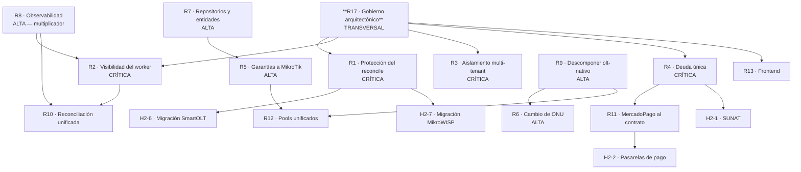

# RDM-001 — Roadmap del Producto

---

## 2. Control documental

| Campo | Valor |
|---|---|
| **Código** | RDM-001 · **Versión** 1.0 · **Estado** Vigente |
| **Autor** | Arquitectura · **Aprueba** Propietario del producto |
| **Revisores** | Pendientes de asignar · **Fecha** 2026-08-06 |
| **Documento superior** | CON-001 §8.11.3 (la plataforma se consolida antes de crecer) |

## 3. Historial de cambios

| Versión | Fecha | Cambio | Motivo |
|---|---|---|---|
| 1.0 | 2026-08-06 | Emisión inicial | El trabajo pendiente vivía en `PENDIENTES.md` y en la memoria del equipo, sin priorización ni dependencias declaradas |

## 4. Índice

1. Principio rector · 2. Estado del producto · 3. Horizonte 1: Consolidación · 4. Horizonte 2:
Cierre de brechas funcionales · 5. Horizonte 3: Crecimiento · 6. Dependencias entre iniciativas ·
7. Puertas de decisión · 8. Fuera de alcance

## 5. Objetivo

Declarar el plan de evolución del ERP Datafast: qué se hace, en qué orden, por qué en ese orden y
qué decisiones de negocio condicionan cada etapa.

## 6. Alcance

Iniciativas derivadas de la auditoría (Etapa I), la consolidación (Etapa II) y `PENDIENTES.md`.

**No incluye plazos.** El equipo conoce su capacidad; lo que este documento fija es **el orden y
las dependencias**, que sí son objetivos.

## 7. Definiciones y glosario

| Término | Definición |
|---|---|
| **Horizonte** | Agrupación de iniciativas con un objetivo común |
| **Puerta** | Criterio que debe cumplirse antes de avanzar; puede no depender de código |
| **Bloqueante** | Iniciativa que impide otra |
| **Brecha funcional** | Capacidad que el negocio necesita y el sistema no tiene |

---

# 8. Contenido

## 8.0 Presupuesto arquitectónico — decisión D6 (2026-08-06)

**Un solo roadmap**, no dos. Dos roadmaps compiten por la misma capacidad y el arquitectónico
siempre pierde, porque no tiene un cliente esperándolo.

| Elemento | Regla |
|---|---|
| **Etiquetado** | Cada iniciativa es `[ARQ]` o `[FUNC]` |
| **Presupuesto** | Una fracción acordada y **protegida** de la capacidad va a `[ARQ]` |
| **Bloqueo** | Una `[FUNC]` **no entra** si depende de una `[ARQ]` no cerrada |
| **Excepción** | Solo Datafast puede consumir el presupuesto arquitectónico, y **queda registrado** |

Ya se aplica de hecho: el Horizonte 1 es íntegramente `[ARQ]` y bloquea al Horizonte 2 por
dependencias declaradas — R1 bloqueaba las migraciones, R4 bloquea las pasarelas. **Lo que falta
es fijar la fracción.**

> **Por qué no dos roadmaps** (contrapropuesta a R-011, aceptada en D6): un roadmap arquitectónico
> separado existe, se cita en reuniones y no se ejecuta nunca, porque cuando el negocio presiona
> es el que se pospone. Eso es **peor** que no tenerlo: da la impresión de que el problema está
> gestionado.

## 8.1 Principio rector

> **La plataforma se consolida antes de crecer** (CON-001 §8.11.3).

Cuando exista tensión entre añadir una funcionalidad y cerrar una brecha estructural conocida,
**prevalece cerrar la brecha** — salvo decisión explícita y registrada del propietario del
producto.

**Por qué:** el ERP creció incorporando módulos durante años, y cada módulo heredó las garantías
que su autor recordaba aplicar. El resultado no es un sistema mal construido: es un sistema
**desigualmente** construido, con un plano FTTH de garantías industriales junto a un plano WISP
con muchas menos.

## 8.2 Estado del producto

### 8.2.1 Lo que está sólido

| Área | Estado |
|---|---|
| Gestión comercial (clientes, contratos, planes) | Completa |
| Provisión FTTH con verificación, saga y compensación | Completa y de calidad superior |
| Cobranza: registro, aplicación, extorno, arqueo | Completa, con invariantes verificados |
| Suspensión y reactivación automáticas | Completas |
| Gestión remota de CPE (TR-069) | Completa |
| Monitoreo de red | Completa |
| Portal del abonado | Completo, con aislamiento verificado |
| Resiliencia (degradable, breakers, outbox, watchers) | **Superior a la media del sector** |
| Portabilidad multi-VPS | Completa |

### 8.2.2 Lo que falta o está desigual

| # | Brecha | Naturaleza |
|---|---|---|
| 1 | Protección explícita del reconcile de ONUs | **Riesgo crítico** |
| 2 | Visibilidad del fallo silencioso del worker | **Riesgo crítico** |
| 3 | Aislamiento multi-tenant garantizado por mecanismo | **Riesgo crítico** |
| 4 | Cálculo único de la deuda | **Riesgo crítico** |
| 5 | Garantías del plano WISP equiparadas a FTTH | Estructural |
| 6 | Sustitución de ONU | **Funcional — no existe** |
| 7 | Facturación electrónica SUNAT | **Funcional — no existe** |
| 8 | Inventario / almacén | **Funcional — no existe** |
| 9 | Canal SMS | Funcional |
| 10 | Observabilidad | Estructural |
| 11 | Cobertura de tests | Calidad |
| 12 | Consolidación del frontend | Calidad |

## 8.3 HORIZONTE 1 — Consolidación

> **Objetivo:** cerrar los riesgos que pueden causar daño irreversible y establecer el gobierno
> que impide que la desigualdad vuelva a crecer.

### 8.3.1 Prioridad CRÍTICA

| # | Iniciativa | Problema que cierra | Bloquea a |
|---|---|---|---|
| ~~**R1**~~ | ~~**Protección explícita del reconcile de ONUs**~~ | **✅ CERRADA 2026-08-06.** Al implementarla se descubrió que el barrido peligroso es `reconcilePendingReinjection` (**cada 2 min**), no el de las 03:30: la ventana era de dos minutos, no de una noche. Columna `origen` + guard en el filtro de ambos barridos + guard en la ruta manual + pre-flight + 4 tests. Ver ADR-014 §6 | ~~Desbloquea H2-6 y H2-7~~ |
| **R2** | **Hacer visible el fallo del plano automático** | Si el worker muere, el ERP responde con normalidad mientras nadie se corta ni se reactiva. **Sin señal en la interfaz** | R10 |
| **R3** | **Aislamiento multi-tenant por mecanismo** | 445 consultas dependen de recordar filtrar por empresa. Una omisión no da error: da datos ajenos | Crecimiento multi-empresa |
| **R4** | **Cálculo único de la deuda** | 4 implementaciones que pueden divergir, y una **decide cortes de servicio** | R11 |

### 8.3.2 Prioridad ALTA

| # | Iniciativa | Problema que cierra | Depende de |
|---|---|---|---|
| **R8** | **Observabilidad mínima** | No se puede saber qué endpoint se usa, qué consulta duele ni si una corrección funcionó. **Multiplicador de todos los demás riesgos** | — |
| **R7** | **Completar repositorios y tipar tablas críticas** | 39 tablas sin entidad, incluidas outbox, lock y saga: un cambio de esquema no rompe la compilación | — |
| **R5** | **Extender las garantías FTTH al plano MikroTik** | Outbox parcial, sin máquina de estados, sin saga; 3 caminos al mismo hardware | R7 |
| **R9** | **Descomponer `olt-nativo` por sus fronteras actuales** | 25.659 LOC, 8 subdominios, 1 controlador con ~150 endpoints | — |
| **R6** | **Modelar la sustitución de ONU** | Operación rutinaria que hoy se improvisa como baja + alta | R9 |

### 8.3.3 Prioridad MEDIA

| # | Iniciativa | Problema que cierra | Depende de |
|---|---|---|---|
| **R10** | Unificar el patrón de reconciliación | 5 procesos sin coordinación compitiendo por las sesiones de la OLT; uno itera sin límite | R2, R8 |
| **R11** | Migrar Mercado Pago al contrato de cobro | La abstracción del dinero no está validada contra ningún caso real | R4 |
| **R12** | Primitivo de pool de recursos | 6 implementaciones de la misma mecánica | R5, R9 |
| **R13** | Consolidar el frontend | 3 convenciones, 1,8 % reutilizable, componentes de 3.776 LOC, tipos duplicados, 2 tests | — |

### 8.3.4 Prioridad BAJA

| # | Iniciativa |
|---|---|
| **R14** | Higiene: retirar dependencias sin uso, artefactos muertos y scripts ad-hoc |
| **R15** | Llevar la configuración externa al repositorio (credenciales del ACS, CCD, crontab) |
| ~~**R16**~~ | ~~Integrar las verificaciones en CI y reparar la suite de facturación~~ — **RETIRADA 2026-08-06: ya existía.** El CI corre desde 2026-07-28 (`a36117fd`) con typecheck, 593 tests, instalación desde cero y `sql:check`, bloqueando el merge. La suite compila y está verde. **Lo que queda no es infraestructura de CI: son políticas que aún no tienen comprobación que ese CI pueda ejecutar** |

### 8.3.5 TRANSVERSAL — condiciona el éxito de todo lo demás

| # | Iniciativa | Contenido |
|---|---|---|
| **R17** | **Gobierno arquitectónico permanente** | ADR obligatorios · checklist de módulo nuevo verificado en revisión · verificaciones automáticas en CI |

> **R17 va primero aunque no arregle nada por sí solo.** Sin él, cada iniciativa aplicada se
> degrada con el tiempo igual que se degradaron las anteriores, y en dos años habrá otro documento
> de consolidación describiendo los mismos problemas en módulos distintos.

### 8.3.6 Deuda técnica registrada que se cierra en este horizonte

| Elemento | Origen |
|---|---|
| `reconciliar()` itera sin cap ni lock | `PENDIENTES.md` |
| ~~Suite de facturación que no compila~~ — **falso, ya compilaba** | Memoria obsoleta del 2026-07-28 |
| Barrido SQL fuera de CI | `PENDIENTES.md` |
| Revisión del reconciliador nocturno | `PENDIENTES.md` |
| Señal FTTH vacía en el listado de ONUs | `PENDIENTES.md` |
| Tab ONU/Router del cliente pendiente de eliminar | `PENDIENTES.md` |
| Secciones del modal de ONU solo maquetadas | `PENDIENTES.md` |
| Campos de configuración del cliente sin cablear | `PENDIENTES.md` |
| Directorios vacíos (`migracion/`, `molecules/`) y `mock-data/` | Auditoría |

## 8.4 HORIZONTE 2 — Cierre de brechas funcionales

> **Objetivo:** dar al ISP las capacidades que necesita y el sistema no tiene.
> **Precondición:** Horizonte 1 en sus prioridades crítica y alta.

| # | Iniciativa | Justificación | Precondición |
|---|---|---|---|
| **H2-1** | **Facturación electrónica SUNAT** | Hoy la sección existe en la interfaz y **el backend no emite nada**. Es una brecha de cumplimiento, no de comodidad | Motor de comprobantes estable |
| **H2-2** | **Motor de cobro + adaptadores de pasarela** | Ampliar los medios de cobro en línea | **Puerta de estabilidad** (§8.7.1) + R4 + R11 |
| **H2-3** | **Canal SMS** | Los avisos de corte dependen hoy solo de WhatsApp | Nace degradable |
| **H2-4** | **Inventario / almacén** | Sin control de materiales instalados | Nace degradable |
| **H2-5** | **Planta externa fases 2 y 3** | Completar la documentación de la planta | **Decisión de diseño del propietario** (§8.7.2) |
| **H2-6** | **Migración desde SmartOLT** | 205 ONUs del nodo al camino nativo | **R1 obligatorio** |
| **H2-7** | **Migración desde MikroWISP** | Traer clientes, contratos, deudas, pagos y fechas | **R1 obligatorio** + diseño detallado previo |
| **H2-8** | **ACS URL por OMCI** | Hoy solo converge Option 43, lo que ata el diseño a Huawei + un DHCP por VLAN | Certificación por modelo con hardware físico |
| **H2-9** | **Manuales con recorridos y capturas** | MAN-001 y MAN-002 no incluyen capturas ni recorridos pantalla a pantalla | Producto estable en las pantallas documentadas |
| **H2-10** | **Especificaciones MOD de los 41 módulos restantes** | Se documentan cuando se tocan, o por criticidad | Orden en MOD-000 §8.4 |

## 8.5 HORIZONTE 3 — Crecimiento

> **Objetivo:** escalar sin que la complejidad de operar crezca al mismo ritmo.
> **Precondición:** Horizontes 1 y 2.

| # | Iniciativa | Problema que anticipa |
|---|---|---|
| **H3-1** | Particionado y retención de series temporales | `metricas_monitoreo` crece cada minuto × dispositivo, sin política |
| **H3-2** | Segregación del plano automático por criticidad | Un cron accesorio no debe poder tumbar el drenado de la red |
| **H3-3** | Encolado explícito y medición del plano OLT | Todo está serializado por un worker; hoy la cola no se ve |
| **H3-4** | Paginación y streaming en consultas masivas | Mapa completo y exportaciones en memoria |
| **H3-5** | Escalado horizontal de la API | El outbox ya soporta multi-instancia (ADR-002) |
| **H3-6** | Portal del abonado como app móvil | Nace degradable |
| **H3-7** | Catálogo de eventos versionado con contrato de payload | Hoy el payload lo define el emisor |
| **H3-8** | Archivado histórico de tablas transaccionales | Ninguna tiene política |

## 8.6 Dependencias entre iniciativas

### Tres observaciones sobre el orden

| # | Observación |
|---|---|
| 1 | **R17 va primero** aunque no arregle nada por sí solo |
| 2 | **R8 es un multiplicador**, no una mejora aislada: sin medición no se puede verificar que R2, R5 o R10 funcionaron |
| 3 | **R1 bloquea las migraciones**: mientras no esté, cada migración de parque es una apuesta con el servicio de clientes reales |

## 8.7 Puertas de decisión

Criterios que **no dependen de escribir código** y que condicionan el avance.

### 8.7.1 Puerta del dinero (bloquea H2-2)

Antes de integrar cualquier pasarela de pago adicional:

| # | Criterio | Depende de código |
|---|---|---|
| 1 | 30 días de invariante de contabilidad limpio en producción | **No** |
| 2 | Un extorno real revisado a mano | **No** |
| 3 | Un cierre de caja mensual cuadrado | **No** |
| 4 | Motor de cobro construido (`cobro_intento` + conciliador) | Sí |
| 5 | Mercado Pago migrado al contrato (R11) | Sí |

> *"Cada integración que se apile sobre una frontera no demostrada multiplica el coste de
> descubrir que la base estaba mal, y ese descubrimiento llega con dinero de clientes en juego."*

### 8.7.2 Puerta de planta externa (bloquea H2-5)

Las fases 2 y 3 están **en pausa por decisión del propietario**, que tiene propuestas sobre el
diseño y sobre dónde alojar el módulo. **Requiere su decisión, no trabajo técnico.**

**Contexto favorable registrado:** las columnas de caja NAP y puerto están vacías y hay pocos
contratos vivos con planta asociada — **no hay nada que migrar, y es el momento de hacerlo antes
de MikroWISP**.

### 8.7.3 Puerta de migración (bloquea H2-6 y H2-7)

| # | Criterio |
|---|---|
| 1 | **R1 implementado y verificado** |
| 2 | Consulta de conteo de drift ejecutada, con resultado dentro del umbral |
| 3 | Plan de reversión escrito |
| 4 | Respaldo verificado inmediatamente anterior |

### 8.7.4 Puerta de ratificación (bloquea el estado Vigente de CON-001)

Visión, misión y valores de CON-001 están propuestos a partir de la evidencia y **requieren
ratificación o corrección del propietario del producto**.

## 8.8 Fuera de alcance

Se declara explícitamente para acotar expectativas:

| Elemento | Motivo |
|---|---|
| **Reescritura del ERP** | Contradice CON-001 y el principio de consolidación |
| **Migración a microservicios** | El monolito modular con satélite de protocolo es adecuado al problema y a la escala |
| **Cambio de stack** | No hay problema que lo justifique |
| **Más workers uvicorn para OLT** | Chocaría con el límite físico del MA5800 (ADR-008) |
| **Event sourcing** | Las bitácoras actuales cubren la necesidad de trazabilidad |
| **Broker de mensajes** | Bull + outbox cubren los casos actuales |
| **ChatBot** | No solicitado |
| **Módulo GIS propio** | La capacidad existe distribuida y funciona |

---

# 9. Referencias

CON-001 §8.11.3 · POL-001 Anexo B (excepciones con condición de cierre) · AEM-001 §Anexo B
(capacidades ausentes) · ADR-013 · ADR-014 ·
`docs/consolidacion/06-recomendaciones-estrategicas.md` · `PENDIENTES.md`

---

# 10. Anexos

## Anexo A — Trazabilidad iniciativa → riesgo → política

| Iniciativa | Riesgo (Etapa II) | Política que restaura |
|---|---|---|
| R1 | R-01 Reescritura masiva de ONUs | PP-10, PA-10 |
| R2 | R-02 SPOF del worker | PP-11, PA-15 |
| R3 | R-03 Aislamiento multi-tenant | **PS-04** |
| R4 | R-04 Deuda en 4 sitios | PD-04 |
| R5 | R-08 Garantías desiguales | PA-07, PA-03, PA-05 |
| R6 | R-09 Cambio de ONU inexistente | **PA-17** |
| R7 | R-05 Tablas sin entidad | **PA-13** |
| R8 | R-06 Sin observabilidad | PC-04 |
| R9 | R-07 Concentración en `olt-nativo` | EST-001 §8.4.2 |
| R10 | R-10, R-16 Reconciliación | PA-15 |
| R11 | Acoplamiento de la pasarela | **PI-03** |
| R12 | Pools duplicados | PD-04 |
| R13 | R-18 Deriva del frontend | EST-001 §8.2 |
| R15 | R-20 Configuración externa | PA-11 |
| ~~R16~~ | ~~R-15 Cobertura de tests~~ — retirada, ya existía | PC-01, PC-05 (ya ✅) |

## Anexo B — Criterios de éxito por iniciativa crítica

| Iniciativa | Se considera cerrada cuando… |
|---|---|
| **R1** | Existe un campo de origen explícito, un test que lo ejercita nombrando el riesgo, y un pre-flight que **falla en seco** si el conteo de drift supera el umbral |
| **R2** | El proceso que responde denuncia al que no late, con alerta persistente en la interfaz; y todo cron declara cap y presupuesto |
| **R3** | Una consulta que omita `empresa_id` devuelve **cero filas**, no filas ajenas; y CI detecta las que lo omiten |
| **R4** | Existe una sola definición de deuda, los cuatro consumidores pasan por ella, y un test verifica que coinciden |

## Anexo C — Lo que NO se hará antes de R1

**R1 se cerró el 2026-08-06**, de modo que las cuatro actividades siguientes ya no están
bloqueadas. Se conservan aquí como registro de por qué lo estuvieron, y porque **siguen exigiendo
el pre-flight**:

| Actividad | Motivo por el que estuvo bloqueada | Condición vigente |
|---|---|---|
| Migración SmartOLT | El barrido podía reescribir la configuración de 205 clientes reales | Declarar `origen = 'migrada'` + pre-flight antes y después |
| Migración MikroWISP | Ídem, con un parque mayor | Ídem |
| Adopción masiva de ONUs huérfanas | Ídem | Declarar `origen = 'adoptada'` |
| Crear `contrato_onu_config` para ONUs preexistentes | **Era exactamente la acción que detonaba el riesgo** | Solo con `origen` explícito; el constructor por defecto asume `'erp'` |

> Estas cuatro actividades parecían razonables y ordenadas, y las cuatro producían el mismo
> incidente. Lo que cambió no es que ahora sean seguras: es que **ahora fallan ruidosamente** si se
> hacen mal, en lugar de en silencio.
