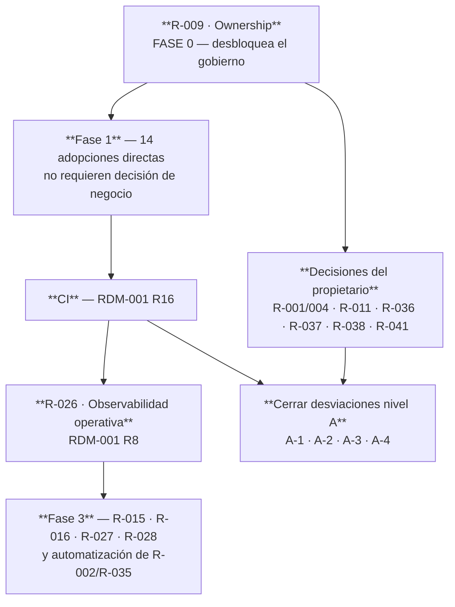

# REC-001 — Evaluación del Documento Maestro de Recomendaciones Arquitectónicas

---

## 2. Control documental

| Campo | Valor |
|---|---|
| **Código** | REC-001 · **Versión** 1.0 · **Estado** **Borrador para decisión** |
| **Autor** | Arquitectura · **Decide** Propietario del producto + Arquitecto |
| **Fecha** | 2026-08-06 · **Entrada evaluada** Documento Maestro de Recomendaciones (R-001 … R-035) |
| **Naturaleza** | **Evaluación, no normativa.** Ninguna recomendación entra en vigor hasta ser adoptada según §8.6 |

## 3. Historial de cambios

| Versión | Fecha | Cambio | Motivo |
|---|---|---|---|
| 1.0 | 2026-08-06 | Evaluación de las 35 recomendaciones + 8 adicionales propuestas | Determinar cuáles adoptar, cuáles ya existen y cuáles requieren ajuste antes de incorporarse al cuerpo normativo |

## 4. Índice

5. Objetivo · 6. Alcance · 7. Método de evaluación · 8.1 Veredicto global · 8.2 Evaluación
detallada por área · 8.3 Discrepancias razonadas · 8.4 Recomendaciones adicionales propuestas ·
8.5 Plan de incorporación · 8.6 Proceso de adopción y enmienda · 9. Referencias · 10. Anexos

## 5. Objetivo

Evaluar si las 35 recomendaciones del Documento Maestro son correctas para el ERP Datafast,
determinar cuáles ya están cubiertas, cuáles requieren ajuste y cuáles faltan — de modo que el
conjunto pueda gobernar la evolución del sistema durante años.

## 6. Alcance

Cubre las 35 recomendaciones recibidas y propone 8 adicionales. **No modifica todavía el cuerpo
normativo**: la incorporación se hace según §8.6, aplicando el propio proceso de gobierno que el
sistema ya declara.

## 7. Método de evaluación

Cada recomendación recibe un veredicto y, cuando procede, un ajuste:

| Veredicto | Significado |
|---|---|
| ✅ **Ya implementada** | El cuerpo normativo la cubre. Se indica dónde |
| 🟡 **Implementada parcialmente** | Existe la declaración, falta el mecanismo |
| 🟢 **Correcta y nueva** | No existe y debe adoptarse |
| ⚠️ **Correcta con ajuste** | El principio es válido; la formulación necesita adaptarse a este ERP |
| ❌ **Discrepo** | Con razón argumentada y contrapropuesta |

**Criterio de evaluación:** una recomendación es correcta para este ERP si (a) resuelve un
problema **medido** en la auditoría, (b) es **verificable**, y (c) su coste de cumplimiento es
proporcional a un equipo pequeño operando un sistema en producción.

---

# 8. Contenido

## 8.1 Veredicto global

**Las 35 recomendaciones son correctas en su principio.** No hay ninguna equivocada de fondo.

| Veredicto | Nº | Recomendaciones |
|---|---|---|
| ✅ Ya implementada | **11** | R-003 · R-006 · R-008 · R-012 · R-013 · R-021 · R-022 · R-023 · R-031 · R-032 · R-035 |
| 🟡 Parcial | **6** | R-002 · R-007 · R-010 · R-024 · R-029 · R-030 |
| 🟢 Correcta y nueva | **13** | R-001 · R-004 · R-009 · R-014 · R-015 · R-017 · R-018 · R-025 · R-026 · R-027 · R-028 · R-033 · R-034 |
| ⚠️ Con ajuste | **4** | R-005 · R-016 · R-019 · R-020 |
| ❌ Discrepo | **1** | R-011 |

### Las tres observaciones que importan

**1. Un tercio ya está construido, y eso valida el conjunto.** Que 11 de 35 recomendaciones
coincidan con lo que el cuerpo normativo ya declara —sin haberlo consultado— indica que el
documento maestro y la arquitectura existente apuntan al mismo sitio. R-035 ("toda política debe
indicar cómo se verifica") se implementó literalmente hoy como POL-001 §8.7.

**2. Las dos recomendaciones más valiosas del conjunto son R-001 y R-004**, y no estaban en el
cuerpo normativo. Son también las más peligrosas si se aplican sin matiz (§8.2.1).

**3. La recomendación que más urge no es ninguna de las críticas marcadas: es R-009
(ownership).** Los 19 documentos del cuerpo normativo tienen el mismo campo vacío: *"Revisores:
pendientes de asignar"*. Un cuerpo normativo sin responsables asignados es una biblioteca, no un
gobierno. **R-003, R-012, R-032 y R-033 dependen todas de que R-009 exista primero.**

---

## 8.2 Evaluación detallada por área

### ÁREA I — GOBIERNO ARQUITECTÓNICO

#### R-001 — Política de Reutilización del Conocimiento · 🟢 **Correcta y nueva** · Crítica

**Veredicto: adoptar, con un guard obligatorio.**

Es la recomendación de mayor alcance estratégico del conjunto, y no existe en el cuerpo normativo.
El ERP tiene hoy 5.477 LOC de facturación y 5.836 de pagos construidos desde cero — dominios que
la industria resolvió hace décadas — mientras su ventaja competitiva real (el plano de red FTTH
con VIO, saga y outbox) es genuinamente superior a productos comerciales del sector.

**El guard imprescindible:** la auditoría demuestra que los dominios "maduros" de este ERP
**contienen invariantes ganados en incidentes de este negocio concreto**:

| Invariante | Origen | ¿Lo traería una solución de industria? |
|---|---|---|
| Un solo escritor del saldo | 4 copias del `UPDATE`, una aplicaba a facturas anuladas | Sí, probablemente |
| **La gracia es la distancia vencimiento→corte** | El corte caía antes del vencimiento (05/08) | **No — es una regla de este negocio** |
| Un timeout cobrando es `indeterminado` | Cobro duplicado / dinero sin registro | Rara vez |
| El extorno es la única reversión | — | Sí |

**Formulación corregida:**

> Antes de construir en un dominio, determinar si el problema es **específico del negocio ISP** o
> **común a cualquier empresa**. En los comunes se adopta conocimiento externo (modelos, esquemas,
> reglas contables, formatos regulatorios); en los específicos se construye.
> **Adoptar conocimiento externo no equivale a adoptar código externo**, y ninguna adopción puede
> eliminar un invariante que nació de un incidente propio sin un ADR que lo justifique.

**Caso de aplicación inmediata y evidente:** la facturación electrónica SUNAT (AEM-001 §Anexo B,
capacidad C-09, no implementada). Es un problema **regulado, estandarizado y resuelto**: firma
XML, envío a OSE, gestión de CDR, catálogos SUNAT. Construirlo desde cero sería el error exacto
que R-001 previene.

---

#### R-002 — Arquitectura Verificable · 🟡 **Parcial** · Crítica

**Estado real medido y verificado el 2026-08-06 (POL-001 §8.7.9):**

| Grado | Políticas | % |
|---|---|---|
| ✅ Automático | 16 | **25 %** |
| ⚠️ Parcial | 19 | 30 % |
| ❌ Manual | 28 | 44 % |

**Lo que existe — más de lo que decía la versión 1.0 de este documento:**

1. La matriz de verificación completa, con mecanismo y objetivo para las 63 políticas.
2. **El CI, desde 2026-07-28** (`.github/workflows/ci.yml`, commit `a36117fd`): typecheck de backend y frontend, **593 tests en 65 suites**, **instalación desde cero** sobre PostgreSQL 16 vacío, volcado del esquema real y `sql:check` contra él — todo **bloqueando el merge**.
3. Tests que verifican **políticas**, no solo comportamiento: `columnas-tipadas.spec.ts` recorre todas las entidades y exige `type:` explícito; `estados-sql-validos.spec.ts`; `frontera-dinero.spec.ts`.

> **Corrección:** la versión 1.0 afirmaba *"Lo que falta es el CI"* y *"la suite de facturación no
> compila"*. Ambas eran falsas — procedían de una memoria del 2026-07-28 que el commit de ese
> mismo día resolvió, propagada sin ejecutar el comando.

**Lo que falta de verdad:** no infraestructura, sino **comprobaciones que enchufar al CI**. Hay
28 políticas cuyo incumplimiento nadie detecta porque nadie ha escrito la comprobación, no porque
no haya dónde ejecutarla.

**Ajuste propuesto:** medir R-002 con un indicador —**% de políticas con verificación
automática**, el KPI nº 1 de R-014— y fijar meta **del 25 % al 60 %** cerrando las de nivel A y B.

**El patrón a replicar** ya existe en el repositorio: `columnas-tipadas.spec.ts` es un test que
recorre el código y falla si alguien incumple una regla. Convertir una política de ❌ a ✅ es
escribir uno de esos, no montar infraestructura.

---

#### R-003 — Gobierno Arquitectónico Continuo · ✅ **Ya implementada** · Crítica

Cubierta por CON-001 §8.9: roles, cuándo se exige un ADR (5 criterios), frecuencia de revisión por
tipo de documento y tratamiento de desviaciones.

**Bloqueo real:** los roles están definidos pero **no asignados**. Depende de R-009.

---

#### R-004 — Benchmark Funcional Obligatorio · 🟢 **Correcta y nueva** · Crítica

**Veredicto: adoptar.** Es la consecuencia operativa de R-001.

**Ajuste propuesto — hacerla verificable.** "Estudiar soluciones consolidadas" no es comprobable.
Formulación alternativa:

> Todo módulo clasificado como **Maduro** (R-005) requiere, antes de su diseño, un **ADR de
> benchmark** que documente: qué soluciones se estudiaron, qué modelo de datos y qué reglas de
> negocio se adoptan de ellas, qué se descarta y por qué, y qué invariantes propios deben
> preservarse pese a la adopción.

Así el benchmark deja rastro y se puede auditar. Sin ADR, "se estudió" es indistinguible de "no se
estudió".

**Aplicación obligatoria inmediata:** SUNAT (H2-1), Inventario (H2-4) y el motor de cobro (H2-2).

---

#### R-005 — Clasificación Oficial de Dominios · ⚠️ **Correcta con ajuste** · Crítica

**El problema:** ya existe una clasificación de dominios en AEM-001 §8.3 (Núcleo / Soporte /
Genérico, 6 dominios). La propuesta introduce otra (Estratégico / Maduro / Integración / Soporte /
Transversal). **Dos taxonomías compitiendo generan exactamente el problema que el ERP ya conoce:
dos verdades que divergen.**

**Pero las dos son necesarias, porque responden preguntas distintas:**

| Taxonomía | Pregunta que responde | Uso |
|---|---|---|
| AEM-001 (Núcleo/Soporte/Genérico) | **¿Quién puede depender de quién?** | Reglas de dependencia (RA-2, RA-3) |
| R-005 (Estratégico/Maduro/…) | **¿Se construye o se adopta?** | Decisión build-vs-buy (R-001, R-004) |

**Ajuste propuesto:** declararlas explícitamente como **dos ejes ortogonales de un mismo módulo**,
no como taxonomías alternativas. Cada módulo tiene una posición en cada eje.

**Clasificación propuesta según el eje de R-005:**

| Naturaleza | Módulos | Metodología |
|---|---|---|
| **Estratégico** (ventaja competitiva) | `olt-nativo` · `mikrotik` · `outbox-red` · `openvpn` · `planta-externa` · `monitoreo` · `reconciliador` · `tr069` | Construir. Diseño propio. Aquí va la innovación |
| **Maduro** (resuelto por la industria) | `facturacion` · `pagos` · `finanzas-opex` · `proyectos-inversion` · `tickets` · **inventario (futuro)** · **SUNAT (futuro)** | **Benchmark obligatorio.** Adoptar modelo y reglas; preservar invariantes propios |
| **Integración** | `smartolt` · `google-integration` · `xui` · `webhooks` · `crm-nativo` · `mensajeria` | Puerto + adaptador. Nunca lógica de negocio dentro |
| **Soporte** | `clientes` · `contratos` · `planes` · `zonas` · `sites` · `portal` · `plantillas` · `notificaciones` · `reportes` · `dashboard` | Construir según necesidad del negocio |
| **Transversal** | `auth` · `usuarios` · `licencia` · `auditoria` · `config` · `sistema` · `backup` · `health` · `schema-guard` · `sagas` · `workers` · `mantenimiento` · `install` | Estabilidad sobre funcionalidad. Cambian poco |

**Observación relevante:** `contratos` queda en Soporte pese a ser el agregado raíz, porque *el
concepto* de contrato es común a cualquier empresa de servicios. Lo estratégico no es el contrato:
es **lo que le cuelga** (registro FTTH, pools, carril de gestión).

---

### ÁREA II — ARQUITECTURA EMPRESARIAL

#### R-006 — Single Source of Truth · ✅ **Ya implementada** · Crítica

Cubierta por DAT-001 §8.2 (propiedad del dato, tabla por tabla), §8.3 (fuentes únicas declaradas)
y POL-001 PA-12 ("una tabla, un dueño").

**Además, el cuerpo normativo va más allá de lo pedido**: declara qué datos **tienen** fuente
única y cuáles **no la tienen todavía** — la deuda calculada en 4 sitios (desviación A-4).

**Un matiz que R-006 no contempla y este ERP sí necesita:** aquí hay datos cuya fuente de verdad
**no es la base de datos sino el hardware**. `ftth_onu_registro` no es la verdad sobre una ONU: es
una creencia verificada. R-006, tal como está formulada ("cada dato tendrá un único origen
oficial"), es correcta pero insuficiente. Debe incorporar la distinción de DAT-001 §8.3.

---

#### R-007 — Gobernar por Capacidades · 🟡 **Parcial** · Alta

El catálogo existe (AEM-001 §8.2, 30 capacidades con su estado). Lo que no existe es **gobernar
por él**: el roadmap está organizado por riesgos e iniciativas técnicas, no por capacidades.

**Ajuste propuesto:** aplicarlo al Horizonte 2 de RDM-001, que es funcional por naturaleza. El
Horizonte 1 es consolidación técnica y **no debe reorganizarse por capacidades** — perdería su
lógica de dependencias.

---

#### R-008 — Catálogo de Capacidades · ✅ **Ya implementada** · Alta

AEM-001 §8.2: 30 capacidades (C-01…C-30) en dos niveles, con módulos participantes y estado real
(24 completas, 5 parciales, **3 ausentes**).

---

#### R-009 — Ownership de Capacidades y Módulos · 🟢 **Correcta y nueva** · **La más urgente**

**Veredicto: adoptar, con ajuste de escala.**

Es la recomendación que desbloquea el resto. Todo el cuerpo normativo —19 documentos— tiene el
mismo campo sin rellenar: *"Revisores: pendientes de asignar"*.

**Ajuste imprescindible:** 44 módulos no pueden tener 44 responsables en un equipo pequeño.
Asignar ownership **por capacidad** (5–6 personas como máximo), no por módulo.

**Propuesta de estructura mínima:**

| Ámbito | Responsable funcional | Responsable técnico |
|---|---|---|
| Comercial (clientes, contratos, planes) | 1 | 1 |
| Financiero (facturación, pagos, cobranza) | 1 | 1 |
| Red / OSS (OLT, MikroTik, VPN, planta) | 1 | 1 |
| Comunicación y cliente final | 1 | 1 |
| Plataforma (auth, licencia, operación) | — | 1 |
| **Cuerpo normativo** | Propietario del producto | **Arquitecto** |

**Regla propuesta:** un módulo sin responsable declarado **no puede recibir cambios estructurales**
— solo correcciones. Es la forma de que el ownership no quede en papel.

---

### ÁREA III — EVOLUCIÓN DEL ERP

#### R-010 — Gestión Formal de Deuda Técnica · 🟡 **Parcial** · Alta

**Lo que existe:** `PENDIENTES.md` con formato obligatorio (qué falta · **por qué importa** · cómo
se comprueba) y, desde hoy, POL-001 Anexo B con **clasificación en niveles A/B/C, estado objetivo
y condición de cierre**.

**Lo que falta, y R-010 lo pide con razón:** **responsable** y **fecha objetivo**.

**Ajuste propuesto:** solo las desviaciones de **nivel A** llevan fecha comprometida. Las de nivel
B llevan condición de cierre; las de nivel C, ninguna. Poner fecha a todo produce fechas que nadie
cumple, y una fecha incumplida sistemáticamente enseña al equipo que las fechas no significan
nada.

---

#### R-011 — Roadmap Arquitectónico Independiente · ❌ **Discrepo** · (marcada Alta)

**El principio es correcto; la solución propuesta produce el efecto contrario.**

**Por qué discrepo:** dos roadmaps compiten por la misma capacidad del equipo. Cuando el negocio
presiona —y siempre presiona— el que se pospone es el arquitectónico, porque no tiene un cliente
esperándolo. El resultado habitual es un roadmap arquitectónico que existe, se cita en reuniones y
no se ejecuta nunca. Eso es **peor** que no tenerlo: da la impresión de que el problema está
gestionado.

**Contrapropuesta — un roadmap con presupuesto arquitectónico explícito:**

| Elemento | Definición |
|---|---|
| **Un solo roadmap** | RDM-001, con las iniciativas etiquetadas `[ARQ]` o `[FUNC]` |
| **Presupuesto** | Un porcentaje fijo y acordado de la capacidad va a `[ARQ]` |
| **Regla de bloqueo** | Una iniciativa `[FUNC]` no entra si depende de una `[ARQ]` no cerrada |
| **Excepción** | Solo el propietario del producto puede consumir el presupuesto arquitectónico, y queda registrado |

Esta forma **ya está aplicada de hecho** en RDM-001: el Horizonte 1 es íntegramente arquitectónico
y bloquea al Horizonte 2 por dependencias declaradas (R1 bloquea las migraciones, R4 bloquea las
pasarelas). Lo que falta es el porcentaje explícito.

**Si aun así se prefiere separarlos**, la condición mínima para que funcione es que el roadmap
arquitectónico tenga **capacidad asignada y protegida**, no solo documento propio.

---

#### R-012 — Modelo de Evolución · ✅ **Ya implementada** · Alta

CON-001 §8.11: modificación de la Constitución, cambios que exigen ADR previo, y el principio
rector *"la plataforma se consolida antes de crecer"*, con la regla de que ante tensión prevalece
cerrar la brecha salvo decisión explícita y registrada del propietario.

---

### ÁREA IV — CALIDAD

#### R-013 — Definir los Invariantes · ✅ **Ya implementada, y por encima de lo pedido** · Crítica

DOM-001 §8.8 (34 reglas de negocio con su mecanismo) y `docs/directrices/` Parte VI (los 20
invariantes del sistema).

**Por encima de lo pedido:** la tabla declara para cada invariante **si está verificado y por
qué mecanismo**, y señala explícitamente los que **no tienen mecanismo propio** — los invariantes
19 (aislamiento entre empresas) y 20 (el reconcile no toca ONUs preexistentes).

> Un catálogo de invariantes que no distingue los protegidos de los confiados da falsa seguridad.
> Ese es precisamente el fallo que el ERP ya vivió: un comentario garantizaba una exclusión mutua
> que era falsa.

---

#### R-014 — KPIs Arquitectónicos · 🟢 **Correcta y nueva** · Alta

**Veredicto: adoptar, con métricas concretas.** Un KPI que no se puede calcular no se calcula.

**Propuesta de KPIs computables desde el repositorio** (todos medidos hoy en la auditoría, luego
tienen línea base real):

| # | KPI | Hoy | Meta | Cómo se calcula |
|---|---|---|---|---|
| 1 | **% de políticas con verificación automática** | **22 %** | 60 % | POL-001 §8.7 |
| 2 | **Desviaciones de nivel A abiertas** | **4** | **0** | POL-001 Anexo B |
| 3 | % de tablas con entidad TypeORM | 68 % (81/120) | 100 % en coordinación y dinero | Conteo de `@Entity` vs tablas |
| 4 | % de módulos de negocio con repositorio | 14 % (6/44) | 100 % del núcleo | Conteo de `*.repository.ts` |
| 5 | **Ciclos de dependencia accidentales** | **2** (de 4) | **0** | Grafo de `@Module` |
| 6 | LOC del módulo mayor | 25.659 | < 10.000 por submódulo | Conteo |
| 7 | Endpoints del controlador mayor | ~150 | < 40 | Conteo de decoradores |
| 8 | % de endpoints mutantes con permiso fino | ~9 % | 100 % en código nuevo | Conteo de `@RequirePermission` |
| 9 | Invariantes críticos con test | 18/20 | 20/20 | Directrices Parte VI |
| 10 | Módulos con especificación MOD-XXX | 3/44 | Los 13 de criticidad máxima | Conteo |

**Regla propuesta:** estos diez se recalculan en cada revisión trimestral. **Un KPI que empeora
sin ADR que lo justifique es una desviación**, y entra en POL-001 Anexo B.

---

#### R-015 — KPIs Funcionales · 🟢 **Correcta y nueva** · Alta

**Veredicto: adoptar, pero está bloqueada.** No hay APM, ni métricas de request, ni
`pg_stat_statements`. La auditoría tuvo que declarar cinco preguntas que el sistema **no puede
responder**.

**Dependencia dura:** R-015 requiere R-026 (observabilidad operativa) primero. Definir KPIs
funcionales antes de poder medirlos produce indicadores estimados, que es peor que no tenerlos.

**KPIs propuestos una vez exista la instrumentación:**

| Área | KPI |
|---|---|
| Cobranza | Tiempo desde el pago hasta la reactivación efectiva del servicio |
| Cobranza | % de pagos aplicados automáticamente sin intervención |
| Provisión | Tiempo medio de alta FTTH completa |
| Provisión | % de provisiones que requieren compensación |
| Red | Edad del comando más antiguo en el outbox |
| Red | Nº de ONUs en drift |
| Red | Nº de discrepancias BD↔router |
| Soporte | % de tickets resueltos sin visita |

---

#### R-016 — Objetivos de Calidad Medibles · ⚠️ **Correcta pero prematura** · Alta

El principio es correcto. El problema es de secuencia: **no se pueden fijar objetivos de
disponibilidad y rendimiento sin poder medirlos**, y hoy no se puede.

**Ajuste propuesto:** dividir en dos fases.

| Fase | Atributos | Medibles hoy |
|---|---|---|
| **Ahora** | Mantenibilidad, seguridad, trazabilidad | **Sí** — con los KPIs de R-014 |
| **Tras R-026** | Disponibilidad, rendimiento, latencia | No |

Fijar hoy un objetivo de disponibilidad sería declarar un número que nadie puede verificar.

---

### ÁREA V — ARQUITECTURA DE SOFTWARE

#### R-017 — Contratos Arquitectónicos entre Módulos · 🟢 **Correcta y nueva** · Alta

**Veredicto: adoptar.** Existen contratos hacia el **exterior** (`IOltProvider`, adaptador de
cobro, driver ACS) pero no **entre módulos internos**: la comunicación es inyección directa del
servicio completo, lo que expone toda su superficie.

**Evidencia de que hace falta:** `mikrotik` importa `contratos` entero solo para validar CIDR y
resolver sesiones — una dependencia de **lectura** que crea un ciclo real (AEM-001 §8.7, ciclo 3).
Un contrato de consulta lo eliminaría.

**Ajuste propuesto — aplicarlo donde paga, no en todas partes:**

| Aplicar a | No aplicar a |
|---|---|
| Módulos con **más de 3 consumidores** (`mikrotik`, `auth`, `config`, `olt-nativo`, `workers`) | Módulos con 1 consumidor |
| Relaciones que hoy forman **ciclo** | Relaciones unidireccionales estables |
| Todo lo que cruce **frontera de dominio** (Comercial→Red, Financiero→Red) | Dentro del mismo dominio |

Un contrato por cada par de módulos en un monolito modular es ceremonia sin beneficio.

---

#### R-018 — Compatibilidad hacia Atrás · 🟢 **Correcta y nueva** · Alta

**Veredicto: adoptar.** No existe como política, **pero sí existe el precedente y está bien
razonado**: `ERP_DOMAIN` cae en `APP_DOMAIN` si no está definido, con la justificación escrita de
que *"renombrar una variable sin periodo de gracia rompe toda instalación existente en su próxima
actualización"* (ADR-012).

**Por qué importa especialmente aquí:** el ERP se instala en **múltiples VPS** que se actualizan de
forma independiente. Un cambio incompatible no rompe un despliegue: rompe **todos los que aún no
se han actualizado**.

**Formulación propuesta:**

> Todo cambio en una variable de entorno, un contrato de API, un formato de configuración o un
> esquema de base de datos **mantiene compatibilidad durante al menos un ciclo de versión**, con
> el valor antiguo funcionando y registrando aviso de obsolescencia. La retirada requiere ADR y
> confirmación de que ninguna instalación activa lo usa.

**Alcance obligatorio:** variables de entorno · endpoints consumidos por el portal o por máquinas ·
formato de `ecosystem.config.js` · scripts enviados a MikroTik · migraciones destructivas.

---

#### R-019 — Versionar Contratos Internos · ⚠️ **Correcta con ajuste** · Alta

**El principio es correcto; el alcance "toda interfaz interna" es desproporcionado.**

En un monolito modular donde todo se despliega junto, versionar una interfaz entre dos servicios
del mismo proceso no aporta: ambos lados cambian en el mismo commit. El versionado paga cuando los
dos extremos **pueden estar en versiones distintas al mismo tiempo**.

**Ajuste propuesto — versionar solo lo que cruza una frontera de despliegue:**

| Contrato | ¿Versionar? | Por qué |
|---|---|---|
| API del ERP (`/api/v1`) | **Sí** (ya lo está) | Frontend y backend se despliegan por separado |
| API del Portal | **Sí** | Superficie pública |
| API del servicio Python | **Sí** | Proceso independiente, se actualiza por separado |
| **Payload de eventos y de jobs de cola** | **Sí** | **Un job encolado sobrevive al despliegue**: lo escribe la versión vieja y lo consume la nueva |
| Esquema del outbox | **Sí** | Igual: comandos pendientes cruzan el despliegue |
| Interfaz entre dos servicios NestJS | No | Cambian juntos |

**El caso del payload de cola es el que hoy no está cubierto y sí puede romper producción**: no
hay catálogo versionado de eventos ni contrato de payload; lo define el emisor (ARS-001 §8.6.2).

---

#### R-020 — Arquitectura Basada en Eventos donde aporte valor · ⚠️ **Correcta pero no verificable** · Alta

**El principio es correcto y, de hecho, es de contención, no de expansión** — lo cual es acertado
en este sistema. Pero *"donde aporte valor"* no se puede verificar en una revisión: dos personas
razonables discreparán siempre.

**Además hay una restricción técnica que la formulación no recoge y que es determinante:**

> El bus de eventos es **in-process**. Un evento emitido en `api-core` **no llega** a
> `worker-auxiliary`. Funciona porque los listeners no ejecutan trabajo: **encolan en Bull**. En la
> práctica, **el bus de eventos es un adaptador hacia las colas**.

Si alguien "aplica EDA donde aporta valor" sin saber esto, escribirá un listener que ejecute lógica
— y fallará silenciosamente según el proceso donde se emitió el evento.

**Ajuste propuesto — sustituir el criterio de valor por una tabla de decisión** (ya existe en
GUI-001 §8.4.1 y debe elevarse a política):

| Situación | Mecanismo obligatorio |
|---|---|
| Notificar un hecho a interesados **desconocidos** | Evento |
| Ejecutar trabajo asíncrono | **Cola Bull**, no evento |
| Mutar hardware | **Outbox**, ni evento ni cola |
| Se necesita el resultado | Llamada directa |
| Cruzar proceso | **Cola**, nunca evento |

Y la regla dura: **un listener encola; no ejecuta** (POL-001 PA-16).

---

### ÁREA VI — GOBIERNO DE DATOS

#### R-021 — Modelo de Gobierno de Datos · ✅ **Ya implementada** · —

DAT-001 completo: propiedad (§8.2), fuente de verdad (§8.3), integridad (§8.4), versionado (§8.5),
retención (§8.6) y auditoría (§8.7).

**Brecha declarada dentro de ella:** seis tablas de serie temporal **sin política de retención ni
particionado** (desviación C-7 → ADR-023).

---

#### R-022 — Catálogo Maestro de Entidades · ✅ **Ya implementada** · —

DOM-001 §8.3 (entidades con identidad y ciclo de vida), §8.4 (objetos de valor), §8.5 (agregados
con sus reglas de consistencia) y DAT-001 §8.1.2 (clasificación de las ~120 tablas).

---

#### R-023 — Propiedad Oficial de cada Dato · ✅ **Ya implementada** · —

DAT-001 §8.2, tabla por tabla, con **la única excepción declarada y justificada**:
`comandos_red_pendientes`, que los módulos de negocio escriben para que la intención esté en su
misma transacción, y que solo `outbox-red` lee y actualiza.

---

#### R-024 — Eliminar Duplicidad Funcional de Datos · 🟡 **Parcial** · —

**Identificada y cuantificada**, no ejecutada:

| Duplicación | Copias | Estado |
|---|---|---|
| Cálculo de deuda | **4** | Abierta — **desviación A-4** |
| Predicado "contrato activo" | ~6 | Abierta |
| Resúmenes agregados | 3 + 2 vistas | Abierta |
| Acceso a MikroTik | 3 caminos | Abierta — desviación B-5 |
| Aplicación de dinero | Eran 4 | **Resuelta** |
| Ubicación del abonado | Eran 4 | **Resuelta** (CTE `PUNTOS_SERVICIO`) |
| Estado de ONU | 2 | **Justificada por escrito** |
| Tipos backend↔frontend | 2 | Abierta — desviación C-5 |

**Precedente favorable:** el equipo **ya resolvió dos** de estas duplicaciones con el mismo método
(una definición en el punto común). Sabe hacerlo.

---

### ÁREA VII — OBSERVABILIDAD

Las cuatro son correctas y ninguna existe. **En conjunto son la brecha más transversal del
sistema:** sin ellas no se puede verificar que ninguna otra recomendación funcionó.

#### R-025 — Observabilidad Arquitectónica · 🟢 **Correcta y nueva**

Es la instrumentación de los KPIs de R-014. Ventaja: **se calcula desde el repositorio**, no
requiere infraestructura. Puede empezar hoy con un script en CI.

#### R-026 — Observabilidad Operativa · 🟢 **Correcta y nueva** · **La prioritaria de las cuatro**

Es RDM-001 **R8**. Prioridad mínima viable, en orden de retorno:

1. **Métricas del plano de intención**: profundidad de las 6 colas, **edad del comando más antiguo del outbox**, latido de cada watcher, duración de cada cron. *Es el dato que convierte el fallo silencioso del worker (desviación A-3) en un fallo ruidoso.*
2. `pg_stat_statements` — saber qué consulta duele en lugar de deducirlo.
3. Latencia y contador por endpoint.

#### R-027 — Observabilidad del Negocio · 🟢 **Correcta y nueva**

Depende de R-026. Indicadores ISP: altas del periodo, bajas, morosidad, tiempo medio de
provisión, ONUs en drift, cortes efectivos frente a cortes ordenados.

#### R-028 — Dashboard Oficial de Salud · 🟢 **Correcta y nueva** · **con una advertencia**

**Riesgo real:** construir el dashboard antes que las métricas produce un tablero con datos
estimados, y un tablero bonito con datos malos se cree más que un texto con datos buenos.

**Regla propuesta:** el dashboard **solo muestra métricas medidas**. Una métrica no instrumentada
se muestra como *"no instrumentada"*, nunca como un valor aproximado. Es la aplicación directa de
la filosofía del sistema: *aceptado ≠ materializado*, trasladada a la medición.

---

### ÁREA VIII — SEGURIDAD

#### R-029 — Security by Design · 🟡 **Parcial**

**Existe:** SEC-001 completo, POL-001 §8.3 (9 políticas de seguridad) y el checklist de seguridad
para módulo nuevo (SEC-001 Anexo C, 10 puntos).

**Falta:** que el checklist sea **obligatorio y verificado**. Hoy es una lista en un anexo.

**Y falta lo más importante:** la desviación **A-1** — el aislamiento multi-tenant depende de que
445 consultas recuerden filtrar. Security by design sin cerrar A-1 es una declaración.

---

#### R-030 — Modelo Oficial de Riesgos Técnicos · 🟡 **Parcial**

**Existe:** 20 riesgos identificados con causa, impacto, probabilidad y criticidad
(`docs/consolidacion/` cap. 10).

**Falta:** que sea un **modelo vivo** — hoy es una fotografía de una auditoría. Sin responsable,
sin fecha de revisión, sin actualización tras cada incidente.

**Ajuste propuesto:** fusionarlo con POL-001 Anexo B. Un riesgo técnico **es** una desviación con
consecuencia; mantener dos registros paralelos garantiza que diverjan (que es, literalmente, el
problema que R-006 previene).

---

#### R-031 — Clasificar la Criticidad de los Módulos · ✅ **Ya implementada**

MOD-000 Anexo A: 13 de criticidad máxima, 11 alta, 12 media, 4 baja. Usada además en AEM-001 §8.4
y en PRO-001 §8.7.2 (impacto por proceso caído).

---

### ÁREA IX — DESARROLLO

#### R-032 — Toda decisión estructural requiere ADR · ✅ **Ya implementada**

CON-001 §8.9.2 define los 5 criterios que exigen ADR. ADR-000 contiene 16 ADR retroactivos y 12
propuestos (017–028) con número reservado.

**Único ajuste:** hoy dice "se registra **antes** de implementar". Conviene añadir la consecuencia:
**una decisión estructural implementada sin ADR es una desviación de nivel B**, y entra en el
registro.

---

#### R-033 — Análisis de Impacto · 🟢 **Correcta y nueva**

**Veredicto: adoptar.** El insumo ya existe —grafo de dependencias (AEM-001 §8.5), grados por
módulo, y el anexo "Impacto de modificar este módulo" en cada MOD-XXX— pero **no hay obligación
de usarlo**.

**Formulación propuesta — hacerla barata o no se hará:**

> Todo cambio estructural declara, en el ADR o en el PR: qué módulos dependen del modificado ·
> qué invariantes toca · qué políticas afecta (R-034) · qué se rompe si sale mal y **cómo se
> revierte**.

**Umbral propuesto:** obligatorio solo si toca un módulo de criticidad máxima, un invariante de
DOM-001 §8.8, o un contrato versionado (R-019). Exigirlo para todo cambio lo convierte en trámite,
y un trámite se rellena sin pensar.

---

#### R-034 — Toda nueva funcionalidad indica qué políticas afecta · 🟢 **Correcta y nueva**

**Veredicto: adoptar. Es la más elegante del conjunto.**

Cierra el bucle: POL-001 §8.7 declara **cómo se verifica cada política**, y R-034 obliga a que cada
cambio declare **qué políticas toca**. Juntas convierten el cuerpo normativo en algo que se
consulta al trabajar, no que se lee una vez.

**Implementación propuesta:** una sección en la plantilla de PR con tres casillas —
*políticas que aplica* · *políticas que incumple (con nivel y justificación)* · *desviaciones que
cierra*. Sin herramienta nueva.

**Efecto secundario valioso:** un desarrollador que debe declarar qué política incumple, o la
cumple o la discute. Ambas cosas son mejores que incumplirla en silencio.

---

#### R-035 — Toda política indica cómo se verifica · ✅ **Implementada hoy**

POL-001 §8.7: 63 políticas con tipo de evidencia, grado de verificación, cómo se comprueba hoy y
**estado objetivo**. Incluye §8.7.10, que declara las políticas **imposibles de automatizar** para
no perseguir un imposible.

---

## 8.3 Discrepancias razonadas — resumen

| # | Recomendación | Discrepancia | Contrapropuesta |
|---|---|---|---|
| 1 | **R-011** roadmap arquitectónico independiente | Dos roadmaps compiten y el arquitectónico siempre pierde; queda como documento no ejecutado, que es peor que no tenerlo | **Un roadmap con presupuesto arquitectónico explícito y protegido**, con etiquetas `[ARQ]`/`[FUNC]` y regla de bloqueo por dependencia |
| 2 | **R-019** versionar toda interfaz interna | En un monolito de despliegue único, versionar interfaces que cambian juntas es ceremonia | Versionar **solo lo que cruza frontera de despliegue**, incluyendo lo que hoy no está cubierto: **payloads de eventos y de jobs de cola**, y el esquema del outbox |
| 3 | **R-020** EDA "donde aporte valor" | No es verificable, y omite que el bus es in-process | **Tabla de decisión obligatoria** (evento / cola / outbox / llamada directa) + la regla "un listener encola, no ejecuta" |
| 4 | **R-016** objetivos de calidad medibles | Prematura: hoy no se puede medir disponibilidad ni rendimiento | Dividir en dos fases: lo medible hoy (mantenibilidad, seguridad) y lo que espera a R-026 |
| 5 | **R-005** clasificación de dominios | Introduce una segunda taxonomía que competiría con la de AEM-001 | Declararlas **dos ejes ortogonales**: dependencia (AEM-001) y build-vs-buy (R-005) |
| 6 | **R-001/R-004** benchmark de dominios maduros | Riesgo de descartar invariantes ganados en incidentes propios | Guard explícito: **adoptar conocimiento externo ≠ adoptar código externo**; ningún invariante propio se elimina sin ADR |
| 7 | **R-010** deuda con responsable y fecha | Poner fecha a toda la deuda produce fechas incumplidas que devalúan las fechas | Fecha comprometida **solo para nivel A** |
| 8 | **R-033** análisis de impacto | Exigirlo en todo cambio lo convierte en trámite | Umbral: criticidad máxima, invariante o contrato versionado |
| 9 | **R-030** modelo de riesgos separado | Dos registros paralelos (riesgos y desviaciones) divergirán | **Fusionarlo con POL-001 Anexo B** |

---

## 8.4 Recomendaciones adicionales propuestas

Ocho brechas que ni el documento maestro ni el cuerpo normativo cubren. Ordenadas por gravedad.

### R-036 — Política de Protección de Datos Personales · 🔴 **Crítica**

**La omisión más seria del conjunto.** Ni el documento maestro ni los 19 documentos del cuerpo
normativo mencionan protección de datos personales.

**Qué guarda hoy el ERP:**

| Dato | Origen | Sensibilidad |
|---|---|---|
| Documento de identidad y datos de RENIEC | `clientes` | **Alta** |
| Teléfono y correo | `clientes` | Media |
| Dirección de domicilio | `clientes`, `contratos` | **Alta** |
| **Coordenadas GPS del domicilio** | `contratos.latitud_instalacion` | **Alta** |
| Foto del cliente | Uploads | **Alta** |
| **Mensajes de WhatsApp** | `crm_mensajes` | **Alta** |
| Consumo de datos por contrato | `consumo_datos` | Media |
| **Dispositivos conectados en el domicilio** | Portal / TR-069 | **Alta** |
| Credenciales WiFi del abonado | `contrato_onu_config` | **Alta** |

**Contenido propuesto:** base legal del tratamiento · minimización · plazos de retención por tipo
de dato · derecho de acceso y supresión (qué ocurre con los datos al dar de baja a un cliente) ·
quién puede consultar qué · **anonimización en respaldos y entornos de prueba** · registro de
accesos a datos sensibles.

**Riesgo concreto que hoy existe:** un respaldo de producción restaurado en un entorno de prueba
contiene el padrón completo con documentos, direcciones, coordenadas y conversaciones. No hay
política que lo regule.

---

### R-037 — Política de Entorno de Pruebas · 🔴 **Crítica**

**No existe entorno de pruebas.** Todo se verifica en producción, con clientes reales.

**Evidencia acumulada de que esto ya cuesta:** el despliegue que estuvo 11 horas ejecutando código
viejo · la columna sin `type:` que solo se manifestó en el primer reinicio real · el `--reload` que
abortó una provisión en curso · la certificación de bootstrap que dio falso positivo por probarse
sobre un equipo que ya tenía la configuración buscada.

**Contenido propuesto:** qué se puede probar en producción y qué no · cómo se obtiene un entorno
con datos **anonimizados** (depende de R-036) · **cómo se prueba contra hardware sin tocar clientes
reales** — que es el problema difícil y específico de este ERP.

**Matiz honesto:** un entorno de pruebas completo con OLT y MikroTik propios es caro. La política
debe reconocerlo y definir qué se prueba con hardware de laboratorio, qué con simulación y qué
inevitablemente en producción — **con qué precauciones**.

---

### R-038 — Política de Fin de Vida de Dependencias Externas · 🟠 **Alta**

El ERP depende de terceros con riesgo real de desaparición o ruptura, y **no hay ninguna política
sobre qué hacer cuando ocurra**:

| Dependencia | Riesgo |
|---|---|
| **`whatsapp-web.js`** | **No es API oficial.** Puede dejar de funcionar sin aviso |
| Evolution API v2.2.3 | Versión fijada; proyecto de terceros |
| GenieACS | Sin contrato de soporte; credenciales duplicadas fuera del repositorio |
| XUI.ONE | Software de terceros |
| SmartOLT / AdminOLT | Camino legado en migración |
| Servidor de licencias | **Su caída bloquea el ERP completo** |

**Contenido propuesto:** por cada dependencia crítica — plan de contingencia si desaparece ·
tiempo estimado de sustitución · **si existe puerto que permita sustituirla** (INT-001 §8.2) ·
revisión periódica de vigencia.

**Regla derivable:** una dependencia sin puerto es una dependencia **insustituible**. De las 18
integraciones, las de acoplamiento alto —MikroTik, OpenVPN, Mercado Pago, WhatsApp Web— son
exactamente las que no se pueden sustituir sin tocar lógica de negocio.

---

### R-039 — Política de Sunset (retirada de funcionalidad) · 🟠 **Alta**

**El cuerpo normativo describe cómo se construye y cómo evoluciona, pero no cómo se retira.** Un
sistema que solo acumula termina siendo inmanejable, y ya hay señales:

`smartolt` (legado en migración, sin fecha) · `migracion/` (directorio vacío) · `molecules/`
(vacío) · `mock-data/` (en el árbol de producción) · cola `mikrotik-jobs` (declarada, no usada) ·
`telegraf`, `twilio`, `net-snmp` (instaladas sin uso) · tab ONU/Router del cliente (pendiente de
eliminar).

**Contenido propuesto:** cuándo una funcionalidad se declara obsoleta · periodo de gracia y aviso
(enlaza con R-018) · **qué se hace con sus datos** · quién autoriza la retirada · registro en ADR.

---

### R-040 — Definición de "Terminado" · 🟠 **Alta**

No existe criterio común de cuándo una funcionalidad está completa. La consecuencia está medida:
funcionalidades que existen en la interfaz y **no en el backend** (SUNAT, inventario), campos que
se guardan y no hacen nada (mora, reconexión, esquema de impuestos), y secciones del modal de ONU
solo maquetadas.

**Definición propuesta — una funcionalidad está terminada cuando:**

| # | Criterio |
|---|---|
| 1 | Funciona de extremo a extremo, **verificado en el entorno real** (no solo compila) |
| 2 | Sus invariantes críticos tienen test que **nombra el incidente** que previene |
| 3 | Declara **qué políticas aplica y cuáles incumple** (R-034) |
| 4 | Si es un módulo nuevo: tiene ficha en MOD-000 y su clasificación degradable/Core decidida |
| 5 | Si cambia la operación: PRO-001 actualizado |
| 6 | Si cambia el uso: MAN-001 o MAN-002 actualizado |
| 7 | **Si está a medias, la interfaz NO la ofrece** |

**El punto 7 es el que hoy falta y el que más confunde al operador:** una sección visible que no
hace nada es peor que una sección ausente, porque el usuario cuenta con ella.

---

### R-041 — Política de Gestión de Capacidad · 🟡 **Media**

Los límites de memoria de PM2 suman **3,17 GB sobre ~1,9 GB de RAM** y ya hubo un episodio con
87 MB libres. `max_connections=100` con 3 procesos × 15 conexiones. Series temporales creciendo
sin techo. **No hay criterio declarado de cuándo crecer.**

**Contenido propuesto:** umbrales que disparan una decisión de capacidad (memoria libre, conexiones
usadas, tamaño de las tablas de serie, profundidad de colas) · qué se escala primero · qué **no**
se puede escalar (los workers de OLT, por el límite VTY del MA5800 — ADR-008).

---

### R-042 — Política de Reversibilidad · 🟡 **Media**

Complementa R-033. El cuerpo normativo tiene **excelente** reversibilidad en el plano de red (saga,
compensación, VIO al deshacer) y **ninguna declarada** en el plano de software: no hay política de
cómo se revierte un despliegue, una migración destructiva o una funcionalidad nueva.

**Contenido propuesto:** todo cambio estructural declara su plan de reversión **antes** de
ejecutarse · las migraciones destructivas requieren ADR y respaldo verificado · una funcionalidad
nueva tras un interruptor puede desactivarse sin desplegar.

**Precedente interno que lo justifica:** la propia arquitectura del ERP ya aplica este principio al
hardware —*la compensación se registra ANTES de ejecutar el paso*—. R-042 es esa misma idea
aplicada al software.

---

### R-043 — Política de Continuidad del Conocimiento · 🟡 **Media**

El conocimiento más valioso de este sistema **es el de los incidentes**: por qué el timeout de la
WAN son 90 segundos, por qué hay un solo worker uvicorn, por qué el `iroute` declara propiedad, por
qué el reconcile no debe tocar ONUs adoptadas.

**El cuerpo normativo lo captura bien** —tests que nombran incidentes, comentarios que explican la
causa, catálogo de lecciones— pero **no está declarado como política**, así que depende de que
cada persona mantenga la costumbre.

**Contenido propuesto:** todo incidente de producción genera **una** de estas tres cosas: un test
que lo previene, una entrada en el catálogo de lecciones, o un ADR · el cuerpo normativo se revisa
tras cada incidente relevante · ninguna área crítica depende de una sola persona (**bus factor**) ·
las 21 directrices que hoy **solo viven en comentarios de código** (`docs/directrices/` Anexo) se
elevan a documento.

---

## 8.5 Plan de incorporación al cuerpo normativo

### Fase 0 — Desbloqueo (sin ella nada de lo demás se sostiene)

| Rec. | Acción | Documento destino |
|---|---|---|
| **R-009** | **Asignar ownership por capacidad** (5–6 personas) y rellenar «Revisores» en los 19 documentos | Todos |

### Fase 1 — Adopciones directas (no requieren decisión de negocio)

| Rec. | Acción | Documento destino |
|---|---|---|
| R-005 | Añadir el eje build-vs-buy como segunda dimensión | AEM-001 §8.3 |
| R-014 | Incorporar los 10 KPIs arquitectónicos con línea base | POL-001 nuevo §8.8 |
| R-017 | Política de contratos entre módulos (umbral: >3 consumidores o ciclo) | POL-001 §8.2 |
| R-018 | Política de compatibilidad hacia atrás | POL-001 §8.2 |
| R-019 | Versionado de payloads de evento, jobs y outbox | EST-001 §8.4 + ARS-001 §8.6 |
| R-020 | Elevar la tabla de decisión de mecanismo a política | POL-001 PA-16 (ampliar) |
| R-030 | **Fusionar** el modelo de riesgos con el registro de desviaciones | POL-001 Anexo B |
| R-032 | Añadir: implementar sin ADR = desviación nivel B | CON-001 §8.9.2 |
| R-033 | Análisis de impacto con umbral | POL-001 §8.1 |
| R-034 | Declaración de políticas afectadas en cada PR | GUI-001 §8.6 |
| **R-039** | Política de sunset | POL-001 §8.2 |
| **R-040** | Definición de "terminado" | GUI-001 nuevo §8.7 |
| **R-042** | Política de reversibilidad | POL-001 §8.6 |
| **R-043** | Continuidad del conocimiento | POL-001 §8.4 |

### Fase 2 — Requieren decisión del propietario

| Rec. | Decisión que exige |
|---|---|
| **R-001 / R-004** | ¿Se adopta la clasificación build-vs-buy? Implica que **SUNAT e inventario no se construyen desde cero** |
| **R-011** | Roadmap único con presupuesto arquitectónico, o dos roadmaps. **Y qué porcentaje de capacidad se protege** |
| **R-036** | Alcance de la política de datos personales |
| **R-037** | Presupuesto del entorno de pruebas: laboratorio con hardware, simulación, o precauciones en producción |
| **R-038** | Nivel de contingencia aceptable por dependencia crítica |
| **R-041** | Umbrales de capacidad y momento de escalar |

### Fase 3 — Bloqueadas por infraestructura

| Rec. | Bloqueada por |
|---|---|
| R-015, R-016 (parte), R-027, R-028 | **R-026 / RDM-001 R8** — observabilidad operativa |
| R-002 (ampliar cobertura), R-035 (automatización) | **No por falta de CI —ya existe—** sino por falta de comprobaciones ejecutables por política |
| R-029 (cierre real) | **Desviación A-1** — aislamiento multi-tenant |

---

## 8.6 Proceso de adopción y de enmienda

El usuario pide que estas políticas gobiernen el proyecto **durante años, con proceso establecido
para modificarlas**. Ese proceso ya existe parcialmente (CON-001 §8.11) y se completa aquí.

### 8.6.1 Adopción de este documento

Aplicando el propio gobierno del sistema, **REC-001 no es normativo por existir**. Para que estas
recomendaciones obliguen:

| # | Paso | Responsable |
|---|---|---|
| 1 | Revisar los veredictos y las 9 discrepancias (§8.3) | Arquitecto + Propietario |
| 2 | Decidir las 6 de Fase 2 | **Propietario** |
| 3 | Asignar ownership (R-009) | **Propietario** |
| 4 | Incorporar las adoptadas a POL-001, CON-001, EST-001, GUI-001 con su número | Arquitecto |
| 5 | Registrar en el historial de cada documento **qué cambió y por qué** | Arquitecto |
| 6 | Declarar REC-001 **Obsoleto**, sustituido por las políticas incorporadas | Arquitecto |

> **El paso 6 es deliberado.** Un documento de recomendaciones que sobrevive junto a las políticas
> que generó crea dos fuentes de verdad — el problema que R-006 previene. Una vez incorporadas, la
> norma es POL-001; REC-001 queda solo como trazabilidad histórica.

### 8.6.2 Enmienda de una política ya vigente

| Nivel de cambio | Qué exige | Autoriza |
|---|---|---|
| **Principio fundamental** (CON-001 §8.6) | **No se modifica: se sustituye.** Exige documentar qué evidencia demostró que el anterior era incorrecto | **Propietario** |
| Visión, misión o valores | Nueva ratificación; la anterior **caduca** | **Propietario** |
| Política obligatoria (POL-001) | ADR previo con alternativas + actualización de la matriz de verificación (§8.7) | Arquitecto, informando al Propietario |
| Estándar técnico (EST-001) | ADR si cambia una obligación; historial si solo precisa | Arquitecto |
| Guía (GUI-001) | Historial de cambios | Arquitecto |
| **Añadir una excepción** a una política vigente | Registro en POL-001 Anexo B con **nivel, estado objetivo y condición de cierre** | Nivel A: **Propietario** · B y C: Arquitecto |

### 8.6.3 Las cuatro reglas que hacen que esto dure

| # | Regla | Por qué |
|---|---|---|
| 1 | **Ninguna política entra sin su método de verificación** (R-035) | Una política que no se puede comprobar se incumple en silencio |
| 2 | **Ninguna excepción se acepta sin condición de cierre** | Una excepción sin cierre es una política derogada de hecho |
| 3 | **Toda política incumplida se registra con su nivel** (A/B/C) | Lo registrado es gobernable; lo silencioso es deuda invisible |
| 4 | **Los KPIs arquitectónicos se recalculan cada trimestre** (R-014) | Sin medición, la degradación se descubre cuando ya duele |

### 8.6.4 Revisión periódica

| Documento | Frecuencia | Disparador adicional |
|---|---|---|
| CON-001 | Anual | Cambio de modelo de negocio |
| POL-001, EST-001 | Semestral | **Tras cada incidente que revele un vacío** |
| KPIs arquitectónicos | **Trimestral** | — |
| Registro de desviaciones (Anexo B) | **Trimestral** | Al abrir o cerrar cualquiera |
| Riesgos técnicos (fusionado) | Trimestral | Tras cada incidente |
| Ownership (R-009) | Anual | Cambio de equipo |

---

# 9. Referencias

CON-001 · POL-001 (§8.7 matriz de verificación · Anexo B registro de desviaciones) · AEM-001 ·
ARS-001 · DOM-001 · DAT-001 · INT-001 · SEC-001 · EST-001 · GUI-001 · MOD-000 · PRO-001 ·
RDM-001 · ADR-000 (016 aceptados + 017–028 propuestos) · `docs/auditoria/` · `docs/consolidacion/`
· `docs/directrices/` · `PENDIENTES.md`

---

# 10. Anexos

## Anexo A — Tabla resumen de los 35 veredictos

| Rec. | Título | Veredicto | Destino |
|---|---|---|---|
| R-001 | Reutilización del conocimiento | 🟢 Nueva, con guard | POL-001 §8.2 · **Fase 2** |
| R-002 | Arquitectura verificable | 🟡 Parcial (25 %) | POL-001 §8.7 ✓ · **CI ya existe** · faltan comprobaciones que enchufarle |
| R-003 | Gobierno continuo | ✅ Implementada | CON-001 §8.9 |
| R-004 | Benchmark obligatorio | 🟢 Nueva, vía ADR | POL-001 §8.2 · **Fase 2** |
| R-005 | Clasificación de dominios | ⚠️ Como segundo eje | AEM-001 §8.3 |
| R-006 | Single Source of Truth | ✅ Implementada | DAT-001 §8.2/§8.3 |
| R-007 | Gobernar por capacidades | 🟡 Parcial | RDM-001 H2 |
| R-008 | Catálogo de capacidades | ✅ Implementada | AEM-001 §8.2 |
| R-009 | **Ownership** | 🟢 **Nueva — la más urgente** | **Todos · Fase 0** |
| R-010 | Deuda técnica formal | 🟡 Parcial | POL-001 Anexo B |
| R-011 | Roadmap arquitectónico | ❌ **Discrepo** | Contrapropuesta §8.3 |
| R-012 | Modelo de evolución | ✅ Implementada | CON-001 §8.11 |
| R-013 | Invariantes | ✅ Implementada y superada | DOM-001 §8.8 |
| R-014 | KPIs arquitectónicos | 🟢 Nueva, con 10 métricas | POL-001 nuevo §8.8 |
| R-015 | KPIs funcionales | 🟢 Nueva, bloqueada | Tras R-026 |
| R-016 | Objetivos de calidad | ⚠️ En dos fases | Parcial ahora |
| R-017 | Contratos entre módulos | 🟢 Nueva, con umbral | POL-001 §8.2 |
| R-018 | Backward compatibility | 🟢 Nueva | POL-001 §8.2 |
| R-019 | Versionar contratos | ⚠️ Solo cruce de despliegue | EST-001 §8.4 |
| R-020 | EDA donde aporte valor | ⚠️ Tabla de decisión | POL-001 PA-16 |
| R-021 | Gobierno de datos | ✅ Implementada | DAT-001 |
| R-022 | Catálogo de entidades | ✅ Implementada | DOM-001 §8.3 |
| R-023 | Propiedad del dato | ✅ Implementada | DAT-001 §8.2 |
| R-024 | Eliminar duplicidad | 🟡 Identificada | RDM-001 R4 |
| R-025 | Observabilidad arquitectónica | 🟢 Nueva | Con R-014 |
| R-026 | Observabilidad operativa | 🟢 **Nueva — prioritaria** | RDM-001 R8 |
| R-027 | Observabilidad de negocio | 🟢 Nueva | Tras R-026 |
| R-028 | Dashboard de salud | 🟢 Nueva, con advertencia | Tras R-025/026/027 |
| R-029 | Security by design | 🟡 Parcial | SEC-001 · A-1 |
| R-030 | Riesgos técnicos | 🟡 Fusionar | POL-001 Anexo B |
| R-031 | Criticidad de módulos | ✅ Implementada | MOD-000 Anexo A |
| R-032 | ADR obligatorio | ✅ Implementada | CON-001 §8.9.2 |
| R-033 | Análisis de impacto | 🟢 Nueva, con umbral | POL-001 §8.1 |
| R-034 | Políticas afectadas por PR | 🟢 **Nueva — la más elegante** | GUI-001 §8.6 |
| R-035 | Verificación de políticas | ✅ **Implementada hoy** | POL-001 §8.7 |

## Anexo B — Las 8 recomendaciones adicionales

| Rec. | Título | Prioridad | Brecha que cubre |
|---|---|---|---|
| **R-036** | **Protección de datos personales** | 🔴 **Crítica** | **Ninguno de los 19 documentos la menciona.** El ERP guarda documentos de identidad, coordenadas GPS de domicilios, fotos y conversaciones |
| **R-037** | **Entorno de pruebas** | 🔴 Crítica | No existe. Todo se prueba en producción con clientes reales |
| R-038 | Fin de vida de dependencias | 🟠 Alta | `whatsapp-web.js` no es API oficial; el servidor de licencias bloquea el ERP entero |
| R-039 | Sunset de funcionalidad | 🟠 Alta | El cuerpo normativo dice cómo construir, no cómo retirar |
| R-040 | Definición de "terminado" | 🟠 Alta | Funcionalidades visibles en la interfaz sin backend detrás |
| R-041 | Gestión de capacidad | 🟡 Media | Límites PM2 = 3,17 GB sobre 1,9 GB de RAM |
| R-042 | Reversibilidad | 🟡 Media | Excelente en hardware, inexistente en software |
| R-043 | Continuidad del conocimiento | 🟡 Media | 21 directrices viven solo en comentarios de código |

## Anexo C — Orden de ejecución sugerido

**Lectura:** R-009 desbloquea todo. Las 14 adopciones de Fase 1 no dependen de nadie más y pueden
empezar hoy. La observabilidad es el cuello de botella de la mitad del área VII y de los KPIs
funcionales. Y las cuatro desviaciones de nivel A necesitan **decisión del propietario más CI**,
no solo trabajo técnico.

## Anexo D — Lo que este conjunto NO resuelve

Para acotar expectativas:

| Elemento | Por qué no lo resuelve ninguna recomendación |
|---|---|
| Falta de capacidad del equipo | Ninguna política crea horas de trabajo |
| Las tres capacidades ausentes (SUNAT, inventario, cambio de ONU) | Requieren construcción, no gobierno |
| El límite físico del MA5800 | Es hardware |
| Los ~1,9 GB de RAM del VPS | Es infraestructura (R-041 solo declara cuándo actuar) |
| La ausencia de entorno de pruebas | R-037 la declara; resolverla cuesta dinero |

> Un cuerpo normativo bien construido **no hace el trabajo: hace que el trabajo que se hace no se
> pierda**. Esa es la medida realista de lo que estas recomendaciones pueden lograr.
