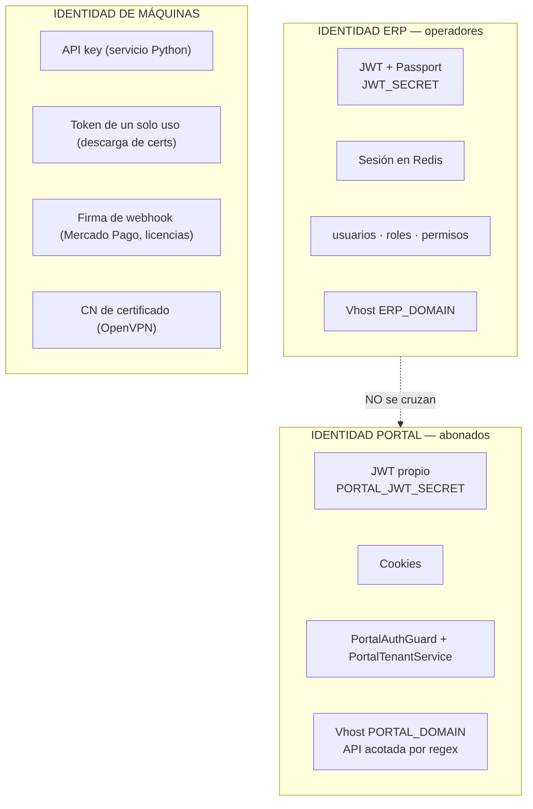
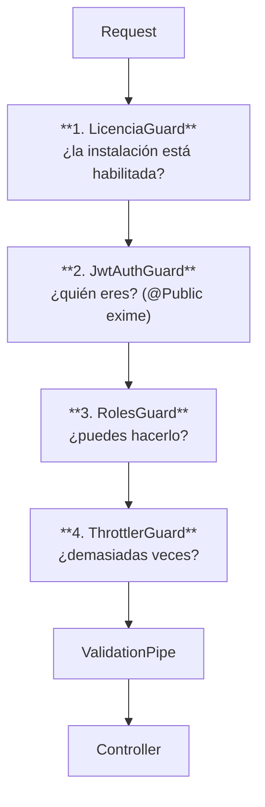

# SEC-001 — Arquitectura de Seguridad

---

## 2. Control documental

| Campo | Valor |
|---|---|
| **Código** | SEC-001 · **Versión** 1.0 · **Estado** Vigente |
| **Autor** | Arquitectura · **Revisores** Pendientes de asignar |
| **Fecha** | 2026-08-06 · **Documento superior** CON-001, POL-001, ARS-001 |
| **Clasificación** | Interno — no contiene secretos ni credenciales |

## 3. Historial de cambios

| Versión | Fecha | Cambio | Motivo |
|---|---|---|---|
| 1.0 | 2026-08-06 | Emisión inicial | Los mecanismos de seguridad existían y eran sólidos, pero su cobertura desigual no estaba declarada en ninguna parte |

## 4. Índice

1. Identidad · 2. Autenticación · 3. Autorización · 4. Auditoría · 5. Cifrado ·
6. Gestión de secretos · 7. Seguridad de APIs

## 5. Objetivo

Declarar los mecanismos de seguridad del ERP Datafast, su cobertura real y sus brechas conocidas,
de modo que las decisiones de riesgo se tomen con información en lugar de con suposición.

## 6. Alcance

Backend, frontend, portal del abonado, servicio Python, base de datos, infraestructura y
gestión de secretos. **No cubre** seguridad física del VPS ni políticas de RRHH.

## 7. Definiciones y glosario

| Término | Definición |
|---|---|
| **Operador** | Usuario del ERP (personal del ISP) |
| **Abonado** | Cliente final, usuario del portal |
| **Tenant / Empresa** | Unidad de aislamiento multi-cliente (`empresa_id`) |
| **RBAC** | Control de acceso basado en roles |
| **RLS** | *Row-Level Security* — filtrado a nivel de fila en PostgreSQL |
| **Guard** | Componente NestJS que autoriza o rechaza una petición |
| **Secreto** | Valor cuya revelación compromete el sistema |

---

# 8. Contenido

## 8.1 Identidad

### 8.1.1 Dos sistemas de identidad completamente separados



**Un token del portal no sirve en el ERP y viceversa.** Es la separación de privilegios más
fuerte del sistema y está **verificada por test** (`portal-auth.aislamiento.spec.ts`,
`portal-cookies.spec.ts`).

### 8.1.2 Identidades del sistema

| Identidad | Sujeto | Credencial | Ámbito |
|---|---|---|---|
| Operador | Personal del ISP | Usuario + contraseña (bcrypt) → JWT | ERP completo según rol |
| Abonado | Cliente final | Credenciales del portal → JWT propio en cookie | Solo sus contratos |
| Backend → Python | Proceso | API key en cabecera | API interna en `127.0.0.1` |
| MikroTik → Backend | Equipo | Token de un solo uso en la URL | Descarga de su script/cert |
| OpenVPN → Backend | Servicio local | Token / CN | Endpoints de validación de túnel |
| Proveedor → Backend | Externo | Firma o clave de webhook | Endpoint del webhook |
| Docker/PM2 → Backend | Supervisor | — (público) | `/health*` |

## 8.2 Autenticación

### 8.2.1 Operadores del ERP

| Aspecto | Implementación |
|---|---|
| Esquema | JWT Bearer (`@nestjs/jwt` + Passport) |
| Estrategias | `jwt.strategy.ts` · `local` (login) · `ws-jwt.guard.ts` (WebSocket) |
| Hash de contraseña | `bcryptjs` |
| Refresh | `POST /auth/refresh` — par access/refresh |
| Almacén de sesión | **Redis** (vía `CacheModule`) |
| Recuperación | `forgot-password` / `reset-password` por correo |
| Cierre por inactividad | `useInactivityLogout.ts` (lado cliente) |
| Secreto | `JWT_SECRET` en `.env.production` |

### 8.2.2 Abonados del portal

| Aspecto | Implementación |
|---|---|
| Servicio | `portal-auth.service.ts` |
| Guard | `portal-auth.guard.ts` |
| Secreto | **`PORTAL_JWT_SECRET`** — distinto del ERP |
| Transporte | **Cookies** (no cabecera Bearer) |
| Aislamiento de tenant | `portal-tenant.service.ts` |
| Endpoints | `POST /portal/auth/login` · `/refresh` · `/logout` |
| Verificación | Tests de aislamiento y de cookies |

### 8.2.3 Autenticación de máquinas

| Consumidor | Mecanismo | Nota |
|---|---|---|
| `olt-automation-service` | API key en middleware FastAPI | Escucha **solo** en `127.0.0.1:8001` |
| Descarga de cert MikroTik | **Token de un solo uso en la URL** | `GET /openvpn/mikrotik-clients/certs/:token/:filename` |
| Webhooks | Firma / clave del proveedor | `rawBody: true` habilitado en `main.ts` **precisamente** para poder verificarlas |
| Callbacks de OpenVPN | Token / CN | `verify-auth`, `verificar-sesion-cn`, `disconnect-notify` |

### 8.2.4 Protección contra fuerza bruta

| Capa | Medida |
|---|---|
| Nginx | `limit_req zone=auth` — login burst 3, refresh burst 5 |
| Aplicación | `ThrottlerGuard` global: 10/s · 100/min · 1000/h |
| Cabeceras | Rutas de autenticación con `no-store, no-cache, must-revalidate` |

## 8.3 Autorización

### 8.3.1 Cadena de guards globales (en orden)



**`LicenciaGuard` es el primero, por diseño.** Sin licencia válida, el ERP está bloqueado
completo, **incluido `auth`**.

### 8.3.2 Modelo RBAC

```
usuarios ─N:M─ roles ─N:M─ permisos
```

| Capacidad | Endpoint |
|---|---|
| Catálogo de permisos | `GET /permisos` |
| Permisos efectivos del usuario | `GET /auth/permissions` |
| Asignar roles | `PATCH /usuarios/:id/roles` |
| Editar permisos de un rol | `PATCH /roles/:id/permisos` |
| Clonar un rol | `POST /roles/:id/clonar` |

### 8.3.3 Cobertura de la autorización fina — **brecha declarada**

El decorador `@RequirePermission('recurso:accion')` está aplicado en **4 de 44 módulos**:

| Módulo | Cobertura |
|---|---|
| `contratos` | 25 de 25 endpoints |
| `planes` | 5 de 5 |
| `zonas` | 4 de 4 |
| `promesas-pago` | 4 de 4 |
| **Los otros 40 módulos** | **Sin permiso fino** — dependen solo de `RolesGuard` |

**Consecuencia:** en la mayoría del sistema la autorización es **por rol, no por acción**. Un rol
con acceso a un módulo tiene acceso a todas sus operaciones.

### 8.3.4 Aislamiento multi-tenant — **la brecha más importante**

| Nivel | Estado |
|---|---|
| **Colisión de datos** | ✅ **Garantizada** — índices UNIQUE compuestos por `empresa_id` |
| **Lectura entre empresas** | ⚠️ **Por convención** — depende de que cada consulta incluya `empresa_id` |

**Magnitud:** 445 consultas crudas. **No hay Row-Level Security ni guard central.**

**Naturaleza del fallo:** una omisión **no produce error** — produce datos de otra empresa. Sin
excepción, sin log, sin síntoma. El sistema responde con normalidad y con información ajena.

> El propio ERP ya conoce este modo de fallo en otro dominio. La directriz del `iroute` dice:
> *"dos routers reclamando la misma red **no falla ruidosamente**: da la respuesta equivocada con
> naturalidad."* Es exactamente el mismo patrón, aplicado a datos.

**Tratamiento:** riesgo **CRÍTICO** en RDM-001 (R3). Mitigación propuesta: RLS en PostgreSQL +
verificación en CI.

### 8.3.5 Autorización del portal

El abonado solo accede a **sus** contratos. Se garantiza en tres capas:

1. `PortalAuthGuard` valida el token propio.
2. `PortalTenantService` resuelve y acota el tenant.
3. **Nginx acota la API**: desde `PORTAL_DOMAIN` solo son alcanzables `^/api/(auth|portal|facturas|pagos|tickets|consumo)`.

## 8.4 Auditoría

### 8.4.1 Mecanismos

| Mecanismo | Alcance |
|---|---|
| `AuditInterceptor` (global) | Toda mutación HTTP → `auditoria_logs` |
| `entity_versions` | Versiones restaurables de entidades |
| Undo / Redo | `POST /auditoria/undo`, `/redo` |
| Papelera | Listar · restaurar · eliminar definitivamente |
| Log de accesos | `GET /auth/audit`, `GET /personal/logs` |
| Retención | Cron diario 03:00 + `fn_cleanup_old_data` |
| Exclusión | `@SetMetadata('skipAudit', true)` — **aplicado sistemáticamente solo en `contratos`** |

### 8.4.2 Bitácoras de dominio

`olt_operacion_log` · `ftth_rollback_log` · `saga_log` · `operacion_wizard_paso` ·
`reconciliation_log` · `eventos_sistema` · `google_sync_logs` · `notificaciones_logs` ·
`contratos_historial` · `clientes_historial_estados`

### 8.4.3 Trazabilidad de acciones sensibles

| Acción | Rastro |
|---|---|
| Registro / extorno de pago | `pagos` + `pago_extorno` + `auditoria_logs` |
| Cierre de caja | `cierre_caja` |
| Suspensión / reactivación | `contratos_historial` + `comandos_red_pendientes` + `olt_operacion_log` |
| Provisión / baja FTTH | `operacion_wizard(_paso)` + `ftth_rollback_log` + `olt_operacion_log` |
| Cambio de permisos | `auditoria_logs` |
| Actualización de plataforma | `eventos_sistema` + `update-log` |
| Revocación de cert VPN | `vpn_alertas` + filesystem |

## 8.5 Cifrado

### 8.5.1 En tránsito

| Canal | Protección |
|---|---|
| Navegador → Nginx | **TLS** (Let's Encrypt, renovación cada 12 h) · HSTS `max-age=63072000; includeSubDomains; preload` |
| Nginx → backend/frontend | Red Docker interna (`internal: true`) |
| Backend → servicio Python | `127.0.0.1` + API key |
| Backend → MikroTik | **Túnel OpenVPN** + API RouterOS / SSH |
| Servicio Python → OLT | **SSH** |
| Backend → terceros | HTTPS |
| Backend → PostgreSQL / Redis | Red Docker interna |

### 8.5.2 En reposo

| Dato | Protección |
|---|---|
| Contraseñas de operadores | **bcrypt** |
| Credenciales de routers, OLTs, proveedores, XUI | **Cifradas** con `encryption.util` (`ENCRYPTION_KEY`) |
| Tokens OAuth de Google | Cifrados con **clave propia** (`GOOGLE_TOKEN_ENCRYPTION_KEY`) |
| Certificados y claves OpenVPN | Filesystem del VPS |
| Respaldos `pg_dump` | Según destino |
| Base de datos | **Sin cifrado a nivel de disco declarado** |

### 8.5.3 Regla de manejo de credenciales descifradas

Del contrato de adaptadores:

> *"Las credenciales descifradas **nunca se persisten**; viven solo en memoria durante la
> operación."* Y en el código: `password?: string; // ya descifrado — nunca loguear`

## 8.6 Gestión de secretos

### 8.6.1 Dónde vive cada cosa

| Ubicación | Contenido | Regla |
|---|---|---|
| `backend/.env.production` | `DB_PASSWORD` · `JWT_SECRET` · `PORTAL_JWT_SECRET` · `ENCRYPTION_KEY` · `REDIS_PASSWORD` · `LICENSE_KEY` · tokens de API | Filesystem del VPS, **fuera del repositorio** |
| Base de datos | Credenciales de equipos y terceros | **Cifradas** |
| `ACCESOS.local.md` | Todas las credenciales del entorno | **Solo local — nunca a GitHub ni al VPS** |
| `.env.example` | **Nombres y descripción**, nunca valores | Contrato de instalación |
| **Frontend** | **Ningún secreto** | Entorno PM2 mínimo |
| `ecosystem.config.js` | **Sin secretos ni IPs** | Solo rol, puerto y límites |

### 8.6.2 Incidente de referencia

Hasta 2026-07-22 el proceso del frontend **arrastraba todos los secretos del backend**
(`DB_PASSWORD`, `ENCRYPTION_KEY`, `JWT_SECRET`, `REDIS_PASSWORD`) por haberse lanzado desde una
shell con el `.env` del backend cargado.

> *"El frontend es el proceso expuesto y no necesita ninguno: en runtime solo usa `NODE_ENV`, y
> sus `NEXT_PUBLIC_*` se hornean en tiempo de build."*

**Regla derivada:** el proceso más expuesto debe tener el **menor** conjunto de secretos, y su
entorno se declara explícitamente en lugar de heredarse.

### 8.6.3 Secretos fuera del repositorio — riesgo declarado

| Secreto | Dónde vive | Verificación de coincidencia |
|---|---|---|
| Credenciales de connreq de GenieACS | Provision del ACS **y** `.env` del VPS | **Ninguna** — una divergencia se manifiesta como TR-069 que no responde |
| Certificados y CCD de OpenVPN | Filesystem | Cron de limpieza |

## 8.7 Seguridad de APIs

### 8.7.1 Perímetro (Nginx)

| Medida | Configuración |
|---|---|
| TLS | 443 con HTTP/2; redirección 80→443 |
| HSTS | `max-age=63072000; includeSubDomains; preload` |
| CSP | Declarada en el vhost del ERP |
| Rate limit por zona | `auth` (login burst 3 · refresh 5 · test-connection 5) · `api` (burst 40) · `webhooks` (burst 5) · `general` (burst 20) |
| Bloqueo de archivos | `location ~ /\.` y `~ \.(env\|log\|sql\|bak\|sh)$` → **denegado** |
| Segregación de proceso | `/crm-nativo/` y `/wa-socket/` → proceso WhatsApp; el resto → API core |
| **Portal acotado** | Desde `PORTAL_DOMAIN` solo `^/api/(auth\|portal\|facturas\|pagos\|tickets\|consumo)` |
| Cache | Estáticos inmutables 1 año; `/uploads/` 7 días; auth `no-store` |

### 8.7.2 Aplicación

| Medida | Estado |
|---|---|
| `helmet` | Activo · **CSP solo si `env === 'production'`** |
| `compression` | Activo |
| `trust proxy 1` | Activo (Nginx delante) |
| `ValidationPipe` | `whitelist: true` · `transform: true` · **`forbidNonWhitelisted: false`** |
| `TimeoutInterceptor` | 30 s global |
| `ClassSerializerInterceptor` | Respeta `@Exclude` en entidades |
| **Swagger** | **Deshabilitado en producción** |
| Estáticos | `dotfiles: 'deny'`, solo GET, sin listado de directorios |
| Media del CRM | **No es estático**: endpoint privado con JWT |
| `rawBody` | Habilitado para verificar firmas de webhook |

### 8.7.3 Aislamiento de red

| Componente | Exposición |
|---|---|
| Nginx | **`ports 80:80, 443:443`** — único público |
| Backend, frontend, PostgreSQL, Redis, servicio Python | `expose` — **red interna** (`internal: true`) |
| Evolution API | `127.0.0.1:8080` — solo desde el host |
| `olt-automation-service` | `127.0.0.1:8001` |
| Planta MikroTik | **Solo alcanzable por túnel OpenVPN** |

### 8.7.4 Observaciones de seguridad abiertas

| # | Observación | Severidad |
|---|---|---|
| 1 | **Aislamiento multi-tenant por convención** (445 consultas, sin RLS) | **Crítica** |
| 2 | `@RequirePermission` en 4 de 44 módulos | **Alta** |
| 3 | `forbidNonWhitelisted: false` — los campos extra se descartan en silencio | Media |
| 4 | `LicenciaGuard` como punto único de bloqueo total, sin modo degradado ni periodo de gracia documentado | Media (deliberado) |
| 5 | CSP solo en producción | Baja |
| 6 | Credenciales de GenieACS duplicadas fuera del repositorio, sin verificación | Media |
| 7 | Sin cifrado de la base de datos en reposo declarado | Media |
| 8 | Sin gestor de secretos (Vault o equivalente); los secretos viven en `.env` del VPS | Media |
| 9 | **Sin observabilidad**: un abuso de API no se detectaría salvo que sature | Alta |

### 8.7.5 Incidente de seguridad de configuración registrado

La cabecera `Permissions-Policy` declaraba `geolocation=()` — **lista vacía, que prohíbe la
ubicación al propio sitio**. El navegador respondía "permiso denegado" sin llegar a preguntar al
usuario. Se diagnosticó como problema de mensaje de la aplicación durante un tiempo.

**Lección:** una cabecera de seguridad mal configurada **no falla como un error de seguridad**:
falla como un error funcional en otro sitio.

---

# 9. Referencias

CON-001 · POL-001 · ARS-001 · DAT-001 · INT-001 · PRO-001 ·
`docs/archivo/auditoria/` capítulo 13 · `main.ts` · `nginx/templates/`

---

# 10. Anexos

## Anexo A — Matriz de acceso por superficie

| Superficie | Licencia | JWT | Rol | Permiso fino | Multi-tenant |
|---|---|---|---|---|---|
| API del ERP | ✅ | ✅ | ✅ | ⚠️ 4 de 44 | ⚠️ Por convención |
| API del Portal | ✅ | JWT propio | — | — | ✅ Verificado por test |
| Webhooks | ✅ | `@Public` | — | — | Según payload |
| Callbacks OpenVPN | ✅ | `@Public` + token | — | — | — |
| Health | — | `@Public` | — | — | — |
| API Python | — | API key | — | — | — |

## Anexo B — Superficie pública real

| Puerto | Servicio | Alcance |
|---|---|---|
| 80 / 443 | Nginx | **Internet** |
| 127.0.0.1:8080 | Evolution API | Solo el host |
| Todo lo demás | Docker `internal` / PM2 local | Sin exposición |

## Anexo C — Checklist de seguridad para un módulo nuevo

- [ ] ¿Declara `@RequirePermission` en cada endpoint mutante?
- [ ] ¿Todas sus consultas filtran por `empresa_id`?
- [ ] ¿Sus DTO validan con `class-validator`?
- [ ] ¿Sus credenciales externas están cifradas en BD?
- [ ] ¿Sus secretos vienen de `process.env` y están en `.env.example`?
- [ ] ¿Excluye de la respuesta los campos sensibles (`@Exclude`)?
- [ ] ¿Sus lecturas de alto volumen marcan `skipAudit`?
- [ ] ¿Sus mutaciones quedan auditadas?
- [ ] ¿Si expone algo al portal, lo hace por la ruta acotada en Nginx?
- [ ] ¿Nunca loguea credenciales, tokens ni contraseñas?
